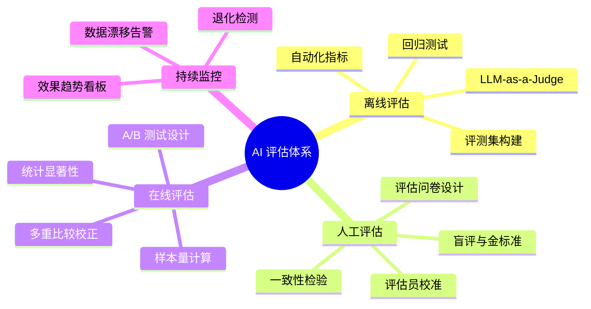

# AI 评估体系

## 概述

**"你怎么知道模型变好了？"**——这是 AI PM 面试中最容易被深度追问的问题，也是实际工作中最核心的能力之一。本章从 LLM-as-a-Judge、人工评估方法论、评测集构建、线上 A/B 测试统计四个维度，建立 AI PM 的系统性评估能力。

::: tip 学习目标
掌握 LLM 时代的评估方法论，能独立设计评估方案、构建评测数据集、解读 A/B 测试结果。
:::

---

## 一、知识图谱



---

## 二、离线评估——上线前的最后一道防线

### 2.1 传统指标在 LLM 时代的局限性

在传统 ML 时代，准确率/精确率/召回率/F1 是金标准。但在 LLM 时代，这些指标暴露了严重不足：

| 传统指标 | 在 LLM 场景中的问题 | 示例 |
|----------|-------------------|------|
| **准确率** | 过于粗糙——"差不多对"和"完全错"没有区别 | 用户问"怎么退货"，AI 回答"您可以退货，但需要注意运费问题"——答案方向对了但缺了运费的具体规则。准确率视角下算"对"，但用户体验差。 |
| **F1** | 适合分类，不适合生成式输出评估 | 客服回答不是"是/否"选择题，F1 无法捕捉"回答是否啰嗦""有没有编造信息" |
| **BLEU/ROUGE** | 基于 n-gram 匹配，不理解语义 | "可以退货"和"支持退货退款"语义相同但 BLEU 给低分——瞎给分 |

**结论**：LLM 时代的评估必须引入**多维度、细粒度**的方法。

### 2.2 LLM-as-a-Judge——用 AI 评估 AI

用 GPT-4 作为"裁判"评估另一个 AI 的输出质量，是目前业界最主流的方法。但用不好会变成"用一个有偏见的裁判判另一个有偏见的选手"。

**正确做法——结构化评估 Prompt**：

```
## 任务
你需要评估一段 AI 客服的回答质量。请阅读【用户问题】和【AI 回答】，在以下四个维度打分（1-5 分）：

1. 准确性 Accuracy：回答内容是否与参考资料一致？有没有编造？
2. 完整性 Completeness：是否覆盖了用户问题的所有要点？
3. 简洁性 Conciseness：回答是否精炼？有没有无关废话？
4. 友好度 Friendliness：语气是否友好、专业？

## 评分标准
- 5 分：完美，无可挑剔
- 4 分：基本正确，有小改进空间
- 3 分：部分正确，有明显遗漏或冗余
- 2 分：严重错误或无关回答
- 1 分：完全错误或有害

## 用户问题
{user_query}

## 参考资料（正确答案应该基于此）
{reference_documents}

## AI 回答
{ai_response}

## 输出格式
请按以下 JSON 格式输出评分和理由：
{
  "accuracy": {"score": 4, "reason": "..."},
  "completeness": {"score": 3, "reason": "..."},
  "conciseness": {"score": 5, "reason": "..."},
  "friendliness": {"score": 4, "reason": "..."},
  "overall": 4,
  "fatal_errors": []  // 如果有编造信息等致命错误，列在这里
}
```

::: warning LLM-as-a-Judge 的三个陷阱

**陷阱一：裁判模型自身的偏见。** GPT-4 倾向于给"更长、更详细"的回答更高分——但用户其实讨厌啰嗦。对策：在评分标准中明确"简洁是优点"，并用人工校准一个子集来验证 GPT-4 的评分是否与人类评分趋势一致。

**陷阱二：裁判模型对"自己人"更宽容。** GPT-4 评估 GPT-4 的回答时，有时会比对其他模型的回答更宽松。对策：如果可能，用不同的裁判模型交叉验证（如用 Claude 评估 GPT-4 的输出）。如果只能用一个裁判模型，至少做 10% 人工抽查验证。

**陷阱三：位置偏差。** 如果让裁判模型同时比较两个回答（A vs B），它可能天然倾向第一个或第二个。对策：随机交换顺序做两次，取平均；或者用单条评分而非配对比较。
:::

### 2.3 评测集构建——你的"黄金标准"

评测集是 AI 产品最重要的资产之一。构建方法：

**Step 1：确定覆盖范围**

| 维度 | 要求 |
|------|------|
| 场景覆盖 | 覆盖所有核心场景（退货/物流/优惠券），每种至少 50 条 |
| 难度分布 | 简单 40% + 中等 40% + 困难 20% |
| 边界 Case | 至少 20% 的样本是容易出错的边界场景 |
| 新鲜度 | 评测集中必须有 30% 的样本不在任何训练数据中 |

**Step 2：标注"标准答案"**

给每条评测样本标注的不是简单的"对/错"，而是：
- **标准答案**：正确的回答应该包含哪些要点
- **常见错误模式**：这个 Case 上模型容易犯哪类错误
- **可接受范围**：哪些回答虽然不够完美但可以算作通过

**Step 3：版本管理**

```
eval_set/
├── v1.0_202501_baseline.json    # 首批 200 条
├── v1.1_202503_补充退货.json     # 补充 50 条退货边界 Case
├── v1.2_202505_客服V2上线.json   # 新增 30 条多轮对话 Case
└── changelog.md                  # 每次更新的原因和变化
```

::: tip 实战经验
评测集需要定期"换血"。如果模型在某类 Case 上已经达到 98% 准确率，这些 Case 的区分度就很低了——保留 10 条做回归测试即可，其他替换为新的困难 Case。评测集不是越大越好，而是**越新、越有区分度**越好。
:::

---

## 三、人工评估——比自动化评估更重要的环节

### 3.1 为什么自动化评估不能替代人工评估

自动化指标告诉你"模型得分是多少"，人工评估告诉你**"用户实际感受如何"**。两者可能严重不一致。

::: details 真实案例
我们做过一次实验：同一批回答，LLM-as-a-Judge 打分 4.2/5，但真实用户满意度只有 3.6/5。差距的原因：LLM 裁判偏好"全面、详细的回答"，而用户觉得"太啰嗦了，我只是想知道退款到账时间"。
:::

### 3.2 人工评估的标准流程

**流程设计**：

```
评估准备 → 评估员培训 → 校准轮 → 正式评估 → 一致性检验 → 结果分析
```

**评估问卷设计示例**：

| 评估维度 | 问题 | 评分标准 |
|----------|------|---------|
| 正确性 | 回答的内容是否准确无误？ | 1-5，5=完全正确 |
| 完整性 | 是否回答了用户关心的所有方面？ | 1-5，5=完全覆盖 |
| 简洁性 | 是否用最少的话把事说清楚？ | 1-5，5=非常精炼 |
| 有用性 | 用户看完后问题是否被解决了？ | 是/否/部分 |

**评估员校准**：
- 准备 20 条"金标准样本"——已有正确答案且经多方确认的
- 评估员先独立打分 → 对比与金标准的差异 → 讨论不一致的打分 → 达成共识
- 正式评估开始前确保评估员间 Kappa ≥ 0.7

### 3.3 评估规模与频率

| 阶段 | 评估频率 | 每次样本量 | 评估员数量 |
|------|---------|-----------|-----------|
| POC/验证 | 一次性 | 50-100 条 | 1-2 人（可接受非正式） |
| 上线前 | 一次性 | 200-500 条 | 2-3 人（必须双人交叉） |
| 上线后日常 | 双周 | 100 条 | 2 人 |
| 大版本迭代 | 上线前 | 300-500 条 | 3 人 |

---

## 四、线上 A/B 测试——终极评判标准

### 4.1 A/B 测试设计六要素

1. **假设**：AI 客服能让人工转接率降低 ≥ 30%（不是"提升体验"——太模糊了没法测）
2. **指标**：主指标是人工转接率（OEC），辅助指标是用户满意度、响应时间
3. **样本量**：基于预期效应量和统计功效计算（见 4.2）
4. **随机分流**：用户级别的随机分流（按 user_id hash），避免 session 内的交叉污染
5. **实验周期**：至少覆盖一个完整的周——包含工作日和周末的数据波动
6. **护栏指标**：如果用户满意度下降 > 0.3 分 → 自动终止实验（"不能为了效率牺牲体验"）

### 4.2 样本量速算表

样本量取决于三个因素：基线转化率、最小可检测效应（MDE）、显著性水平和统计功效。

| 基线率 | MDE（最小可检测提升） | 每组所需样本数 |
|--------|---------------------|---------------|
| 50% | 5 个百分点 | ~1,600 |
| 50% | 10 个百分点 | ~400 |
| 20% | 5 个百分点 | ~1,000 |
| 20% | 3 个百分点 | ~2,800 |
| 5% | 2 个百分点 | ~3,500 |

::: tip 实战速记
大多数 AI 产品的核心指标基线在 20-50%，最小预期提升在 5-10 个百分点，所以**每组 800-1600 样本是最常见的需求**。按日活 × 实验比例估算实验天数。
:::

### 4.3 结果解读——别被 p 值骗了

| 常见误读 | 正确理解 |
|----------|---------|
| "p=0.04，说明实验组比对照组好" | "p=0.04 说明如果实际上没有差异，仅有 4% 的概率观察到当前这么大的差异"——不等于"实验组更好" |
| "p=0.06，说明没有效果" | "未达到统计显著性 ≠ 没有效果"——可能样本量不够或效应量太小 |
| "多个指标都有提升，p 值都 < 0.05" | "同时测 10 个指标，即使完全没效果，也有 40% 的概率至少一个指标 p < 0.05"——需要多重比较校正（Bonferroni 是最保守的） |

**PM 的 A/B 测试自查清单**：
- [ ] 样本量是否在实验开始前就计算好了？（不要中途 peek）
- [ ] 有没有预注册实验计划？（避免"测了 10 个指标然后只报告显著的"）
- [ ] 效应量是否有业务意义？（2% 的提升即使显著可能也不值得上线）
- [ ] 是否检查了分组的随机性？（A/B 组用户在关键特征上是否分布一致）

---

## 五、持续监控——上线不是结束

### 5.1 核心监控指标看板

| 层级 | 指标 | 监控频率 | 告警阈值 |
|------|------|---------|---------|
| **模型层** | 准确率、各类别 F1 | 每日 | 连续 3 天下降 > 5% |
| **数据层** | 输入特征 PSI | 每周 | PSI > 0.25 |
| **业务层** | 人工转接率、满意度 | 每日 | 连续 5 天下降 > 10% |
| **成本层** | API 调用量、推理延迟 | 实时 | 延迟 P99 > 5s |

### 5.2 退化检测的 SOP

```
触发告警 → 确认真实下降（排除波动）→ 隔离原因（模型/数据/业务变化？）
    → 如影响业务指标 → 回滚到上一稳定版本（先止血）
    → 根因分析 → 修复 → 重新上线 → 回检监控
```

---

## 六、面试追问合集

### Q1: 你怎么衡量一个生成式 AI 产品的质量？

::: details 答案

用三层评估框架：

**L1：自动化离线评估（快速、批量、可重复）**
- 传统指标（分类场景的 F1）
- LLM-as-a-Judge（多维度评分：准确性、完整性、简洁性、友好度）
- 回归测试（确保新版本不在旧 Case 上退步）

**L2：人工评估（定性校准）**
- 每两周抽取 100 条做人工打分
- 重点关注 LLM-as-a-Judge 和人工评分的一致性——如果偏离 > 0.5 分，说明评估 Prompt 需要调整

**L3：线上业务指标（终极标准）**
- A/B 测试验证核心业务指标
- 用户满意度 + 转人工率 + 响应时长

只依赖任何一层都会出问题。LLM 裁判有偏见，人工评估太贵太慢，线上 A/B 太慢且受噪声干扰——三层交叉验证才是可靠的。
:::

### Q2: LLM-as-a-Judge 的评分和人评不一致怎么办？

::: details 答案

不一致是正常的，需要系统性排查：

1. **确认不一致的方向和模式**：LLM 系统性偏高还是偏低？在哪些维度上分歧最大？是 LLM 太宽容（准确性给 4 分但人评觉得明显有错）还是 LLM 太苛刻（嫌回答不够全面但用户只需要 Yes/No）？

2. **调整评估 Prompt 中的评分标准**：如果 LLM 评分偏高——在 Prompt 里加"请严格评分，只有完全符合要求才能给 5 分"。如果 LLM 对简洁性理解有偏差——在评分标准中明确定义"简洁性的满分标准是'用最少的话讲清楚问题的所有要点，不添加无关信息'"。

3. **加入校准样本**：在评测 Prompt 里放 2-3 个"校准示例"——展示人类对某些回答的评分——让 LLM 校准自己的评分标准。

4. **如果上面都做了还是不一致**：承认 LLM 裁判在这个维度上的局限性，对该维度增加人工评分的权重，或在关键决策时避免单独依赖 LLM 评估。
:::

### Q3: 如何设计一个评测集来确保新 Prompt 不会引入退化？

::: details 答案

这是"回归测试"思维——你在更新 Prompt 时，新的 Case 效果好了，但不能让旧的 Case 效果变差。

1. **构建回归基准集**：从线上收集 200 条"当前版本处理得很好"的 Case（人工确认正确率 > 95%），这 200 条就是你的"不能退步"名单。

2. **每次 Prompt 更新后**：先跑回归基准集——任何一条 Case 从"正确"变成"错误"都属于退化，需要**强制修复**才能上线。

3. **建立"纠错样本库"**：把历史上让你翻过车的 Case 集中管理。每次 Prompt 更新时确保这些已知的坑没有被重新踩到。

这个方法我实践过——有一次我们改 Prompt 让模型在 90% 的场景下表现更好了，但回归基准集里有一条"用户问退货但用的是广东话口语"的 Case 从正确变成了错误。没有回归测试就直接上线的话，广东地区用户会收到错误回答——这个影响范围虽然小（约 3% 用户），但体验伤害很大。
:::

---

## 相关文档

- [AI 产品设计](./product-design)
- [数据与模型管理](./data-model-management)
- [实战案例：智能客服全流程](./case-study)
- [AI PM 面试高频题](./interview)