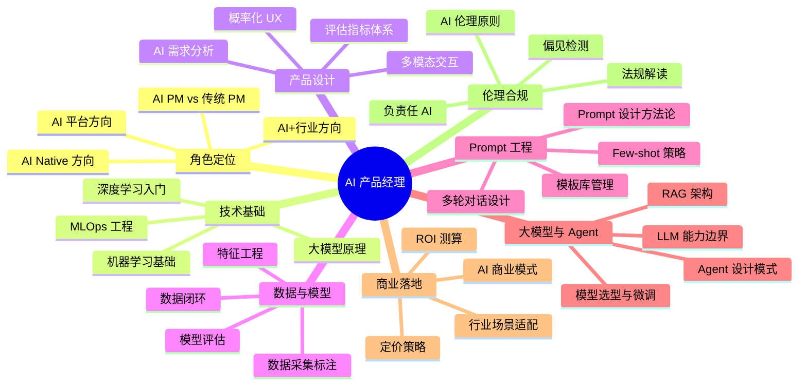

# AI 产品经理

## 模块概述

AI 产品经理（AI PM）是当下最炙手可热的职业方向之一——**将 AI 技术能力转化为用户价值与商业价值的关键枢纽**。本专题面向有志于转型 AI 产品经理的工程师、传统 PM、以及想建立产品思维的 AI 从业者，从**角色定位 → 技术基础 → 产品设计 → 数据管理 → Prompt 工程 → 大模型与 Agent → 商业落地 → 伦理合规 → 面试实战**九大模块，形成完整的 AI 产品经理能力闭环。

> 2025 年 Gartner 行业报告指出，成功实现 AI 商业化的企业中，**87%** 配备了专业化的 AI 产品经理团队。AI PM 岗位需求同比增长 **240%**。

::: tip 核心认知
AI 产品经理的核心使命不是"把需求翻译给工程师"，而是**在技术可行性、用户体验与商业价值之间找到动态平衡点**。这是一个需要概率思维、数据直觉和商业嗅觉的复合型角色。
:::

::: info 适用人群
- 正在转型 AI 产品方向的传统产品经理
- 想补齐产品思维的算法工程师 / 后端工程师
- 对 AI 产品感兴趣的零基础学习者
- 准备 AI PM 面试的求职者
:::

## 知识图谱

## 核心模块

### 🧭 角色定位

| 模块 | 核心内容 |
|------|----------|
| [AI PM 角色定位与三大方向](./role-overview) | 与传统 PM 的本质差异、AI Native / 平台 / 行业三大方向的差异对比、能力模型 |

### 🧱 技术基础

| 模块 | 核心内容 |
|------|----------|
| [AI 技术基础](./tech-basics) | 机器学习核心概念、深度学习入门、大模型原理、MLOps、面试高频技术题 |

### 🎨 产品设计

| 模块 | 核心内容 |
|------|----------|
| [AI 产品设计](./product-design) | 需求分析方法、概率化 UX 设计、评估指标体系、PRD 撰写规范 |

### 📊 数据与模型管理

| 模块 | 核心内容 |
|------|----------|
| [数据与模型管理](./data-model-management) | 数据采集标注、特征工程、模型评估调优、数据闭环与漂移监控 |

### ✍️ Prompt 工程

| 模块 | 核心内容 |
|------|----------|
| [Prompt 工程（AI Native 核心）](./prompt-engineering) | System Prompt 设计、Few-shot 策略、模板库 A/B 测试、多轮对话管理 |

### 🤖 大模型与 Agent

| 模块 | 核心内容 |
|------|----------|
| [大模型技术栈与 Agent 设计](./large-model) | LLM 能力边界评估、RAG 架构、Agent 设计模式、模型选型与微调策略 |

### 💰 商业落地

| 模块 | 核心内容 |
|------|----------|
| [AI 商业落地与策略](./business-commercialization) | 商业模式设计、定价策略、行业场景适配、GTM 策略、ROI 计算 |

### ⚖️ 伦理合规

| 模块 | 核心内容 |
|------|----------|
| [AI 伦理合规与治理](./ethics-compliance) | 公平性与偏见检测、EU AI Act 解读、中国监管政策、负责任 AI 设计 |

### 🎯 面试实战

| 模块 | 核心内容 |
|------|----------|
| [AI PM 面试高频题 (33+)](./interview) | 33 道面试高频题覆盖 9 大板块，完整实战答案集中收录 |

### 📦 实战与工具

| 模块 | 核心内容 |
|------|----------|
| [AI 评估体系 ✨](./evaluation) | LLM-as-a-Judge、人工评估方法论、评测集构建、A/B 测试统计方法 |
| [工具链与工作流 ✨](./tools-and-workflow) | Prompt 管理、实验追踪、数据标注、Agent 搭建、API 调试 |
| [实战案例：智能客服 0→1 ✨](./case-study) | 端到端全流程：需求验证→MVP 设计→数据准备→模型选型→Prompt 迭代→灰度上线 |
| [产品拆解与前沿话题 ✨](./product-teardown) | Perplexity/Cursor/ChatGPT 深度拆解、MCP 协议、AI Coding、AI 浏览器 |

---

## 面试高频题速览

### Q1: AI 产品经理和传统产品经理的核心区别是什么？

::: details 点击查看答案
**核心差异在四个维度：**

1. **决策逻辑**：传统 PM 依赖确定性规则，AI PM 需要概率思维——你必须接受模型输出"有时是对的有时是错的"，然后设计降级和纠错机制。
2. **核心驱动**：传统产品是"功能+体验"双轮驱动，AI 产品是"数据-模型-场景"三角驱动。数据质量、模型能力、场景适配三个变量互相耦合。我们在优化客服 Bot 时发现，把 BERT 换成 GPT-4o，不调数据和场景，准确率只提升了 3 个点；但把标注规范改了一版、加了 200 条边界 Case 训练数据，同样的 BERT 提升了 8 个点。
3. **迭代模式**：传统 PM 按版本发布，AI PM 按数据闭环持续迭代。我们项目的实际工作量分布大概是：数据质量和标注占 40%，模型调优占 30%，功能开发只占 30%。这不是说功能不重要，而是 AI 产品的"功能"质量取决于数据底子。
4. **技术深度**：传统 PM 能理解 API 文档就够了；AI PM 必须能判断"这个需求用现有模型能不能做、大概做到什么程度"。比如医疗影像产品，你得知道小病灶（<3mm）模型识别不准，才能设计合理的医生复核流程。否则产品方案写了一大堆，技术上根本行不通。
:::

### Q2: 大模型时代 AI PM 的新定位是什么？

::: details 点击查看答案
大模型时代的核心变化是：**产品经理的价值从"功能设计"转向"能力探索"**。以前你设计一个推荐系统，功能边界是清晰的——用户画像、内容标签、排序策略，每个模块都有明确的功能定义。现在你拿着 GPT-5 这样的大模型，产品形态本身就是变量——你可能今天用它做客服问答，明天发现它能做代码审查，后天又发现它能做合同审核。

这个变化带来了三个新要求：

1. **Prompt 即产品**：以前 PRD 是产品规格，现在 Prompt 模板库是产品规格。Notion AI 的团队维护了 2000+ 变体的 Prompt 矩阵，A/B 测试来定最优。你得像个 "Prompt 产品经理"一样思考。
2. **模型选型能力**：公有云 API vs 行业精调模型 vs 私有化部署，三种方案的选型决定了成本结构和能力上限。百度千帆平台用户调研显示企业对大模型的需求呈"三分天下"格局——35% 用公有云 API、28% 需要精调模型、37% 要求全链路私有化。你得根据场景和预算做出判断。
3. **合规前置**：欧盟 AI 法案实施后，产品的合规设计不是上线前打个勾，而是从需求阶段就要嵌入。Stability AI 的产品经理 50% 的时间在搞内容过滤机制，这已经成了核心工作之一了。
:::

### Q3: 三个 AI PM 方向（AI Native / AI 平台 / AI+行业）怎么选？

::: details 点击查看答案
这三个方向对能力结构的要求完全不同，选错了硬转成本很高：

| 方向 | 核心能力 | 典型公司 | 适合背景 |
|------|---------|---------|---------|
| **AI Native** | Prompt 设计、多模态交互、模型能力挖掘 | 月之暗面、智谱 AI、MiniMax | 有过 C 端产品经验 + 能快速理解模型能力 |
| **AI 平台** | MLOps 工具链、分布式训练原理、开发者体验 | 百度千帆、阿里云 PAI、AWS SageMaker | 有算法或工程背景、懂开发者痛点 |
| **AI+行业** | 行业 Know-how + 技术选型判断力 + 变革管理 | 京东数科、平安科技、联影智能 | 有垂直行业经验、懂业务语言 |

我的建议：**技术背景强的优先 AI 平台方向，C 端产品经验丰富的优先 AI Native，有行业经验的优先 AI+。** 零基础入行的，建议从 AI+行业入手——门槛相对低，行业知识是护城河，AI 技术可以在工作中边学边用。
:::

---

::: danger 容易翻车的点
- 只会写 Prompt 但无法评估模型能力边界——设计出技术上行不通的方案
- 对数据闭环理解不到位——以为 AI 产品上线了就完事了，不知道"数据漂移"会悄悄搞垮模型
- 混淆三个 AI PM 方向——用 AI 平台 PM 的思路去面试 AI Native 岗位，肯定翻车
- 忽视合规——欧盟 AI 法案不是"以后再说"，合规设计现在就是产品设计的必修课
- 面试时说不清自己做过什么——AI PM 面试最看实际项目，简历上写"参与大模型项目"但不讲细节很扣分
:::

## 按你的背景导航

不同背景的读者，建议按以下优先级阅读：

| 背景 | 优先阅读模块 | 说明 |
|------|------------|------|
| **转型 PM（传统产品经理 → AI PM）** | 角色定位 → 技术基础 → 评估体系 → 产品设计 → 工具链 → 案例 | 先理解角色差异，再补技术短板，用案例把知识串起来 |
| **算法转 PM** | 角色定位 → 产品设计 → 评估体系 → 商业落地 → 案例 | 技术不是问题，重点补产品思维、评估方法论和商业感 |
| **零基础/校招** | 角色定位 → 技术基础 → 案例 → 产品拆解 → 面试题 | 先了解"AI PM 是干什么的"，用案例建立体感，再系统学习 |
| **面试突击** | 面试题 → 案例 → 评估体系 → 产品拆解 | 以面试题为主线，针对薄弱点补充对应模块 |

---

## 8 周自学计划

### 第 1 周：认知建立
- 📖 阅读：[AI PM 角色定位与三大方向](./role-overview)
- 🎯 目标：理解三个方向差异，明确自己的转型路径
- ✅ 自检：能说出 AI PM 和传统 PM 的四个本质差异

### 第 2 周：技术补课（上）
- 📖 阅读：[AI 技术基础](./tech-basics)（机器学习 + 深度学习部分）
- 🛠️ 实操：跑通 Andrew Ng Coursera 课程的前 3 周内容
- ✅ 自检：能解释监督学习/无监督学习/强化学习的区别

### 第 3 周：技术补课（下）
- 📖 阅读：[AI 技术基础](./tech-basics)（大模型原理 + MLOps 部分）
- 🛠️ 实操：用 OpenAI Playground 测试 20+ 个不同 Prompt
- ✅ 自检：能说清楚 Token / Embedding / Attention 的心智模型

### 第 4 周：AI 产品设计方法论
- 📖 阅读：[AI 产品设计](./product-design) + [评估体系](./evaluation)
- 🛠️ 实操：写一份包含模型需求章节的 AI PRD
- ✅ 自检：能独立完成 AI 适用性矩阵评估一个需求

### 第 5 周：数据与 Prompt
- 📖 阅读：[数据与模型管理](./data-model-management) + [Prompt 工程](./prompt-engineering)
- 🛠️ 实操：设计一份标注规范 + 写一个完整的 System Prompt
- ✅ 自检：能说出 Prompt 五要素，并能举一个自己设计的 Prompt 例子

### 第 6 周：大模型与工具链
- 📖 阅读：[大模型与 Agent](./large-model) + [工具链与工作流](./tools-and-workflow)
- 🛠️ 实操：用 Dify 搭一个带知识库的 QA Bot
- ✅ 自检：能解释 RAG 和 Fine-tuning 的适用场景差异

### 第 7 周：产品思维与实战
- 📖 阅读：[实战案例](./case-study) + [产品拆解与前沿](./product-teardown)
- 🛠️ 实操：拆解 3 个 AI 产品（Perplexity、Cursor、ChatGPT），写出你的产品分析
- ✅ 自检：能对一个 AI 产品做深度拆解，说出它的产品逻辑和可改进之处

### 第 8 周：面试冲刺
- 📖 阅读：[面试高频题 (33+)](./interview) + 回顾所有笔记
- 🛠️ 实操：做 3 次模拟面试（找朋友或录音自测） + 准备 3 个项目 STAR
- ✅ 自检：33 道题中有 25 道以上能流畅回答

---

## AI PM 能力自评表

对照这个评估表，定位自己的能力短板：

| 能力维度 | 1 分（新手） | 2 分（入门） | 3 分（熟练） | 4 分（精通） | 5 分（专家） |
|----------|------------|------------|------------|------------|------------|
| **技术理解力** | 不懂 ML 基本概念 | 能说清 ML/DL 基本原理 | 能判断需求的技术可行性 | 能独立做模型选型决策 | 能与算法团队深度对话 |
| **产品设计力** | 只懂功能设计 | 理解概率化 UX 的概念 | 能设计 AI 产品的降级策略 | 能独立设计完整的 AI 产品方案 | 能定义行业级的 AI 产品范式 |
| **数据管理力** | 从未设计过标注规范 | 理解数据标注的基本流程 | 能设计标注规范并做质量控制 | 能搭建完整的数据闭环体系 | 能构建数据驱动的产品飞轮 |
| **Prompt 能力** | 只会用默认 Prompt | 能写基本的结构化 Prompt | 能迭代优化 Prompt 并 A/B 测试 | 能设计复杂的 Few-shot 策略 | 能定义团队的 Prompt 工程规范 |
| **商业思维** | 只关注功能 | 能算清 API 成本 | 能设计定价策略 | 能做 ROI 测算说服管理层 | 能从 0 到 1 定义 AI 商业模式 |
| **伦理合规** | 不知道有合规要求 | 了解 EU AI Act 基本框架 | 能在设计阶段考虑公平性 | 能独立做 Bias 审查和修正 | 能定义产品的负责任 AI 标准 |

**评分方法**：

- **≥ 24 分**：你已经是一名称职的 AI PM，继续深化你的核心方向
- **18-23 分**：基础扎实，需要有针对性的提升短板维度
- **12-17 分**：处于转型期，重点补技术基础和产品设计
- **< 12 分**：从"角色定位"和"技术基础"两个模块开始系统学习

::: details 推荐资源
- **入门书籍**：《人工智能产品经理》- 苏杰 / 《AI 产品经理》实践指南
- **技术课程**：Andrew Ng 机器学习 Coursera / Fast.ai 实战 / DeepLearning.AI LangChain 系列
- **行业报告**：Gartner AI Hype Cycle / 各券商 AI 行业研究报告
- **社区**：即刻 AI 产品经理圈子 / 知乎 "AI 产品"话题
- **工具**：OpenAI Playground / Dify / LangSmith / LabelStudio
:::