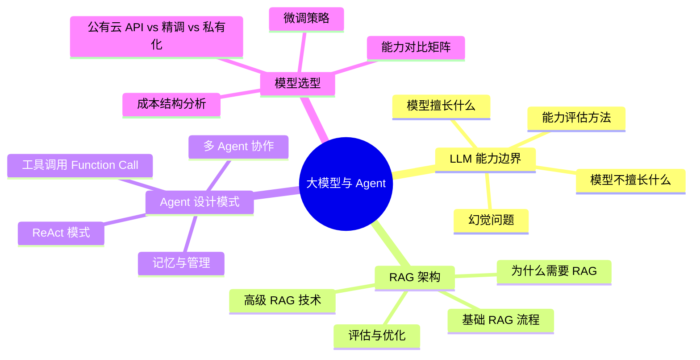
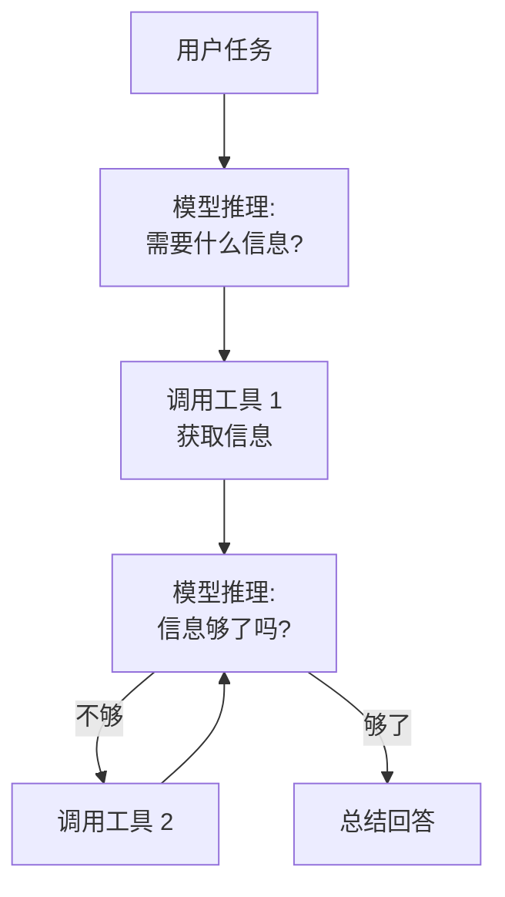

# 大模型技术栈与 Agent 设计

## 概述

大模型时代，AI PM 的核心挑战从"功能设计"转向了**能力探索**——如何挖掘基座模型尚未被发现的应用潜力、如何设计 Agent 的推理与行动边界、如何选型最合适的模型方案。本章从 LLM 能力边界评估、RAG 架构、Agent 设计模式、模型选型四个维度建立系统认知。

::: tip 学习目标
理解 LLM 的能力边界和局限性、RAG 架构的优缺点、Agent 的核心设计模式，能做出正确的模型选型决策。
:::

---

## 一、知识图谱



---

## 二、LLM 能力边界评估

### 2.1 大模型擅长和不擅长的

| 擅长的 | 不擅长的 | PM 需要做的 |
|--------|---------|------------|
| 文本理解、摘要、翻译 | 精确数值计算 | 涉及数学计算的答案做后验检查 |
| 开放式问答、创意写作 | 记住精确的事实 | 用 RAG 补充事实性知识 |
| 格式转换（JSON/XML/表格） | 执行精确的规则逻辑 | 规则判断交给代码，不要靠 Prompt |
| 多步推理（CoT） | 时间/日期相关的精确计算 | 时间计算用函数调用而不是让模型自己算 |
| Few-shot 分类 | 做它没见过的事（如果没训练过） | 提前验证核心场景的可行性 |

### 2.2 幻觉问题

**幻觉（Hallucination）** = 模型自信地说出它不知道的事情。

::: warning 面试追问
**Q: 你所在产品的用户反馈"AI 胡说八道"，你怎么排查和解决？**

**A:** 幻觉问题的根源是模型没有"我不知道"的概念——它的训练目标是"总是给出最合理的回答"，而不是"给出正确的回答"。

排查步骤：
1. 确认幻觉类型：是事实幻觉（编造了不存在的信息）还是忠实度幻觉（输入里有 A，输出却说 B）？
2. 事实幻觉的解法：上 RAG——让模型基于检索到的文档回答，在 System Prompt 里加"只能基于参考资料回答，不知道就说不知道"的约束。
3. 忠实度幻觉的解法：优化 Prompt 的精确性，减少模型发挥空间；增加输出验证（用另一个 Prompt 检查输出是否和输入一致）。
4. 兜底方案：在产品交互层面标注"AI 生成内容仅供参考"，对高风险场景（医疗、法律、金融）必须有人工审核环节。

**一个容易被忽略的点：用户的"胡说八道"可能不是模型的问题，而是 Prompt 的问题。** 如果你问"这个药的副作用是什么"但不给任何药品说明书，模型没有知识来源就只能编——这不是模型的问题，是产品设计的问题。
:::

---

## 三、RAG 架构 —— 让 LLM 说真话

### 3.1 为什么需要 RAG？

- 基座模型的知识有截止日期（GPT-4 只训练到 2023 年 12 月）
- 私有数据模型没见过（你的公司内部文档、客户信息）
- 事实性知识模型可能记错（概率生成，不是数据库查询）

RAG 的思路很简单：**先检索相关文档，再让模型基于文档回答**。相当于"给模型发一份参考资料，让它考前翻一翻再答题"。

### 3.2 基础 RAG 流程


### 3.3 RAG 的常见优化

| 优化方向 | 方法 | 效果 |
|----------|------|------|
| **检索质量** | 混合检索（语义+关键词）、重排序 Rerank | 召回率提升 10-20% |
| **分块策略** | 按语义段落分块、滑动窗口 | 减少信息断裂 |
| **多级检索** | 粗排→精排两级检索 | 成本降低 30-50% |
| **查询优化** | 对用户输入做"意图改写"再检索 | 复杂问题效果提升显著 |

::: tip 实战经验
RAG 最容易被低估的问题是"分块"。把一份 100 页的合同每 500 Token 硬切一刀——很多条款被拦腰截断，模型看到的是碎片。正确的做法是按段落边界切分，并用滑动窗口让相邻块有重叠——确保每个知识点至少完整出现在一个块里。
:::

---

## 四、Agent 设计模式

### 4.1 ReAct 模式（Reasoning + Acting）

这是目前 Agent 最主流的设计模式——模型**先推理要做什么，再调用工具执行，拿到结果后再推理下一步**。



### 4.2 Function Call（工具调用）

作为 AI PM，你需要定义 Agent 可以调用哪些"工具"：

```json
{
  "tools": [
    {
      "name": "search_product",
      "description": "根据关键词搜索商品",
      "parameters": {
        "keyword": "搜索关键词（string）",
        "category": "商品类目，可选值：electronics/clothing/food",
        "limit": "返回数量上限，默认 10"
      }
    },
    {
      "name": "check_order_status",
      "description": "查询订单状态",
      "parameters": {
        "order_id": "订单编号（string）"
      }
    }
  ]
}
```

**定义工具的原则**：
- 每个工具做一件事，描述要精确
- 必填/选填参数要标清楚
- 设置工具调用失败时的降级策略

### 4.3 多 Agent 协作

| 模式 | 说明 | 适用场景 |
|------|------|---------|
| **Sequential** | Agent A 输出 → Agent B 输入 | 流水线（文档分析→总结→翻译） |
| **Hierarchical** | 主 Agent 分配任务给子 Agent | 复杂任务拆分（写报告：数据收集 + 分析 + 写作） |
| **Debate** | 多个 Agent 讨论后达成共识 | 需要多角度验证的决策 |

---

## 五、模型选型决策

### 5.1 三种部署方案的选型矩阵

| 维度 | 公有云 API | 行业精调模型 | 全链路私有化 |
|------|-----------|------------|-------------|
| **成本** | 按量付费，启动成本低 | 中等（训练+推理） | 高（GPU 集群 + 运维） |
| **数据安全** | 数据发给第三方 | 可私有化训练数据 | 全链路数据不出域 |
| **可控性** | 低（API 版本策略不可控） | 中等 | 高 |
| **效果上限** | 最高（用最强基座模型） | 中等 | 取决于基座模型能力 |
| **适用场景** | POC / 快速上线 / 非敏感数据 | 有特定领域知识需求 | 金融、政务等高合规要求 |
| **典型推理延迟** | 100ms - 2s | 50ms - 500ms | 50ms - 500ms |

::: tip 实战原则
90% 的场景先用公有云 API 验证需求。跑通之后再考虑成本优化和安全需求——过程是 API → 积累数据 → 基于数据微调 → 自部署。不要一上来就私有化，很可能你花了三个月搭完基建发现需求不成立。
:::

### 5.2 Fine-tuning（微调）的决策框架

| 什么时候微调 | 什么时候不微调 |
|-------------|--------------|
| Prompt 怎么调都达不到效果要求 | Prompt 就能达到目标准确率 |
| 有 500+ 条高质量标注数据 | 数据量太少（<200 条效果不稳定） |
| 任务稳定，不会频繁变动 | 任务还在快速变化（微调跟不上需求） |
| 推理成本太高需要用小模型 | 推理成本在可接受范围内 |
| 输出风格/格式需要严格控制 | 输出可以灵活调整 |

---

## 六、面试追问合集

### Q1: RAG 和微调（Fine-tuning）的区别？什么场景用哪种？

::: details 答案

RAG 是"让模型查资料再答题"，微调是"让模型记住新知识"。核心区别：

| | RAG | Fine-tuning |
|------|-----|------------|
| 知识更新 | 实时（更新知识库即可） | 需要重新训练 |
| 幻觉控制 | 较好（有文档约束） | 一般 |
| 推理成本 | 多一次检索的延迟和 Token | 无额外开销 |
| 私有数据 | 检索时传入 | 训练时吸收 |

**选择标准**：知识密集型用 RAG（问答、搜索）、风格/格式/特定领域"语感"用微调。最佳实践是两者结合——先 RAG 检索到相关文档，然后精调模型基于文档回答问题——效果 SOTA。
:::

### Q2: 设计一个 Agent 系统时，需要考虑哪些问题？

::: details 答案

从产品角度考虑六个核心问题：

1. **行动边界**：Agent 能做什么、不能做什么？比如客服 Agent 能查订单、能退款，但不能自己直接退款超过 200 元——需要转入人工审批。
2. **终止条件**：Agent 什么时候停止？无限循环是所有 Agent 系统的噩梦。设置最大步数（如 5 步）、设置置信度阈值（推理置信度低于 70% 转人工）。
3. **人类监督**：哪些操作需要人工确认？钱/权限/删除/外发通讯——这四类操作必须有"人类审批节点"。
4. **工具调用失败处理**：搜不到商品怎么办？API 超时怎么办？每个工具调用都需要定义失败降级策略。
5. **记忆与上下文管理**：长对话如何管理历史？对话历史截断多长？哪些信息需要持久存储？
6. **安全边界**：Agent 会不会被用户诱导去执行不当操作？工具调用的参数是否做了安全校验？
:::

### Q3: 如何向管理层汇报"为什么要用大模型"而不是传统 ML？

::: details 答案

我一般用两个指标和一张对比表来说服：

**两个指标**：
1. **研发效率**：大模型方案从 POC 到上线大概率是传统 ML 方案的 1/3-1/5 时间——因为不需要标注大量数据、不需要从零训模型、不需要建特征工程 Pipeline。
2. **能力天花板**：传统 ML 在复杂理解/推理任务上天然有上限——你没法用 BERT 做一个能理解"合同里的隐含风险点"的系统，但 GPT-4o 可以。

**对比表**：

| | 传统 ML | 大模型 |
|------|---------|--------|
| 研发周期 | 3-6 个月 | 2-6 周 |
| 标注成本 | 数万条 | 数十到数百条 |
| 能力范围 | 单一任务 | 通用理解 + 多任务 |
| 维护成本 | 中等 | 高（API 费用持续产生） |

核心论述是：**大模型帮你把"不确定性"从"能不能做"转移到"能不能低成本做"。** 以前要先花 3 个月证明技术可行，现在 2 周出 Demo——管理层更喜欢这种"快速验证，小步试错"的节奏。
:::

---

## 六、多模态 AI 产品设计

### 6.1 为什么 AI PM 必须关注多模态

2024-2025 年，多模态 AI 从"实验室玩具"变成了"产品标配"。GPT-4o 的原生多模态（文本+图像+语音一体）、Claude 3.5 Sonnet 的视觉理解、Sora/可灵的视频生成——意味着 AI PM 的工作范围已经从"纯文本"扩展到**全感官交互**。

**产品侧的变化**：
- 文字客服 → 语音 + 图片客服（用户拍破损商品直接上传图片）
- 文本搜索 → 以图搜图 + 视频搜索
- 纯文字报告 → 图文混排的 AI 生成内容

### 6.2 多模态模型的能力矩阵

| 模态组合 | 典型场景 | 代表模型 | PM 需要关注的问题 |
|----------|---------|---------|-----------------|
| **文本→文本** | 客服、写作、翻译 | GPT-4o, Claude, DeepSeek | 已回答的准确性和风格控制 |
| **图像→文本** | OCR 识别、图表理解、医疗影像辅助诊断 | GPT-4o Vision, Claude 3.5 Sonnet | 识别准确率、对模糊/遮挡/低质量图片的鲁棒性 |
| **文本→图像** | 海报生成、产品设计稿、Logo 设计 | DALL·E 3, Midjourney, FLUX | 可控性（能不能精确改某个元素）、版权问题 |
| **文本→视频** | 短视频生成、产品 Demo | Sora, 可灵, Runway Gen-3 | 物理真实感、时长限制、成本（远高于图片） |
| **文本→语音 / 语音→文本** | 语音助手、实时翻译 | GPT-4o Voice, ElevenLabs | 延迟、情感表达、方言/口音识别 |
| **全模态（输入输出都支持多模态）** | 下一代 AI 交互 | GPT-4o, Gemini 2.0 | 模态间切换的流畅度、交互延迟 |

### 6.3 多模态产品的 UX 设计模式

与纯文本产品不同，多模态产品的交互设计有一组全新的模式：

| 模式 | 说明 | 产品案例 |
|------|------|---------|
| **视觉锚定** | 用户上传图片后，AI 围绕图片中的具体区域/元素回答 | ChatGPT Vision 中用户可以圈出图片的某一部分追问 |
| **多模态混合输入** | 用户同时发送文字 + 图片 + 语音，AI 综合理解后回复 | 微信 AI 助手：拍张照片 + 语音说"帮我看下保质期" |
| **生成+编辑循环** | AI 生成图片后，用户可以"把这个变蓝色""把人去掉" | Midjourney 的 Vary Region |
| **跨模态检索** | 用文字搜图片、用图片搜视频、用语音搜文字 | 淘宝"拍立淘"搜同款 |
| **语音优先交互（VUI）** | 免提/驾驶/视障场景下的纯语音 AI 交互 | GPT-4o Advanced Voice Mode |

### 6.4 多模态产品的 PM 特有挑战

**挑战一：评估比文本更难。**

文本回答可以用准确率/F1/LLM-as-a-Judge来评估。但"这张 AI 生成的图片好不好看"——审美是主观的，没有标准答案。

实战做法：
- 图像生成产品：用 **ELO 评分**（用户 A/B 选择哪个更好）代替绝对评分
- 视频生成产品：按"是否包含用户要求的元素"（一致性）+ "画面是否自然"（质量）双维度评估
- 语音产品：MOS（Mean Opinion Score，1-5 分的主观音质评分）仍是金标准

**挑战二：成本结构完全不同于文本。**

| 模态 | 单次成本对比 | 成本约束对产品设计的影响 |
|------|------------|----------------------|
| 文本（GPT-4o，200 token 输出） | ~¥0.005 | 几乎无感知 |
| 图像（DALL·E 3，1024×1024） | ~¥0.30 | 需设置每日生成上限 |
| 视频（Sora，5 秒 720p） | ~¥3-30 | 必须按需付费或严格配额 |
| 语音（GPT-4o Voice，1 分钟对话） | ~¥0.15 | 可接受，但长对话需注意 |

**挑战三：用户的期望被"人"拉高了。**

用户不会把文本 AI 和真人作家比较，但会把 AI 生成的图片和摄影师比较、把 AI 语音和真人主播比较。这意味着多模态产品的容错空间更小——一张"手指数量不对"的图比一段"措辞不太准"的文字更让用户觉得"这 AI 不行"。

### 6.5 是否需要新增一个"多模态 PM"方向？

不需要。多模态是 AI PM 的**必备技能**而非独立方向——就像移动互联网时代的 PM 不需要区分"iOS PM"和"Android PM"。但需要知道各自的基础：
- 做语音产品 → 了解 ASR（语音识别）、TTS（语音合成）、VAD（语音活动检测）的基本概念
- 做视觉产品 → 了解 Stable Diffusion 的基本原理（降噪扩散）、ControlNet（精确控制）、LoRA（风格微调）
- 做视频产品 → 了解帧率、关键帧、动作一致性等基本问题

---

## 相关文档

- [AI 技术基础](./tech-basics)
- [Prompt 工程](./prompt-engineering)
- [AI 评估体系](./evaluation)
- [实战案例：智能客服全流程](./case-study)
- [AI PM 面试高频题](./interview)