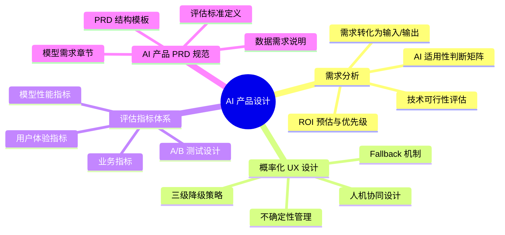
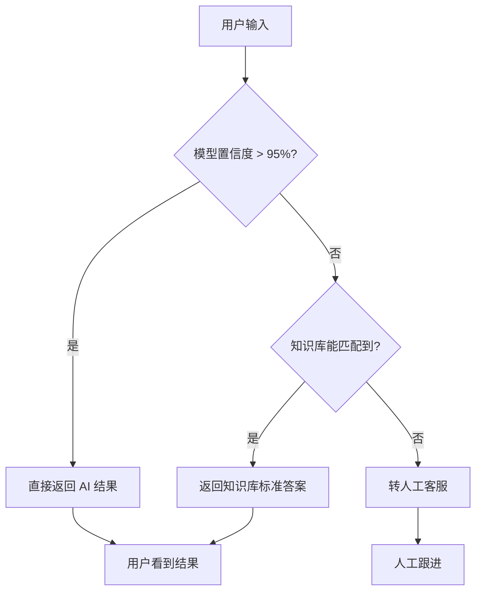

# AI 产品设计

## 概述

AI 产品的设计哲学与传统产品存在本质差异——**你需要在不确定性中构建用户体验**。传统产品的"确定按钮就是确定"在 AI 产品中变成了"模型的回答有 90% 准确率，你该如何让用户接受另外 10% 的不准确"。本章从需求分析、概率化 UX、评估指标、PRD 规范四个维度，建立 AI 产品设计的核心能力。

::: tip 学习目标
掌握 AI 产品需求挖掘方法、概率化 UX 设计原则、评估指标体系构建，并能独立撰写一份 AI 产品 PRD。
:::

---

## 一、知识图谱



---

## 二、AI 产品需求分析

### 2.1 AI 适用性判断矩阵

不是所有问题都适合用 AI 解决。作为 AI PM，你的第一项核心能力是判断**这个需求用 AI 做是否划算**。

| 判断维度 | 适合用 AI | 不适合用 AI | 边界模糊时怎么办 |
|----------|----------|------------|-----------------|
| **数据可得性** | 有历史积累的标注数据，或能低成本获取 | 数据涉及隐私、合规红线、或完全从零收集 | 先做小规模数据采集实验，看质量和成本 |
| **问题确定性** | 规则复杂多变、难以穷举 | 规则简单明确、if/else 就能搞定 | 算一下规则实现和模型训练的研发成本对比 |
| **错误容忍度** | 允许一定比例的错误（推荐、客服） | 零容忍错误（医疗处方、金融交易） | 设计"AI 初筛 + 人工复核"流程 |
| **规模效应** | 处理量大、人工成本高 | 总处理量很小、人工就能搞定 | 算 ROI：AI 成本 vs 人工成本 × 处理量 |
| **场景可复现** | 场景相对稳定，输入输出模式清晰 | 每次都不一样，很难抽象出规律 | 先限定场景再扩展 |

::: details 实战案例：什么时候不应该用 AI？

我们之前做过一个企业内部的知识库问答项目。业务方最开始提的需求是"做一个 AI 问答机器人，回答员工关于 HR 政策的任何问题"。

问题在于——HR 政策的"答案"很多是模糊的。"试用期多久"有明确答案，"我的这个情况能不能报销"就完全是 Case-by-case 的判断。AI 可以回答前者，但后者需要人工判断。

正确的做法是：把需求拆成"确定性问答"（AI 自动回复）和"模糊咨询"（AI 收集必要信息后转人工）。这样 AI 做的是它擅长的，而不是硬做它不擅长的。**不是所有自然语言理解需求都值得用 AI——如果规则就能覆盖 80%，用规则可能更划算。**
:::

### 2.2 将业务需求转化为模型输入/输出

这是 AI PM 最核心的"翻译"能力。

**原始业务需求**：帮用户找到合适的金融产品。

**拆解后的模型输入/输出定义**：

| 要素 | 定义 |
|------|------|
| **输入** | 用户画像向量（年龄/收入/风险偏好/资产规模）+ 交互上下文（当前查看的产品类别） |
| **输出** | 推荐产品列表（top-5），每条附带推荐理由（可解释性）和匹配度分数（置信度） |
| **样本量** | 预估需要 500 万+ 用户行为日志作为训练数据 |
| **重要约束** | 推荐结果中不能出现超出用户风险承受能力的金融产品（合规硬约束） |

::: warning 面试追问
**Q: 业务方说"帮我用 AI 提升用户体验"，你怎么拆？**

**A:** "提升用户体验"这个需求太模糊了，我一定会追问三个问题：

1. **具体指标是什么？**——是 NPS 提升 10%？还是客服人工转接率降低 20%？还是用户平均停留时长增加？没有量化目标的需求没法评估效果。

2. **用户的核心痛点是什么？**——是信息过载（需要推荐）？是查找效率低（需要搜索）？是决策困难（需要对比分析）？不同痛点对应不同的 AI 方案。

3. **可接受的成本/周期是多少？**——如果是两周内要上线，那大概率只能用现有模型 API + 简单 Prompt；如果愿意花三个月自研，可以考虑精调模型。方案的天花板取决于资源。
:::

---

## 三、概率化 UX 设计

### 3.1 不确定性管理的核心原则

传统产品的用户心智是"我点这个按钮，就一定会发生这件事"。AI 产品打破了这层确定性——用户说一句话，模型的回答可能是对的也可能是错的。

**三个核心设计原则**：

1. **不伪装确定性**：不要把概率输出包装成确定性结论。不要说"这是最佳方案"，而要说"根据分析，这个方案匹配度最高（92%）"。让用户知道 AI 也有不确定的时候。

2. **渐进式置信展示**：高置信度（>95%）→ 直接呈现结果；中置信度（80-95%）→ 展示结果 + 标注"建议核实"；低置信度（<80%）→ 转人工或给多个备选方案。

3. **错误成本最小化**：设计时先问"如果模型错了，后果是什么？"——推荐系统推荐了不感兴趣的物品（用户无视就好）vs 医疗 AI 漏诊了早期癌症（可能致命）。前者的错误成本低，设计可以"激进"一点；后者的错误成本极高，必须有严格的复核机制。

### 3.2 三级降级策略（Fallback）

这是 AI 产品最经典的设计模式：



### 3.3 人机协同设计

| 协同模式 | AI 做什么 | 人做什么 | 适用场景 |
|----------|---------|---------|---------|
| **AI 主导** | 自动完成决策或操作 | 仅在异常时介入 | 推荐系统、垃圾邮件过滤 |
| **人主导** | 提供建议和辅助信息 | 做出最终决策 | 医疗诊断、金融投资建议 |
| **人机共诊** | AI 和人独立判断后比对 | 不一致时升级处理 | 医疗影像判读、法务审查 |

---

## 四、AI 产品评估指标体系

### 4.1 三层评估模型

| 层级 | 指标类型 | 示例 | 责任人 |
|------|---------|------|--------|
| **L1 模型指标** | 技术性能 | 准确率、召回率、F1、Perplexity、BLEU | 算法团队 |
| **L2 业务指标** | 商业价值 | 人工替代率、成本节约、转化率提升 | AI PM |
| **L3 体验指标** | 用户感受 | 满意度、任务完成率、NPS | AI PM |

AI PM 的核心职责是**确保 L1 的提升能翻译成 L2 和 L3 的提升**。F1 从 0.85 升到 0.88 在技术上很有意义，但如果业务指标没变化——这个优化可能就不值得投入。

### 4.2 在线 vs 离线评估

| 评估方式 | 方法 | 优点 | 缺点 |
|----------|------|------|------|
| **离线评估** | 在固定的测试集上计算指标 | 快、可复现、便宜 | 不能真实反映线上效果 |
| **在线评估** | A/B 测试对比线上真实表现 | 真实、全面 | 慢、成本高、需要真实流量 |

::: tip 实战经验
离线评估 0.05 的指标提升在线上可能完全看不到效果。反过来，离线评估看起来没提升的改动（比如改了一个 Prompt 的措辞），在线上可能因为更匹配用户的实际表达方式而效果明显提升。**永远以在线评估为准，离线评估只是筛掉明显不行的方案。**
:::

---

## 五、AI 产品 PRD 撰写规范

### 5.1 AI 产品 PRD 的结构

与传统 PRD 相比，AI 产品 PRD 新增了三个核心章节：

```
1. 产品概述
   - 产品定位与核心价值
   - 目标用户与使用场景

2. 功能需求
   - 功能列表与优先级
   - 交互流程与原型

3. 【新增】AI 模型需求
   - 模型输入定义（字段、格式、数据源）
   - 模型输出定义（格式、字段含义、置信度要求）
   - 性能基线要求（准确率/召回率/F1 最低阈值）
   - 推理速度要求（延迟上限、并发要求）

4. 【新增】数据需求
   - 训练/测试数据来源与规模
   - 标注规范概要（含边界 Case 定义）
   - 数据质量要求

5. 【新增】评估与验收
   - 离线评估方案（评估集构建、评估指标）
   - 在线评估方案（A/B 测试设计、评价标准）
   - 上线标准（指标达标阈值）

6. 非功能性需求
   - 安全性、合规性、可观测性
```

### 5.2 PRD 撰写实战要点

**不要只写"准确率 > 90%"**——太笼统。要写清楚：
- 在什么测试集上（"包含 500 条真实业务场景的评测集，覆盖 10 个高频意图分类"）
- 对什么指标（"每个类别的召回率不低于 85%，整体 F1 不低于 90%"）
- 什么条件下可以上线（"在线 A/B 测试，处理量 > 10000 次后，人工替代率提升 > 15%"）

---

## 六、面试追问合集

### Q1: 设计一个 AI 客服产品，你会怎么考虑降级策略？

::: details 答案

核心思路是**"模型能搞定的它搞定，搞不定的不装"**。

我会设计三级降级策略：

**第一级：直接回答**。用户问"退货流程是什么"，这个大概率模型的回答是准确的。如果模型的生成置信度 > 95%，直接返回结果。

**第二级：知识库兜底**。用户问"我的订单 ORD-2024-0001 到哪了"，这个可能需要精确信息检索。如果模型不确定，降级到知识库精确匹配——直接用向量检索 + Rerank，把匹配到的最相关文档拼接后呈现。

**第三级：人工接管**。用户问"你们这个产品太坑了，我已经投诉到 12345 了"，这个涉及高风险。模型检测到高风险关键词（投诉/举报/12345/诉讼），直接转人工——不要让 AI 在高压场景下跟用户对话，翻车后果很严重。

关键设计原则是：**每一级降级都要用不同的 UI 呈现，让用户感知到"当前回答的来源和可信度"不同。** 直接回答用正常气泡，知识库兜底用"以下信息来自帮助中心"的标注，人工接管用"正在为您转接人工客服"的过渡态。
:::

### Q2: 你怎么衡量一个 AI 产品"做好了"？

::: details 答案

三个维度交叉验证：

1. **模型维度**：离线指标达标（准确率、召回率等已超过基线阈值）
2. **业务维度**：在线 A/B 测试证明核心业务指标有统计显著的提升——不只是"提升了"（可能只是随机波动），而是 p-value < 0.05 的显著提升
3. **用户维度**：满意度调研 + Bad Case 分析确认用户感知到的体验是正面的，而不是"准确率高但用户觉得不好用"

一个经常被忽略的点：**高质量 ≠ 高满意度**。模型的 F1 很高，但用户可能觉得"回答太啰嗦"或"太机械"。只盯技术指标不看用户反馈是做 AI 产品最容易踩的坑。
:::

### Q3: 如果模型的准确率卡住了就是上不去，你会怎么排查？

::: details 答案

我的排查顺序是：

1. **看 Bad Case 分布**：是不是集中在某几类问题？如果 80% 的 Bad Case 来自同一个类别（比如"模糊意图"），那可能是标注数据在这个类别上不够多，或者标注规范里对这个类别的定义不够清晰。
2. **看数据质量**：抽 100 条 Bad Case 回去看原始标注——标注本身可能有错误。我见过标注准确率只有 85% 的数据集去训模型，这个天花板就卡在那了。
3. **看线上线下 Gap**：训练集和线上数据分布差多远？训练集可能是两个月前的数据，线上用户的表达方式已经变了。
4. **看模型能力上限**：如果是模型本身的容量不够（比如用一个 BERT-base 去搞定非常复杂的多分类），不是调数据能解决的——得考虑升级模型或者把问题拆成多个子任务。
:::

---

## 相关文档

- [AI 技术基础](./tech-basics)
- [数据与模型管理](./data-model-management)
- [Prompt 工程](./prompt-engineering)
- [AI PM 面试高频题](./interview)