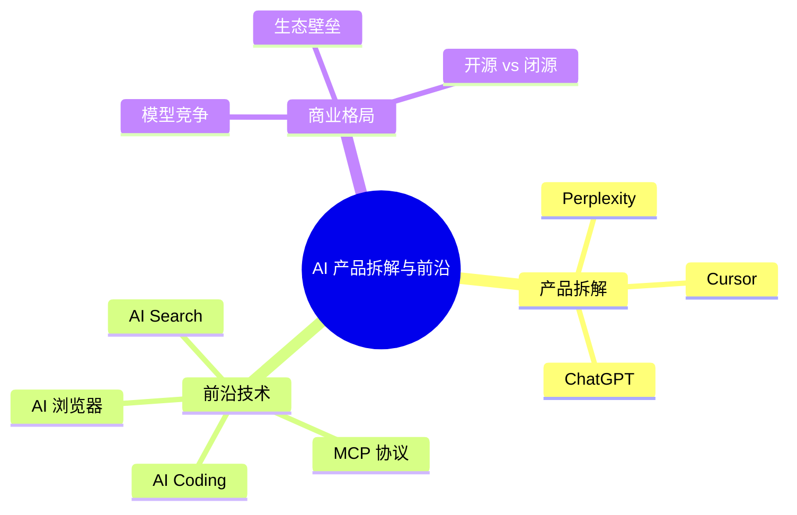

# AI 产品拆解与前沿话题

## 概述

AI PM 必须保持对行业产品的敏锐观察——面试官大概率会问"你最近关注哪些 AI 产品？你怎么看？"。本章拆解 3 个 2025 年最具代表性的 AI 产品，并覆盖 MCP 协议、AI Coding 等前沿话题。

::: tip 学习目标
能对 ChatGPT/Perplexity/Cursor 等标杆产品做深度拆解，理解 MCP 协议和 AI Coding 的产品逻辑，在面试中展现"行业洞察力"。
:::

---

## 一、知识图谱



---

## 二、标杆产品深度拆解

### 2.1 Perplexity——AI 搜索引擎的产品逻辑

**产品定位**：不是"另一个 ChatGPT"，而是"有引用来源的 AI 搜索引擎"。

**核心交互模式**：

```
用户提问 → 实时搜索网络 → 检索 Top-N 网页 → LLM 综合生成回答 → 每条结论附原文引用链接
```

**为什么 Perplexity 是划时代产品：**

1. **解决了幻觉信任问题**：ChatGPT 说的可能是错的，但 Perplexity 的每句话都有引用来源——用户可以去原网页验证。这让 AI 从"你信我"变成了"你自己看"。

2. **重新定义了搜索体验**：传统搜索是"给你 10 个蓝链接，自己点开看"；Perplexity 是"我给你一个综合答案 + 引用来源"。用户信息获取效率提升了几倍。

3. **商业模式对标 Google**：Perplexity Pro ¥20/月——如果它能替代 Google 的搜索体验，这个定价合理。它赌的是"AI 搜索比链接列表更有价值"。

**PM 可借鉴的设计思路：**
- 引用来源不是技术功能，是信任设计——每次回答后面跟着的小数字链接是产品最重要的 Trust Element
- "追问"功能让搜索变成了对话——一个问题引出下一个问题，形成探索式信息获取
- Pro Search 的"Deep Research"模式——多个来源交叉验证后给出深度报告——是差异化付费的典范

### 2.2 Cursor——AI Coding 从 Copilot 到 Agent

**产品定位**：AI-first IDE，不是传统 IDE + AI 插件，而是以 AI 为中心的开发环境。

**关键演变：**

| 阶段 | 代表产品 | 核心模式 | 局限 |
|------|---------|---------|------|
| 代码补全 (2021-2023) | GitHub Copilot | 下一行/下一段代码补全 | 只能补全，不能改架构 |
| AI Chat (2023-2024) | ChatGPT in IDE | 对话式编程辅助 | 需要复制粘贴，割裂 |
| AI Agent (2024-2025) | Cursor Agent Mode | AI 自主规划→定位文件→修改→验证 | 自动化程度越高，失控风险越大 |

**Cursor 的产品设计亮点：**

1. **Tab 补全（Composer）**：不是补一行，而是补一个完整的代码块——理解上下文后一次性写出整个函数。这改变了开发者与 AI 的交互节奏：从"写一行等 AI"到"描述需求等 AI 全写"。

2. **Agent Mode**：AI 自主搜索代码库、定位需要修改的文件、执行修改、运行测试。PM 需要关注的核心问题是：**自主权的边界在哪？** Cursor 的做法是"每一步都让你确认"——AI 提议修改、用户看到 diff、决定接受/拒绝。这是在"自动化"和"人类控制"之间的巧妙平衡。

3. **多模型选择**：用户可以自由切换 GPT-4o / Claude 3.5 / Gemini——这种"模型可选"策略让 Cursor 避免了被单一模型供应商绑定，也让用户可以根据任务类型选择最合适的模型。

**PM 需关注的趋势**：AI Coding 正在从"辅助工具"变成"自主 Agent"——这意味着产品设计的重心从"怎么帮用户写"转向"怎么让用户信任 AI 自动写的代码"。

### 2.3 ChatGPT——从聊天到平台的战略演进

**阶段回顾**：

| 时间 | 里程碑 | 产品含义 |
|------|--------|---------|
| 2022.11 | ChatGPT 上线 | 验证"对话式 AI"的市场需求——2 个月 1 亿用户 |
| 2023.03 | GPT-4 + Plugins | 从封闭对话到开放生态的第一步 |
| 2023.11 | GPTs + GPT Store | 让任何人创建定制 AI——对标 App Store |
| 2024.05 | GPT-4o（多模态） | 文本+图像+语音融为一体 |
| 2024.12 | o1/o3 推理模型 | 从"快思考"到"慢思考"——推理能力的跃升 |
| 2025 | Deep Research / Operator | AI Agent 的初步商业化 |

**ChatGPT 对 PM 的启示：**

- **平台战略三步走**：第一步，用一个通用产品（ChatGPT）获取海量用户和数据；第二步，开放 API 和 GPTs 让第三方开发者在平台上构建应用；第三步，用用户和开发者的数据不断训练更强的模型——飞轮效应。
- **定价分层**：免费（获客）→ $20/月 Plus（主力收入）→ $200/月 Pro（重度用户）→ Enterprise（B2B 高客单价）——四层定价精准匹配不同用户的支付意愿和使用强度。
- **从"聊天"到"行动"的演进**：Operator（自动订外卖/订机票/填表单）标志着 ChatGPT 从"信息助手"升级为"行动代理"——这是 AI 产品的下一个战略高地。

---

## 三、2025 年前沿话题

### 3.1 MCP 协议——AI Agent 的"USB 接口"

MCP（Model Context Protocol）是 Anthropic 推出的开放协议，目标是让 AI 模型和外部工具/数据源之间的连接标准化。

**类比理解**：MCP 之于 AI Agent，就像 USB 之于外设——不需要为每个设备开发专用驱动，插上就能用。

**为什么 PM 需要关注 MCP：**

- 当前 AI Agent 开发最大的痛点之一是"接工具"——每个 API 的接入方式不同，每个数据源的格式不同。MCP 如果能成为行业标准，将大幅降低 Agent 开发的门槛。
- 这意味着 PM 在设计 Agent 产品时，不用纠结"先接哪个 CRM"——只要那个 CRM 支持 MCP，就能直接集成。
- **关注 MCP 不是关注一个技术协议，而是关注 AI Agent 生态的基础设施如何标准化**——这决定了 Agent 产品能否从"Demo"走到"生产环境"。

### 3.2 AI Search 的产品逻辑

| 产品 | 搜索模式 | 差异化 | PM 启示 |
|------|---------|--------|---------|
| **Google SGE** | 搜索结果顶部 AI 摘要 | 已有 90%+ 市场份额 | 传统搜索+AI 是渐进式改良 |
| **Perplexity** | AI 原生搜索+引用 | 信任感优于 ChatGPT | 引用来源是 AI 搜索的核心信任设计 |
| **ChatGPT Search** | 对话式搜索 | 与对话历史无缝衔接 | 搜索只是对话的一部分 |
| **秘塔 AI 搜索** | 中文优先+学术引用 | 本土化优势 | 搜索的垂直化是必然趋势 |

**AI Search 的核心产品问题**：当 AI 直接给你答案而不是链接列表时，**内容创作者（被引用方）的利益怎么保障？** Perplexity 已经在跟出版商谈分成——这是 PM 在做 AI 搜索产品时必须考虑的商业生态问题。

### 3.3 MCP 协议与 Agent 生态 ✨

MCP 是 2024 年底由 Anthropic 推出的开放标准协议。通俗理解：MCP 之于 AI Agent，就像 USB-C 之于电子设备——让所有 Agent 和所有工具/数据源用同一种"语言"对接。

**PM 视角下的 MCP 影响：**

1. **Agent 开发从"手工集成"到"即插即用"**：以前做一个 Agent 需要逐个对接每个外部系统（CRM、数据库、邮件、日历……），每个 API 的鉴权方式/数据格式/错误处理都不同。MCP 统一了这个层——一个 Agent 可以通过 MCP 连接任何支持 MCP 的服务。

2. **PM 不再被"先接哪个系统"所困**：MCP 生态成熟后，你的 Agent 产品理论上可以连接所有主流 SaaS——这让 Agent 的 TAM（可触达市场）大幅扩展。

3. **当前状态（2025 中）**：MCP 还处于早期阶段，生态在快速增长但尚未成为事实标准。PM 需要关注而非立即押注。

### 3.4 AI 浏览器——下一个产品形态

Dia（The Browser Company 出品）和 Arc Browser 代表了 AI 原生浏览器的探索：
- **核心思路**：浏览器不是展示网页的工具，而是"帮你完成任务的 AI 助手"——AI 帮你在网页上填表单、提取信息、跨网页对比价格。
- **PM 关注点**：这代表了一个更大的趋势——**AI 正在从"在应用里"（AI 功能嵌在 App 里）变成"在应用上"（AI 作为一层覆盖所有应用的智能层）**。

---

## 四、面试追问合集

### Q1: 选一个你最近关注的 AI 产品，拆解它的产品逻辑。

::: details 答案

我选 Perplexity。它的核心创新不是技术，而是**产品形态的重定义**。

传统搜索是"我给你 10 个链接，你自己看"→ 用户花大量时间点开、阅读、筛选。Perplexity 是"我帮你读完 10 个网页，给你一个综合答案 + 引用来源"→ 用户直接得到答案。

这个产品有三个关键的 PM 决策值得关注：

1. **引用来源作为信任设计**：ChatGPT 回答没有引用——你不知道它哪里来的信息。Perplexity 的每个结论后面都有来源链接——用户可以去验证。这解决了 AI 回答的信任问题，也是它跟 ChatGPT 最核心的差异化。

2. **Pro Search 的"Deep Research"模式**：Pro 用户发起深度搜索时，系统会搜索更多来源（可能 20-50 个网页），做交叉验证，然后生成一份类似研究报告的答案。这是付费转化的核心价值——免费用户感受的是"快"，Pro 用户感受的是"深"。

3. **商业模式对标 Google**：$20/月定价——它赌的是"AI 答案比链接列表更有价值"。如果用户习惯了 Perplexity 的体验，就回不去传统搜索了。

如果让我改进 Perplexity，我会考虑加入"个性化知识库"——让用户上传自己的文档，AI 搜索既搜全网也搜个人知识库。Perplexity 目前在"个性化"上是空白的。
:::

### Q2: MCP 协议是什么？为什么 AI PM 需要关注它？

::: details 答案

MCP（Model Context Protocol）是 Anthropic 推出的一个开放标准协议，目标是统一 AI 模型和外部工具/数据源的连接方式。

把它类比为"AI Agent 的 USB-C 接口"——就像 USB-C 统一了各种设备的连接标准，MCP 想统一 AI Agent 和各种外部服务的连接标准。不需要为每个 CRM、数据库、文件系统写专门的集成代码，只要支持 MCP，Agent 就能"即插即用"。

PM 需要关注的原因：

1. **降低 Agent 产品的开发门槛和集成成本**。如果 MCP 成为标准，你的 Agent 产品可以快速接入大量第三方服务，而不用逐个开发集成。

2. **改变 Agent 产品的竞争格局**。集成壁垒降低后，Agent 产品的竞争力会更多来自"对用户场景的理解"和"工作流的设计"，而不是"你能接多少个系统"。

3. **当前状态**：MCP 还处于早期阶段。PM 应该关注趋势但不要过早押注——看看是否有足够的生态参与者跟进（类似当年的 Kubernetes 成为容器编排标准的过程）。
:::

### Q3: AI Coding 产品（Cursor/Copilot）对你有什么产品启示？

::: details 答案

三个核心启示：

1. **交互范式的变化**：从"AI 辅助写代码"到"AI 写代码，人类审核"。这对应的是产品设计中"人类监督"的重新定位——从"人类主导"变成"AI 主导、人类确认"。这对所有 AI 产品都是一个趋势信号：不是"AI 帮你做"，而是"AI 做，你确认"。

2. **模型可替换性的产品价值**：Cursor 让用户自由选择 GPT-4o / Claude / Gemini——这不仅是技术选择，更是产品策略。它让 Cursor 既避免了被单一模型锁死，又让用户感觉到"我在控制"——而不是"我在用 Cursor 的 AI"。这是一种巧妙的用户策略：给用户选择权就是给用户安全感。

3. **Agent Mode 的"渐进式自动化"**：Cursor 的 Agent 不是一次性全自动改完所有代码，而是"提议→用户看 diff→用户确认"的渐进式。这对应 AI PM 的核心原则——**自动化不是目的，信任才是。只有在用户建立了足够信任后，才能逐步放开自动化的边界。**
:::

---

## 相关文档

- [大模型技术栈与 Agent 设计](./large-model)
- [AI 产品设计](./product-design)
- [实战案例：智能客服全流程](./case-study)
- [AI PM 面试高频题](./interview)