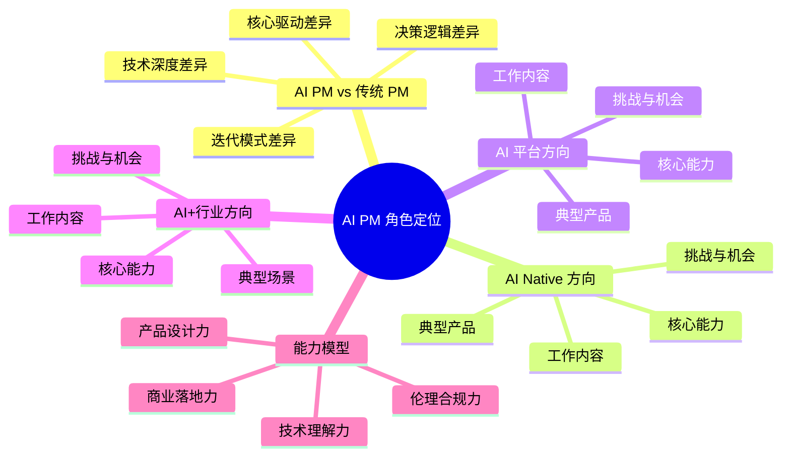
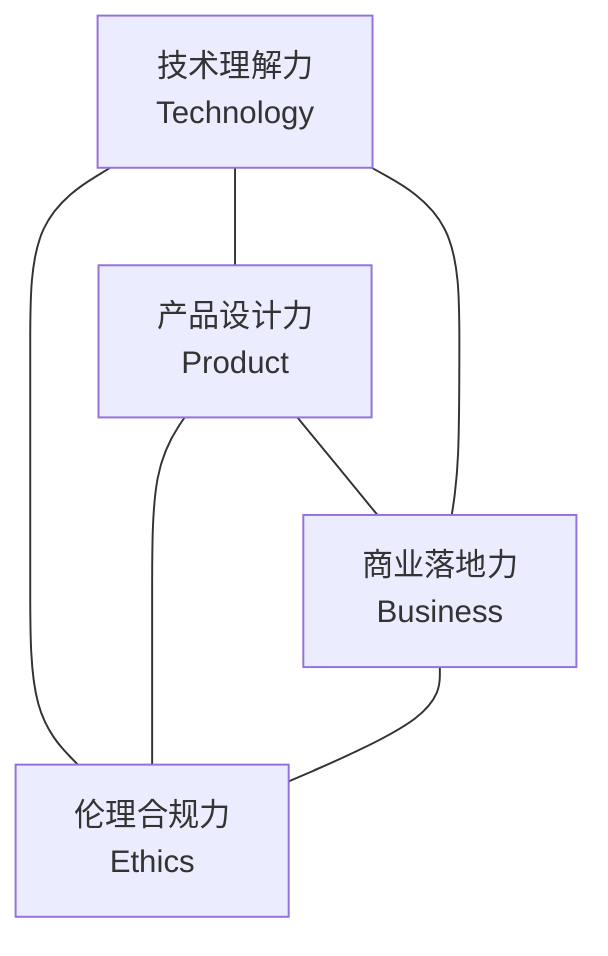

# AI PM 角色定位与三大方向

## 概述

AI 产品经理不是一个单一的岗位，而是已经分化出**三个差异明显的专业方向**。理解这些方向的核心差异、能力要求和适用人群，是转型 AI PM 的第一步。本章从职业定义、与传统 PM 的本质差异、三大方向对比、能力模型四个维度，帮你建立对 AI PM 角色的完整认知。

::: tip 学习目标
能清晰说出 AI PM 的三大方向及其核心差异，理解每个方向的能力要求和自己最适合的切入路径。
:::

---

## 一、知识图谱

---

## 二、AI PM 与传统 PM 的本质差异

### 2.1 核心差异对照表

| 维度 | 传统产品经理 | AI 产品经理 |
|------|-------------|------------|
| **决策逻辑** | 确定性的 if/else 规则驱动 | 概率思维，管理模型输出的不确定性 |
| **核心驱动** | 功能逻辑 + 用户体验 | 数据 - 模型 - 场景的三角关系 |
| **技术依赖深度** | API 调用级理解即可 | 深度掌握技术边界（模型能力上限、推理延迟、成本结构） |
| **迭代模式** | 版本发布式迭代（双周/月度） | 数据闭环持续迭代（天级别甚至实时） |
| **核心挑战** | 需求优先级排序与体验优化 | 数据闭环构建 + 模型能力边界评估 + 技术商业价值权衡 |
| **设计哲学** | 确定性交互，每个按钮行为固定 | 概率化设计，每个节点需要 Fallback 降级机制 |
| **PRD 核心** | 功能规格 + 交互说明 | 功能规格 + 模型需求（输入/输出定义、置信度阈值、评估指标） |
| **测试方式** | 功能测试（QA 点对点验证） | 模型评估 + A/B 测试 + Bad Case 分析 |

### 2.2 实战视角：工作量分布的真相

::: warning 面试追问
**Q: 传统 PM 转型 AI PM，最大的不适应点是什么？**

**A:** 我在转型初期最大的不适感来自两个地方。

第一，**数据工作的比重远超预期**。传统 PM 大概 70% 时间在写文档、对需求、跟开发沟通；但 AI PM 有 40% 的时间花在数据和标注上。你要跟标注团队定义标注规范、做一致性检验、分析 Bad Case、看数据分布变化。这不是传统 PM 的工作范畴，但它决定了模型能不能学到你想要的东西。

第二，**"上线不是终点，是起点"**。传统产品上线后代码是相对稳定的，但 AI 产品上线后模型一直在变——数据漂移会让准确率从 92% 掉到 85%，你得有监控和再训练的机制。我们之前一个风控模型，上线三个月后准确率掉了 7 个点，查下来是因为业务调整导致用户行为分布发生了变化（Concept Drift）。所以 AI PM 的工作状态更像"运营"，而不是"交付"。
:::

---

## 三、三大方向详解

### 3.1 AI Native 产品经理

**定义**：以 AI 为核心价值主张，创造全新产品品类。产品本身就是 AI——没有 AI 就不存在这个产品。

| 要素 | 说明 |
|------|------|
| **典型产品** | ChatGPT、Kimi、Midjourney、Perplexity、Gamma |
| **核心用户** | C 端或 B 端的终端用户，他们"用 AI"而不是"开发 AI" |
| **核心工作** | Prompt 模板库设计、多模态交互设计、模型能力挖掘 |
| **关键能力** | Prompt Engineering、UX 设计、模型能力边界评估、数据驱动迭代 |
| **技术深度要求** | 中等——不需要懂算法细节，但必须能准确判断模型能做什么、不能做什么 |
| **典型公司** | 月之暗面（Kimi）、智谱 AI（智谱清言）、MiniMax（海螺 AI）、OpenAI、Anthropic |

**实战案例**：

> 我在 AI Native 方向的实践中最大的体会是：**PRD 文档被 Prompt 模板库替代了**。以前我们写一个功能，PRD 里描述按钮放哪、交互逻辑是什么。现在做 AI Native 产品，设计的是一个 System Prompt——"你是一个专业的数据分析师，当用户上传表格时，你应该先理解表格结构，再问用户想分析什么维度，然后..."
>
> Notion AI 的产品团队维护了一个 2000+ 变体的 Prompt 模板库，通过 A/B 测试来选出最优组合。你没法在 PRD 里写死"输出什么格式、用什么语气"，因为模型本身的输出是概率性的——你只能定义约束和期望，然后不断测试和迭代。
>
> 另一个关键能力是**模型能力挖掘**。GPT-4 最初没有被设计用于蛋白质结构预测，但产品经理与生物学家合作发现了这个突破性应用场景。AI Native PM 最值钱的地方，不是"设计出多好看的交互"，而是"发现别人没发现的模型能力"。

### 3.2 AI 平台产品经理

**定义**：构建 AI 开发基础设施，用户是算法工程师和数据科学家。本质上是"开发者的赋能者"。

| 要素 | 说明 |
|------|------|
| **典型产品** | 百度千帆、阿里云 PAI、AWS SageMaker、MLflow、Weights & Biases |
| **核心用户** | 算法工程师、数据科学家、ML 工程师 |
| **核心工作** | MLOps 工具链设计、训练/推理平台、数据管理平台 |
| **关键能力** | 分布式训练原理、模型服务化、开发者体验（DX）优化 |
| **技术深度要求** | 高——需要理解分布式训练（AllReduce）、推理加速（TensorRT）、GPU 显存管理 |
| **典型公司** | 百度智能云、阿里云、华为昇思、AWS、Google Cloud、Databricks |

**实战案例**：

> AI 平台 PM 最特别的地方是——你的用户全是技术人，而且技术比你深。如果你不懂分布式训练，你跟算法团队开会时根本插不上话。
>
> 阿里云 PAI 产品经理面试时，有一道题是"设计一个支持千卡并行的训练任务调度方案"。你要考虑：任务如何切分到多张 GPU 上、AllReduce 通信的瓶颈在哪、训练中断后如何断点续训。传统 PM 不会遇到这种问题。
>
> 但这个方向有一大优势：**职业壁垒极高**。你懂的这些，纯产品背景的人学不会，纯技术背景的人又不愿意做产品。所以 AI 平台 PM 在市场上非常稀缺——2025 年的数据显示，这个方向的 HC 虽然比 AI Native 少，但薪资中位数更高，因为合格的候选人太少。

### 3.3 AI+行业产品经理

**定义**：在现有业务中寻找 AI 赋能点，用 AI 技术改造传统业务流程。本质上是"传统行业的智能化引擎"。

| 要素 | 说明 |
|------|------|
| **典型场景** | 金融风控、医疗影像诊断、零售智能推荐、教育个性化学习、制造预测性维护 |
| **核心用户** | 行业内部的业务用户（医生、风控师、运营人员、质检员） |
| **核心工作** | 技术选型决策、行业 AI 方案设计、变革管理（推动业务方接受 AI） |
| **关键能力** | 行业 Know-how + 技术可行性判断 + ROI 测算 + 变革管理 |
| **技术深度要求** | 中等——需要理解什么技术能解决什么业务问题，但不需要深入算法细节 |
| **典型公司** | 平安科技（金融）、联影智能（医疗）、京东数科（零售）、美团（本地生活） |

**实战案例**：

> AI+行业方向最考验的是"翻译能力"——把业务语言翻译成技术语言，再把技术边界翻译成业务语言。
>
> 我做过最典型的案例是零售场景的商品评价情感分析。业务方说"我们要看用户对商品满不满意"。这个需求听起来很简单，但拆开来看就复杂了——"满意"的定义是什么？给 3 星的评价说"还行吧，一般般"，算满意还是不满意？如果准确率从 85% 要求到 92%，解决方案可能从规则引擎变成 BERT 模型——但标注预算要增加 20 倍。你得跟业务方说清楚这笔账。
>
> 另一个重要能力是**变革管理**。医疗 AI 产品经理经常面对医生的抵触——"AI 凭什么帮我做诊断？"。腾讯觅影团队通过"AI 辅助诊断→人机竞赛→共诊模式"的三阶段推广策略，成功把三甲医院渗透率从 15% 拉到 68%。推动一个行业接受新技术，比设计技术本身更难。

---

## 四、三大方向对比总结

| 维度 | AI Native | AI 平台 | AI+行业 |
|------|-----------|---------|---------|
| **产品形态** | C 端 AI 应用 | B 端 ML 基础设施 | B 端行业解决方案 |
| **用户画像** | 终端消费者 | 算法/数据工程师 | 行业业务人员 |
| **核心产出** | Prompt 模板库 | MLOps 工具链 | 行业 AI 方案 |
| **技术门槛** | 中等 | 高 | 中等 |
| **商业壁垒** | 模型能力+网络效应 | 技术栈+迁移成本 | 行业 Know-how |
| **薪资区间** | 30-80 万 | 40-100 万+ | 30-70 万 |
| **适合背景** | C 端产品经验 | 算法/工程背景 | 行业经验+产品思维 |

---

## 五、AI PM 能力三角模型

### 5.1 技术理解力

- 机器学习核心概念（监督/无监督/强化学习）
- 大模型原理（Token/Embedding/Attention）
- 模型能力边界评估
- MLOps 基本认知

**不要求**：能写代码/能训练模型/能调参。

**必须做到**：能判断"这个需求用现有技术能不能做、多长时间能做出来、成本大概多少"。

### 5.2 产品设计力

- AI 产品需求分析方法（AI 适用性判断矩阵）
- 概率化 UX 设计（Fallback、降级策略、置信度显示）
- Prompt 工程（System Prompt 设计、Few-shot 策略）
- 评估指标体系（模型指标 + 业务指标 + 体验指标）

### 5.3 商业落地力

- AI 商业模式设计（B2B/B2C/B2G 适配）
- 定价策略（按 Token/按效果/订阅制/混合制）
- ROI 计算模型
- GTM（Go-to-Market）策略

### 5.4 伦理合规力

- AI 伦理原则（公平性、透明性、可解释性、隐私保护）
- 欧盟 AI 法案核心要求
- 中国生成式 AI 监管政策
- 偏见检测与缓解方案

---

## 六、面试追问合集

### Q1: 三大方向你觉得哪个最有前途？为什么？

::: details 答案

短期（1-2 年）来说，**AI Native 方向岗位最多、增长最快**。2025 年中国 AI PM 岗同比增长 240%，其中大部分是 AI Native 方向——每个月之暗面、智谱、MiniMax 都在大量招人。

但长期（3-5 年），**AI+行业才是最大的池子**。因为 AI Native 的产品品类就那么多种——对话助手、搜索、创作工具、代码助手——头部效应很强，用户会集中在少数几个产品上。但 AI+行业几乎是无底洞——金融、医疗、教育、制造、能源、农业，每个行业都需要 AI 改造。而且行业知识的门槛让新人很难进来，一旦你在某个行业扎下根，职业安全感很强。

AI 平台方向市场总量不会特别大，但**人均薪资最高**——因为供给太少。如果你本身就是算法或工程背景，这个方向是就业"压倒性优势"的选择。

:::

### Q2: 传统 PM 转型 AI PM，最大的坑是什么？

::: details 答案

最大的坑是**用传统产品的思维工具去做 AI 产品**。

具体说三个常见翻车场景：

1. **"这个功能下周上线"**：传统 PM 习惯了排期、开发、测试、上线的节奏。AI 产品你没法这样排。模型迭代的节奏取决于数据——可能调了三周准确率还在波动，也可能换了个 Embedding 模型突然提了 5 个点。不确定性是常态，严谨的排期在 AI 产品里就是自欺欺人。

2. **"我把需求写清楚给算法，剩下的他们搞定"**：传统 PM 把 PRD 交给开发就很放心了。但 AI 产品的 PRD 不只是功能定义，还包括数据标注规范、评估指标、置信度阈值这些。你不定义清楚，算法帮你"猜"，猜出来的大概率不是你要的。

3. **"在线上的模型再加个功能就行"**：传统产品加功能是增量开发；AI 产品加"功能"往往意味着重新定义模型输入/输出、重新标注数据、重新训练。你以为是一周的工作量，实际可能是一个月。

:::

### Q3: 产品经理需要会写代码吗？

::: details 答案

不需要会写生产级代码，但**必须会写一些 Python 脚本用于数据分析、Prompt 测试、和 API 调用**。

说一个具体的标准：你应该能独立完成以下三个任务——

- 用 Python + Pandas 分析标注数据质量（标注一致性检查、类别分布统计）
- 用 OpenAI API 写一个 Prompt 测试脚本（批量跑 50 条测试用例看准确率）
- 用简单的 Streamlit / Gradio 搭建一个产品 Demo（不需要漂亮，但要能跑通核心功能）

你不会这些的话，每次验证想法都要找工程师帮忙——你的迭代速度就比别人慢一个数量级。在 AI Native 公司，PM 自己撸 Python 是基本操作。

:::

---

## 相关文档

- [AI 技术基础](./tech-basics)
- [AI 产品设计](./product-design)
- [AI PM 面试高频题](./interview)