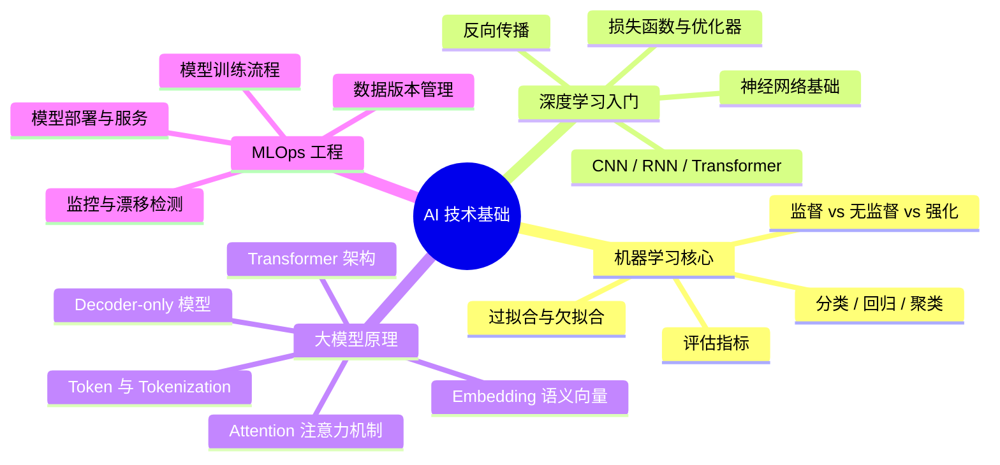
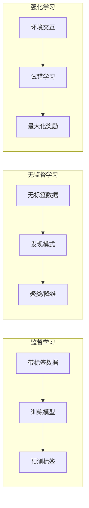
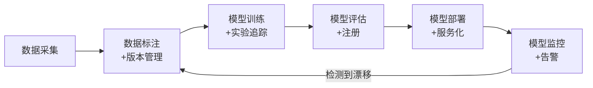

# AI 技术基础

## 概述

AI 产品经理不需要编写复杂算法，但**必须能够准确评估技术边界**——这是与传统 PM 最本质的差异之一。本章从机器学习核心概念、深度学习入门、大模型原理、MLOps 工程四个维度，构建"够用且够深"的技术认知。

::: tip 学习目标
能判断"这个需求用现有技术能不能做"、"大概多长时间能做出来"、"成本大概多少"，并能跟算法团队进行有深度的技术沟通。
:::

---

## 一、知识图谱

---

## 二、机器学习核心概念

### 2.1 三大学习范式

| 范式 | 核心思路 | 典型场景 | PM 需要知道的 |
|------|---------|---------|--------------|
| **监督学习** | 给数据打标签，让模型学习"输入→输出"的映射 | 垃圾邮件分类、图像识别、信用评分 | 标注成本是最大的隐性成本 |
| **无监督学习** | 不给标签，让模型自己发现数据中的结构 | 用户分群、异常检测、推荐系统 | 聚类结果需要业务解读，不是纯技术输出 |
| **强化学习** | 从环境反馈中学习最优策略 | 游戏 AI、机器人控制、A/B 自动化 | 落地难度最高，周期最长，慎用 |

### 2.2 分类 vs 回归

::: warning 面试追问
**Q: 分类和回归的区别是什么？各给一个实际产品中的例子。**

**A:** 分类是预测"类别"（离散值），回归是预测"数值"（连续值）。

- 分类案例：电商评价情感分析——输入评论文本，输出"正面/中性/负面"。产品设计中要考虑的是：分类错误的代价不对称——把负面判成正面比正面判成负面更严重（可能漏掉投诉）。
- 回归案例：外卖配送时间预估——输入订单信息、骑手位置、天气等，输出预计配送分钟数。产品设计中要考虑的是：大部分用户宁可早到 5 分钟也不要晚到 1 分钟，所以回归模型的重点是控制低估（Under-estimation）的比例。
:::

### 2.3 评估指标——只看准确率是不够的

在实际产品中，准确率只是最粗糙的指标。你需要根据场景选择更细粒度的评估维度：

| 指标 | 公式含义 | 适用场景 | PM 视角 |
|------|---------|---------|---------|
| **准确率 Accuracy** | 预测正确的比例 | 类别均衡的场景 | 92% 准确率在反欺诈场景是灾难——因为 99% 的交易都是正常的 |
| **精确率 Precision** | 预测为正例中真正为正例的比例 | 误报代价高的场景（垃圾邮件过滤） | "宁漏杀不误杀" |
| **召回率 Recall** | 真正的正例中被正确识别出来的比例 | 漏报代价高的场景（癌症筛查） | "宁可错杀不能放过" |
| **F1 Score** | 精确率和召回率的调和平均 | 精确率和召回率都需要平衡 | 要跟业务方讨论"哪个方向更不可接受" |
| **AUC** | 分类器区分正负样本的能力 | 二分类场景的综合评估 | AUC 0.85 和 0.88 在业务上可能没区别 |

::: details 实战案例：为什么准确率在反欺诈场景是"假指标"？

我们之前的风控模型评估时，准确率是 98.5%——看起来很好对吧？问题在于，交易数据中 99% 的样本都是正常交易。模型只要"全部判为正常"，准确率就是 99%。但这个模型在欺诈交易上的召回率是 0%——一条欺诈都没抓到。

所以我们把评估重点换成了"欺诈交易的召回率 + 正常交易的误判率"：召回率目标 90% 以上，误判率控制在 3% 以下。误判率 3% 意味着 100 个正常用户里有 3 个会被拦截——这对用户体验的影响需要产品层面来权衡，不是纯技术问题。
:::

### 2.4 过拟合与欠拟合——AI PM 必须理解的概念

| 现象 | 训练集表现 | 测试集表现 | 产品表现 | 应对方案 |
|------|-----------|-----------|---------|---------|
| **欠拟合** | 差 | 差 | 模型太"简单"，学不会 | 用更强的模型、加更多特征 |
| **刚好** | 好 | 好 | 泛化能力 OK | 保持 |
| **过拟合** | 极好（~100%） | 差 | 记住了训练集，遇到新数据就崩 | 加数据、加正则化、简化模型 |

::: tip PM 记忆口诀
**过拟合 = "死记硬背"，欠拟合 = "啥也没学会"。**
产品经理不需要调参来解决，但需要能判断你的产品表现差是因为数据不够还是模型太弱——这决定了你是花钱买数据还是花钱升级模型。
:::

---

## 三、深度学习入门

### 3.1 神经网络是什么（五分钟理解版）

想象一个多层的信息处理系统：

- **输入层**：接收原始数据（文本→词向量、图像→像素矩阵）
- **隐藏层**：每一层提取更抽象的特征（第一层识别边缘→第二层识别形状→第三层识别物体）
- **输出层**：给出最终结果（分类概率、回归数值）

**训练过程**：前向传播（计算出预测结果）→ 计算损失（跟正确答案比较差距有多大）→ 反向传播（把误差反向传回去，调整参数）→ 重复直到收敛。

### 3.2 CNN / RNN / Transformer 的区别

| 架构 | 擅长处理 | 核心机制 | 产品用例 |
|------|---------|---------|---------|
| **CNN** | 图像（空间关系） | 卷积核滑动提取局部特征 | 人脸识别、医学影像、商品图分类 |
| **RNN / LSTM** | 序列（时间顺序） | 循环结构保留历史信息 | 文本生成、时间序列预测、语音识别 |
| **Transformer** | 任意序列（全局注意力） | Self-Attention 让每个词看到所有其他词 | 大语言模型、机器翻译、所有 NLP 任务 |

**为什么 Transformer 取代了 RNN？**

RNN 从左到右串行处理，第 100 个词的输出依赖前面 99 个词的计算结果——不能并行，而且长距离信息会衰减。Transformer 的 Self-Attention 让每个词同时关注所有其他词，可以并行计算，而且不管多远都能直接"看到"。

::: tip PM 理解要点
关键是"注意力机制"——模型不是在顺序读文本，而是像人一样"看到关键信息就重点关注"。比如"我今天在朝阳公园旁边的星巴克喝了一杯拿铁"，模型理解"你在星巴克喝咖啡"时，重点看"星巴克"和"拿铁"，不太关心"朝阳公园"。
:::

---

## 四、大模型核心原理

### 4.1 三个核心概念

#### Token（最小语义单元）

Token 不是"字"，是模型理解的"最小单元"。中文一个汉字通常是 1-2 个 Token，英文一个单词通常是 1-3 个 Token。

> 比如"AI 产品经理"这句话，OpenAI 的分词器会把它切成 `["AI", " 产品", "经理"]` → 3 个 Token。

**PM 为什么关心 Token？**

- 模型的上下文窗口有限（GPT-4o 是 128K Token）——你的输入 + 输出不能超过这个数
- Token 直接等于成本——GPT-4o 每 100 万输入 Token 大概 $2.5
- 长文本场景需要设计"分段→检索→拼接"的策略

#### Embedding（语义向量）

Embedding 是把文字变成数字向量的技术。"猫"的向量和"狗"的向量在高维空间中距离很近，和"汽车"的向量距离很远。

**PM 实际应用**：向量搜索（RAG）、语义相似度计算（去重/聚类）、推荐系统。

#### Attention（注意力机制）

模型不是平等地看待输入的每个词，而是给不同位置的词分配不同的"关注度"。Q（Query，查询）、K（Key，键）、V（Value，值）是注意力计算的三个矩阵。

**PM 实际应用**：理解为什么模型能"读懂上下文"（因为它知道每个词跟其他所有词的关系），以及为什么长文本推理对算力要求很高（注意力矩阵是 O(n²) 的复杂度）。

### 4.2 从 GPT-1 到 GPT-4 的演化

| 版本 | 年份 | 参数量 | 关键突破 | PM 视角 |
|------|------|--------|---------|---------|
| GPT-1 | 2018 | 1.17 亿 | 证明预训练+微调可行 | 学术概念验证，没产品价值 |
| GPT-2 | 2019 | 15 亿 | 涌现出 Zero-shot 能力 | 第一次看到"通用语言能力" |
| GPT-3 | 2020 | 1750 亿 | Few-shot 学习能力惊人 | API 化，催生第一批 AI 公司 |
| GPT-4 | 2023 | 未公开 | 多模态（文本+图像输入） | 推理能力接近人类专家 |
| GPT-4o / 5 | 2024-2025 | 未公开 | 实时多模态、Agent 能力 | PM 思考的是"产品形态怎么重构" |

---

## 五、MLOps —— AI 产品的"DevOps"

### 5.1 MLOps 全景

### 5.2 PM 视角下的 MLOps 各环节

| 环节 | PM 的职责 | 不归你管 |
|------|---------|---------|
| **数据采集** | 定义数据源、数据质量标准 | 具体的数据抓取/存储 |
| **数据标注** | 设计标注规范、定义边界 Case、做一致性检验 | 实际执行标注 |
| **模型训练** | 定义评估标准、参与 Bad Case 分析 | 调参、代码实现 |
| **模型评估** | 确认评估指标是否对齐业务目标、做上线决策 | 跑评估脚本 |
| **模型部署** | 定义部署策略（灰度/A/B）、确认回滚条件 | 写部署脚本 |
| **模型监控** | 定义监控指标、确认告警阈值、触发再训练决策 | 搭建监控系统 |

### 5.3 数据漂移 —— AI PM 最该警惕的问题

::: warning 面试追问
**Q: 什么是数据漂移（Data Drift）？产品经理应该如何应对？**

**A:** 数据漂移是指模型上线后，线上数据的统计分布和训练数据发生了偏移——比如你训练了一个用户意图分类模型，训练集里 60% 的样本是"购物咨询"、40% 是"售后投诉"。但双十一期间，"售后投诉"的比例暴涨到 70%——模型没见过这个分布，准确率就崩了。

产品经理应该做三件事：

1. **上线前**：定义漂移监控指标（特征分布 KL 散度、预测置信度分布变化）。我们项目用的是 PSI（Population Stability Index）——PSI > 0.25 触发告警。
2. **发现漂移后**：区分是"数据漂移"还是"概念漂移"。数据漂移（输入分布变了，但映射关系没变）一般是正常的业务波动；概念漂移（映射关系变了——比如以前说"快"是正面评价，现在可能是负面）需要重新标注和训练。
3. **长期机制**：建立"周级数据质量巡检"制度——每周跑一遍线上数据的分布变化，跟训练集对比。京东金融风控产品通过这套机制把模型稳定性提升了 40%。
:::

---

## 六、面试追问合集

### Q1: 如果业务方要做一个"用 AI 预测股票涨跌"的功能，作为 PM 你会怎么评估？

::: details 答案

我会从三个层面来评估：

1. **技术可行性**：股票预测在学术界和工业界都是公认的难点——市场本身是接近有效市场的，价格已经反映了大部分公开信息。即使有 AI 模型能捕捉一些规律（比如情绪分析），超额收益也会迅速被套利行为消除。我会跟业务方说清楚：别指望能预测涨跌，但可以做"基于历史数据的趋势分析"和"舆情情绪聚合"——这个是在技术能力范围内的。

2. **合规风险**：中国的《生成式 AI 服务管理办法》明确规定，提供 AI 生成的投资建议需要相关资质。没有投顾牌照，这类功能可能被监管认定为"非法投资咨询"。

3. **如果业务方坚持要做**：我会建议把一个"不可行的需求"转化为两个"可行的需求"——做信息聚合工具（汇总市场新闻、财报数据）+ 做风险评估工具（基于历史波动率评估持仓风险），而不是直接给出买卖建议。这样既满足了用户的真实需求（想要投资决策的信息支持），又不碰技术短板和合规红线。
:::

### Q2: 面试问"解释一下 Transformer 的 Attention 机制"怎么回答？

::: details 答案

这个问题的面试官不会指望你推导公式，主要是看你能不能用自己的话讲清楚核心逻辑，并且能关联到产品决策。

我的回答思路是："Attention 就是给输入的每个部分一个'注意力分数'，让模型知道哪些部分更重要。"

举个例子——输入"今天在上海徐家汇的星巴克喝咖啡"，当模型要理解"地点"的时候，它会重点看"上海徐家汇星巴克"这几个词，给它们的注意力分数打很高；其他词如"今天""喝咖啡"分数就比较低。这个机制让模型能像人一样"有重点地阅读"，而不是逐字平等对待。

从产品角度来说，Attention 机制解释了三个关键现象：

- 为什么大模型理解复杂上下文的成本很高——Attention 计算量和输入长度的平方成正比（O(n²)）
- 为什么长文本推理很慢——每个 Token 都要跟其他所有 Token 算一遍注意力
- 为什么 RAG 需要限制检索文档数量——拼太多的文档进去，模型注意力被稀释，反而答不准
:::

### Q3: 你怎么跟完全不懂 AI 的业务方解释某个模型能力边界？

::: details 答案

我有个屡试不爽的三步法：

1. **先给置信范围，不给绝对值**：不说"这个模型能做情感分析"，说"这个模型在大众消费品类的短评情感分析上，准确率大概 90%；但遇到电子产品长评或者讽刺性表达时，准确率会降到 70% 左右"。

2. **用对比让业务方有直觉**：不说"F1 是 0.88"，而是说"100 条负评里，模型能抓出 95 条，但会漏掉 5 条——这 5 条漏掉的你受得了吗？另外，模型会把 8 条好评判成负评——这 8 个被冤枉的用户你要怎么处理？"

3. **给替代方案，不留死角**：补一句"对于高风险的场景（比如涉及赔偿的投诉），我们设计人工复核通道——模型先筛一遍，置信度低于 80% 的转人工。这样兼顾效率和准确。"

关键是**不要用术语糊弄人，也不要用"反正 AI 能搞定"这种回答模糊过去**。说出不完美就是专业，拍胸脯保证才是外行。
:::

### Q4: Token 计费模式对产品设计有什么影响？

::: details 答案

影响非常大，直接决定了产品形态和商业模式。说几个实际案例：

**场景一：客服 Bot**。如果每次对话都在 System Prompt 里拼大段产品手册（3000 Token）+ 检索到的相关文档（2000 Token）+ 对话历史（1000 Token），光输入就 6000 Token。GPT-4o 按 $2.5/百万 Token 算，单次对话 API 成本约 $0.015，大概 1 毛钱人民币。一天 5000 次咨询就是 500 块，一个月 15000。如果换成 GPT-4o-mini（价格是 1/10），同样场景成本降到 1500/月。但准确率可能从 92% 降到 87%——你得权衡省的钱和丢的体验。

**场景二：文档分析工具**。用户上传一个 100 页的 PDF，如果你把全文 Token 化之后全塞给模型，光这一轮就可能吃掉几万个 Token。你必须在产品设计中加入"检索+分段"策略——先定位相关段落，再送模型分析——而不是把全文喂进去。这是成本倒逼的产品设计决策。

**场景三：定价策略**。如果你的产品成本全靠 API，你的定价必须考虑 Token 成本弹性。按次收费的固定定价非常危险——用户可能发一段 10 Token 的查询（成本很低），也可能一句"把这份 500 页的合同帮我过一遍"吃掉 5 万 Token。所以大多数 AI 产品都是"分层+限额"定价——免费版每天 100 次、Pro 版不限额但要付月费。
:::

---

## 相关文档

- [AI PM 角色定位与三大方向](./role-overview)
- [Prompt 工程](./prompt-engineering)
- [大模型技术栈与 Agent 设计](./large-model)
- [AI PM 面试高频题](./interview)