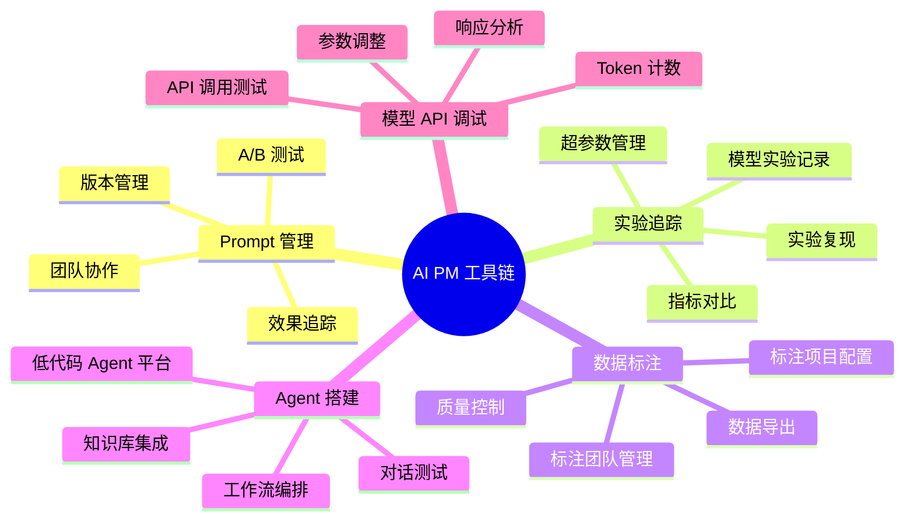

# AI PM 工具链与工作流

## 概述

知道方法论不够，你还需要知道**打开电脑第一步做什么**。本章从 Prompt 管理、实验追踪、数据标注、Agent 搭建、模型 API 调试五个维度，给出 AI PM 日常工作的工具选型和典型工作流。

::: tip 学习目标
熟悉 AI PM 日常工作中使用的主流工具，能在面试中说出"我用 xxx 工具解决 yyy 问题"，而非"理论上应该这样"。
:::

---

## 一、知识图谱



---

## 二、Prompt 管理与测试

### 2.1 为什么需要专门的 Prompt 管理工具？

手动管理 Prompt 在初期勉强可行，但随着产品迭代，三个问题会越来越突出：
- **版本混乱**："上周的 V3.2 比今天的 V3.3 好，但我不记得 V3.2 长什么样了"
- **协作困难**：工程师改了 System Prompt 中的某一行，PM 不知道、没测试、直接上线——翻车
- **效果无法追踪**：改 Prompt 之后效果变了，但没有系统的 A/B 记录

### 2.2 主流工具对比

| 工具 | 定位 | 核心功能 | 适合谁 |
|------|------|---------|--------|
| **LangSmith** | 全链路 LLM 应用追踪 | Prompt 版本管理、评测、线上追踪 | 团队协作、专业项目 |
| **PromptLayer** | 轻量级 Prompt 版本管理 | 版本对比、历史记录、API 代理 | 中小团队、快速启动 |
| **OpenAI Playground** | 官方调试工具 | 即时测试、参数调整、Token 计数 | 个人探索、快速验证 |
| **Dify** | 低代码 LLM 应用平台 | 可视化编排、Prompt 调试、知识库 | PM 独立搭建 Demo |

### 2.3 典型工作流：Prompt 迭代 6 步 SOP

```
1. 发现问题（线上 Bad Case 分析 or 人工评估发现）
       ↓
2. 在 LangSmith 中拉取"当前版本 Prompt"
       ↓
3. 创建新版本 V(N+1)，修改 Prompt
       ↓
4. 在评测集上跑 VN vs V(N+1) 对比（LangSmith 的对比功能）
       ↓
5. 如果 V(N+1) 整体更好且无退化 → 标记为 release candidate
       ↓
6. 在 Playground 上做最终人工抽查 → 灰度上线
```

---

## 三、实验追踪

### 3.1 为什么 AI PM 需要关注实验追踪

当你跟算法团队开会时，他们说"上周的实验用了 learning rate 0.001 的版本比 0.0001 好"，你需要能够**看懂并追问实验记录**。这不是让你成为 MLE，而是让你能在关键时刻提出正确的问题。

### 3.2 主流工具

| 工具 | 特点 | AI PM 需要知道的 |
|------|------|-----------------|
| **Weights & Biases** | 业界标准、UI 优秀 | 能打开实验 Dashboard 看指标对比、Loss 曲线 |
| **MLflow** | 开源、可私有部署 | 了解基本的 experiment → run → artifact 层级 |
| **TensorBoard** | Google 出品、免费 | 只看不操作，理解 Loss 下降趋势和过拟合判断 |

### 3.3 PM 视角的实验追踪 Checklist

不需要操作，但要能看能问：
- [ ] 这次实验改了哪些超参数？（learning rate / batch size / epoch）
- [ ] 训练 Loss 和验证 Loss 的差距大吗？（差距 > 10% 可能是过拟合）
- [ ] 跟上一个 best model 对比了吗？（不能只看绝对值）
- [ ] 实验目的是什么？验证什么假设？（不能"调了看看"）

---

## 四、数据标注工具

### 4.1 工具选型

| 工具 | 适用场景 | 优势 | 不足 |
|------|---------|------|------|
| **LabelStudio** | 文本/图像/音频标注 | 开源免费、可自部署、支持多种标注模板 | UI 略显复杂 |
| **Labelbox** | 大规模商业标注 | 标注团队管理、质量审核流程、API 集成 | 收费、有学习成本 |
| **Doccano** | 轻量级文本标注 | 极简、快速启动 | 功能较少 |
| **GPT-4o API 辅助标注** | 快速冷启动标注 | 速度和成本优势巨大 | 需要人工审核修正 |

### 4.2 典型工作流：用 LabelStudio 做情感分类标注

```
Step 1: 在 LabelStudio 创建项目
  → 选择"文本分类"模板
  → 定义标签：正面/中性/负面

Step 2: 导入待标注数据（JSON/CSV）
  → 上传 1000 条用户评论

Step 3: 配置标注界面
  → 显示文本 + 单选标签按钮
  → 可选：加一个"不确定"按钮

Step 4: 分配标注任务
  → 发给 2 个标注员（每人标全部 1000 条，用于算 Kappa）

Step 5: 质量审核
  → 导出标注结果 → Python 脚本算 Kappa 系数
  → Kappa < 0.7 → 跟标注员开会讨论不一致的 Case → 修订标注规范 → 重新标注

Step 6: 导出训练数据
  → 导出为 JSON → 清洗 → 划分 train/val/test → 送入训练 Pipeline
```

---

## 五、Agent 搭建平台

### 5.1 为什么 PM 需要自己搭 Agent

不需要你用代码实现一个 Agent——但你需要能**在 2 小时内搭出一个可交互的 Demo**。这在两个场景下至关重要：
- **快速验证想法**：有个新想法想测试可行性——自己搭个 Demo 比写 20 页 PRD 有效得多
- **跟工程师对齐需求**：PM 用低代码平台搭出"想要的样子"，工程师知道你的预期——比纯文字描述准确 100 倍

### 5.2 低代码/无代码 Agent 平台对比

| 平台 | 定位 | 核心能力 | 上手难度 |
|------|------|---------|---------|
| **Dify** | 开源 LLM 应用平台 | 工作流编排、RAG 知识库、Agent 模式、对话日志 | ★★☆ |
| **Coze（扣子）** | 字节跳动出品 | 插件市场、Bot 发布（微信/飞书）、知识库集成 | ★☆☆ |
| **LangChain** | 开发者框架 | Python/JS SDK、完整的 Agent 工具链 | ★★★ |
| **Flowise** | 开源可视化编排 | 拖拽式工作流、支持多种 LLM | ★★☆ |

### 5.3 推荐入门路径

1. 先用 **Coze 或 Dify** 搭一个最简单的 QA Bot（知识库 + 大模型）——1 小时搞定
2. 加上工具调用（Function Call）——查询天气、搜索商品——练习 Agent 的核心模式
3. 设计一个多步骤工作流（用户输入 → 意图识别 → 路由到不同处理 → 生成回答）
4. 用对话日志功能分析 Bad Case，迭代 Prompt

---

## 六、模型 API 调试

### 6.1 常用调试工具

| 工具 | 用途 | PM 必会程度 |
|------|------|-----------|
| **OpenAI Playground** | 测试 Prompt、调整参数（temperature/top_p/max_tokens） | ★★★★★ |
| **Postman** | 调用 API、查看原始 JSON 响应 | ★★★★☆ |
| **Claude Console** | Anthropic 的官方调试台 | ★★★☆☆ |
| **Hugging Face Playground** | 测试开源模型 | ★★★☆☆ |

### 6.2 OpenAI Playground 实操 5 分钟上手

1. 打开 `platform.openai.com/playground`
2. 在 System 框写 System Prompt
3. 在 User 框写测试用户输入
4. 调整右侧参数：
   - **Temperature**（0-2）：控制随机性。0 = 每次都一样，1 = 有创意。**客服/分类场景用 0-0.3，创意写作场景用 0.7-1**
   - **Max tokens**：控制输出长度。客服回答一般 200-500 tokens 足够
   - **Top P**：常用 0.9-1，一般不用动
5. 点击 Submit → 看结果 → 调 Prompt → 再试
6. 满意的 Prompt 直接"View code"导出为 Python/Node.js 代码发给工程师

### 6.3 一个完整的调试循环示例

```
假设你在做一个"商品评价总结"功能：

1. 在 Playground 写 Prompt：
   "你是一个电商评价分析助手。请对以下用户评价做一句话总结，
    并标注情感（正面/中性/负面）。"

2. 输入测试："物流挺快的，但是包装有点简陋，商品本身还不错"

3. 看结果 → 模型输出"用户对物流和商品满意，但对包装不满意，整体偏正面"
   → 问题：你需要的是"一句话总结"，这个太长了

4. 调 Prompt：加"总结不超过 15 个字"
   → 新结果"物流快包装简，商品好"→ 太省略了，信息丢失

5. 再调：加"总结 15-30 字，必须包含用户提到的所有方面"
   → 新结果"物流快但包装简陋，商品本身满意，整体好评"
   → ✅ 这版可以

6. 导出 Prompt + 参数配置 → 交付给工程师
```

---

## 七、面试追问合集

### Q1: 你日常用什么工具管理 Prompt？流程是怎样的？

::: details 答案

我们用 LangSmith 管理 Prompt 的版本和评测。具体流程是：

1. 所有 Prompt 都在 LangSmith 上有版本记录——从 V1 到当前版本的完整历史
2. 每次修改 Prompt 都要附上"修改原因"和"预期的改进方向"——这是 PM 写的
3. 对比评测：新版本在 200 条评测集上跑一遍，跟当前版本做对比——确认整体提升且无退化
4. PM 在 Playground 上做 10-20 条人工抽查（尤其是边界 Case），通过后标记为 release candidate
5. 工程师拿到 PM 确认后的 Prompt 进行灰度上线

这个流程的关键是**PM 对 Prompt 质量负责，工程师对系统稳定性负责**——分工明确、互不甩锅。
:::

### Q2: 你对 Prompt 自动化优化（DSPy 等）怎么看？PM 需要学吗？

::: details 答案

DSPy 的思路是"用编程方式自动优化 Prompt"——你定义评估指标，它自动生成和调优 Prompt。这是未来趋势，但现阶段 PM 需要的是一个务实的判断：

**短期（1-2 年）**：手工调 Prompt 仍然是主流。DSPy 适合"有明确的自动化评估指标"的场景（如分类准确率），但很多产品场景的评估指标本身就是模糊的（"回答是否友好"——这怎么自动化打分？）。

**长期**：PM 需要理解 DSPy 的思路——**从"手写 Prompt"到"用评估指标驱动 Prompt 优化"**。这跟传统 PM 从"手画原型"到"用数据驱动设计"的演变本质相同。

**我建议 PM 做什么**：了解 DSPy 的基本概念和适用边界，但不必花大量时间学。更值得投资的是**把自己的评估体系做到位**——因为无论是手工调 Prompt 还是 DSPy 自动调，都需要一个可靠评估体系来判断"调好了没有"。评估体系是基础，优化方法是上层。
:::

### Q3: 如果你们的 Dify 平台突然不可用，你有什么备选方案？

::: details 答案

AI PM 需要对自己依赖的平台有**单点故障的认知和预案**。

1. **Prompt 备份**：所有 System Prompt 和模板都在 Git 仓库里有备份——不只是 Dify 平台上的那份。Dify 挂了，Prompt 不会丢。

2. **API 直连方式**：在 Dify 之外，我们用 LangSmith 的 API 代理层来调用模型——这意味着如果 Dify 挂了，我们可以绕过它直接用 API 调用 GPT-4o。虽然少了工作流编排，但核心功能（问答）不会中断。

3. **知识库备份**：RAG 知识库的原始文档也存储在内部 Wiki（Confluence/飞书文档），确保检索源不会丢失。

这不是过度设计——我们真的遇到过某低代码平台突然改了定价策略导致成本翻倍的情况。**依赖外部平台的同时保持可迁移性**，是 AI PM 的风险管理基本功。
:::

---

## 推荐上手路线

| 周次 | 学习内容 | 产出物 |
|------|---------|--------|
| 第 1 周 | OpenAI Playground 调试 10+ 个不同 Prompt | 5 个自己写的 Prompt 模板 |
| 第 2 周 | 用 Dify 搭一个客服 QA Bot（有知识库） | 可演示的 Demo |
| 第 3 周 | 用 LabelStudio 做一个小型标注项目（50 条） | 标注规范 + 导出数据 |
| 第 4 周 | 用 LangSmith 管理 Prompt 版本和评测 | 一个完整的 Prompt 迭代记录 |

---

## 相关文档

- [Prompt 工程](./prompt-engineering)
- [AI 评估体系](./evaluation)
- [实战案例：智能客服全流程](./case-study)
- [AI PM 面试高频题](./interview)