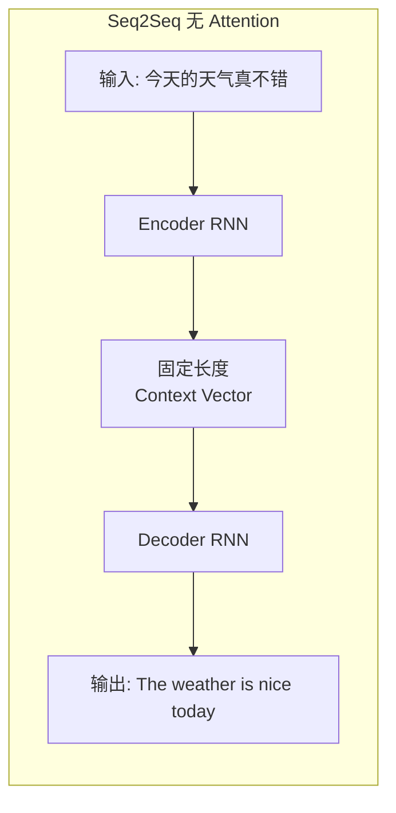
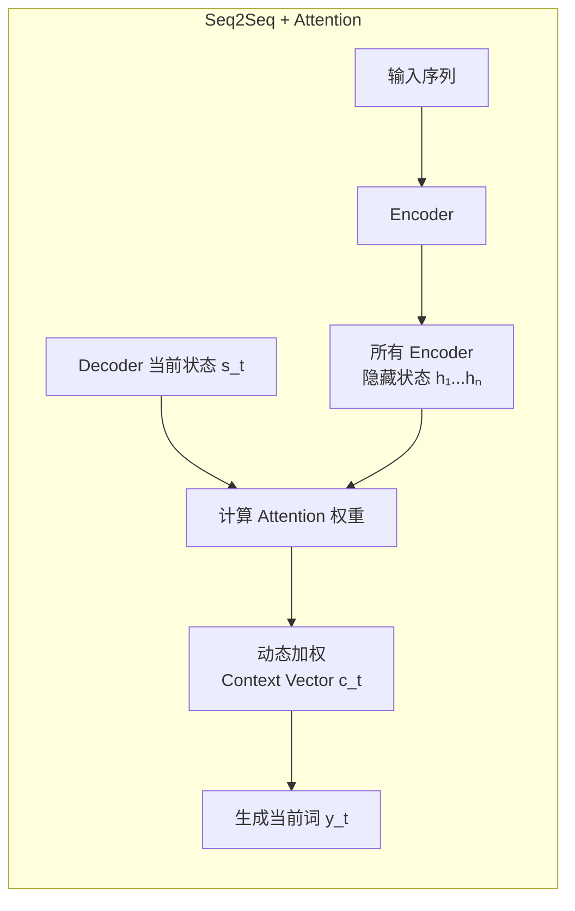
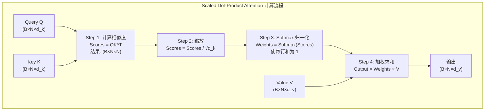
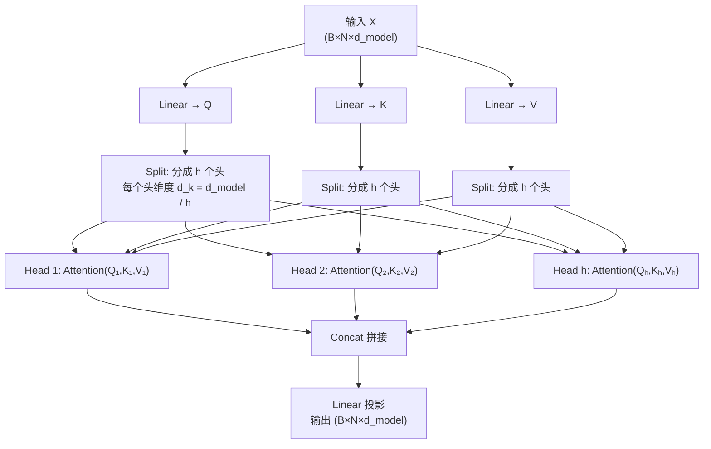

# 注意力机制深度解析

> 创建日期：2026-06-06
> 难度：⭐⭐⭐
> 前置知识：Seq2Seq、词嵌入（Embedding）、Softmax、矩阵乘法、Transformer 基础

---

## ⭐ 面试重点速览

| 优先级 | 知识点 | 出现频率 | 典型问法 |
|--------|--------|----------|----------|
| P0 | Scaled Dot-Product Attention 公式推导 | 95% | "写出 Attention 公式并解释每一项" |
| P0 | Multi-Head Attention 的物理含义 | 90% | "为什么需要多个头？不同头学到了什么？" |
| P0 | Self-Attention vs Cross-Attention 区别 | 85% | "Decoder 中的 Masked Attention 和 Cross-Attention 分别做什么？" |
| P1 | Bahdanau vs Luong Attention | 50% | "Attention 机制是如何提出的？" |
| P1 | FlashAttention 原理 | 40% | "Attention 的显存瓶颈在哪？怎么优化？" |
| P2 | Attention 复杂度分析 O(n²) | 35% | "Attention 能处理多长的序列？为什么？" |

---

## 一、应用场景 🎯

注意力机制是当代深度学习中最重要的基础组件之一，几乎渗透到了所有前沿 AI 系统中：

| 应用领域 | 具体场景 | 使用的 Attention 类型 |
|----------|----------|----------------------|
| **大语言模型 (LLM)** | 文本生成、对话、代码补全 | Self-Attention + Cross-Attention |
| **机器翻译** | 源语言 → 目标语言 | Encoder-Decoder Attention (Cross-Attention) |
| **多模态模型** | 文生图、图生文、视频理解 | Cross-Attention（文本→图像） |
| **语音识别** | 语音转文字 | Self-Attention（Conformer 等） |
| **蛋白质结构预测** | AlphaFold | 基于 Attention 的 Pairwise 表示 |
| **推荐系统** | 用户行为序列建模 | Self-Attention（SASRec 等） |

**核心价值**：让模型在处理序列中某个位置时，能够"关注"序列中所有相关的其他位置，而不是像 RNN 那样只能依赖逐步传递的隐藏状态。

---

## 二、核心原理 🔬

### 2.1 从 Seq2Seq 到 Attention 的演进

在 Attention 被提出之前，Seq2Seq 模型将整个输入句子压缩为一个固定长度的上下文向量 (context vector)：



**问题**：长句子信息被压缩丢失，Decoder 在生成每个词时看到的是同一个 context vector。



**改进**：Decoder 每生成一个词，都会重新计算对所有 Encoder 隐藏状态的注意力权重，获得不同的 context vector。

### 2.2 Bahdanau Attention vs Luong Attention

这是两种经典的 Encoder-Decoder Attention 变体：

| 维度 | Bahdanau Attention (Additive) | Luong Attention (Multiplicative) |
|------|------------------------------|----------------------------------|
| **论文** | Bahdanau et al., 2015 | Luong et al., 2015 |
| **对齐分数计算** | score(s_t, h_i) = v^T · tanh(W_a·[s_t; h_i]) | score(s_t, h_i) = s_t^T · W_a · h_i |
| **特点** | 使用拼接+前馈网络，计算稍慢 | 使用点积/双线性，计算更快 |
| **使用范围** | Decoder 前一时刻状态 s_{t-1} | Decoder 当前时刻状态 s_t |
| **Context 使用方式** | 与 s_t 拼接后输出 | 先与 s_t 结合再输出 |

### 2.3 Scaled Dot-Product Attention（核心公式）

这是 Transformer 中使用的 Attention，也是所有现代 LLM 的基础：

$$
\text{Attention}(Q, K, V) = \text{softmax}\left(\frac{QK^T}{\sqrt{d_k}}\right) V
$$

**逐步拆解**：



**各矩阵的物理含义**：

| 矩阵 | 含义 | 类比 |
|------|------|------|
| **Q (Query)** | "我想找什么？" 当前位置在询问 | 你在图书馆检索系统中输入的搜索词 |
| **K (Key)** | "我是什么？" 所有位置的标签 | 图书的索引标签和标题 |
| **V (Value)** | "我有什么内容？" 实际携带的信息 | 图书的实际内容 |
| **QK^T** | "Query 和每个 Key 的匹配程度" | 搜索词和每本书标签的匹配得分 |
| **Softmax(QK^T/√d_k)** | "归一化后的注意力权重" | 你决定花多少时间看每本书 |
| **Attention 输出** | 所有 Value 的加权和 | 综合所有相关书的内容得到的理解 |

### 2.4 为什么除以 √d_k？

点积 QK^T 中，假设 Q 和 K 的各分量独立且均值为 0、方差为 1，则：

**QK^T 的方差 = d_k**

当 d_k 很大时（如 64 或 128），注意力分数的方差变得很大，导致 Softmax 输出趋近于 one-hot（梯度接近 0，训练困难）。

除以 √d_k 将方差缩放回 1，使 Softmax 保持在平滑区域，梯度有效传播。

### 2.5 Multi-Head Attention 的物理含义



**为什么需要多个头？**

| 头的数量 | 含义 |
|----------|------|
| **1 个头** | 只能关注一种关系模式（如仅关注"语法"关系） |
| **8 个头** | 不同头可能学到：语法依赖、语义关联、位置距离、共指关系等 |
| **物理本质** | 将 d_model 维空间划分为 h 个子空间，在每个子空间中独立计算 Attention，最后合并——等价于在不同的"语义子空间"中关注不同信息 |

**常见头的分工**（实证观察，非严格理论）：
- 头 1-2：关注相邻位置的局部语法关系
- 头 3-5：关注远距离的语义关联
- 头 6-8：关注特殊 token（如 [CLS]、标点符号）

### 2.6 Self-Attention vs Cross-Attention

| 维度 | Self-Attention | Cross-Attention |
|------|---------------|-----------------|
| **Q 来源** | 自身序列 | 自身序列（Decoder 端） |
| **K、V 来源** | 自身序列 | 另一序列（Encoder 端） |
| **使用位置** | Encoder 和 Decoder 的第一层 | Decoder 中 Cross-Attention 层 |
| **作用** | 捕捉序列内部依赖 | 利用源序列信息指导目标序列生成 |
| **注意力矩阵形状** | N×N（方阵） | N_dec × N_enc（通常为矩形） |

---

## 三、趣味解说 🎭

### 读文章时，你的眼睛就是 Attention 机制

想象你在读一篇论文，看到这句话：

**"Transformer 架构彻底改变了 NLP 领域，它由 Vaswani 等人在 2017 年提出。"**

当你读到这里的时候，你的眼睛会做这样的"注意力"操作：

1. **Query（你的问题）**："Vaswani 等人是谁？" —— 你的眼睛变成了一个 Query 向量
2. **Key 扫描**：你快速扫过参考文献列表，匹配名字 —— 每个引用条目是一个 Key
3. **注意力权重**：你找到了 "Vaswani et al., 2017" 的引用，给它极高权重，忽略其他
4. **Value 读取**：你阅读该引用的详细信息 —— 这就是 Value

**更生动的类比 —— 聚光灯下的舞台**：

舞台上有 10 位舞者（10 个 token），聚光灯（Attention）不会平等地照亮每一个人。当主角（当前处理的 token）开始独舞时，聚光灯可能：
- 80% 亮度打在主角身上（Self-loop，Self-Attention 中的对角线权重通常较大）
- 10% 亮度打在伴奏者身上（语义相关 token）
- 5% 亮度打在舞台边缘（上下文 token）
- 5% 亮度分散给其他人（无关 token，但 Softmax 保证权重之和为 1）

**Multi-Head 类比**：舞台上同时有 8 盏聚光灯（8 个 head），每盏灯从不同角度照亮舞台——一盏关注舞者站位（位置编码），一盏关注舞蹈动作（语义），一盏关注服装颜色（浅层特征），等等。

---

## 四、代码实现 💻

### 4.1 Multi-Head Attention 完整实现

```python
import torch
import torch.nn as nn
import torch.nn.functional as F
import math

class MultiHeadAttention(nn.Module):
    """Multi-Head Attention 的完整 PyTorch 实现"""
    def __init__(self, d_model=512, num_heads=8, dropout=0.1):
        super().__init__()
        assert d_model % num_heads == 0, "d_model 必须能被 num_heads 整除"

        self.d_model = d_model        # 模型总维度，如 512
        self.num_heads = num_heads    # 注意力头数，如 8
        self.d_k = d_model // num_heads  # 每个头的维度，如 64

        # Q、K、V 的联合线性投影（实践中常合并为一个矩阵节省计算）
        self.W_q = nn.Linear(d_model, d_model)
        self.W_k = nn.Linear(d_model, d_model)
        self.W_v = nn.Linear(d_model, d_model)

        # 输出投影
        self.W_o = nn.Linear(d_model, d_model)
        self.dropout = nn.Dropout(dropout)

    def scaled_dot_product_attention(self, Q, K, V, mask=None):
        """
        核心：Scaled Dot-Product Attention
        Q, K, V: (batch, num_heads, seq_len, d_k)
        """
        # 计算注意力分数: (B, h, N, d_k) × (B, h, d_k, N) → (B, h, N, N)
        scores = torch.matmul(Q, K.transpose(-2, -1)) / math.sqrt(self.d_k)

        # 可选：应用 mask（用于 Decoder 的因果遮罩或 Padding 遮罩）
        if mask is not None:
            # mask 中值为 True 的位置会被设为 -∞，Softmax 后权重 → 0
            scores = scores.masked_fill(mask == 0, float('-inf'))

        # Softmax 归一化得到注意力权重
        attn_weights = F.softmax(scores, dim=-1)
        attn_weights = self.dropout(attn_weights)

        # 加权求和: (B, h, N, N) × (B, h, N, d_k) → (B, h, N, d_k)
        output = torch.matmul(attn_weights, V)
        return output, attn_weights

    def forward(self, query, key, value, mask=None):
        """
        query, key, value: (batch, seq_len, d_model)
        返回: (batch, seq_len, d_model)
        """
        B, N, _ = query.shape

        # Step 1: 线性投影
        Q = self.W_q(query)   # (B, N, d_model)
        K = self.W_k(key)
        V = self.W_v(value)

        # Step 2: 拆分为多头
        # (B, N, d_model) → (B, N, num_heads, d_k) → (B, num_heads, N, d_k)
        Q = Q.view(B, N, self.num_heads, self.d_k).transpose(1, 2)
        K = K.view(B, N, self.num_heads, self.d_k).transpose(1, 2)
        V = V.view(B, N, self.num_heads, self.d_k).transpose(1, 2)

        # Step 3: 计算 Scaled Dot-Product Attention
        attn_output, attn_weights = self.scaled_dot_product_attention(Q, K, V, mask)

        # Step 4: 合并多头
        # (B, num_heads, N, d_k) → (B, N, num_heads, d_k) → (B, N, d_model)
        attn_output = attn_output.transpose(1, 2).contiguous().view(B, N, self.d_model)

        # Step 5: 最终线性投影
        output = self.W_o(attn_output)

        return output, attn_weights
```

### 4.2 因果遮罩 (Causal Mask) 生成

```python
def generate_causal_mask(seq_len):
    """
    生成下三角遮罩，确保 Decoder 只能看到当前位置及之前的 token
    这是 GPT 系列模型自回归生成的关键
    """
    # 创建上三角矩阵（主对角线以上为 True → 需遮蔽）
    # torch.triu 返回上三角部分
    mask = torch.triu(torch.ones(seq_len, seq_len), diagonal=1).bool()
    # 取反：允许看到对角线及以下（过去+当前），遮蔽上方（未来）
    causal_mask = ~mask  # True = 允许关注, False = 遮蔽
    return causal_mask

# 示例：seq_len=4 时的因果遮罩
# [[ T,  F,  F,  F],   ← token 0 只能看自己
#  [ T,  T,  F,  F],   ← token 1 能看 0 和 1
#  [ T,  T,  T,  F],   ← token 2 能看 0,1,2
#  [ T,  T,  T,  T]]   ← token 3 能看全部
```

### 4.3 FlashAttention 的核心思想（伪代码）

```python
# FlashAttention 的核心优化策略（简化版伪代码）
def flash_attention(Q, K, V, block_size=128):
    """
    与标准 Attention 数学等价，但通过分块计算降低显存访问
    核心技巧：
      1. Tiling: 将 QK^T 计算分块，避免完整 N×N 矩阵写入 HBM
      2. Recomputation: 反向传播时重新计算 Softmax，不保存中间矩阵
    """
    B, H, N, D = Q.shape
    scale = 1.0 / math.sqrt(D)

    # 将序列分块
    Q_blocks = Q.chunk(N // block_size, dim=2)   # Q 按列分块
    KV_blocks = list(zip(
        K.chunk(N // block_size, dim=2),          # K 按列分块
        V.chunk(N // block_size, dim=2)           # V 按列分块
    ))

    output = torch.zeros_like(Q)
    # online softmax 所需的归一化统计量
    row_max = torch.full((B, H, N, 1), -float('inf'), device=Q.device)
    row_sum = torch.zeros(B, H, N, 1, device=Q.device)

    for K_block, V_block in KV_blocks:
        for i, Q_block in enumerate(Q_blocks):
            # 当前块的注意力分数（仅在 SRAM 中）
            S_block = (Q_block @ K_block.transpose(-2, -1)) * scale

            # Online Softmax: 动态更新最大值和归一化分母
            m_new = torch.max(row_max, S_block.max(dim=-1, keepdim=True).values)
            row_sum = row_sum * torch.exp(row_max - m_new) + \
                      S_block.exp().sum(dim=-1, keepdim=True) * \
                      torch.exp(S_block.max(dim=-1, keepdim=True).values - m_new)
            row_max = m_new

            # 累积加权输出
            P_block = torch.exp(S_block - row_max) / row_sum
            # 注意：实际实现中还需要 rescale 之前累积的输出
            output[:, :, i*block_size:(i+1)*block_size] += P_block @ V_block

    return output
```

---

## 五、优缺点 ⚖️

| 优点 | 缺点 |
|------|------|
| **并行计算**：所有位置的 Attention 可同时计算，不受序列顺序限制 | **O(n²) 复杂度**：序列长度翻倍，计算量翻四倍 |
| **长距离依赖**：任意两个位置直接交互（最短路径 O(1)），RNN 需要 O(n) 步 | **显存线性增长**：需要存储 N×N 注意力矩阵 |
| **可解释性**：注意力权重可直接可视化为热力图，理解模型"看到了什么" | **位置信息缺失**：纯 Attention 不知道 token 顺序，需额外引入位置编码 |
| **灵活性强**：Self-Attention、Cross-Attention、Causal Attention 等多种变体 | **对长序列不友好**：序列超过 2048 时显存和计算开销急剧上升 |
| **无状态依赖**：不像 RNN 需要顺序传递隐藏状态 | **平方复杂度天花板**：与线性 Attention 等替代方案相比仍有差距 |

---

## 六、面试高频题 📝

### 6.1 基础必答题

**Q1: 写出 Scaled Dot-Product Attention 的公式，解释每一步的作用。**
> Attention(Q,K,V) = Softmax(QK^T / √d_k) V
> - QK^T：计算 Query 与所有 Key 的相似度（点积衡量向量夹角）
> - /√d_k：缩放防止方差过大导致 Softmax 饱和
> - Softmax：归一化为概率分布（每行和为 1）
> - ×V：按权重聚合 Value 信息

**Q2: Self-Attention 和 Cross-Attention 的区别？分别在 Transformer 的哪里使用？**
> Self-Attention：Q、K、V 来自同一序列。用于 Encoder 的每一层和 Decoder 的第一层（Masked Self-Attention）。
> Cross-Attention：Q 来自 Decoder，K、V 来自 Encoder。用于 Decoder 的 Cross-Attention 子层，让解码器利用编码器的输出。

**Q3: Multi-Head Attention 为什么有效？单个头和多个头的本质区别？**
> 多个头允许模型在不同的表示子空间中分别计算注意力。单个头对所有维度使用同一组注意力权重，多头的每个头关注不同的特征模式（语法、语义、位置等），最后合并信息。类似于 CNN 中的多个卷积核。

### 6.2 进阶思考题

**Q4: Attention 的 O(n²) 复杂度从何而来？有哪些优化方向？**
> O(n²) 来自 QK^T 矩阵乘法（n×d × d×n → n×n）。优化方向：
> (1) FlashAttention：利用 SRAM 分块计算，减少 HBM 读写（已广泛使用）
> (2) Sparse Attention：只计算部分位置（Sliding Window, Stride）
> (3) Linear Attention：用核函数将 QK^T 分解为 Q(K^T V)，复杂度降至 O(n)
> (4) Multi-Query / Grouped-Query Attention：共享 K、V 头，减少 KV Cache

**Q5: 为什么 GPT 等 Decoder-only 模型使用 Causal Mask？**
> 自回归生成要求每个 token 只能看到它之前的 token，否则就是"作弊"（看到未来答案）。Causal Mask 通过将注意力矩阵的上三角部分设为 -∞，确保 Softmax 后未来位置的权重为 0。

### 6.3 场景设计题

**Q6: 你需要处理 128K 超长上下文，标准 Attention 显存不够怎么办？**
> 方案一：使用 FlashAttention + GQA (Grouped-Query Attention) 降低显存
> 方案二：采用 Ring Attention，将序列分片到多卡上，每卡计算本地块的 Attention 并环形通信
> 方案三：使用稀疏 Attention 模式（如 Longformer 的 Sliding Window + Global Attention）
> 方案四：更换位置编码（如 RoPE 配合 NTK-aware 插值扩展到更长序列）
> 面试中建议先分析瓶颈（QK^T 矩阵 O(n²) 显存），再给出分层方案。

---

## 七、常见误区 ❌

| 误区 | 正确认知 |
|------|----------|
| "Self-Attention 中 Q、K、V 是三个不同的输入" | 在 Self-Attention 中，Q、K、V 来自同一输入经三个不同的线性投影得到；在 Cross-Attention 中 K、V 来自另一序列 |
| "除以 √d_k 是为了数值稳定" | 不准确。核心原因是控制点积方差，防止 Softmax 进入梯度饱和区。数值稳定只是副产品 |
| "注意力权重越高，该位置越重要" | 不一定。注意力权重反映的是"关联度"，不是"重要性"。高权重可能是噪音或位置偏置 |
| "Multi-Head 就是做了多次 Attention 然后取平均" | 不是取平均。是把 d_model 拆成 h 份，每份独立做 Attention，最后拼接起来再做线性投影 |
| "FlashAttention 是一种近似算法" | 错误。FlashAttention 在数学上严格等价于标准 Attention，只是改变了计算顺序 |
| "Bahdanau Attention 已经被淘汰了" | 虽然 Transformer 使用 Scaled Dot-Product，但加性 Attention 在某些场景（如小维度、需要更多非线性）仍有价值 |

---

## 八、关键公式速查表

| 公式 | 名称 | 说明 |
|------|------|------|
| score(Q,K) = QK^T / √d_k | Scaled Dot-Product | Transformer 使用的 Attention 分数 |
| score(s_t, h_i) = v^T tanh(W[s_t; h_i]) | Bahdanau (Additive) | 加性注意力，使用前馈网络 |
| score(s_t, h_i) = s_t^T W h_i | Luong (General) | 双线性注意力 |
| score(s_t, h_i) = s_t^T h_i | Luong (Dot) | 简单点积注意力 |
| MultiHead(Q,K,V) = Concat(head_1,...,head_h)W^O | Multi-Head | 多头注意力聚合 |
| head_i = Attention(QW_i^Q, KW_i^K, VW_i^V) | Single Head | 单头注意力 |

---

## 九、参考资源

| 资源 | 说明 |
|------|------|
| [Attention Is All You Need](https://arxiv.org/abs/1706.03762) | Transformer 原论文（2017） |
| [Neural Machine Translation by Jointly Learning to Align and Translate](https://arxiv.org/abs/1409.0473) | Bahdanau Attention 原论文（2015） |
| [FlashAttention: Fast and Memory-Efficient Exact Attention](https://arxiv.org/abs/2205.14135) | FlashAttention 论文（2022） |
| [The Illustrated Transformer](https://jalammar.github.io/illustrated-transformer/) | Jay Alammar 经典图解 |
| [Attention? Attention!](https://lilianweng.github.io/posts/2018-06-24-attention/) | Lilian Weng 注意力机制综述 |

---

> **下一篇**：[扩散模型](./diffusion-model.md) -- 从噪声中生成世界的魔法