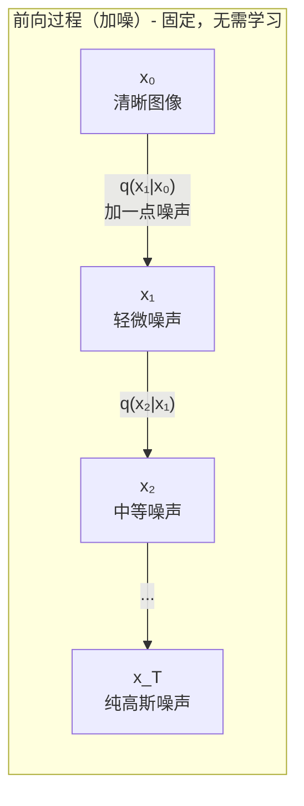
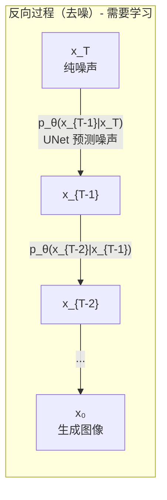
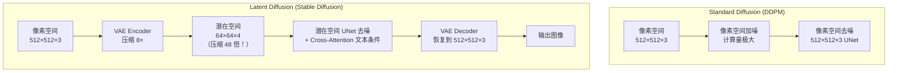
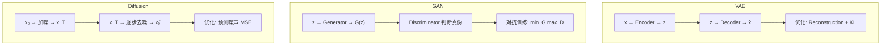

# 扩散模型

> 创建日期：2026-06-06
> 难度：⭐⭐⭐
> 前置知识：概率论（高斯分布、马尔可夫链）、深度学习基础、UNet 架构、VAE 概念

---

## ⭐ 面试重点速览

| 优先级 | 知识点 | 出现频率 | 典型问法 |
|--------|--------|----------|----------|
| P0 | 扩散模型的前向和反向过程 | 90% | "扩散模型的两个过程分别做什么？" |
| P0 | 训练目标（预测噪声 vs 预测原图） | 85% | "DDPM 的损失函数是什么？为什么预测噪声？" |
| P0 | Stable Diffusion 与 DDPM 的区别 | 80% | "为什么 Stable Diffusion 比 DDPM 快？" |
| P1 | Classifier-Free Guidance 原理 | 60% | "CFG 的 scale 参数起什么作用？" |
| P1 | 扩散模型 vs GAN vs VAE 对比 | 55% | "为什么现在扩散模型比 GAN 更流行？" |
| P2 | DDIM 加速采样 | 35% | "如何加速扩散模型的采样过程？" |

---

## 一、应用场景 🎯

扩散模型已从学术界的"慢生成"工具蜕变为工业界最重要的图像/视频生成技术：

| 应用领域 | 具体场景 | 代表模型 |
|----------|----------|----------|
| **文生图** | 根据文字描述生成图片 | Stable Diffusion, DALL-E 3, Midjourney |
| **图生图** | 图像编辑、风格迁移、超分辨率 | ControlNet, img2img pipeline |
| **视频生成** | 文本生成视频、视频编辑 | Sora (OpenAI), Runway Gen-3 |
| **3D 生成** | 文本生成 3D 模型 | DreamFusion, Zero-1-to-3 |
| **音频合成** | 文本生成语音、音乐生成 | AudioLDM, MusicLM |
| **分子生成** | 药物分子设计 | EDM (Equivariant Diffusion Model) |

**核心价值**：扩散模型提供了一种训练稳定、生成质量极高的生成建模范式，其数学优雅性使得理论分析和工程优化都有清晰的路径。

---

## 二、核心原理 🔬

### 2.1 墨水扩散的物理直觉

一杯清水里滴入一滴墨水，墨水会逐渐扩散，最终均匀分布（纯噪声状态）。扩散模型的核心思想是：

**前向过程（加噪）**：模拟墨水扩散——在一张清晰图片上逐步添加噪声，直到变成纯噪声
**反向过程（去噪）**：学习逆转这个过程——从纯噪声逐步恢复出清晰图片





### 2.2 DDPM 核心公式

**前向扩散过程**（固定，无需学习）：

给定一张干净图像 x₀，通过 T 步逐步添加高斯噪声：

$$
x_t = \sqrt{\bar{\alpha}_t} \cdot x_0 + \sqrt{1 - \bar{\alpha}_t} \cdot \epsilon, \quad \epsilon \sim \mathcal{N}(0, I)
$$

其中：
- β_t 是噪声调度（noise schedule），通常从小到大（如 1e-4 到 0.02）
- α_t = 1 - β_t
- ᾱ_t = ∏ᵢ₌₁ᵗ αᵢ（累积乘积，随着 t 增大而减小）
- 当 t=T 时，ᾱ_T ≈ 0，x_T ≈ N(0, I)（纯噪声）

**关键性质**：前向过程可以直接从 x₀ 一步跳到 x_t，无需迭代！

**反向去噪过程**（需要学习）：

$$
p_\theta(x_{t-1} | x_t) = \mathcal{N}(x_{t-1}; \mu_\theta(x_t, t), \Sigma_\theta(x_t, t))
$$

其中 μ_θ 由 UNet 预测，Σ_θ 通常固定为与时间步相关的常数。

**训练目标**（DDPM 简化版）：

$$
\mathcal{L}_{\text{simple}} = \mathbb{E}_{t, x_0, \epsilon} \left[ \|\epsilon - \epsilon_\theta(x_t, t)\|^2 \right]
$$

**核心洞察**：训练的目标不是直接预测 x₀，而是预测添加的噪声 ε！这比直接预测图像更简单，相当于学习"这幅图里哪个部分是噪声，需要去掉"。

### 2.3 DDPM 训练与采样全流程

```mermaid
graph TD
    subgraph "训练阶段"
        A1["从数据集中取一张真实图像 x₀"] --> A2["随机采样时间步 t ~ Uniform(1,T)"]
        A2 --> A3["随机采样噪声 ε ~ N(0,I)"]
        A3 --> A4["计算加噪图像: x_t = √ᾱ_t·x₀ + √(1-ᾱ_t)·ε"]
        A4 --> A5["UNet ε_θ(x_t, t) 预测噪声"]
        A5 --> A6["损失: MSE(ε_pred, ε_true)"]
        A6 --> A7["反向传播更新 UNet 参数"]
    end

    subgraph "采样/推理阶段"
        B1["从纯噪声开始: x_T ~ N(0,I)"] --> B2["for t = T down to 1:"]
        B2 --> B3["UNet 预测噪声: ε_θ(x_t, t)"]
        B3 --> B4["计算去噪均值: μ_t = (x_t - √(1-ᾱ_t)·ε_θ) / √ᾱ_t"]
        B4 --> B5["采样: x_{t-1} ~ N(μ_t, σ_t²·I)"]
        B5 --> B6{t > 1?}
        B6 -->|是| B2
        B6 -->|否| B7["输出最终图像 x₀"]
    end
```



### 2.4 Stable Diffusion：Latent Diffusion Model

DDPM 的最大问题：直接在像素空间（如 512×512×3）做扩散，计算量巨大。

**Stable Diffusion 的核心创新**：将扩散过程搬到压缩后的潜在空间（Latent Space）！



**Stable Diffusion 的三大组件**：

| 组件 | 作用 | 结构 |
|------|------|------|
| **VAE** | 将图像压缩到潜在空间（编码）并恢复（解码） | Encoder + Decoder，冻结或微调 |
| **UNet** | 在潜在空间中预测噪声，实现去噪 | 带 Skip Connection 的 UNet + Cross-Attention 注入文本条件 |
| **Text Encoder** | 将文本 prompt 编码为条件向量 | CLIP Text Encoder（冻结） |

### 2.5 Classifier-Free Guidance (CFG)

这是控制生成图像与文本 prompt 匹配度的关键技巧：

$$
\epsilon_\theta^{\text{CFG}}(x_t, t, c) = \epsilon_\theta(x_t, t, \emptyset) + w \cdot \left[\epsilon_\theta(x_t, t, c) - \epsilon_\theta(x_t, t, \emptyset)\right]
$$

其中：
- c：文本条件（prompt 的编码）
- ∅：空条件（无条件，即无 prompt）
- w：guidance scale（通常取 7.5）

**直观理解**：无条件生成的方向指向"普通图像"分布，有条件生成的方向指向"符合 prompt 的图像"分布。CFG 沿着"有条件 - 无条件"的方向外推，增强 prompt 的引导力度。

### 2.6 扩散模型 vs GAN vs VAE 全面对比



| 维度 | Diffusion Model | GAN | VAE |
|------|---------|-----|-----|
| **核心思想** | 学习逆向扩散过程 | 生成器与判别器对抗博弈 | 变分推断，学习潜在分布 |
| **训练稳定性** | 极高（简单回归任务） | 低（模式坍塌、训练震荡） | 高 |
| **生成质量** | 极高 | 高（StyleGAN 等） | 中等（通常较模糊） |
| **生成多样性** | 高（覆盖所有模式） | 低（容易模式坍塌） | 高 |
| **采样速度** | 慢（需多步迭代，20-50 步） | 极快（单次前向传播） | 快（单次前向传播） |
| **潜在空间** | 有（Latent Diffusion） | 有 | 有（显式编码） |
| **似然估计** | 可近似计算 | 无法计算 | 有 ELBO 下界 |
| **代表模型** | SD, DALL-E 3, Midjourney | StyleGAN, BigGAN | Vanilla VAE, VQ-VAE |

---

## 三、趣味解说 🎭

### 一杯墨水的故事

想象你有一杯清水和一瓶墨水。

**前向扩散（加噪）**：你往清水里滴一滴墨水，墨水迅速扩散，水的颜色从清澈变得浑浊，最终变成均匀的灰色。这个过程是确定的、不可逆的——你知道墨水最终会均匀分布，但不知道具体哪个分子去了哪里。

**反向扩散（去噪）**：现在给你一杯均匀的灰色水（纯噪声），你需要在脑海中想象："如果这杯灰色水之前是一幅画，它原来是什么样子？" 这就是扩散模型要学的——从混沌中恢复秩序。

**但这里有个关键**：你在训练时见过无数对"清水→灰水"的过程，所以你知道灰水"通常"是怎么变回清水的。训练好的 UNet 就像一个经验丰富的调酒师，知道如何从一杯混合饮料中还原出原始配方。

**Stable Diffusion 的加速魔法**：标准 DDPM 相当于在 512×512 的高清画布上一点一点擦除噪声。Stable Diffusion 说："先别在高清画布上折腾，我们把它缩小到 64×64 的草图，在草图上做去噪，最后再放大回去！" 这个"草图"就是潜在空间 (Latent Space)，压缩比高达 48 倍，所以速度大幅提升。

### 雕塑家 vs 画家

- **GAN 像画家**：一笔挥就，速度快但可能画歪
- **扩散模型像雕塑家**：从一块粗糙的石头（噪声）开始，一刀一刀地雕琢，过程慢但成品精美
- **VAE 像复印机**：能复制但有点模糊

---

## 四、代码实现 💻

### 4.1 DDPM 训练循环

```python
import torch
import torch.nn as nn
import torch.nn.functional as F

class DDPM:
    """DDPM 训练与采样封装类"""
    def __init__(self, model, timesteps=1000, beta_start=1e-4, beta_end=0.02, device='cuda'):
        """
        model: UNet 模型 ε_θ(x_t, t)，输入带噪图像和时间步，输出预测噪声
        timesteps: 扩散总步数 T，通常取 1000
        """
        self.model = model
        self.T = timesteps
        self.device = device

        # 线性噪声调度：β_t 从 beta_start 线性增加到 beta_end
        self.betas = torch.linspace(beta_start, beta_end, timesteps).to(device)

        # 预计算 α、ᾱ 等用于快速加噪和去噪
        self.alphas = 1.0 - self.betas
        self.alphas_cumprod = torch.cumprod(self.alphas, dim=0)  # ᾱ_t = ∏(1-β_s)

        # 用于前向加噪：x_t = √ᾱ_t·x₀ + √(1-ᾱ_t)·ε
        self.sqrt_alphas_cumprod = torch.sqrt(self.alphas_cumprod)
        self.sqrt_one_minus_alphas_cumprod = torch.sqrt(1.0 - self.alphas_cumprod)

    def forward_diffusion(self, x_0, t, noise=None):
        """
        前向加噪过程：一步从 x₀ 跳到 x_t
        这是训练时批量生成训练样本的关键
        """
        if noise is None:
            noise = torch.randn_like(x_0)

        # 提取对应时间步的系数（需要用 gather 处理 batch 维度）
        sqrt_alpha = self.sqrt_alphas_cumprod[t].view(-1, 1, 1, 1)
        sqrt_one_minus = self.sqrt_one_minus_alphas_cumprod[t].view(-1, 1, 1, 1)

        # 核心公式：x_t = √ᾱ_t · x₀ + √(1-ᾱ_t) · ε
        x_t = sqrt_alpha * x_0 + sqrt_one_minus * noise
        return x_t, noise

    def train_step(self, x_0, optimizer):
        """单步训练"""
        B = x_0.shape[0]
        # 随机采样时间步
        t = torch.randint(0, self.T, (B,), device=self.device)

        # 前向加噪得到 (x_t, 真实噪声 ε)
        x_t, noise = self.forward_diffusion(x_0, t)

        # UNet 预测噪声
        noise_pred = self.model(x_t, t)

        # 简单 MSE 损失
        loss = F.mse_loss(noise_pred, noise)

        optimizer.zero_grad()
        loss.backward()
        optimizer.step()

        return loss.item()

    @torch.no_grad()
    def sample(self, shape, cond=None):
        """
        采样（推理）：从纯噪声逐步去噪生成图像
        shape: (B, C, H, W) 目标图像形状
        cond: 可选的条件信息（如文本 embedding）
        """
        self.model.eval()
        B = shape[0]

        # 从纯高斯噪声开始
        x = torch.randn(shape, device=self.device)

        # 逐步去噪：从 T 到 1
        for t in reversed(range(self.T)):
            t_batch = torch.full((B,), t, device=self.device, dtype=torch.long)

            # 预测当前步的噪声
            noise_pred = self.model(x, t_batch, cond)

            # 计算去噪后的均值 μ_t
            alpha = self.alphas[t]
            alpha_cumprod = self.alphas_cumprod[t]
            beta = self.betas[t]

            # μ_t = (x_t - β_t/√(1-ᾱ_t) · ε_θ) / √α_t
            coef = beta / self.sqrt_one_minus_alphas_cumprod[t]
            mean = (x - coef * noise_pred) / torch.sqrt(alpha)

            if t > 0:
                # 添加随机噪声（除了最后一步 t=0）
                noise = torch.randn_like(x)
                sigma = torch.sqrt(beta)  # 简化：方差 = β_t
                x = mean + sigma * noise
            else:
                x = mean

        return x
```

### 4.2 条件 UNet 的简化实现

```python
class ConditionalUNet(nn.Module):
    """带时间步和文本条件嵌入的简化 UNet"""
    def __init__(self, in_channels=4, out_channels=4,  # Latent Diffusion 使用 4 通道
                 model_channels=320, cond_dim=768):
        """
        cond_dim: 文本条件维度（CLIP embedding = 768）
        """
        super().__init__()
        # 时间步嵌入：将标量 t 映射为向量
        self.time_embed = nn.Sequential(
            SinusoidalPositionEmbedding(model_channels),  # 正弦位置编码
            nn.Linear(model_channels, model_channels * 4),
            nn.SiLU(),
            nn.Linear(model_channels * 4, model_channels * 4),
        )

        # 条件投影：将文本 embedding 映射到模型维度
        self.cond_proj = nn.Linear(cond_dim, model_channels * 4)

        # 简化 UNet 结构（实际实现中会有多个下采样和上采样块）
        self.input_conv = nn.Conv2d(in_channels, model_channels, 3, padding=1)

        # 下采样
        self.down1 = ResBlock(model_channels, model_channels * 2, time_emb_dim=model_channels * 4)
        self.down2 = ResBlock(model_channels * 2, model_channels * 4, time_emb_dim=model_channels * 4)

        # 中间层（含 Cross-Attention 注入文本条件）
        self.mid_block = CrossAttnBlock(model_channels * 4, cond_dim=model_channels * 4)

        # 上采样
        self.up1 = ResBlock(model_channels * 4, model_channels * 2, time_emb_dim=model_channels * 4)
        self.up2 = ResBlock(model_channels * 2, model_channels, time_emb_dim=model_channels * 4)

        self.output_conv = nn.Conv2d(model_channels, out_channels, 3, padding=1)

    def forward(self, x, t, cond=None):
        # 时间嵌入
        t_emb = self.time_embed(t)  # (B, model_channels*4)

        # 条件嵌入（文本）
        if cond is not None:
            cond_emb = self.cond_proj(cond)  # (B, model_channels*4)
            t_emb = t_emb + cond_emb  # 融合时间信息和文本条件

        # UNet 主路径
        h = self.input_conv(x)
        h1 = self.down1(h, t_emb)
        h2 = self.down2(h1, t_emb)
        h_mid = self.mid_block(h2, t_emb)
        h_up1 = self.up1(h_mid + h2, t_emb)  # Skip Connection
        h_up2 = self.up2(h_up1 + h1, t_emb)
        output = self.output_conv(h_up2)
        return output


class SinusoidalPositionEmbedding(nn.Module):
    """Transformer 风格的正弦位置编码，用于编码时间步"""
    def __init__(self, dim):
        super().__init__()
        self.dim = dim

    def forward(self, t):
        device = t.device
        half_dim = self.dim // 2
        # 频率递减的正弦/余弦编码
        freqs = torch.exp(-math.log(10000) * torch.arange(0, half_dim, device=device) / half_dim)
        args = t.unsqueeze(-1) * freqs.unsqueeze(0)
        emb = torch.cat([torch.sin(args), torch.cos(args)], dim=-1)
        return emb


class ResBlock(nn.Module):
    """带时间嵌入的残差块"""
    def __init__(self, in_ch, out_ch, time_emb_dim):
        super().__init__()
        self.conv1 = nn.Conv2d(in_ch, out_ch, 3, padding=1)
        self.conv2 = nn.Conv2d(out_ch, out_ch, 3, padding=1)
        self.time_proj = nn.Linear(time_emb_dim, out_ch)
        self.skip = nn.Conv2d(in_ch, out_ch, 1) if in_ch != out_ch else nn.Identity()

    def forward(self, x, t_emb):
        h = F.silu(self.conv1(x))
        # 将时间嵌入注入到特征图中（通过广播相加）
        h = h + self.time_proj(F.silu(t_emb)).unsqueeze(-1).unsqueeze(-1)
        h = F.silu(self.conv2(h))
        return h + self.skip(x)


class CrossAttnBlock(nn.Module):
    """Cross-Attention 块，将文本条件注入到 UNet 中间层"""
    def __init__(self, dim, cond_dim):
        super().__init__()
        self.norm = nn.GroupNorm(32, dim)
        self.attn = nn.MultiheadAttention(dim, num_heads=8, batch_first=True)
        self.cond_proj = nn.Linear(cond_dim, dim)

    def forward(self, x, cond_emb):
        B, C, H, W = x.shape
        # 将空间特征展平为序列
        x_flat = x.view(B, C, H * W).transpose(1, 2)  # (B, H*W, C)
        x_norm = self.norm(x.view(B, C, H, W)).view(B, C, H * W).transpose(1, 2)

        # Cross-Attention：Q 来自图像特征，K、V 来自文本条件
        cond = self.cond_proj(cond_emb).unsqueeze(1)  # (B, 1, C) 作为 K、V
        attn_out, _ = self.attn(x_norm, cond, cond)
        return x + attn_out.transpose(1, 2).view(B, C, H, W)
```

---

## 五、优缺点 ⚖️

| 优点 | 缺点 |
|------|------|
| **训练极其稳定**：损失函数是简单的 MSE 回归，不会像 GAN 那样震荡 | **采样速度慢**：需要 T 步迭代（通常 20-1000 步），即使加速后也比 GAN 慢 |
| **生成质量极高**：目前图像生成质量最好的范式 | **推理成本高**：每次采样需要多次 UNet 前向传播 |
| **模式覆盖好**：不依赖对抗训练，不容易模式坍塌 | **对条件控制敏感**：CFG scale 参数调不好会过曝或失真 |
| **数学框架优雅**：基于马尔可夫链和得分匹配，理论扎实 | **步数多时有累积误差**：DDIM 等加速方法会引入一定质量损失 |
| **灵活可控**：可加入 ControlNet、IP-Adapter 等即插即用控制模块 | **视频生成仍很昂贵**：帧间一致性需额外处理 |

---

## 六、面试高频题 📝

### 6.1 基础必答题

**Q1: 扩散模型的前向过程和反向过程分别是什么？哪个需要学习？**
> 前向过程（加噪）：对原始图像 x₀ 逐步添加高斯噪声，经过 T 步后变为纯噪声 x_T ~ N(0,I)。该过程固定，无需学习，可以一步从 x₀ 跳到任意 x_t。
> 反向过程（去噪）：从纯噪声 x_T 开始，逐步去噪恢复图像。该过程需要学习，用 UNet 预测每一步的噪声 ε_θ(x_t, t)，然后用贝叶斯公式推导出去噪后的均值和方差。

**Q2: DDPM 的损失函数是什么？为什么预测噪声而不是直接预测图像？**
> 损失函数：L = E[||ε - ε_θ(x_t, t)||²]，预测添加的噪声 ε。
> 原因：(1) 预测噪声是更简单的任务——噪声服从标准高斯分布，目标明确；(2) 预测 x₀ 需要模型理解图像的全部细节，而预测噪声只需识别"异常"部分；(3) 数学推导表明预测噪声等价于最大化变分下界（ELBO）的简化形式。

**Q3: Stable Diffusion 和 DDPM 的核心区别？**
> (1) 工作空间：DDPM 在像素空间（512×512×3）扩散，SD 在潜在空间（64×64×4）扩散，压缩 48 倍，大幅降低计算量；(2) 条件注入：SD 使用 Cross-Attention 将文本条件注入 UNet；(3) 组件：SD 额外包含 VAE（压缩/解压）和 CLIP Text Encoder（文本编码）。

### 6.2 进阶思考题

**Q4: Classifier-Free Guidance 的 scale 参数调大/调小分别有什么效果？**
> scale 增大：图像更贴合 prompt，但可能过饱和、失真、出现伪影（典型值 7-9）
> scale 减小：图像多样性增加，但可能与 prompt 关联度降低（典型值 1-3）
> 本质：scale 控制"有条件生成"和"无条件生成"之间的插值程度，相当于在保真度和多样性之间权衡。

**Q5: 如何加速扩散模型的采样？**
> (1) DDIM：使用非马尔可夫采样，可以用更少步数（如 20-50 步代替 1000 步）
> (2) DPM-Solver：基于 ODE 的高阶数值求解器，可降至 10-20 步
> (3) LCM (Latent Consistency Model)：蒸馏训练，可降至 1-4 步
> (4) 模型量化/剪枝：减少 UNet 的计算量
> (5) 使用更高效的调度器：如 Euler、DPM++ 等

### 6.3 场景设计题

**Q6: 你需要设计一个"根据线稿生成上色图"的功能，如何基于扩散模型实现？**
> (1) 使用 ControlNet 架构：在预训练 SD 的 UNet 旁边添加一个可训练的"控制网络"，输入线稿作为条件
> (2) 训练数据：收集线稿-彩色图配对数据
> (3) 推理：用户输入线稿 + 可选的颜色描述 prompt，模型输出上色结果
> (4) 也可用 img2img pipeline：将线稿作为初始图像，用低 denoising strength 保留结构，同时注入颜色 prompt

---

## 七、常见误区 ❌

| 误区 | 正确认知 |
|------|----------|
| "扩散模型就是给图片加噪声再去除" | 过于简化。核心是学习得分函数（score function）∇log p(x)，去噪只是实现手段 |
| "Stable Diffusion 的 UNet 就是普通 UNet" | SD 的 UNet 包含 Cross-Attention 层来注入文本条件，结构比普通 UNet 复杂得多 |
| "扩散模型一定能生成训练集中存在的图片" | 扩散模型生成的是新样本，其分布逼近训练集分布但不是简单复制 |
| "CFG scale 越大越好" | scale 过大（>15）会导致图像过饱和、失真，需要在保真度和多样性间平衡 |
| "DDIM 改变了模型结构" | DDIM 只改变了采样策略（非马尔可夫），不改变模型结构和训练过程，可以复用已有 DDPM 模型 |
| "扩散模型不需要位置编码" | UNet 本身通过卷积有局部感受野，但时间步信息通过正弦位置编码注入到各层 |

---

## 八、关键参数速查

| 参数 | 典型值 | 含义 |
|------|--------|------|
| T（总步数） | 1000 (DDPM), 20-50 (DDIM) | 扩散过程的总步数 |
| β_start | 1e-4 | 噪声调度的起始值 |
| β_end | 0.02 | 噪声调度的结束值 |
| Guidance Scale | 7.5 | CFG 的引导强度 |
| Latent 分辨率 | 64×64 (SD 1.5/2.0) | 潜在空间分辨率 |
| VAE 压缩比 | 8× | 空间压缩倍数 |
| UNet 参数量 | 860M (SD 1.5) | 去噪模型参数 |
| 采样步数 | 20-50 (生产环境) | 实际推理使用的步数 |

---

## 九、参考资源

| 资源 | 说明 |
|------|------|
| [Denoising Diffusion Probabilistic Models](https://arxiv.org/abs/2006.11239) | DDPM 原论文（2020） |
| [High-Resolution Image Synthesis with Latent Diffusion Models](https://arxiv.org/abs/2112.10752) | Stable Diffusion 论文（2022） |
| [Denoising Diffusion Implicit Models](https://arxiv.org/abs/2010.02502) | DDIM 采样加速论文 |
| [Diffusion Models Beat GANs on Image Synthesis](https://arxiv.org/abs/2105.05233) | 扩散模型超越 GAN 的里程碑 |
| [What are Diffusion Models?](https://lilianweng.github.io/posts/2021-07-11-diffusion-models/) | Lilian Weng 扩散模型综述 |
| [Illustrated Stable Diffusion](https://jalammar.github.io/illustrated-stable-diffusion/) | Jay Alammar 图解 SD |

---

> **上一篇**：[注意力机制](./attention-mechanism.md) -- 大模型的核心引擎
> **下一篇**：[强化学习基础与RLHF](./reinforcement-learning.md) -- 让模型学会"更好"地回答