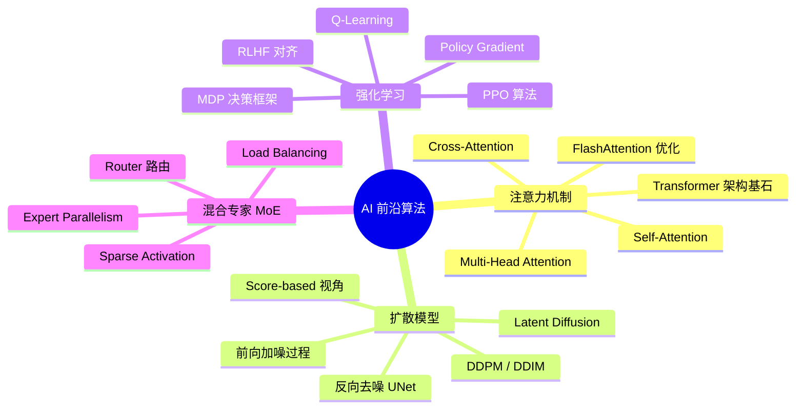
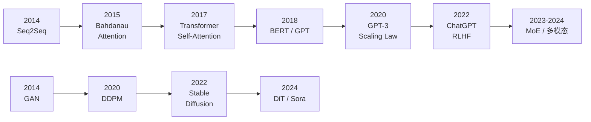
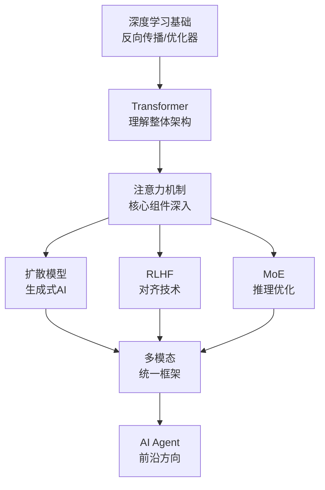

# AI前沿算法概览

> 创建日期：2026-06-06
> 难度：⭐⭐⭐
> 前置知识：深度学习基础、神经网络、概率论、线性代数

---

## ⭐ 面试重点速览

| 优先级 | 知识点 | 出现频率 | 重要程度 |
|--------|--------|----------|----------|
| P0 | 注意力机制（Self-Attention / Multi-Head Attention） | 90%+ | 必问 |
| P0 | Transformer 架构整体理解 | 85%+ | 必问 |
| P1 | 扩散模型原理（DDPM / Stable Diffusion 区别） | 60%+ | 高频 |
| P1 | RLHF 三阶段流程 | 55%+ | 高频 |
| P2 | MoE（混合专家）原理与负载均衡 | 30%+ | 中频 |
| P2 | FlashAttention 等优化技术 | 25%+ | 中频 |

---

## 一、应用场景 🎯

AI 前沿算法已从学术论文走进工业界，深刻改变了产品的核心能力：

| 算法 | 核心应用 | 代表产品/模型 |
|------|----------|---------------|
| **注意力机制** | NLP 理解、机器翻译、代码生成、多模态理解 | GPT-4、Claude、Gemini、所有 LLM |
| **扩散模型** | 图像生成、视频生成、3D 生成、音频合成 | Stable Diffusion、DALL-E 3、Midjourney、Sora |
| **强化学习** | 游戏 AI、机器人控制、LLM 对齐、推荐系统 | AlphaGo、ChatGPT（RLHF）、自动驾驶 |
| **混合专家(MoE)** | 大规模模型推理加速、多任务学习 | Mixtral 8x7B、GPT-4（传闻）、DeepSeek-V2 |

**AI 应用工程师视角**：你不需要从零实现这些算法，但必须理解其核心原理以：
- 正确选择模型架构
- 调优推理参数（temperature、top_p、classifier-free guidance 等）
- 诊断模型行为异常（幻觉、模式坍塌、奖励 hacking）
- 在面试中展示你的深度理解

---

## 二、核心原理 🔬

### 2.1 四大核心算法关系图



### 2.2 算法对比总表

| 维度 | 注意力机制 | 扩散模型 | 强化学习(RLHF) | MoE |
|------|-----------|---------|---------------|-----|
| **核心思想** | 动态加权聚合信息 | 学习逆向去噪过程 | 试错+奖励最大化 | 稀疏激活专家子网络 |
| **数学本质** | Softmax(QK^T/√d)V | 马尔可夫链逆向采样 | 马尔可夫决策过程 | 条件计算 |
| **训练范式** | 监督学习/自监督学习 | 自监督（噪声预测） | 交互式试错学习 | 监督/自监督+路由学习 |
| **计算复杂度** | O(n²) | O(T)（采样步数） | 依赖于环境交互 | O(k·n)（k为激活专家数） |
| **典型输出** | 上下文表示 | 生成图像/视频 | 策略/动作 | 混合预测 |
| **核心挑战** | 长序列效率 | 采样速度 | 奖励设计 | 负载均衡 |

### 2.3 算法演进脉络



---

## 三、趣味解说 🎭

### 3.1 如果把 AI 前沿算法比作一个乐队...

**注意力机制 = 指挥家**
指挥家不会平等地关注每一位乐手——在弦乐部分时目光聚焦弦乐组，在管乐部分时转向管乐组。同样，Self-Attention 让模型在处理每个词时，自动决定要"看"句子中的哪些其他词。

**扩散模型 = 雕塑家**
雕塑家从一块粗糙的大理石（纯噪声）开始，一刀一刀去掉多余的部分，最终呈现出精美的雕像（清晰图像）。扩散模型的"去噪"过程就是一步步从混沌中雕琢出秩序。

**强化学习 = 训犬师**
训犬师不会给狗狗一本教科书，而是用奖励（零食）和惩罚来塑造行为。RLHF 正是用人类偏好作为"零食"，逐步引导 LLM 说出人类喜欢的话。

**MoE = 医院会诊**
病人来了不需要所有科室的医生都来看——分诊台（Router）根据症状把病人分配给最相关的专家。MoE 的 Router 也是同样逻辑：每个 token 只需要激活少数几个专家。

---

## 四、代码实现 💻

### 4.1 一个极简的 Self-Attention 实现

```python
import torch
import torch.nn as nn
import torch.nn.functional as F

class SimpleSelfAttention(nn.Module):
    """极简 Self-Attention 实现，帮助理解核心计算"""
    def __init__(self, embed_dim):
        super().__init__()
        # Q、K、V 的线性投影层
        self.W_q = nn.Linear(embed_dim, embed_dim, bias=False)
        self.W_k = nn.Linear(embed_dim, embed_dim, bias=False)
        self.W_v = nn.Linear(embed_dim, embed_dim, bias=False)

    def forward(self, x):
        """
        x: (batch, seq_len, embed_dim)
        返回: 注意力加权后的表示 (batch, seq_len, embed_dim)
        """
        B, N, D = x.shape  # N = 序列长度, D = 嵌入维度

        # 计算 Q、K、V
        Q = self.W_q(x)  # (B, N, D)
        K = self.W_k(x)  # (B, N, D)
        V = self.W_v(x)  # (B, N, D)

        # Scaled Dot-Product Attention
        # 注意力分数 = QK^T / sqrt(d_k)，除以 sqrt(d_k) 防止梯度消失
        scale = D ** 0.5
        attn_scores = (Q @ K.transpose(-2, -1)) / scale  # (B, N, N)

        # Softmax 归一化得到注意力权重
        attn_weights = F.softmax(attn_scores, dim=-1)  # (B, N, N)

        # 加权求和：每个位置的输出是所有 V 的加权和
        output = attn_weights @ V  # (B, N, D)

        return output, attn_weights
```

### 4.2 扩散模型前向加噪（极简版）

```python
import torch

def forward_diffusion(x_0, t, betas):
    """
    扩散模型的前向加噪过程
    x_0: 原始干净图像 (B, C, H, W)
    t: 时间步
    betas: 噪声调度 (T,) 定义了每一步的噪声强度
    """
    # 计算 alpha 累积乘积: ᾱ_t = ∏(1-β_s) for s=1..t
    alphas = 1.0 - betas
    alphas_cumprod = torch.cumprod(alphas, dim=0)  # 累积乘积

    # 一步到位加噪公式: x_t = √(ᾱ_t) * x_0 + √(1-ᾱ_t) * ε
    sqrt_alpha_cumprod = torch.sqrt(alphas_cumprod[t])
    sqrt_one_minus_alpha_cumprod = torch.sqrt(1.0 - alphas_cumprod[t])

    noise = torch.randn_like(x_0)  # 标准高斯噪声
    x_t = sqrt_alpha_cumprod * x_0 + sqrt_one_minus_alpha_cumprod * noise

    return x_t, noise  # 返回加噪后的图像和噪声（用于训练目标）
```

### 4.3 Q-Learning 核心更新

```python
import numpy as np

# Q-Learning 的核心更新公式
def q_learning_update(Q, state, action, reward, next_state, done,
                       alpha=0.1, gamma=0.99):
    """
    Q-Learning 的 TD(0) 更新
    Q: Q表 (n_states, n_actions)
    alpha: 学习率
    gamma: 折扣因子，越大越看重长期收益
    """
    # 当前 Q 值
    current_q = Q[state, action]

    # 下一状态的最大 Q 值（贪心策略）
    max_next_q = np.max(Q[next_state]) if not done else 0.0

    # TD 目标 = 即时奖励 + 折现后的最大未来收益
    td_target = reward + gamma * max_next_q

    # TD 误差
    td_error = td_target - current_q

    # 更新 Q 值
    Q[state, action] += alpha * td_error

    return Q
```

---

## 五、优缺点 ⚖️

### 5.1 各算法优缺点对比

| 算法 | 优点 | 缺点 |
|------|------|------|
| **注意力机制** | 并行计算、长距离依赖建模、可解释性强 | O(n²)复杂度、显存占用大、长序列低效 |
| **扩散模型** | 生成质量极高、训练稳定、模式覆盖好 | 采样慢（需多步迭代）、推理成本高 |
| **强化学习RLHF** | 对齐人类偏好、灵活性强 | 训练不稳定、奖励 hacking、成本高昂 |
| **MoE** | 参数量大但计算量小、多任务能力强 | 负载不均衡、通信开销大、训练复杂 |

### 5.2 选型决策指南

| 你的需求 | 推荐算法 | 原因 |
|----------|----------|------|
| 文本理解/生成 | 注意力机制 + Transformer | NLP 的事实标准 |
| 图片/视频生成 | 扩散模型（Stable Diffusion） | 生成质量最好 |
| 对齐模型输出与人类偏好 | RLHF / DPO | 业界标准做法 |
| 大规模模型降本增效 | MoE | 激活参数少，推理快 |

---

## 六、面试高频题 📝

### 6.1 基础概念题

**Q1: Self-Attention 中为什么要除以 √d_k？**
> 点积 QK^T 的方差会随着维度 d_k 增大而增大，导致 Softmax 梯度进入极小区域（梯度消失）。除以 √d_k 将方差控制为 1，保持梯度稳定。

**Q2: 扩散模型和 GAN 的核心区别是什么？**
> GAN 是生成器与判别器的对抗博弈，训练不稳定但推理快；扩散模型是学习逆向马尔可夫链，训练稳定但采样慢。扩散模型生成多样性更好（模式覆盖），GAN 更容易模式坍塌。

**Q3: RLHF 的三个阶段分别做什么？**
> (1) SFT：用高质量人类回答微调基座模型；(2) 奖励模型：训练一个模型预测人类偏好分数；(3) PPO：用奖励模型作为 reward signal，通过强化学习进一步优化策略。

### 6.2 进阶思考题

**Q4: 为什么 MoE 模型可以"参数量大但推理快"？**
> MoE 中每个 token 只激活 top-k 个专家（通常 k=2），而非全部专家。总参数量虽然大（所有专家之和），但每次前向传播的计算量只取决于激活的专家数量。这是一种"条件计算"（Conditional Computation）范式。

**Q5: FlashAttention 为什么能加速 Attention 计算？**
> 标准 Attention 需要将完整的 N×N 注意力矩阵写入 HBM（高带宽显存），这是显存带宽瓶颈。FlashAttention 通过分块（Tiling）和重计算（Recomputation）策略，在 SRAM 中完成大部分计算，避免了中间矩阵写入 HBM，从而实现 2-4 倍加速并降低显存。

### 6.3 场景设计题

**Q6: 你要为一个对话机器人加入安全对齐能力，技术方案如何设计？**
> (1) 收集安全相关的偏好对比数据（好回答 vs 坏回答对）；(2) 训练一个安全奖励模型；(3) 使用 PPO 或 DPO 进行对齐训练；(4) 上线前用红队测试（Red Teaming）验证安全性；(5) 持续收集用户反馈迭代奖励模型。

---

## 七、常见误区 ❌

| 误区 | 正确认知 |
|------|----------|
| "Attention 就是 Transformer" | Attention 是 Transformer 的核心组件之一，Transformer 还包括 FFN、LayerNorm、残差连接等 |
| "扩散模型就是给图片加噪声再去除" | 扩散模型的核心是学习噪声预测/得分函数，去噪只是表象 |
| "RLHF 就是让模型背答案" | RLHF 是学习人类偏好分布，而非记忆具体回答；奖励模型泛化到未见过的回答 |
| "MoE 模型就是多个模型 ensemble" | MoE 是稀疏激活（每个 token 只用少数专家），不是多个完整模型的集成 |
| "DPO 完全替代了 RLHF" | DPO 简化了流程但并非万能，在线 RLHF 在某些场景仍有优势（如探索新行为） |
| "FlashAttention 改变了 Attention 的计算结果" | FlashAttention 在数学上与标准 Attention 等价，只是改变了计算顺序和显存访问模式 |

---

## 八、AI 算法发展趋势

### 8.1 LLM 时代算法面试的变化

| 过去（2020 前） | 现在（2024-2026） |
|-----------------|-------------------|
| 手写反向传播、手写 CNN | 理解 Transformer 架构设计、分析 Attention 模式 |
| LeetCode 刷题为主 | 算法原理深度理解 + 工程落地能力 |
| 考察单一算法 | 考察算法选型与组合能力 |
| 关注模型精度 | 关注推理效率、部署成本、对齐安全 |
| 经典 ML 算法（SVM、决策树） | 大模型训练/推理优化（量化、KV Cache、FlashAttention） |

### 8.2 2025-2026 面试新风向

1. **推理能力（Reasoning）**：Chain-of-Thought、Tree-of-Thought 等推理增强技术成为必问
2. **多模态融合**：如何将文本、图像、音频的 Attention 统一到一个框架
3. **长上下文处理**：RoPE 扩展、 Streaming Attention、 Ring Attention 等
4. **Agent 与工具使用**：LLM 如何作为 Agent 调用外部工具和 API
5. **合成数据与自我改进**：Self-play、自我对弈等训练范式
6. **推理加速**：投机解码（Speculative Decoding）、KV Cache 压缩等

### 8.3 推荐学习路径



---

## 九、参考资源

| 资源 | 说明 |
|------|------|
| [Attention Is All You Need](https://arxiv.org/abs/1706.03762) | Transformer 原论文，必读 |
| [Denoising Diffusion Probabilistic Models](https://arxiv.org/abs/2006.11239) | DDPM 原论文 |
| [Training language models to follow instructions](https://arxiv.org/abs/2203.02155) | InstructGPT / RLHF 论文 |
| [FlashAttention](https://arxiv.org/abs/2205.14135) | FlashAttention 论文 |
| [DeepSeek-V2](https://arxiv.org/abs/2405.04434) | MoE 架构代表论文 |
| 本专题子页面 | attention-mechanism.md / diffusion-model.md / reinforcement-learning.md |

---

> **下一步**：点击左侧导航进入各算法专题页面进行深入学习。