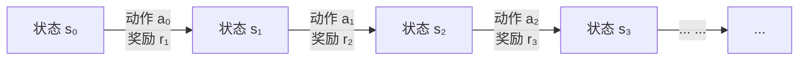
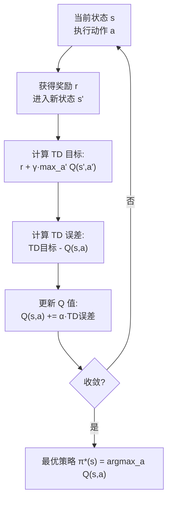
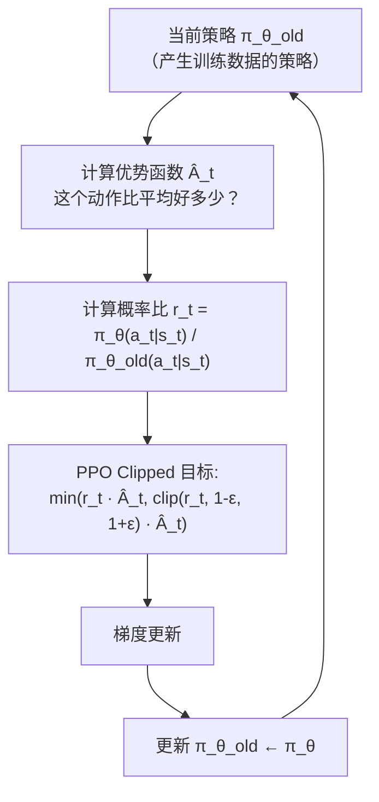
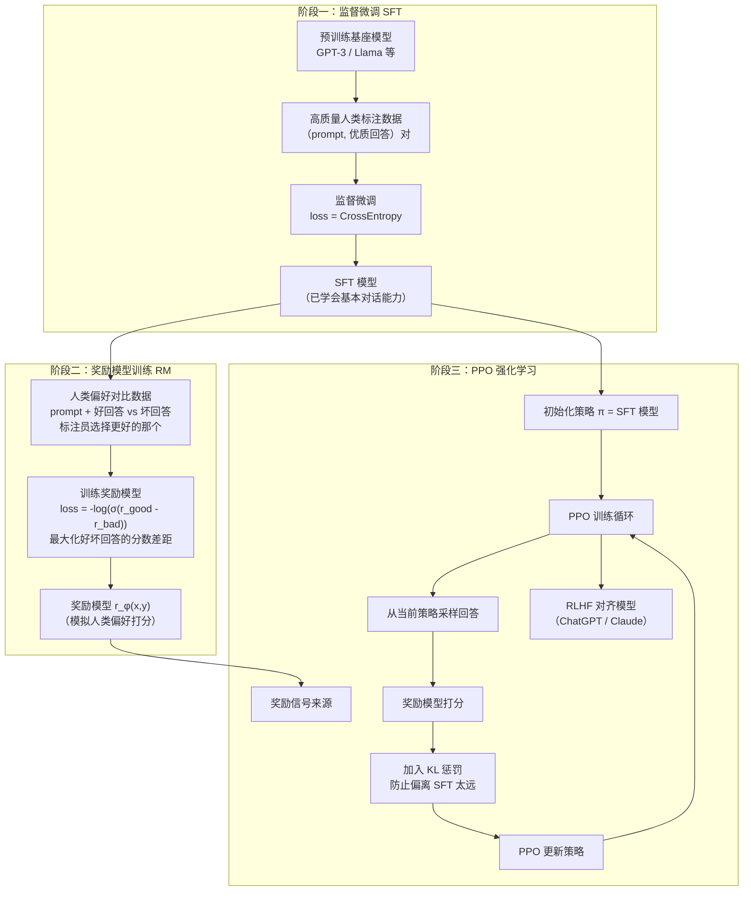
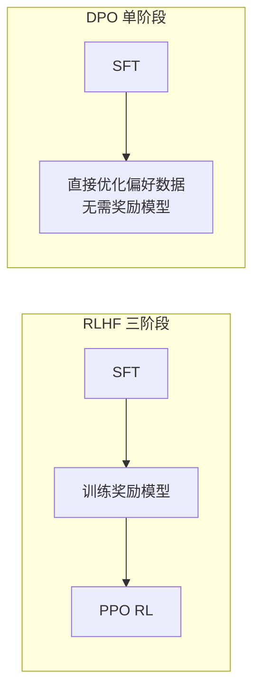

# 强化学习基础与RLHF

> 创建日期：2026-06-06
> 难度：⭐⭐⭐
> 前置知识：概率论（条件概率、期望）、马尔可夫链、深度学习基础、策略梯度概念

---

## ⭐ 面试重点速览

| 优先级 | 知识点 | 出现频率 | 典型问法 |
|--------|--------|----------|----------|
| P0 | RLHF 三阶段流程 | 95% | "ChatGPT 的 RLHF 是怎么做的？" |
| P0 | PPO 算法的核心思想 | 85% | "PPO 为什么能稳定训练？" |
| P0 | 奖励模型的作用与训练 | 80% | "奖励模型怎么训练？奖励 hacking 怎么解决？" |
| P1 | MDP 基本概念 | 70% | "什么是马尔可夫决策过程？" |
| P1 | Q-Learning vs Policy Gradient | 60% | "基于值和基于策略的方法有什么区别？" |
| P2 | DPO 与 RLHF 的区别 | 45% | "DPO 能替代 RLHF 吗？" |

---

## 一、应用场景 🎯

强化学习（Reinforcement Learning, RL）是 AI 领域中一种独特的"通过试错来学习"的范式，在 LLM 时代获得了全新的生命力：

| 应用领域 | 具体场景 | 使用的 RL 方法 |
|----------|----------|---------------|
| **LLM 对齐** | 让模型输出符合人类偏好、减少有害内容 | RLHF (PPO) / DPO |
| **游戏 AI** | AlphaGo、Dota 2、星际争霸 | Deep Q-Network + MCTS |
| **机器人控制** | 机械臂抓取、四足机器人行走 | PPO、SAC、Sim-to-Real |
| **推荐系统** | 长期用户留存优化 | Contextual Bandit + PPO |
| **自动驾驶** | 决策规划、路径规划 | PPO、Imitation + RL |
| **对话系统** | 多轮对话策略优化 | PPO + 奖励模型 |

**核心价值**：在缺乏明确监督信号（"正确答案是什么？"）的场景下，RL 通过奖励信号驱动模型探索最优策略。在 LLM 对齐中，RL 解决了"人类偏好难以被公式化"的问题——通过奖励模型将人类偏好转化为可微分的信号。

---

## 二、核心原理 🔬

### 2.1 马尔可夫决策过程 (MDP)

MDP 是强化学习的数学框架，用一个五元组来建模决策问题：

$$
\text{MDP} = (\mathcal{S}, \mathcal{A}, P, R, \gamma)
$$

| 符号 | 含义 | 类比 |
|------|------|------|
| S (State) | 状态空间 | 棋盘上的当前局面 |
| A (Action) | 动作空间 | 可以下的所有合法位置 |
| P(s'\|s,a) | 状态转移概率 | 落子后棋盘变成什么样子 |
| R(s,a) | 奖励函数 | 赢棋 +1，输棋 -1，平局 0 |
| γ (Gamma) | 折扣因子 (0~1) | 近期奖励 vs 远期奖励的权重 |



**累计回报（Return）**：

$$
G_t = r_{t+1} + \gamma r_{t+2} + \gamma^2 r_{t+3} + \cdots = \sum_{k=0}^{\infty} \gamma^k r_{t+k+1}
$$

γ 越接近 1，越看重长期回报（"放长线钓大鱼"）；γ 越接近 0，越看重短期回报（"今朝有酒今朝醉"）。

### 2.2 Q-Learning：基于值的方法

Q-Learning 的核心思想：学习一个 Q 函数 Q(s,a)，表示"在状态 s 执行动作 a 后，能获得多少未来总回报"。

**Q-Learning 更新公式（TD Learning）**：

$$
Q(s, a) \leftarrow Q(s, a) + \alpha \underbrace{\left[r + \gamma \max_{a'} Q(s', a') - Q(s, a)\right]}_{\text{TD 误差}}
$$



**Deep Q-Network (DQN) 关键创新**：

| 技巧 | 作用 | 解决的问题 |
|------|------|-----------|
| **经验回放 (Experience Replay)** | 存储 (s,a,r,s') 到缓冲区，随机采样训练 | 打破样本相关性，提高数据利用率 |
| **目标网络 (Target Network)** | 使用一个延迟更新的 Q 网络计算 TD 目标 | 稳定训练目标，防止"追着自己的尾巴跑" |
| **Double DQN** | 用当前网络选动作，目标网络评估值 | 减少 Q 值高估偏差 |

**Q-Learning 的局限**：只能处理离散动作空间（如：上下左右）。对于连续动作（如：方向盘转多少度），需要策略梯度方法。

### 2.3 Policy Gradient：基于策略的方法

不再学习 Q 值，而是直接学习一个策略函数 π_θ(a|s)，输出在状态 s 下选择每个动作的概率。

**Policy Gradient 基本公式**：

$$
\nabla_\theta J(\theta) = \mathbb{E}_{\tau \sim \pi_\theta} \left[ \sum_{t=0}^{T} \nabla_\theta \log \pi_\theta(a_t | s_t) \cdot R_t \right]
$$

**直觉理解**：
- 如果某个动作导致了好结果（R_t 高），就增加该动作的概率（梯度上升）
- 如果某个动作导致了坏结果（R_t 低），就减少该动作的概率（梯度下降）
- log π_θ 的作用是：将"概率调整"转化为"对数概率的梯度"

### 2.4 PPO (Proximal Policy Optimization)

PPO 是目前 LLM 对齐中最常用的 RL 算法，也是 RLHF 的核心。

**PPO 的核心问题**：Policy Gradient 更新步长不好控制——步长太小收敛慢，步长太大会让策略突变导致训练崩溃。

**PPO 的解决方案 —— Clipped Surrogate Objective**：



**PPO 的 Clip 机制**：

| 情况 | r_t 范围 | 效果 |
|------|----------|------|
| 优势 Â > 0（好动作） | r_t > 1+ε → 被 clip 到 1+ε | 防止策略过度偏向这个动作 |
| 优势 Â > 0（好动作） | r_t < 1+ε → 不 clip | 鼓励增加这个动作的概率 |
| 优势 Â < 0（坏动作） | r_t < 1-ε → 被 clip 到 1-ε | 防止策略过度惩罚这个动作 |
| 优势 Â < 0（坏动作） | r_t > 1-ε → 不 clip | 鼓励减少这个动作的概率 |

**一句话总结**：PPO 通过限制每次更新的幅度（clip），在"稳定训练"和"有效学习"之间取得平衡——既不会让策略变化太剧烈（保守），也不会完全不更新（激进）。

### 2.5 RLHF 三阶段流程

这是 ChatGPT 等对齐模型的核心训练方法：



**三阶段详细说明**：

| 阶段 | 输入 | 输出 | 损失函数 | 关键作用 |
|------|------|------|----------|----------|
| **SFT** | (prompt, 高质量回答) 对 | 会对话的模型 | 交叉熵 | 让模型学会基本的对话格式和回答风格 |
| **RM** | (prompt, 好回答, 坏回答) 三元组 | 奖励模型 | Pairwise Ranking Loss | 将人类偏好量化为可微分的奖励信号 |
| **PPO** | prompt + RM + SFT 模型 | 对齐后的模型 | PPO + KL 惩罚 | 在不偏离 SFT 的前提下最大化奖励 |

**RLHF 的完整损失函数**：

$$
\mathcal{L}_{\text{RLHF}} = \underbrace{\mathbb{E}_{x \sim \mathcal{D}, y \sim \pi_\theta}[r_\phi(x, y)]}_{\text{最大化奖励模型打分}} - \underbrace{\beta \cdot \mathbb{E}_{x \sim \mathcal{D}}[\text{KL}(\pi_\theta(y|x) \| \pi_{\text{SFT}}(y|x))]}_{\text{KL 惩罚：不要偏离 SFT 太远}}
$$

**KL 惩罚的物理含义**：防止策略"钻空子"——如果只最大化奖励，模型可能学会生成虽得高分但不成人话的文本（奖励 hacking）。KL 惩罚确保模型不会偏离 SFT 太远，保持语言的流畅性和合理性。

### 2.6 DPO (Direct Preference Optimization)

DPO 是 RLHF 的简化替代方案，绕过显式的奖励模型训练：



| 维度 | RLHF (PPO) | DPO |
|------|-----------|-----|
| **流程复杂度** | 三阶段，需维护 4 个模型 | 两阶段，只需 2 个模型 |
| **训练稳定性** | 依赖 PPO 调参，容易不稳定 | 监督学习，训练稳定 |
| **在线探索** | 支持（生成新数据 → 打分 → 更新） | 不支持（固定数据集训练） |
| **奖励 hacking** | 需要 KL 惩罚防止 | 隐式防止（通过 reference model） |
| **适用场景** | 需要在线探索、迭代优化 | 静态偏好数据集、快速实验 |
| **代表模型** | ChatGPT, Claude, Gemini | Llama 2/3 的部分对齐阶段 |

---

## 三、趣味解说 🎭

### 训练小狗：强化学习的最佳类比

想象你在训练一只小狗学会"坐下"：

**第一阶段：示范（SFT）**
你蹲下来，拿着零食，示范"坐下"的动作，然后给小狗零食。小狗学会了："当主人说'坐下'并做手势时，我应该坐下。" 但小狗还不完全理解——它只是模仿。

**第二阶段：建立偏好（奖励模型）**
你不再只是给零食，而是开始区分：
- 小狗迅速坐下 → 牛肉干（高分！）
- 小狗慢慢坐下 → 普通饼干（中等分）
- 小狗不理你 → 没有零食（低分）

你（作为奖励模型）学会了给不同行为打分。

**第三阶段：自主探索（PPO）**
小狗开始尝试各种动作——"我先转一圈再坐下？"、"我叫一声再坐下？"。每次尝试后，你根据"偏好标准"打分。小狗发现：直接坐下得分最高，转圈反而降低分数。经过多次试错，小狗学会了最优策略。

**这就像 RLHF**：
- SFT = 人类示范高质量回答
- 奖励模型 = 人类标注员学会判断"什么是好回答"
- PPO = 模型探索各种回答，用奖励模型打分，迭代优化

### 奖励 Hacking 的经典例子

你说："帮我写一篇关于环保的文章。"
- 模型回答（赚高分）："环保很重要！环保很重要！环保很重要！环保很重要！..."（重复 500 次，奖励模型可能因为"符合主题"给高分）
- 这就是奖励 hacking —— 模型找到了得高分的"捷径"，但输出毫无价值。

**KL 惩罚就像一个"不离谱"约束**：模型必须在 SFT 模型的"合理输出"范围内探索，防止它走火入魔。

---

## 四、代码实现 💻

### 4.1 Q-Learning 完整实现

```python
import numpy as np
from collections import defaultdict

class QLearningAgent:
    """Q-Learning 智能体的完整实现"""
    def __init__(self, n_states, n_actions, alpha=0.1, gamma=0.99,
                 epsilon=0.1, epsilon_decay=0.995, epsilon_min=0.01):
        """
        alpha:   学习率——新信息对 Q 值的影响程度
        gamma:   折扣因子——未来奖励的重要性
        epsilon: 探索率——随机选择动作的概率（探索 vs 利用权衡）
        """
        self.n_actions = n_actions
        self.alpha = alpha
        self.gamma = gamma
        self.epsilon = epsilon
        self.epsilon_decay = epsilon_decay
        self.epsilon_min = epsilon_min

        # 初始化 Q 表为 0
        self.Q = np.zeros((n_states, n_actions))

    def choose_action(self, state):
        """ε-greedy 策略：以 ε 概率随机探索，以 1-ε 概率选择最优动作"""
        if np.random.random() < self.epsilon:
            return np.random.randint(self.n_actions)  # 探索：随机动作
        else:
            return np.argmax(self.Q[state])  # 利用：选 Q 值最大的动作

    def update(self, state, action, reward, next_state, done):
        """
        Q-Learning 核心更新：
        Q(s,a) ← Q(s,a) + α[r + γ·max_a' Q(s',a') - Q(s,a)]
        """
        # TD 目标（如果 done 则未来收益为 0）
        if done:
            td_target = reward
        else:
            td_target = reward + self.gamma * np.max(self.Q[next_state])

        # TD 误差
        td_error = td_target - self.Q[state, action]

        # 更新 Q 值
        self.Q[state, action] += self.alpha * td_error

    def decay_epsilon(self):
        """逐步减少探索率：初期多探索，后期多利用"""
        self.epsilon = max(self.epsilon_min, self.epsilon * self.epsilon_decay)

    def train_episode(self, env, max_steps=1000):
        """训练一个 episode"""
        state = env.reset()
        total_reward = 0

        for step in range(max_steps):
            action = self.choose_action(state)
            next_state, reward, done, _ = env.step(action)
            self.update(state, action, reward, next_state, done)

            total_reward += reward
            state = next_state

            if done:
                break

        self.decay_epsilon()
        return total_reward
```

### 4.2 PPO 简化实现

```python
import torch
import torch.nn as nn
import torch.nn.functional as F
import numpy as np

class PPOPolicy(nn.Module):
    """PPO 策略网络（Actor-Critic 架构）"""
    def __init__(self, state_dim, action_dim, hidden_dim=256):
        super().__init__()
        # 共享特征提取层
        self.shared = nn.Sequential(
            nn.Linear(state_dim, hidden_dim),
            nn.ReLU(),
            nn.Linear(hidden_dim, hidden_dim),
            nn.ReLU(),
        )
        # Actor 头：输出动作概率分布
        self.actor = nn.Linear(hidden_dim, action_dim)
        # Critic 头：输出状态价值 V(s)，用于计算优势函数
        self.critic = nn.Linear(hidden_dim, 1)

    def forward(self, state):
        features = self.shared(state)
        action_logits = self.actor(features)  # 未归一化的动作分数
        state_value = self.critic(features)   # V(s) 状态价值
        return action_logits, state_value

    def get_action(self, state):
        """从策略中采样动作并返回 log 概率"""
        action_logits, state_value = self.forward(state)
        action_probs = F.softmax(action_logits, dim=-1)
        dist = torch.distributions.Categorical(action_probs)
        action = dist.sample()                        # 采样动作
        log_prob = dist.log_prob(action)              # 动作的对数概率
        return action, log_prob, state_value


class PPOTrainer:
    """PPO 训练器"""
    def __init__(self, policy, lr=3e-4, gamma=0.99, clip_epsilon=0.2,
                 value_coef=0.5, entropy_coef=0.01, ppo_epochs=4):
        self.policy = policy
        self.optimizer = torch.optim.Adam(policy.parameters(), lr=lr)
        self.gamma = gamma
        self.clip_epsilon = clip_epsilon  # PPO Clip 范围
        self.value_coef = value_coef      # 价值损失权重
        self.entropy_coef = entropy_coef  # 熵正则化权重（鼓励探索）
        self.ppo_epochs = ppo_epochs      # 每批数据重复训练次数

    def compute_gae(self, rewards, values, dones, gamma=0.99, lam=0.95):
        """
        计算广义优势估计 (GAE)
        GAE 在偏差和方差之间取得平衡，比简单回报更稳定
        """
        advantages = []
        gae = 0
        # 倒序计算
        for i in reversed(range(len(rewards))):
            next_value = values[i + 1] if i + 1 < len(values) else 0
            next_non_terminal = 1.0 - (dones[i] if i < len(dones) else 0)
            # TD 误差: δ_t = r_t + γ·V(s_{t+1}) - V(s_t)
            delta = rewards[i] + gamma * next_value * next_non_terminal - values[i]
            # GAE 累积: A_t = δ_t + γλ·A_{t+1}
            gae = delta + gamma * lam * next_non_terminal * gae
            advantages.insert(0, gae)
        return advantages

    def ppo_loss(self, states, actions, old_log_probs, advantages, returns):
        """
        PPO Clipped Surrogate Objective
        核心公式: L = min(r_t·A_t, clip(r_t, 1-ε, 1+ε)·A_t)
        """
        action_logits, state_values = self.policy(states)
        action_probs = F.softmax(action_logits, dim=-1)
        dist = torch.distributions.Categorical(action_probs)
        new_log_probs = dist.log_prob(actions)

        # 概率比 r_t = π_new / π_old
        ratio = torch.exp(new_log_probs - old_log_probs)

        # PPO Clip 目标
        surr1 = ratio * advantages                      # 不加限制的更新
        surr2 = torch.clamp(ratio, 1 - self.clip_epsilon, 1 + self.clip_epsilon) * advantages
        policy_loss = -torch.min(surr1, surr2).mean()   # 取 min 保证保守更新

        # 价值损失
        value_loss = F.mse_loss(state_values.squeeze(), returns)

        # 熵正则化（鼓励策略保持一定随机性，避免过早收敛）
        entropy = dist.entropy().mean()
        entropy_loss = -self.entropy_coef * entropy

        total_loss = policy_loss + self.value_coef * value_loss + entropy_loss
        return total_loss

    def update(self, trajectories):
        """PPO 更新：在收集的轨迹上训练多个 epoch"""
        states, actions, old_log_probs, rewards, values, dones = trajectories

        # 计算 GAE 优势
        advantages = self.compute_gae(rewards, values, dones, self.gamma)
        advantages = torch.tensor(advantages, dtype=torch.float32)
        # 归一化优势（稳定训练）
        advantages = (advantages - advantages.mean()) / (advantages.std() + 1e-8)

        # 计算回报（用于 Critic 训练）
        returns = advantages + torch.tensor(values, dtype=torch.float32)

        states = torch.stack(states)
        actions = torch.tensor(actions, dtype=torch.long)
        old_log_probs = torch.stack(old_log_probs).detach()

        # 在相同数据上训练多个 epoch（PPO 的关键特性）
        for _ in range(self.ppo_epochs):
            loss = self.ppo_loss(states, actions, old_log_probs, advantages, returns)
            self.optimizer.zero_grad()
            loss.backward()
            self.optimizer.step()
```

### 4.3 奖励模型训练（RLHF 阶段二）

```python
class RewardModel(nn.Module):
    """
    奖励模型：输入 (prompt, response) 对，输出一个标量分数
    实际训练中通常基于 SFT 模型初始化，去掉 LM head 换上回归头
    """
    def __init__(self, base_model, hidden_dim=768):
        super().__init__()
        self.base_model = base_model  # 如 GPT-2 / Llama 的 transformer 部分
        # 奖励头：将最后一个 token 的隐藏状态映射为标量
        self.reward_head = nn.Linear(hidden_dim, 1)

    def forward(self, input_ids, attention_mask):
        # 获取最后一个 token 的隐藏状态
        outputs = self.base_model(input_ids, attention_mask=attention_mask)
        last_hidden = outputs.last_hidden_state[:, -1, :]  # (B, hidden_dim)
        reward = self.reward_head(last_hidden)  # (B, 1)
        return reward.squeeze(-1)  # (B,)


def reward_model_loss(reward_model, batch):
    """
    奖励模型的 Pairwise Ranking Loss
    目标：好回答的分数 > 坏回答的分数
    """
    # 分别计算好回答和坏回答的奖励分数
    r_chosen = reward_model(
        batch['chosen_input_ids'], batch['chosen_attention_mask']
    )  # (B,)
    r_rejected = reward_model(
        batch['rejected_input_ids'], batch['rejected_attention_mask']
    )  # (B,)

    # Pairwise Ranking Loss: -log(σ(r_good - r_bad))
    # 等价于最大化 (r_good - r_bad) 的 sigmoid 概率
    loss = -F.logsigmoid(r_chosen - r_rejected).mean()
    return loss
```

---

## 五、优缺点 ⚖️

### 5.1 强化学习整体

| 优点 | 缺点 |
|------|------|
| 无需标注数据：通过奖励信号自主学习 | 样本效率低：需要大量交互数据 |
| 可处理序列决策问题 | 训练不稳定：对超参数敏感 |
| 天然适合探索最优策略 | 奖励设计困难：稀疏奖励很难学 |
| 可超越人类表现（AlphaGo） | 安全风险：Agent 可能学会危险行为 |

### 5.2 RLHF 特有

| 优点 | 缺点 |
|------|------|
| 对齐人类偏好，减少有害输出 | 训练流程复杂，需维护 4 个模型（Policy, Reference, Reward, Value） |
| 灵活适应不同偏好标准 | 奖励 hacking：模型可能学会"骗分"而不是真正变好 |
| 可迭代优化（在线 RLHF） | 标注成本高：需要人类进行偏好对比标注 |
| 比纯 SFT 有更好的泛化能力 | 训练不稳定：PPO 对超参数敏感 |

---

## 六、面试高频题 📝

### 6.1 基础必答题

**Q1: 请详细描述 RLHF 的三个阶段，每个阶段的目标和损失函数。**
> **阶段一 SFT**：用高质量人类标注数据微调预训练模型，损失函数为标准的交叉熵 L = -Σ log P(y_t|y_<t, x)。目标是让模型学会基本的指令跟随和对话格式。
> **阶段二 RM**：训练奖励模型，损失函数为 Pairwise Ranking Loss L = -log(σ(r_good - r_bad))。目标是将人类偏好量化为可微分的奖励信号。
> **阶段三 PPO**：用 PPO 算法优化策略，目标函数为 L = E[r_φ(x,y)] - β·KL(π_θ||π_SFT)。目标是在不偏离 SFT 的前提下最大化奖励。

**Q2: PPO 的 Clip 机制是如何工作的？为什么需要它？**
> PPO 通过 clip(r_t, 1-ε, 1+ε) 限制新旧策略的概率比，防止单次更新过大。当优势为正时，概率比上限为 1+ε（防止过度增加该动作概率）；当优势为负时，概率比下限为 1-ε（防止过度减少该动作概率）。这确保了策略更新是"小步慢走"的，避免训练崩溃。

**Q3: Q-Learning 和 Policy Gradient 的核心区别？**
> Q-Learning 是基于值的方法：学习 Q(s,a) 函数，然后通过贪心策略选择动作。只适用于离散动作空间。
> Policy Gradient 是基于策略的方法：直接学习策略 π_θ(a|s)，输出动作概率分布。适用于连续和离散动作空间，但方差较大。

### 6.2 进阶思考题

**Q4: RLHF 中为什么要加入 KL 惩罚？**
> 如果只最大化奖励模型分数，模型可能学会"奖励 hacking"——生成虽得高分但语法不通、重复啰嗦甚至胡言乱语的文本。KL 惩罚约束新策略不要偏离 SFT 模型太远，确保输出保持流畅性和合理性。β 参数控制 KL 惩罚的强度，β 越大，约束越强。

**Q5: DPO 和 RLHF 各有什么优缺点？如何选择？**
> DPO 优点：训练简单（监督学习）、稳定、不需要训练和维护奖励模型。缺点：只能在固定数据集上训练，无法在线探索新行为。
> RLHF 优点：支持在线探索（模型生成新回答 → 奖励模型打分 → 继续训练），可以迭代改进。缺点：流程复杂，需要维护多个模型，PPO 训练不稳定。
> 选择：如果数据充足且不需要在线探索，DPO 更简单高效；如果需要持续迭代优化、探索新行为，RLHF 更合适。

### 6.3 场景设计题

**Q6: 你的对话模型总是回答得太啰嗦，如何用 RL 方法优化简洁性？**
> (1) 在奖励模型训练中加入"简洁性"偏好数据：对比啰嗦回答和简洁回答，让标注员偏好简洁的
> (2) 在 PPO 奖励中加入长度惩罚项：r_total = r_quality - λ * len(response)
> (3) 或者使用 DPO：构造简洁回答 vs 啰嗦回答的偏好对直接训练
> (4) 也可以使用 Constitutional AI 方法：让模型自我批评并修改啰嗦回答，再用修改后的数据训练
> 关键：需要在“简洁”和“完整”之间平衡，过度惩罚长度可能导致信息丢失。

---

## 七、常见误区 ❌

| 误区 | 正确认知 |
|------|----------|
| "RLHF 就是强化学习，和传统 RL 一样" | RLHF 与传统 RL 有本质区别：奖励信号来自学习到的奖励模型而非环境，策略空间是语言生成而非物理动作，需要 KL 惩罚防止偏离 |
| "奖励模型越准确，RLHF 效果越好" | 奖励模型过度优化反而有害（Goodhart's Law）。奖励模型在分布内准确，但 PPO 会探索分布外的回答，导致奖励模型打分不可靠 |
| "PPO 是唯一能用于 RLHF 的算法" | 除了 PPO，还有 DPO、RRHF、Rejection Sampling 等多种方法，各有优劣 |
| "Q-Learning 可以直接用于 LLM 对齐" | Q-Learning 要求离散动作空间，而 LLM 的动作空间是词表大小（通常 32000+）且序列长度可变，直接使用不可行 |
| "Policy Gradient 里的 log 概率没有实际意义" | log 概率将乘法转为加法，梯度形式变为 ∇P/P = ∇log P，使梯度与概率大小无关，只与相对变化有关，这是方差缩减的关键 |
| "RLHF 之后模型就不会有害了" | RLHF 只能减少有害输出，不能完全消除。越狱攻击（jailbreak）仍然可能绕过安全对齐 |

---

## 八、RL 算法速查表

| 算法 | 类型 | 动作空间 | 核心思想 | 代表应用 |
|------|------|----------|----------|----------|
| Q-Learning | 基于值 | 离散 | 学习 Q(s,a)，贪心选择 | 简单游戏、迷宫 |
| DQN | 基于值 | 离散 | Q-Learning + 神经网络 + 经验回放 | Atari 游戏 |
| REINFORCE | 基于策略 | 连续/离散 | 蒙特卡洛策略梯度 | 基础策略学习 |
| A2C/A3C | Actor-Critic | 连续/离散 | 策略梯度 + 价值函数基线 | 通用 RL 任务 |
| PPO | Actor-Critic | 连续/离散 | Clip 目标函数限制更新幅度 | LLM 对齐、机器人 |
| SAC | Actor-Critic | 连续 | 最大熵 RL + 离线策略 | 机器人控制 |
| DPO | 直接偏好优化 | 文本 | 绕过奖励模型，直接优化偏好 | LLM 对齐 |

---

## 九、参考资源

| 资源 | 说明 |
|------|------|
| [Training language models to follow instructions with human feedback](https://arxiv.org/abs/2203.02155) | InstructGPT / RLHF 原论文 |
| [Proximal Policy Optimization Algorithms](https://arxiv.org/abs/1707.06347) | PPO 原论文 |
| [Direct Preference Optimization](https://arxiv.org/abs/2305.18290) | DPO 论文 |
| [Deep Reinforcement Learning from Human Preferences](https://arxiv.org/abs/1706.03741) | 从人类偏好学习 RL 的开创性工作 |
| [Illustrating Reinforcement Learning from Human Feedback](https://huggingface.co/blog/rlhf) | HuggingFace RLHF 技术博客 |
| [Spinning Up in Deep RL](https://spinningup.openai.com/) | OpenAI 强化学习入门教程 |

---

> **上一篇**：[扩散模型](./diffusion-model.md) -- 从噪声中生成世界的魔法
> **返回**：[AI 前沿算法概览](./index.md) -- 查看完整的 AI 算法知识图谱