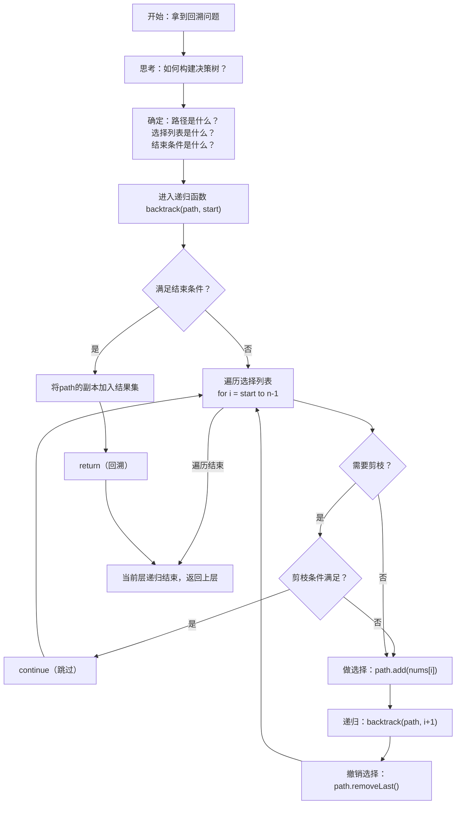

# 回溯算法

> 创建日期：2026-06-06
> 难度：⭐⭐⭐
> 前置知识：递归、深度优先搜索（DFS）、树遍历、集合操作

## ⭐ 面试重点速览

| 考察点 | 重要程度 | 考察频率 | 掌握目标 |
|--------|---------|---------|---------|
| 回溯算法模板（递归三要素） | ★★★★★ | 极高 | 能独立写出回溯标准模板，理解递归树 |
| 排列/组合/子集问题 | ★★★★★ | 极高 | 能清晰区分三者并写出对应代码 |
| N皇后问题 | ★★★★★ | 极高 | 能实现回溯+剪枝的标准解法 |
| 剪枝策略 | ★★★★★ | 极高 | 能识别并应用排序剪枝、去重剪枝、可行性剪枝 |
| 回溯与DFS/BFS的区别 | ★★★★ | 高 | 能清晰说明回溯是DFS的一种特殊应用 |
| 去重技巧（同层vs同枝） | ★★★★ | 高 | 能区分`used[i]`和`i > start`的适用场景 |

---

## 一、应用场景 🎯

回溯算法（Backtracking）是一种**系统地搜索问题解空间**的方法，通过深度优先的方式遍历所有可能的候选解，一旦发现当前路径不可能产生有效解，就**回退**到上一步，尝试其他分支。

### 典型应用场景

| 场景类别 | 具体问题 | 对应LeetCode题号 |
|---------|---------|-----------------|
| 排列问题 | 全排列、全排列II（含重复元素）、字符串的排列 | 46, 47, 剑指Offer 38 |
| 组合问题 | 组合、组合总和、组合总和II/III | 77, 39, 40, 216 |
| 子集问题 | 子集、子集II（含重复元素） | 78, 90 |
| 棋盘问题 | N皇后、N皇后II、解数独 | 51, 52, 37 |
| 分割问题 | 分割回文串、复原IP地址 | 131, 93 |
| 括号生成 | 括号生成 | 22 |
| 路径搜索 | 单词搜索（二维网格回溯） | 79, 212 |
| 电话号码 | 电话号码的字母组合 | 17 |

### 如何识别回溯问题？

1. **列举所有可能解（穷举型）**：如"返回所有可能的全排列"
2. **搜索满足约束的解（搜索型）**：如N皇后、数独
3. **问题规模不大**：n通常在10-20以内（因为回溯是指数级复杂度）
4. **每个步骤有多个选择**：每个位置都有多种可能，需要逐一尝试

> 口诀：**"枚举所有可能，不行就回头"** —— 这就是回溯。

---

## 二、核心原理 🔬

### 2.1 回溯的本质：多叉树的DFS遍历

回溯算法可以理解为一棵**决策树**的深度优先遍历：

- 树的**每一层**代表一个决策步骤
- 树的**每个分支**代表一个选择
- **叶子节点**代表一个完整的候选解
- **回溯**（回退）就是从叶子节点返回到父节点，然后探索其他分支

```
                      [ ]（根节点，空路径）
                    /  |  \
                  1    2    3         ← 第1步：选择第1个元素
                 / \   |   / \
                2   3  1  1   2        ← 第2步：选择第2个元素
                |   |  |  |   |
                3   2  3  2   1        ← 第3步：选择第3个元素
```

### 2.2 回溯标准模板

```java
void backtrack(路径, 选择列表) {
    if (满足结束条件) {
        将当前路径加入结果集;
        return;
    }

    for (选择 in 选择列表) {
        if (选择不合法) continue;  // 剪枝

        做选择;                    // 将选择加入路径
        backtrack(路径, 选择列表);  // 递归进入下一层
        撤销选择;                  // 回溯：将选择从路径中移除
    }
}
```

**模板三要素**：
1. **路径（Path）**：已经做出的选择，如`[1, 2]`
2. **选择列表（Choices）**：当前可以做的选择，如`[3]`
3. **结束条件（Termination）**：路径长度达到要求，如`path.size() == n`

### 2.3 排列、组合、子集的核心区别

| 问题类型 | 选择列表范围 | 是否关心顺序 | 去重关注点 | 典型start参数 |
|---------|-------------|-------------|-----------|-------------|
| 排列 | 所有未使用的元素 | 是（[1,2]≠[2,1]） | 同层去重（used数组） | 不需要start，用used[i] |
| 组合 | 当前下标之后的元素 | 否（[1,2]=[2,1]） | 同层去重（i > start） | 需要start，每次从i+1开始 |
| 子集 | 当前下标之后的元素 | 否（集合无序） | 同层去重（i > start） | 需要start，所有节点都收集 |

**记忆口诀**：
- 排列：`for (i = 0; i < n; i++)`，用`used[i]`标记
- 组合：`for (i = start; i < n; i++)`，每次从`i+1`开始
- 子集：和组合一样，但**每个节点都收集**（不仅限于叶子节点）

### 2.4 算法流程图



### 2.5 剪枝策略

剪枝是回溯算法效率的关键。常见的剪枝策略：

| 剪枝类型 | 说明 | 示例 |
|---------|------|------|
| 排序剪枝 | 排序后，如果当前元素已不满足条件，后面更大的元素也一定不满足 | 组合总和：`if (sum + nums[i] > target) break;` |
| 同层去重 | 同一层递归中，跳过重复的元素 | 子集II：`if (i > start && nums[i] == nums[i-1]) continue;` |
| 可行性剪枝 | 当前路径已经不可能产生有效解 | N皇后：列冲突、对角线冲突 |
| 边界剪枝 | 剩余元素不够凑齐目标长度 | 组合：`if (n - i + 1 < k - path.size()) break;` |

---

## 三、趣味解说 🎭

### 试钥匙开门：一把一把试，打不开就换

你站在一扇门前，手里有一串钥匙——**整整10把**，但你不知道哪一把能打开这扇门。

**回溯策略**：
1. 你拿起第1把钥匙，插进去，转一下——打不开。
2. 你把第1把钥匙放回钥匙串，拿起第2把——还是打不开。
3. 第3把——打不开……第4把——打不开……
4. 第7把——**咔哒**！门开了！

这就是回溯的核心：**尝试 → 失败 → 撤销 → 尝试下一个**。如果你一直试到第10把都没打开，那就真的打不开了（无解）。

### 进阶场景：N皇后问题

现在你面临一个更复杂的问题：在一个8×8的国际象棋棋盘上，放置8个皇后，要求**任意两个皇后都不能互相攻击**（即不在同一行、同一列、同一对角线）。

你的思路（回溯）：
1. 第1行：把皇后放在第1列。OK，没有冲突。
2. 第2行：尝试第1列——冲突（同一列）！尝试第2列——冲突（对角线）！尝试第3列——OK！放置。
3. 第3行：尝试第1列——冲突！第2列——冲突！……第5列——OK！放置。
4. ...继续...
5. 第6行：尝试了所有8列，都冲突！**这条路径走不通了**。
6. **回溯**：回到第5行，把皇后移动到下一个位置，重新尝试第6行。
7. 如果第5行所有位置都试过了还是不行，继续回溯到第4行……

这就是回溯的魅力——**它帮你系统地穷举所有可能性，但通过剪枝大幅减少了无效的尝试**。如果没有剪枝，8皇后有8^8=16,777,216种摆法；但有了剪枝，实际只需尝试几千种。

> 回溯的哲学：**"大胆尝试，勇于放弃，优雅回头。"**

---

## 四、代码实现 💻

### 4.1 回溯通用模板

```java
/**
 * 回溯算法通用模板
 * 适用于排列、组合、子集等经典回溯问题
 */
public class BacktrackingTemplate {

    // 存储最终结果
    private List<List<Integer>> result = new ArrayList<>();
    // 存储当前路径（使用LinkedList方便尾部删除）
    private LinkedList<Integer> path = new LinkedList<>();

    public List<List<Integer>> solve(int[] nums) {
        // 可选：排序（用于剪枝或去重）
        // Arrays.sort(nums);
        backtrack(nums, 0);
        return result;
    }

    private void backtrack(int[] nums, int start) {
        // ---- 结束条件 ----
        // 根据问题类型决定何时收集结果
        // 排列：path.size() == nums.length
        // 组合：path.size() == k
        // 子集：每个节点都收集（无结束条件，直接加入）
        if (/* 满足结束条件 */) {
            result.add(new ArrayList<>(path));  // ★ 必须拷贝！
            return;
        }

        // ---- 遍历选择列表 ----
        for (int i = start; i < nums.length; i++) {
            // ---- 剪枝 ----
            // if (/* 剪枝条件 */) continue;

            // ---- 做选择 ----
            path.addLast(nums[i]);

            // ---- 递归进入下一层 ----
            // 排列：backtrack(nums, 0)  —— 不使用start
            // 组合/子集：backtrack(nums, i + 1) —— 从i+1开始
            backtrack(nums, i + 1);

            // ---- 撤销选择（回溯） ----
            path.removeLast();
        }
    }
}
```

### 4.2 全排列（LeetCode 46）

```java
/**
 * LeetCode 46. 全排列
 * 题目：给定一个不含重复数字的数组nums，返回其所有可能的全排列。
 * 
 * 关键：用used数组标记已使用的元素，保证每个元素只用一次
 */
public class Permutations {

    private List<List<Integer>> result = new ArrayList<>();
    private LinkedList<Integer> path = new LinkedList<>();
    private boolean[] used;  // 标记元素是否已在当前路径中

    public List<List<Integer>> permute(int[] nums) {
        used = new boolean[nums.length];
        backtrack(nums);
        return result;
    }

    private void backtrack(int[] nums) {
        // 结束条件：路径长度等于数组长度，说明找到一个排列
        if (path.size() == nums.length) {
            result.add(new ArrayList<>(path));  // ★ 拷贝当前路径
            return;
        }

        // 遍历所有元素（排列关心顺序，每次都从头遍历）
        for (int i = 0; i < nums.length; i++) {
            if (used[i]) continue;  // 已经使用过，跳过

            // 做选择
            path.addLast(nums[i]);
            used[i] = true;

            // 递归
            backtrack(nums);

            // 撤销选择（回溯）
            path.removeLast();
            used[i] = false;
        }
    }
}
```

### 4.3 组合（LeetCode 77）

```java
/**
 * LeetCode 77. 组合
 * 题目：给定两个整数n和k，返回范围[1, n]中所有可能的k个数的组合。
 * 
 * 关键：使用start参数保证不重复，组合不关心顺序
 */
public class Combinations {

    private List<List<Integer>> result = new ArrayList<>();
    private LinkedList<Integer> path = new LinkedList<>();

    public List<List<Integer>> combine(int n, int k) {
        backtrack(n, k, 1);
        return result;
    }

    private void backtrack(int n, int k, int start) {
        // 结束条件：路径长度达到k
        if (path.size() == k) {
            result.add(new ArrayList<>(path));
            return;
        }

        // 剪枝优化：剩余元素不够凑齐k个时，提前终止
        // 还需要选 k - path.size() 个元素，但只剩下 n - i + 1 个可选
        for (int i = start; i <= n - (k - path.size()) + 1; i++) {
            path.addLast(i);           // 做选择
            backtrack(n, k, i + 1);    // 从i+1开始，保证不重复
            path.removeLast();         // 撤销选择
        }
    }
}
```

### 4.4 子集（LeetCode 78）

```java
/**
 * LeetCode 78. 子集
 * 题目：给你一个整数数组nums，数组中的元素互不相同。返回该数组所有可能的子集。
 * 
 * 关键：子集 = 收集递归树上的所有节点，而不只是叶子节点
 */
public class Subsets {

    private List<List<Integer>> result = new ArrayList<>();
    private LinkedList<Integer> path = new LinkedList<>();

    public List<List<Integer>> subsets(int[] nums) {
        backtrack(nums, 0);
        return result;
    }

    private void backtrack(int[] nums, int start) {
        // ★ 子集的特点：每个节点都要收集（包括空集）
        result.add(new ArrayList<>(path));

        for (int i = start; i < nums.length; i++) {
            path.addLast(nums[i]);       // 做选择
            backtrack(nums, i + 1);      // 递归
            path.removeLast();           // 撤销选择
        }
    }
}
```

### 4.5 N皇后（LeetCode 51）

```java
/**
 * LeetCode 51. N皇后
 * 题目：将n个皇后放置在n×n的棋盘上，使皇后们不能互相攻击。
 * 返回所有不同的解决方案。
 * 
 * 关键：回溯 + 剪枝（列冲突、对角线冲突）
 */
public class NQueens {

    private List<List<String>> result = new ArrayList<>();

    public List<List<String>> solveNQueens(int n) {
        // 棋盘：用一维数组表示，board[row] = col
        int[] board = new int[n];
        backtrack(board, 0, n);
        return result;
    }

    private void backtrack(int[] board, int row, int n) {
        // 结束条件：所有行都放置了皇后
        if (row == n) {
            result.add(buildBoard(board, n));
            return;
        }

        // 尝试在当前行的每一列放置皇后
        for (int col = 0; col < n; col++) {
            // ★ 剪枝：检查当前位置是否合法
            if (!isValid(board, row, col)) continue;

            board[row] = col;              // 做选择：在第row行col列放置皇后
            backtrack(board, row + 1, n);  // 递归处理下一行
            // board[row]不需要显式撤销，因为会被下一轮循环覆盖
        }
    }

    /**
     * 检查在(row, col)放置皇后是否合法
     * 只需检查之前放置的行（因为当前行之后还没放）
     */
    private boolean isValid(int[] board, int row, int col) {
        for (int prevRow = 0; prevRow < row; prevRow++) {
            int prevCol = board[prevRow];
            // 检查列冲突：同一列
            if (prevCol == col) return false;
            // 检查对角线冲突：行差 == 列差
            if (Math.abs(row - prevRow) == Math.abs(col - prevCol)) return false;
        }
        return true;
    }

    /** 将board数组转换为题目要求的棋盘字符串格式 */
    private List<String> buildBoard(int[] board, int n) {
        List<String> chessboard = new ArrayList<>();
        for (int row = 0; row < n; row++) {
            char[] rowChars = new char[n];
            Arrays.fill(rowChars, '.');
            rowChars[board[row]] = 'Q';  // 在皇后位置放置'Q'
            chessboard.add(new String(rowChars));
        }
        return chessboard;
    }
}
```

### 4.6 组合总和（LeetCode 39，含剪枝）

```java
/**
 * LeetCode 39. 组合总和
 * 题目：给定一个无重复元素的数组candidates和一个目标数target，
 * 找出candidates中所有可以使数字和为target的组合。
 * candidates中的数字可以无限制重复被选取。
 * 
 * 关键：可重复选取 → 递归时start不变；剪枝 → 排序后提前break
 */
public class CombinationSum {

    private List<List<Integer>> result = new ArrayList<>();
    private LinkedList<Integer> path = new LinkedList<>();

    public List<List<Integer>> combinationSum(int[] candidates, int target) {
        Arrays.sort(candidates);  // ★ 排序是剪枝的前提
        backtrack(candidates, target, 0, 0);
        return result;
    }

    private void backtrack(int[] candidates, int target, int sum, int start) {
        // 结束条件：和等于目标值
        if (sum == target) {
            result.add(new ArrayList<>(path));
            return;
        }

        for (int i = start; i < candidates.length; i++) {
            // ★ 排序剪枝：如果当前sum + candidates[i]超过target，
            // 后面更大的数也一定超过，直接break
            if (sum + candidates[i] > target) break;

            path.addLast(candidates[i]);
            // ★ 可以重复选取 → 递归时start = i（不是i+1）
            backtrack(candidates, target, sum + candidates[i], i);
            path.removeLast();
        }
    }
}
```

### 4.7 子集II（含重复元素去重，LeetCode 90）

```java
/**
 * LeetCode 90. 子集II
 * 题目：给定一个可能包含重复元素的整数数组nums，返回所有不重复的子集。
 * 
 * 关键：排序 + 同层去重：
 * if (i > start && nums[i] == nums[i-1]) continue;
 * 这行代码保证：同一层递归中，相同元素只取第一个
 */
public class SubsetsII {

    private List<List<Integer>> result = new ArrayList<>();
    private LinkedList<Integer> path = new LinkedList<>();

    public List<List<Integer>> subsetsWithDup(int[] nums) {
        Arrays.sort(nums);  // ★ 排序是同层去重的前提
        backtrack(nums, 0);
        return result;
    }

    private void backtrack(int[] nums, int start) {
        result.add(new ArrayList<>(path));

        for (int i = start; i < nums.length; i++) {
            // ★ 同层去重：同一层递归中，跳过重复元素
            // i > start 保证了同一树枝上可以重复（即不同层）
            if (i > start && nums[i] == nums[i - 1]) continue;

            path.addLast(nums[i]);
            backtrack(nums, i + 1);
            path.removeLast();
        }
    }
}
```

---

## 五、优缺点 ⚖️

| 维度 | 优点 | 缺点 |
|-----|------|------|
| 正确性 | 穷举所有可能，一定能找到解（如果存在） | 无剪枝时效率极低，是指数级复杂度 |
| 通用性 | 适用于几乎所有的组合搜索问题 | 问题规模大时（n>20）基本不可用 |
| 实现难度 | 模板固定，熟练掌握后可以快速写出 | 剪枝策略和去重逻辑容易出错 |
| 空间复杂度 | 递归深度有限（通常O(n)） | 递归调用栈可能溢出（极端情况） |
| 代码可读性 | 递归树结构与问题结构对应，易于理解 | 回溯路径的追踪需要一定调试经验 |
| 扩展性 | 容易添加剪枝条件和新约束 | 每增加一个约束，复杂度可能暴涨 |

### 回溯 vs DFS vs 动态规划

| 对比维度 | 回溯 | DFS | 动态规划 |
|---------|------|-----|---------|
| 本质 | 穷举搜索 + 剪枝 | 图的深度优先遍历 | 递推填表 + 空间换时间 |
| 目标 | 找到所有解 / 判断是否存在解 | 遍历所有节点 | 找到最优解 |
| 是否记录状态 | 不记录（通过撤销恢复） | 通常记录visited | 记录所有子问题结果 |
| 时间复杂度 | 指数级（剪枝后可能大幅降低） | O(V+E) | 多项式级 |
| 典型问题 | 排列、组合、N皇后 | 迷宫、岛屿、拓扑排序 | 背包、LIS、编辑距离 |

---

## 六、面试高频题 📝

### 6.1 必刷题单

| 题号 | 题目 | 难度 | 类型 | 核心考点 | 推荐指数 |
|------|------|------|------|---------|---------|
| 46 | 全排列 | ⭐⭐ | 排列 | 标准回溯模板，used数组 | ★★★★★ |
| 47 | 全排列II | ⭐⭐ | 排列 | 含重复元素的排列去重 | ★★★★★ |
| 77 | 组合 | ⭐⭐ | 组合 | 组合模板，start参数 | ★★★★★ |
| 39 | 组合总和 | ⭐⭐ | 组合 | 可重复选取 + 排序剪枝 | ★★★★★ |
| 40 | 组合总和II | ⭐⭐ | 组合 | 含重复元素 + 同层去重 | ★★★★★ |
| 216 | 组合总和III | ⭐⭐ | 组合 | 固定k个数 + 剪枝 | ★★★★ |
| 78 | 子集 | ⭐⭐ | 子集 | 子集模板，收集所有节点 | ★★★★★ |
| 90 | 子集II | ⭐⭐ | 子集 | 含重复元素的子集去重 | ★★★★★ |
| 17 | 电话号码的字母组合 | ⭐⭐ | 组合 | 多集合的笛卡尔积 | ★★★★ |
| 22 | 括号生成 | ⭐⭐ | 组合 | 约束条件的回溯 | ★★★★★ |
| 131 | 分割回文串 | ⭐⭐ | 分割 | 字符串分割的回溯 | ★★★★ |
| 51 | N皇后 | ⭐⭐⭐ | 棋盘 | 经典回溯+剪枝，必考 | ★★★★★ |
| 52 | N皇后II | ⭐⭐⭐ | 棋盘 | 只求方案数，可位运算优化 | ★★★★ |
| 37 | 解数独 | ⭐⭐⭐ | 棋盘 | 二维回溯，难度较高 | ★★★ |
| 79 | 单词搜索 | ⭐⭐ | 网格 | 二维网格回溯 | ★★★★ |

### 6.2 高频面试问法

1. **"回溯算法的核心模板是什么？请简述三要素。"**
   - 回答要点：路径、选择列表、结束条件。代码框架：`for + 做选择 + 递归 + 撤销选择`。

2. **"排列和组合的回溯有什么区别？"**
   - 排列：`for(i=0;i<n;i++)`，用`used[i]`去重；组合：`for(i=start;i<n;i++)`，用`start`参数保证顺序。

3. **"回溯算法中如何处理重复元素？"**
   - 回答要点：排序后，用`if (i > start && nums[i] == nums[i-1]) continue;`实现同层去重。注意区分`i > start`（同层去重）和`i > 0`（同枝去重）。

4. **"如何优化回溯算法的性能？"**
   - 回答要点：排序剪枝（提前break）、可行性剪枝（提前判断不可行）、同层去重（减少重复分支）、边界剪枝（剩余元素不够）。

---

## 七、常见误区 ❌

### 误区1：忘记拷贝path
**错误认知**：直接把path加到result里就行。

**正确理解**：`result.add(path)`添加的是引用，后续回溯会修改path，导致result中所有结果都变成同一个值。**必须使用`new ArrayList<>(path)`创建副本**。

### 误区2：混淆排列和组合的递归参数
**错误认知**：排列和组合的回溯代码差不多，随便写就行。

**正确理解**：
- 排列：`backtrack(nums, 0)` —— 不使用start，每次从头遍历，用`used[i]`标记
- 组合：`backtrack(nums, i + 1)` —— 使用start参数，只从i+1开始选

这个差别是排列和组合问题的**本质区别**。

### 误区3：去重逻辑写错
**错误认知**：`if (nums[i] == nums[i-1]) continue;` 就能去重。

**正确理解**：必须加上`i > start`（或`!used[i-1]`），否则会错误地跳过同一树枝上的重复元素。正确的同层去重写法是：
```java
if (i > start && nums[i] == nums[i - 1]) continue;
```

### 误区4：N皇后检查全盘冲突
**错误认知**：每次放置皇后时，需要检查棋盘上所有已放置的皇后。

**正确理解**：只需要检查**之前已放置的行**，因为当前行只放了一个皇后，后面的行还没放。这个优化看似微小，但能显著减少检查次数。

### 误区5：回溯 = DFS
**错误认知**：回溯就是DFS，DFS就是回溯。

**正确理解**：回溯是DFS的一种**特殊应用**。DFS是图/树的遍历算法，回溯是在DFS基础上的**带状态恢复的搜索**。核心区别在于回溯有"撤销选择"这一步，而普通DFS通常只标记visited。

### 误区6：所有回溯问题都需要排序
**错误认知**：回溯前先排序是个好习惯。

**正确理解**：只有在需要去重或剪枝时才需要排序。对于简单的全排列（无重复元素），排序是多余的。排序会增加O(n log n)的开销，只在必要时使用。

---

> **学习建议**：回溯算法是面试中**最常考**的算法之一，尤其是排列、组合、子集、N皇后这四类问题。建议按照"全排列 → 组合 → 子集 → N皇后 → 去重题"的顺序练习。关键是要**理解递归树的形状**，在脑中或纸上画出递归树，就能清晰地看到回溯的过程和剪枝的时机。