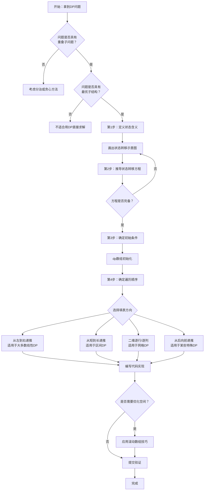

# 动态规划思想与方法论

> 创建日期：2026-06-06
> 难度：⭐⭐⭐
> 前置知识：递归、分治思想、数组与矩阵操作、时间复杂度分析

## ⭐ 面试重点速览

| 考察点 | 重要程度 | 考察频率 | 掌握目标 |
|--------|---------|---------|---------|
| DP问题识别与状态定义 | ★★★★★ | 极高 | 能快速判断问题是否能用DP求解，并正确定义dp[i][j]含义 |
| 状态转移方程推导 | ★★★★★ | 极高 | 独立推导常见的线性DP、区间DP、背包DP状态转移方程 |
| 最优子结构理解 | ★★★★ | 高 | 能解释为何局部最优能推出全局最优 |
| DP四步法应用 | ★★★★★ | 极高 | 熟练运用四步法解决中等难度DP问题 |
| 空间优化（滚动数组） | ★★★★ | 高 | 能将O(n²)空间优化到O(n)或O(1) |
| DP与贪心/分治的区别 | ★★★ | 中 | 清晰说明三者的适用边界与差异 |

---

## 一、应用场景 🎯

动态规划（Dynamic Programming，简称DP）是解决**多阶段决策问题**的核心方法论。它适用于具有**重叠子问题**和**最优子结构**两大特征的问题。

### 典型应用场景

| 场景类别 | 具体问题 | 对应LeetCode题号 |
|---------|---------|-----------------|
| 路径规划 | 网格最短路径、不同路径数 | 62, 63, 64 |
| 序列问题 | 最长递增子序列、最长公共子序列 | 300, 1143 |
| 背包问题 | 0-1背包、完全背包、多重背包 | 416, 322, 518 |
| 字符串匹配 | 编辑距离、正则匹配、通配符匹配 | 72, 10, 44 |
| 区间DP | 矩阵链乘、戳气球、石子合并 | 312, 1000 |
| 树形DP | 打家劫舍III、二叉树最大路径和 | 337, 124 |
| 状态压缩DP | 旅行商问题、集合覆盖 | 847, 943 |
| 博弈DP | 石子游戏、预测赢家 | 877, 486 |
| 股票买卖 | 买卖股票的最佳时机系列 | 121, 122, 123, 188, 309, 714 |

### 如何识别一个问题是DP问题？

遵循以下三个核心信号：

1. **求最值（最大值/最小值）**：如"最长xxx"、"最少xxx"、"最大价值"等
2. **求方案数（计数问题）**：如"共有多少种方法"、"不同路径数"等
3. **是否存在可行解**：如"能否凑出某金额"、"是否存在某序列"等

> 经验法则：如果暴力搜索会指数级重复计算相同的子问题，那就该考虑DP了。

---

## 二、核心原理 🔬

### 2.1 动态规划的数学本质

动态规划的本质是**用空间换时间**——用额外的存储空间记录已经计算过的子问题结果，避免重复计算。它基于两个核心性质：

#### 最优子结构（Optimal Substructure）
大问题的最优解**包含**其子问题的最优解。也就是说，如果我们知道了所有子问题的最优解，就可以通过某种方式**组合**出原问题的最优解。

#### 重叠子问题（Overlapping Subproblems）
在递归求解过程中，同一个子问题会被**多次计算**。DP通过记忆化搜索或自底向上填表的方式，确保每个子问题只计算一次。

### 2.2 与分治、贪心的本质区别

| 维度 | 动态规划 | 分治 | 贪心 |
|-----|---------|-----|------|
| 子问题关系 | 重叠（有大量重复） | 独立（无重复） | 无需遍历所有子问题 |
| 决策方式 | 尝试所有选择，取最优 | 子问题独立求解后合并 | 每步只做当前最优选择 |
| 最优性保障 | 全局最优（有前提条件） | 全局最优 | 不保证全局最优 |
| 典型应用 | 最短路径、背包问题 | 归并排序、快速排序 | 最小生成树、活动选择 |

### 2.3 DP四步法

这是解决一切DP问题的**万能框架**：

```
第1步：定义状态          →  明确dp[i]或dp[i][j]表示什么含义
第2步：推导状态转移方程    →  找到当前状态与之前状态的关系
第3步：确定初始条件与边界   →  初始化dp[0]或dp[0][0]等基础值
第4步：确定遍历顺序与输出   →  按正确顺序填表，返回目标值
```

### 2.4 算法流程图



### 2.5 空间优化：滚动数组

许多DP问题的状态转移方程中，`dp[i]`只依赖于`dp[i-1]`（或`dp[i]`只依赖于前几行），此时可以用**滚动数组**将空间从O(n)优化到O(1)或O(k)。

```java
// 经典示例：斐波那契数列的空间优化
// 普通DP：dp[i] = dp[i-1] + dp[i-2]，空间O(n)
// 滚动数组优化：只保留前两个状态，空间O(1)
public int fib(int n) {
    if (n <= 1) return n;
    int prev2 = 0, prev1 = 1;  // 只保留dp[i-2]和dp[i-1]
    for (int i = 2; i <= n; i++) {
        int curr = prev1 + prev2;   // dp[i] = dp[i-1] + dp[i-2]
        prev2 = prev1;              // 滚动：prev2变为之前的prev1
        prev1 = curr;               // 滚动：prev1变为curr
    }
    return prev1;
}
```

---

## 三、趣味解说 🎭

### 记忆的艺术：DP就像记笔记

想象你是一位正在准备期末考试的大学生。你的数学课本里有100道练习题，但很多题目**本质上是相同的**，只是换了数字。

- **暴力递归的做法**：拿到一道题，从头开始算。下一道虽然差不多，但因为数字变了，你又从头算一遍。100道题你重复了无数相同的计算步骤，累到崩溃。

- **DP的做法**：你拿了一本笔记本。每算完一道题的某个关键步骤，你就把结果**写在纸上**。下次再遇到同样的步骤时，你不是重新算，而是**翻笔记看看之前的结果**，然后直接用！这就是**记忆化搜索（Memoization）**。

- **更进一步——自底向上DP**：你发现这些题目之间还有规律——第3题的答案只用第1题和第2题的答案就能推出来。于是你**从最简单的第1题开始做**，做完写在笔记本上；再做第2题，也记下来；然后用笔记本上前两题的结果直接算出第3题……**按顺序填满整本笔记本**，最后一道题的答案水到渠成。

```
笔记法（DP）的核心哲学：
"我不聪明，但我勤奋——我把算过的每个结果都记下来，
这样我就永远不会重复劳动。"
                —— 一位匿名DP大师
```

### 另一个场景：爬楼梯

你去朋友家做客，他住在一个**没有电梯的老式居民楼**的10楼。你每次可以爬1层或2层楼梯。你想知道：从1楼到10楼，一共有多少种不同的爬法？

- 如果暴力枚举，你要把所有可能的"1步-2步"组合全部列出来，组合数量爆炸。
- 但如果用DP思路：**到第5层的方法数 = 到第3层的方法数 + 到第4层的方法数**（因为最后一步要么是从第3层跨2步上来，要么是从第4层跨1步上来）。

你发现了吗？你不需要知道具体怎么走到第3层、第4层的——你只需要知道**有多少种方法能到那里**，然后简单相加即可。这就是**最优子结构**的直观体现。

---

## 四、代码实现 💻

### 4.1 DP通用模板框架

```java
/**
 * 动态规划通用解题模板
 * 适用于大多数线性DP问题
 */
public class DynamicProgrammingTemplate {

    /**
     * DP四步法模板
     * @param n 问题规模
     * @return 最终答案
     */
    public int dpTemplate(int n) {
        // ---- 第1步：定义状态 ----
        // dp[i] 表示：规模为i时的答案（具体含义依题而定）
        int[] dp = new int[n + 1];

        // ---- 第3步：初始化基础条件 ----
        dp[0] = /* 基础值1 */;
        dp[1] = /* 基础值2 */;
        // 注意：根据题意可能只需要初始化dp[0]

        // ---- 第4步：按正确顺序遍历 ----
        for (int i = 2; i <= n; i++) {
            // ---- 第2步：状态转移方程 ----
            dp[i] = /* 由dp[i-1], dp[i-2], ... 计算得到 */;
        }

        // ---- 返回最终结果 ----
        return dp[n];
    }
}
```

### 4.2 经典例题：爬楼梯（LeetCode 70）

```java
/**
 * LeetCode 70. 爬楼梯
 * 题目：假设你正在爬楼梯。需要n阶你才能到达楼顶。
 * 每次你可以爬1或2个台阶。你有多少种不同的方法可以爬到楼顶呢？
 */
public class ClimbingStairs {

    /**
     * DP解法 —— 空间O(n)
     * dp[i] 含义：爬到第i层楼梯的方法数
     * 状态转移方程：dp[i] = dp[i-1] + dp[i-2]
     */
    public int climbStairs(int n) {
        if (n <= 2) return n;

        // 第1步：定义状态 —— dp[i]表示爬到第i阶的方法数
        int[] dp = new int[n + 1];

        // 第3步：初始化 —— 第0阶（地面）有1种"到达方式"，即不动
        dp[0] = 1;
        dp[1] = 1;  // 爬到第1阶只有1种方法：走1步

        // 第4步：遍历顺序 —— 从小到大递推
        for (int i = 2; i <= n; i++) {
            // 第2步：状态转移 —— 最后一步可能是1步或2步
            dp[i] = dp[i - 1] + dp[i - 2];
        }

        return dp[n];  // 返回爬到第n阶的方法总数
    }

    /**
     * 空间优化版 —— 只用两个变量，空间O(1)
     * 观察发现dp[i]只依赖dp[i-1]和dp[i-2]，无需保留全部历史
     */
    public int climbStairsOptimized(int n) {
        if (n <= 2) return n;

        int prev2 = 1;  // 相当于dp[i-2]，初始为dp[0]
        int prev1 = 1;  // 相当于dp[i-1]，初始为dp[1]

        for (int i = 2; i <= n; i++) {
            int curr = prev1 + prev2;  // dp[i] = dp[i-1] + dp[i-2]
            prev2 = prev1;              // 向前滚动
            prev1 = curr;
        }

        return prev1;  // 循环结束时prev1即为dp[n]
    }
}
```

### 4.3 经典例题：打家劫舍（LeetCode 198）

```java
/**
 * LeetCode 198. 打家劫舍
 * 题目：你是一个专业的小偷，计划偷窃沿街的房屋。
 * 每间房内都藏有一定的现金，但相邻的房屋装有相互连通的防盗系统。
 * 如果两间相邻的房屋在同一晚上被小偷闯入，系统会自动报警。
 * 求不触动警报的情况下，一夜之内能够偷窃到的最高金额。
 */
public class HouseRobber {

    public int rob(int[] nums) {
        if (nums == null || nums.length == 0) return 0;
        if (nums.length == 1) return nums[0];

        int n = nums.length;

        // 第1步：定义状态
        // dp[i] 表示：考虑前i间房屋（0-indexed），能偷到的最大金额
        int[] dp = new int[n];

        // 第3步：初始化
        dp[0] = nums[0];                        // 只有一间，必须偷它
        dp[1] = Math.max(nums[0], nums[1]);      // 两间中选金额大的那间

        // 第4步：遍历
        for (int i = 2; i < n; i++) {
            // 第2步：状态转移方程
            // 对于第i间房，有两种选择：
            // ① 不偷第i间 → dp[i] = dp[i-1]
            // ② 偷第i间   → dp[i] = dp[i-2] + nums[i]（不能偷相邻的i-1）
            dp[i] = Math.max(dp[i - 1], dp[i - 2] + nums[i]);
        }

        return dp[n - 1];
    }
}
```

---

## 五、优缺点 ⚖️

| 维度 | 优点 | 缺点 |
|-----|------|------|
| 正确性 | 能保证找到**全局最优解**（前提：满足最优子结构） | 状态定义错误会导致全盘错误 |
| 时间复杂度 | 通常将指数级降到多项式级别（如O(2^n) → O(n²)） | 对于某些问题仍然较高（如O(n²)对于大规模数据可能TLE） |
| 空间复杂度 | 可通过滚动数组等技巧大幅优化 | 部分问题（如某些二维/三维DP）仍需O(n²)或更多空间 |
| 通用性 | 适用范围极广：序列、网格、字符串、树、图等 | 需要满足最优子结构和重叠子问题两个条件 |
| 学习曲线 | 有系统性的解题框架（四步法） | 状态定义和转移方程推导需要大量练习 |
| 代码实现 | 多为循环填表，结构清晰、不易出错 | 初始化条件和边界处理容易遗漏 |
| 扩展性 | 容易从基础DP扩展到区间DP、树形DP、状压DP等 | 复杂变体需要扎实的基础才能驾驭 |

### 与贪心算法的详细对比

| 对比维度 | 动态规划 | 贪心算法 |
|---------|---------|---------|
| 决策方式 | 考虑所有可能的选择，选出最优的那个 | 每步只做一个"当前看起来最好"的选择 |
| 是否回溯 | 隐含地考虑了所有情况（通过状态转移） | 不回头，不反悔 |
| 最优性 | 保证全局最优 | 不保证，除非问题具有贪心选择性质 |
| 时间复杂度 | 通常较高（O(n²)或更高） | 通常较低（O(n log n)或O(n)） |
| 实现难度 | 状态定义较难，但框架固定 | 思路简单，但正确性证明较难 |
| 典型问题 | 背包、LIS、编辑距离 | 活动选择、Huffman编码、最小生成树 |

---

## 六、面试高频题 📝

### 6.1 必刷经典题（按难度排序）

| 题号 | 题目 | 难度 | 核心考点 | 推荐指数 |
|------|------|------|---------|---------|
| 509 | 斐波那契数 | ⭐ | DP入门，理解dp[i]含义 | ★★★★★ |
| 70 | 爬楼梯 | ⭐ | 一维DP，入门必做 | ★★★★★ |
| 746 | 使用最小花费爬楼梯 | ⭐ | 带权爬楼梯，理解"花费"概念 | ★★★★ |
| 198 | 打家劫舍 | ⭐⭐ | 一维DP + "间隔"约束 | ★★★★★ |
| 213 | 打家劫舍II | ⭐⭐ | 环形DP，拆分为两个线性问题 | ★★★★ |
| 53 | 最大子数组和 | ⭐⭐ | Kadane算法，DP的极致简洁 | ★★★★★ |
| 152 | 乘积最大子数组 | ⭐⭐ | 同时维护最大/最小值 | ★★★ |
| 62 | 不同路径 | ⭐⭐ | 二维网格DP入门 | ★★★★★ |
| 63 | 不同路径II | ⭐⭐ | 带障碍物的网格DP | ★★★★ |
| 64 | 最小路径和 | ⭐⭐ | 带权网格DP | ★★★★ |
| 322 | 零钱兑换 | ⭐⭐ | 完全背包变体 | ★★★★★ |
| 518 | 零钱兑换II | ⭐⭐ | 完全背包计数 | ★★★★ |
| 416 | 分割等和子集 | ⭐⭐ | 0-1背包可行性问题 | ★★★★★ |
| 300 | 最长递增子序列 | ⭐⭐ | 经典LIS，O(n²)和O(n log n) | ★★★★★ |
| 1143 | 最长公共子序列 | ⭐⭐ | 二维DP，子序列问题 | ★★★★★ |
| 718 | 最长重复子数组 | ⭐⭐ | 子数组（连续）vs子序列 | ★★★★ |
| 5 | 最长回文子串 | ⭐⭐ | 区间DP / 中心扩展 | ★★★★★ |
| 72 | 编辑距离 | ⭐⭐⭐ | 经典字符串DP | ★★★★★ |
| 10 | 正则表达式匹配 | ⭐⭐⭐ | 复杂状态转移 | ★★★ |
| 139 | 单词拆分 | ⭐⭐ | 字符串DP + 剪枝 | ★★★★ |
| 221 | 最大正方形 | ⭐⭐ | 二维DP，地下城式递推 | ★★★★ |

### 6.2 高频面试问法

1. **"请介绍一下你对动态规划的理解，以及什么情况下适用DP？"**
   - 回答要点：重叠子问题 + 最优子结构 + 空间换时间

2. **"DP和递归/回溯有什么区别？"**
   - 回答要点：DP记录中间结果避免重复计算，回溯是穷举搜索

3. **"请说说DP的解题步骤？"**
   - 回答要点：四步法 —— 定义状态 → 转移方程 → 初始化 → 遍历顺序

4. **"什么是滚动数组优化？能举个例子吗？"**
   - 回答要点：状态只依赖有限个前置状态时，用几个变量替代整个数组

5. **"DP和贪心分别适用于什么场景？能否举例说明？"**
   - DP：背包问题（需要权衡取舍）；贪心：找零钱（硬币面额特殊时）

---

## 七、常见误区 ❌

### 误区1：把DP当成"背模板"
**错误认知**：DP就是背几个模板（背包模板、LIS模板），考试时直接套。

**正确理解**：DP的核心不在于模板，而在于**分析问题的思路**。每道题的`dp[i]`含义、状态转移方程都可能不同。机械套模板会让你在面对变体问题时寸步难行。真正需要掌握的是**"我为什么要这样定义状态"**的思考过程。

### 误区2：混淆"子序列"与"子数组"
**错误认知**：认为"最长递增子序列"就是找连续的递增段。

**正确理解**：
- **子数组（Subarray）**：必须**连续**，如`[2,3,4]`是`[1,2,3,4,5]`的子数组
- **子序列（Subsequence）**：可以不连续，只需保持**相对顺序**，如`[1,3,5]`是`[1,2,3,4,5]`的子序列

两者的DP定义和转移方程截然不同。

### 误区3：忽视遍历顺序
**错误认知**：有了状态转移方程，怎么遍历都行。

**正确理解**：遍历顺序**至关重要**。dp[i]依赖于dp[i-1]，你就必须先算dp[i-1]再算dp[i]。在二维DP中，遍历顺序错误会导致用到"还没算出来"的值。典型的反例是0-1背包：如果正序遍历容量，会变成完全背包问题。

### 误区4：认为所有"最值"问题都能用DP
**错误认知**：题目问"最大值/最小值"就直接上DP。

**正确理解**：DP要求具有**最优子结构**。如果一个问题的全局最优解不能由其子问题的最优解推出，那DP就不适用。例如，最长简单路径问题（无重复节点的最长路径）虽然是求最长，但**不具有最优子结构**，是NP-hard问题。

### 误区5：DP一定比回溯快
**错误认知**：DP因为有记忆化，一定比回溯快。

**正确理解**：DP将指数级降为多项式级，但多项式本身可能仍然很大（如O(n³)）。在某些情况下，如果回溯配合强力剪枝且数据规模小，回溯可能反而更快。此外，DP对状态空间的大小很敏感，状态太多可能导致"DP也无法承受"。

### 误区6：一维dp和多维dp的选择无脑升级
**错误认知**：遇到复杂问题就直接上二维或三维dp。

**正确理解**：能用一维解决的绝不多维。在定义状态前，先问自己："这个问题真的需要这么多维度吗？"。比如爬楼梯，`dp[i]`只表示"到达第i阶的方法数"，不需要记录"最后一步是1步还是2步"——那会是冗余的状态定义。

---

> **学习建议**：动态规划是算法面试中占比最大的题型之一。建议按照"线性DP → 背包DP → 区间DP → 状态压缩DP"的顺序循序渐进。每做完一道DP题，都尝试回答三个问题：① `dp[i]`代表什么意思？② 状态转移方程为什么这样写？③ 能否优化空间？