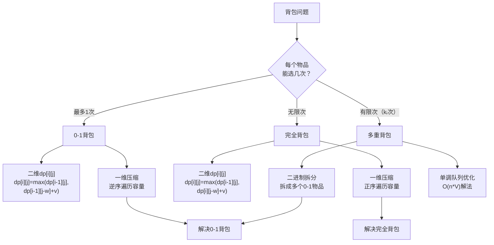

# 背包问题专题

> 创建日期：2026-06-06
> 难度：⭐⭐⭐
> 前置知识：动态规划基础、一维/二维DP、状态转移方程

## ⭐ 面试重点速览

| 考察点 | 重要程度 | 考察频率 | 掌握目标 |
|--------|---------|---------|---------|
| 0-1背包的状态定义与转移方程 | ★★★★★ | 极高 | 能独立推导并手写0-1背包核心代码 |
| 完全背包与0-1背包的区别 | ★★★★★ | 极高 | 理解遍历顺序差异的本质原因 |
| 背包问题的空间优化（一维滚动） | ★★★★★ | 极高 | 熟练将二维dp压缩为一维数组 |
| 多重背包的二进制拆分 | ★★★ | 中 | 理解二进制优化的原理 |
| 背包变体识别（可行性/计数/最值） | ★★★★ | 高 | 能识别并套用对应背包模型 |
| 恰好装满 vs 至多装满的初始化差异 | ★★★★ | 高 | 正确初始化dp数组以区分不同约束 |

---

## 一、应用场景 🎯

背包问题（Knapsack Problem）是动态规划中最经典的问题族之一，其核心模型是：**在给定资源的约束下，如何选择物品使得总价值最大化**。

### 典型应用场景

| 场景类别 | 具体问题 | 对应LeetCode题号 |
|---------|---------|-----------------|
| 0-1背包（每个物品最多选一次） | 分割等和子集、最后一块石头的重量II | 416, 1049 |
| 完全背包（每个物品无限次） | 零钱兑换、零钱兑换II、组合总和IV | 322, 518, 377 |
| 多维背包 | 一和零（同时限制两个维度） | 474 |
| 分组背包 | 每组物品最多选一个 | 1155 |
| 背包计数 | 目标和 | 494 |
| 背包可行性 | 单词拆分 | 139 |

### 如何识别背包问题？

1. **题干有"背包/容量/重量"等关键词**：直接提示
2. **题目描述"选或不选"的决策**：每个物品面临选择，有数量限制
3. **有限制条件**：总重量限制、总金额限制、总时间限制等
4. **目标明确**：最大化价值、最小化成本、恰好装满、方案计数

---

## 二、核心原理 🔬

### 2.1 三种背包的统一框架



### 2.2 0-1背包 —— 核心中的核心

**问题描述**：有N件物品和一个容量为W的背包。第i件物品的重量为`w[i]`，价值为`v[i]`。**每件物品只能选一次**。问如何选择物品放入背包，使得总价值最大？

#### 状态定义
`dp[i][j]`：考虑前i件物品，背包容量为j时，能获得的最大价值。

#### 状态转移方程
```
dp[i][j] = max(dp[i-1][j],                // 不选第i件物品
               dp[i-1][j-w[i]] + v[i])    // 选第i件物品（前提：j >= w[i]）
```

#### 为什么逆序遍历容量？

这是0-1背包**最关键的细节**。使用一维数组时：

```java
// 正确：逆序遍历（0-1背包）
for (int j = W; j >= w[i]; j--) {
    dp[j] = max(dp[j], dp[j - w[i]] + v[i]);
}
```

| 遍历方向 | dp[j-w[i]]引用的是 | 效果 |
|---------|-------------------|------|
| 逆序（从大到小） | 上一轮（i-1轮）的值 | 每个物品最多选1次 → 正确 |
| 正序（从小到大） | 本轮（i轮）已更新的值 | 物品可能被多次选择 → 变成完全背包 |

### 2.3 完全背包 —— 物品无限次选取

**问题描述**：与0-1背包相同，但**每件物品可以选无限次**。

#### 状态转移方程
```
dp[i][j] = max(dp[i-1][j],                // 不选第i件物品
               dp[i][j-w[i]] + v[i])      // 选第i件物品（注意是dp[i]而不是dp[i-1]）
```

**关键区别**：`dp[i][j-w[i]]`而不是`dp[i-1][j-w[i]]`。这表示选了第i件物品后，还能继续选第i件（只要容量允许）。

#### 一维压缩：正序遍历
```java
// 正确：正序遍历（完全背包）
for (int j = w[i]; j <= W; j++) {
    dp[j] = max(dp[j], dp[j - w[i]] + v[i]);
}
```

### 2.4 多重背包 —— 每个物品有数量限制

**问题描述**：第i件物品最多选`count[i]`次。

**解法一：二进制拆分**（最常用）
将每件物品的数量`count[i]`拆分为若干个"新物品"：1, 2, 4, 8, ..., 剩余部分。每个新物品视为一个独立的0-1物品。这样将O(n)次选择降至O(log n)次。

```java
// 二进制拆分示例
// 假设count[i] = 13，拆分为：1, 2, 4, 6（即4个新物品）
// 步骤：依次减去 1, 2, 4, 8, ... 直到剩余小于下一个2的幂
int k = 1;
while (count > 0) {
    int take = Math.min(k, count);
    // 新建一个重量为 w*take、价值为 v*take 的0-1物品
    newItems.add(new Item(w * take, v * take));
    count -= take;
    k *= 2;
}
```

### 2.5 背包问题初始化策略

| 约束条件 | dp[0]初始值 | 其他dp[j]初始值 | 含义 |
|---------|------------|----------------|------|
| 容量**至多**为j | 0 | 0 | 最大价值（不需要恰好装满） |
| 容量**恰好**为j | 0 | -∞（或-1） | 必须恰好装满的最大价值 |
| 容量**至少**为j | 0 | 0 | 最少需要多少物品 |

> 面试技巧：当题目要求"恰好"时，用`Integer.MIN_VALUE`或`-1`标记不可达状态，并检查`dp[W]`是否为有效值。

---

## 三、趣味解说 🎭

### 小偷的博物馆之夜

深夜，你（一位"数学系出身"的小偷）潜入了一个博物馆。你的背包容量是**10公斤**，再重就跑不动了。

博物馆里陈列着以下宝物：

| 宝物 | 重量 | 价值 | 每公斤价值 |
|------|------|------|-----------|
| 钻石 | 4kg | 100万 | 25万/kg |
| 金条 | 3kg | 80万 | 26.7万/kg |
| 银器 | 5kg | 120万 | 24万/kg |
| 名画 | 2kg | 40万 | 20万/kg |

你的"贪心直觉"告诉你：**每公斤最值钱的金条先拿**！拿完金条（3kg），还剩7kg，再拿钻石（4kg），还剩3kg，再拿名画（2kg）……总共：80+100+40=220万。背包还剩1kg空间浪费了。

但最优解是什么呢？**钻石+银器**：4+5=9kg，价值100+120=**220万**。咦，和贪心一样？再换个例子试试……

| 宝物 | 重量 | 价值 |
|------|------|------|
| A | 6kg | 90万 |
| B | 5kg | 80万 |
| C | 5kg | 80万 |

背包容量10kg。贪心选A（6kg, 90万），剩下4kg装不下任何东西，总价值90万。但最优解是**B+C**（5+5=10kg, 80+80=**160万**）！

> 贪心栽了跟头！它只看到了"当前最优"，没看到"全局最优"。这就是为什么背包问题需要动态规划。

### DP的解题思路（小偷视角）

你拿了一本笔记本（dp数组），决定系统性地思考：

1. 第0行：什么物品都不拿，不管背包多大，价值都是0。
2. 第1行：只考虑钻石。对于每个容量j，如果j>=4，就考虑要不要拿钻石。
3. 第2行：考虑钻石+金条。对于每个容量j，要么不拿金条（价值=上一行），要么拿金条（剩余容量去上一行找最优）。**取最大值**。
4. 以此类推，一行一行地填笔记本……

填到最后一行、最后一列，就是答案。**你不需要记住所有组合，笔记本帮你记住了每个子问题的最优解**。

---

## 四、代码实现 💻

### 4.1 0-1背包（二维基础版）

```java
/**
 * 0-1背包问题 —— 二维DP基础版
 * 时间O(n*W)，空间O(n*W)
 */
public class ZeroOneKnapsack {

    public int knapsack(int[] weights, int[] values, int W) {
        int n = weights.length;

        // 第1步：定义状态
        // dp[i][j]：考虑前i个物品，背包容量为j时的最大价值
        int[][] dp = new int[n + 1][W + 1];

        // 第3步：初始化 —— dp[0][*] = 0, dp[*][0] = 0
        // Java中int数组默认值为0，无需显式初始化

        // 第4步：遍历 —— 外层物品，内层容量
        for (int i = 1; i <= n; i++) {
            int w = weights[i - 1];  // 当前物品的重量
            int v = values[i - 1];   // 当前物品的价值
            for (int j = 0; j <= W; j++) {
                if (j < w) {
                    // 容量不够装当前物品，只能不选
                    dp[i][j] = dp[i - 1][j];
                } else {
                    // 第2步：状态转移 —— 选或不选，取最大值
                    dp[i][j] = Math.max(
                        dp[i - 1][j],           // 不选：继承上一行结果
                        dp[i - 1][j - w] + v    // 选：剩余容量去上一行找最优
                    );
                }
            }
        }

        return dp[n][W];  // 返回考虑所有物品、容量为W时的最大价值
    }
}
```

### 4.2 0-1背包（一维空间优化版）

```java
/**
 * 0-1背包问题 —— 一维滚动数组优化
 * 时间O(n*W)，空间O(W)
 * 核心技巧：逆序遍历容量，确保每个物品只被选一次
 */
public class ZeroOneKnapsackOptimized {

    public int knapsack(int[] weights, int[] values, int W) {
        int n = weights.length;

        // dp[j]：容量为j时的最大价值
        int[] dp = new int[W + 1];

        for (int i = 0; i < n; i++) {
            int w = weights[i];
            int v = values[i];
            // ★ 关键：逆序遍历容量，防止同一个物品被重复选取
            for (int j = W; j >= w; j--) {
                dp[j] = Math.max(dp[j], dp[j - w] + v);
            }
        }

        return dp[W];
    }
}
```

### 4.3 完全背包（一维版）

```java
/**
 * 完全背包问题 —— 每个物品可以选无限次
 * 时间O(n*W)，空间O(W)
 * 核心技巧：正序遍历容量，允许同一物品被多次选取
 */
public class CompleteKnapsack {

    public int knapsack(int[] weights, int[] values, int W) {
        int[] dp = new int[W + 1];

        for (int i = 0; i < weights.length; i++) {
            int w = weights[i];
            int v = values[i];
            // ★ 关键：正序遍历容量，允许同一个物品被多次选取
            for (int j = w; j <= W; j++) {
                dp[j] = Math.max(dp[j], dp[j - w] + v);
            }
        }

        return dp[W];
    }
}
```

### 4.4 零钱兑换（完全背包变体，LeetCode 322）

```java
/**
 * LeetCode 322. 零钱兑换
 * 题目：给定不同面额的硬币coins和一个总金额amount。
 * 计算可以凑成总金额所需的最少的硬币个数。
 * 如果没有任何一种硬币组合能组成总金额，返回-1。
 * 
 * 注意：这是"恰好装满"的完全背包，初始化需特殊处理
 */
public class CoinChange {

    public int coinChange(int[] coins, int amount) {
        // dp[i]：凑出金额i所需的最少硬币数
        int[] dp = new int[amount + 1];

        // ★ 初始化：dp[0]=0，其余用一个大数表示"不可达"
        // 使用amount+1作为"无穷大"（因为最多需要amount枚1元硬币）
        Arrays.fill(dp, amount + 1);
        dp[0] = 0;

        // 完全背包：外层遍历硬币，内层正序遍历金额
        for (int coin : coins) {
            for (int j = coin; j <= amount; j++) {
                // 状态转移：选当前硬币 + 1次  vs  不选（保持原值）
                dp[j] = Math.min(dp[j], dp[j - coin] + 1);
            }
        }

        // 如果dp[amount]未被更新，说明无法凑出该金额
        return dp[amount] > amount ? -1 : dp[amount];
    }
}
```

### 4.5 分割等和子集（0-1背包可行性，LeetCode 416）

```java
/**
 * LeetCode 416. 分割等和子集
 * 题目：给定一个只包含正整数的非空数组。
 * 是否可以将这个数组分割成两个子集，使得两个子集的元素和相等。
 * 
 * 转化：能否从数组中选出一些数，使得它们的和等于总和的一半？
 * 这就是"恰好装满"的0-1背包可行性问题
 */
public class PartitionEqualSubsetSum {

    public boolean canPartition(int[] nums) {
        int sum = 0;
        for (int num : nums) sum += num;

        // 总和为奇数，不可能平分
        if (sum % 2 != 0) return false;

        int target = sum / 2;
        // dp[j]：能否选出一些数，使得和为j
        boolean[] dp = new boolean[target + 1];
        dp[0] = true;  // 和为0总是可能的（不选任何数）

        for (int num : nums) {
            // ★ 逆序遍历（0-1背包），每个数只能用一次
            for (int j = target; j >= num; j--) {
                // 状态转移：不选当前数 OR 选当前数
                dp[j] = dp[j] || dp[j - num];
            }
        }

        return dp[target];
    }
}
```

---

## 五、优缺点 ⚖️

### 背包DP的优缺点

| 维度 | 优点 | 缺点 |
|-----|------|------|
| 正确性 | 确保找到全局最优解 | 状态定义或遍历顺序错误会导致完全错误的结果 |
| 时间复杂度 | 伪多项式O(n*W)，W不大时很高效 | W很大时（如10^9）无法使用，需要其他算法 |
| 空间复杂度 | 通过滚动数组可优化到O(W) | 多维背包需要更高维度的空间 |
| 通用性 | 模型可以套用到很多看似不相关的题目 | 场景识别需要一定的经验积累 |
| 实现难度 | 核心代码非常简洁（几行） | 初始化细节和遍历顺序容易出错 |
| 扩展性 | 容易扩展到多维、分组、依赖等变体 | 每增加一个维度，复杂度翻倍 |

### 三种背包问题对比

| 对比维度 | 0-1背包 | 完全背包 | 多重背包 |
|---------|---------|---------|---------|
| 物品选择次数 | 最多1次 | 无限次 | 有限次（count[i]次） |
| 一维遍历方向 | **逆序** | **正序** | 二进制拆分后逆序 |
| 核心代码 | `dp[j]=max(dp[j], dp[j-w]+v)` | 同左 | 同左（拆分后） |
| 时间复杂度 | O(n*W) | O(n*W) | O(log(count)*n*W) |
| 典型LeetCode题 | 416, 494, 1049 | 322, 518, 377 | 较少单独考察 |
| 面试频率 | ★★★★★ | ★★★★★ | ★★★ |

---

## 六、面试高频题 📝

### 6.1 必刷题单

| 题号 | 题目 | 难度 | 背包类型 | 核心考点 | 推荐指数 |
|------|------|------|---------|---------|---------|
| 416 | 分割等和子集 | ⭐⭐ | 0-1背包 | 可行性问题，恰好装满 | ★★★★★ |
| 1049 | 最后一块石头的重量II | ⭐⭐ | 0-1背包 | 转化为分割等和子集 | ★★★★ |
| 494 | 目标和 | ⭐⭐ | 0-1背包 | 计数问题，恰好装满 | ★★★★★ |
| 474 | 一和零 | ⭐⭐ | 多维0-1背包 | 两个容量维度的0-1背包 | ★★★★ |
| 322 | 零钱兑换 | ⭐⭐ | 完全背包 | 恰好装满 + 最少硬币 | ★★★★★ |
| 518 | 零钱兑换II | ⭐⭐ | 完全背包 | 计数问题，方案总数 | ★★★★★ |
| 377 | 组合总和IV | ⭐⭐ | 完全背包 | 排列数 vs 组合数（遍历顺序） | ★★★★ |
| 279 | 完全平方数 | ⭐⭐ | 完全背包 | 隐性背包（物品是平方数） | ★★★★ |
| 139 | 单词拆分 | ⭐⭐ | 完全背包 | 字符串背包可行性 | ★★★★ |
| 1155 | 掷骰子的N种方法 | ⭐⭐ | 分组背包 | 每组恰好选一个 | ★★★ |

### 6.2 高频面试问法

1. **"0-1背包和完全背包的核心区别是什么？"**
   - 回答要点：遍历顺序不同。0-1背包逆序，完全背包正序。本质是dp[i][j-w]（完全）vs dp[i-1][j-w]（0-1）的区别。

2. **"为什么0-1背包要逆序遍历？"**
   - 回答要点：正序时，dp[j-w]可能已经在本轮被更新过，相当于同一个物品被选了多次。逆序保证dp[j-w]引用的是上一轮（i-1）的值。

3. **"如何判断一个题目是背包问题？"**
   - 回答要点：有"选或不选"的决策 + 有限制条件 + 有目标函数（最值/计数/可行性）。

4. **"恰好装满和至多装满的初始化有什么不同？"**
   - 回答要点：恰好装满：dp[0]=0，其余=-INF；至多装满：全部初始化为0。

---

## 七、常见误区 ❌

### 误区1：记不住遍历顺序（正序 vs 逆序）
**错误认知**：死记硬背"0-1逆序，完全正序"，但不知道为什么。

**正确理解**：理解本质——逆序是为了保证每个物品只被选一次。画出二维dp表，观察`dp[i][j]`依赖的是`dp[i-1][j-w]`（上一行）还是`dp[i][j-w]`（本行），就能永远记住。

### 误区2：混淆组合与排列（LeetCode 518 vs 377）
**错误认知**：零钱兑换II和组合总和IV是一样的题。

**正确理解**：
- 518求的是**组合数**（{1,2}和{2,1}算同一种），外层遍历硬币，内层遍历金额。
- 377求的是**排列数**（{1,2}和{2,1}算两种），外层遍历金额，内层遍历硬币。

**遍历顺序决定了组合还是排列**。

### 误区3：dp数组初始化错误
**错误认知**：所有dp数组都初始化为0就行。

**正确理解**：
- 求**最大价值**，初始化为0即可（0表示不选任何物品）。
- 求**最小数量**（如零钱兑换），初始化为`MAX_VALUE`或`amount+1`（表示不可达），dp[0]=0。
- 求**恰好装满**，dp[0]=0，其余初始化为`-INF`（求最大值时）或`INF`（求最小值时）。

### 误区4：认为背包问题只能处理整数
**错误认知**：背包的容量和重量必须是整数。

**正确理解**：传统DP实现的背包确实需要整数，但可以：
- 将所有值乘以一个倍数转化为整数（如乘以100处理两位小数）
- 使用其他算法（如分支定界法）处理实数背包

### 误区5：忽视背包容量可能很大
**错误认知**：O(n*W)的DP总是可行的。

**正确理解**：当W很大（如10^9）而n很小（如n≤40）时，DP不可行，应考虑**折半搜索（Meet in the Middle）**。这是面试中容易被忽略的进阶考点。

---

> **学习建议**：背包问题是DP面试中**出现频率最高**的题型之一。建议掌握顺序：先彻底理解0-1背包的二维和一维版本，然后对比学习完全背包，最后通过刷题练习变体识别。背下"0-1逆序，完全正序"这个口诀，但更重要的是理解其背后的原理。