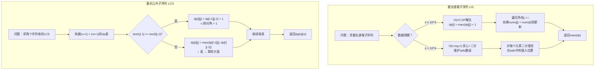

# 最长递增子序列（LIS）+ 最长公共子序列（LCS）

> 创建日期：2026-06-06
> 难度：⭐⭐⭐
> 前置知识：动态规划基础、二分查找、字符串操作

## ⭐ 面试重点速览

| 考察点 | 重要程度 | 考察频率 | 掌握目标 |
|--------|---------|---------|---------|
| LIS的O(n²) DP解法 | ★★★★★ | 极高 | 能独立推导并手写标准LIS代码 |
| LIS的O(n log n)贪心+二分 | ★★★★★ | 极高 | 理解patience sorting原理，能手写二分优化版 |
| LCS的二维DP解法 | ★★★★★ | 极高 | 能画出dp表并推导状态转移方程 |
| 子序列与子数组的区别 | ★★★★ | 高 | 能准确区分两者的定义和DP转移方程差异 |
| LCS回溯构造具体序列 | ★★★ | 中 | 能从dp表反向推导出具体的LCS内容 |
| 变体问题识别 | ★★★★ | 高 | 能将信封嵌套、最长数对链等转化为LIS |

---

## 一、应用场景 🎯

LIS和LCS是序列DP中最经典的两类问题，在实际工程和算法竞赛中有广泛应用。

### LIS（Longest Increasing Subsequence）应用场景

| 场景类别 | 具体问题 | 对应LeetCode题号 |
|---------|---------|-----------------|
| 经典LIS | 最长递增子序列长度 | 300 |
| 二维LIS | 俄罗斯套娃信封问题 | 354 |
| 变体LIS | 最长数对链、最长递增子序列个数 | 646, 673 |
| 最少递减子序列 | 需要多少列火车（Dilworth定理） | - |
| 实际应用 | 股票趋势分析、排名变化追踪 | - |

### LCS（Longest Common Subsequence）应用场景

| 场景类别 | 具体问题 | 对应LeetCode题号 |
|---------|---------|-----------------|
| 经典LCS | 两个字符串的最长公共子序列 | 1143 |
| 变体LCS | 最长公共子数组（连续）、不相交的线 | 718, 1035 |
| 编辑距离 | 两个单词的编辑距离（LCS变体） | 72, 583 |
| 实际应用 | DNA序列比对、文件差异比较（diff命令）、版本控制合并 | - |

### 如何识别LIS/LCS问题？

- **LIS信号**：数组或序列中找"最长递增/递减"，常配合排序使用
- **LCS信号**：两个字符串/数组之间找"公共部分"，保持相对顺序
- **共同特征**：都可以用DP解决，且都有O(n²)和更优的解法

---

## 二、核心原理 🔬

### 2.1 LIS（最长递增子序列）

**问题定义**：给定一个整数数组`nums`，找到其中**最长严格递增子序列**的长度。子序列不需要连续，但必须保持原顺序。

#### O(n²) DP解法

**状态定义**：`dp[i]`表示以`nums[i]`**结尾**的最长递增子序列的长度。

**状态转移方程**：
```
dp[i] = max(dp[j]) + 1    (对于所有 j < i 且 nums[j] < nums[i])
```

即：遍历i之前的所有位置j，如果`nums[j] < nums[i]`，那么`nums[i]`可以接在`nums[j]`后面，形成更长的子序列。

#### O(n log n) 贪心+二分解法（Patience Sorting）

**核心思想**：维护一个数组`tails`，`tails[k]`表示长度为k+1的递增子序列的**最小可能结尾值**。

例如，对于`nums = [10, 9, 2, 5, 3, 7, 101, 18]`：

```
第1步: nums[0]=10 → tails = [10]
第2步: nums[1]=9  → 9<10, 替换10 → tails = [9]
第3步: nums[2]=2  → 2<9, 替换9 → tails = [2]
第4步: nums[3]=5  → 5>2, 追加到末尾 → tails = [2, 5]
第5步: nums[4]=3  → 3在2和5之间, 替换5 → tails = [2, 3]
第6步: nums[5]=7  → 7>3, 追加 → tails = [2, 3, 7]
第7步: nums[6]=101 → 101>7, 追加 → tails = [2, 3, 7, 101]
第8步: nums[7]=18 → 18在7和101之间, 替换101 → tails = [2, 3, 7, 18]
最终长度 = 4
```

### 2.2 LCS（最长公共子序列）

**问题定义**：给定两个字符串`text1`和`text2`，返回两者的**最长公共子序列**的长度。子序列不需要连续，但必须保持相对顺序。

**状态定义**：`dp[i][j]`表示`text1[0..i-1]`和`text2[0..j-1]`的最长公共子序列长度。

**状态转移方程**：
```
如果 text1[i-1] == text2[j-1]：
    dp[i][j] = dp[i-1][j-1] + 1    （两个字符相同，可以同时加入子序列）
否则：
    dp[i][j] = max(dp[i-1][j], dp[i][j-1])   （跳过其中一个字符）
```

### 2.3 算法流程图



### 2.4 LCS dp表可视化

以`text1 = "abcde"`, `text2 = "ace"`为例，dp表填充过程：

```
      ""  "a"  "c"  "e"
""    0    0    0    0
"a"   0    1    1    1
"b"   0    1    1    1
"c"   0    1    2    2
"d"   0    1    2    2
"e"   0    1    2    3   ← 答案：3 ("ace")
```

填表规则非常直观：字符相同→斜对角+1，字符不同→上或左取最大。

---

## 三、趣味解说 🎭

### DNA序列比对：寻找基因的相似度

你是一位**生物信息学家**，正在研究两种生物的DNA序列。DNA是由A、T、C、G四个字母组成的超长字符串——动辄几百万个字符。

面对以下两段DNA序列：
```
人类：A T C G A T C G A T C G
黑猩猩：T C G A T C G A T C G A
```

你肉眼能看出它们有很多相似之处，但需要**精确量化**这个相似度。于是你开始用LCS的思路：

**第一步**：画一个巨大的表格，横向是人类的DNA，纵向是黑猩猩的DNA。

**第二步**：逐行逐列扫描。如果两个位置的碱基相同（比如都是A），就在斜对角的基础上+1；如果不同，就取上方或左方的最大值。

**第三步**：填完表格，右下角的值就是**最长公共子序列的长度**。

> 这个数字告诉你：两种生物的DNA有多少个碱基是按相同顺序排列的。数字越大，亲缘关系越近！

### 信封嵌套：俄罗斯套娃的数学版

你有一堆大小不同的信封。一个信封可以装入另一个信封，当且仅当它的**宽和高都严格大于**另一个。

你想知道：**最多能套几层**？

直觉上，这不就是LIS吗？对！但需要一点技巧：

1. 按**宽度升序**排列所有信封
2. 宽度相同时，按**高度降序**排列（关键！）
3. 在高度序列上求LIS

为什么宽度相同时要高度降序？因为**宽度相同的信封不能互相套**，高度降序可以保证LIS不会选到宽度相同的信封。

---

## 四、代码实现 💻

### 4.1 LIS —— O(n²) DP版（LeetCode 300）

```java
/**
 * LeetCode 300. 最长递增子序列 —— O(n²) DP解法
 * 题目：给定一个整数数组nums，找到其中最长严格递增子序列的长度。
 */
public class LIS_DP {

    public int lengthOfLIS(int[] nums) {
        int n = nums.length;
        if (n == 0) return 0;

        // dp[i]：以nums[i]结尾的最长递增子序列的长度
        int[] dp = new int[n];
        Arrays.fill(dp, 1);  // 每个元素自身构成长度为1的子序列

        int maxLen = 1;

        for (int i = 0; i < n; i++) {
            // 遍历i之前的所有位置j，看能否接在j后面
            for (int j = 0; j < i; j++) {
                if (nums[j] < nums[i]) {
                    // nums[i]可以接在nums[j]后面，形成更长的子序列
                    dp[i] = Math.max(dp[i], dp[j] + 1);
                }
            }
            maxLen = Math.max(maxLen, dp[i]);
        }

        return maxLen;
    }
}
```

### 4.2 LIS —— O(n log n) 贪心+二分版

```java
/**
 * LeetCode 300. 最长递增子序列 —— O(n log n) 贪心+二分
 * 核心思想：Patience Sorting（耐心排序）
 * tails[k]：长度为k+1的递增子序列的最小可能结尾值
 */
public class LIS_BinarySearch {

    public int lengthOfLIS(int[] nums) {
        // tails数组，tails[i]表示长度为i+1的LIS的最小结尾值
        int[] tails = new int[nums.length];
        int size = 0;  // 当前tails的有效长度

        for (int num : nums) {
            // 二分查找num在tails[0..size-1]中的插入位置
            int left = 0, right = size;
            while (left < right) {
                int mid = left + (right - left) / 2;
                if (tails[mid] < num) {
                    left = mid + 1;   // num更大，去右边找
                } else {
                    right = mid;       // num更小或相等，收缩右边界
                }
            }

            // left是num应该插入的位置
            tails[left] = num;

            // 如果left == size，说明num比所有tails值都大，扩展了序列
            if (left == size) {
                size++;
            }
        }

        return size;  // tails的有效长度即LIS长度
    }
}
```

### 4.3 LCS —— 二维DP（LeetCode 1143）

```java
/**
 * LeetCode 1143. 最长公共子序列
 * 题目：给定两个字符串text1和text2，返回它们的最长公共子序列的长度。
 */
public class LCS {

    public int longestCommonSubsequence(String text1, String text2) {
        int m = text1.length(), n = text2.length();

        // dp[i][j]：text1[0..i-1]与text2[0..j-1]的LCS长度
        int[][] dp = new int[m + 1][n + 1];

        // 第0行和第0列默认为0（空字符串的LCS长度为0）

        for (int i = 1; i <= m; i++) {
            for (int j = 1; j <= n; j++) {
                if (text1.charAt(i - 1) == text2.charAt(j - 1)) {
                    // 字符相同：斜对角 + 1
                    dp[i][j] = dp[i - 1][j - 1] + 1;
                } else {
                    // 字符不同：取上方或左方的最大值
                    dp[i][j] = Math.max(dp[i - 1][j], dp[i][j - 1]);
                }
            }
        }

        return dp[m][n];
    }
}
```

### 4.4 LCS —— 空间优化（滚动数组）

```java
/**
 * LCS 空间优化版 —— 只用两行（或一行+一个变量）
 * 因为dp[i][j]只依赖于dp[i-1][j-1]、dp[i-1][j]、dp[i][j-1]
 */
public class LCS_Optimized {

    public int longestCommonSubsequence(String text1, String text2) {
        int m = text1.length(), n = text2.length();

        // 只保留上一行和当前行
        int[] prev = new int[n + 1];  // 上一行（i-1）
        int[] curr = new int[n + 1];  // 当前行（i）

        for (int i = 1; i <= m; i++) {
            for (int j = 1; j <= n; j++) {
                if (text1.charAt(i - 1) == text2.charAt(j - 1)) {
                    // 字符相同：取上一行的j-1位置 + 1
                    curr[j] = prev[j - 1] + 1;
                } else {
                    // 字符不同：取prev[j]（上方）和curr[j-1]（左方）的最大值
                    curr[j] = Math.max(prev[j], curr[j - 1]);
                }
            }
            // 当前行变为上一行，准备下一轮迭代
            int[] temp = prev;
            prev = curr;
            curr = temp;
        }

        return prev[n];  // 最终答案在prev中
    }
}
```

### 4.5 俄罗斯套娃信封（LeetCode 354，二维LIS）

```java
/**
 * LeetCode 354. 俄罗斯套娃信封问题
 * 题目：给定一些信封的宽和高，当且仅当一个信封的宽和高都大于另一个时，
 * 小信封可以放入大信封。求最多能嵌套多少层。
 * 
 * 技巧：按宽度升序，宽度相同按高度降序，然后在高度上求LIS
 */
public class RussianDollEnvelopes {

    public int maxEnvelopes(int[][] envelopes) {
        if (envelopes == null || envelopes.length == 0) return 0;

        // 排序：宽度升序，宽度相同时高度降序
        // 高度降序是为了防止宽度相同的信封被同时选中
        Arrays.sort(envelopes, (a, b) -> {
            if (a[0] != b[0]) return a[0] - b[0];  // 宽度升序
            return b[1] - a[1];                      // 高度降序
        });

        // 提取高度序列，求LIS
        int[] heights = new int[envelopes.length];
        for (int i = 0; i < envelopes.length; i++) {
            heights[i] = envelopes[i][1];
        }

        // 在高度序列上求LIS（O(n log n)）
        return lengthOfLIS(heights);
    }

    private int lengthOfLIS(int[] nums) {
        int[] tails = new int[nums.length];
        int size = 0;
        for (int num : nums) {
            int left = 0, right = size;
            while (left < right) {
                int mid = left + (right - left) / 2;
                if (tails[mid] < num) left = mid + 1;
                else right = mid;
            }
            tails[left] = num;
            if (left == size) size++;
        }
        return size;
    }
}
```

---

## 五、优缺点 ⚖️

### LIS

| 维度 | 优点 | 缺点 |
|-----|------|------|
| O(n²)解法 | 思路直观，代码简单，适合面试推导 | 大规模数据（n>10^4）可能超时 |
| O(n log n)解法 | 高效，可处理10^6级数据 | 只能求长度，无法直接得到具体序列 |
| 通用性 | 可转化为二维LIS（俄罗斯套娃） | 变体问题需要识别和转化技巧 |
| 空间复杂度 | O(n)或O(n)（tails数组） | tails数组本身无法回溯具体序列 |

### LCS

| 维度 | 优点 | 缺点 |
|-----|------|------|
| 二维DP | 思路清晰，可回溯构造具体序列 | 空间O(n*m)，两字符串都很长时可能内存不足 |
| 滚动数组优化 | 空间降至O(min(n,m)) | 无法回溯构造具体序列 |
| 通用性 | 可扩展到编辑距离、相似度计算 | 对三个及以上字符串的LCS是NP-hard |
| 实现难度 | 转移方程简单，易实现 | 边界处理（空字符串）和初始化需注意 |

### LIS vs LCS 对比

| 对比维度 | LIS | LCS |
|---------|-----|-----|
| 输入 | 一个序列 | 两个序列 |
| DP维度 | 一维dp[i] | 二维dp[i][j] |
| 基本复杂度 | O(n²) 或 O(n log n) | O(n*m) |
| 最优复杂度 | O(n log n) | O(n*m)（一般情况） |
| 能否空间优化 | 本身就是O(n) | 可优化到O(min(n,m)) |
| 能否回溯序列 | O(n²)版可以 | 可以（需要保存完整dp表） |

---

## 六、面试高频题 📝

### 6.1 必刷题单

| 题号 | 题目 | 难度 | 类型 | 核心考点 | 推荐指数 |
|------|------|------|------|---------|---------|
| 300 | 最长递增子序列 | ⭐⭐ | LIS | 标准LIS，两种解法都要掌握 | ★★★★★ |
| 673 | 最长递增子序列的个数 | ⭐⭐ | LIS | 同时维护长度和计数 | ★★★★ |
| 354 | 俄罗斯套娃信封问题 | ⭐⭐⭐ | 二维LIS | 排序 + LIS的巧妙转化 | ★★★★★ |
| 646 | 最长数对链 | ⭐⭐ | LIS变体 | 类似俄罗斯套娃 | ★★★★ |
| 1143 | 最长公共子序列 | ⭐⭐ | LCS | 标准LCS，必会 | ★★★★★ |
| 583 | 两个字符串的删除操作 | ⭐⭐ | LCS变体 | 转化为LCS求解 | ★★★★ |
| 718 | 最长重复子数组 | ⭐⭐ | 子数组LCS | 连续 vs 不连续的区别 | ★★★★ |
| 1035 | 不相交的线 | ⭐⭐ | LCS | 识别LCS的伪装 | ★★★★ |
| 72 | 编辑距离 | ⭐⭐⭐ | LCS相关 | 字符串DP的经典难题 | ★★★★★ |
| 1713 | 得到子序列的最少操作次数 | ⭐⭐⭐ | LIS+LCS | 通过LIS优化LCS | ★★★ |

### 6.2 高频面试问法

1. **"LIS的O(n log n)解法是怎么实现的？"**
   - 回答要点：Patience Sorting，维护tails数组，每个元素二分查找插入位置。

2. **"LCS的dp状态转移方程是什么？为什么这样设计？"**
   - 回答要点：字符相同则斜对角+1，不同则取max(上, 左)。本质是在两个字符串中"同步前进"。

3. **"LIS和LCS有什么关系？能用LIS求LCS吗？"**
   - 回答要点：如果其中一个序列的元素互不相同，可以用LIS优化LCS到O(n log n)。但一般情况下不行。

4. **"子序列和子数组在DP处理上有什么不同？"**
   - 回答要点：子序列的dp[i][j]依赖于dp[i-1][j-1]和dp[i-1][j]、dp[i][j-1]；子数组的dp[i][j]只依赖于dp[i-1][j-1]（要求连续）。

---

## 七、常见误区 ❌

### 误区1：LIS tails数组就是最终的子序列
**错误认知**：O(n log n)解法中的tails数组就是最长递增子序列本身。

**正确理解**：tails数组记录的是**每个长度对应的最小结尾值**，它**不是**最终的LIS。例如输入`[2, 5, 3, 4]`，tails最终为`[2, 3, 4]`，但真正的LIS是`[2, 3, 4]`也算碰巧对了。而输入`[7, 8, 1, 2, 3]`，tails为`[1, 2, 3]`，但LIS是`[7, 8]`或`[1, 2, 3]`，tails只反映长度，不反映具体序列。

### 误区2：LIS的严格递增和非严格递增混淆
**错误认知**：严格递增（`<`）和非严格递增（`<=`）的解法一样。

**正确理解**：严格递增时，二分查找用`tails[mid] < num`；非严格递增时，二分查找用`tails[mid] <= num`。这个细微差别会导致完全不同的结果。

### 误区3：LCS二维dp表遍历时越界
**错误认知**：dp[i][j]对应text1[i]和text2[j]。

**正确理解**：dp表多了一行一列用于处理空字符串。dp[i][j]对应的是text1[i-1]和text2[j-1]，不是text1[i]和text2[j]。这是LCS实现中最常见的边界错误。

### 误区4：混淆LCS和最长公共子串
**错误认知**：LCS就是找两个字符串的最长公共连续部分。

**正确理解**：LCS的"子序列"不要求连续，只需要保持相对顺序。最长公共**连续**子串（Longest Common Substring）是另一个问题，其DP转移方程也不同：只有字符相同时才+1，不同时直接归0。

### 误区5：俄罗斯套娃排序时忽略高度降序
**错误认知**：宽度升序，高度也升序，然后求LIS就行。

**正确理解**：如果高度也升序，宽度相同的信封可能被LIS算法同时选中，导致"套入"宽度相同的信封，违反了"严格大于"的约束。高度降序是解决这个问题的关键技巧。

---

> **学习建议**：LIS和LCS是序列DP的两座大山。建议先掌握O(n²)的LIS和O(n*m)的LCS作为基础，然后对比学习LIS的O(n log n)优化和LCS的空间优化。面试中，LIS的高效解法（贪心+二分）是**高频考点**，务必熟练掌握。