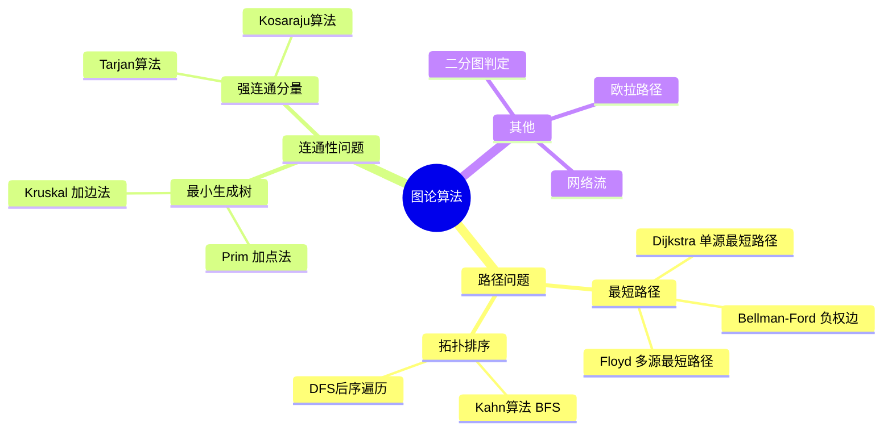
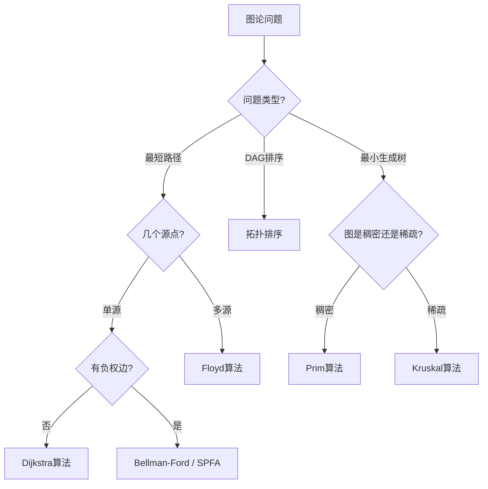
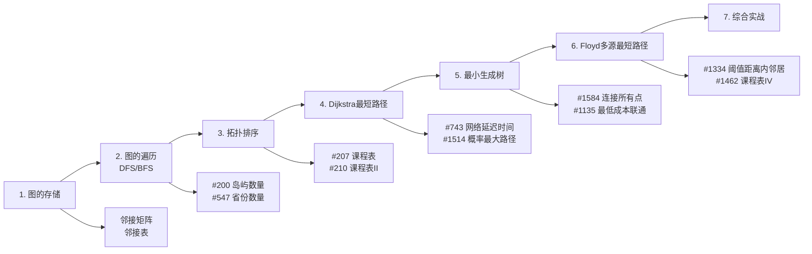

# 图论算法概览
> 创建日期：2026-06-06
> 难度：⭐⭐⭐
> 前置知识：图的基本概念、DFS/BFS、优先队列、并查集

## ⭐ 面试重点速览

| 考察点 | 重要程度 | 考察频率 | 掌握目标 |
|--------|---------|---------|---------|
| Dijkstra最短路径 | ★★★★★ | 极高（65%+） | 能手写优先队列优化版 |
| 拓扑排序 | ★★★★★ | 极高（60%+） | 掌握BFS（Kahn算法）和DFS两种实现 |
| 最小生成树（Kruskal/Prim） | ★★★★☆ | 高（45%+） | 理解两种算法区别，能用并查集实现Kruskal |
| Floyd算法 | ★★★☆☆ | 中（30%+） | 掌握三重循环模板 |
| 图的存储方式 | ★★★★☆ | 高（50%+） | 邻接矩阵 vs 邻接表的取舍 |

---

## 一、图论算法全景 🎯

图论算法是算法面试中的"硬通货"，也是大厂面试的高频考点。核心问题可以分为三大类：



---

## 二、核心算法对比 🔬

### 2.1 最短路径算法对比

| 算法 | 适用场景 | 时间复杂度 | 能否处理负权 | 核心思想 |
|------|---------|-----------|------------|---------|
| **Dijkstra** | 单源、非负权图 | O((V+E)logV) | 否 | 贪心，每次选距离最小的未确定节点 |
| **Floyd** | 多源、任意图 | O(V^3) | 能（无负环） | 动态规划，三重循环松弛 |
| **Bellman-Ford** | 单源、可负权 | O(VE) | 能 | 对所有边进行 V-1 轮松弛 |
| **SPFA** | 单源、可负权（Bellman-Ford优化） | O(VE)最坏 | 能 | 队列优化，只松弛被更新的节点邻居 |

### 2.2 最小生成树算法对比

| 算法 | 核心操作 | 时间复杂度 | 适用图类型 | 核心数据结构 |
|------|---------|-----------|----------|------------|
| **Prim** | 加点：每次选与当前树距离最小的节点 | O((V+E)logV) | 稠密图 | 优先队列 |
| **Kruskal** | 加边：每次选最小的不形成环的边 | O(E log E) | 稀疏图 | 并查集 |

### 2.3 拓扑排序算法对比

| 算法 | 核心思想 | 时间复杂度 | 特点 |
|------|---------|-----------|------|
| **Kahn算法（BFS）** | 不断删除入度为0的节点 | O(V+E) | 直观，容易理解 |
| **DFS后序遍历** | 后序遍历 + 反转 | O(V+E) | 可同时检测环 |

---

## 三、算法选择决策树



---

## 四、图的存储方式

### 4.1 邻接矩阵

```java
// 邻接矩阵：int[][] graph = new int[n][n]
// graph[i][j] 表示从 i 到 j 的边的权重，0 或 INF 表示无边
// 优点：O(1) 判断两点是否相邻，适合稠密图
// 缺点：O(V^2) 空间，遍历邻居 O(V)
```

### 4.2 邻接表

```java
// 邻接表：List<int[]>[] graph = new List[n]
// graph[i] 存储节点 i 的所有邻居 (neighbor, weight)
// 优点：O(V+E) 空间，遍历邻居 O(degree)，适合稀疏图
// 缺点：判断两点是否相邻 O(degree)
```

### 4.3 存储方式选择

| 场景 | 推荐存储方式 | 原因 |
|------|------------|------|
| 边数接近 V^2（稠密图） | 邻接矩阵 | 空间利用率高，操作简单 |
| 边数远小于 V^2（稀疏图） | 邻接表 | 节省空间，遍历快 |
| 需要快速判断两点连通性 | 邻接矩阵 | O(1) 判断 |
| 需要遍历所有邻居 | 邻接表 | 只遍历存在的边 |

---

## 五、学习路线建议



---

## 六、复杂度速查卡

| 算法 | 时间复杂度 | 空间复杂度 | 核心数据结构 |
|------|-----------|-----------|------------|
| Dijkstra（朴素） | O(V^2) | O(V) | 数组 |
| Dijkstra（堆优化） | O((V+E) log V) | O(V+E) | 优先队列 |
| Floyd | O(V^3) | O(V^2) | 二维数组 |
| Prim（堆优化） | O((V+E) log V) | O(V+E) | 优先队列 |
| Kruskal | O(E log E) | O(V) | 并查集 |
| 拓扑排序（Kahn） | O(V+E) | O(V) | 队列 |
| 拓扑排序（DFS） | O(V+E) | O(V) | 递归栈 |

---

## 七、面试常见问题

**Q1：Dijkstra 为什么不能处理负权边？**

A：Dijkstra 基于贪心策略，一旦确定某个节点的最短距离就不会再更新。但如果有负权边，后续可能通过负权边找到更短的路径，导致算法失效。例如：A->B 权重 3，A->C 权重 5，C->B 权重 -3。Dijkstra 会先确定 B 的距离为 3，但实际 A->C->B 距离为 2，更短。

**Q2：Prim 和 Kruskal 什么时候用哪个？**

A：Prim 适合稠密图（边数接近 V^2），Kruskal 适合稀疏图（边数远小于 V^2）。面试中 Kruskal 更常考，因为它需要结合并查集使用。

**Q3：拓扑排序有什么实际应用？**

A：编译依赖分析（Maven/Gradle）、任务调度（有依赖关系的任务执行顺序）、课程安排、包管理器（npm/pip 的依赖解析）等。

---

## 八、关键概念辨析

### 8.1 最短路径 vs 最小生成树

这是图论中最容易混淆的两个概念：

| 对比维度 | 最短路径 | 最小生成树 |
|----------|---------|-----------|
| **目标** | 两点之间的最短路径 | 连通所有节点的最小总成本 |
| **结果** | 一条路径（边序列） | 一棵树（V-1 条边） |
| **典型算法** | Dijkstra, Floyd | Prim, Kruskal |
| **应用** | 导航、网络路由 | 布线、网络设计 |

> 一句话总结：最短路径是"从 A 到 B 怎么走最近"，最小生成树是"怎么用最少的线把所有点连起来"。

### 8.2 拓扑排序 vs 普通排序

| 对比维度 | 拓扑排序 | 普通排序（如快排） |
|----------|---------|-----------------|
| **输入** | 有向无环图（DAG） | 可比较的元素数组 |
| **输出** | 满足依赖关系的线性序列 | 升序/降序排列 |
| **唯一性** | 通常不唯一 | 通常唯一 |
| **时间复杂度** | O(V+E) | O(n log n) |

### 8.3 Dijkstra vs BFS

很多初学者会问：Dijkstra 不就是 BFS 的加强版吗？实际上：

| 对比维度 | BFS | Dijkstra |
|----------|-----|----------|
| **适用图** | 无权图（边权重均为 1） | 有权图（边权重非负） |
| **数据结构** | 普通队列 | 优先队列 |
| **时间复杂度** | O(V+E) | O((V+E) log V) |
| **最短路径** | 保证（无权图） | 保证（非负权图） |

> 当所有边权重都为 1 时，Dijkstra 退化为 BFS。这就是为什么无权图的最短路径用 BFS 即可。

---

## 九、面试常见问题（补充）

**Q4：如何处理负权边的图？**

A：如果图中存在负权边，Dijkstra 不再适用。可以选择：
- **Bellman-Ford**：对每条边进行 V-1 轮松弛，O(VE)，能检测负环
- **SPFA**：Bellman-Ford 的队列优化版，最坏仍然是 O(VE)，但平均更优
- 如果存在负环，最短路径没有定义（可以无限绕圈让路径变短），算法应报告负环存在

**Q5：MST 的边权可以是负数吗？**

A：可以。Kruskal 和 Prim 都能正确处理负权边。因为它们的贪心策略是选择当前最小的边，负数意味着"加入这条边还能赚钱"，自然优先选择。

**Q6：图论问题的建模技巧有哪些？**

A：
1. **虚拟节点**：引入额外节点简化问题（如 #1168 引入"水源"虚拟节点）
2. **反向图**：有些问题正向处理困难，反向建图后豁然开朗（如 #802）
3. **拆点**：将一个节点拆成多个状态，转化为标准图论问题
4. **二分图建模**：将问题转化为二分图判定或匹配问题

---

## 十、参考资料

- 《算法导论》第22-25章（图算法）
- labuladong 的算法小抄 - 图论专题
- LeetCode 探索 - 图专题