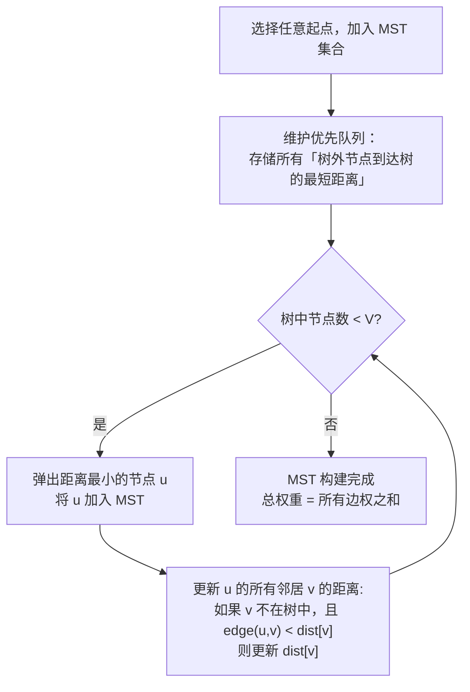
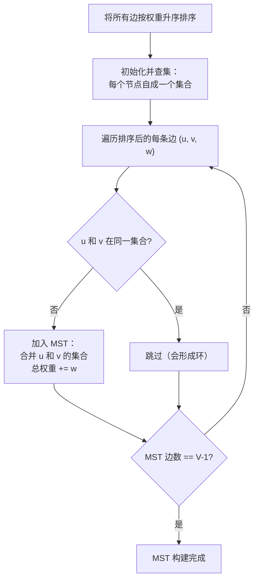
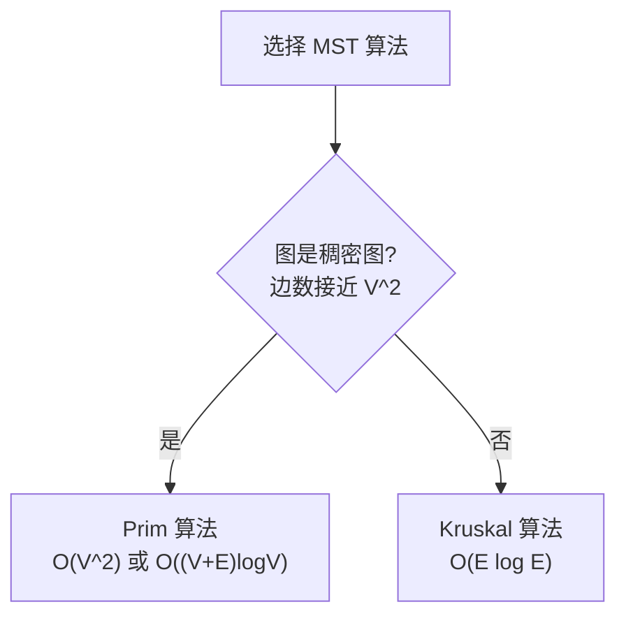

# 最小生成树 (Prim + Kruskal)
> 创建日期：2026-06-06
> 难度：⭐⭐⭐
> 前置知识：图的基本概念、优先队列、并查集、贪心算法

## ⭐ 面试重点速览

| 考察点 | 重要程度 | 考察频率 | 掌握目标 |
|--------|---------|---------|---------|
| Kruskal算法（并查集） | ★★★★★ | 高（55%+） | 能手写并查集 + Kruskal 完整代码 |
| Prim算法（优先队列） | ★★★★☆ | 高（45%+） | 理解"加点法"与 Dijkstra 的区别 |
| 并查集（Union-Find） | ★★★★★ | 极高（60%+） | 掌握路径压缩 + 按秩合并 |
| Prim vs Kruskal 选择 | ★★★★☆ | 高（45%+） | 能根据图的稠密程度选择算法 |
| MST 性质证明 | ★★★☆☆ | 中（25%+） | 理解贪心选择性质 |

---

## 一、应用场景 🎯

最小生成树（MST）解决的是**最低成本连通所有节点**的问题，在现实世界中有大量经典应用：

| 场景分类 | 具体场景 | 对应LeetCode |
|----------|---------|-------------|
| **网络布线** | 铺设光缆连接所有城市，成本最低 | #1135, #1584 |
| **电路设计** | 芯片引脚布线，最小化总长度 | #1584 |
| **供水管道** | 设计供水网络，覆盖所有区域 | 通用建模 |
| **聚类分析** | 单链聚类（删除 MST 最长边） | 通用建模 |
| **近似算法** | 旅行商问题的 MST 近似解法 | 通用建模 |
| **图像分割** | 图割算法中的 MST 应用 | 通用建模 |

---

## 二、核心原理 🔬

### 2.1 什么是最小生成树

给定一个**带权连通无向图**，最小生成树（Minimum Spanning Tree, MST）是该图的一个子图：
- 包含所有 V 个节点（**生成**）
- 是一棵树（V-1 条边，无环，**连通**）
- 边权总和最小（**最小**）

```mermaid
graph TD
    subgraph 原图
        A1((A)) ---|4| B1((B))
        A1 ---|2| C1((C))
        B1 ---|1| C1
        B1 ---|3| D1((D))
        C1 ---|5| D1
    end

    subgraph MST-总权重=7
        A2((A)) ---|2| C2((C))
        B2((B)) ---|1| C2
        B2 ---|3| D2((D))
    end
```

### 2.2 Prim 算法 —— "加点法"

Prim 的核心思想：**从任意节点开始，逐步扩展树，每次选择与当前树距离最近的外部节点加入。**



### 2.3 Kruskal 算法 —— "加边法"

Kruskal 的核心思想：**将所有边按权重排序，从小到大依次选择，如果该边不会形成环，就加入 MST。**



### 2.4 Prim vs Kruskal 对比



---

## 三、趣味解说 🎭

> 铺设网络光缆：如何用最小的成本，把全中国的城市都连上网？

想象你是中国电信的总工程师，接到一个任务：**用光缆把全国所有省会城市连接起来，要求总成本最低。**

你翻开地图，上面标注了每两个城市之间铺设光缆的成本（有些城市之间可能无法直接铺设，或者成本太高）。你的任务就是从中选出一组边，使得：
1. 所有城市都连通（不能有哪个城市掉队）
2. 不会形成环路（光缆中若有环路就是浪费钱）
3. 总成本最低

### Prim 的思路：从北京出发

Prim 会说："我先从北京出发，看看离北京最近的城市是谁？哦，是天津，成本 100 万。好，把天津连上。"

"现在我的网络里有北京和天津了。看看离这个网络最近的城市是谁？是石家庄，成本 150 万。好，连上石家庄。"

"现在网络里有 {北京、天津、石家庄}。继续找离这个网络最近的城市..."

就像一棵树，从根节点开始，不断长出新的枝叶，每次都挑最近的节点连接。

### Kruskal 的思路：全局贪心

Kruskal 会说："把所有可能的光缆线路按成本从低到高排个序。然后从最便宜的开始，一条一条地检查：如果这条光缆连接的两个城市还没连通（不会形成环），就用它。如果已经连通了（再用就形成环了），就跳过。"

"最便宜的是天津到北京，100 万，连上！"
"第二便宜的是石家庄到天津，150 万，连上！"
"第三便宜的是石家庄到北京，200 万... 等等，北京和石家庄已经连通了（通过天津），这条线会造成环路，跳过！"

> **换一个生活类比**：Kruskal 就像在玩"连线游戏"，你有一堆绳子，按长短排序，从最短的开始，每次拿起一根绳子，如果它两端的小球已经在同一堆里了，就扔掉；否则，用它把两堆小球连起来。最终所有小球都会在一堆里。

### 趣味记忆口诀

```
Prim 加点选最近，优先队列帮大忙；
Kruskal 加边防成环，并查集里查家长；
稠密图用 Prim 快，稀疏图让 Kruskal 上；
最小生成树不难，贪心策略记心上。
```

---

## 四、代码实现 💻

### 4.1 并查集（Union-Find）

```java
/**
 * 并查集 —— 带路径压缩 + 按秩合并
 * 是 Kruskal 算法的核心依赖
 */
class UnionFind {
    private int[] parent; // 父节点数组
    private int[] rank;   // 秩（树的高度上界）

    public UnionFind(int n) {
        parent = new int[n];
        rank = new int[n];
        for (int i = 0; i < n; i++) {
            parent[i] = i; // 初始时每个节点的父节点是自己
            rank[i] = 1;   // 初始秩为 1
        }
    }

    // 查找根节点（带路径压缩）
    public int find(int x) {
        if (parent[x] != x) {
            // 路径压缩：将 x 直接挂到根节点下
            parent[x] = find(parent[x]);
        }
        return parent[x];
    }

    // 合并两个集合（按秩合并）
    public boolean union(int x, int y) {
        int rootX = find(x);
        int rootY = find(y);

        if (rootX == rootY) {
            return false; // 已在同一集合，合并失败
        }

        // 将秩较小的树挂到秩较大的树下
        if (rank[rootX] < rank[rootY]) {
            parent[rootX] = rootY;
        } else if (rank[rootX] > rank[rootY]) {
            parent[rootY] = rootX;
        } else {
            parent[rootY] = rootX;
            rank[rootX]++; // 秩相同时，合并后秩+1
        }
        return true; // 合并成功
    }

    // 判断两个节点是否在同一集合
    public boolean isConnected(int x, int y) {
        return find(x) == find(y);
    }
}
```

### 4.2 Kruskal 算法

```java
/**
 * Kruskal 最小生成树 —— LeetCode #1584 连接所有点的最小费用
 * @param points 点坐标数组
 * @return 连接所有点的最小曼哈顿距离总和
 */
public int minCostConnectPoints(int[][] points) {
    int n = points.length;

    // 构建所有边：(起点, 终点, 权重)
    List<int[]> edges = new ArrayList<>();
    for (int i = 0; i < n; i++) {
        for (int j = i + 1; j < n; j++) {
            // 曼哈顿距离作为边的权重
            int dist = Math.abs(points[i][0] - points[j][0])
                     + Math.abs(points[i][1] - points[j][1]);
            edges.add(new int[]{i, j, dist});
        }
    }

    // 按边权升序排序（Kruskal 的核心步骤）
    edges.sort((a, b) -> a[2] - b[2]);

    UnionFind uf = new UnionFind(n);
    int totalCost = 0;
    int edgesUsed = 0; // 已使用的边数

    // 遍历排序后的边
    for (int[] edge : edges) {
        int u = edge[0], v = edge[1], w = edge[2];

        // 如果 u 和 v 不在同一集合，说明不会形成环
        if (uf.union(u, v)) {
            totalCost += w; // 加入这条边
            edgesUsed++;

            // MST 边数 = V - 1 时完成
            if (edgesUsed == n - 1) {
                break;
            }
        }
    }

    return totalCost;
}
```

### 4.3 Prim 算法（堆优化版）

```java
/**
 * Prim 最小生成树 —— 堆优化版
 * 类似于 Dijkstra，但 dist 的含义不同：
 * Dijkstra 的 dist 是「起点到该节点的最短距离」
 * Prim 的 dist 是「该节点到当前 MST 的最短距离」
 */
public int primMST(int n, int[][] edges) {
    // 构建邻接表（无向图）
    List<int[]>[] graph = new List[n];
    for (int i = 0; i < n; i++) {
        graph[i] = new ArrayList<>();
    }
    for (int[] edge : edges) {
        int u = edge[0], v = edge[1], w = edge[2];
        graph[u].add(new int[]{v, w});
        graph[v].add(new int[]{u, w}); // 无向图：双向添加
    }

    boolean[] inMST = new boolean[n]; // 标记节点是否已在 MST 中
    int[] dist = new int[n]; // dist[i] = 节点 i 到当前 MST 的最短距离
    Arrays.fill(dist, Integer.MAX_VALUE);
    dist[0] = 0; // 从节点 0 开始

    // 优先队列：(节点, 到MST的距离)
    PriorityQueue<int[]> pq = new PriorityQueue<>((a, b) -> a[1] - b[1]);
    pq.offer(new int[]{0, 0});

    int totalCost = 0;
    int nodesInMST = 0;

    while (!pq.isEmpty() && nodesInMST < n) {
        int[] cur = pq.poll();
        int u = cur[0];
        int d = cur[1];

        if (inMST[u]) {
            continue; // 已经加入 MST 了，跳过
        }

        // 将 u 加入 MST
        inMST[u] = true;
        totalCost += d;
        nodesInMST++;

        // 更新 u 的所有邻居到 MST 的距离
        for (int[] edge : graph[u]) {
            int v = edge[0], w = edge[1];
            if (!inMST[v] && w < dist[v]) {
                dist[v] = w; // 更新 v 到 MST 的最短距离
                pq.offer(new int[]{v, w});
            }
        }
    }

    return nodesInMST == n ? totalCost : -1; // 不连通返回 -1
}
```

### 4.4 最低成本联通所有城市（LeetCode #1135）

```java
/**
 * 最低成本联通所有城市 —— LeetCode #1135
 * 使用 Kruskal 算法，是 MST 的经典应用题
 * @param n 城市数量（1-indexed）
 * @param connections 每条连接 [city1, city2, cost]
 * @return 最低总成本，无法连通则返回 -1
 */
public int minimumCost(int n, int[][] connections) {
    // 按成本升序排序
    Arrays.sort(connections, (a, b) -> a[2] - b[2]);

    UnionFind uf = new UnionFind(n + 1); // 1-indexed，多开一个位置
    int totalCost = 0;
    int edgesUsed = 0;

    for (int[] conn : connections) {
        int u = conn[0], v = conn[1], cost = conn[2];

        if (uf.union(u, v)) {
            totalCost += cost;
            edgesUsed++;
            if (edgesUsed == n - 1) {
                return totalCost; // 已连通所有城市
            }
        }
    }

    return -1; // 无法连通所有城市
}
```

---

## 五、优缺点 ⚖️

### Prim

| 优点 | 缺点 |
|------|------|
| 稠密图中效率高 O(V^2) 朴素版 | 稀疏图中不如 Kruskal |
| 与 Dijkstra 结构相似，容易记忆 | 需要频繁更新优先队列 |
| 不需要并查集 | 只能处理无向图 |
| 堆优化后 O((V+E)logV) | 代码实现比 Kruskal 稍复杂 |

### Kruskal

| 优点 | 缺点 |
|------|------|
| 稀疏图中效率高 O(E log E) | 稠密图中边太多，排序开销大 |
| 思路简单：排序 + 贪心 + 并查集 | 依赖并查集，需要额外掌握 |
| 适合边列表输入 | 只能处理无向图 |
| 代码实现简洁 | 需要预先排序所有边 |

---

## 六、面试高频题 📝

### 必刷题目清单

| 题号 | 题目 | 难度 | 考察点 |
|------|------|------|--------|
| #1584 | 连接所有点的最小费用 | Medium | Kruskal / Prim 标准模板 |
| #1135 | 最低成本联通所有城市 | Medium | Kruskal 标准模板 |
| #1168 | 水资源分配优化 | Hard | MST + 虚拟节点技巧 |
| #1489 | 找到最小生成树里的关键边和伪关键边 | Hard | 枚举 + Kruskal |
| #1631 | 最小体力消耗路径 | Medium | 二分 + BFS / 并查集 / Dijkstra |
| #778 | 水位上升的泳池中游泳 | Hard | 二分 + BFS / 并查集 |

### 高频面试题解析

**LeetCode #1584 —— 连接所有点的最小费用**

这是 MST 的"标准模板题"。面试中需要展示：

1. 能够构建完全图（任意两点之间都有边）
2. 用 Kruskal 或 Prim 求解
3. 分析时间复杂度：完全图有 O(n^2) 条边，Kruskal 需要 O(n^2 log n)

**LeetCode #1168 —— 水资源分配优化（Hard）**

这道题是非常经典的 MST 变体题，核心技巧是**引入虚拟节点**：

- 每个房子可以自己打井（成本 `wells[i]`），也可以接水管（成本 `pipes`）
- 建造一个虚拟节点"水源"，将打井成本转化为"从水源到房子的水管成本"
- 问题转化为：连通所有房子 + 水源的最小生成树

---

## 七、常见误区 ❌

| 误区 | 错误做法 | 正确做法 |
|------|---------|---------|
| **Prim 和 Dijkstra 混淆** | 把 Prim 的 dist 更新逻辑写成 Dijkstra 的 | Prim: `dist[v] = min(dist[v], w)` / Dijkstra: `dist[v] = min(dist[v], dist[u] + w)` |
| **并查集未路径压缩** | 只用朴素 find，导致退化为链表 | 必须做路径压缩 `parent[x] = find(parent[x])` |
| **忘记无向图双向建边** | 只加 `graph[u].add(v)` | 无向图必须同时加 `graph[u].add(v)` 和 `graph[v].add(u)` |
| **Kruskal 排序方向** | 按降序排序 | 必须按升序排序（从最小边开始贪心） |
| **MST 边数判断** | 不判断边数是否达到 V-1 | 必须检查：边数不足 V-1 说明图不连通 |

### 最容易出错的地方

**误区 1：Prim 与 Dijkstra 的差异**

这是最容易混淆的地方。虽然两者代码结构几乎一样，但核心逻辑不同：

```java
// Prim: 更新邻居到 MST 的最短距离
// 只需要看当前边的权重
if (!inMST[v] && w < dist[v]) {
    dist[v] = w; // 注意：是 w，不是 dist[u] + w
}

// Dijkstra: 更新邻居到起点的最短距离
// 需要累加从起点到当前节点的距离
if (dist[u] + w < dist[v]) {
    dist[v] = dist[u] + w; // 注意：是 dist[u] + w，不是 w
}
```

**误区 2：MST 不一定唯一**

如果图中存在多条权重相同的边，MST 可能不唯一。但 MST 的总权重是唯一的。面试中如果被问到"MST 是否唯一"，需要考虑这个细节。

**误区 3：MST 不能处理有向图**

MST 的定义建立在无向图上。有向图有类似的概念叫"最小树形图（Minimum Arborescence）"，需要使用朱刘算法（Edmonds' Algorithm），比 MST 复杂得多。如果在有向图上直接套用 Kruskal 或 Prim，会得到错误结果。