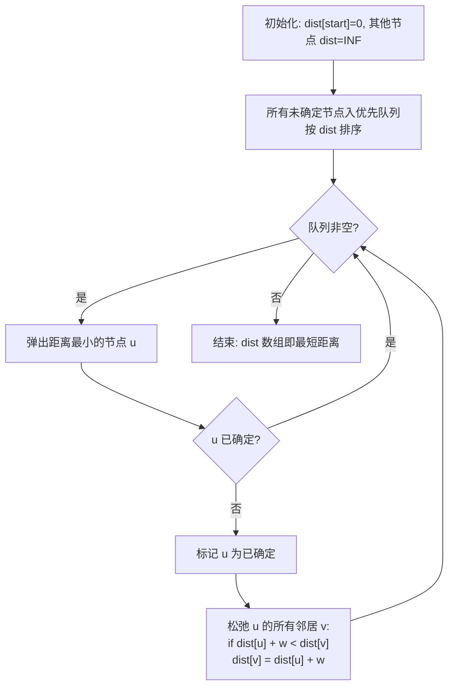
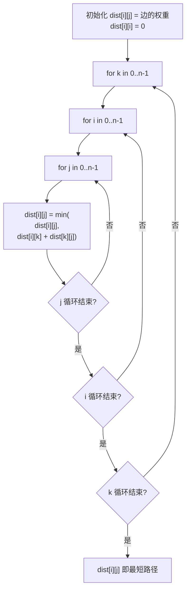

# 最短路径算法 (Dijkstra + Floyd)
> 创建日期：2026-06-06
> 难度：⭐⭐⭐
> 前置知识：图的基本概念、优先队列、动态规划

## ⭐ 面试重点速览

| 考察点 | 重要程度 | 考察频率 | 掌握目标 |
|--------|---------|---------|---------|
| Dijkstra 堆优化版 | ★★★★★ | 极高（70%+） | 10 分钟内默写完整代码 |
| Dijkstra 为什么不能处理负权 | ★★★★★ | 极高（60%+） | 能用反例解释清楚 |
| Floyd 三重循环 | ★★★★☆ | 高（45%+） | 理解为何 k 在最外层 |
| Floyd 判负环 | ★★★☆☆ | 中（30%+） | 掌握对角线负值检测 |
| 最短路径建模 | ★★★★☆ | 高（50%+） | 能把实际问题建模为最短路径 |

---

## 一、应用场景 🎯

最短路径算法是图论中最实用的算法之一，现实世界中有大量应用：

| 场景 | 具体应用 | 对应算法 |
|------|---------|---------|
| **导航软件** | 高德/百度地图规划路线 | Dijkstra / A* |
| **网络路由** | OSPF 协议选路 | Dijkstra |
| **社交网络** | 六度分隔理论验证 | BFS（无权图） |
| **游戏AI** | 寻路算法 | A*（Dijkstra 的启发式优化） |
| **物流配送** | 最短配送路径 | Dijkstra |
| **航班中转** | 最少中转次数 | BFS / Dijkstra |
| **网络延迟分析** | 服务器间最小时延 | Floyd / Dijkstra |

---

## 二、核心原理 🔬

### 2.1 Dijkstra 算法 —— 像水波扩散

Dijkstra 的核心思想是**贪心 + 松弛**，可以形象地理解为"水波扩散"：

> 在起点滴一滴水，水波以不同速度沿各条边扩散。每个节点被水波**第一次**到达的时刻，就是它的最短距离。已经到达的节点不会再被更新。



### 2.2 "松弛"操作详解

松弛（Relaxation）是 Dijkstra 的核心操作：

```
if (dist[u] + weight(u, v) < dist[v]) {
    dist[v] = dist[u] + weight(u, v);
}
```

翻译成人话：**"我发现了一条从起点到 v 的更短路径（经过 u 中转），我用它来更新 dist[v]"**。

### 2.3 Floyd 算法 —— 动态规划思想

Floyd 的核心是动态规划，状态转移方程：

```
dp[k][i][j] = min(dp[k-1][i][j], dp[k-1][i][k] + dp[k-1][k][j])
```

含义：**从 i 到 j 的最短路径，要么不经过节点 k，要么经过节点 k（即 i→k 的最短 + k→j 的最短）。**



### 2.4 为什么 Floyd 的 k 必须在最外层？

这是 Floyd 算法最容易被问到的面试题。简而言之：

- Floyd 的 DP 定义是 `dp[k][i][j]` = 只经过前 k 个节点中转时，i 到 j 的最短路径
- 状态转移依赖 `dp[k-1][i][k]` 和 `dp[k-1][k][j]`，即上一个 k 阶段的结果
- 如果把 k 放在内层，会导致某次更新可能使用了"当前 k 阶段已经更新过的值"，破坏了 DP 的阶段性

---

## 三、趣味解说 🎭

### Dijkstra：导航软件背后的"水波扩散"

想象你开车去一个陌生城市。打开导航软件，它瞬间给你规划了一条最优路线。这个"瞬间"背后，就是 Dijkstra 的功劳。

Dijkstra 的工作方式，就像在起点扔下一颗石子，水面荡起涟漪：

```
第 1 秒：水波到达距离起点最近的那个路口（距离 = 1）
第 2 秒：水波到达距离起点第二近的路口（距离 = 3）
第 3 秒：水波可能会经过第 2 秒到达的路口，扩散到更远的地方
...
```

水波**第一次**碰到某个路口的时间，就是起点到该路口的最短时间，因为水波总是沿着最短的路传播。

> 一个更直观的类比：你去一个陌生的商场，想找到从入口到某家店的最短路径。你拿出商场地图，从入口开始，一层一层地往外探索，每次都先探索最近的未探索区域。这就是 Dijkstra！

### Floyd：一张"任意两点间"的速查表

Floyd 算法的思路更简单粗暴：

> 给你一张城市地图，你想知道**任意两个城市之间**的最短距离。Floyd 的做法是：逐个检查每个城市，看"如果经过这个城市中转，会不会让某两个城市之间的路径更短？"

三重循环，就像把每座城市当作"中转站"试一遍，最终得到一张完整的"任意两点最短距离表"。

### 趣味记忆口诀

```
Dijkstra 贪心选最近，松弛操作不停歇；
优先队列来加速，负权边要绕道走；
Floyd 三重循环套，中转节点在最外层；
距离矩阵更新后，任意两点捷径通。
```

---

## 四、代码实现 💻

### 4.1 Dijkstra 堆优化版

```java
/**
 * Dijkstra 最短路径 —— 优先队列（堆）优化版
 * LeetCode #743: 网络延迟时间
 * @param times 边列表，每条边 [u, v, w] 表示从 u 到 v 的权重为 w
 * @param n     节点数（1-indexed）
 * @param k     起始节点
 * @return 从 k 出发到所有节点的最短距离中的最大值
 */
public int networkDelayTime(int[][] times, int n, int k) {
    // 构建邻接表：graph[u] = [(v1, w1), (v2, w2), ...]
    List<int[]>[] graph = new List[n + 1];
    for (int i = 1; i <= n; i++) {
        graph[i] = new ArrayList<>();
    }
    for (int[] edge : times) {
        int u = edge[0], v = edge[1], w = edge[2];
        graph[u].add(new int[]{v, w});
    }

    // 最短距离数组，初始化为无穷大
    int[] dist = new int[n + 1];
    Arrays.fill(dist, Integer.MAX_VALUE);
    dist[k] = 0; // 起点到自身距离为 0

    // 优先队列：按距离升序排列（小顶堆）
    // 存储 (节点, 距离)
    PriorityQueue<int[]> pq = new PriorityQueue<>((a, b) -> a[1] - b[1]);
    pq.offer(new int[]{k, 0});

    while (!pq.isEmpty()) {
        int[] cur = pq.poll();
        int u = cur[0];
        int d = cur[1];

        // 如果当前距离已大于记录的最短距离，跳过（懒删除）
        if (d > dist[u]) {
            continue;
        }

        // 松弛所有邻居
        for (int[] edge : graph[u]) {
            int v = edge[0];
            int w = edge[1];
            int newDist = dist[u] + w; // 经过 u 中转到达 v 的距离

            if (newDist < dist[v]) {
                dist[v] = newDist; // 更新最短距离
                pq.offer(new int[]{v, newDist}); // 入队
            }
        }
    }

    // 找到最大延迟
    int maxDelay = 0;
    for (int i = 1; i <= n; i++) {
        if (dist[i] == Integer.MAX_VALUE) {
            return -1; // 有节点不可达
        }
        maxDelay = Math.max(maxDelay, dist[i]);
    }
    return maxDelay;
}
```

### 4.2 Dijkstra 朴素版（邻接矩阵，适合稠密图）

```java
/**
 * Dijkstra 朴素版 —— O(V^2)
 * 适用于稠密图（边数接近 V^2 时比堆优化版更快）
 */
public int[] dijkstraNaive(int[][] graph, int start) {
    int n = graph.length;
    int[] dist = new int[n];
    boolean[] visited = new boolean[n]; // 标记是否已确定最短距离

    Arrays.fill(dist, Integer.MAX_VALUE);
    dist[start] = 0;

    // 每次确定一个节点的最短距离，共需 n 次
    for (int i = 0; i < n; i++) {
        // 在未确定的节点中，找到距离最小的节点
        int u = -1;
        int minDist = Integer.MAX_VALUE;
        for (int j = 0; j < n; j++) {
            if (!visited[j] && dist[j] < minDist) {
                minDist = dist[j];
                u = j;
            }
        }

        if (u == -1) break; // 没有可达节点了
        visited[u] = true; // 标记 u 为已确定

        // 松弛 u 的所有邻居
        for (int v = 0; v < n; v++) {
            if (!visited[v] && graph[u][v] != 0) {
                int newDist = dist[u] + graph[u][v];
                if (newDist < dist[v]) {
                    dist[v] = newDist;
                }
            }
        }
    }
    return dist;
}
```

### 4.3 Floyd 算法

```java
/**
 * Floyd 算法 —— 多源最短路径
 * 核心：三重循环，k 在最外层
 * 输入：邻接矩阵 graph，graph[i][j] 表示 i 到 j 的边权重
 *       graph[i][j] = INF 表示无边
 * 输出：graph[i][j] 变为 i 到 j 的最短距离
 */
public void floyd(int[][] graph) {
    int n = graph.length;
    int INF = Integer.MAX_VALUE / 2; // 防止加法溢出

    // 初始化：将无边的情况设为 INF
    for (int i = 0; i < n; i++) {
        for (int j = 0; j < n; j++) {
            if (i != j && graph[i][j] == 0) {
                graph[i][j] = INF;
            }
        }
    }

    // Floyd 核心：三重循环，k 必须是最外层！
    for (int k = 0; k < n; k++) {          // 中转节点
        for (int i = 0; i < n; i++) {      // 起点
            for (int j = 0; j < n; j++) {  // 终点
                // 如果经过 k 中转能让 i→j 更短，则更新
                if (graph[i][k] != INF && graph[k][j] != INF) {
                    graph[i][j] = Math.min(graph[i][j],
                            graph[i][k] + graph[k][j]);
                }
            }
        }
    }

    // 检测负环：如果 dist[i][i] < 0，说明存在负环
    for (int i = 0; i < n; i++) {
        if (graph[i][i] < 0) {
            System.out.println("图中存在负权环！");
            return;
        }
    }
}
```

### 4.4 Dijkstra 通用模板（带路径记录）

```java
/**
 * Dijkstra 带路径记录
 * 不仅返回最短距离，还返回最短路径上的节点序列
 */
public Pair<int[], List<Integer>[]> dijkstraWithPath(List<int[]>[] graph, int start) {
    int n = graph.length;
    int[] dist = new int[n];
    int[] prev = new int[n]; // prev[i] = 到达 i 的前一个节点
    Arrays.fill(dist, Integer.MAX_VALUE);
    Arrays.fill(prev, -1);
    dist[start] = 0;

    PriorityQueue<int[]> pq = new PriorityQueue<>((a, b) -> a[1] - b[1]);
    pq.offer(new int[]{start, 0});

    while (!pq.isEmpty()) {
        int u = pq.poll()[0];
        for (int[] edge : graph[u]) {
            int v = edge[0], w = edge[1];
            if (dist[u] + w < dist[v]) {
                dist[v] = dist[u] + w;
                prev[v] = u; // 记录前驱节点
                pq.offer(new int[]{v, dist[v]});
            }
        }
    }

    // 重建路径
    List<Integer>[] paths = new List[n];
    for (int i = 0; i < n; i++) {
        paths[i] = reconstructPath(prev, start, i);
    }
    return new Pair<>(dist, paths);
}

// 从 prev 数组重建从 start 到 target 的路径
private List<Integer> reconstructPath(int[] prev, int start, int target) {
    List<Integer> path = new ArrayList<>();
    for (int at = target; at != -1; at = prev[at]) {
        path.add(at);
    }
    Collections.reverse(path);
    // 如果路径的第一个节点是 start，说明可达
    return path.get(0) == start ? path : new ArrayList<>();
}
```

---

## 五、优缺点 ⚖️

### Dijkstra

| 优点 | 缺点 |
|------|------|
| 单源最短路径的标准解法，效率高 | 不能处理负权边 |
| 堆优化后 O((V+E)logV)，性能优秀 | 每次只能求一个源点到其他点的最短路径 |
| 贪心策略直观易懂 | 代码实现（堆优化版）细节较多 |
| 可以扩展为 A* 算法 | 对于稠密图，堆优化可能不如朴素版 |

### Floyd

| 优点 | 缺点 |
|------|------|
| 一次计算得到所有点对的最短路径 | O(V^3) 时间复杂度，图太大时无法接受 |
| 代码极短，三重循环搞定 | O(V^2) 空间复杂度 |
| 可以处理负权边（无负环） | 无法处理大规模图（V > 500 就吃力） |
| 实现简单，不容易写错 | 不能记录最短路径本身（需额外处理） |

---

## 六、面试高频题 📝

### 必刷题目清单

| 题号 | 题目 | 难度 | 考察点 |
|------|------|------|--------|
| #743 | 网络延迟时间 | Medium | Dijkstra 标准模板 |
| #1514 | 概率最大的路径 | Medium | Dijkstra 变体（最大路径） |
| #787 | K 站中转内最便宜的航班 | Medium | Dijkstra + 限制条件 |
| #1334 | 阈值距离内邻居最少的城市 | Medium | Floyd 标准模板 |
| #1462 | 课程表 IV | Medium | Floyd 传递闭包 |
| #1976 | 到达目的地的方案数 | Medium | Dijkstra + DP |
| #1631 | 最小体力消耗路径 | Medium | Dijkstra 变体 |
| #882 | 细分图中的可到达节点 | Hard | Dijkstra + 细节处理 |

### 高频面试题解析

**LeetCode #743 —— 网络延迟时间**

这是 Dijkstra 的"标准模板题"，面试中几乎必问。关键点：

1. 构建邻接表（注意是 1-indexed 还是 0-indexed）
2. 优先队列的排序规则（小顶堆，按距离升序）
3. 懒删除优化：`if (d > dist[u]) continue;`
4. 最终结果处理：取最大值，有不可达返回 -1

**LeetCode #1334 —— 阈值距离内邻居最少的城市**

这是 Floyd 的经典应用题。核心思路：先用 Floyd 算出所有城市对的最短距离，然后统计每个城市在阈值距离内的邻居数量，取最少的。

---

## 七、常见误区 ❌

| 误区 | 错误做法 | 正确做法 |
|------|---------|---------|
| **Dijkstra 处理负权** | 试图用 Dijkstra 处理负权边 | 负权边用 Bellman-Ford 或 SPFA |
| **Floyd k 循环位置** | 把 k 放在内层循环 | k 必须放在最外层，它是 DP 的阶段 |
| **INF 取值溢出** | `INF = Integer.MAX_VALUE` | 用 `INF = Integer.MAX_VALUE / 2`，防止 `INF + w` 溢出 |
| **优先队列使用** | 修改 dist 后不重新入队 | 直接将新距离入队，用懒删除处理旧值 |
| **忘记初始化** | `dist[i]` 忘记设为 INF | 除起点外，所有 dist 初始化为 INF |
| **Dijkstra 与 BFS 混淆** | 有权图找最短路径用 BFS | 有权图必须用 Dijkstra，BFS 只适用于无权图 |

### 最容易出错的地方

**误区 1：Dijkstra 的 visited 数组**

标准 Dijkstra 不需要显式的 `visited` 数组（因为优先队列保证先弹出的距离一定是最短的）。但很多实现会加 `visited` 来避免重复处理。如果加了 `visited`，必须在**弹出时**标记，而不是入队时标记。

**误区 2：Floyd 的 INF 取值**

```java
// 错误：INF = Integer.MAX_VALUE
// 当计算 INF + 3 时，溢出变成负数，导致结果错误
int INF = Integer.MAX_VALUE;

// 正确：INF = Integer.MAX_VALUE / 2
// 加法不会溢出，同时足够大
int INF = Integer.MAX_VALUE / 2;
```

**误区 3：Dijkstra 每次只能处理一个源点**

如果需要多个源点到其他点的最短路径，可以：
- 对每个源点分别跑 Dijkstra
- 或者用 Floyd 一次性算出所有点对
- 或者用多源 Dijkstra（将所有源点初始距离设为 0，一起入队）