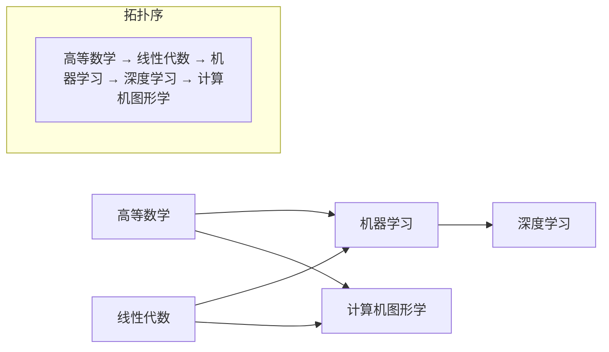
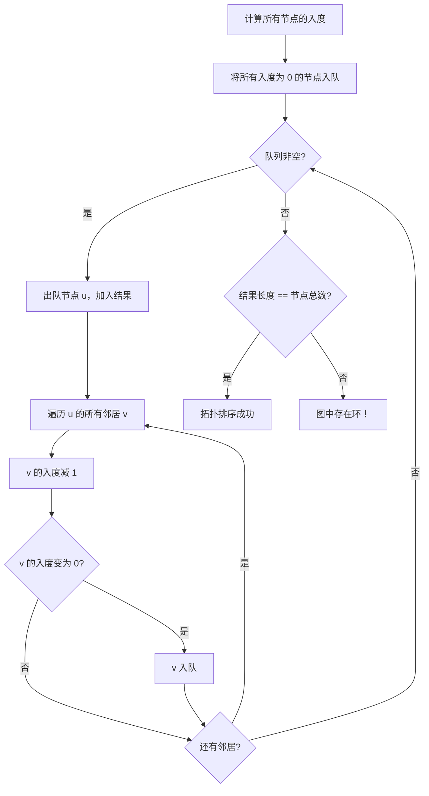
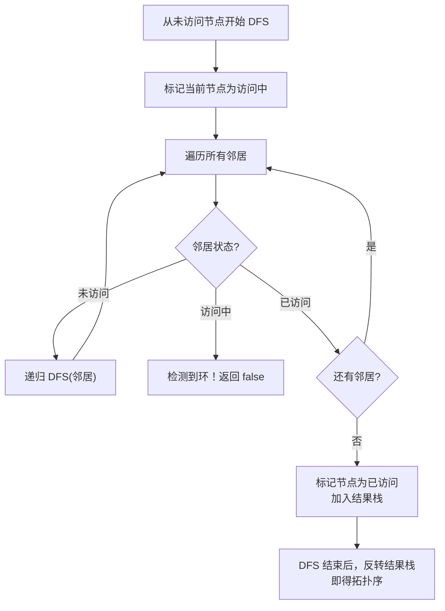

# 拓扑排序 (Topological Sort)
> 创建日期：2026-06-06
> 难度：⭐⭐
> 前置知识：图的基本概念、BFS/DFS、队列

## ⭐ 面试重点速览

| 考察点 | 重要程度 | 考察频率 | 掌握目标 |
|--------|---------|---------|---------|
| Kahn算法（BFS拓扑排序） | ★★★★★ | 极高（75%+） | 能默写入度数组 + 队列的完整模板 |
| 环检测 | ★★★★★ | 极高（70%+） | 理解拓扑排序天然能检测环 |
| 多种拓扑序 | ★★★★☆ | 高（50%+） | 理解为什么拓扑序可能不唯一 |
| DFS拓扑排序 | ★★★☆☆ | 中（35%+） | 掌握后序遍历 + 反转 |
| 拓扑排序建模 | ★★★★☆ | 高（55%+） | 能把依赖关系建模为有向图 |

---

## 一、应用场景 🎯

拓扑排序的现实应用几乎无处不在，尤其是在**依赖管理**领域：

| 场景分类 | 具体场景 | 对应LeetCode |
|----------|---------|-------------|
| **课程安排** | 大学选课，必须先修完前置课程 | #207, #210 |
| **编译依赖** | Maven/Gradle 的依赖解析 | #210, #1203 |
| **任务调度** | 有依赖关系的任务执行顺序 | #207 |
| **包管理器** | npm/pip 的依赖安装顺序 | #210 |
| **Excel公式** | 单元格引用的计算顺序 | 通用建模 |
| **构建系统** | Makefile 目标的构建顺序 | 通用建模 |
| **事件顺序** | 日志事件的时间顺序推断 | #444 |

---

## 二、核心原理 🔬

### 2.1 什么是拓扑排序

拓扑排序的目标是：**给有向无环图（DAG）的所有节点排一个线性顺序，使得对于每条有向边 (u, v)，u 在序列中都排在 v 的前面。**

条件：**图必须是有向无环图（DAG）**。如果图中有环，拓扑排序不存在。



### 2.2 Kahn算法（BFS 实现）

Kahn 算法的核心思想非常直观：**不断"删除"入度为 0 的节点**。



### 2.3 DFS 实现（后序遍历）

DFS 方式的拓扑排序利用了**后序遍历**的性质：对节点 u 做 DFS，当 u 的所有后继都访问完毕后，再将 u 加入结果。最后**反转结果**即可得到拓扑序。



---

## 三、趣味解说 🎭

> 大学选课系统：你必须先修完"高等数学"才能选"机器学习"

想象你刚入学，面对一张复杂的课程依赖关系图：

- 想学"深度学习"？那你得先学"机器学习"。
- 想学"机器学习"？那你得先学"高等数学"和"线性代数"。
- 想学"计算机图形学"？那你得先学"高等数学"和"线性代数"。

**拓扑排序就是帮你排出"我应该按什么顺序学这些课"的算法。**

```
第1学期：高等数学、线性代数（入度=0，没有前置课程）
第2学期：机器学习（高等数学和线性代数都学完了）
第3学期：深度学习、计算机图形学（机器学习学完了）
```

> 另一个类比：**穿衣服的顺序**。你必须先穿内衣，再穿衬衫，再穿外套。不能先穿外套再穿衬衫。拓扑排序就是帮你找到"穿衣服的正确顺序"！

### 拓扑排序 vs 编译依赖

Maven 项目中的模块依赖关系：

```
common 模块 ← 被 service 模块依赖
service 模块 ← 被 web 模块依赖
```

Maven 编译时，必须按 `common → service → web` 的顺序编译。这本质上就是一次拓扑排序。

### 趣味记忆口诀

```
入度为零先入队，删了节点减邻居；
邻居入度变成零，也要排队往里进；
排完看看总数对，少了说明有环在；
BFS 方法最常用，Kahn 算法记心中。
```

---

## 四、代码实现 💻

### 4.1 Kahn算法（BFS 拓扑排序）

```java
/**
 * 课程表 —— LeetCode #207
 * 判断是否能完成所有课程（即图中是否存在环）
 * @param numCourses 课程总数
 * @param prerequisites 前置课程关系，[a, b] 表示要学 a 必须先学 b
 * @return true 表示可以完成所有课程
 */
public boolean canFinish(int numCourses, int[][] prerequisites) {
    // 构建邻接表：graph[b] = [a1, a2, ...]，表示 b 是 a 的前置课程
    List<Integer>[] graph = new List[numCourses];
    for (int i = 0; i < numCourses; i++) {
        graph[i] = new ArrayList<>();
    }

    // 入度数组：inDegree[i] 表示课程 i 有多少门前置课程
    int[] inDegree = new int[numCourses];
    for (int[] pre : prerequisites) {
        int course = pre[0];
        int prereq = pre[1];
        graph[prereq].add(course); // prereq → course
        inDegree[course]++; // course 的入度+1
    }

    // 将所有入度为 0 的课程入队（没有前置课程，可以直接学）
    Queue<Integer> queue = new LinkedList<>();
    for (int i = 0; i < numCourses; i++) {
        if (inDegree[i] == 0) {
            queue.offer(i);
        }
    }

    int completed = 0; // 已完成课程数

    while (!queue.isEmpty()) {
        int course = queue.poll();
        completed++; // 学完当前课程

        // 遍历当前课程的所有后继课程（依赖它的课程）
        for (int next : graph[course]) {
            inDegree[next]--; // 前置课程少了一门
            if (inDegree[next] == 0) {
                // 所有前置课程都学完了，可以学这门课了
                queue.offer(next);
            }
        }
    }

    // 如果完成的课程数等于总课程数，说明无环，可以完成
    return completed == numCourses;
}
```

### 4.2 输出拓扑序（LeetCode #210）

```java
/**
 * 课程表 II —— LeetCode #210
 * 返回一种可行的课程学习顺序
 */
public int[] findOrder(int numCourses, int[][] prerequisites) {
    // 构建邻接表和入度数组
    List<Integer>[] graph = new List[numCourses];
    for (int i = 0; i < numCourses; i++) {
        graph[i] = new ArrayList<>();
    }
    int[] inDegree = new int[numCourses];
    for (int[] pre : prerequisites) {
        graph[pre[1]].add(pre[0]);
        inDegree[pre[0]]++;
    }

    // 入度为 0 的节点入队
    Queue<Integer> queue = new LinkedList<>();
    for (int i = 0; i < numCourses; i++) {
        if (inDegree[i] == 0) {
            queue.offer(i);
        }
    }

    int[] result = new int[numCourses];
    int index = 0;

    while (!queue.isEmpty()) {
        int course = queue.poll();
        result[index++] = course; // 将当前课程加入结果

        for (int next : graph[course]) {
            inDegree[next]--;
            if (inDegree[next] == 0) {
                queue.offer(next);
            }
        }
    }

    // 如果没处理完所有课程，说明有环，返回空数组
    if (index != numCourses) {
        return new int[0];
    }
    return result;
}
```

### 4.3 DFS 拓扑排序

```java
/**
 * DFS 拓扑排序 —— 基于后序遍历 + 反转
 * 使用三色标记法：0=未访问，1=访问中，2=已访问
 */
public int[] findOrderDFS(int numCourses, int[][] prerequisites) {
    // 构建邻接表
    List<Integer>[] graph = new List[numCourses];
    for (int i = 0; i < numCourses; i++) {
        graph[i] = new ArrayList<>();
    }
    for (int[] pre : prerequisites) {
        graph[pre[1]].add(pre[0]);
    }

    int[] visited = new int[numCourses]; // 0=未访问, 1=访问中, 2=已访问
    List<Integer> order = new ArrayList<>(); // 存储后序遍历结果

    // 对每个未访问的节点执行 DFS
    for (int i = 0; i < numCourses; i++) {
        if (visited[i] == 0) {
            if (!dfs(i, graph, visited, order)) {
                return new int[0]; // 检测到环
            }
        }
    }

    // 后序遍历结果反转即为拓扑序
    Collections.reverse(order);
    int[] result = new int[numCourses];
    for (int i = 0; i < numCourses; i++) {
        result[i] = order.get(i);
    }
    return result;
}

private boolean dfs(int course, List<Integer>[] graph,
                    int[] visited, List<Integer> order) {
    visited[course] = 1; // 标记为"访问中"

    for (int next : graph[course]) {
        if (visited[next] == 1) {
            // 遇到"访问中"的节点，说明有环
            return false;
        }
        if (visited[next] == 0) {
            if (!dfs(next, graph, visited, order)) {
                return false;
            }
        }
    }

    visited[course] = 2; // 标记为"已访问"
    order.add(course);    // 后序遍历：所有后继处理完后才加入
    return true;
}
```

### 4.4 拓扑排序通用模板

```java
/**
 * 拓扑排序（Kahn算法）通用模板
 * @param n      节点数（0-indexed）
 * @param edges  边列表，每条边表示 [from, to]
 * @return 拓扑序列，如果存在环则返回空列表
 */
public List<Integer> topologicalSort(int n, int[][] edges) {
    // 1. 构建邻接表 + 入度数组
    List<Integer>[] graph = new List[n];
    for (int i = 0; i < n; i++) {
        graph[i] = new ArrayList<>();
    }
    int[] inDegree = new int[n];
    for (int[] edge : edges) {
        graph[edge[0]].add(edge[1]);
        inDegree[edge[1]]++;
    }

    // 2. 入度为 0 的节点入队
    Queue<Integer> queue = new LinkedList<>();
    for (int i = 0; i < n; i++) {
        if (inDegree[i] == 0) {
            queue.offer(i);
        }
    }

    // 3. BFS 拓扑排序
    List<Integer> result = new ArrayList<>();
    while (!queue.isEmpty()) {
        int u = queue.poll();
        result.add(u);
        for (int v : graph[u]) {
            if (--inDegree[v] == 0) {
                queue.offer(v);
            }
        }
    }

    // 4. 检查是否有环
    return result.size() == n ? result : new ArrayList<>();
}
```

---

## 五、优缺点 ⚖️

| 优点 | 缺点 |
|------|------|
| 时间复杂度 O(V+E)，线性高效 | 只能用于有向无环图（DAG） |
| BFS 实现直观易懂，代码简短 | 拓扑序不唯一，需要额外条件才能确定 |
| 天然能检测环（结果数 < 节点数 = 有环） | 无法处理带权重的依赖关系 |
| 应用广泛，依赖管理标配算法 | 对于动态变化的图，每次重建代价大 |
| 可扩展为关键路径算法（AOE网） | 不能直接处理无向图 |

---

## 六、面试高频题 📝

### 必刷题目清单

| 题号 | 题目 | 难度 | 考察点 |
|------|------|------|--------|
| #207 | 课程表 | Medium | 拓扑排序 + 环检测 |
| #210 | 课程表 II | Medium | 输出拓扑序 |
| #310 | 最小高度树 | Medium | 拓扑排序 + 层层剥洋葱 |
| #329 | 矩阵中的最长递增路径 | Hard | 拓扑排序 + 记忆化搜索 |
| #444 | 序列重建 | Medium | 拓扑排序唯一性验证 |
| #1203 | 项目管理 | Hard | 双层拓扑排序 |
| #802 | 找到最终的安全状态 | Medium | 拓扑排序 + 反向图 |
| #1462 | 课程表 IV | Medium | 拓扑排序 + Floyd 传递闭包 |

### 高频面试题解析

**LeetCode #207 —— 课程表**

这是拓扑排序的"入门必做题"。面试官通常会追问：

> Q1: "如果课程数很大（10^5），你的算法能处理吗？"
> A: O(V+E) 的时间复杂度可以处理，但要注意使用邻接表而非邻接矩阵。

> Q2: "如何判断图中是否存在环？"
> A: 最终完成的课程数 < 总课程数，说明有环（因为环中节点的入度永远不会变为 0）。

**LeetCode #310 —— 最小高度树**

这道题是拓扑排序的巧妙应用：**不断删除度为 1 的叶子节点（类似剥洋葱），最后剩下的 1~2 个节点就是根节点。** 这种"层层剥离"思想是拓扑排序的重要变体。

---

## 七、常见误区 ❌

| 误区 | 错误做法 | 正确做法 |
|------|---------|---------|
| **边方向搞反** | 混淆 `[a,b]` 表示 a→b 还是 b→a | 明确题意：`[a,b]` 是"要学 a 必须先学 b"，即 b→a |
| **忘记检测环** | 直接返回拓扑序列 | 判断 `result.size() == n`，不等则说明有环 |
| **循环依赖** | 没考虑拓扑排序不适用的情况 | 先判断图是否为 DAG（有环则无拓扑序） |
| **DFS 三色标记混淆** | 只用 visited 布尔值 | 用三色标记：0=未访问，1=访问中，2=已访问 |
| **拓扑序唯一性** | 认为拓扑序总是唯一的 | 入度为 0 的节点不唯一时，拓扑序不唯一 |

### 最容易出错的地方

**误区 1：边方向的判断**

```java
// 题目：prerequisites[i] = [a, b] 表示要学 a 必须先学 b
// 这意味着 b → a（b 是 a 的前置条件）

// 正确做法：
graph[b].add(a);  // b 指向 a
inDegree[a]++;    // a 的入度增加

// 错误做法（方向搞反了）：
graph[a].add(b);  // 错了！
```

**误区 2：入度数组的初始化**

很多初学者会忘记先统计入度，直接开始 BFS。没有入度数组，就无法知道哪些节点是"起点"（入度为 0）。

**误区 3：拓扑排序不是排序**

拓扑排序的名字里虽然带"排序"，但它和数字排序完全不同。拓扑排序不改变元素的内容，只确定元素之间的先后顺序。而且，拓扑排序的结果可能不唯一，不像数字排序有唯一的升序或降序结果。