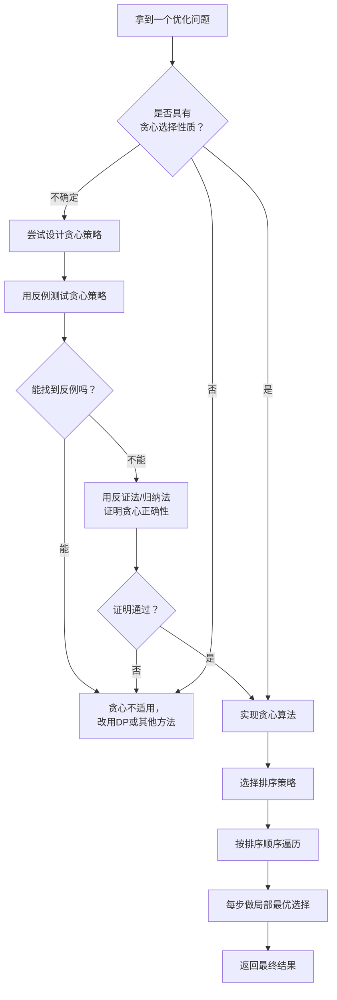

# 贪心算法

> 创建日期：2026-06-06
> 难度：⭐⭐⭐
> 前置知识：排序、堆（优先队列）、动态规划基础、数学归纳法思想

## ⭐ 面试重点速览

| 考察点 | 重要程度 | 考察频率 | 掌握目标 |
|--------|---------|---------|---------|
| 贪心选择性质的理解 | ★★★★★ | 极高 | 能准确判断问题是否具有贪心选择性质 |
| 贪心与DP的适用边界 | ★★★★★ | 极高 | 能清晰对比两者差异，对同一问题判断该用哪种 |
| 区间调度问题 | ★★★★★ | 极高 | 熟练掌握活动选择、会议室、合并区间等 |
| 贪心正确性证明（反证法/归纳法） | ★★★★ | 高 | 能用反证法证明简单贪心策略的正确性 |
| 哈夫曼编码 | ★★★ | 中 | 理解贪心构造最优前缀码的原理 |
| 跳跃游戏系列 | ★★★★ | 高 | 掌握"最远可达位置"的贪心思路 |

---

## 一、应用场景 🎯

贪心算法（Greedy Algorithm）的核心思想是：**在每一步都做出当前看起来最好的选择**，希望通过局部最优的累积达到全局最优。

### 典型应用场景

| 场景类别 | 具体问题 | 对应LeetCode题号 |
|---------|---------|-----------------|
| 区间调度 | 无重叠区间、用最少的箭引爆气球、合并区间 | 435, 452, 56 |
| 跳跃游戏 | 跳跃游戏I/II | 55, 45 |
| 分配问题 | 分发饼干、柠檬水找零、根据身高重建队列 | 455, 860, 406 |
| 股票买卖 | 买卖股票的最佳时机II | 122 |
| 数字贪心 | 移掉K位数字、单调递增的数字 | 402, 738 |
| 图论贪心 | 最小生成树（Prim/Kruskal）、Dijkstra最短路径 | - |
| 编码压缩 | 哈夫曼编码 | - |
| 任务调度 | 用最少数量的箭引爆气球、重构字符串 | 452, 767 |
| 加油站 | 加油站 | 134 |

### 贪心问题的识别信号

1. **"最少/最多" + "可以从局部最优推断全局最优"**：如最少箭引爆气球
2. **"每次决策独立，不依赖未来信息"**：如跳跃游戏只关心当前最远可达位置
3. **"排序后按某种顺序处理"**：很多贪心问题需要先排序
4. **"每一步选择不影响后续的选择空间"**：贪心选择的典型特征

---

## 二、核心原理 🔬

### 2.1 贪心选择性质

贪心算法能成立的两个核心条件：

**条件一：贪心选择性质（Greedy Choice Property）**
全局最优解可以通过一系列**局部最优选择**来达到。也就是说，你可以放心地做出"当前最好的选择"，而不用担心它会影响未来的决策。

**条件二：最优子结构（Optimal Substructure）**
一个最优解包含其子问题的最优解。这个概念与DP的最优子结构相同——贪心也需要这个性质。

### 2.2 贪心 vs 动态规划

这是面试中最常被问到的问题。核心区别在于**决策的本质**：

| 对比维度 | 贪心算法 | 动态规划 |
|---------|---------|---------|
| 决策方式 | 每步只做一个"当前最优"选择 | 考虑所有可能的选择，取最优 |
| 是否回头 | 不回头，一旦选择就不反悔 | 隐含地考虑所有情况（通过状态转移） |
| 时间复杂度 | 通常较低，O(n log n)或O(n) | 通常较高，O(n²)或更高 |
| 正确性保障 | 需要证明，不总是正确 | 一定正确（前提是状态定义正确） |
| 适用条件 | 需要贪心选择性质 | 需要最优子结构 + 重叠子问题 |
| 典型问题 | 活动选择、找零（特定面额） | 背包问题、编辑距离 |

### 2.3 反证法证明贪心正确性

贪心算法的正确性**不能想当然**，必须进行严格证明。最常用的方法是**反证法**：

**证明框架**：
1. 假设贪心解不是最优解
2. 设最优解为OPT，贪心解为G
3. 找到OPT与G**第一个不同的选择**
4. 证明将OPT的这个选择换成G的选择，不会使结果变差
5. 通过数学归纳法，最终将OPT完全转化为G，且结果不差
6. 因此G也是最优解

**示例：活动选择问题的反证法证明**

```
问题：有n个活动，每个活动有开始时间s[i]和结束时间f[i]。
两个活动不能同时进行。求最多能参加多少个活动。

贪心策略：每次选择结束时间最早的活动。

证明（反证法）：
1. 假设贪心策略不是最优的。
2. 设OPT是一个最优解，贪心第一个选的是活动A（结束最早）。
3. 如果OPT的第一个活动也是A，则子问题一致，归纳即可。
4. 如果OPT的第一个活动是B（f[B] >= f[A]），那么：
   - 将OPT中的B替换为A，A在B之前结束，不会与后面的活动冲突。
   - 替换后活动数量不变，仍是最优解。
5. 因此存在一个以A开头的最优解，贪心策略正确。
```

### 2.4 贪心算法流程图



---

## 三、趣味解说 🎭

### 自助餐法则：每次都拿最想吃的菜

你走进一家**高档自助餐厅**，面前摆满了琳琅满目的美食：龙虾、牛排、寿司、蛋糕、冰淇淋……

餐厅规定：**每人只能拿一个盘子，且只能拿一次（不能返回）**。你必须从入口走到出口，一路上经过每个菜品，经过时你可以选择拿或不拿，但一旦走过就不能回头。

你的目标是：**吃饱且吃好**。

**贪心策略**：你走在传送带前，看到龙虾——"哇，我最爱龙虾！"你立刻拿了一盘。看到牛排——"嗯，不错，但盘子已经满了。"你只能放弃。看到蛋糕——"还行，但不如龙虾。"

这就是贪心算法：**每一步都做当前最好的选择，不回头，不后悔**。你最终可能拿到的是龙虾，而不是"龙虾+牛排+蛋糕"的组合（DP会帮你算出来这种组合）。但贪心说：我已经尽最大努力了！

### 为什么贪心有时会失败？

同样是自助餐，但这次规则变了：

> 你有一个**可以装10个菜的盘子**，但每种菜占的格子不同。龙虾占6格（价值100），牛排占5格（价值80），寿司占5格（价值80）。

贪心选：龙虾（6格，100），还剩4格——什么都装不下。总价值100。

但最优解：牛排+寿司（5+5=10格，80+80=160）。总价值160。

**贪心栽了**！因为这道题的本质是**背包问题**——需要"权衡取舍"，而贪心只看眼前，不做全局规划。

> 贪心法则：如果能证明"吃当前最想吃的"不会影响"后面还能吃多少"，那贪心就是对的。否则，老老实实用DP。

### 另一个场景：活动安排

你是学生会主席，一天之内收到了10个社团的活动申请，每个活动有开始和结束时间。教室只有一个，同一时间只能有一个活动。你最多能安排几个活动？

**贪心策略**：每次选**结束时间最早**的活动。

为什么有效？因为结束得越早，留给后面活动的时间就越多。这个策略有一个优雅的反证法证明（见上文），面试中经常被问到。

---

## 四、代码实现 💻

### 4.1 贪心通用模板

```java
/**
 * 贪心算法通用解题模板
 */
public class GreedyTemplate {

    public int greedySolve(int[] input) {
        // 第1步：排序 —— 大多数贪心问题需要先排序
        Arrays.sort(input);  // 按某种规则排序

        // 第2步：初始化 —— 贪心选择的初始状态
        int result = 0;           // 最终答案
        int currentState = 0;     // 当前状态（如当前最远可达位置）

        // 第3步：遍历 —— 按排序顺序逐个处理
        for (int i = 0; i < input.length; i++) {
            // 第4步：贪心选择 —— 如果满足条件，就做当前最优选择
            if (/* 可以做贪心选择的条件 */) {
                result++;  // 或累加价值
                // 更新状态
                currentState = /* ... */;
            }
        }

        return result;
    }
}
```

### 4.2 活动选择 / 无重叠区间（LeetCode 435）

```java
/**
 * LeetCode 435. 无重叠区间
 * 题目：给定一个区间的集合，找到需要移除区间的最小数量，
 * 使剩余区间互不重叠。
 * 
 * 贪心策略：按结束时间升序排序，每次选择结束最早的区间
 */
public class EraseOverlapIntervals {

    public int eraseOverlapIntervals(int[][] intervals) {
        if (intervals.length == 0) return 0;

        // 第1步：按结束时间从小到大排序
        Arrays.sort(intervals, (a, b) -> a[1] - b[1]);

        int count = 1;  // 至少保留1个区间（第一个区间结束最早）
        int end = intervals[0][1];  // 当前选中区间的结束时间

        for (int i = 1; i < intervals.length; i++) {
            // 如果当前区间的开始时间 >= 上一个选中区间的结束时间
            // 说明不重叠，可以选中它
            if (intervals[i][0] >= end) {
                count++;
                end = intervals[i][1];  // 更新结束时间
            }
            // 否则，这个区间与上一个重叠，需要移除（不计入count）
        }

        // 需要移除的区间数 = 总数 - 保留的区间数
        return intervals.length - count;
    }
}
```

### 4.3 跳跃游戏II（LeetCode 45）

```java
/**
 * LeetCode 45. 跳跃游戏II
 * 题目：给定一个非负整数数组nums，你最初位于数组的第一个位置。
 * 数组中的每个元素代表你在该位置可以跳跃的最大长度。
 * 你的目标是使用最少的跳跃次数到达数组的最后一个位置。
 * 
 * 贪心策略：每次在可达范围内，选择能跳到最远位置的那一步
 */
public class JumpGameII {

    public int jump(int[] nums) {
        int n = nums.length;
        if (n <= 1) return 0;

        int jumps = 0;              // 跳跃次数
        int curEnd = 0;             // 当前这一步能到达的最远位置
        int curFarthest = 0;        // 在当前这一步的范围内，下一步能到达的最远位置

        for (int i = 0; i < n - 1; i++) {
            // 更新"再跳一步"能到达的最远位置
            curFarthest = Math.max(curFarthest, i + nums[i]);

            // 到达当前这一步的边界，必须跳了
            if (i == curEnd) {
                jumps++;
                curEnd = curFarthest;  // 更新下一步的边界

                // 如果已经能到达终点，直接返回
                if (curEnd >= n - 1) break;
            }
        }

        return jumps;
    }
}
```

### 4.4 柠檬水找零（LeetCode 860）

```java
/**
 * LeetCode 860. 柠檬水找零
 * 题目：柠檬水5元一杯，顾客排队购买，每次给5/10/20元。
 * 初始你手头没有任何零钱。问能否给每位顾客正确找零。
 * 
 * 贪心策略：找零时优先使用面额大的钞票（10元），保留5元（更灵活）
 */
public class LemonadeChange {

    public boolean lemonadeChange(int[] bills) {
        int five = 0, ten = 0;  // 手头5元和10元的数量

        for (int bill : bills) {
            if (bill == 5) {
                five++;  // 收5元，不需要找零
            } else if (bill == 10) {
                // 收10元，需要找5元
                if (five == 0) return false;  // 没有5元零钱
                five--;
                ten++;
            } else {  // bill == 20
                // 收20元，优先找10+5（贪心），其次找5+5+5
                if (ten > 0 && five > 0) {
                    ten--;   // 优先用掉10元（因为10元只能找20元）
                    five--;
                } else if (five >= 3) {
                    five -= 3;  // 没有10元，只能用3张5元
                } else {
                    return false;  // 无法找零
                }
            }
        }

        return true;
    }
}
```

### 4.5 用最少的箭引爆气球（LeetCode 452）

```java
/**
 * LeetCode 452. 用最少数量的箭引爆气球
 * 题目：气球在水平方向上分布，每个气球有一个直径范围[x_start, x_end]。
 * 一支箭从x坐标射出，可以射爆所有经过的气球。求最少需要多少支箭。
 * 
 * 贪心策略：按结束坐标排序，每次在"当前未覆盖的最早结束气球"的结束位置射箭
 */
public class MinArrows {

    public int findMinArrowShots(int[][] points) {
        if (points.length == 0) return 0;

        // 按气球结束坐标升序排序
        Arrays.sort(points, (a, b) -> Integer.compare(a[1], b[1]));

        int arrows = 1;  // 至少需要一支箭
        int arrowPos = points[0][1];  // 第一支箭射在第一个气球的结束位置

        for (int i = 1; i < points.length; i++) {
            // 如果当前气球的开始位置 > 箭的位置，说明这支箭射不到它
            if (points[i][0] > arrowPos) {
                arrows++;
                arrowPos = points[i][1];  // 新的一箭射在这个气球的结束位置
            }
            // 否则，当前箭可以射爆这个气球（开始位置 <= 箭的位置）
        }

        return arrows;
    }
}
```

---

## 五、优缺点 ⚖️

| 维度 | 优点 | 缺点 |
|-----|------|------|
| 时间复杂度 | 通常很低（O(n)或O(n log n)） | 不适用时回溯到DP的时间成本更高 |
| 空间复杂度 | 通常O(1)或O(n) | 与DP相比优势不大 |
| 实现难度 | 代码简洁，思路直观 | 正确性证明较难，容易想当然 |
| 正确性 | 有严格证明时保证最优 | 贪心策略选错会导致完全错误的结果 |
| 通用性 | 适用于区间调度、图论等经典问题 | 适用范围远不如DP广泛 |
| 面试友好度 | 面试官喜欢考察"为什么贪心是对的" | 很多候选人在证明环节卡壳 |

### 贪心 vs DP：何时用哪个？

| 判断标准 | 用贪心 | 用DP |
|---------|-------|------|
| 当前选择是否影响后续选择？ | 不影响 | 影响 |
| 是否需要"回退"或"后悔"？ | 不需要 | 需要（隐性考虑所有情况） |
| 能否用反例否定贪心？ | 找不到反例 | 能找到反例 |
| 时间复杂度要求 | 数据规模大，需要O(n log n) | 数据规模小，O(n²)可以接受 |
| 经验法则 | "排序后直接选" | "存储所有子问题结果" |

---

## 六、面试高频题 📝

### 6.1 必刷题单

| 题号 | 题目 | 难度 | 核心考点 | 推荐指数 |
|------|------|------|---------|---------|
| 455 | 分发饼干 | ⭐ | 贪心入门，排序+双指针 | ★★★★★ |
| 55 | 跳跃游戏 | ⭐⭐ | 最远可达位置 | ★★★★★ |
| 45 | 跳跃游戏II | ⭐⭐ | 贪心求最少跳跃次数 | ★★★★★ |
| 122 | 买卖股票的最佳时机II | ⭐⭐ | 每天贪心，累加正利润 | ★★★★★ |
| 435 | 无重叠区间 | ⭐⭐ | 区间调度经典题 | ★★★★★ |
| 452 | 用最少数量的箭引爆气球 | ⭐⭐ | 区间调度变体 | ★★★★★ |
| 56 | 合并区间 | ⭐⭐ | 排序后合并 | ★★★★★ |
| 860 | 柠檬水找零 | ⭐ | 找零贪心策略 | ★★★★ |
| 406 | 根据身高重建队列 | ⭐⭐ | 二维排序+贪心插入 | ★★★★ |
| 402 | 移掉K位数字 | ⭐⭐ | 单调栈+贪心 | ★★★★ |
| 134 | 加油站 | ⭐⭐ | 贪心思路较难想到 | ★★★★ |
| 738 | 单调递增的数字 | ⭐⭐ | 数字贪心 | ★★★ |
| 767 | 重构字符串 | ⭐⭐ | 最大堆+贪心 | ★★★ |
| 621 | 任务调度器 | ⭐⭐ | 桶思想+贪心 | ★★★★ |

### 6.2 高频面试问法

1. **"什么是贪心算法？它和动态规划有什么区别？"**
   - 回答要点：贪心每步只做当前最优选择，不回头；DP考虑所有可能选择。面试中结合具体例子（如背包问题）说明。

2. **"如何证明一个贪心策略是正确的？"**
   - 回答要点：反证法（假设贪心不是最优，推出矛盾）或数学归纳法（证明每一步贪心选择后，剩余问题仍具有最优子结构）。

3. **"贪心算法在什么情况下会失效？举一个例子。"**
   - 回答要点：经典反例——0-1背包问题。贪心选单位价值最高的物品不一定得到最优解。

4. **"为什么活动选择问题用贪心而不用DP？"**
   - 回答要点：因为活动选择具有贪心选择性质（选结束最早的活动不会影响后续决策），DP虽然也能解但O(n²)不如贪心的O(n log n)高效。

---

## 七、常见误区 ❌

### 误区1：贪心就是"显然的直觉"
**错误认知**：贪心算法就是凭直觉选择一个"看起来对的"策略，不需要证明。

**正确理解**：直觉经常骗人。0-1背包中"选单位价值最高的"是直觉，但它是错的。**所有贪心策略都必须经过严格证明或充分的反例测试**。面试中，面试官最想听到的是你的证明思路，而不是"我觉得这样做对"。

### 误区2：贪心一定比DP简单
**错误认知**：贪心算法代码短，所以比DP简单。

**正确理解**：代码短不等于简单。贪心的难点在于**设计贪心策略**和**证明其正确性**，这往往比套DP模板更难。DP有固定的四步法框架，贪心没有。

### 误区3：混淆不同贪心策略的适用范围
**错误认知**：区间问题都按结束时间排序就行。

**正确理解**：不同的区间问题可能需要不同的排序策略：
- 无重叠区间（求最多保留几个）：按**结束时间**排序
- 合并区间：按**开始时间**排序
- 会议室问题：按**开始时间**排序，用最小堆维护结束时间

### 误区4：贪心不能解决就放弃
**错误认知**：贪心不适用，这个问题就无解了。

**正确理解**：贪心不能解决的问题，往往可以用DP、回溯、网络流等方法解决。贪心只是工具箱中的一种工具，不是全部。

### 误区5：跳跃游戏的贪心不够"贪心"
**错误认知**：跳跃游戏II的贪心解法"维护最远可达位置"看起来不像贪心。

**正确理解**：跳跃游戏II的贪心体现在：每次在当前可达范围内，选择能让我们下一步跳得最远的那一步。这确实是贪心——在当前可选范围内做最优选择。只是这个贪心策略的表述比较抽象。

---

> **学习建议**：贪心算法是面试中**性价比最高**的题型之一——代码量少，但考查思维深度。建议按照"排序 → 遍历 → 贪心选择"的框架练习，每做完一道题都尝试用反证法在脑中证明一遍。记住：贪心的敌人是"想当然"，一定要用反例去检验你的直觉。