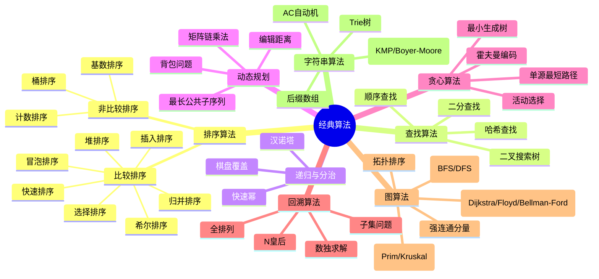
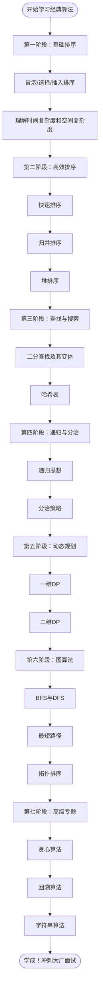

# 经典算法概览

> 创建日期：2026-06-06
> 难度：⭐⭐⭐
> 前置知识：基本数据结构（数组、链表、栈、队列、树）

---

## ⭐ 面试重点速览

| 考察点 | 重要程度 | 考察频率 | 掌握目标 |
|--------|---------|---------|---------|
| 排序算法 | ★★★★★ | 极高（90%+） | 能手写快排、归并、堆排 |
| 查找算法 | ★★★★★ | 极高（85%+） | 二分查找及其变体，哈希查找 |
| 递归与分治 | ★★★★☆ | 高（75%+） | 理解递归树，掌握分治思想 |
| 动态规划 | ★★★★★ | 极高（80%+） | 背包问题、最长子序列、编辑距离 |
| 贪心算法 | ★★★★☆ | 高（70%+） | 区间调度、霍夫曼编码 |
| 回溯算法 | ★★★★☆ | 高（70%+） | 排列组合、N皇后、数独 |
| 图算法 | ★★★★☆ | 中高（65%+） | BFS/DFS、最短路径、拓扑排序 |
| 字符串算法 | ★★★★☆ | 中高（60%+） | KMP、Trie树、滑动窗口 |

---

## 一、什么是经典算法？

经典算法是计算机科学中经过时间检验、被广泛认可的基础算法。它们构成了现代软件开发和大规模系统的基石。无论你是在准备技术面试，还是在设计高性能系统，深入理解这些算法都是必不可少的。

### 为什么学习经典算法？

1. **面试刚需**：国内外大厂面试必定考察算法能力
2. **思维训练**：培养计算思维和问题分解能力
3. **代码质量**：写出更高效、更优雅的代码
4. **系统设计**：高性能系统的底层依赖经典算法

---

## 二、算法分类全景图

---

## 三、经典算法对比总表

### 3.1 排序算法复杂度一览

| 算法 | 最好时间 | 平均时间 | 最坏时间 | 空间复杂度 | 稳定性 | 排序方式 |
|------|---------|---------|---------|-----------|--------|---------|
| 冒泡排序 | O(n) | O(n²) | O(n²) | O(1) | 稳定 | 内排序 |
| 选择排序 | O(n²) | O(n²) | O(n²) | O(1) | 不稳定 | 内排序 |
| 插入排序 | O(n) | O(n²) | O(n²) | O(1) | 稳定 | 内排序 |
| 希尔排序 | O(n log n) | O(n log² n) | O(n²) | O(1) | 不稳定 | 内排序 |
| 快速排序 | O(n log n) | O(n log n) | O(n²) | O(log n) | 不稳定 | 内排序 |
| 归并排序 | O(n log n) | O(n log n) | O(n log n) | O(n) | 稳定 | 外排序 |
| 堆排序 | O(n log n) | O(n log n) | O(n log n) | O(1) | 不稳定 | 内排序 |
| 计数排序 | O(n+k) | O(n+k) | O(n+k) | O(k) | 稳定 | 外排序 |
| 基数排序 | O(nk) | O(nk) | O(nk) | O(n+k) | 稳定 | 外排序 |
| 桶排序 | O(n+k) | O(n+k) | O(n²) | O(n+k) | 稳定 | 外排序 |

### 3.2 图算法对比

| 算法 | 时间复杂度 | 适用场景 | 限制条件 |
|------|-----------|---------|---------|
| BFS | O(V+E) | 无权图最短路径 | - |
| DFS | O(V+E) | 连通性、拓扑排序、环检测 | - |
| Dijkstra | O((V+E)log V) | 非负权单源最短路径 | 不能有负权边 |
| Bellman-Ford | O(VE) | 含负权边的最短路径 | 不能有负权环 |
| Floyd-Warshall | O(V³) | 全源最短路径 | - |
| Prim | O((V+E)log V) | 稠密图最小生成树 | - |
| Kruskal | O(E log E) | 稀疏图最小生成树 | - |

### 3.3 动态规划经典问题对比

| 问题 | DP类型 | 时间复杂度 | 空间复杂度 | LeetCode题号 |
|------|--------|-----------|-----------|-------------|
| 斐波那契数列 | 一维DP | O(n) | O(1) | 509 |
| 爬楼梯 | 一维DP | O(n) | O(1) | 70 |
| 打家劫舍 | 一维DP | O(n) | O(1) | 198 |
| 最长递增子序列 | 一维DP | O(n²) / O(n log n) | O(n) | 300 |
| 最长公共子序列 | 二维DP | O(mn) | O(mn) | 1143 |
| 编辑距离 | 二维DP | O(mn) | O(mn) | 72 |
| 0-1背包 | 二维DP | O(nW) | O(W) | - |
| 完全背包 | 二维DP | O(nW) | O(W) | 322 |

---

## 四、学习路径推荐

### 各阶段详细说明

**第一阶段：基础排序（约1周）**
- 目标：理解排序思想，建立复杂度分析直觉
- 重点：冒泡排序、选择排序、插入排序
- 练习：LeetCode 912（排序数组）

**第二阶段：高效排序（约1周）**
- 目标：掌握 O(n log n) 排序算法
- 重点：快速排序（考查最多）、归并排序、堆排序
- 练习：LeetCode 215（数组中的第K个最大元素）、LeetCode 347（前K个高频元素）

**第三阶段：查找与搜索（约1周）**
- 目标：掌握二分查找的各种变体
- 重点：普通二分、边界二分、旋转数组二分
- 练习：LeetCode 704、35、34、33、153

**第四阶段：递归与分治（约1周）**
- 目标：建立递归思维模型
- 重点：递归三要素、分治三步走、递归树分析
- 练习：LeetCode 50（Pow(x,n)）、LeetCode 169（多数元素）

**第五阶段：动态规划（约2-3周）**
- 目标：掌握DP的思考方式和解题模板
- 重点：状态定义、状态转移方程、初始条件
- 练习：LeetCode 70、198、300、1143、72

**第六阶段：图算法（约2周）**
- 目标：掌握图的遍历和经典算法
- 重点：BFS/DFS模板、Dijkstra、拓扑排序
- 练习：LeetCode 200（岛屿数量）、LeetCode 207（课程表）

**第七阶段：高级专题（约2周）**
- 目标：掌握贪心、回溯、字符串专项
- 重点：回溯模板、贪心证明、KMP算法
- 练习：LeetCode 46（全排列）、LeetCode 51（N皇后）、LeetCode 28（实现strStr）

---

## 五、刷题策略

### 5.1 核心原则

1. **按专题刷**：同一类型连续刷10-20道，形成肌肉记忆
2. **先理解后记忆**：理解算法本质，而非死记硬背代码
3. **反复练习**：每道题至少做3遍（初做、复习、默写）
4. **注重边界**：空输入、单元素、重复元素、极限数据

### 5.2 推荐的刷题顺序（按专题）

| 序号 | 专题 | 必刷题数 | 建议天数 |
|------|------|---------|---------|
| 1 | 数组与链表 | 20题 | 5天 |
| 2 | 栈与队列 | 15题 | 4天 |
| 3 | 哈希表 | 10题 | 3天 |
| 4 | 二叉树 | 20题 | 5天 |
| 5 | 排序算法 | 15题 | 4天 |
| 6 | 二分查找 | 12题 | 3天 |
| 7 | 动态规划 | 30题 | 10天 |
| 8 | 图算法 | 15题 | 5天 |
| 9 | 回溯算法 | 12题 | 4天 |
| 10 | 贪心算法 | 10题 | 3天 |
| 11 | 字符串 | 12题 | 4天 |
| 12 | 位运算 | 8题 | 2天 |

---

## 六、常见误区与正确认知

### 误区一：算法题刷得越多越好

**真相**：质量远大于数量。与其囫囵吞枣刷500题，不如把经典200题吃透，做到能闭眼写出最优解。

### 误区二：背模板就能应付面试

**真相**：面试官会追问变形题和边界条件。如果只背模板不理解原理，稍微变形就会卡壳。关键要理解算法的**核心思想**和**适用场景**。

### 误区三：只关注时间复杂度，忽略空间复杂度

**真相**：大厂面试越来越重视空间优化，常常会追问"能否用O(1)空间完成"。比如快速排序的递归栈空间、DP的状态压缩，都是高频追问点。

### 误区四：忽视算法的稳定性

**真相**：在需要多关键字排序的场景（如先按成绩排，再按学号排），稳定性至关重要。很多场景要求稳定排序。

### 误区五：只练LeetCode，不看基础知识

**真相**：基础知识是根基。比如不理解堆的数据结构，就写不出堆排序；不理解递归的本质，就看不懂归并排序。

---

## 七、推荐资源

### 书籍
- 《算法导论》（CLRS）—— 算法圣经，适合深入研读
- 《算法（第4版）》（Sedgewick）—— 配有丰富的可视化插图
- 《剑指Offer》—— 面试导向，题目精选
- 《程序员代码面试指南》（左程云）—— 中文社区口碑之作

### 在线资源
- LeetCode —— 刷题首选平台
- VisuAlgo —— 算法可视化学习
- AlgoExpert —— 体系化算法课程
- 力扣中国 —— 中文题目和题解

### 本Wiki相关页面
- [排序算法全景对比](./sorting/index.md)
- [冒泡排序](./sorting/bubble-sort.md)
- [快速排序](./sorting/quick-sort.md)
- [归并排序](./sorting/merge-sort.md)
- [堆排序](./sorting/heap-sort.md)

---

> **最后的话**：算法学习没有捷径，但有方法。按专题系统学习、理解原理、反复练习，每个人都能掌握经典算法。坚持下去，你一定能拿到心仪的Offer！