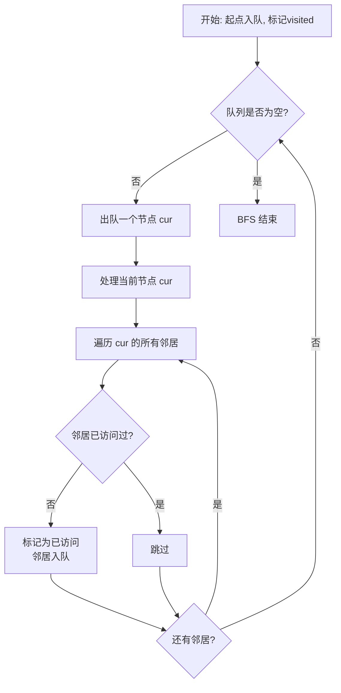
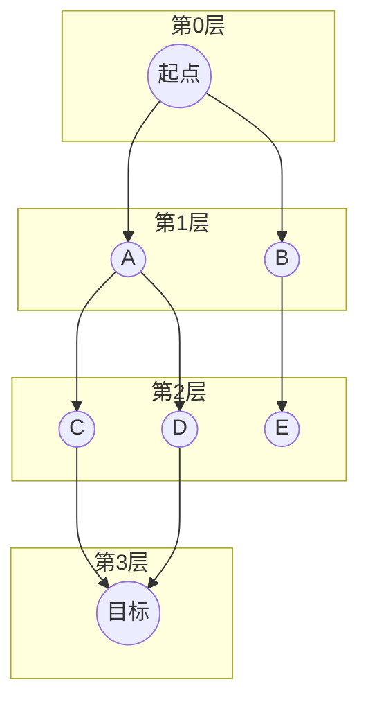

# BFS 广度优先搜索
> 创建日期：2026-06-06
> 难度：⭐⭐⭐
> 前置知识：队列、图的基本概念、二叉树的层序遍历

## ⭐ 面试重点速览

| 考察点 | 重要程度 | 考察频率 | 掌握目标 |
|--------|---------|---------|---------|
| BFS基础模板（队列） | ★★★★★ | 极高（85%+） | 能默写完整模板，秒出代码 |
| BFS求最短路径 | ★★★★★ | 极高（70%+） | 理解BFS天然最短的原理 |
| 多源BFS | ★★★★☆ | 高（50%+） | 掌握多起点同时入队的技巧 |
| 双向BFS | ★★★☆☆ | 中（30%+） | 了解优化思路，能写出基本框架 |
| BFS与DFS的选择 | ★★★★★ | 极高（65%+） | 看到题目能快速判断用哪个 |

---

## 一、应用场景 🎯

BFS 的核心特点是**逐层扩散**，凡是需要"一步一步走"、"按层处理"、"找最短路径"的问题，都可以优先考虑 BFS：

| 场景分类 | 具体场景 | 对应LeetCode |
|----------|---------|-------------|
| **树的层序遍历** | 按层输出二叉树节点 | #102, #103, #107 |
| **无权图最短路径** | 从起点到终点的最短步数 | #127, #433, #752 |
| **连通分量** | 岛屿数量、被围绕的区域 | #200, #130 |
| **扩散问题** | 腐烂的橘子、01矩阵 | #994, #542 |
| **状态转移** | 打开转盘锁、滑动谜题 | #752, #773 |
| **拓扑排序辅助** | 课程表问题中的入度BFS | #207, #210 |

---

## 二、核心原理 🔬

### 2.1 基本思想

BFS 的核心是**"先近后远，层层递进"**。它使用一个队列来维护"待访问的节点"，每次从队列头部取出一个节点，将其所有未访问的邻居加入队列尾部。



### 2.2 为什么 BFS 能找到最短路径？

BFS 按层遍历的特性天然保证了**第一次访问到某个节点时，所用的步数就是最短步数**。因为：

- 第 0 层：起点（距离 0）
- 第 1 层：距离起点 1 步的所有节点
- 第 2 层：距离起点 2 步的所有节点
- ...

当 BFS 第一次到达目标节点时，它一定处于某层 k，即距离起点 k 步。由于 BFS 是逐层扩散的，不可能存在更短的路径（如果有，目标节点早就出现在更早的层了）。



### 2.3 多源 BFS

多源 BFS 是 BFS 的一个高级技巧：**将所有起点同时入队**，然后一起扩散。这相当于在图中加入一个虚拟的"超级源点"连接到所有起点。

应用场景：腐烂的橘子（#994）、01矩阵（#542）、太平洋大西洋水流问题（#417）。

---

## 三、趣味解说 🎭

> 朋友圈的扩散：你发了一条朋友圈，谁最先看到？谁最后看到？

想象你的微信朋友圈是一个巨大的社交网络。你发了一条动态：

- **第 0 分钟**：你自己看到（起点）
- **第 1 分钟**：你的直接好友（一度人脉）看到 —— 这是 BFS 的第 1 层
- **第 2 分钟**：你好友的好友（二度人脉）看到 —— 这是 BFS 的第 2 层
- **第 3 分钟**：三度人脉看到 —— 第 3 层
- ...

这就是典型的 BFS 扩散过程！每条动态就像从你这里扔出去的一颗石子，在社交网络的池塘里激起一圈圈涟漪，越传越远。

> 换个角度：把 BFS 想象成"传话游戏"。老师把消息传给第一排的同学，第一排传给第二排... 消息像水波一样在教室里扩散。**最先到达某个同学的那条传递路径，就是最短路径。**

### 趣味记忆口诀

```
队列一把抓，先进先出别犯傻；
一层一层往外扩，最短路径就靠它；
访问过的做标记，避免重复和死循环；
多源 BFS 一起跑，虚拟源点是个宝。
```

---

## 四、代码实现 💻

### 4.1 树的层序遍历（BFS 基础模板）

```java
/**
 * 二叉树的层序遍历 —— LeetCode #102
 * 返回按层组织的节点值列表
 */
public List<List<Integer>> levelOrder(TreeNode root) {
    List<List<Integer>> result = new ArrayList<>();
    if (root == null) {
        return result;
    }

    // BFS 核心数据结构：队列
    Queue<TreeNode> queue = new LinkedList<>();
    queue.offer(root); // 起点入队

    while (!queue.isEmpty()) {
        int levelSize = queue.size(); // 当前层的节点数（关键！）
        List<Integer> currentLevel = new ArrayList<>();

        // 一次性处理当前层的所有节点
        for (int i = 0; i < levelSize; i++) {
            TreeNode node = queue.poll(); // 出队
            currentLevel.add(node.val);   // 处理当前节点

            // 将下一层节点入队（左子节点和右子节点）
            if (node.left != null) {
                queue.offer(node.left);
            }
            if (node.right != null) {
                queue.offer(node.right);
            }
        }
        result.add(currentLevel); // 当前层处理完毕
    }
    return result;
}
```

### 4.2 图的最短路径 BFS（带步数记录）

```java
/**
 * 单词接龙 —— LeetCode #127
 * 从 beginWord 变换到 endWord 的最短变换序列长度
 * 每次只能改变一个字母，且中间单词必须在 wordList 中
 */
public int ladderLength(String beginWord, String endWord, List<String> wordList) {
    // 将 wordList 转为 HashSet，方便 O(1) 查找
    Set<String> wordSet = new HashSet<>(wordList);
    if (!wordSet.contains(endWord)) {
        return 0;
    }

    // BFS 队列，存储「当前单词」
    Queue<String> queue = new LinkedList<>();
    queue.offer(beginWord);

    // 访问标记，同时记录步数
    Map<String, Integer> visited = new HashMap<>();
    visited.put(beginWord, 1); // 起点步数为 1

    while (!queue.isEmpty()) {
        String current = queue.poll();
        int step = visited.get(current);

        // 尝试改变 current 的每一个位置的字母
        char[] chars = current.toCharArray();
        for (int i = 0; i < chars.length; i++) {
            char original = chars[i]; // 保存原始字符，便于恢复

            // 尝试替换为 a-z 中的每个字母
            for (char c = 'a'; c <= 'z'; c++) {
                if (c == original) continue;
                chars[i] = c;
                String next = new String(chars);

                // 找到终点，直接返回
                if (next.equals(endWord)) {
                    return step + 1;
                }

                // 单词在字典中且未被访问过
                if (wordSet.contains(next) && !visited.containsKey(next)) {
                    visited.put(next, step + 1);
                    queue.offer(next);
                }
            }
            chars[i] = original; // 恢复原始字符
        }
    }
    return 0; // 无法到达
}
```

### 4.3 多源 BFS

```java
/**
 * 腐烂的橘子 —— LeetCode #994
 * 多源 BFS 经典题：多个腐烂橘子同时扩散
 */
public int orangesRotting(int[][] grid) {
    int rows = grid.length;
    int cols = grid[0].length;
    Queue<int[]> queue = new LinkedList<>();
    int freshCount = 0; // 新鲜橘子计数

    // 第一遍扫描：将所有腐烂橘子入队（多源！），统计新鲜橘子
    for (int r = 0; r < rows; r++) {
        for (int c = 0; c < cols; c++) {
            if (grid[r][c] == 2) {
                queue.offer(new int[]{r, c}); // 腐烂橘子入队
            } else if (grid[r][c] == 1) {
                freshCount++; // 统计新鲜橘子
            }
        }
    }

    if (freshCount == 0) return 0; // 没有新鲜橘子，直接返回

    int minutes = 0;
    int[][] directions = {{1, 0}, {-1, 0}, {0, 1}, {0, -1}}; // 四方向

    // 多源 BFS：所有腐烂橘子同时开始扩散
    while (!queue.isEmpty()) {
        int size = queue.size();
        boolean rotted = false; // 本轮是否有橘子腐烂

        for (int i = 0; i < size; i++) {
            int[] cur = queue.poll();
            for (int[] dir : directions) {
                int nr = cur[0] + dir[0];
                int nc = cur[1] + dir[1];

                // 检查边界，且是新鲜橘子
                if (nr >= 0 && nr < rows && nc >= 0 && nc < cols
                        && grid[nr][nc] == 1) {
                    grid[nr][nc] = 2; // 腐烂
                    freshCount--;
                    queue.offer(new int[]{nr, nc});
                    rotted = true;
                }
            }
        }
        if (rotted) minutes++; // 如果本轮有腐烂，时间+1
    }

    return freshCount == 0 ? minutes : -1; // 有新鲜橘子剩余说明无法全部腐烂
}
```

### 4.4 BFS 通用模板（图）

```java
/**
 * BFS 图遍历通用模板
 * @param graph 邻接表表示的图
 * @param start 起始节点
 */
public void bfsTemplate(Map<Integer, List<Integer>> graph, int start) {
    Queue<Integer> queue = new LinkedList<>();
    Set<Integer> visited = new HashSet<>(); // 访问标记（防环、防重复）

    queue.offer(start);
    visited.add(start); // 入队时立即标记，防止重复入队

    int step = 0; // 步数/层数（可选）

    while (!queue.isEmpty()) {
        int size = queue.size(); // 当前层大小

        for (int i = 0; i < size; i++) {
            int cur = queue.poll();

            // ====== 处理当前节点 ======
            // 在这里添加你的业务逻辑

            // ====== 扩散邻居 ======
            for (int neighbor : graph.getOrDefault(cur, Collections.emptyList())) {
                if (!visited.contains(neighbor)) {
                    visited.add(neighbor); // 入队即标记！
                    queue.offer(neighbor);
                }
            }
        }
        step++; // 每处理完一层，步数+1
    }
}
```

---

## 五、优缺点 ⚖️

| 优点 | 缺点 |
|------|------|
| 无权图中天然保证找到**最短路径** | 空间开销大，需要存储整层节点（O(V)） |
| 逻辑清晰，按层处理，易于理解 | 在宽图中（每层节点很多），内存可能爆炸 |
| 适合"扩散"类问题（多源BFS） | 不适合深度很大的图（不如 DFS 节省空间） |
| 避免递归深度过大导致的栈溢出 | 无法像 DFS 那样方便地记录路径和回溯 |
| 可以方便地记录"层数"和"步数" | 对于路径搜索问题，实现比 DFS 稍复杂 |

---

## 六、面试高频题 📝

### 必刷题目清单

| 题号 | 题目 | 难度 | 考察点 |
|------|------|------|--------|
| #102 | 二叉树的层序遍历 | Medium | BFS 基础模板 |
| #103 | 二叉树的锯齿形层序遍历 | Medium | BFS + 层序变体 |
| #127 | 单词接龙 | Hard | BFS 最短路径 |
| #200 | 岛屿数量 | Medium | BFS/DFS 连通分量 |
| #994 | 腐烂的橘子 | Medium | 多源 BFS |
| #542 | 01 矩阵 | Medium | 多源 BFS |
| #752 | 打开转盘锁 | Medium | BFS 状态搜索 |
| #130 | 被围绕的区域 | Medium | BFS 边界扩散 |
| #433 | 最小基因变化 | Medium | BFS 最短路径 |
| #773 | 滑动谜题 | Hard | BFS 状态转移 |

### 高频面试题解析

**LeetCode #127 —— 单词接龙（Hard）**

这是一道经典的 BFS 最短路径题。面试中常被问到：

> "如何优化？"

- **朴素 BFS**：每次遍历 wordList 找邻居，O(n * L * 26)，n 是单词数，L 是单词长度
- **双向 BFS**：从起点和终点同时 BFS，每次选择较小的队列扩展，搜索空间减半
- **虚拟节点优化**：将每个单词的每个位置替换为通配符（如 `h*t`），作为虚拟节点，减少邻居查找开销

---

## 七、常见误区 ❌

| 误区 | 错误做法 | 正确做法 |
|------|---------|---------|
| **忘记 visited 标记** | 不标记已访问节点 | 入队时立即标记，防止重复入队和死循环 |
| **标记时机错误** | 出队时才标记 visited | 入队时就标记，否则同一节点可能被多次入队 |
| **分层不清** | 不记录 `queue.size()`，无法区分层 | 每轮循环先记录 `int size = queue.size()` |
| **BFS/DFS 选错** | 求最短路径用 DFS | 无权图最短路径必须用 BFS |
| **多源 BFS 不会** | 用一个 for 循环逐个源点 BFS | 所有源点同时入队，一起扩散 |
| **忽略空节点** | 直接 `queue.poll()` 不判空 | 先判断 `!queue.isEmpty()` |

### 最容易出错的地方

**误区 1：visited 标记时机**

这是 BFS 中最容易犯的错误。看这段有问题的代码：

```java
// 错误示范：出队时才标记
while (!queue.isEmpty()) {
    int cur = queue.poll();
    visited.add(cur); // 太晚了！
    for (int neighbor : graph.get(cur)) {
        if (!visited.contains(neighbor)) {
            queue.offer(neighbor); // 同一节点可能被多次入队！
        }
    }
}
```

正确的做法是**入队时立即标记**：

```java
// 正确做法：入队时标记
queue.offer(start);
visited.add(start); // 立即标记！
while (!queue.isEmpty()) {
    int cur = queue.poll();
    for (int neighbor : graph.get(cur)) {
        if (!visited.contains(neighbor)) {
            visited.add(neighbor); // 入队时标记
            queue.offer(neighbor);
        }
    }
}
```

**误区 2：BFS 一定能找到最短路径？**

BFS 只在**无权图**（每条边权重相同）中保证最短路径。如果边有权重（如道路长度不同），需要 Dijkstra 算法。很多面试者会在这个点上踩坑。