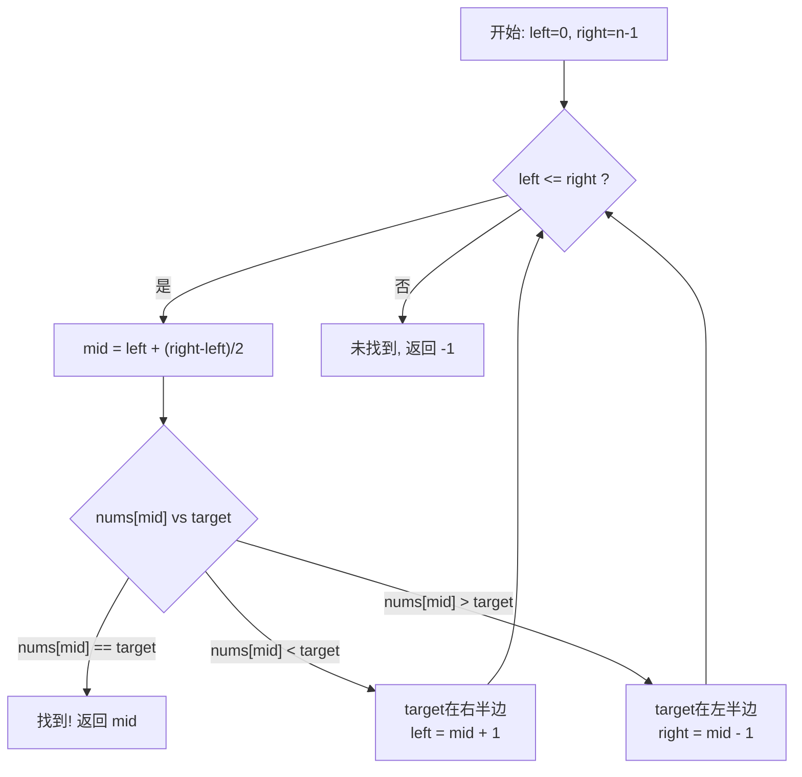
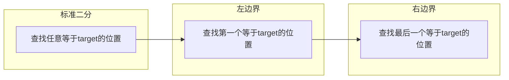

# 二分查找 (Binary Search)
> 创建日期：2026-06-06
> 难度：⭐⭐
> 前置知识：数组、循环、递归

## ⭐ 面试重点速览

| 考察点 | 重要程度 | 考察频率 | 掌握目标 |
|--------|---------|---------|---------|
| 标准二分查找模板 | ★★★★★ | 极高（90%+） | 闭着眼写出无bug代码 |
| 查找左边界 | ★★★★★ | 极高（70%+） | 理解收缩方向，掌握返回值的含义 |
| 查找右边界 | ★★★★☆ | 高（60%+） | 理解与左边界的对称关系 |
| 旋转数组二分 | ★★★★☆ | 高（55%+） | 掌握分段判断技巧 |
| 二分答案（值域二分） | ★★★★☆ | 高（50%+） | 将最优化问题转化为判定问题 |

---

## 一、应用场景 🎯

二分查找绝非只是"在有序数组里找一个数"这么简单，它的应用场景远比想象中广泛：

| 场景分类 | 具体场景 | 对应LeetCode |
|----------|---------|-------------|
| **精确查找** | 在有序数组中查找目标值 | #704 |
| **边界查找** | 查找第一个/最后一个等于target的位置 | #34 |
| **插入位置** | 查找目标值的插入位置 | #35 |
| **旋转数组** | 在旋转排序数组中查找 | #33, #153, #154 |
| **二维二分** | 在行列有序的矩阵中查找 | #74, #240 |
| **二分答案** | 求平方根、最小最大值问题 | #69, #410, #875 |
| **峰值查找** | 寻找峰值元素 | #162 |
| **两个有序数组** | 寻找两个有序数组的中位数 | #4 |

---

## 二、核心原理 🔬

### 2.1 基本思想

二分查找的核心在于**减治思想**：每次比较中间元素，排除掉一半不可能存在答案的区域。



### 2.2 关键细节剖析

**1. mid 的计算：`mid = left + (right - left) / 2`**

为什么不写成 `(left + right) / 2`？因为当 `left` 和 `right` 都很大时，`left + right` 可能溢出 `int` 范围。用 `left + (right - left) / 2` 可以避免溢出。还可以写成 `left + (right - left) >> 1`。

**2. 区间定义是核心**

二分查找的所有变体差异，本质上都来源于"搜索区间的定义"：

| 区间定义 | 初始化 | 循环条件 | 缩小区间 |
|---------|--------|---------|---------|
| `[left, right]` 闭区间 | `left=0, right=n-1` | `left <= right` | `left=mid+1` / `right=mid-1` |
| `[left, right)` 左闭右开 | `left=0, right=n` | `left < right` | `left=mid+1` / `right=mid` |

### 2.3 三种变体对比



三种变体的核心差异在于找到 target 后的行为：
- **标准二分**：直接返回
- **左边界**：继续向左收缩 `right = mid - 1`
- **右边界**：继续向右收缩 `left = mid + 1`

---

## 三、趣味解说 🎭

> 想象你和小明在玩一个猜数字游戏：你心里想一个 1 到 100 之间的数字，小明来猜。每次你只告诉他"大了"或"小了"。小明最多需要猜几次？

### 第一回合：线性思维

最笨的办法是从 1 问到 100，最坏要猜 100 次。小明翻了翻白眼："我又不是傻子。"

### 第二回合：二分思维

聪明的做法是：**每次都猜中间数**。

```
范围 [1, 100]，猜 50  → "小了" → 排除 1-50，剩 51-100
范围 [51, 100]，猜 75 → "大了" → 排除 76-100，剩 51-74
范围 [51, 74]，猜 62  → "小了" → 排除 51-62，剩 63-74
范围 [63, 74]，猜 68  → "大了" → 排除 69-74，剩 63-67
范围 [63, 67]，猜 65  → "小了" → 排除 63-65，剩 66-67
范围 [66, 67]，猜 66  → "对了!"
```

最多需要 **log2(100) = 7次**。即使范围扩大到 10 亿，也只需要约 30 次 -- 这就是对数级增长的威力！

> 换个角度理解：在 100 万条数据中用二分查找，相当于把一本《新华字典》从中间翻开，看目标字在前半本还是后半本，然后把不要的那半本直接扔掉。重复这个动作，30 次以内必然找到目标。

### 趣味记忆口诀

```
左右指针两边夹，中间元素来比较；
小了就往右边跑，大了就向左边靠；
相等就把结果交，找不到就返回 -1 了。
```

---

## 四、代码实现 💻

### 4.1 标准二分查找（迭代版）

```java
/**
 * 标准二分查找 —— 在有序数组中查找目标值
 * @param nums 升序排列的整数数组
 * @param target 要查找的目标值
 * @return 目标值的索引，未找到返回 -1
 */
public int binarySearch(int[] nums, int target) {
    // 搜索区间：[left, right] —— 闭区间定义
    int left = 0;
    int right = nums.length - 1;

    while (left <= right) { // 闭区间：left==right 时区间仍有一个元素
        // 防止溢出的中位计算方式
        int mid = left + (right - left) / 2;

        if (nums[mid] == target) {
            return mid; // 命中，直接返回
        } else if (nums[mid] < target) {
            // 目标在右半区，收缩左边界
            left = mid + 1;
        } else {
            // 目标在左半区，收缩右边界
            right = mid - 1;
        }
    }
    return -1; // 搜索区间为空，未找到
}
```

### 4.2 查找左边界（第一个等于target的位置）

```java
/**
 * 二分查找左边界 —— 查找第一个等于 target 的索引
 * 场景：nums = [1,2,2,2,3]，target = 2，返回 1（第一个2的位置）
 */
public int searchLeftBound(int[] nums, int target) {
    int left = 0;
    int right = nums.length - 1;

    while (left <= right) {
        int mid = left + (right - left) / 2;

        if (nums[mid] == target) {
            // 找到了，但不急着返回 —— 继续向左搜索，看看还有没有更早出现的
            right = mid - 1;
        } else if (nums[mid] < target) {
            left = mid + 1;
        } else {
            right = mid - 1;
        }
    }

    // 循环结束后，left 指向第一个 >= target 的位置
    // 需要验证是否越界且值等于 target
    if (left >= nums.length || nums[left] != target) {
        return -1;
    }
    return left;
}
```

### 4.3 查找右边界（最后一个等于target的位置）

```java
/**
 * 二分查找右边界 —— 查找最后一个等于 target 的索引
 * 场景：nums = [1,2,2,2,3]，target = 2，返回 3（最后一个2的位置）
 */
public int searchRightBound(int[] nums, int target) {
    int left = 0;
    int right = nums.length - 1;

    while (left <= right) {
        int mid = left + (right - left) / 2;

        if (nums[mid] == target) {
            // 找到了，但不急着返回 —— 继续向右搜索
            left = mid + 1;
        } else if (nums[mid] < target) {
            left = mid + 1;
        } else {
            right = mid - 1;
        }
    }

    // 循环结束后，right 指向最后一个 <= target 的位置
    if (right < 0 || nums[right] != target) {
        return -1;
    }
    return right;
}
```

### 4.4 旋转排序数组中的二分查找

```java
/**
 * 搜索旋转排序数组 —— LeetCode #33
 * 场景：nums = [4,5,6,7,0,1,2]，target = 0，返回 4
 * 核心思路：每次二分后，至少有一半是有序的
 */
public int searchRotated(int[] nums, int target) {
    int left = 0;
    int right = nums.length - 1;

    while (left <= right) {
        int mid = left + (right - left) / 2;

        if (nums[mid] == target) {
            return mid;
        }

        // 判断哪一半是有序的
        if (nums[left] <= nums[mid]) {
            // 左半部分有序
            if (nums[left] <= target && target < nums[mid]) {
                // target 落在有序的左半区
                right = mid - 1;
            } else {
                // target 落在右半区（可能无序）
                left = mid + 1;
            }
        } else {
            // 右半部分有序
            if (nums[mid] < target && target <= nums[right]) {
                // target 落在有序的右半区
                left = mid + 1;
            } else {
                // target 落在左半区（可能无序）
                right = mid - 1;
            }
        }
    }
    return -1;
}
```

---

## 五、优缺点 ⚖️

| 优点 | 缺点 |
|------|------|
| 时间复杂度 O(log n)，效率极高 | 要求数据**有序**，无序数据需先排序 |
| 空间复杂度 O(1)，不占额外内存 | 要求**随机访问**，链表无法直接使用 |
| 实现简单，代码短小精悍 | 边界条件容易写错，细节魔鬼 |
| 可扩展到多种变体问题 | 数据频繁增删时维护成本高 |
| 思路可迁移（二分答案），应用广泛 | 对于小数据量反而比线性查找慢（常数因子） |

---

## 六、面试高频题 📝

### 必刷题目清单

| 题号 | 题目 | 难度 | 考察点 |
|------|------|------|--------|
| #704 | 二分查找 | Easy | 标准二分模板 |
| #35 | 搜索插入位置 | Easy | 二分查找插入位置 |
| #34 | 在排序数组中查找元素的第一个和最后一个位置 | Medium | 左右边界二分 |
| #69 | x 的平方根 | Easy | 二分答案 |
| #33 | 搜索旋转排序数组 | Medium | 旋转数组二分 |
| #153 | 寻找旋转排序数组中的最小值 | Medium | 旋转数组变体 |
| #162 | 寻找峰值 | Medium | 二分收敛到峰值 |
| #74 | 搜索二维矩阵 | Medium | 二维映射到一维二分 |
| #4 | 寻找两个正序数组的中位数 | Hard | 二分划分思想 |
| #875 | 爱吃香蕉的珂珂 | Medium | 二分答案 |

### 高频面试题解析

**LeetCode #34 —— 在排序数组中查找第一个和最后一个位置**

面试中这道题的考察重点是**左右边界的二分变体**。面试官通常会追问：

> "能否用一次二分同时找到左右边界？"

标准做法是分别调两次二分（左边界 + 右边界），时间复杂度 O(log n)。有一种优化写法是找到 target 后向两边线性扩展，但最坏情况下（全是 target）退化为 O(n)，面试中反而不推荐。

---

## 七、常见误区 ❌

| 误区 | 错误做法 | 正确做法 |
|------|---------|---------|
| **mid 溢出** | `mid = (left + right) / 2` | `mid = left + (right - left) / 2` |
| **循环条件写错** | 闭区间用 `left < right` | 闭区间必须用 `left <= right` |
| **区间收缩错** | 闭区间用 `left = mid` | 闭区间必须 `left = mid + 1`，排除已检查的 mid |
| **返回值不校验** | 左边界二分直接返回 left | 必须检查 `left` 是否越界且 `nums[left] == target` |
| **忘记数组为空** | 直接 `nums[mid]` | 先判断 `nums == null || nums.length == 0` |
| **死循环** | 收缩区间时漏掉 mid | 确保每次循环搜索区间至少减小 1 |

### 最容易出错的地方

**误区 1：循环条件混淆**

很多人分不清什么时候用 `<=` 什么时候用 `<`。记住一条铁律：

> 如果搜索区间定义为 `[left, right]` 闭区间，用 `left <= right`；如果定义为 `[left, right)` 左闭右开，用 `left < right`。

**误区 2：返回值含义混淆**

当使用左边界二分时，`while` 结束后的 `left` 并不是 target 的索引，而是**第一个大于等于 target 的位置**。必须额外判断该位置的值是否真的等于 target。

**误区 3：旋转数组的二分**

在旋转排序数组的二分中，很多人搞不清什么时候左边有序、什么时候右边有序。记住：**比较 `nums[left]` 和 `nums[mid]` 即可判断。** 如果 `nums[left] <= nums[mid]`，左半有序；否则右半有序。