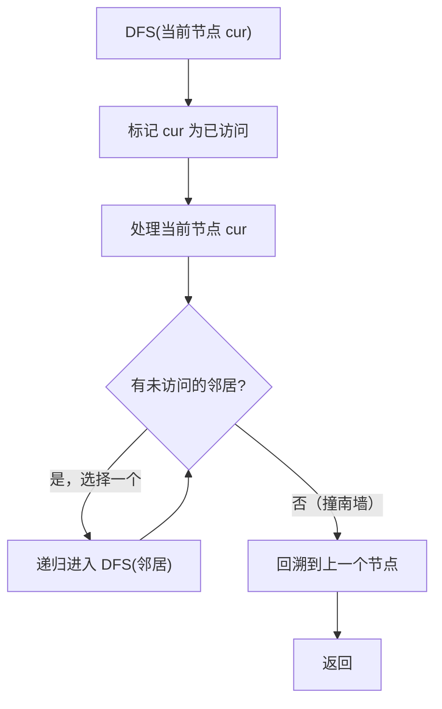
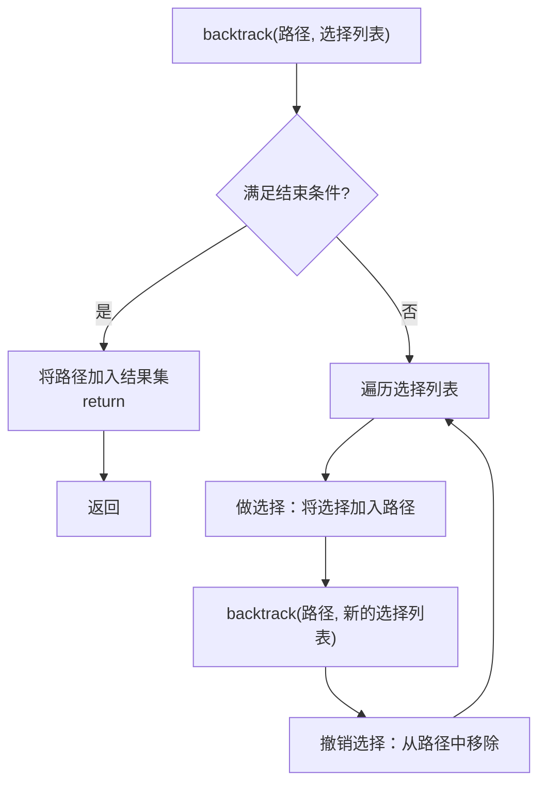
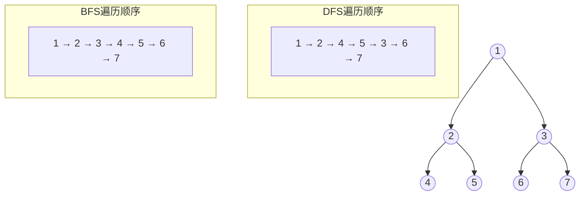

# DFS 深度优先搜索
> 创建日期：2026-06-06
> 难度：⭐⭐⭐
> 前置知识：递归、栈、回溯思想、二叉树遍历

## ⭐ 面试重点速览

| 考察点 | 重要程度 | 考察频率 | 掌握目标 |
|--------|---------|---------|---------|
| DFS递归模板 | ★★★★★ | 极高（90%+） | 熟练写出递归三要素 |
| 回溯剪枝 | ★★★★★ | 极高（75%+） | 理解"做选择-递归-撤销选择" |
| 排列组合问题 | ★★★★★ | 极高（70%+） | 能写全排列、组合、子集 |
| 岛屿/网格DFS | ★★★★★ | 极高（65%+） | 掌握四方向DFS染色 |
| 迭代DFS（栈） | ★★★☆☆ | 中（35%+） | 理解递归转迭代的方法 |

---

## 一、应用场景 🎯

DFS 最适合处理**需要穷举所有可能**或**深度探索**的问题：

| 场景分类 | 具体场景 | 对应LeetCode |
|----------|---------|-------------|
| **排列组合** | 全排列、组合、子集 | #46, #47, #77, #78, #90 |
| **回溯剪枝** | N皇后、数独、括号生成 | #51, #37, #22 |
| **网格搜索** | 岛屿数量、单词搜索、被围绕的区域 | #200, #79, #130 |
| **路径问题** | 二叉树的所有路径、路径总和 | #257, #113 |
| **分割问题** | 分割回文串、复原IP地址 | #131, #93 |
| **图连通性** | 省份数量、课程表（DFS判环） | #547, #207 |

---

## 二、核心原理 🔬

### 2.1 基本思想

DFS 的策略是**"一条路走到黑，不撞南墙不回头"**。遇到岔路口，选择一条路走到底，走不通了再退回上一个路口，换另一条路继续。



### 2.2 递归三要素

DFS 的递归实现必须包含三个核心要素：

| 要素 | 说明 | 示例 |
|------|------|------|
| **终止条件** | 何时停止递归 | 到达叶子节点 / 数组越界 / 达到目标状态 |
| **处理当前层** | 当前节点做什么 | 添加到路径 / 标记访问 / 计算结果 |
| **递归到下一层** | 向哪个方向深入 | 遍历子节点 / 四个方向移动 / 选择下一个元素 |

### 2.3 回溯算法框架

回溯是 DFS 最核心的应用模式，标准框架如下：



### 2.4 DFS vs BFS 遍历对比



---

## 三、趣味解说 🎭

> 走迷宫：不撞南墙不回头

想象你是一个探险家，走进了一个巨大的迷宫。你手里只有一根粉笔，用来在走过的路上做标记。你的策略是：

1. 每到一个岔路口，选最左边那条路走
2. 走到死胡同（撞南墙），退回到上一个岔路口
3. 在退回的岔路口，选下一条没走过的路继续走
4. 重复直到找到出口，或者所有路都走过了

这就是 DFS！你在地上画的粉笔记号就是 `visited` 数组，你的"退回上一个岔路口"就是**回溯**。

> 另一个经典类比：**试钥匙开门**。你有一串钥匙，不知道哪把能开门。你拿起第一把试，打不开就放回去（回溯），拿第二把... 这个过程就是 DFS 的穷举搜索。

### 趣味记忆口诀

```
一条路走到黑，不撞南墙头不回；
撞了南墙退一步，换个方向继续追；
递归回溯是绝配，做过选择要撤回；
排列组合子集类，回溯模板直接怼。
```

---

## 四、代码实现 💻

### 4.1 二叉树 DFS 遍历（递归版）

```java
/**
 * 二叉树的前序遍历 —— LeetCode #144
 * 遍历顺序：根 -> 左 -> 右
 */
public List<Integer> preorderTraversal(TreeNode root) {
    List<Integer> result = new ArrayList<>();
    dfs(root, result);
    return result;
}

private void dfs(TreeNode node, List<Integer> result) {
    // 终止条件：到达空节点（撞南墙了）
    if (node == null) {
        return;
    }

    // 处理当前节点
    result.add(node.val);

    // 递归深入左子树和右子树
    dfs(node.left, result);
    dfs(node.right, result);
}
```

### 4.2 全排列（回溯经典题）

```java
/**
 * 全排列 —— LeetCode #46
 * 给定不含重复数字的数组，返回所有可能的排列
 * 输入: [1,2,3]
 * 输出: [[1,2,3],[1,3,2],[2,1,3],[2,3,1],[3,1,2],[3,2,1]]
 */
public List<List<Integer>> permute(int[] nums) {
    List<List<Integer>> result = new ArrayList<>();
    List<Integer> path = new ArrayList<>();       // 当前路径
    boolean[] used = new boolean[nums.length];    // 标记哪些数字已使用
    backtrack(nums, used, path, result);
    return result;
}

private void backtrack(int[] nums, boolean[] used,
                       List<Integer> path, List<List<Integer>> result) {
    // 终止条件：路径长度 == 数组长度，找到一个排列
    if (path.size() == nums.length) {
        result.add(new ArrayList<>(path)); // 注意：必须 new 一份副本！
        return;
    }

    // 遍历选择列表
    for (int i = 0; i < nums.length; i++) {
        if (used[i]) {
            continue; // 已经用过的数字跳过
        }

        // 做选择
        path.add(nums[i]);
        used[i] = true;

        // 递归到下一层
        backtrack(nums, used, path, result);

        // 撤销选择（回溯的核心！）
        path.remove(path.size() - 1);
        used[i] = false;
    }
}
```

### 4.3 岛屿数量（网格 DFS）

```java
/**
 * 岛屿数量 —— LeetCode #200
 * DFS 染色法：遇到陆地 '1'，DFS 将相连的陆地全部染成 '0'（水）
 */
public int numIslands(char[][] grid) {
    if (grid == null || grid.length == 0) {
        return 0;
    }

    int count = 0;
    int rows = grid.length;
    int cols = grid[0].length;

    for (int r = 0; r < rows; r++) {
        for (int c = 0; c < cols; c++) {
            if (grid[r][c] == '1') {
                count++; // 发现新岛屿
                dfs(grid, r, c); // 将整个岛屿沉没（染色）
            }
        }
    }
    return count;
}

private void dfs(char[][] grid, int r, int c) {
    // 终止条件：越界或遇到水（撞南墙）
    if (r < 0 || r >= grid.length || c < 0 || c >= grid[0].length
            || grid[r][c] == '0') {
        return;
    }

    // 将当前陆地标记为水（染色，避免重复访问）
    grid[r][c] = '0';

    // 向四个方向深入探索
    dfs(grid, r + 1, c); // 下
    dfs(grid, r - 1, c); // 上
    dfs(grid, r, c + 1); // 右
    dfs(grid, r, c - 1); // 左
}
```

### 4.4 组合问题（回溯 + 剪枝）

```java
/**
 * 组合 —— LeetCode #77
 * 给定 n 和 k，返回 [1, n] 中所有可能的 k 个数的组合
 * 输入: n=4, k=2
 * 输出: [[1,2],[1,3],[1,4],[2,3],[2,4],[3,4]]
 */
public List<List<Integer>> combine(int n, int k) {
    List<List<Integer>> result = new ArrayList<>();
    List<Integer> path = new ArrayList<>();
    backtrack(n, k, 1, path, result); // 从 1 开始
    return result;
}

private void backtrack(int n, int k, int start,
                       List<Integer> path, List<List<Integer>> result) {
    // 终止条件：已经选了 k 个数
    if (path.size() == k) {
        result.add(new ArrayList<>(path));
        return;
    }

    // 剪枝优化：如果剩余的数字不够凑齐 k 个，直接返回
    // 还需要选 k - path.size() 个，而剩余可选数字为 n - i + 1
    // 所以需要: n - i + 1 >= k - path.size()
    for (int i = start; i <= n - (k - path.size()) + 1; i++) {
        path.add(i);           // 做选择
        backtrack(n, k, i + 1, path, result); // 递归，注意 start 变为 i+1（去重）
        path.remove(path.size() - 1); // 撤销选择
    }
}
```

### 4.5 DFS 迭代版（栈实现）

```java
/**
 * DFS 迭代实现（使用显式栈替代递归）
 * 适用于递归深度过大导致栈溢出的场景
 */
public List<Integer> dfsIterative(TreeNode root) {
    List<Integer> result = new ArrayList<>();
    if (root == null) {
        return result;
    }

    Deque<TreeNode> stack = new ArrayDeque<>(); // 显式栈
    stack.push(root);

    while (!stack.isEmpty()) {
        TreeNode node = stack.pop(); // 弹出栈顶
        result.add(node.val);

        // 注意：先压右再压左，因为栈是 LIFO
        // 这样左子节点会先被处理（保持前序遍历顺序）
        if (node.right != null) {
            stack.push(node.right);
        }
        if (node.left != null) {
            stack.push(node.left);
        }
    }
    return result;
}
```

---

## 五、优缺点 ⚖️

| 优点 | 缺点 |
|------|------|
| 实现简单，递归代码优雅 | 递归深度过大可能栈溢出（StackOverflow） |
| 空间开销小（只需存储当前路径） | 不保证找到最短路径 |
| 天然支持回溯，适合穷举所有解 | 在宽图中可能陷入很深的分支，效率低 |
| 适合"路径记录"类问题 | 递归转迭代写法较复杂 |
| 可以方便地进行剪枝优化 | 对于最小步数问题不如 BFS |

---

## 六、面试高频题 📝

### 必刷题目清单

| 题号 | 题目 | 难度 | 考察点 |
|------|------|------|--------|
| #46 | 全排列 | Medium | 回溯基础 |
| #47 | 全排列 II | Medium | 回溯 + 去重 |
| #78 | 子集 | Medium | 回溯 / 迭代 |
| #90 | 子集 II | Medium | 回溯 + 去重 |
| #77 | 组合 | Medium | 回溯 + 剪枝 |
| #39 | 组合总和 | Medium | 回溯 + 可重复选 |
| #22 | 括号生成 | Medium | 回溯 + 条件剪枝 |
| #79 | 单词搜索 | Medium | 网格 DFS |
| #200 | 岛屿数量 | Medium | 网格 DFS 染色 |
| #51 | N 皇后 | Hard | 回溯 + 对角线判断 |

### 高频面试题解析

**LeetCode #46 —— 全排列**

面试官通常会从这道题开始，逐步深入：

> Q1: "数组中有重复数字怎么办？" → #47 全排列 II，需要排序 + 同层去重
> Q2: "能不能不用 used 数组？" → 可以用交换法（原地交换），但会改变原数组
> Q3: "时间复杂度是多少？" → O(n * n!)，n! 种排列，每种需要 O(n) 拷贝

**回溯问题的通用解题步骤**

1. **画递归树**：搞清楚每个节点代表什么状态
2. **找终止条件**：什么时候把结果加入答案
3. **确定选择列表**：当前节点有哪些选择
4. **是否需要剪枝**：是否存在明显无效的分支
5. **写代码**：套用"做选择-递归-撤销选择"模板

---

## 七、常见误区 ❌

| 误区 | 错误做法 | 正确做法 |
|------|---------|---------|
| **忘记撤销选择** | 回溯后不恢复状态 | 递归后必须撤销选择，恢复进入前的状态 |
| **结果列表引用问题** | `result.add(path)` | 必须 `result.add(new ArrayList<>(path))`，拷贝副本 |
| **递归终止条件遗漏** | 没有写好 base case | 确保递归有明确的终止条件，避免无限递归 |
| **去重逻辑混乱** | 排列/组合去重不分场景 | 排列用 used 数组，组合用 start 索引 |
| **DFS 与 BFS 混淆** | 求最短路径用 DFS | 无权图最短路径用 BFS，DFS 不保证最短 |
| **栈溢出** | 深度过大的递归不用栈 | 用显式栈迭代实现，或增大 JVM 栈大小 |

### 最容易出错的地方

**误区 1：结果列表引用问题**

这是回溯中最隐蔽的 bug：

```java
// 错误做法：path 后续会被修改，result 里存的都是同一个引用
result.add(path);

// 正确做法：拷贝一份当前 path 的快照
result.add(new ArrayList<>(path));
```

**误区 2：排列 vs 组合的去重**

- **排列问题**（如 #46）：用 `boolean[] used` 标记已使用的元素，for 循环从 0 开始
- **组合问题**（如 #77）：用 `start` 索引控制，for 循环从 `start` 开始，天然去重

```java
// 排列：for 从 0 开始，用 used 去重
for (int i = 0; i < nums.length; i++) {
    if (used[i]) continue;
    // ...
}

// 组合：for 从 start 开始，天然保证不重复
for (int i = start; i <= n; i++) {
    // ...
}
```

**误区 3：DFS 找最短路径**

很多初学者会想用 DFS 找最短路径（比如迷宫最短步数），但 DFS 不保证第一次找到的路径就是最短的。必须遍历所有路径后取最小值，时间复杂度远高于 BFS。**最短路径问题，请优先考虑 BFS。**