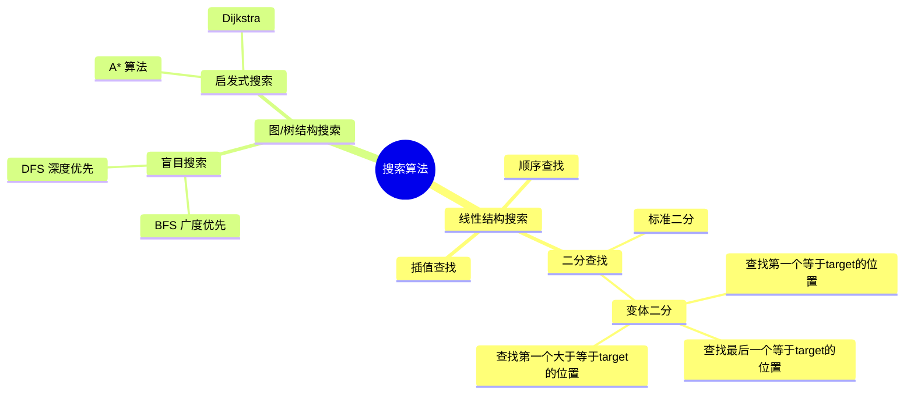
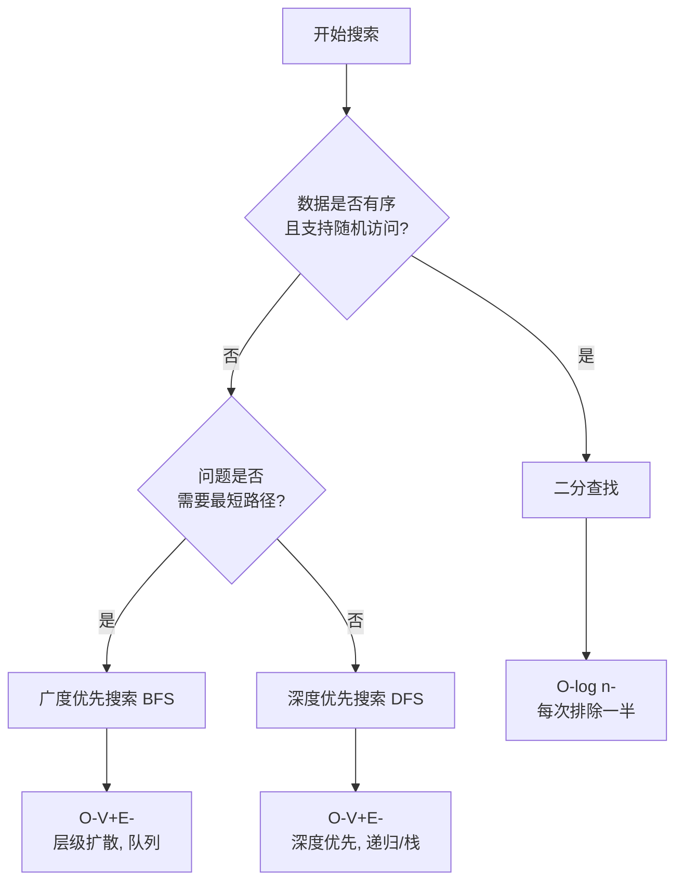
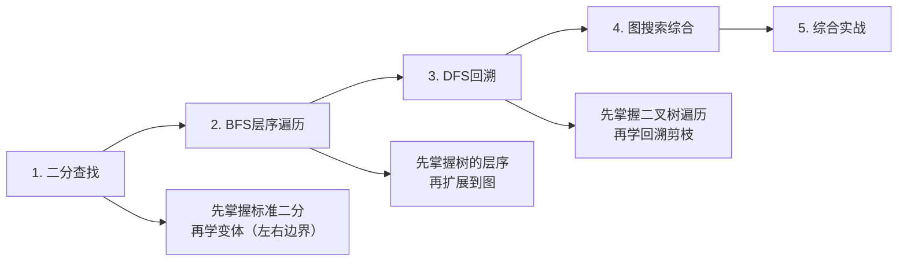

# 搜索算法全景
> 创建日期：2026-06-06
> 难度：⭐⭐
> 前置知识：数组、链表、栈、队列、递归

## ⭐ 面试重点速览

| 考察点 | 重要程度 | 考察频率 | 掌握目标 |
|--------|---------|---------|---------|
| 二分查找原理与变体 | ★★★★★ | 极高（70%+） | 能手写无bug，掌握边界处理 |
| BFS层序遍历 | ★★★★★ | 极高（60%+） | 熟练使用队列，掌握图的BFS |
| DFS回溯剪枝 | ★★★★★ | 极高（65%+） | 掌握递归/栈实现，理解剪枝策略 |
| 时间复杂度对比 | ★★★★☆ | 高（50%+） | 能准确说出各算法复杂度 |
| 适用场景判断 | ★★★★☆ | 高（45%+） | 看到题目能快速匹配算法 |

---

## 一、搜索算法全景概述 🎯

搜索算法是计算机科学中最基础的算法类别之一。它的核心问题可以概括为一句话：

> **在给定的数据集合中，找到满足特定条件的元素（或路径）。**

根据数据结构的不同，搜索被分为两大流派：

- **线性结构搜索**：在数组、链表等线性结构中查找目标值 —— 典型代表是**二分查找**
- **图/树结构搜索**：在图或树结构中探索节点之间的关系 —— 典型代表是**BFS（广度优先搜索）**和**DFS（深度优先搜索）**

---

## 二、核心算法对比 🔬

### 2.1 二分查找 (Binary Search)

| 维度 | 说明 |
|------|------|
| **核心思想** | 每次排除一半的搜索空间，每次取中间元素比较 |
| **时间复杂度** | O(log n) |
| **空间复杂度** | O(1)（迭代版）/ O(log n)（递归版，调用栈） |
| **适用场景** | 有序数组中的查找问题 |
| **前提条件** | 数据必须有序且支持随机访问 |
| **经典LeetCode** | #704, #35, #34, #69, #153, #33 |

### 2.2 BFS (广度优先搜索)

| 维度 | 说明 |
|------|------|
| **核心思想** | 层层扩散，先访问离起点近的节点，再访问远的节点 |
| **时间复杂度** | O(V + E)，V为顶点数，E为边数 |
| **空间复杂度** | O(V)，队列中最多存储一层节点 |
| **适用场景** | 最短路径、层序遍历、连通性检测 |
| **核心数据结构** | 队列（Queue） |
| **经典LeetCode** | #102, #103, #127, #200, #994, #542 |

### 2.3 DFS (深度优先搜索)

| 维度 | 说明 |
|------|------|
| **核心思想** | 一条路走到黑，不撞南墙不回头，撞了南墙再回溯 |
| **时间复杂度** | O(V + E) |
| **空间复杂度** | O(V)，递归调用栈深度 |
| **适用场景** | 路径搜索、排列组合、连通分量、拓扑排序 |
| **核心数据结构** | 栈（Stack）/ 递归 |
| **经典LeetCode** | #200, #46, #78, #79, #17, #22, #39 |

---

## 三、三剑客对比总表 ⚖️

| 对比维度 | 二分查找 | BFS | DFS |
|----------|---------|-----|-----|
| **数据结构** | 有序数组 | 队列 | 栈 / 递归调用栈 |
| **时间复杂度** | O(log n) | O(V + E) | O(V + E) |
| **空间复杂度** | O(1) | O(V) | O(V) |
| **是否需排序** | 是 | 否 | 否 |
| **能否找最短路径** | 不适用 | 能（无权图） | 不能保证 |
| **遍历顺序** | 二分跳跃 | 层层递进 | 深度深入 |
| **主要应用** | 精确查找 | 最短路径/层序 | 排列组合/回溯 |
| **核心难点** | 边界条件 | 状态标记 | 回溯与剪枝 |

---

## 四、学习方法建议

### 推荐学习路径

### 各阶段推荐题目

| 阶段 | 必做题目 | 练习重点 |
|------|---------|---------|
| **入门** | LeetCode #704 二分查找 | 标准二分模板 |
| **入门** | LeetCode #102 二叉树的层序遍历 | BFS基础模板 |
| **入门** | LeetCode #94/#144/#145 二叉树遍历 | DFS递归模板 |
| **进阶** | LeetCode #34 在排序数组中查找元素的第一个和最后一个位置 | 二分变体 |
| **进阶** | LeetCode #127 单词接龙 | BFS最短路径 |
| **进阶** | LeetCode #46 全排列 | DFS回溯 |
| **挑战** | LeetCode #4 寻找两个正序数组的中位数 | 二分高级应用 |
| **挑战** | LeetCode #200 岛屿数量 | BFS/DFS均可 |
| **挑战** | LeetCode #22 括号生成 | DFS剪枝 |

---

## 五、复杂度速查卡

| 算法 | 最好情况 | 最坏情况 | 平均情况 | 空间 | 稳定排序依赖 |
|------|---------|---------|---------|------|------------|
| 二分查找 | O(1) | O(log n) | O(log n) | O(1) | 数据预处理O(n log n) |
| BFS | O(1) | O(V + E) | O(V + E) | O(V) | 不依赖 |
| DFS | O(1) | O(V + E) | O(V + E) | O(V) | 不依赖 |

---

## 六、面试常见问题

**Q1：二分查找的循环条件为什么是 `left <= right` 而不是 `left < right`？**

A：当 `left == right` 时，搜索区间还有一个元素未被检查。使用 `left <= right` 确保检查到最后一个元素。如果使用 `left < right`，当区间缩小到单元素时就直接退出，可能漏掉正确答案。

**Q2：BFS 为什么需要使用 `visited` 标记？**

A：图中可能存在环，没有访问标记会导致死循环。此外，标记已访问节点还能避免重复入队，将时间复杂度从指数级降到线性级。

**Q3：什么时候用 BFS，什么时候用 DFS？**

A：
- 求**最短路径/最小步数**时用 BFS（无权图中BFS天然保证最短）
- 求**所有可能解/排列组合**时用 DFS（需要回溯）
- 树**按层处理**时用 BFS
- 树**深度相关问题**时用 DFS（如最大深度、路径和）

---

## 七、参考资料

- 《算法导论》第2、22章
- LeetCode 探索 - 二分查找专题
- LeetCode 探索 - 队列与BFS专题
- labuladong 的算法小抄 - 二分查找详解