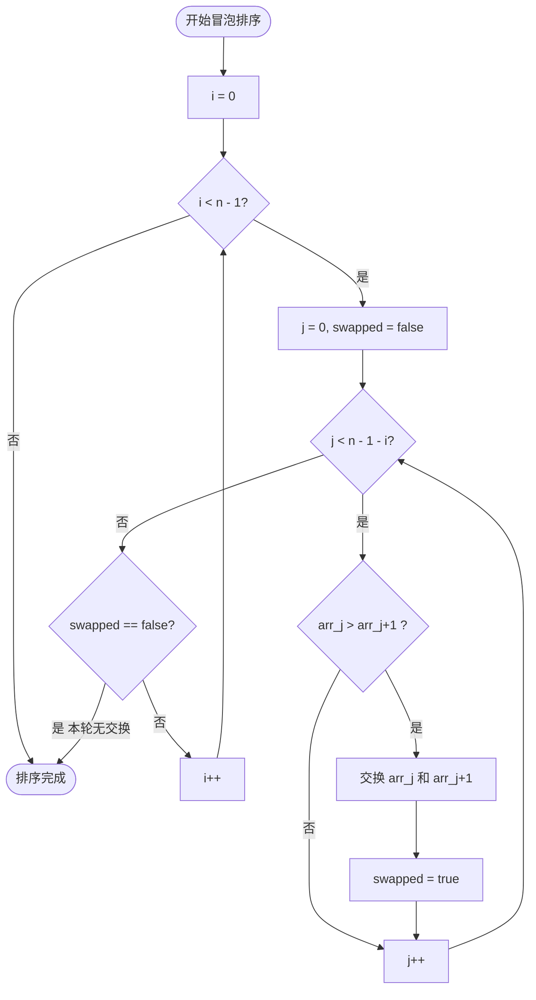

# 冒泡排序

> 创建日期：2026-06-06
> 难度：⭐
> 前置知识：数组遍历、循环嵌套

---

## ⭐ 面试重点速览

| 考察点 | 重要程度 | 考察频率 | 掌握目标 |
|--------|---------|---------|---------|
| 冒泡排序原理 | ★★★★☆ | 中（60%+） | 能口述过程并分析复杂度 |
| 优化策略 | ★★★☆☆ | 中（50%+） | 能写出带提前终止的优化版 |
| 稳定性分析 | ★★★☆☆ | 中（50%+） | 理解为什么冒泡是稳定的 |
| 手写代码 | ★★☆☆☆ | 低（30%+） | 闭眼能写，重点理解而非背诵 |

---

## 一、应用场景 🎯

冒泡排序作为 **学习排序算法的第一课**，虽然在实际工程中很少直接使用（性能太差），但它的价值在于：

| 场景 | 说明 |
|------|------|
| 教学入门 | 最直观的排序算法，新手友好，帮助建立"比较-交换"的基本概念 |
| 小型数据集 | 当 n < 20 且代码简洁性比性能更重要时 |
| 几乎有序的数组 | 结合提前终止优化后，对基本有序数据可达 O(n) |
| 嵌入式系统 | 代码体积极小，在资源受限的微控制器中有应用 |
| 理解"稳定排序" | 冒泡排序是理解排序稳定性概念的绝佳范例 |

> **现实中的"冒泡"**：考试成绩排名时，老师一般不会用冒泡排序来排成绩（太慢），但冒泡排序的思想和人类的"两两比较、交换位置"行为非常相似。

---

## 二、核心原理 🔬

### 基本思想

重复走访数组，依次比较相邻的两个元素，如果顺序错误（前大后小）就交换它们。每轮遍历后，当前未排序部分的最大元素会"冒泡"到末尾的正确位置。

### 流程动画

以数组 `[5, 3, 8, 4, 2]` 为例：

```
初始状态：[5, 3, 8, 4, 2]

第1轮（确定第5位）：
  比较 5>3 交换 → [3, 5, 8, 4, 2]
  比较 5<8 不变 → [3, 5, 8, 4, 2]
  比较 8>4 交换 → [3, 5, 4, 8, 2]
  比较 8>2 交换 → [3, 5, 4, 2, 8]  ← 8冒泡到末尾

第2轮（确定第4位）：
  比较 3<5 不变 → [3, 5, 4, 2, 8]
  比较 5>4 交换 → [3, 4, 5, 2, 8]
  比较 5>2 交换 → [3, 4, 2, 5, 8]  ← 5冒泡到位

第3轮（确定第3位）：
  比较 3<4 不变 → [3, 4, 2, 5, 8]
  比较 4>2 交换 → [3, 2, 4, 5, 8]  ← 4冒泡到位

第4轮（确定第2位）：
  比较 3>2 交换 → [2, 3, 4, 5, 8]  ← 排序完成！
```

### Mermaid流程图



### 复杂度分析

| 维度 | 最好情况 | 最坏情况 | 平均情况 |
|------|---------|---------|---------|
| 时间复杂度 | **O(n)** | **O(n²)** | **O(n²)** |
| 空间复杂度 | O(1) | O(1) | O(1) |
| 比较次数 | n-1 | n(n-1)/2 | n(n-1)/4 |
| 交换次数 | 0 | n(n-1)/2 | n(n-1)/4 |

- **最好情况** O(n)：数组已经有序，第一轮遍历无任何交换，通过 swapped 标志提前退出
- **最坏情况** O(n²)：数组完全逆序，每轮都需要最多交换
- **空间 O(1)**：只在原数组上操作，不需要任何额外存储

---

## 三、趣味解说 🎭

### 场景：气泡从水底升到水面

想象你站在一个透明的大水缸前，缸底有五个大小不同的气泡正排成一排：

```
缸底：[大气泡, 中气泡, 小气泡, 超大泡, 迷你泡]
```

现在有一股神秘的力量开始从水底向上推这些气泡。规则很简单：

1. **从最左边开始**，比较相邻两个气泡
2. **大的气泡轻，小的气泡重**（听起来反直觉，但在冒泡排序里，"大"气往上浮！）
3. 如果左边气泡比右边大，它们就**交换位置**（大气泡上浮一步）
4. 每扫描完一轮，**最大的气泡就升到最顶端**，不再参与后续比较

第一轮过后，超大泡浮到了最顶端。第二轮，大气泡浮到了第二位。第三轮，中气泡归位……

这就像锅里的水烧开后，**最大的气泡总是最先冒到水面**。每一轮扫描，都有一个气泡找到它的最终位置。

> **记忆辅助**：冒泡排序 = 水底气泡上升。每轮最大的那个浮到顶，N个气泡需要N-1轮全部浮到位。

### 优化版小剧场

聪明的气泡发现："咦，如果某轮扫描过程中我一个气泡都没动，说明大家已经排好序了呀！那我直接结束不就行了？"

这就是 `swapped` 标志的作用——当一轮遍历中没有任何交换时，提前退出循环，这就是优化版冒泡排序的**提前终止（early termination）**策略。

---

## 四、代码实现 💻

### 基础版（无优化）

```java
public class BubbleSort {

    /**
     * 基础版冒泡排序
     * 时间复杂度 O(n²)，空间复杂度 O(1)
     */
    public void bubbleSort(int[] arr) {
        int n = arr.length;
        // 外层循环：控制轮数，共需要 n-1 轮
        for (int i = 0; i < n - 1; i++) {
            // 内层循环：每轮从0开始比较到 n-1-i（已排好的末尾跳过）
            for (int j = 0; j < n - 1 - i; j++) {
                // 相邻元素比较，前大后小则交换
                if (arr[j] > arr[j + 1]) {
                    swap(arr, j, j + 1);
                }
            }
        }
    }

    /** 交换数组中两个位置的元素 */
    private void swap(int[] arr, int i, int j) {
        int temp = arr[i];
        arr[i] = arr[j];
        arr[j] = temp;
    }
}
```

### 优化版（提前终止）

```java
public class OptimizedBubbleSort {

    /**
     * 优化版冒泡排序 —— 增加提前终止标志
     * 最好情况（已有序）时间复杂度可降至 O(n)
     */
    public void bubbleSort(int[] arr) {
        int n = arr.length;
        for (int i = 0; i < n - 1; i++) {
            boolean swapped = false; // 本轮是否有交换的标志

            for (int j = 0; j < n - 1 - i; j++) {
                if (arr[j] > arr[j + 1]) {
                    swap(arr, j, j + 1);
                    swapped = true; // 发生了交换，标记为true
                }
            }

            // 如果本轮没有发生任何交换，说明数组已经完全有序
            if (!swapped) {
                break; // 提前退出，避免无意义的遍历
            }
        }
    }

    private void swap(int[] arr, int i, int j) {
        int temp = arr[i];
        arr[i] = arr[j];
        arr[j] = temp;
    }
}
```

### 再优化版（记录最后交换位置）

```java
public class FurtherOptimizedBubbleSort {

    /**
     * 进一步优化的冒泡排序
     * 记录每轮最后一次交换的位置，缩小下一轮的扫描范围
     */
    public void bubbleSort(int[] arr) {
        int n = arr.length;
        int lastSwapPos = n - 1; // 最后一次交换的位置

        for (int i = 0; i < n - 1; i++) {
            boolean swapped = false;
            int curLastSwap = 0; // 记录本轮最后交换的位置

            for (int j = 0; j < lastSwapPos; j++) {
                if (arr[j] > arr[j + 1]) {
                    swap(arr, j, j + 1);
                    swapped = true;
                    curLastSwap = j; // 更新最后交换位置
                }
            }

            if (!swapped) break;

            // 下一轮只需要扫描到本轮最后一次交换的位置
            lastSwapPos = curLastSwap;
        }
    }

    private void swap(int[] arr, int i, int j) {
        int temp = arr[i];
        arr[i] = arr[j];
        arr[j] = temp;
    }
}
```

### 测试代码

```java
public static void main(String[] args) {
    OptimizedBubbleSort sorter = new OptimizedBubbleSort();

    // 测试：普通数组
    int[] arr1 = {64, 34, 25, 12, 22, 11, 90};
    sorter.bubbleSort(arr1);
    System.out.println(Arrays.toString(arr1));
    // 输出：[11, 12, 22, 25, 34, 64, 90]

    // 测试：已有序数组（验证提前终止）
    int[] arr2 = {1, 2, 3, 4, 5};
    sorter.bubbleSort(arr2);
    System.out.println(Arrays.toString(arr2));
    // 输出：[1, 2, 3, 4, 5] —— 一轮即退出

    // 测试：完全逆序数组
    int[] arr3 = {5, 4, 3, 2, 1};
    sorter.bubbleSort(arr3);
    System.out.println(Arrays.toString(arr3));
    // 输出：[1, 2, 3, 4, 5]
}
```

---

## 五、优缺点 ⚖️

| 维度 | 评价 | 说明 |
|------|------|------|
| 时间复杂度 | ❌ 差 | 平均和最坏都是 O(n²)，数据量稍大就不可用 |
| 空间复杂度 | ✅ 极好 | O(1) 原地排序，不需要任何额外内存 |
| 稳定性 | ✅ 稳定 | 相等元素不会交换，保持原始相对顺序 |
| 代码复杂度 | ✅ 极简 | 5行核心代码，初学者也能立刻理解 |
| 缓存友好 | ✅ 好 | 顺序扫描数组，充分利用CPU缓存 |
| 提前终止 | ✅ 可优化 | 加入 swapped 标志后，有序数组 O(n) |
| 实际性能 | ❌ 很差 | 1000个元素约需50万次比较，性价比极低 |

> **一句话总结**：学习价值满分，实用价值零分。理解冒泡排序是为了理解排序思维，实战请用快排。

---

## 六、面试高频题 📝

虽然不会直接要求手写冒泡排序，但以下相关问题常被问到：

### Q1：冒泡排序是稳定的吗？为什么？

**答案**：是稳定的。因为只有当 `arr[j] > arr[j+1]`（严格大于）时才交换，相等的元素不会交换位置，所以保持了原始的相对顺序。

如果条件写成 `arr[j] >= arr[j+1]`，它就会变成不稳定的。

### Q2：如何优化冒泡排序？

**答案**：主要有两种优化方式：

| 优化方案 | 效果 |
|---------|------|
| 提前终止（swapped标志） | 最好情况降至 O(n) |
| 记录最后交换位置 | 减少内循环扫描范围 |
| 鸡尾酒排序（双向冒泡） | 同时浮大数和沉小数 |

### Q3：冒泡排序和选择排序、插入排序的区别？

| 对比维度 | 冒泡排序 | 选择排序 | 插入排序 |
|---------|---------|---------|---------|
| 核心操作 | 相邻比较交换 | 选最小值放开头 | 插入到有序前缀 |
| 交换次数 | 多（每次比较都可能交换） | 少（每轮1次） | 多（元素后移） |
| 稳定性 | 稳定 | 不稳定 | 稳定 |
| 提前终止 | 可以 | 不可以 | 可以 |

### LeetCode关联题目

| 题号 | 题目 | 关联点 |
|------|------|--------|
| 912 | 排序数组 | 冒泡只能过小数据，大数据会超时 |
| 283 | 移动零 | 类似冒泡思想，把零"浮"到末尾 |
| 75 | 颜色分类 | 可视为冒泡的拓展，但最优解是双指针 |

---

## 七、常见误区 ❌

### 误区一："冒泡排序每轮选最小的"

**纠正**：冒泡排序的经典实现是每轮把**最大的**元素"冒泡"到最后。虽然也可以反过来实现（每轮选最小），但约定俗成的理解是"大数向后浮"。

### 误区二："外层循环 i < n"

**纠正**：外层循环是 `i < n - 1`，因为 n 个元素只需要 n-1 轮就能完成排序。写成 `i < n` 虽然结果也正确（最后一轮无操作），但多了一次冗余遍历。

### 误区三："优化版就够用了"

**纠正**：即使是优化版冒泡排序，对于随机数据仍然是 O(n²)，不要在生产代码中使用冒泡排序处理大量数据。10万数据用冒泡排序需要几十秒，快速排序只需十几毫秒。

### 误区四："冒泡排序=相邻比较交换"

**纠正**：相邻比较交换是冒泡排序的必要条件但不是充分条件。奇偶排序、鸡尾酒排序也有相邻比较，但它们不是冒泡排序。冒泡排序的本质特征是：**每轮确定一个元素的最终位置**。

### 误区五："冒泡排序没有实际用途"

**纠正**：在特定场景下冒泡排序仍有价值：
- 嵌入式微控制器中，代码空间极其有限时
- 数据量极小（<20个元素）且追求代码简洁
- 需要稳定排序但内存极度受限

---

> **学完冒泡排序，你已经理解了"比较-交换"这一排序的基本原子操作。接下来，去学习更快、更强的排序算法吧！**

[返回排序算法全景对比](./index.md)