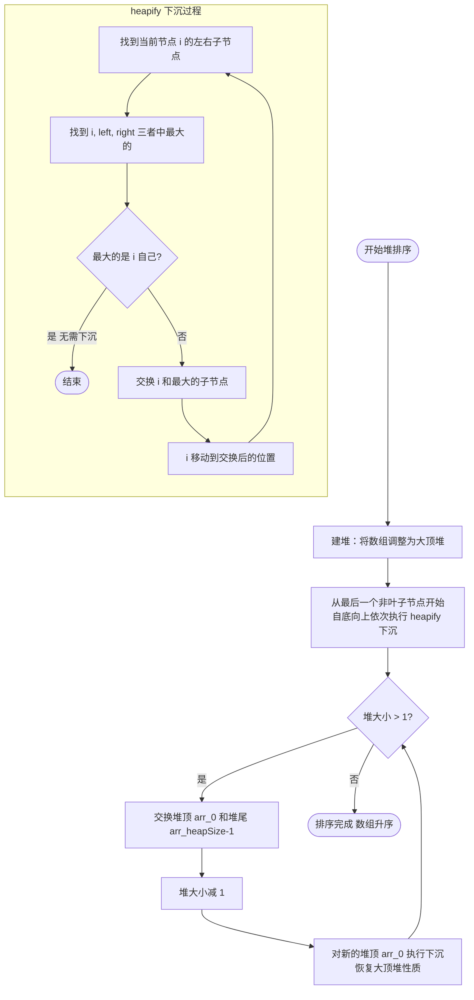

# 堆排序

> 创建日期：2026-06-06
> 难度：⭐⭐⭐
> 前置知识：完全二叉树、数组表示二叉树、优先队列概念

---

## ⭐ 面试重点速览

| 考察点 | 重要程度 | 考察频率 | 掌握目标 |
|--------|---------|---------|---------|
| 堆排序完整手写 | ★★★★☆ | 高（80%+） | 能手写建堆和排序过程 |
| 堆化（heapify） | ★★★★★ | 极高（90%+） | 理解下沉操作的原理和实现 |
| 建堆的两种方式 | ★★★★☆ | 高（80%+） | 理解自顶向下 vs 自底向上建堆 |
| 数组表示堆 | ★★★★☆ | 高（80%+） | 掌握父子节点索引公式 |
| 优先队列 | ★★★★★ | 极高（90%+） | 关联 LeetCode 215、347 |
| 堆 vs 快排选择 | ★★★★☆ | 高（75%+） | 清楚堆排的适用场景和局限 |

---

## 一、应用场景 🎯

堆排序的核心价值在于 **O(1) 空间 + O(n log n) 时间**，以及堆数据结构本身在以下场景中的广泛应用：

| 场景 | 说明 | 关联 |
|------|------|------|
| TopK 问题 | 用小顶堆维护K个最大元素，或用大顶堆维护K个最小元素 | LeetCode 215、347 |
| 优先队列 | 堆是优先队列的标准底层实现，Java 的 PriorityQueue 就是小顶堆 | 任务调度、Dijkstra 算法 |
| 数据流中位数 | 用双堆（大顶堆+小顶堆）动态维护中位数 | LeetCode 295 |
| 合并K个有序链表 | 用小顶堆每次取最小值 | LeetCode 23 |
| 定时任务调度 | 时间轮算法基于堆实现 | 操作系统、网络框架 |
| 哈夫曼编码 | 每次取两个最小频率的节点，本质是堆操作 | 数据压缩 |
| 内存极度受限 | 当没有额外空间可用时，堆排是唯一 O(n log n) 选择 | 嵌入式系统 |

> 堆排序是 O(n log n) 排序算法中**唯一空间复杂度为 O(1)** 的算法。在内存极度受限的嵌入式系统中，堆排序是唯一可行的 O(n log n) 排序方案。

---

## 二、核心原理 🔬

### 堆的定义

**堆（Heap）** 是一棵**完全二叉树**，满足堆性质：

- **大顶堆**：每个节点的值 >= 其子节点的值（根节点最大）
- **小顶堆**：每个节点的值 <= 其子节点的值（根节点最小）

### 数组表示堆

完全二叉树可以用数组紧凑存储（不需要指针），索引关系如下：

```
假设根节点索引为 0：
  父节点 i 的左子节点：2*i + 1
  父节点 i 的右子节点：2*i + 2
  子节点 i 的父节点：(i-1) / 2

数组索引：  0   1   2   3   4   5   6
           [9] [7] [5] [3] [1] [4] [2]

对应树结构：
             9(0)
           /      \
         7(1)     5(2)
        /  \      /  \
      3(3) 1(4) 4(5) 2(6)
```

### 堆排序两大步骤

**第一步：建堆（Build Heap）**
将无序数组调整为大顶堆。采用**自底向上**的方式，从最后一个非叶子节点开始，依次对每个节点执行下沉（sink/heapify）操作。

**第二步：排序（Sort）**
反复执行以下操作，直到堆的大小变为 1：
1. 将堆顶（最大值）与堆的最后一个元素交换
2. 堆的大小减 1
3. 对新的堆顶执行下沉操作，恢复堆性质

### 示例演示

以数组 `[4, 10, 3, 5, 1, 2]` 为例：

```
初始数组：[4, 10, 3, 5, 1, 2]

【建堆过程】
初始树（非堆）：
        4
      /    \
    10      3
   /  \    /
  5    1  2

从最后一个非叶子节点(索引2=3)开始下沉：
  3 下面有 2，但 3>2，不需要下沉

对索引1=10下沉：
  10 比两个子节点(5,1)都大，不需要下沉

对索引0=4下沉：
  4 和较大的子节点 10 比较，10>4，交换
        10
      /    \
     4      3
   /  \    /
  5    1  2
  4 继续下沉，和较大的子节点 5 比较，交换
        10
      /    \
     5      3
   /  \    /
  4    1  2
  建堆完成！大顶堆。

【排序过程】
第1轮：交换 10 和 2 → [2, 5, 3, 4, 1, |10]，堆大小减为5
       对 2 下沉 → [5, 4, 3, 2, 1, |10]

第2轮：交换 5 和 1 → [1, 4, 3, 2, |5, 10]，堆大小减为4
       对 1 下沉 → [4, 2, 3, 1, |5, 10]

第3轮：交换 4 和 1 → [1, 2, 3, |4, 5, 10]，堆大小减为3
       对 1 下沉 → [3, 2, 1, |4, 5, 10]

第4轮：交换 3 和 1 → [1, 2, |3, 4, 5, 10]，堆大小减为2
       对 1 下沉 → [2, 1, |3, 4, 5, 10]

第5轮：交换 2 和 1 → [1, |2, 3, 4, 5, 10]

最终结果：[1, 2, 3, 4, 5, 10] ✅
```

### Mermaid流程图



### 复杂度分析

| 维度 | 建堆 | 排序 | 总计 |
|------|------|------|------|
| 时间复杂度 | O(n) | O(n log n) | **O(n log n)** |
| 空间复杂度 | O(1) | O(1) | **O(1)** |
| 稳定性 | 不稳定 | 不稳定 | 不稳定 |

**建堆为什么是 O(n)？**

自底向上建堆时，每个节点的下沉次数与其高度成正比。底层节点数量多但高度小，高层节点数量少但高度大。数学推导可得总操作次数为 O(n)，而非直觉中的 O(n log n)。

---

## 三、趣味解说 🎭

### 场景：锦标赛淘汰赛，冠军依次出列

想象一所学校正在举办**年度最强学生大赛**。全校学生排成一棵锦标赛树（大顶堆），规则是：

**建堆阶段（选拔赛）**：
- 每个学生和他的"下属"（子节点）比试
- 如果某个学生比不过他的下属，就和下属换位置
- 从最底层的小组长开始，一层层向上比，直到全校最强的学生站到树顶（冠军）

**排序阶段（颁奖典礼）**：
1. 冠军（树顶）出列，站到领奖台（数组末尾）
2. 树底随便拉一个学生顶上冠军位置
3. 这个"替补冠军"很可能实力不够，需要和他的下属比试，一路下沉到合适的位置
4. 新的冠军诞生，再次出列
5. 重复，直到所有学生都站到领奖台上

**具体过程像这样**：

```
建堆（选拔冠军）：
  初始状态，学生乱站：
        [4号]
      /      \
   [10号]   [3号]
   /    \    /
 [5号] [1号] [2号]

  从底层开始比试：
  10号和他的"小弟"5号、1号比 → 10号最强，不用动
  3号和他的"小弟"2号比 → 3号更强，不用动
  4号和他的"小弟"10号、3号比：
    10号比4号强！交换 → 10号站到树顶（新冠军！）
    4号下沉后和5号比 → 5号更强！交换 → 4号继续下沉
    
  最终树（大顶堆）：
        [10号] ← 冠军！
      /       \
   [5号]     [3号]
   /    \    /
 [4号] [1号] [2号]

排序（颁奖典礼）：
  第1轮：冠军10号出列 → 替补2号顶上 → 2号下沉 → 5号成新冠军
  第2轮：冠军5号出列 → 替补1号顶上 → 1号下沉 → 4号成新冠军
  第3轮：冠军4号出列 → ...
  ...
```

> **核心洞察**：堆排序 = 锦标赛制度。建堆是选拔赛（选出冠军），排序是颁奖典礼（冠军依次出列，替补顶上重新选拔）。这种"冠军出列、替补顶上、重新选拔"的循环，就是堆排序的精髓。

---

## 四、代码实现 💻

### 堆排序完整实现

```java
public class HeapSort {

    /**
     * 堆排序入口
     * 时间复杂度 O(n log n)，空间复杂度 O(1)
     * 步骤：1.建堆 2.依次取堆顶（最大值）
     */
    public void heapSort(int[] arr) {
        if (arr == null || arr.length <= 1) return;
        int n = arr.length;

        // 第一步：建堆 —— 自底向上，从最后一个非叶子节点开始
        // 最后一个非叶子节点索引 = (n/2) - 1
        for (int i = (n / 2) - 1; i >= 0; i--) {
            heapify(arr, n, i); // 对每个非叶子节点执行下沉
        }

        // 第二步：排序 —— 依次将堆顶（最大值）交换到末尾
        for (int i = n - 1; i > 0; i--) {
            // 交换堆顶和当前堆的最后一个元素
            swap(arr, 0, i);

            // 堆大小减1（i 就是当前堆大小），对新的堆顶进行下沉
            heapify(arr, i, 0);
        }
    }

    /**
     * 下沉操作（大顶堆）—— 堆排序的核心！
     * 将索引 i 处的元素下沉到合适位置，维持大顶堆性质
     *
     * @param arr      数组
     * @param heapSize 当前堆的大小
     * @param i        需要下沉的节点索引
     */
    private void heapify(int[] arr, int heapSize, int i) {
        int largest = i;        // 假设当前节点是最大的
        int left = 2 * i + 1;   // 左子节点索引
        int right = 2 * i + 2;  // 右子节点索引

        // 如果左子节点存在且比当前最大值大，更新最大值索引
        if (left < heapSize && arr[left] > arr[largest]) {
            largest = left;
        }

        // 如果右子节点存在且比当前最大值大，更新最大值索引
        if (right < heapSize && arr[right] > arr[largest]) {
            largest = right;
        }

        // 如果最大值不是当前节点，需要交换并继续下沉
        if (largest != i) {
            swap(arr, i, largest);
            // 递归下沉：交换后继续检查新位置
            heapify(arr, heapSize, largest);
        }
    }

    private void swap(int[] arr, int i, int j) {
        int temp = arr[i];
        arr[i] = arr[j];
        arr[j] = temp;
    }
}
```

### 迭代版 heapify（避免递归开销）

```java
/**
 * 迭代版下沉 —— 避免递归调用栈开销
 * 在大数据量下更安全（不会栈溢出）
 */
private void heapifyIterative(int[] arr, int heapSize, int i) {
    while (true) {
        int largest = i;
        int left = 2 * i + 1;
        int right = 2 * i + 2;

        if (left < heapSize && arr[left] > arr[largest]) {
            largest = left;
        }
        if (right < heapSize && arr[right] > arr[largest]) {
            largest = right;
        }

        if (largest == i) {
            break; // 当前位置已满足堆性质，停止下沉
        }

        swap(arr, i, largest);
        i = largest; // 继续下一层
    }
}
```

### 优先队列解决 TopK（LeetCode 215）

```java
import java.util.PriorityQueue;

/**
 * 使用优先队列（小顶堆）解决 TopK 问题
 * 时间复杂度 O(n log k)，空间复杂度 O(k)
 */
public int findKthLargest(int[] nums, int k) {
    // 创建小顶堆，默认就是小顶堆（堆顶最小）
    PriorityQueue<Integer> minHeap = new PriorityQueue<>();

    for (int num : nums) {
        minHeap.offer(num); // 先加入
        if (minHeap.size() > k) {
            minHeap.poll(); // 超过k个就弹出最小的
        }
    }

    // 堆顶就是第K大的元素
    return minHeap.peek();
}
```

### 手写堆实现 TopK（不用 PriorityQueue）

```java
/**
 * 手写小顶堆解决 TopK —— 面试中建议能手写
 * 时间复杂度 O(n log k)
 */
public int findKthLargestManual(int[] nums, int k) {
    // 建一个大小为 k 的小顶堆
    int[] heap = new int[k];
    // 先用前k个元素填充堆
    for (int i = 0; i < k; i++) {
        heap[i] = nums[i];
    }
    // 建堆（小顶堆）
    buildMinHeap(heap);

    // 遍历剩余元素
    for (int i = k; i < nums.length; i++) {
        // 如果当前元素大于堆顶，替换堆顶并重新调整
        if (nums[i] > heap[0]) {
            heap[0] = nums[i];
            minHeapify(heap, k, 0); // 下沉调整
        }
    }

    return heap[0]; // 堆顶就是第K大
}

private void buildMinHeap(int[] heap) {
    for (int i = (heap.length / 2) - 1; i >= 0; i--) {
        minHeapify(heap, heap.length, i);
    }
}

private void minHeapify(int[] heap, int size, int i) {
    int smallest = i;
    int left = 2 * i + 1;
    int right = 2 * i + 2;

    if (left < size && heap[left] < heap[smallest]) {
        smallest = left;
    }
    if (right < size && heap[right] < heap[smallest]) {
        smallest = right;
    }

    if (smallest != i) {
        int temp = heap[i];
        heap[i] = heap[smallest];
        heap[smallest] = temp;
        minHeapify(heap, size, smallest);
    }
}
```

---

## 五、优缺点 ⚖️

| 维度 | 评价 | 说明 |
|------|------|------|
| 时间复杂度 | ✅ 稳定优秀 | O(n log n)，不受数据分布影响 |
| 空间复杂度 | ✅ 极好 | O(1)，唯一原地 O(n log n) 排序算法 |
| 稳定性 | ❌ 不稳定 | 堆的交换操作会破坏相等元素的相对顺序 |
| 缓存友好 | ❌ 差 | 父子节点索引跳跃大，缓存命中率低 |
| 实际速度 | 一般 | 比快排慢（常数因子更大），比归并略慢 |
| 实现难度 | ⚠️ 中等 | 需要理解完全二叉树和数组索引关系 |
| TopK 适用 | ✅ 极好 | 堆是解决 TopK 问题的最优数据结构 |

> **一句话总结**：堆排序是 O(n log n) 排序中唯一 O(1) 空间的算法，但实际速度不如快排。堆的真正价值在于优先队列和 TopK 问题，而非单纯的排序。

---

## 六、面试高频题 📝

### Q1：堆排序和快速排序如何选择？

| 场景 | 推荐 |
|------|------|
| 通用排序，追求速度 | 快速排序 |
| 内存极度受限 | 堆排序（O(1)空间） |
| 需要 TopK | 堆（不需要全排序） |
| 需要稳定排序 | 归并排序（不要用堆排） |
| 数据流实时处理 | 堆（优先队列） |

### Q2：建堆有几种方式？哪种更好？

| 方式 | 时间复杂度 | 说明 |
|------|-----------|------|
| 自顶向下（逐个插入） | O(n log n) | 每次插入后上浮，效率较低 |
| 自底向上（heapify） | **O(n)** | 从最后一个非叶子节点开始下沉，效率更高 |

**面试中必须使用自底向上建堆**，因为它是 O(n) 的，而逐个插入是 O(n log n)。

### Q3：为什么堆排序在实际中不如快排常用？

**三个原因**：
1. **缓存不友好**：堆排序中父子节点的索引跳跃大（2*i+1），频繁访问不连续内存，CPU缓存命中率低
2. **常数因子大**：即使都是 O(n log n)，堆排序的比较次数大约是快排的 2 倍
3. **不稳定**：堆排序的交换操作会破坏稳定性

### Q4：大顶堆 vs 小顶堆，TopK 问题怎么选？

| 需求 | 堆类型 | 逻辑 |
|------|--------|------|
| 求第K大 / 前K大 | **小顶堆** | 维护K个最大元素，堆顶是第K大 |
| 求第K小 / 前K小 | **大顶堆** | 维护K个最小元素，堆顶是第K小 |

**记忆口诀**：求大用小堆，求小用大堆。因为"大的"要用"小堆"过滤掉小的，"小的"要用"大堆"过滤掉大的。

### LeetCode关联题目

| 题号 | 题目 | 难度 | 关联点 |
|------|------|------|--------|
| 215 | 数组中的第K个最大元素 | 中等 | 小顶堆 / 快速选择 |
| 347 | 前K个高频元素 | 中等 | 小顶堆 |
| 295 | 数据流的中位数 | 困难 | 双堆（大顶堆+小顶堆） |
| 23 | 合并K个升序链表 | 困难 | 小顶堆 |
| 239 | 滑动窗口最大值 | 困难 | 优先队列（双端队列更优） |
| 912 | 排序数组 | 中等 | 堆排序标准应用 |
| 703 | 数据流中的第K大元素 | 简单 | 小顶堆 |
| 451 | 根据字符出现频率排序 | 中等 | 大顶堆 |

---

## 七、常见误区 ❌

### 误区一："堆排序就是优先队列排序"

**纠正**：堆排序是**原地排序**算法（O(1)空间），直接操作数组。而优先队列排序通常需要额外的 O(n) 空间来存储堆。面试中如果被问到"实现堆排序"，写 PriorityQueue 是不合格的。

### 误区二："建堆的时间复杂度是 O(n log n)"

**纠正**：自底向上建堆的时间复杂度是 **O(n)**，不是 O(n log n)。虽然直觉上"n 个元素每个下沉 O(log n)"，但数学上可以证明总操作次数是 O(n)。这个知识点经常被面试官追问。

### 误区三："堆排序和选择排序一样"

**纠正**：虽然两者都是"每次选最大/最小"，但选择排序每次需要 O(n) 扫描，堆排序利用堆性质只需 O(log n) 下沉。堆排序可以看作"用堆优化了的选择排序"。

### 误区四："堆排序不需要递归"

**纠正**：heapify 下沉操作本质上是递归的（虽然可以写成迭代形式）。堆排序算法本身不递归，但内部的下沉操作包含递归/迭代逻辑。

### 误区五："堆排序的索引从1开始"

**纠正**：代码实现中索引通常从 0 开始。如果从 1 开始，父子索引关系是 `2*i` 和 `2*i+1`；从 0 开始则是 `2*i+1` 和 `2*i+2`。面试时务必明确自己用的是哪种索引约定，避免写出错误的索引公式。

### 误区六："堆排序和快速排序空间复杂度一样"

**纠正**：堆排序是严格的 O(1) 额外空间，而快排需要 O(log n) 的递归栈空间。在极端内存受限的场景下，堆排序是唯一可行的 O(n log n) 方案。

---

> **堆排序 = 数据结构知识 + 排序知识。掌握堆排序，你不仅学会了排序，更掌握了堆这一核心数据结构，为优先队列、图算法等高级主题打下坚实基础！**

[返回排序算法全景对比](./index.md)