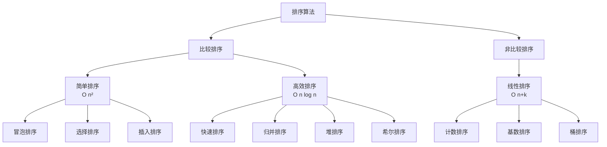
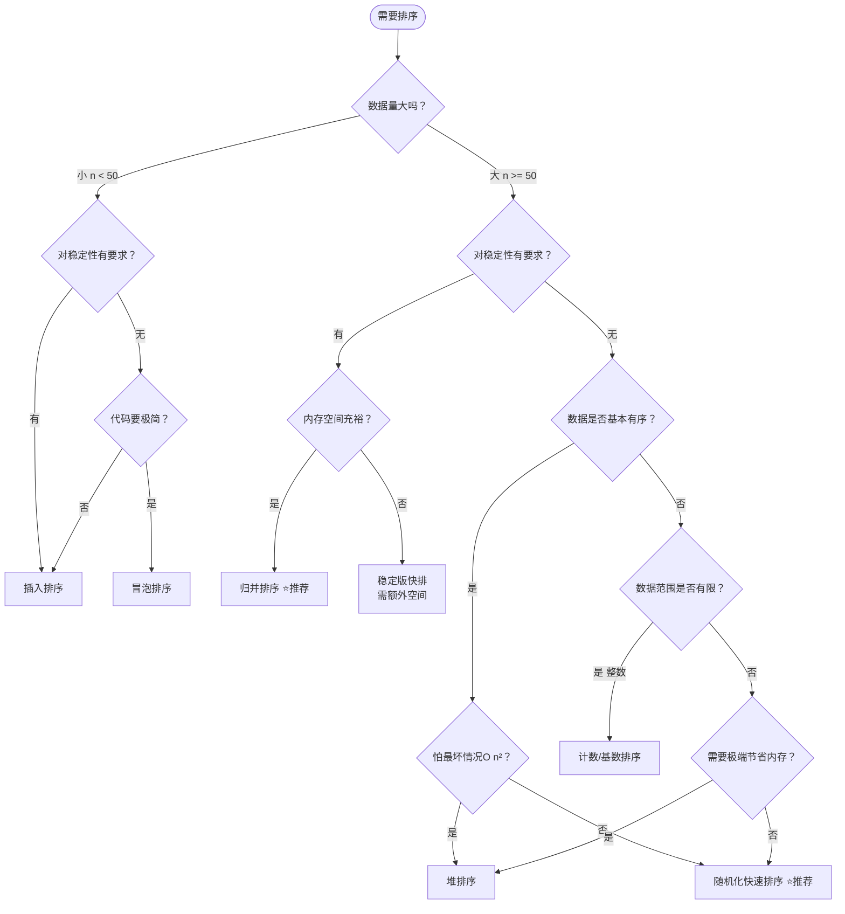

# 排序算法全景对比

> 创建日期：2026-06-06
> 难度：⭐⭐⭐
> 前置知识：数组、时间复杂度、递归

---

## ⭐ 面试重点速览

| 考察点 | 重要程度 | 考察频率 | 掌握目标 |
|--------|---------|---------|---------|
| 快速排序 | ★★★★★ | 极高（95%+） | 能手写三种partition实现，理解随机化快排 |
| 归并排序 | ★★★★★ | 极高（90%+） | 能手写递归和迭代版本，掌握分治思想 |
| 堆排序 | ★★★★☆ | 高（80%+） | 能手写堆化过程，理解堆的数据结构 |
| 冒泡/选择/插入 | ★★★☆☆ | 中（60%+） | 理解原理能口述，不要求手写 |
| 排序算法选型 | ★★★★☆ | 高（75%+） | 能根据场景选择合适的排序算法 |
| 复杂度分析 | ★★★★★ | 极高（90%+） | 准确说出各算法的时间/空间/稳定性 |

---

## 一、为什么需要排序？

排序是计算机科学中最基础也最重要的操作之一。据统计，计算机大约 **25% 的 CPU 时间**都在做排序。原因很简单：

1. **数据有序后查找更快**：二分查找 O(log n) vs 顺序查找 O(n)
2. **有序数据更符合人类阅读习惯**：排行榜、成绩表、商品列表
3. **很多算法依赖有序数据**：归并、双指针、去重
4. **排序是更复杂问题的子步骤**：第K大元素、topK、区间合并

---

## 二、排序算法分类



### 比较排序 vs 非比较排序

| 维度 | 比较排序 | 非比较排序 |
|------|---------|-----------|
| 底层原理 | 通过元素间的比较决定顺序 | 利用数据本身的分布特性 |
| 理论下界 | O(n log n) | O(n+k) |
| 适用性 | 任何可比较的数据类型 | 仅限整数或有限范围的数值 |
| 额外空间 | 通常 O(1) 或 O(log n) | 通常需要 O(n+k) 额外空间 |
| 代表算法 | 快排、归并、堆排 | 计数、基数、桶排 |

---

## 三、核心复杂度对比总表

| 算法 | 最好时间 | 平均时间 | 最坏时间 | 空间 | 稳定性 | 是否原地 | LeetCode关联 |
|------|---------|---------|---------|------|--------|---------|-------------|
| 冒泡排序 | O(n) | O(n²) | O(n²) | O(1) | 稳定 | 是 | - |
| 选择排序 | O(n²) | O(n²) | O(n²) | O(1) | 不稳定 | 是 | - |
| 插入排序 | O(n) | O(n²) | O(n²) | O(1) | 稳定 | 是 | - |
| **快速排序** | **O(n log n)** | **O(n log n)** | O(n²) | **O(log n)** | 不稳定 | 是 | 912, 215 |
| **归并排序** | **O(n log n)** | **O(n log n)** | **O(n log n)** | O(n) | **稳定** | 否 | 912, 剑指51 |
| **堆排序** | **O(n log n)** | **O(n log n)** | **O(n log n)** | **O(1)** | 不稳定 | 是 | 215, 347 |

> **记忆口诀**：快排最快但不稳定，归并最稳但占空间，堆排省空间但不稳定。面试手写首选快排！

---

## 四、排序算法选型决策树



---

## 五、各算法核心差异对比

### 5.1 算法本质思想对比

| 算法 | 核心思想 | 一句话描述 | 关键操作 |
|------|---------|-----------|---------|
| 冒泡排序 | 交换相邻逆序对 | 大数向后沉，小数向前浮 | swap相邻元素 |
| 选择排序 | 选最值放最前 | 每轮选一个最小的放到开头 | 寻找最小值索引 |
| 插入排序 | 维护有序前缀 | 抓牌插入到已排好的手牌中 | 元素后移腾位置 |
| 快速排序 | 分治 + 基准分区 | 选基准，小的放左大的放右 | partition分区 |
| 归并排序 | 分治 + 有序合并 | 先拆成单个，再两两合并 | merge合并 |
| 堆排序 | 堆数据结构 | 建最大堆，反复取堆顶 | heapify下沉 |

### 5.2 实际性能对比（10万随机整数）

| 算法 | 耗时（估计） | 比较次数 | 交换/移动次数 | 内存占用 |
|------|------------|---------|-------------|---------|
| 冒泡排序 | ~30秒 | ~50亿 | ~25亿 | 极低 |
| 选择排序 | ~15秒 | ~50亿 | ~10万 | 极低 |
| 插入排序 | ~12秒 | ~25亿 | ~25亿 | 极低 |
| 快速排序 | ~15毫秒 | ~170万 | ~100万 | 低（递归栈） |
| 归并排序 | ~30毫秒 | ~170万 | ~170万 | 高（临时数组） |
| 堆排序 | ~35毫秒 | ~340万 | ~100万 | 极低 |

> O(n²) 和 O(n log n) 在实际数据上的差距是天壤之别——10万数据，前者需要几十秒，后者只需十几毫秒。

---

## 六、面试高频考点深度解析

### 6.1 快速排序为什么叫"快"排？

虽然三者的平均时间复杂度都是 O(n log n)，但实际运行中快排通常最快，原因是：

1. **缓存友好**：快排的 partition 操作是顺序扫描数组，充分利用 CPU 缓存
2. **常数因子小**：内循环中只有简单的比较和交换，指令数少
3. **可以不实际交换**：pivot 只需要最终放对位置，中间过程可以简化

```java
// 快速排序内循环极简，只有比较和移动指针
while (arr[++i] < pivot);  // 无交换，只有指针移动
while (arr[--j] > pivot);  // 同上
```

而归并排序需要额外的数组拷贝，堆排序有大量不连续的跳跃访问，缓存不友好。

### 6.2 稳定性到底重不重要？

**场景示例**：学生成绩表，先按总分排序，再按语文成绩排序。若排序不稳定，按语文排完后总分顺序可能被打乱。

| 需求 | 推荐算法 |
|------|---------|
| 只需一次排序，追求速度 | 快速排序 |
| 多次排序，需保留上次结果 | 归并排序（稳定） |
| TopK问题 | 快速选择 或 堆排序 |
| 链表排序 | 归并排序（天然适合链表） |
| 外排序（磁盘文件排序） | 归并排序 |

### 6.3 递归 vs 非递归

| 算法 | 递归实现 | 非递归实现 |
|------|---------|-----------|
| 快速排序 | 直观，需栈空间 O(log n) | 用显式栈模拟，防栈溢出 |
| 归并排序 | 直观，代码简洁 | 自底向上迭代，省递归开销 |
| 堆排序 | 不需要递归 | 天生就是迭代的 |

---

## 七、各算法详细页面导航

以下页面包含每个算法的完整解析（应用场景、核心原理、趣味解说、代码实现、优缺点、面试题、常见误区）：

| 算法 | 难度 | 面试频率 | 页面链接 |
|------|------|---------|---------|
| 冒泡排序 | ⭐ | ★★☆☆☆ | [冒泡排序详解](./bubble-sort.md) |
| 快速排序 | ⭐⭐⭐ | ★★★★★ | [快速排序详解](./quick-sort.md) |
| 归并排序 | ⭐⭐⭐ | ★★★★★ | [归并排序详解](./merge-sort.md) |
| 堆排序 | ⭐⭐⭐ | ★★★★☆ | [堆排序详解](./heap-sort.md) |

---

## 八、动手实践建议

### LeetCode专项练习

| 题号 | 题目 | 难度 | 涉及算法 |
|------|------|------|---------|
| 912 | 排序数组 | 中等 | 任意排序算法，推荐快排 |
| 215 | 数组中的第K个最大元素 | 中等 | 快速选择 / 堆排序 |
| 347 | 前K个高频元素 | 中等 | 桶排序 / 堆排序 |
| 148 | 排序链表 | 中等 | 归并排序（链表版） |
| 75 | 颜色分类 | 中等 | 三路快排（荷兰国旗） |
| 493 | 翻转对 | 困难 | 归并排序思想 |
| 剑指51 | 数组中的逆序对 | 困难 | 归并排序思想 |
| 295 | 数据流的中位数 | 困难 | 双堆技巧 |

### 学习建议

1. **先理解可视化**：访问 VisuAlgo 或 Algorithm Visualizer，观看排序动画
2. **再手写代码**：不看模板，自己写出快排和归并排序
3. **在实践中巩固**：用排序解决 LeetCode 中等难度题
4. **对比分析**：对同一组数据，用不同算法排序，比较性能差异

---

## 九、总结：一句话选型指南

| 场景 | 选型 |
|------|------|
| 面试手写排序 | **快速排序**（最常考） |
| 要求稳定排序 | **归并排序**（或 TimSort） |
| 内存极度有限 | **堆排序**（O(1)空间） |
| 数据基本有序 | **插入排序**（近乎O(n)） |
| 整数排序，范围有限 | **计数排序 / 基数排序** |
| 求 TopK | **快速选择 或 堆排序** |
| 外排序（海量数据） | **归并排序** |
| 链表排序 | **归并排序**（链表版） |

> **终极建议**：快排手写要滚瓜烂熟，归并理解分治思想，堆排理解堆数据结构。三个都掌握，排序面试无忧！

---

[返回经典算法概览](../index.md)