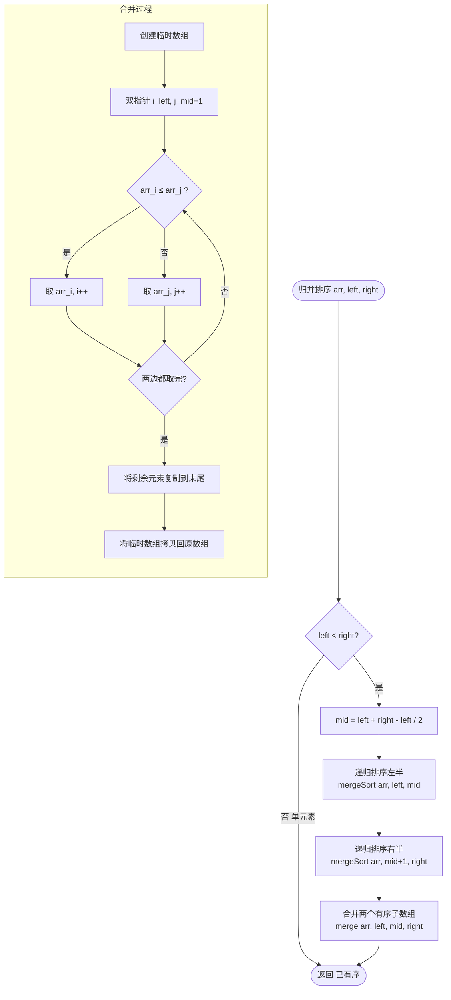

# 归并排序

> 创建日期：2026-06-06
> 难度：⭐⭐⭐
> 前置知识：递归、分治思想、数组操作

---

## ⭐ 面试重点速览

| 考察点 | 重要程度 | 考察频率 | 掌握目标 |
|--------|---------|---------|---------|
| 归并排序完整手写 | ★★★★★ | 极高（90%+） | 能手写递归和迭代两种版本 |
| 分治思想理解 | ★★★★★ | 极高（90%+） | 理解"先拆后合"的核心思想 |
| 合并两个有序数组 | ★★★★★ | 极高（90%+） | 独立写出 merge 函数 |
| 时间复杂度分析 | ★★★★☆ | 高（80%+） | 理解递归树推导 O(n log n) |
| 稳定性分析 | ★★★★☆ | 高（75%+） | 理解为什么归并排序是稳定的 |
| 归并解决逆序对 | ★★★★☆ | 高（75%+） | 关联LeetCode 剑指51 |
| 链表归并排序 | ★★★☆☆ | 中（60%+） | 关联LeetCode 148 |

---

## 一、应用场景 🎯

归并排序是 **唯一同时满足 O(n log n) 和稳定** 的比较排序算法，在以下场景中不可替代：

| 场景 | 说明 |
|------|------|
| 外排序（海量数据） | 数据无法全部加载到内存时，归并排序是唯一选择 |
| 稳定排序需求 | 需要保持相等元素的原始顺序（如多关键字排序） |
| 链表排序 | 链表天然适合归并（不需要随机访问，O(1) 空间合并） |
| 求逆序对 | 归并过程中可以顺便统计逆序对数量 |
| 分布式排序 | MapReduce 的 shuffle 阶段本质就是归并排序 |
| 数据库排序 | 多数数据库的 ORDER BY 实现基于外部归并排序 |

> 归并排序在工程中虽然不如快排常用，但它是**外排序和分布式排序的理论基础**，理解它对理解 MapReduce 等大数据框架至关重要。

---

## 二、核心原理 🔬

### 基本思想

归并排序采用经典的**分治（Divide and Conquer）**策略，但与快排的执行顺序完全不同：

1. **分解（Divide）**：将数组从中间分成两个子数组
2. **解决（Conquer）**：递归地对两个子数组进行归并排序
3. **合并（Combine）**：将两个已排序的子数组合并成一个有序数组

**与快排的关键区别**：快排是"先分区再递归"（重点在分），归并是"先递归再合并"（重点在合）。

### 示例演示

以数组 `[38, 27, 43, 3, 9, 82, 10]` 为例：

```
                       [38, 27, 43, 3, 9, 82, 10]
                       /                          \
              [38, 27, 43, 3]                [9, 82, 10]
              /             \                /          \
        [38, 27]          [43, 3]        [9, 82]       [10]
        /      \          /     \        /     \         |
     [38]     [27]     [43]    [3]    [9]     [82]     [10]
        \      /          \     /        \     /         |
        [27, 38]          [3, 43]        [9, 82]       [10]
              \             /                \          /
              [3, 27, 38, 43]                [9, 10, 82]
                       \                          /
                       [3, 9, 10, 27, 38, 43, 82]
```

### Mermaid流程图



### 复杂度分析

| 维度 | 最好情况 | 平均情况 | 最坏情况 |
|------|---------|---------|---------|
| 时间复杂度 | O(n log n) | O(n log n) | **O(n log n)** |
| 空间复杂度 | O(n) | O(n) | O(n) |
| 稳定性 | **稳定** | **稳定** | **稳定** |

**为什么是 O(n log n)？**

归并排序的递归树深度为 log n，每层需要合并所有元素（O(n)），总时间复杂度 = 层数 x 每层工作量 = O(n log n)。**无论数据如何分布，这个复杂度都不变**，这是归并排序相比快排的最大优势。

**为什么空间是 O(n)？**

合并时需要临时数组存储结果，最大需要 O(n) 的额外空间。这是归并排序相比快排的最大劣势。

---

## 三、趣味解说 🎭

### 场景：两副已排序的扑克牌合并

你和朋友各拿一副**已经按点数从小到大排好序**的扑克牌，现在要把它们合并成一副完整有序的牌。

**游戏规则**：

1. 你和朋友都把牌面朝上放在桌上，每次只看最上面一张
2. 比较你们俩最上面的牌，谁的小就谁先把那张牌放到"合并堆"里
3. 重复，直到一方牌全部出完
4. 剩下的牌直接放到合并堆末尾

**举例**：

```
你的牌：[2, 5, 8, J]
朋友的牌：[3, 6, 7, Q]

合并过程：
第1步：比较 2 vs 3 → 2 小，出 2 → 合并堆 [2]
第2步：比较 5 vs 3 → 3 小，出 3 → 合并堆 [2, 3]
第3步：比较 5 vs 6 → 5 小，出 5 → 合并堆 [2, 3, 5]
第4步：比较 8 vs 6 → 6 小，出 6 → 合并堆 [2, 3, 5, 6]
第5步：比较 8 vs 7 → 7 小，出 7 → 合并堆 [2, 3, 5, 6, 7]
第6步：比较 8 vs Q → 8 小，出 8 → 合并堆 [2, 3, 5, 6, 7, 8]
第7步：比较 J vs Q → J 小，出 J → 合并堆 [2, 3, 5, 6, 7, 8, J]
第8步：朋友出 Q      → 合并堆 [2, 3, 5, 6, 7, 8, J, Q]
```

> **核心洞察**：归并排序的精髓在于——**把大问题拆到最小（单个元素天然有序），然后两两合并成有序序列**。合并时利用"两边都有序"的性质，只需 O(n) 就能完成合并。

### 那最初怎么得到"已排序的牌"呢？

很简单——递归！把一副乱牌不断分成两半，直到每半只剩一张牌（天然有序），然后两两合并回来。这就是归并排序的全部奥秘。

---

## 四、代码实现 💻

### 递归版（标准实现）

```java
public class MergeSort {

    /**
     * 归并排序入口
     * 时间复杂度 O(n log n)，空间复杂度 O(n)
     */
    public void mergeSort(int[] arr) {
        if (arr == null || arr.length <= 1) return;
        mergeSort(arr, 0, arr.length - 1);
    }

    /** 递归排序 [left, right] 区间 */
    private void mergeSort(int[] arr, int left, int right) {
        if (left >= right) return; // 单个元素，天然有序

        int mid = left + (right - left) / 2; // 防溢出
        mergeSort(arr, left, mid);           // 递归排序左半
        mergeSort(arr, mid + 1, right);      // 递归排序右半
        merge(arr, left, mid, right);        // 合并两个有序子数组
    }

    /**
     * 合并两个有序子数组 [left, mid] 和 [mid+1, right]
     * 这是归并排序的核心操作！
     */
    private void merge(int[] arr, int left, int mid, int right) {
        // 创建临时数组存储合并结果
        int[] temp = new int[right - left + 1];

        int i = left;      // 左子数组的指针
        int j = mid + 1;   // 右子数组的指针
        int k = 0;          // 临时数组的指针

        // 双指针合并：比较两边的元素，小的先放入临时数组
        while (i <= mid && j <= right) {
            if (arr[i] <= arr[j]) { // 注意：用 <= 保证稳定性
                temp[k++] = arr[i++];
            } else {
                temp[k++] = arr[j++];
            }
        }

        // 将左子数组剩余元素复制到临时数组
        while (i <= mid) {
            temp[k++] = arr[i++];
        }

        // 将右子数组剩余元素复制到临时数组
        while (j <= right) {
            temp[k++] = arr[j++];
        }

        // 将临时数组拷贝回原数组
        for (int p = 0; p < temp.length; p++) {
            arr[left + p] = temp[p];
        }
    }
}
```

### 迭代版（自底向上，非递归）

```java
/**
 * 迭代版归并排序 —— 避免递归调用栈开销
 * 从 size=1 开始，每次合并两个相邻的 size 大小的子数组
 */
public void mergeSortIterative(int[] arr) {
    int n = arr.length;
    // size 表示当前合并的子数组长度，1, 2, 4, 8, ... 倍增
    for (int size = 1; size < n; size *= 2) {
        // 对每一对相邻的 size 大小的子数组进行合并
        for (int left = 0; left < n - size; left += 2 * size) {
            int mid = left + size - 1;
            int right = Math.min(left + 2 * size - 1, n - 1);
            merge(arr, left, mid, right); // 复用上面的 merge 函数
        }
    }
}
```

### 扩展：求逆序对（LeetCode 剑指51）

```java
/**
 * 利用归并排序求数组中的逆序对数量
 * 逆序对：i < j 但 nums[i] > nums[j]
 * 时间复杂度 O(n log n)
 */
public class ReversePairs {

    private int count = 0; // 逆序对计数器

    public int reversePairs(int[] nums) {
        count = 0;
        mergeSort(nums, 0, nums.length - 1);
        return count;
    }

    private void mergeSort(int[] nums, int left, int right) {
        if (left >= right) return;
        int mid = left + (right - left) / 2;
        mergeSort(nums, left, mid);
        mergeSort(nums, mid + 1, right);
        merge(nums, left, mid, right);
    }

    private void merge(int[] nums, int left, int mid, int right) {
        int[] temp = new int[right - left + 1];
        int i = left, j = mid + 1, k = 0;

        while (i <= mid && j <= right) {
            if (nums[i] <= nums[j]) {
                temp[k++] = nums[i++];
            } else {
                // 关键：当 nums[i] > nums[j] 时，
                // 左子数组中 i 到 mid 的所有元素都大于 nums[j]
                // 因为它们都排在 nums[j] 前面（i < j）
                count += (mid - i + 1); // 统计逆序对！
                temp[k++] = nums[j++];
            }
        }

        while (i <= mid) temp[k++] = nums[i++];
        while (j <= right) temp[k++] = nums[j++];

        for (int p = 0; p < temp.length; p++) {
            nums[left + p] = temp[p];
        }
    }
}
```

### 链表归并排序（LeetCode 148）

```java
/**
 * 链表归并排序 —— 归并排序天然适合链表！
 * 因为链表不需要随机访问，合并时空间 O(1)（只需调整指针）
 */
public class ListNode {
    int val;
    ListNode next;
    ListNode(int val) { this.val = val; }
}

public ListNode sortList(ListNode head) {
    if (head == null || head.next == null) return head;

    // 快慢指针找中点
    ListNode slow = head, fast = head.next;
    while (fast != null && fast.next != null) {
        slow = slow.next;
        fast = fast.next.next;
    }

    ListNode mid = slow.next; // 右半部分的头
    slow.next = null;          // 断开链表

    ListNode left = sortList(head);  // 递归排序左半
    ListNode right = sortList(mid);  // 递归排序右半

    return merge(left, right); // 合并两个有序链表
}

/** 合并两个有序链表（经典操作） */
private ListNode merge(ListNode l1, ListNode l2) {
    ListNode dummy = new ListNode(0);
    ListNode cur = dummy;

    while (l1 != null && l2 != null) {
        if (l1.val <= l2.val) {
            cur.next = l1;
            l1 = l1.next;
        } else {
            cur.next = l2;
            l2 = l2.next;
        }
        cur = cur.next;
    }

    cur.next = (l1 != null) ? l1 : l2; // 接上剩余部分
    return dummy.next;
}
```

---

## 五、优缺点 ⚖️

| 维度 | 评价 | 说明 |
|------|------|------|
| 时间复杂度 | ✅ 稳定优秀 | O(n log n)，不受数据分布影响 |
| 空间复杂度 | ❌ 较差 | O(n) 额外空间，是主要短板 |
| 稳定性 | ✅ 稳定 | 合并时 `<=` 的判断保证稳定性 |
| 链表适用性 | ✅ 极好 | 链表归并 O(1) 额外空间，比快排好太多 |
| 外排序适用 | ✅ 唯一选择 | 海量数据排序的理论基础 |
| 缓存友好 | ⚠️ 一般 | 合并时需要访问两个不连续区域 |
| 实现难度 | ⚠️ 中等 | 理解容易，但迭代版需要仔细处理边界 |

> **一句话总结**：归并排序牺牲了 O(n) 空间，换来了稳定的 O(n log n) 时间。在需要稳定排序或外排序的场景中，它是不可替代的选择。

---

## 六、面试高频题 📝

### Q1：归并排序稳定吗？为什么？

**答案**：**稳定**。关键在合并时判断条件用 `arr[i] <= arr[j]`（有等号），当左右元素相等时，优先取左子数组的元素，从而保持了左子数组元素在右子数组元素之前的相对顺序。

如果用 `arr[i] < arr[j]`（严格小于），归并排序就变成不稳定的了。

### Q2：归并排序和快速排序的对比？

| 比较维度 | 归并排序 | 快速排序 |
|---------|---------|---------|
| 分治顺序 | 先递归，后合并 | 先分区，后递归 |
| 时间复杂度 | 稳定 O(n log n) | 平均 O(n log n)，最坏 O(n²) |
| 空间复杂度 | O(n) | O(log n) |
| 稳定性 | 稳定 | 不稳定 |
| 实际速度 | 稍慢（数组拷贝开销） | 更快 |
| 链表 | 优秀 | 不适合 |
| 外排序 | 适合 | 不适合 |

### Q3：为什么归并排序适合外排序？

**答案**：归并排序可以分段处理。对于无法全部放入内存的大文件：
1. 将大文件分成多个能放入内存的小段
2. 每段加载到内存中排序，写回磁盘
3. 用归并的方式将多个有序小段合并成大文件

这个过程只需要极少的内存（每次合并只需读入每个小段的一小部分），这就是**多路归并**。

### Q4：归并排序可以原地完成吗？

**答案**：理论上可以但非常复杂。原地归并的时间复杂度会退化到 O(n²)，失去了 O(n log n) 的优势。因此实际中从不使用原地归并——宁愿牺牲 O(n) 空间换取 O(n log n) 时间。

### LeetCode关联题目

| 题号 | 题目 | 难度 | 关联点 |
|------|------|------|--------|
| 912 | 排序数组 | 中等 | 归并排序标准应用 |
| 148 | 排序链表 | 中等 | 归并排序最适合链表 |
| 剑指51 | 数组中的逆序对 | 困难 | 归并过程中统计逆序对 |
| 493 | 翻转对 | 困难 | 归并排序思想拓展 |
| 21 | 合并两个有序链表 | 简单 | 合并操作的基础 |
| 88 | 合并两个有序数组 | 简单 | 合并操作的基础 |
| 315 | 计算右侧小于当前元素的个数 | 困难 | 归并排序 + 索引数组 |
| 327 | 区间和的个数 | 困难 | 归并排序 + 前缀和 |

---

## 七、常见误区 ❌

### 误区一："归并排序比快排慢，所以不实用"

**纠正**：虽然大多数场景下快排确实更快，但归并排序在链表排序、外排序、稳定排序等场景中是唯一选择。Java 的 `Arrays.sort()` 对对象数组使用 TimSort（归并排序变体）正是因为需要稳定性。

### 误区二："归并排序的空间复杂度是 O(1)"

**纠正**：错误！归并排序需要 O(n) 额外空间来存储合并结果。有些面试新手会误以为不需要额外数组，但实际上合并步骤必须依赖临时数组。

### 误区三："合并时两个 while 循环就够了"

**纠正**：合并需要**三个** while 循环——前两个分别处理剩余元素，第三个将临时数组拷贝回原数组。少写任何一个都会导致错误。

### 误区四："链表归并排序也只需要 O(n) 空间"

**纠正**：链表归并排序合并时只需要调整指针，空间复杂度是 O(1)（不考虑递归栈）。这是链表归并排序相比快排的核心优势。

### 误区五："归并排序递归深度是 O(n)"

**纠正**：归并排序每次平分数组，递归深度是 O(log n)，不是 O(n)。如果写成 O(n) 深度，说明分割方式不对（比如每次只分出一个元素）。

---

> **归并排序是理解"分治"思想的绝佳范例。掌握它，你将能轻松应对链表排序、逆序对统计、外排序等经典问题！**

[返回排序算法全景对比](./index.md)