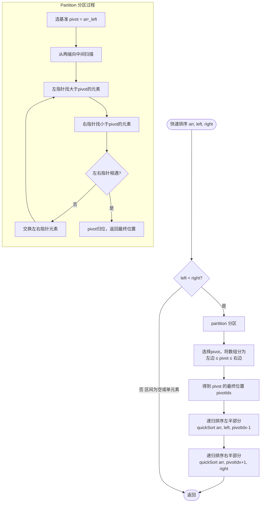

# 快速排序

> 创建日期：2026-06-06
> 难度：⭐⭐⭐
> 前置知识：递归、分治思想、数组操作

---

## ⭐ 面试重点速览

| 考察点 | 重要程度 | 考察频率 | 掌握目标 |
|--------|---------|---------|---------|
| 快排完整手写 | ★★★★★ | 极高（95%+） | 3分钟内闭眼写出，正确处理边界 |
| partition分区 | ★★★★★ | 极高（95%+） | 理解三种partition变体 |
| 随机化快排 | ★★★★☆ | 高（80%+） | 理解为什么随机化，能手写 |
| 时间复杂度分析 | ★★★★★ | 极高（90%+） | 清楚最好/最坏/平均情况 |
| 快速选择 | ★★★★☆ | 高（75%+） | 关联LeetCode 215 |
| 三路快排 | ★★★☆☆ | 中（50%+） | 关联LeetCode 75颜色分类 |

---

## 一、应用场景 🎯

快速排序是 **实际应用中最广泛的通用排序算法**，几乎所有编程语言的标准库排序函数都基于快速排序或其变体：

| 语言/库 | 排序函数 | 底层算法 |
|---------|---------|---------|
| Java | `Arrays.sort()` 基本类型 | 双轴快排（Dual-Pivot QuickSort） |
| Java | `Arrays.sort()` 对象类型 | TimSort（归并+插入的混合） |
| C++ | `std::sort()` | 内省排序（Introsort = 快排+堆排+插入） |
| Python | `list.sort()` / `sorted()` | TimSort |
| Go | `sort.Slice()` | 快排+希尔+插入的混合（pdqsort） |
| Rust | `slice::sort()` | 基于快排的 pdqsort |
| JavaScript V8 | `Array.prototype.sort()` | TimSort |

> 快排是工程界的"瑞士军刀"——通用、高效、且原地排序，在实际应用中碾压其他 O(n log n) 算法。

---

## 二、核心原理 🔬

### 基本思想

快速排序采用**分治（Divide and Conquer）**策略：

1. **分解（Divide）**：选择一个基准元素（pivot），将数组分为两部分，左边都小于 pivot，右边都大于 pivot
2. **解决（Conquer）**：递归地对左右两个子数组进行快速排序
3. **合并（Combine）**：不需要！快排是原地排序，分区完成后数组自然有序

### 示例演示

以数组 `[6, 1, 2, 7, 9, 3, 4, 5, 10, 8]` 为例，选择第一个元素 6 作为 pivot：

```
初始：[6, 1, 2, 7, 9, 3, 4, 5, 10, 8]
       ↑ pivot=6

分区后：[3, 1, 2, 5, 4, 6, 9, 7, 10, 8]
         ← 小于6的 →  ↑  ← 大于6的 →

递归排序左右：
  左：[3, 1, 2, 5, 4] → [1, 2, 3, 4, 5]
  右：[9, 7, 10, 8]   → [7, 8, 9, 10]

最终：[1, 2, 3, 4, 5, 6, 7, 8, 9, 10]
```

### Mermaid流程图



### 复杂度分析

| 维度 | 最好情况 | 平均情况 | 最坏情况 |
|------|---------|---------|---------|
| 时间复杂度 | O(n log n) | O(n log n) | **O(n²)** |
| 空间复杂度 | O(log n) | O(log n) | O(n) |
| 稳定性 | 不稳定 | 不稳定 | 不稳定 |

**为什么最坏是 O(n²)？**

当每次 pivot 都是最小或最大元素时，分区极不平衡，递归深度变为 O(n)，每层 O(n) 的工作量，总计 O(n²)。

**为什么平均是 O(n log n)？**

每次分区大致平分，递归深度 O(log n)，每层 O(n)，总计 O(n log n)。

**随机化快排**：通过随机选择 pivot，将最坏情况的概率降到极低（期望时间复杂度 O(n log n)）。

---

## 三、趣味解说 🎭

### 场景：军训排队，选基准兵

烈日当空，教官站在操场上，面前站着歪歪扭扭的一排新兵（数组）。

教官皱皱眉，想把这排人从矮到高排好。他灵机一动，想了个办法：

**第一步：选基准兵**
教官随机指了一个新兵："你，出列！站到前面来！" 这个被选中的新兵就是**基准兵（pivot）**。

**第二步：分左右队**
教官对剩下的新兵说："所有人听口令！"
- "比基准兵矮的，站到他左边去！"
- "比基准兵高的，站到他右边去！"

一阵混乱后，基准兵左边全是矮个子，右边全是高个子。基准兵自己也找到了他的最终位置——**他这辈子就站这儿了，再也不动了**。

**第三步：递归排队**
教官对左右两队分别重复上述过程：
- 左边队再选一个基准兵，矮的站左，高的站右
- 右边队再选一个基准兵，矮的站左，高的站右

一直重复，直到每队只剩一个人或没人。

**最终结果**：全排从矮到高排列完毕！

> **核心洞察**：快排的精髓在于——每次让一个元素（基准兵）找到最终位置，然后问题规模缩小一半，递归解决。这就像军训教官，他不直接排所有人，而是"每次安顿好一个人，再把问题交给下一级"。

### 为什么叫"快"排？

因为在实际场景中，大多数情况下 partition 都能把数组大致平分，递归深度控制在 O(log n)，加上内循环极其简单（只有比较和移动指针），常数因子小，所以跑得飞快。

---

## 四、代码实现 💻

### 经典版（左右指针法）

```java
import java.util.Random;

public class QuickSort {

    private static final Random RAND = new Random();

    /**
     * 快速排序入口
     * 时间复杂度 O(n log n)，空间复杂度 O(log n)
     */
    public void quickSort(int[] arr) {
        if (arr == null || arr.length <= 1) return;
        quickSort(arr, 0, arr.length - 1);
    }

    /** 递归排序 [left, right] 区间 */
    private void quickSort(int[] arr, int left, int right) {
        if (left >= right) return; // 区间为空或单元素，已有序

        int pivotIdx = partition(arr, left, right);
        quickSort(arr, left, pivotIdx - 1);  // 递归排序左半部分
        quickSort(arr, pivotIdx + 1, right); // 递归排序右半部分
    }

    /**
     * 分区函数 —— 核心！
     * 将数组分为 [left, pivotIdx-1] ≤ pivot ≤ [pivotIdx+1, right]
     */
    private int partition(int[] arr, int left, int right) {
        // 随机选择 pivot，避免最坏情况
        int randomIdx = left + RAND.nextInt(right - left + 1);
        swap(arr, left, randomIdx); // 把随机选中的 pivot 换到最左边

        int pivot = arr[left]; // 基准值
        int i = left;           // 左指针，从 left 开始
        int j = right;          // 右指针，从 right 开始

        while (i < j) {
            // 从右向左找第一个小于 pivot 的元素
            while (i < j && arr[j] >= pivot) {
                j--;
            }
            // 从左向右找第一个大于 pivot 的元素
            while (i < j && arr[i] <= pivot) {
                i++;
            }
            // 交换这两个"站错队"的元素
            if (i < j) {
                swap(arr, i, j);
            }
        }

        // 将 pivot 放到最终位置（i 和 j 重合的位置）
        swap(arr, left, i);
        return i; // 返回 pivot 的最终索引
    }

    private void swap(int[] arr, int i, int j) {
        int temp = arr[i];
        arr[i] = arr[j];
        arr[j] = temp;
    }
}
```

### 变体一：挖坑法（更直观）

```java
/**
 * 挖坑法 partition —— 思想更直观，方便理解
 * 将 pivot 看作一个"坑"，左右交替填坑
 */
private int partitionDigHole(int[] arr, int left, int right) {
    int pivot = arr[left]; // 取第一个元素为基准，left 位置变成"坑"
    int i = left;
    int j = right;

    while (i < j) {
        // 从右向左找小于 pivot 的数，填入左边的坑
        while (i < j && arr[j] >= pivot) j--;
        if (i < j) {
            arr[i] = arr[j]; // 填坑，j 位置变成新坑
            i++;
        }

        // 从左向右找大于 pivot 的数，填入右边的坑
        while (i < j && arr[i] <= pivot) i++;
        if (i < j) {
            arr[j] = arr[i]; // 填坑，i 位置变成新坑
            j--;
        }
    }

    arr[i] = pivot; // pivot 归位，填最后一个坑
    return i;
}
```

### 变体二：三路快排（处理大量重复元素）

```java
/**
 * 三路快排 —— 将数组分为 < pivot | = pivot | > pivot 三部分
 * 适用于包含大量重复元素的数组（如 LeetCode 75 颜色分类）
 * 时间复杂度 O(n)，单次 partition
 */
public void threeWayQuickSort(int[] arr, int left, int right) {
    if (left >= right) return;

    int pivot = arr[left]; // 基准值
    int lt = left;         // [left, lt-1] 是 < pivot 的区域
    int gt = right;        // [gt+1, right] 是 > pivot 的区域
    int i = left + 1;      // 当前扫描指针

    while (i <= gt) {
        if (arr[i] < pivot) {
            swap(arr, lt, i); // 扔到左边
            lt++;
            i++;
        } else if (arr[i] > pivot) {
            swap(arr, i, gt); // 扔到右边
            gt--;
            // 注意：i 不自增，因为换过来的元素还未检查
        } else {
            i++; // 等于 pivot，直接跳过
        }
    }

    // 递归排序左右两部分，中间等于 pivot 的部分不用排
    threeWayQuickSort(arr, left, lt - 1);
    threeWayQuickSort(arr, gt + 1, right);
}
```

### 快速选择（关联 LeetCode 215）

```java
/**
 * 快速选择算法 —— 查找数组中第 K 大的元素
 * 利用快排的分区思想，每次只递归一侧
 * 时间复杂度 O(n)，空间复杂度 O(1)
 */
public int findKthLargest(int[] nums, int k) {
    int target = nums.length - k; // 第K大 = 第 n-k 小（0索引）
    int left = 0, right = nums.length - 1;

    while (left <= right) {
        int pivotIdx = partition(nums, left, right);

        if (pivotIdx == target) {
            return nums[pivotIdx]; // 找到了！
        } else if (pivotIdx < target) {
            left = pivotIdx + 1; // 目标在右边
        } else {
            right = pivotIdx - 1; // 目标在左边
        }
    }
    return -1; // 不会执行到这里
}

// partition 同上，此处省略
```

---

## 五、优缺点 ⚖️

| 维度 | 评价 | 说明 |
|------|------|------|
| 平均时间复杂度 | ✅ 优秀 | O(n log n)，实际运行速度在 O(n log n) 算法中最快 |
| 最坏时间复杂度 | ❌ 糟糕 | O(n²)，但随机化后概率极低 |
| 空间复杂度 | ✅ 好 | O(log n) 递归栈，原地的 |
| 稳定性 | ❌ 不稳定 | 分区时相等元素的相对顺序可能被打乱 |
| 缓存友好 | ✅ 极好 | 顺序扫描数组，CPU缓存命中率高 |
| 实现难度 | ⚠️ 中 | 边界条件容易出错，需要仔细处理 |
| 通用性 | ✅ 极好 | 适用于绝大多数排序场景 |

> **一句话总结**：快排是工程界的排序之王，速度最快但牺牲了稳定性。随机化选pivot是必须的优化。

---

## 六、面试高频题 📝

### Q1：快排最坏情况是什么？如何避免？

**答案**：最坏情况发生在每次 partition 都极不平衡时（如 pivot 总是最小或最大元素），此时递归深度 O(n)，时间复杂度 O(n²)。

**避免方法**：
1. **随机化选 pivot**（最常用）：随机选一个元素与第一个交换
2. **三数取中法**：取 left、mid、right 三者的中位数作为 pivot
3. **三路快排**：适用于大量重复元素的情况

### Q2：快排是稳定的吗？如果不能，如何让它稳定？

**答案**：快排**不稳定**。因为 partition 过程中元素的交换会打乱相等元素的相对顺序。

**如果需要稳定排序**：使用归并排序（牺牲 O(n) 空间），或者为每个元素附加原始索引，在比较时先比较值、值相等时比较索引。

### Q3：快排和归并排序的区别？

| 比较维度 | 快速排序 | 归并排序 |
|---------|---------|---------|
| 分治策略 | 先分区再递归 | 先递归再合并 |
| 主要工作 | 在 partition（前） | 在 merge（后） |
| 空间复杂度 | O(log n) | O(n) |
| 稳定性 | 不稳定 | 稳定 |
| 链表适用 | 不适用 | 非常适用 |
| 实际速度 | 更快 | 稍慢 |

### Q4：为什么 Java 对基本类型用快排，对对象用归并？

**答案**：
- **基本类型**用快排：因为基本类型不关心稳定性，快排更快且省内存
- **对象类型**用归并（TimSort）：因为对象排序需要稳定性保证，且对象的引用交换开销大，归并排序的移动次数更少

### LeetCode关联题目

| 题号 | 题目 | 难度 | 关联点 |
|------|------|------|--------|
| 912 | 排序数组 | 中等 | 快排标准应用 |
| 215 | 数组中的第K个最大元素 | 中等 | 快速选择算法 |
| 75 | 颜色分类 | 中等 | 三路快排（荷兰国旗问题） |
| 347 | 前K个高频元素 | 中等 | 桶排序 或 快排思想 |
| 973 | 最接近原点的K个点 | 中等 | 快速选择 |
| 剑指40 | 最小的K个数 | 简单 | 快速选择 或 大顶堆 |

---

## 七、常见误区 ❌

### 误区一："pivot 必须选第一个元素"

**纠正**：选第一个元素作为 pivot 是教学中最常见的写法，但在实际应用中必须避免。因为当数组有序或逆序时，选第一个会导致最坏情况 O(n²)。**必须使用随机化或三数取中**。

### 误区二："快排是稳定的"

**纠正**：快排**不稳定**。在 partition 过程中，元素的跳跃式交换会破坏稳定性。面试中这是一道高频送分题。

### 误区三："快排空间复杂度是 O(1)"

**纠正**：快排是原地排序（不需要额外数组），但递归调用栈需要 O(log n) 的空间。在最坏情况下（每次 pivot 都是极值），递归深度达到 O(n)，空间也是 O(n)。

### 误区四："先移动左指针还是右指针无所谓"

**纠正**：有所谓！**必须先移动右指针**（从右向左找小于 pivot 的）。如果先移动左指针，当 pivot 选在最左边时，可能导致 i 和 j 相遇位置错误，最终 pivot 放错位置。

### 误区五："三路快排一定比普通快排好"

**纠正**：三路快排只在**大量重复元素**的场景下才有优势。对于随机数据，三路快排多了一次判断，常数因子反而更大。选择正确的快排变体取决于数据特征。

---

> **快排是面试排序题的第一选择。背熟模板，理解分区逻辑，注意边界条件，你就能在面试中轻松应对！**

[返回排序算法全景对比](./index.md)