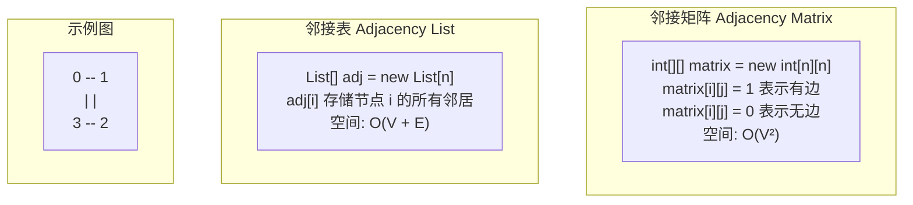
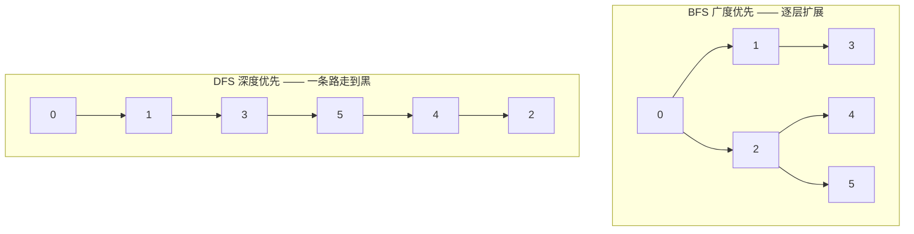
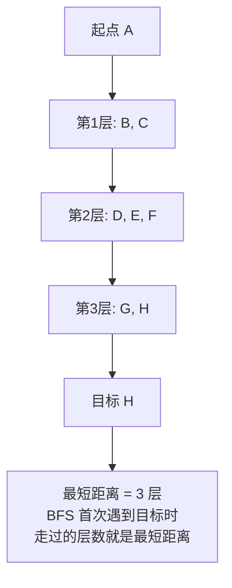
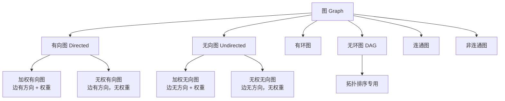

# 图的存储与遍历 —— 地铁线路图的秘密

> 创建日期：2026-06-06
> 难度：⭐⭐⭐
> 前置知识：栈、队列、递归、矩阵基础

---

## ⭐ 面试重点速览

| 重点编号 | 核心内容 | 重要程度 |
|---------|---------|---------|
| 1 | 邻接矩阵 vs 邻接表的选择（空间/时间权衡） | **必考** |
| 2 | BFS 和 DFS 的手写代码（递归/迭代两种写法） | **高频手撕** |
| 3 | BFS 和 DFS 的适用场景区分 | **必问** |
| 4 | 有向图/无向图/加权图的存储差异 | **基础** |
| 5 | 图的常见算法一览（拓扑排序、最短路径、连通分量） | **进阶** |

---

## 一、应用场景 🎯

图是最灵活、最强大的数据结构之一，它能表示任意"多对多"的关系。

| 应用场景 | 具体案例 | 使用的图算法 |
|---------|---------|------------|
| 地图导航 | 高德/百度地图最短路径 | Dijkstra、A* |
| 社交网络 | 微信好友推荐（共同好友） | BFS、连通分量 |
| 网络路由 | 路由器之间的最优路径选择 | 最短路径算法 |
| 编译器 | 依赖关系分析（A 依赖 B，B 依赖 C） | 拓扑排序 |
| 网页排名 | Google PageRank | 图遍历 + 概率模型 |
| 任务调度 | 课程表安排（先修课关系） | 拓扑排序 |
| 电路设计 | 电路板布线最短路径 | BFS |
| 知识图谱 | 实体关系推理 | 图遍历 |
| 垃圾回收 | Java GC 可达性分析 | DFS（从 GC Roots 出发） |

---

## 二、核心原理 🔬

### 2.1 图的存储方式对比



| 对比维度 | 邻接矩阵 | 邻接表 |
|---------|---------|-------|
| 空间复杂度 | O(V²) | O(V + E) |
| 判断边是否存在 | **O(1)** — matrix[i][j] | O(degree) — 遍历邻接链表 |
| 遍历某节点的所有邻居 | O(V) | O(degree) |
| 添加边 | O(1) | O(1) |
| 删除边 | O(1) | O(degree) |
| 适合场景 | 稠密图（边多）、需要频繁判断边是否存在 | 稀疏图（边少）、需要遍历邻居 |
| 内存友好度 | 差（稀疏图浪费严重） | 好 |
| 实现复杂度 | 简单 | 中等 |

**一句话选型**：边数 E 接近 V² 用邻接矩阵，否则用邻接表。现实中大部分图都是稀疏图，所以邻接表更常用。

### 2.2 BFS vs DFS 对比



| 对比维度 | BFS（广度优先） | DFS（深度优先） |
|---------|---------------|---------------|
| 数据结构 | **队列**（Queue） | **栈**（Stack，或递归调用栈） |
| 遍历顺序 | 逐层扩展，先访问离起点近的节点 | 沿一条路径深入到底，再回溯 |
| 空间复杂度 | O(V) — 最坏情况队列存整层节点 | O(h) — h 为递归深度 |
| 适用场景 | 最短路径、层级遍历、连通分量 | 拓扑排序、检测环、迷宫回溯 |
| 实现方式 | 必须用队列迭代 | 递归（简洁）或栈迭代 |
| 找到的路径 | **最短路径**（无权图） | 不一定最短 |

### 2.3 BFS 找最短路径原理



**核心原理**：BFS 按层扩展，每一层距离起点增加 1。当第一次访问到目标节点时，经过的层数就是最短距离（仅限无权图）。

### 2.4 图的分类



---

## 三、趣味解说 🎭

### 地铁线路图

每个城市都有地铁线路图。如果把地铁图抽象成数据结构，它就是一个标准的**图（Graph）**：

- **站点 = 节点（Vertex）**：北京地铁有 400+ 个站点，每个站点就是图中的一个节点
- **轨道 = 边（Edge）**：两个站点之间的轨道就是一条边
- **换乘站 = 度很高的节点**：西直门、国贸这种换乘站连着多条线路，在图中 degree 很高
- **线路颜色 = 不同的子图**：1号线（红色）和 2号线（蓝色）是图的不同连通分量

**BFS 就是"地铁广播寻人"**：你在地铁站 A，要找一个不知道在哪站的人。你从 A 站出发，先问 A 站相邻的所有站（1 站距离），再问这些站的相邻站（2 站距离），逐层扩散。这种"水波纹"式的扩散方式，保证你找到的是最短路径（最少站数）。

**DFS 就是"一条线路走到头"**：你坐上 1 号线，从苹果园出发，一直坐到四惠东（终点站），沿途每个站都看看。到终点后，退回到上一站，换另一条没走过的线路继续。这种"不撞南墙不回头"的方式，可能会绕远路，但能保证访问所有站点。

**邻接矩阵 vs 邻接表就是"两种地图"**：
- 邻接矩阵 = 一张巨大的表格，行是出发站，列是到达站，格子填 1 或 0。北京 400 个站就要 400x400 = 16 万个格子，但实际只有几百条边，表格大部分是空的——**浪费空间但查询快**。
- 邻接表 = 每个站贴一张小纸条，写着"本站可以去：XX站、YY站、ZZ站"。400 个站，每站只写几个邻居，总共几千条记录——**省空间，但查"两站之间是否有直达"需要挨个翻小纸条**。

---

## 四、代码实现 💻

### 4.1 邻接表建图（通用模板）

```java
/**
 * 图的邻接表表示（通用模板）
 * 支持有向图、无向图、加权图
 */
public class Graph {
    private final int V;                        // 顶点数量
    private final List<Integer>[] adj;          // 邻接表（无权图）
    private final List<Edge>[] weightedAdj;     // 邻接表（加权图）

    /** 加权边 */
    static class Edge {
        int to;      // 目标节点
        int weight;  // 边的权重

        Edge(int to, int weight) {
            this.to = to;
            this.weight = weight;
        }
    }

    /** 构建无权图 */
    @SuppressWarnings("unchecked")
    public Graph(int V) {
        this.V = V;
        this.adj = (List<Integer>[]) new List[V];
        this.weightedAdj = null;
        for (int i = 0; i < V; i++) {
            adj[i] = new ArrayList<>();
        }
    }

    /** 构建加权图 */
    @SuppressWarnings("unchecked")
    public Graph(int V, boolean weighted) {
        this.V = V;
        this.adj = null;
        this.weightedAdj = (List<Edge>[]) new List[V];
        for (int i = 0; i < V; i++) {
            weightedAdj[i] = new ArrayList<>();
        }
    }

    /** 添加无向无权边 */
    public void addEdge(int u, int v) {
        adj[u].add(v);
        adj[v].add(u); // 无向图需要双向添加
    }

    /** 添加加权有向边 */
    public void addDirectedEdge(int from, int to, int weight) {
        weightedAdj[from].add(new Edge(to, weight));
    }

    public int getV() { return V; }
    public List<Integer> getNeighbors(int v) { return adj[v]; }
    public List<Edge> getWeightedNeighbors(int v) { return weightedAdj[v]; }
}
```

### 4.2 BFS —— 广度优先搜索

```java
/**
 * BFS 广度优先搜索
 * 核心：用队列（Queue）实现逐层遍历
 * 时间复杂度：O(V + E)
 * 空间复杂度：O(V)
 */
public class BFS {

    /**
     * 基础 BFS 遍历 —— 打印访问顺序
     * @param graph 邻接表表示的图
     * @param start 起始节点
     */
    public void bfsTraverse(Graph graph, int start) {
        boolean[] visited = new boolean[graph.getV()];
        Queue<Integer> queue = new LinkedList<>();

        // 起始节点入队并标记为已访问
        queue.offer(start);
        visited[start] = true;

        while (!queue.isEmpty()) {
            int node = queue.poll(); // 取出队头节点
            System.out.print(node + " "); // 处理当前节点

            // 遍历所有邻居节点
            for (int neighbor : graph.getNeighbors(node)) {
                if (!visited[neighbor]) {
                    visited[neighbor] = true; // 入队前标记为已访问（防止重复入队）
                    queue.offer(neighbor);
                }
            }
        }
    }

    /**
     * BFS 求最短路径（无权图）
     * LeetCode 相关：127 单词接龙、752 打开转盘锁
     *
     * @return 从 start 到 target 的最短距离（边数），不可达返回 -1
     */
    public int shortestPath(Graph graph, int start, int target) {
        if (start == target) return 0;

        boolean[] visited = new boolean[graph.getV()];
        Queue<Integer> queue = new LinkedList<>();
        queue.offer(start);
        visited[start] = true;
        int steps = 0; // 记录走了多少步（层数）

        while (!queue.isEmpty()) {
            int size = queue.size(); // 当前层的节点数
            steps++; // 进入下一层

            // 处理当前层的所有节点
            for (int i = 0; i < size; i++) {
                int node = queue.poll();

                for (int neighbor : graph.getNeighbors(node)) {
                    if (neighbor == target) {
                        return steps; // 找到目标，返回步数
                    }
                    if (!visited[neighbor]) {
                        visited[neighbor] = true;
                        queue.offer(neighbor);
                    }
                }
            }
        }
        return -1; // 不可达
    }

    /**
     * BFS 层级遍历（二叉树也可以用）
     */
    public List<List<Integer>> levelOrder(Graph graph, int start) {
        List<List<Integer>> result = new ArrayList<>();
        boolean[] visited = new boolean[graph.getV()];
        Queue<Integer> queue = new LinkedList<>();
        queue.offer(start);
        visited[start] = true;

        while (!queue.isEmpty()) {
            int size = queue.size();
            List<Integer> level = new ArrayList<>();

            for (int i = 0; i < size; i++) {
                int node = queue.poll();
                level.add(node);
                for (int neighbor : graph.getNeighbors(node)) {
                    if (!visited[neighbor]) {
                        visited[neighbor] = true;
                        queue.offer(neighbor);
                    }
                }
            }
            result.add(level);
        }
        return result;
    }
}
```

### 4.3 DFS —— 深度优先搜索

```java
/**
 * DFS 深度优先搜索
 * 核心：递归（系统栈）或显式栈
 * 时间复杂度：O(V + E)
 * 空间复杂度：O(h)，h 为递归深度
 */
public class DFS {

    /**
     * 递归版 DFS（最常用）
     * 简洁优雅，但节点极多时可能栈溢出
     */
    public void dfsRecursive(Graph graph, int node, boolean[] visited) {
        visited[node] = true; // 标记当前节点为已访问
        System.out.print(node + " "); // 处理当前节点（前序）

        // 深入每个未访问的邻居
        for (int neighbor : graph.getNeighbors(node)) {
            if (!visited[neighbor]) {
                dfsRecursive(graph, neighbor, visited); // 递归深入
            }
        }
        // 这里可以加后序处理代码
    }

    /**
     * 迭代版 DFS（用栈模拟递归）
     * 在深度很大时避免栈溢出；也可以方便地控制遍历顺序
     */
    public void dfsIterative(Graph graph, int start) {
        boolean[] visited = new boolean[graph.getV()];
        Deque<Integer> stack = new ArrayDeque<>();

        stack.push(start);

        while (!stack.isEmpty()) {
            int node = stack.pop(); // 弹出栈顶

            if (visited[node]) continue; // 可能重复入栈，跳过
            visited[node] = true;
            System.out.print(node + " ");

            // 遍历邻居（逆序入栈可以保持与递归相同的顺序）
            List<Integer> neighbors = graph.getNeighbors(node);
            for (int i = neighbors.size() - 1; i >= 0; i--) {
                int neighbor = neighbors.get(i);
                if (!visited[neighbor]) {
                    stack.push(neighbor);
                }
            }
        }
    }

    /**
     * DFS 检测环（有向图）
     * 使用三色标记法：0=未访问, 1=访问中, 2=已完成
     * LeetCode 207: 课程表
     */
    public boolean hasCycle(Graph graph) {
        int V = graph.getV();
        int[] color = new int[V]; // 0=白, 1=灰, 2=黑

        for (int i = 0; i < V; i++) {
            if (color[i] == 0) {
                if (dfsDetectCycle(graph, i, color)) {
                    return true; // 存在环
                }
            }
        }
        return false;
    }

    private boolean dfsDetectCycle(Graph graph, int node, int[] color) {
        color[node] = 1; // 标记为"访问中"（灰色）

        for (int neighbor : graph.getNeighbors(node)) {
            if (color[neighbor] == 1) {
                return true; // 遇到灰色节点 = 存在环
            }
            if (color[neighbor] == 0) {
                if (dfsDetectCycle(graph, neighbor, color)) {
                    return true;
                }
            }
        }
        color[node] = 2; // 标记为"已完成"（黑色）
        return false;
    }

    /**
     * DFS 统计连通分量（无向图）
     * LeetCode 200: 岛屿数量
     */
    public int countComponents(Graph graph) {
        int V = graph.getV();
        boolean[] visited = new boolean[V];
        int count = 0;

        for (int i = 0; i < V; i++) {
            if (!visited[i]) {
                count++; // 发现一个新的连通分量
                dfsRecursive(graph, i, visited);
            }
        }
        return count;
    }
}
```

### 4.4 邻接矩阵建图（稠密图场景）

```java
/**
 * 邻接矩阵表示法
 * 适合稠密图（边数接近 V²）
 */
public class AdjMatrixGraph {
    private final int V;
    private final int[][] matrix; // 无权图: 0/1; 加权图: 权重/INF

    private static final int INF = Integer.MAX_VALUE / 2; // 防止溢出

    public AdjMatrixGraph(int V, boolean weighted) {
        this.V = V;
        this.matrix = new int[V][V];
        if (weighted) {
            // 加权图初始化：对角线为 0，其他为 INF
            for (int i = 0; i < V; i++) {
                for (int j = 0; j < V; j++) {
                    matrix[i][j] = (i == j) ? 0 : INF;
                }
            }
        }
    }

    /** 添加无权边 */
    public void addEdge(int u, int v) {
        matrix[u][v] = 1;
        matrix[v][u] = 1; // 无向图
    }

    /** 添加加权边 */
    public void addWeightedEdge(int u, int v, int weight) {
        matrix[u][v] = weight;
        matrix[v][u] = weight; // 无向加权图
    }

    /** O(1) 判断边是否存在 */
    public boolean hasEdge(int u, int v) {
        return matrix[u][v] != 0 && matrix[u][v] != INF;
    }

    /** 获取权重 */
    public int getWeight(int u, int v) {
        return matrix[u][v];
    }

    public int getV() { return V; }
    public int[][] getMatrix() { return matrix; }
}
```

---

## 五、优缺点 ⚖️

### 图 vs 其他数据结构

| 对比维度 | 图 | 树 | 哈希表 |
|---------|---|----|-------|
| 节点关系 | 多对多 | 一对多（层次） | 键值对（无显式关系） |
| 查找单个元素 | 需遍历 | O(log n) 或 O(n) | O(1) |
| 最短路径 | 支持（BFS/Dijkstra） | 不支持（树只有唯一路径） | 不支持 |
| 关系建模 | **最强** | 中等 | 弱 |
| 存储开销 | 高（邻接表 O(V+E)） | 中（O(V)） | 中 |
| 算法复杂度 | 高 | 中 | 低（操作简单） |

### 邻接矩阵 vs 邻接表

| 维度 | 邻接矩阵 | 邻接表 |
|-----|---------|-------|
| 空间 | O(V²) | O(V + E) |
| 判断边存在 | O(1) | O(degree) |
| 遍历所有邻居 | O(V) | O(degree) |
| 添加边 | O(1) | O(1) |
| 删除边 | O(1) | O(degree) |
| 适合图类型 | 稠密图 | 稀疏图 |
| 缓存友好 | 好（连续内存） | 差（链表不连续） |

### BFS vs DFS

| 维度 | BFS | DFS |
|-----|-----|-----|
| 数据结构 | 队列 | 栈（递归） |
| 最短路径 | **保证找到**（无权图） | 不保证 |
| 空间复杂度 | O(V) 最坏 | O(h) 树高 |
| 适用场景 | 最短路径、层级遍历 | 拓扑排序、环检测、回溯 |
| 实现难度 | 中等 | 简单（递归） |
| 栈溢出风险 | 无 | 有（递归深度过大时） |

---

## 六、面试高频题 📝

| 题目 | LeetCode 题号 | 核心解法 | 难度 |
|-----|-------------|---------|-----|
| 岛屿数量 | 200 | DFS/BFS 遍历 + 沉岛标记 | 中等 |
| 课程表 | 207 | 拓扑排序（DFS 三色法 / BFS 入度法） | 中等 |
| 克隆图 | 133 | DFS/BFS + HashMap 映射 | 中等 |
| 单词接龙 | 127 | BFS 最短路径 | 困难 |
| 打开转盘锁 | 752 | BFS 最短路径 | 中等 |
| 网络延迟时间 | 743 | Dijkstra 最短路径 | 中等 |
| 被围绕的区域 | 130 | DFS/BFS 边界出发 | 中等 |
| 所有可能的路径 | 797 | DFS 回溯 | 中等 |
| 省份数量 | 547 | DFS/BFS 连通分量 / 并查集 | 中等 |
| 重新安排行程 | 332 | DFS + 优先队列（欧拉路径） | 困难 |

### 面试官追问

> **Q**: BFS 和 DFS 的空间复杂度差异？
> **A**: BFS 最坏 O(V)（队列中存了整层节点，如星形图中心节点的所有邻居）。DFS 递归版最坏 O(h)（h 为递归深度），在树的场景下是 O(log n)，但在链状图中也是 O(V)。BFS 通常比 DFS 更耗内存。

> **Q**: 什么时候用 BFS，什么时候用 DFS？
> **A**: 需要最短路径（无权图）就用 BFS。需要遍历所有可能性（回溯、排列组合）、检测环、拓扑排序就用 DFS。层级遍历用 BFS（如二叉树的层序遍历）。

> **Q**: 无向图检测环和有向图检测环有什么区别？
> **A**: 无向图用 DFS + 记录 parent（父节点不视为环），或者用并查集。有向图用 DFS 三色标记法（0=未访问，1=访问中，2=已完成），遇到灰色节点说明有环。也可以用 BFS 拓扑排序（入度法）。

> **Q**: 图的题目中 visited 数组和"沉岛"的区别？
> **A**: visited 是通用的标记方式，不修改原数据。沉岛（如 LeetCode 200 岛屿数量）是直接修改原矩阵（grid[i][j] = '0'），省去了 visited 数组的空间，但会破坏原数据。

---

## 七、常见误区 ❌

| 误区 | 真相 | 解释 |
|-----|-----|-----|
| "BFS 用栈，DFS 用队列" | **完全说反了！** | BFS 用队列（先进先出，逐层扩展）；DFS 用栈（后进先出，深入探索） |
| "DFS 递归一定比迭代好" | 不一定 | 递归代码简洁，但深度过大时栈溢出。迭代用显式栈更安全，但代码复杂 |
| "邻接矩阵一定比邻接表慢" | 不一定 | 判断边是否存在：邻接矩阵 O(1) vs 邻接表 O(degree)。稠密图邻接矩阵更快 |
| "图的遍历必须从 0 开始" | 不是 | 起始节点任意，但注意非连通图需要遍历所有节点作为起点 |
| "BFS 找到的一定是最短路径" | 仅限无权图 | 有权图的最短路径需要用 Dijkstra 或 Bellman-Ford |
| "DFS 不需要 visited 数组" | **必须要有** | 没有 visited 会导致无限循环（存在环时）和重复访问 |
| "拓扑排序只能用于无环图" | 对，这正是其用途 | 拓扑排序本身就是为了检测和排序 DAG（有向无环图） |
| "图的边数 E 总是小于 V²" | 对，但有大有小 | 无向图最多 V(V-1)/2 条边，有向图最多 V(V-1) 条边 |

### 实战反例

```java
// ❌ 经典错误：BFS/DFS 漏掉了 visited 标记
// 结果：死循环或重复访问
public void bfsWrong(Graph graph, int start) {
    Queue<Integer> queue = new LinkedList<>();
    queue.offer(start);
    // 忘了 visited[start] = true;  ← 致命错误！

    while (!queue.isEmpty()) {
        int node = queue.poll();
        for (int neighbor : graph.getNeighbors(node)) {
            // 没有 visited 检查，如果图有环，会无限循环！
            queue.offer(neighbor);
        }
    }
}

// ✅ 正确做法：入队前标记
public void bfsCorrect(Graph graph, int start) {
    boolean[] visited = new boolean[graph.getV()];
    Queue<Integer> queue = new LinkedList<>();
    queue.offer(start);
    visited[start] = true; // 关键：入队前标记

    while (!queue.isEmpty()) {
        int node = queue.poll();
        for (int neighbor : graph.getNeighbors(node)) {
            if (!visited[neighbor]) {
                visited[neighbor] = true; // 入队前标记
                queue.offer(neighbor);
            }
        }
    }
}
```

```java
// ❌ 常见错误：BFS 求最短路径时，忘记按层处理
// 结果：步骤计数不准确
public int shortestPathWrong(Graph graph, int start, int target) {
    Queue<Integer> queue = new LinkedList<>();
    queue.offer(start);
    int steps = 0;

    while (!queue.isEmpty()) {
        int node = queue.poll(); // 错误：没有按层处理
        steps++; // 每个节点 steps++，结果完全错误！
        // ...
    }
    return steps;
}

// ✅ 正确做法：按层处理（用 size 记录当前层节点数）
public int shortestPathCorrect(Graph graph, int start, int target) {
    Queue<Integer> queue = new LinkedList<>();
    queue.offer(start);
    int steps = 0;

    while (!queue.isEmpty()) {
        int size = queue.size(); // 当前层的节点数
        steps++;
        for (int i = 0; i < size; i++) { // 处理完当前层所有节点
            int node = queue.poll();
            for (int neighbor : graph.getNeighbors(node)) {
                if (neighbor == target) return steps;
                // ...
            }
        }
    }
    return -1;
}
```

---

> **关联阅读**：
> - [数据结构全景](./index.md) —— 查看所有数据结构的复杂度速查表
> - [堆](./heap.md) —— Dijkstra 算法中用于优化最短路径查找
> - [树结构对比](./tree.md) —— 树是图的特例（无环连通图）
> - LeetCode 题单：图相关题目合集（200, 207, 133, 127, 743, 547）