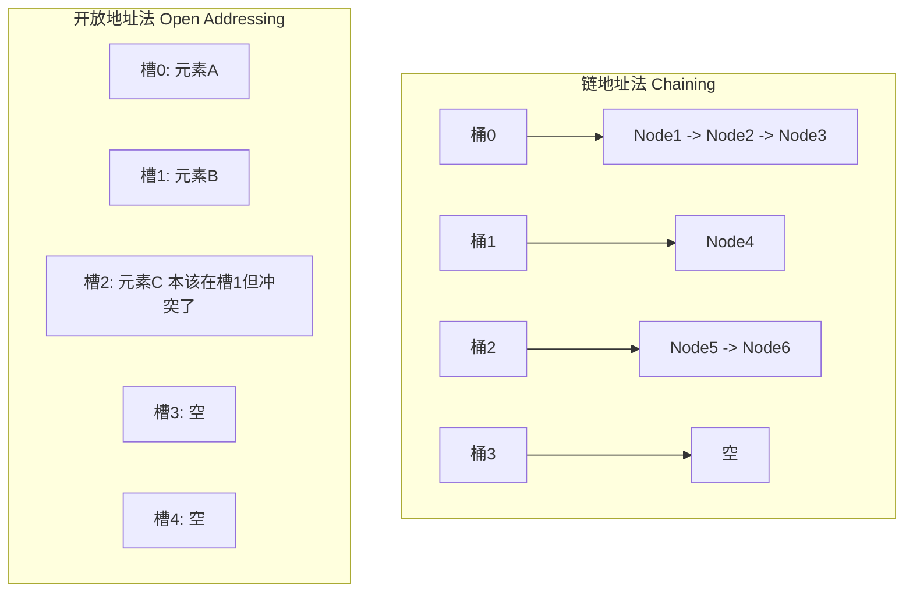
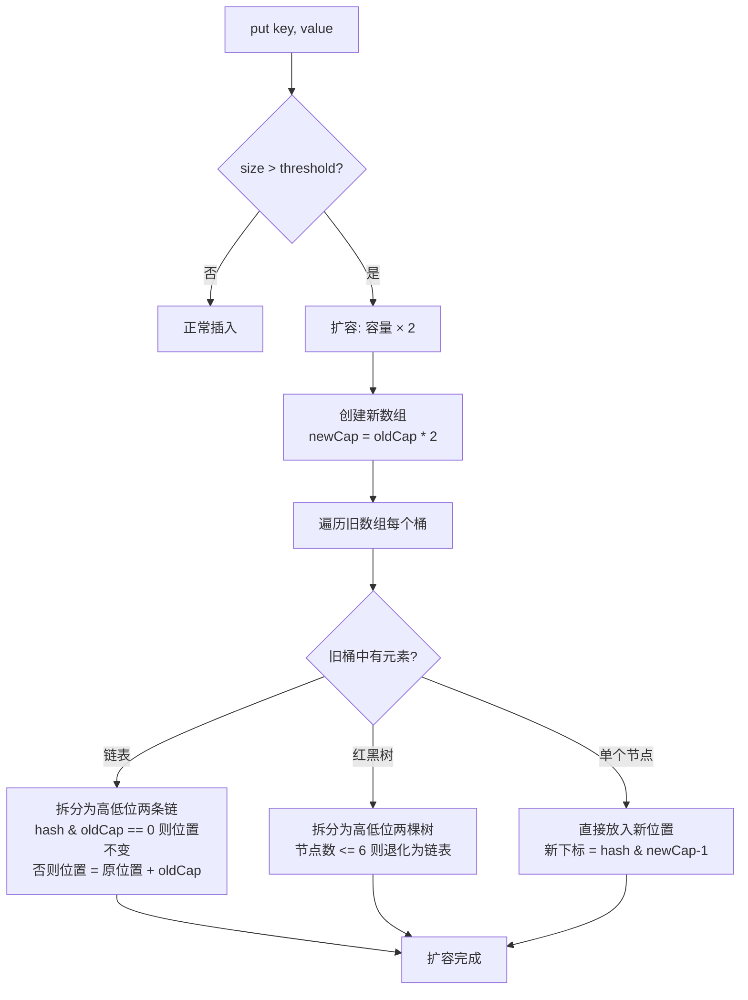

# 哈希表 —— 从索书号到 HashMap 源码

> 创建日期：2026-06-06
> 难度：⭐⭐⭐
> 前置知识：数组、链表基础、位运算基础

---

## ⭐ 面试重点速览

| 重点编号 | 核心内容 | 重要程度 |
|---------|---------|---------|
| 1 | 哈希冲突的两种解决方式：链地址法 vs 开放地址法 | **必考** |
| 2 | HashMap put/get 的完整流程（JDK 8） | **经典八股** |
| 3 | 扩容时机与 rehash 过程 | **高频** |
| 4 | 为什么链表长度 >= 8 转红黑树（泊松分布） | **源码级考点** |
| 5 | 一致性哈希原理与应用 | **分布式必问** |

---

## 一、应用场景 🎯

哈希表是**面试和工作中使用频率最高的数据结构**，没有之一。它的核心价值在于：**用空间换时间，实现 O(1) 的查找**。

| 应用场景 | 具体案例 | 说明 |
|---------|---------|-----|
| 快速查找 | 用户信息缓存（key = userId，value = User对象） | 核心场景 |
| 去重 | 统计网站 UV（独立访客）、判断元素是否重复 | HashSet |
| 计数 | 词频统计、投票计数 | HashMap<Character, Integer> |
| 缓存系统 | LRU Cache、DNS 缓存、浏览器缓存 | 哈希表 + 双向链表 |
| 索引映射 | 数据库的哈希索引（等值查询） | 适合 = 和 IN 操作 |
| 分布式系统 | 一致性哈希（负载均衡、分布式缓存） | 解决节点扩容问题 |
| 加密与安全 | 密码哈希存储（SHA-256、bcrypt） | 单向哈希 |
| 布隆过滤器 | 判断元素是否"可能存在"（URL 去重） | 基于哈希的位数组 |

---

## 二、核心原理 🔬

### 2.1 哈希表的核心思想

```mermaid
graph LR
    KEY[Key 键] --> HASH[哈希函数<br/>hashCode]
    HASH --> INDEX[数组下标<br/>index = hash & n-1]
    INDEX --> BUCKET[定位到桶 bucket]
    BUCKET --> CHECK{桶中有冲突?}
    CHECK -->|无冲突| DIRECT[直接存取 O(1)]
    CHECK -->|有冲突| RESOLVE[冲突解决]
    RESOLVE --> CHAIN[链地址法<br/>链表/红黑树遍历]
    RESOLVE --> OPEN[开放地址法<br/>线性探测找下一个空位]
```

### 2.2 哈希函数设计

```java
// JDK 8 HashMap 的哈希函数（扰动函数）
// 核心目的：让 hashCode 的高位也参与低位运算，减少冲突
static final int hash(Object key) {
    int h;
    // key.hashCode() 取原始哈希值
    // h >>> 16：无符号右移16位，取高位
    // 异或运算：让高位和低位混合
    return (key == null) ? 0 : (h = key.hashCode()) ^ (h >>> 16);
}

// 计算桶下标：hash & (n - 1)
// 因为 n 是 2 的幂次，n-1 的低位全是 1
// 等价于 hash % n，但位运算更快
int index = hash(key) & (table.length - 1);
```

**好的哈希函数三要素**：
1. **确定性**：同样的 key 永远得到同样的 hash
2. **均匀性**：哈希值均匀分布在桶空间中
3. **高效性**：计算速度快（位运算优于取模）

### 2.3 冲突解决策略对比



| 对比维度 | 链地址法 | 开放地址法 |
|---------|---------|----------|
| 实现方式 | 每个桶存一个链表/树 | 冲突时找下一个空槽 |
| 空间效率 | 额外指针开销 | 空间利用率高 |
| 删除操作 | 简单（链表删除） | 麻烦（需要惰性删除标记） |
| 缓存友好 | 较差（链表不连续） | 较好（连续内存） |
| 负载因子 | 可 > 1（链表可无限长） | 必须 < 1 |
| 代表实现 | Java HashMap | ThreadLocal |
| 适用场景 | 通用场景，元素数量不确定 | 内存受限、元素数量已知 |

### 2.4 HashMap 扩容流程



**扩容为什么是 2 倍？**
- 保证容量始终是 2 的幂次，`hash & (n-1)` 才能等效取模
- 扩容后元素的新位置只需判断一位：`hash & oldCap == 0 ? 原位 : 原位 + oldCap`

---

## 三、趣味解说 🎭

### 图书馆索书号

想象你走进一座巨大的图书馆，藏书 100 万册。你想找一本《算法导论》。

**如果书是随便放的**（无序数组），你只能从第一排书架开始，一本一本翻，找到猴年马月——这就是 O(n)。

**聪明的图书馆管理员**发明了"索书号"系统（哈希函数）。每本书根据书名、作者、分类，生成一个唯一的编号 TP301.6-43。这个编号直接告诉你：T 区（工业技术）、P 区（自动化）、301 号书架、第 6 层、第 43 号位置。你拿着索书号，直奔目标书架，一把拿出来——这就是 O(1)！

**但问题来了**：如果两本书恰好算出了同一个索书号呢？比如《算法导论》和《算法竞赛入门》的索书号撞车了——这就是**哈希冲突**。

这时候管理员有两个办法：

- **链地址法**：在 301 号书架的 43 号位置放一个"小书架"，所有冲突的书都排在这个小书架上。你找到 43 号位置后，再在小书架上翻一翻——如果冲突不多，这一步很快。
- **开放地址法**：43 号位置被占了？那就看看 44 号，44 号也被占了？再看 45 号...直到找到空位。

**但如果图书馆要扩建呢**（扩容）？原来的索书号规则是"除以 1000 取余数"，有 1000 个书架。现在书架增加到 2000 个，所有书的索书号都要重新计算——这就是 **rehash**。好在管理员很聪明，他发现：原来在 301 号书架的书，新位置要么还是 301，要么是 1301（301 + 1000），不需要全盘重新计算，只需要判断"新加的那一位"是 0 还是 1。

---

## 四、代码实现 💻

### 4.1 手写简化版 HashMap（链地址法）

```java
/**
 * 手写简化版 HashMap（链地址法 + 链表）
 * 只实现 put / get / remove，帮助理解核心原理
 */
public class SimpleHashMap<K, V> {
    // 默认初始容量 16（必须是 2 的幂次）
    private static final int DEFAULT_CAPACITY = 16;
    // 默认负载因子
    private static final float LOAD_FACTOR = 0.75f;

    private Node<K, V>[] table;  // 桶数组
    private int size;            // 当前元素个数
    private int threshold;       // 扩容阈值 = capacity * loadFactor

    /** 链表节点 */
    static class Node<K, V> {
        final int hash;
        final K key;
        V value;
        Node<K, V> next;

        Node(int hash, K key, V value, Node<K, V> next) {
            this.hash = hash;
            this.key = key;
            this.value = value;
            this.next = next;
        }
    }

    @SuppressWarnings("unchecked")
    public SimpleHashMap() {
        this.table = (Node<K, V>[]) new Node[DEFAULT_CAPACITY];
        this.threshold = (int) (DEFAULT_CAPACITY * LOAD_FACTOR);
    }

    /** 哈希函数：扰动 + 取模 */
    private int hash(K key) {
        if (key == null) return 0;
        int h = key.hashCode();
        // 高位参与低位运算，减少冲突
        return h ^ (h >>> 16);
    }

    /** 计算桶下标 */
    private int indexFor(int hash) {
        return hash & (table.length - 1); // 等价于 hash % table.length
    }

    /** put 操作 */
    public V put(K key, V value) {
        int hash = hash(key);
        int index = indexFor(hash);

        // 1. 检查该桶中是否已存在相同的 key
        Node<K, V> head = table[index];
        for (Node<K, V> e = head; e != null; e = e.next) {
            if (e.hash == hash && (e.key == key || key.equals(e.key))) {
                V oldValue = e.value;
                e.value = value; // 更新已有 key 的值
                return oldValue;
            }
        }

        // 2. 不存在相同的 key，头插法插入新节点
        table[index] = new Node<>(hash, key, value, head);
        size++;

        // 3. 检查是否需要扩容
        if (size > threshold) {
            resize();
        }
        return null;
    }

    /** get 操作 */
    public V get(K key) {
        int hash = hash(key);
        int index = indexFor(hash);

        // 遍历该桶的链表，查找匹配的 key
        for (Node<K, V> e = table[index]; e != null; e = e.next) {
            if (e.hash == hash && (e.key == key || key.equals(e.key))) {
                return e.value;
            }
        }
        return null; // 未找到
    }

    /** remove 操作 */
    public V remove(K key) {
        int hash = hash(key);
        int index = indexFor(hash);

        Node<K, V> prev = null;
        Node<K, V> curr = table[index];

        while (curr != null) {
            Node<K, V> next = curr.next;
            if (curr.hash == hash && (curr.key == key || key.equals(e.key))) {
                if (prev == null) {
                    table[index] = next; // 删除的是头节点
                } else {
                    prev.next = next;     // 删除的是中间/尾节点
                }
                size--;
                return curr.value;
            }
            prev = curr;
            curr = next;
        }
        return null;
    }

    /** 扩容：容量翻倍，重新分配所有元素 */
    @SuppressWarnings("unchecked")
    private void resize() {
        Node<K, V>[] oldTable = table;
        int oldCap = oldTable.length;
        int newCap = oldCap * 2;

        Node<K, V>[] newTable = (Node<K, V>[]) new Node[newCap];
        threshold = (int) (newCap * LOAD_FACTOR);

        // 遍历旧数组的每个桶
        for (int i = 0; i < oldCap; i++) {
            Node<K, V> e = oldTable[i];
            if (e == null) continue;

            // JDK 8 优化：将链表拆分为"保持原位"和"移到新位"两条链
            // 判断条件：hash & oldCap == 0 则位置不变，否则位置 = 原位置 + oldCap
            Node<K, V> loHead = null, loTail = null; // 低位链（位置不变）
            Node<K, V> hiHead = null, hiTail = null; // 高位链（位置 + oldCap）

            while (e != null) {
                Node<K, V> next = e.next;
                if ((e.hash & oldCap) == 0) {
                    // 低位链
                    if (loTail == null) loHead = e;
                    else loTail.next = e;
                    loTail = e;
                } else {
                    // 高位链
                    if (hiTail == null) hiHead = e;
                    else hiTail.next = e;
                    hiTail = e;
                }
                e = next;
            }

            // 将两条链放入新数组
            if (loTail != null) {
                loTail.next = null;
                newTable[i] = loHead;               // 位置不变
            }
            if (hiTail != null) {
                hiTail.next = null;
                newTable[i + oldCap] = hiHead;      // 新位置 = 原位置 + oldCap
            }
        }
        table = newTable;
    }

    public int size() { return size; }
}
```

### 4.2 一致性哈希（分布式场景）

```java
/**
 * 一致性哈希的核心思想
 *
 * 问题背景：
 *   分布式缓存中有 N 台服务器，需要对 key 做哈希取模分配到不同服务器。
 *   如果某台服务器宕机或新增服务器，取模的基数 N 变了，
 *   几乎所有 key 的映射都会改变，导致大量缓存失效（缓存雪崩）。
 *
 * 一致性哈希的解决方案：
 *   将哈希空间组织成一个环（0 ~ 2^32-1），
 *   服务器和 key 都映射到这个环上，
 *   key 沿顺时针方向找到最近的服务器。
 *   加减服务器只影响环上相邻的一小段 key。
 *
 * 虚拟节点优化：
 *   每台物理服务器映射多个虚拟节点，均匀分布在环上，
 *   避免数据倾斜（某些服务器负责过多 key）。
 */

// 一致性哈希简化示例（不含虚拟节点）
public class ConsistentHashing {
    // 有序映射：哈希值 -> 服务器节点名
    private final TreeMap<Integer, String> ring = new TreeMap<>();

    /** 添加服务器节点到哈希环 */
    public void addNode(String node) {
        int hash = hash(node);
        ring.put(hash, node);
        System.out.println("节点 " + node + " 加入环，哈希值: " + hash);
    }

    /** 移除服务器节点 */
    public void removeNode(String node) {
        int hash = hash(node);
        ring.remove(hash);
    }

    /** 根据 key 找到应该路由到哪个服务器 */
    public String getNode(String key) {
        if (ring.isEmpty()) return null;
        int hash = hash(key);
        // 沿顺时针找第一个 >= hash 的节点
        Map.Entry<Integer, String> entry = ring.ceilingEntry(hash);
        if (entry == null) {
            // 超出环的最大值，回到环的起点（第一个节点）
            entry = ring.firstEntry();
        }
        return entry.getValue();
    }

    private int hash(String key) {
        // 使用 MD5 或其他哈希算法，这里简化为 hashCode
        return Math.abs(key.hashCode());
    }
}
```

### 4.3 JDK 8 HashMap 关键点速查

```java
/**
 * JDK 8 HashMap 核心参数与行为
 *
 * TREEIFY_THRESHOLD   = 8   // 链表转红黑树阈值（节点数 >= 8）
 * UNTREEIFY_THRESHOLD = 6   // 红黑树退化为链表阈值（节点数 <= 6）
 * MIN_TREEIFY_CAPACITY = 64 // 最小树化容量（数组长度 < 64 时优先扩容）
 *
 * 为什么是 8？—— 泊松分布
 *   在负载因子 0.75 且哈希函数均匀的前提下，
 *   单个桶中元素个数达到 8 的概率约为 0.00000006（亿分之六），
 *   概率极低，所以用 8 作为阈值是合理的。
 *
 * 插入流程（put）：
 *   1. 计算 hash = key.hashCode() ^ (key.hashCode() >>> 16)
 *   2. 计算 index = hash & (table.length - 1)
 *   3. 桶为空 -> 直接插入
 *   4. 桶非空 -> 遍历链表/红黑树
 *      - 找到相同 key -> 更新 value
 *      - 没找到 -> 尾插法插入
 *   5. 插入后链表长度 >= 8 且数组长度 >= 64 -> 树化
 *   6. size > threshold -> 扩容
 */
```

---

## 五、优缺点 ⚖️

| 维度 | 评价 | 详细说明 |
|-----|-----|---------|
| 查找速度 | **极快** — 平均 O(1) | 只需一次哈希计算 + 一次数组访问 |
| 插入速度 | **极快** — 平均 O(1) | 同上，不需要像数组那样移动元素 |
| 删除速度 | **极快** — 平均 O(1) | 链表删除 O(1)，红黑树删除 O(log n) |
| 遍历有序性 | **无** | 哈希表不保证遍历顺序 |
| 空间效率 | **较差** | 需要预留空间（负载因子通常 0.75），扩容时空间翻倍 |
| 最坏情况 | **O(n)** | 哈希函数设计差或恶意构造 key 导致大量冲突 |
| 线程安全 | **非线程安全** | HashMap 不是线程安全的，并发用 ConcurrentHashMap |

| 对比项 | HashMap | TreeMap | LinkedHashMap |
|-------|---------|---------|--------------|
| 查找速度 | O(1) | O(log n) | O(1) |
| 有序性 | 无序 | 按 key 自然序 | 按插入顺序或访问顺序 |
| 内存开销 | 中 | 高（红黑树节点） | 中（额外双向链表） |
| 适用场景 | 通用快速查找 | 需要有序遍历/范围查询 | LRU 缓存 |

---

## 六、面试高频题 📝

| 题目 | LeetCode 题号 | 核心解法 | 难度 |
|-----|-------------|---------|-----|
| 两数之和 | 1 | HashMap 一次遍历 | 简单 |
| 字母异位词分组 | 49 | HashMap 计数/排序 | 中等 |
| 最长连续序列 | 128 | HashSet + 只从起点开始数 | 中等 |
| 复制带随机指针的链表 | 138 | HashMap 存储新旧节点映射 | 中等 |
| LRU 缓存 | 146 | HashMap + 双向链表 | 中等 |
| 存在重复元素 | 217 | HashSet 去重 | 简单 |
| 和为 K 的子数组 | 560 | HashMap 前缀和 + 计数 | 中等 |
| 设计哈希映射 | 706 | 手写链地址法 | 简单 |

### 面试官追问

> **Q**: HashMap 的 key 可以用可变对象吗？
> **A**: **强烈不建议**。如果 key 的 hashCode() 在放入 HashMap 后发生了变化，那么通过新 hashCode 计算出的桶下标与原来不同，就会导致找不到该 key，造成内存泄漏。所以 String、Integer 等不可变类是最佳 key 选择。

> **Q**: HashMap 在多线程环境下会有什么问题？
> **A**: JDK 1.7 中扩容时使用头插法，多线程并发扩容可能形成**环形链表**，导致 `get()` 时 CPU 100%（死循环）。JDK 1.8 改为尾插法解决了死循环问题，但仍有数据覆盖问题（put 时的竞态条件）。并发场景必须用 ConcurrentHashMap。

> **Q**: 为什么负载因子默认是 0.75？
> **A**: 这是时间与空间的折中。负载因子越高，空间利用率越高，但冲突概率越大（查找变慢）；负载因子越低，冲突越少，但空间浪费越大。0.75 是经过大量实验得出的最佳平衡点。

> **Q**: 一致性哈希中虚拟节点有什么作用？
> **A**: 防止数据倾斜。如果只有少量物理节点分布在环上，它们之间的间隔可能不均匀，导致某些节点负责大量 key。虚拟节点将每个物理节点映射为多个虚拟节点均匀分布在环上，使负载更均衡。

---

## 七、常见误区 ❌

| 误区 | 真相 | 解释 |
|-----|-----|-----|
| "HashMap 是无序的，所以遍历顺序随机" | 不是随机，是**不确定** | 遍历顺序取决于桶的分布和插入顺序，不是真的随机 |
| "hashCode 相同则 equals 一定相同" | **不一定** | hashCode 相同是 equals 相同的必要条件，不是充分条件（哈希冲突） |
| "equals 相同则 hashCode 一定相同" | **必须相同** | 这是 Java 规范强制要求的，否则 HashMap 无法正常工作 |
| "重写 equals 可以不改 hashCode" | **绝对不行！** | 必须同时重写 hashCode()，否则 HashMap/HashSet 行为异常 |
| "HashMap 的容量可以是任意值" | 必须是 **2 的幂次** | 构造函数传的值会被调整为最近的 2 的幂次 |
| "HashSet 的 add 是 O(1) 就一定比 TreeSet 快" | 不一定 | 在数据量小且需要有序时，TreeSet 的 O(log n) 可能更合适 |
| "HashMap 扩容时所有元素重新 hash" | 不是重新 hash | JDK 8 中利用 `hash & oldCap` 判断新位置，元素在原位或原位+oldCap |
| "一致性哈希能完全解决缓存热点" | 不能完全解决 | 一致性哈希主要解决**扩容/缩容时大量缓存失效**的问题，热点 key 需要其他方案 |

### 经典反例

```java
// ❌ 经典错误：重写 equals 但没有重写 hashCode
class Person {
    String name;
    int age;

    @Override
    public boolean equals(Object o) {
        if (this == o) return true;
        if (!(o instanceof Person)) return false;
        Person p = (Person) o;
        return age == p.age && Objects.equals(name, p.name);
    }
    // 忘了重写 hashCode()！两个 equals 相等的对象 hashCode 可能不同！
}

Person p1 = new Person("张三", 20);
Person p2 = new Person("张三", 20);
HashMap<Person, String> map = new HashMap<>();
map.put(p1, "北京");
System.out.println(map.get(p2)); // 输出 null！因为 p1 和 p2 的 hashCode 不同

// ✅ 正确做法：同时重写 equals 和 hashCode
// 使用 IDE 自动生成，或者 Objects.hash(name, age)
```

```java
// ❌ 面试常见错误：用可变对象做 HashMap 的 key
HashMap<List<Integer>, String> map = new HashMap<>();
List<Integer> key = new ArrayList<>(Arrays.asList(1, 2, 3));
map.put(key, "value");
key.add(4); // key 的内容变了！hashCode 也变了！
System.out.println(map.get(key)); // 很可能输出 null！
```

---

> **关联阅读**：
> - [数据结构全景](./index.md) —— 查看所有数据结构的复杂度速查表
> - [树结构对比](./tree.md) —— 了解 TreeMap 底层红黑树的实现
> - LeetCode 题单：哈希表相关题目合集（1, 49, 128, 146, 560）