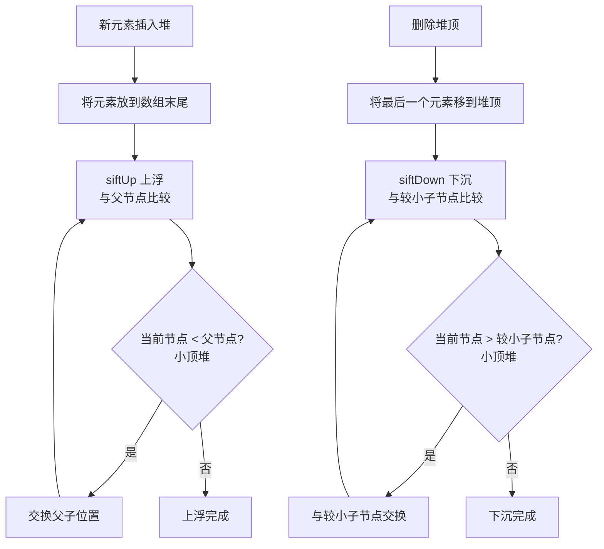

# 堆（优先队列）—— 优先级决定一切

> 创建日期：2026-06-06
> 难度：⭐⭐⭐
> 前置知识：二叉树基础、数组、递归思想

---

## ⭐ 面试重点速览

| 重点编号 | 核心内容 | 重要程度 |
|---------|---------|---------|
| 1 | 堆的定义与性质（完全二叉树 + 堆序性） | **基础必问** |
| 2 | siftUp（上浮）和 siftDown（下沉）的手写代码 | **高频手撕** |
| 3 | heapify（堆化）的时间复杂度是 O(n) 而非 O(n log n) | **进阶考点** |
| 4 | Top K 问题的两种解法对比（堆 vs 快排 partition） | **必考题** |
| 5 | Java PriorityQueue 的默认行为与自定义比较器 | **日常使用** |

---

## 一、应用场景 🎯

堆（Heap）本质上是一种**特殊的完全二叉树**，它保证父节点与子节点之间的大小关系（堆序性），但不保证兄弟节点之间的关系。

| 应用场景 | 具体案例 | 使用的堆类型 |
|---------|---------|------------|
| 优先队列 | 操作系统任务调度、网络包优先级处理 | 通常用小顶堆 |
| Top K 问题 | 找出排行榜前 100 名、热门搜索词 TOP 10 | 小顶堆（维护 K 个最大值） |
| 求中位数 | 数据流中的中位数（LeetCode 295） | 大顶堆 + 小顶堆 |
| 图算法 | Dijkstra 最短路径、Prim 最小生成树 | 小顶堆 |
| 定时器 | 延迟任务调度（最近到期的任务优先执行） | 小顶堆 |
| 哈夫曼编码 | 数据压缩中构建哈夫曼树 | 小顶堆 |
| 合并 K 个有序链表 | LeetCode 23 | 小顶堆 |
| 外部排序 | 多路归并排序 | 小顶堆 |

---

## 二、核心原理 🔬

### 2.1 堆的结构定义

堆是一种**完全二叉树**，同时满足**堆序性**：

- **大顶堆（Max Heap）**：父节点的值 >= 每个子节点的值。根节点是最大值。
- **小顶堆（Min Heap）**：父节点的值 <= 每个子节点的值。根节点是最小值。

核心特性：堆用**数组**存储（利用完全二叉树的性质），对于下标 i 的节点：
- 父节点下标：`(i - 1) / 2`
- 左子节点下标：`2 * i + 1`
- 右子节点下标：`2 * i + 2`

### 2.2 堆的核心操作流程图



### 2.3 heapify 的 O(n) 证明（面试加分项）

```mermaid
graph TD
    HEAPIFY[heapify 堆化] --> BOTTOM[从最后一个非叶子节点开始<br/>下标: n/2 - 1]
    BOTTOM --> LOOP[对每个非叶子节点执行 siftDown]
    LOOP --> PROOF["关键：越靠近底层的节点越多<br/>但 siftDown 的次数越少<br/>总复杂度 = 0*n/2 + 1*n/4 + 2*n/8 + ... = O(n)"]

    subgraph "为什么不是 O(n log n)?"
        WRONG[常见误解: n个节点 × log n层 = O(n log n)]
        CORRECT[正确: 底层节点只需要少量下沉<br/>粗略计算 Σ 每层节点数×层高 = O(n)]
    end
```

数学推导：假设树高为 h，第 i 层有 2^i 个节点，每个节点最多下沉 (h-i) 次：
- 总交换次数 = sum(i=0 to h) 2^i * (h-i) = 2^{h+1} - h - 2 = n - log(n+1) ≈ O(n)

---

## 三、趣味解说 🎭

### 医院急诊分诊台

晚上 10 点，市中心医院的急诊科。候诊大厅里坐着各种病人：

- 一位大叔手指割伤，血流不止
- 一个小孩高烧 39.5 度，迷迷糊糊
- 一位小伙子脚踝扭伤，走路一瘸一拐
- 一位大妈说"就是有点头晕"

他们并不是按先来后到的顺序看病的！

分诊台护士会给每个病人贴一个**分诊标签**：红色（危急）、黄色（紧急）、绿色（普通）。红色标签的病人不管什么时候来，都**优先**被叫进去——哪怕他才刚坐下，而绿色标签的病人已等了两个小时。

**这就是堆（优先队列）的核心思想：不是按到达时间的 FIFO（普通队列），而是按优先级的高低来决定谁先出队。**

堆的数据结构就是负责高效地维护这个"优先级排序"：

- **siftUp（上浮）** = 新来了一个红色危急病人，护士需要把他"往前提"，插到所有黄/绿色病人前面
- **siftDown（下沉）** = 红色病人被叫进去看诊后，原来后面的病人需要重新排序，找到下一个最紧急的
- **堆顶** = 候诊大厅里当前最危急的那个病人（优先级最高/值最小）

你可能会问："为什么不直接用排序？每次来一个新病人都全排一遍？"

答案是——**堆比全排序高效太多了**。排序要 O(n log n)，而堆只维护"最危急的那个"，插入只需要 O(log n)。急诊科不需要知道所有病人的完整排序，只需要知道"下一个该谁看"就够了。

---

## 四、代码实现 💻

### 4.1 手写最小堆（小顶堆）

```java
/**
 * 手写最小堆（小顶堆）实现
 * 使用数组存储，核心操作：siftUp 和 siftDown
 */
public class MinHeap {
    private int[] heap;      // 存储堆元素的数组
    private int size;        // 当前堆中元素个数
    private int capacity;    // 堆的最大容量

    public MinHeap(int capacity) {
        this.capacity = capacity;
        this.heap = new int[capacity];
        this.size = 0;
    }

    // ==================== 辅助方法 ====================

    /** 获取父节点下标 */
    private int parent(int i) { return (i - 1) / 2; }

    /** 获取左子节点下标 */
    private int leftChild(int i) { return 2 * i + 1; }

    /** 获取右子节点下标 */
    private int rightChild(int i) { return 2 * i + 2; }

    // ==================== 核心操作 ====================

    /**
     * 插入元素 —— O(log n)
     * 策略：放到末尾，然后"上浮"到正确位置
     */
    public void insert(int val) {
        if (size >= capacity) {
            throw new IllegalStateException("堆已满！");
        }
        heap[size] = val;   // 1. 将新元素放到数组末尾
        siftUp(size);       // 2. 从末尾位置开始上浮
        size++;
    }

    /**
     * 上浮操作：将下标为 i 的元素向上移动到正确位置
     * 类比：新来的危急病人不断和前面的病人比较优先级，往前插队
     */
    private void siftUp(int i) {
        // 不是根节点，且当前节点比父节点小（小顶堆：父 <= 子）
        while (i > 0 && heap[i] < heap[parent(i)]) {
            swap(i, parent(i));  // 与父节点交换
            i = parent(i);       // 继续向上比较
        }
    }

    /**
     * 删除堆顶（最小值） —— O(log n)
     * 策略：用最后一个元素替换堆顶，然后"下沉"到正确位置
     */
    public int extractMin() {
        if (size == 0) {
            throw new IllegalStateException("堆为空！");
        }
        int min = heap[0];           // 1. 记录堆顶（最小值）
        heap[0] = heap[size - 1];    // 2. 将最后一个元素移到堆顶
        size--;
        siftDown(0);                 // 3. 从堆顶开始下沉
        return min;
    }

    /**
     * 下沉操作：将下标为 i 的元素向下移动到正确位置
     * 类比：红色病人被叫走后，后面的人向前补位，重新找到最紧急的
     */
    private void siftDown(int i) {
        int minIndex = i;
        while (true) {
            int left = leftChild(i);
            int right = rightChild(i);

            // 找到当前节点、左子、右子三者中最小的那个
            if (left < size && heap[left] < heap[minIndex]) {
                minIndex = left;
            }
            if (right < size && heap[right] < heap[minIndex]) {
                minIndex = right;
            }

            // 如果当前节点已经是最小的，停止下沉
            if (minIndex == i) {
                break;
            }

            swap(i, minIndex);  // 与较小子节点交换
            i = minIndex;       // 继续向下
        }
    }

    // ==================== 堆化 heapify ====================

    /**
     * 堆化：将一个无序数组原地构建成堆 —— O(n)
     * 关键：从最后一个非叶子节点开始，向前依次执行 siftDown
     * 为什么是 O(n) 而不是 O(n log n)？
     *   越靠近底层的节点越多，但它们下沉次数很少
     */
    public void heapify(int[] arr) {
        this.heap = arr;
        this.size = arr.length;
        // 从最后一个非叶子节点开始（下标为 size/2 - 1）
        for (int i = size / 2 - 1; i >= 0; i--) {
            siftDown(i);
        }
    }

    // ==================== 工具方法 ====================

    /** 获取堆顶（不删除） */
    public int peek() {
        if (size == 0) throw new IllegalStateException("堆为空！");
        return heap[0];
    }

    public int getSize() { return size; }
    public boolean isEmpty() { return size == 0; }

    private void swap(int i, int j) {
        int temp = heap[i];
        heap[i] = heap[j];
        heap[j] = temp;
    }
}
```

### 4.2 Top K 问题 —— 堆的经典应用

```java
/**
 * Top K 问题：找出数组中第 K 大的元素（LeetCode 215）
 *
 * 解法一：小顶堆法 —— 时间复杂度 O(n log K)，空间 O(K)
 * 思路：维护一个大小为 K 的小顶堆，
 *       堆顶始终是"当前 K 个元素中最小的那个"
 *       遍历完后，堆顶就是第 K 大的元素
 *
 * 解法二：快速选择（QuickSelect）—— 时间复杂度 O(n) 平均，空间 O(1)
 * 思路：利用快排的 partition 思想，不断缩小查找范围
 */
public class TopK {

    /**
     * 小顶堆解法 —— 找第 K 大的元素
     * 适合 K 较小的情况，也是大数据流场景的唯一选择
     */
    public int findKthLargest_Heap(int[] nums, int k) {
        // PriorityQueue 默认是小顶堆
        PriorityQueue<Integer> minHeap = new PriorityQueue<>();

        for (int num : nums) {
            minHeap.offer(num);
            // 保持堆的大小 <= K
            if (minHeap.size() > k) {
                minHeap.poll(); // 弹出最小的那个
            }
        }
        // 此时堆顶就是 K 个最大元素中最小的 = 第 K 大
        return minHeap.peek();
    }

    /**
     * 找第 K 小的元素 —— 用大顶堆
     * PriorityQueue 默认小顶堆，需要传入 Collections.reverseOrder()
     */
    public int findKthSmallest(int[] nums, int k) {
        // 大顶堆：队头是最大值
        PriorityQueue<Integer> maxHeap = new PriorityQueue<>(Collections.reverseOrder());

        for (int num : nums) {
            maxHeap.offer(num);
            if (maxHeap.size() > k) {
                maxHeap.poll(); // 弹出最大的那个
            }
        }
        return maxHeap.peek(); // K 个最小元素中最大的 = 第 K 小
    }
}
```

### 4.3 Java PriorityQueue 源码关键点

```java
/**
 * Java PriorityQueue 源码分析关键点
 *
 * 1. 默认是小顶堆（队头最小）
 * 2. 底层用 Object[] 数组存储，初始容量 11
 * 3. 扩容策略：size < 64 时扩容为 2*old+2；size >= 64 时扩容为 1.5*old
 * 4. 插入时调用 siftUp，删除时调用 siftDown
 * 5. 非线程安全，并发场景用 PriorityBlockingQueue
 */

// 自定义比较器示例：按字符串长度排序
PriorityQueue<String> pq = new PriorityQueue<>((a, b) -> a.length() - b.length());

// 自定义比较器：大顶堆
PriorityQueue<Integer> maxHeap = new PriorityQueue<>((a, b) -> b - a);
// 或
PriorityQueue<Integer> maxHeap2 = new PriorityQueue<>(Comparator.reverseOrder());

// 自定义对象放入 PriorityQueue 的两种方式：
// 方式一：对象实现 Comparable 接口
class Task implements Comparable<Task> {
    int priority;
    @Override
    public int compareTo(Task other) {
        return this.priority - other.priority; // 优先级小的先执行
    }
}

// 方式二：构造时传入 Comparator（推荐，更灵活）
PriorityQueue<Task> taskQueue = new PriorityQueue<>(
    Comparator.comparingInt(t -> t.priority)
);
```

---

## 五、优缺点 ⚖️

| 维度 | 评价 | 详细说明 |
|-----|-----|---------|
| 取最值速度 | **极快** — O(1) | 堆顶直接就是最大/最小值，无需任何计算 |
| 插入删除速度 | **较快** — O(log n) | 只需要沿树的一条路径调整，不需要全排序 |
| 空间效率 | **优秀** | 用数组存储，无指针开销，空间局部性好 |
| 构建速度 | **优秀** — heapify O(n) | 比逐个插入 O(n log n) 更快 |
| 搜索任意元素 | **差** — O(n) | 堆只维护父子关系，不支持二分查找 |
| 删除任意元素 | **差** — O(n) | 需要先找到元素（O(n)），再 siftDown（O(log n)） |
| 有序遍历 | **不支持** | 堆不保证兄弟节点之间的顺序，无法顺序遍历 |
| 适用场景 | 需要频繁取最值、不关心全局排序 | Top K、优先队列、Dijkstra 等 |

| 对比项 | 堆 | 排序数组 | 二叉搜索树 |
|-------|---|---------|----------|
| 取最值 | O(1) | O(1) | O(log n) |
| 插入 | O(log n) | O(n) | O(log n) 平均 |
| 删除最值 | O(log n) | O(1) 删尾部 | O(log n) |
| 搜索任意值 | O(n) | O(log n) 二分 | O(log n) 平均 |
| 有序遍历 | 不支持 | O(n) | O(n) |
| 空间连续性 | 好（数组） | 好（数组） | 差（指针） |

---

## 六、面试高频题 📝

| 题目 | LeetCode 题号 | 核心解法 | 难度 |
|-----|-------------|---------|-----|
| 数组中的第K个最大元素 | 215 | 小顶堆（大小 K）或 QuickSelect | 中等 |
| 前 K 个高频元素 | 347 | 哈希表统计 + 小顶堆 | 中等 |
| 合并 K 个升序链表 | 23 | 小顶堆维护 K 个头节点 | 困难 |
| 数据流的中位数 | 295 | 大顶堆 + 小顶堆 | 困难 |
| 数据流中的第 K 大元素 | 703 | 小顶堆（固定大小 K） | 简单 |
| 有序矩阵中第 K 小的元素 | 378 | 小顶堆（类似多路归并） | 中等 |
| 最接近原点的 K 个点 | 973 | 大顶堆维护 K 个最近点 | 中等 |
| 根据字符出现频率排序 | 451 | 哈希表 + 大顶堆 | 中等 |

### 面试官追问

> **Q**: Top K 问题，堆和 QuickSelect 怎么选？
> **A**: 如果数据可以全部加载到内存，QuickSelect 平均 O(n) 更快。但如果数据是流式的（不断有新数据进来），或者 K 很小而 n 很大，堆 O(n log K) 更优。另外堆适合需要持续输出 Top K 的场景（如实时排行榜）。

> **Q**: heapify 为什么是 O(n)？展开证明。
> **A**: 设树高为 h，第 i 层有最多 2^i 个节点，每个节点最多下沉 (h - i) 次。总交换次数 = sum(2^i * (h - i)) for i = 0 to h。令 j = h - i，则 = sum(2^(h-j) * j) = 2^h * sum(j / 2^j)。已知 sum(j/2^j) <= 2，所以总次数 <= 2 * 2^h = 2n = O(n)。

> **Q**: 为什么 Java PriorityQueue 默认是小顶堆而不是大顶堆？
> **A**: 因为优先队列最常见的用途是"最小值优先"（如 Dijkstra 算法、任务调度中优先级数值越小越优先），而且小顶堆的语义更符合"小 = 优先"的直觉。

---

## 七、常见误区 ❌

| 误区 | 真相 | 解释 |
|-----|-----|-----|
| "堆就是优先队列" | 不完全对 | 堆是**数据结构**，优先队列是**抽象数据类型**。堆是实现优先队列最常用的方式，但也可以用其他结构实现 |
| "PriorityQueue 默认大顶堆" | 默认**小顶堆** | 队头是最小元素。`poll()` 返回最小值 |
| "堆可以用二分查找" | **不能** | 堆只保证父子关系，不保证兄弟关系，不是二叉搜索树 |
| "heapify 的时间复杂度是 O(n log n)" | 实际是 **O(n)** | 见上文证明，这是一个经典的数学陷阱 |
| "堆中元素是全局有序的" | **不是** | 堆只保证堆顶是最大/最小值，其他位置无序 |
| "堆排序不稳定" | 对，但... | 堆排序确实不稳定，因为堆的交换会破坏相对顺序 |
| "大顶堆的根是全局最小" | 大顶堆根是**最大** | 记反了！大顶堆 = 根最大，小顶堆 = 根最小 |
| "PriorityQueue 线程安全" | **不是** | 需要线程安全用 `PriorityBlockingQueue` |

### 实战反例

```java
// ❌ 经典错误：把 PriorityQueue 当成有序集合遍历
PriorityQueue<Integer> pq = new PriorityQueue<>();
pq.offer(3);
pq.offer(1);
pq.offer(2);
for (int val : pq) {
    System.out.print(val + " "); // 输出可能是 1 3 2，不是 1 2 3！
}
// PriorityQueue 的迭代器不保证顺序，只有 poll() 才保证按优先级出队

// ✅ 正确做法：用 poll() 依次取出
while (!pq.isEmpty()) {
    System.out.print(pq.poll() + " "); // 输出: 1 2 3 ✓
}

// ❌ 错误：用堆维护 Top K 时，使用大顶堆
// 大顶堆的堆顶是最大的，poll() 弹出的是最大值
// 这样无法只保留 K 个最小值
PriorityQueue<Integer> maxHeap = new PriorityQueue<>(Collections.reverseOrder());
for (int num : nums) {
    maxHeap.offer(num);
    if (maxHeap.size() > k) {
        maxHeap.poll(); // 弹出的是最大的！保留了 K 个最小值，而不是最大值！
    }
}
// 想要 Top K 大（第 K 大），应该用小顶堆
```

---

> **关联阅读**：
> - [数据结构全景](./index.md) —— 了解所有数据结构的复杂度速查表
> - [树结构对比](./tree.md) —— 深入理解二叉树的各种变体
> - LeetCode 题单：堆相关题目合集（215, 347, 23, 295, 703）