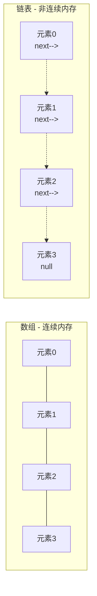
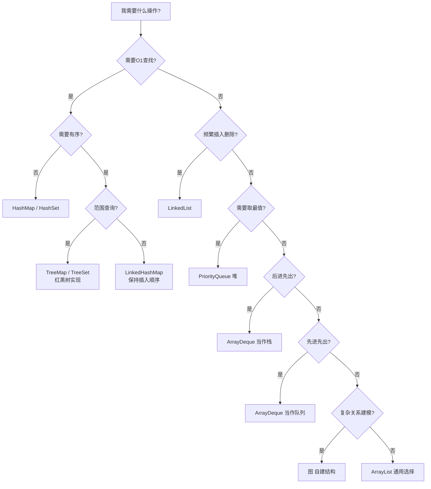

# 数据结构全景

> 创建日期：2026-06-06
> 难度：⭐⭐
> 前置知识：Java 基础、基本算法概念

---

## ⭐ 面试重点速览

| 重点编号 | 核心内容 | 重要程度 |
|---------|---------|---------|
| 1 | 各数据结构的增删改查时间复杂度 | **必考** |
| 2 | 数据结构选型决策——什么场景用什么结构 | **高频** |
| 3 | 数组与链表的本质区别（内存连续性） | **基础送分题** |
| 4 | 哈希表、树、堆的对比与应用场景 | **进阶必问** |
| 5 | Java 集合框架底层数据结构对应关系 | **源码级考点** |

---

## 一、应用场景 🎯

数据结构的本质是**数据在内存中的组织方式**。不同的组织方式，直接决定了操作的效率。

| 数据结构 | 典型应用场景 | Java 代表类 |
|---------|-------------|------------|
| 数组 | 随机访问频繁、大小固定的场景（如矩阵运算） | `int[]`, `String[]` |
| 链表 | 频繁插入删除、不需要随机访问（如 LRU 缓存） | `LinkedList` |
| 栈 | 函数调用栈、括号匹配、浏览器的前进后退 | `Stack`, `ArrayDeque` |
| 队列 | 任务调度、消息队列、BFS | `LinkedList`, `ArrayDeque` |
| 哈希表 | 快速查找、去重、缓存（如 DNS 缓存） | `HashMap`, `HashSet` |
| 堆 | Top K、优先队列、Dijkstra 算法 | `PriorityQueue` |
| 树 | 文件系统、数据库索引、路由器路由表 | `TreeMap`, `TreeSet` |
| 图 | 社交网络、地图导航、网络拓扑 | 无内置（需自建） |

### 一句话选型口诀

> 快速查找用哈希，有序操作用树，Top K 用堆，层级遍历用队列，回溯递归用栈，一对多关系用图。

---

## 二、核心原理 🔬

### 2.1 数据结构思维导图

```mermaid
mindmap
  root((数据结构))
    线性结构
      数组
        静态数组 int[]
        动态数组 ArrayList
      链表
        单向链表
        双向链表 LinkedList
        循环链表
      栈
        顺序栈 ArrayDeque
        链式栈
      队列
        普通队列
        双端队列 Deque
        循环队列
    非线性结构
      哈希表
        HashMap
        HashSet
        LinkedHashMap
      树
        二叉树
        二叉搜索树 BST
        平衡二叉树 AVL
        红黑树 TreeMap
        B树 / B+树
        堆 PriorityQueue
      图
        有向图
        无向图
        加权图
    高级结构
      跳表 SkipList
      并查集 UnionFind
      Trie 前缀树
      LRU Cache
      布隆过滤器
```

### 2.2 时间复杂度速查表（核心中的核心）

| 数据结构 | 访问 | 搜索 | 插入 | 删除 | 额外说明 |
|---------|-----|-----|-----|-----|---------|
| 数组 | O(1) | O(n) | O(n) | O(n) | 尾部插入摊销 O(1) |
| 链表 | O(n) | O(n) | O(1) | O(1) | 已知节点位置时 O(1) |
| 栈 | O(n) | O(n) | O(1) | O(1) | 只能操作栈顶 |
| 队列 | O(n) | O(n) | O(1) | O(1) | 只能操作队头队尾 |
| 哈希表（无冲突） | N/A | O(1) | O(1) | O(1) | 最坏 O(n)，取决于哈希函数 |
| 二叉搜索树 | O(log n) | O(log n) | O(log n) | O(log n) | 最坏退化为 O(n)（链状） |
| AVL 树 | O(log n) | O(log n) | O(log n) | O(log n) | 严格平衡，旋转开销大 |
| 红黑树 | O(log n) | O(log n) | O(log n) | O(log n) | 近似平衡，插入更高效 |
| 堆（二叉堆） | O(1) 取最值 | O(n) | O(log n) | O(log n) | 不支持任意元素快速搜索 |
| B+ 树 | O(log n) | O(log n) | O(log n) | O(log n) | 磁盘 IO 友好，数据库索引首选 |

### 2.3 内存模型差异（为什么要知道）



- **数组**：内存连续，CPU 缓存友好（可以利用空间局部性），但扩容需要拷贝全部数据
- **链表**：内存不连续，插入删除 O(1)，但每次访问都要遍历，缓存不友好

---

## 三、趣味解说 🎭

### 超市储物柜 vs 酒店行李牌

想象你去超市购物：

- **数组 = 超市储物柜**：一整排编号的柜子（0号、1号、2号...），你要取3号柜里的东西，直接走到3号位置就行——这就是 O(1) 随机访问。但想在1号和2号之间插入一个新柜子？对不起，得把2号往后的所有柜子往后挪——这就是 O(n) 插入。

- **链表 = 酒店的行李牌传递**：每个行李上挂一个行李牌，写着下一个行李在哪儿。前台不需要把所有行李排成一排——新行李只要改一下行李牌就行（O(1) 插入）。但想找第5个行李？得从第1个开始数（O(n) 访问）。

- **哈希表 = 图书馆索书号**：每本书有一个索书号，通过编号公式（哈希函数）直接算出它在哪个书架、第几层。理想情况下，一本书一次就能找到。但如果两本书算出了同一个位置（哈希冲突），就得在那个位置多找一会儿。

- **栈 = 一摞盘子**：后放上去的先拿下来——后进先出（LIFO）。函数调用就是如此：main() 调用 A()，A() 调用 B()，返回时先出 B()，再出 A()，最后回到 main()。

- **队列 = 排队买奶茶**：先来的先买到——先进先出（FIFO）。操作系统的任务调度就是这样的队列。

- **堆 = 医院急诊分诊**：不是按先来后到，而是按病情严重程度——最危急的病人优先处理。这就是优先队列的核心思想。

- **图 = 地铁线路图**：站点是节点，轨道是边。从A站到B站的最短路径，就是图的广度优先搜索。

---

## 四、代码实现 💻

### 4.1 选型决策树代码示例

```java
/**
 * 数据结构选型决策工具
 * 根据需求特征推荐合适的数据结构
 */
public class DataStructureSelector {

    /**
     * 根据场景推荐数据结构
     * @param needOrder   是否需要有序遍历
     * @param needFastGet 是否需要 O(1) 快速取值
     * @param needRange   是否需要范围查询
     * @param frequentInsert 是否频繁插入删除
     * @return 推荐的数据结构名称
     */
    public static String recommend(boolean needOrder, boolean needFastGet,
                                    boolean needRange, boolean frequentInsert) {
        if (needFastGet && !needOrder) {
            return "HashMap —— 快速查找，无需有序";
        }
        if (needOrder && needRange) {
            return "TreeMap（红黑树） —— 有序 + 范围查询";
        }
        if (frequentInsert && !needFastGet) {
            return "LinkedList —— 频繁插入删除";
        }
        if (!frequentInsert && needFastGet) {
            return "ArrayList —— 快速随机访问";
        }
        return "根据具体场景综合评估";
    }

    // 测试示例
    public static void main(String[] args) {
        // 场景：需要按 key 快速查找用户信息，不需要排序
        System.out.println(recommend(false, true, false, false));
        // 输出: HashMap —— 快速查找，无需有序

        // 场景：需要按时间排序展示日志，且需要范围查询
        System.out.println(recommend(true, false, true, false));
        // 输出: TreeMap（红黑树） —— 有序 + 范围查询
    }
}
```

### 4.2 Java 集合框架底层结构汇总

| 接口 | 实现类 | 底层数据结构 | 线程安全 | 特点 |
|-----|-------|------------|---------|-----|
| List | ArrayList | Object[] 数组 | 否 | 随机访问快 |
| List | LinkedList | 双向链表 | 否 | 插入删除快 |
| List | Vector | Object[] 数组 | **是** (synchronized) | 线程安全版 ArrayList |
| Map | HashMap | 数组+链表+红黑树 | 否 | JDK8+ 链表转红黑树 |
| Map | LinkedHashMap | HashMap + 双向链表 | 否 | 保持插入顺序 |
| Map | TreeMap | 红黑树 | 否 | 按 key 有序 |
| Map | ConcurrentHashMap | 数组+链表+红黑树 | **是** (分段锁/CAS) | 高并发场景 |
| Set | HashSet | HashMap（只用 key） | 否 | 无序去重 |
| Set | TreeSet | TreeMap（只用 key） | 否 | 有序去重 |
| Queue | PriorityQueue | 二叉堆（数组实现） | 否 | 默认小顶堆 |

### 4.3 遍历方式的性能差异

```java
// ArrayList 遍历：for-i > foreach > iterator
// 原因：ArrayList 基于数组，for-i 直接通过下标访问，无需创建迭代器

List<Integer> arrayList = new ArrayList<>();
// 推荐：普通 for 循环（最快，直接下标访问）
for (int i = 0; i < arrayList.size(); i++) {
    int val = arrayList.get(i);
}

// LinkedList 遍历：foreach > iterator >>> for-i
// 原因：for-i 每次 get(i) 都要从头遍历，总复杂度 O(n²)

List<Integer> linkedList = new LinkedList<>();
// 推荐：增强 for 循环（编译器优化为迭代器模式）
for (int val : linkedList) {
    // 处理 val
}
// ❌ 不推荐：linkedList.get(i) 每次从头遍历，巨慢！
```

---

## 五、优缺点 ⚖️

| 数据结构 | 优点 | 缺点 | 最佳使用场景 |
|---------|-----|-----|------------|
| 数组 | 随机访问 O(1)；内存连续，缓存友好 | 大小固定（扩容需拷贝）；插入删除 O(n) | 读多写少、大小可预估 |
| 链表 | 插入删除 O(1)；无需预分配大小 | 访问 O(n)；额外指针占用内存；缓存不友好 | 频繁插入删除、无需随机访问 |
| 栈 | 后进先出天然适合递归/回溯场景 | 只能操作栈顶，功能单一 | DFS、括号匹配、表达式求值 |
| 队列 | 先进先出天然适合任务调度 | 中间元素难以操作 | BFS、消息队列、生产者消费者 |
| 哈希表 | O(1) 查找/插入/删除（平均） | 无序；哈希冲突时退化；内存开销大 | 快速查找、去重、缓存 |
| 堆 | O(1) 取最大/最小值；插入删除 O(log n) | 不支持快速搜索任意元素 | Top K、优先队列、Dijkstra |
| 二叉搜索树 | 有序遍历；O(log n) 操作（平衡时） | 不平衡时退化为链表 O(n) | 需要有序 + 动态更新的场景 |
| AVL 树 | 严格平衡，查找快 | 插入删除旋转多，开销大 | 查找远多于插入的场景 |
| 红黑树 | 近似平衡，插入删除效率高 | 实现复杂；不是严格平衡 | Java TreeMap 首选 |
| B+ 树 | 磁盘 IO 友好；范围查询高效 | 实现复杂；内存占用大 | 数据库索引、文件系统 |
| 图 | 建模复杂关系 | 存储开销大；算法复杂 | 社交网络、地图导航 |

---

## 六、面试高频题 📝

### LeetCode 热题与数据结构对应

| 题目 | LeetCode 题号 | 核心数据结构 | 难度 |
|-----|-------------|------------|-----|
| 两数之和 | 1 | 哈希表 | 简单 |
| LRU 缓存机制 | 146 | 哈希表 + 双向链表 | 中等 |
| 有效的括号 | 20 | 栈 | 简单 |
| 用栈实现队列 | 232 | 栈 | 简单 |
| 合并 K 个升序链表 | 23 | 堆（优先队列） | 困难 |
| 前 K 个高频元素 | 347 | 堆 | 中等 |
| 数据流中的第 K 大元素 | 703 | 小顶堆 | 简单 |
| 二叉树的中序遍历 | 94 | 树 + 栈 | 简单 |
| 验证二叉搜索树 | 98 | 二叉搜索树 | 中等 |
| 岛屿数量 | 200 | 图（DFS/BFS） | 中等 |
| 课程表 | 207 | 图（拓扑排序） | 中等 |
| 复制带随机指针的链表 | 138 | 链表 + 哈希表 | 中等 |

### 面试官最爱追问

> **Q**: Array 和 ArrayList 的区别？
> **A**: Array 是固定长度的，可以存基本类型和对象；ArrayList 是动态扩容的（默认初始容量 10，扩容为 1.5 倍），只能存对象。ArrayList 本质上是对数组的封装。

> **Q**: HashMap 在 JDK 1.7 和 1.8 的区别？
> **A**: 1.7 用数组+链表（头插法），多线程扩容可能死循环；1.8 用数组+链表+红黑树（尾插法），链表长度 >= 8 且数组长度 >= 64 时转为红黑树。1.8 还优化了哈希算法。

> **Q**: 什么时候用 ArrayList，什么时候用 LinkedList？
> **A**: 随机访问多用 ArrayList（O(1) vs O(n)）；头部插入删除多用 LinkedList（O(1) vs O(n)）；但要注意，LinkedList 的 get(i) 每次从头遍历，如果误用会非常慢。

---

## 七、常见误区 ❌

| 误区 | 真相 | 解释 |
|-----|-----|-----|
| "HashMap 查找一定是 O(1)" | 平均 O(1)，最坏 O(n) | 哈希函数设计差或 key 故意冲突时，大量元素落入同一桶，退化为链表/红黑树遍历 |
| "LinkedList 插入删除一定比 ArrayList 快" | 不一定 | 插入前需要先找到位置（O(n)），ArrayList 的 System.arraycopy 是 native 方法，小数据量时可能更快 |
| "栈已过时，用 Deque 代替" | 功能上对，但概念不同 | Deque 是双端队列接口，用作栈时用 push/pop 方法。Stack 类是遗留类，确实不推荐直接使用 |
| "PriorityQueue 默认是大顶堆" | 默认是**小顶堆** | 队头是最小元素。想要大顶堆需要传入自定义比较器 |
| "TreeMap 和 HashMap 可以随意互换" | 不可以 | TreeMap 按 key 有序，操作 O(log n)；HashMap 无序，操作 O(1)。场景完全不同 |
| "BFS 用栈，DFS 用队列" | **说反了！** | BFS 用队列（先进先出，逐层扩展）；DFS 用栈（后进先出，深入探索） |
| "只要是树结构，操作就是 O(log n)" | 非平衡树最坏 O(n) | 普通的 BST 在顺序插入时变成链状（只有左子树或只有右子树），查找退化为 O(n) |
| "HashSet 可以保证遍历顺序" | **不能保证** | HashSet 基于 HashMap，遍历顺序不确定。需要顺序用 LinkedHashSet 或 TreeSet |

### 面试现场反例

```java
// ❌ 常见错误：对 LinkedList 用 for-i 遍历
LinkedList<Integer> list = new LinkedList<>();
for (int i = 0; i < list.size(); i++) {
    int val = list.get(i);  // 每次 get(i) 都从头开始遍历！O(n²)
}

// ✅ 正确做法：用增强 for 或迭代器
for (int val : list) {  // 编译器优化为迭代器，O(n)
    // 处理 val
}
```

---

## 选型速查决策树



---

> **学习建议**：本文是数据结构主题的总入口。建议按以下顺序深入学习各个子页面：
> 1. 先看[堆](./heap.md)，理解优先队列和 Top K 问题
> 2. 再看[哈希表](./hash-table.md)，掌握 HashMap 源码精髓
> 3. 接着看[树结构对比](./tree.md)，搞清楚 BST/AVL/红黑树/B+树
> 4. 最后看[图的存储与遍历](./graph-structure.md)，搞定 BFS/DFS
>
> 每个页面都包含完整的代码实现、Mermaid 流程图、面试高频题和常见误区。