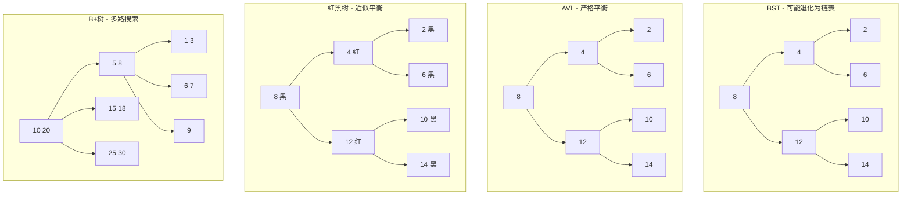
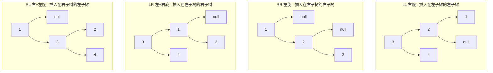
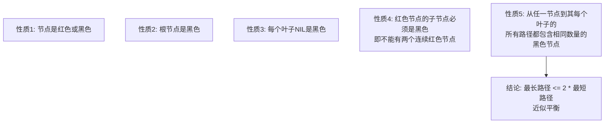
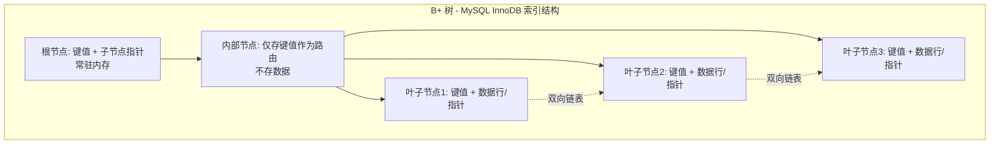

# 树结构对比 —— BST vs AVL vs 红黑树 vs B+ 树

> 创建日期：2026-06-06
> 难度：⭐⭐⭐
> 前置知识：二叉树基础、二分查找、磁盘 IO 原理

---

## ⭐ 面试重点速览

| 重点编号 | 核心内容 | 重要程度 |
|---------|---------|---------|
| 1 | 四种树的定义、特性、适用场景对比 | **必考** |
| 2 | AVL 和红黑树的旋转操作（LL/RR/LR/RL） | **高频手撕** |
| 3 | MySQL 为什么用 B+ 树而不是 B 树/红黑树 | **经典八股** |
| 4 | HashMap 为什么用红黑树而不是 AVL 树 | **源码级考点** |
| 5 | 四种树的选型决策——什么场景用什么树 | **进阶必问** |

---

## 一、应用场景 🎯

树结构是计算机科学中最核心的非线性数据结构之一。不同变体在特定场景下各显神通。

| 树类型 | 核心应用场景 | 代表系统/组件 |
|-------|------------|------------|
| 二叉搜索树（BST） | 理论学习、算法竞赛入门 | 教学用 |
| AVL 树 | 查找密集型场景（查询远多于写入） | Windows 进程调度、某些内存数据库 |
| 红黑树 | 频繁插入删除 + 需要有序遍历 | Java TreeMap/TreeSet、Linux CFS 调度器、epoll 事件管理 |
| B 树 | 磁盘存储（减少 IO 次数） | 早期文件系统（HFS+） |
| B+ 树 | 数据库索引 + 范围查询 | MySQL InnoDB、PostgreSQL、MongoDB |
| 字典树（Trie） | 字符串前缀匹配 | 搜索引擎自动补全、IP 路由表 |
| 哈夫曼树 | 数据压缩 | ZIP、JPEG 编码 |

---

## 二、核心原理 🔬

### 2.1 四种树的结构对比



### 2.2 核心特性对比表

| 特性 | BST | AVL 树 | 红黑树 | B+ 树 |
|-----|-----|--------|-------|------|
| 平衡性 | 不保证 | **严格平衡**（高度差 <= 1） | **近似平衡**（最长路径 <= 2 * 最短路径） | 所有叶子同层，绝对平衡 |
| 查找复杂度 | O(log n) ~ O(n) | O(log n) | O(log n) | O(log n) |
| 插入复杂度 | O(log n) ~ O(n) | O(log n)，但旋转多 | O(log n)，最多 2 次旋转 | O(log n) |
| 删除复杂度 | O(log n) ~ O(n) | O(log n)，旋转可能到根 | O(log n)，最多 3 次旋转 | O(log n) |
| 旋转次数（插入） | 不旋转 | 最多 O(log n) | 最多 2 次 | 节点分裂 |
| 节点结构 | 值 + 左右指针 | 值 + 左右指针 + 高度 | 值 + 左右指针 + 颜色 | 多个键 + 多个子指针 + 叶子链表 |
| 空间开销 | 最小 | 多一个高度字段 | 多一个颜色位 | 节点内多个键值 |
| 适用介质 | 内存 | 内存 | 内存 | **磁盘** |

### 2.3 AVL 四种旋转操作



**旋转口诀**：
- **LL**：右旋（左左失衡，向右转）
- **RR**：左旋（右右失衡，向左转）
- **LR**：先左旋左子树，再右旋根（左右失衡，左-右来）
- **RL**：先右旋右子树，再左旋根（右左失衡，右-左来）

### 2.4 红黑树五大性质



### 2.5 B+ 树结构详解



**B+ 树的三个关键设计**：
1. **非叶子节点只存键不存数据**：一个节点能存更多键，树更矮，IO 更少
2. **叶子节点用双向链表连接**：范围查询只需一次定位，然后沿链表顺序扫描
3. **所有数据都在叶子节点**：查询任何数据都要走到叶子，路径长度相同，稳定

---

## 三、趣味解说 🎭

### 家族族谱 —— 层层分支，各司其职

每种树就像家族中不同角色，各有各的职责：

**BST（二叉搜索树）= 普通家族族谱**
记录每个人名，左分支是年纪小的，右分支是年纪大的。但问题来了——如果家族成员是按年龄顺序加入的（全比上一个人年纪大），族谱就变成了一条斜线，从根到最后一个成员要翻几百页。这就是 BST 退化成链表。

**AVL 树 = 有强迫症的族谱管理员**
每次有新人加入族谱，管理员都要检查："左边和右边的分支长度差超过 1 了吗？"如果超过了，立刻调整（旋转）让两边平衡。结果是族谱永远保持完美的平衡形态，查找任何人都是 O(log n)。但代价是——每次调整都要大动干戈，加入一个新人可能要重新排列几十页。

**红黑树 = 聪明的族谱管理员**
这个管理员比较"佛系"，他不追求绝对平衡，只要"最长分支不超过最短分支的 2 倍"就行。他用红黑两种颜色的标签（红节点和黑节点）来维护这个宽松的规则。结果：加入新人时最多调整 2 次就搞定，比 AVL 的强迫症管理员高效多了。这就是为什么 Java 的 TreeMap 和 HashMap 都选择红黑树——**写入更高效，查找也只慢一点点**。

**B+ 树 = 图书馆的楼层索引**
想象图书馆有 100 万本书。如果只用二叉树（不管是 AVL 还是红黑树），树高大约是 log2(1000000) ≈ 20 层。每找一本书需要 20 次磁盘 IO，太慢了。

B+ 树的做法是：每个节点不只存 1 个键，而是存几百个键（比如 InnoDB 默认一个节点 16KB，可以存约 1170 个键）。这样树高只有 2-3 层，找任何书只需要 2-3 次磁盘 IO。而且叶子节点之间有"快速通道"（双向链表），找"编号 100 到 200 的书"时，定位到 100 后直接沿链表向后走就行，不用反复回到根节点。

---

## 四、代码实现 💻

### 4.1 AVL 树旋转实现

```java
/**
 * AVL 树节点
 */
class AVLNode {
    int key, height;
    AVLNode left, right;

    AVLNode(int key) {
        this.key = key;
        this.height = 1; // 新节点高度为 1
    }
}

public class AVLTree {
    private AVLNode root;

    /** 获取节点高度（空节点高度为 0） */
    private int height(AVLNode node) {
        return node == null ? 0 : node.height;
    }

    /** 计算平衡因子：左子树高度 - 右子树高度 */
    private int getBalance(AVLNode node) {
        return node == null ? 0 : height(node.left) - height(node.right);
    }

    /** 更新节点高度 */
    private void updateHeight(AVLNode node) {
        node.height = Math.max(height(node.left), height(node.right)) + 1;
    }

    /**
     * 右旋（LL 情况）
     *     y               x
     *    / \             / \
     *   x  T3    =>    T1  y
     *  / \                 / \
     * T1 T2               T2 T3
     */
    private AVLNode rightRotate(AVLNode y) {
        AVLNode x = y.left;
        AVLNode T2 = x.right;

        x.right = y;   // x 的右子树指向 y
        y.left = T2;   // y 的左子树指向 T2

        updateHeight(y); // 先更新下层节点高度
        updateHeight(x);
        return x;        // 返回新的根节点
    }

    /**
     * 左旋（RR 情况）
     *     x               y
     *    / \             / \
     *  T1  y     =>    x  T3
     *     / \         / \
     *   T2 T3       T1 T2
     */
    private AVLNode leftRotate(AVLNode x) {
        AVLNode y = x.right;
        AVLNode T2 = y.left;

        y.left = x;    // y 的左子树指向 x
        x.right = T2;  // x 的右子树指向 T2

        updateHeight(x);
        updateHeight(y);
        return y;
    }

    /** 插入并自动平衡 */
    public void insert(int key) {
        root = insertRec(root, key);
    }

    private AVLNode insertRec(AVLNode node, int key) {
        // 1. 标准 BST 插入
        if (node == null) return new AVLNode(key);

        if (key < node.key) {
            node.left = insertRec(node.left, key);
        } else if (key > node.key) {
            node.right = insertRec(node.right, key);
        } else {
            return node; // 不允许重复 key
        }

        // 2. 更新高度
        updateHeight(node);

        // 3. 检查平衡因子，执行旋转
        int balance = getBalance(node);

        // LL 情况：左子树比右子树高 2，且新 key 在左子树的左边
        if (balance > 1 && key < node.left.key) {
            return rightRotate(node);
        }

        // RR 情况：右子树比左子树高 2，且新 key 在右子树的右边
        if (balance < -1 && key > node.right.key) {
            return leftRotate(node);
        }

        // LR 情况：左子树比右子树高 2，且新 key 在左子树的右边
        // 先左旋左子树，再右旋根
        if (balance > 1 && key > node.left.key) {
            node.left = leftRotate(node.left);
            return rightRotate(node);
        }

        // RL 情况：右子树比左子树高 2，且新 key 在右子树的左边
        // 先右旋右子树，再左旋根
        if (balance < -1 && key < node.right.key) {
            node.right = rightRotate(node.right);
            return leftRotate(node);
        }

        return node;
    }
}
```

### 4.2 红黑树插入（简化版 Java 实现）

```java
/**
 * 红黑树节点
 */
class RBNode {
    int key;
    RBNode left, right, parent;
    boolean color; // true = RED, false = BLACK
    // NIL 节点用 null 表示，null 视为黑色
}

public class RedBlackTree {
    private RBNode root;

    private static final boolean RED   = true;
    private static final boolean BLACK = false;

    /** 左旋 —— 与 AVL 左旋逻辑相同 */
    private void leftRotate(RBNode x) {
        RBNode y = x.right;
        x.right = y.left;
        if (y.left != null) y.left.parent = x;
        y.parent = x.parent;
        if (x.parent == null) root = y;
        else if (x == x.parent.left) x.parent.left = y;
        else x.parent.right = y;
        y.left = x;
        x.parent = y;
    }

    /** 右旋 */
    private void rightRotate(RBNode y) {
        RBNode x = y.left;
        y.left = x.right;
        if (x.right != null) x.right.parent = y;
        x.parent = y.parent;
        if (y.parent == null) root = x;
        else if (y == y.parent.right) y.parent.right = x;
        else y.parent.left = x;
        x.right = y;
        y.parent = x;
    }

    /**
     * 插入后修复红黑树性质
     * 核心：解决"连续两个红色节点"的问题
     */
    private void fixAfterInsert(RBNode z) {
        // 只要父节点是红色（违反性质 4），就需要修复
        while (z.parent != null && z.parent.color == RED) {
            RBNode parent = z.parent;
            RBNode grandparent = parent.parent;

            if (parent == grandparent.left) {
                // 情况A：父节点是祖父的左孩子
                RBNode uncle = grandparent.right;

                if (uncle != null && uncle.color == RED) {
                    // 情况1：叔叔是红色 → 变色即可
                    parent.color = BLACK;
                    uncle.color = BLACK;
                    grandparent.color = RED;
                    z = grandparent; // 继续向上检查
                } else {
                    // 情况2/3：叔叔是黑色 → 需要旋转
                    if (z == parent.right) {
                        // 情况2：z 是右孩子，先左旋
                        z = parent;
                        leftRotate(z);
                    }
                    // 情况3：变色 + 右旋
                    parent.color = BLACK;
                    grandparent.color = RED;
                    rightRotate(grandparent);
                }
            } else {
                // 情况B：父节点是祖父的右孩子（对称处理）
                RBNode uncle = grandparent.left;

                if (uncle != null && uncle.color == RED) {
                    parent.color = BLACK;
                    uncle.color = BLACK;
                    grandparent.color = RED;
                    z = grandparent;
                } else {
                    if (z == parent.left) {
                        z = parent;
                        rightRotate(z);
                    }
                    parent.color = BLACK;
                    grandparent.color = RED;
                    leftRotate(grandparent);
                }
            }
        }
        root.color = BLACK; // 保证根节点始终是黑色
    }
}
```

### 4.3 选型决策总结

```java
/**
 * 树结构选型速查
 *
 * 场景一：MySQL 索引为什么用 B+ 树？
 *   ✅ B+ 树节点存储多个键，树高极低（2-3层），磁盘 IO 次数少
 *   ✅ 非叶子节点只存键不存数据，单节点能存更多键
 *   ✅ 叶子节点双向链表，范围查询只需一次定位 + 顺序扫描
 *   ❌ 红黑树/AVL：二叉树，100万数据树高约20层，20次IO太慢
 *   ❌ B 树：非叶子节点也存数据，相同节点大小存更少键，树更高
 *   ❌ 哈希表：不支持范围查询（BETWEEN、>、<）
 *
 * 场景二：HashMap 为什么用红黑树而不是 AVL？
 *   ✅ 红黑树插入最多旋转 2 次，AVL 可能旋转 O(log n) 次
 *   ✅ 红黑树近似平衡，查找性能只比 AVL 差一点（常数倍）
 *   ✅ HashMap 场景中插入和查找同等频繁，红黑树综合更优
 *   ❌ AVL 严格平衡，查找更快但插入旋转开销大
 *
 * 场景三：什么时候用 BST？
 *   理论上 BST 不适用于任何生产环境（无法保证平衡）
 *   但在算法竞赛和面试中，BST 是理解其他树的基础
 *
 * 口诀：
 *   内存有序用红黑，磁盘索引用 B+；
 *   查找优先用 AVL，综合平衡选红黑。
 */
```

---

## 五、优缺点 ⚖️

### 四种树全面对比

| 维度 | BST | AVL 树 | 红黑树 | B+ 树 |
|-----|-----|--------|-------|------|
| 查找速度 | 不稳定（O(n) 最坏） | **最快**（严格平衡） | 较快（近似平衡） | 快（磁盘场景最快） |
| 插入速度 | 快（无平衡开销） | 慢（旋转多） | **快**（最多 2 次旋转） | 中等（节点分裂） |
| 删除速度 | 快 | 慢（旋转到根） | 较快（最多 3 次旋转） | 中等 |
| 实现难度 | 简单 | 中等 | **复杂** | 非常复杂 |
| 内存占用 | 最小 | 中（多一个高度字段） | 中（多一个颜色位） | 大（节点内多个键值） |
| 范围查询 | 中序遍历 O(n) | 中序遍历 | 中序遍历 | **最快**（叶子链表） |
| 磁盘 IO | 差（树太高） | 差 | 差 | **极好**（树极矮） |
| 实际应用 | 教学用 | 查找密集型 | **通用型**（内存） | **数据库索引** |

### 各树的核心取舍

| 树 | 核心理念 | 一句话总结 |
|---|---------|----------|
| BST | 最简单的二叉树，不保证平衡 | 理论入门，生产勿用 |
| AVL | 严格平衡，用旋转换查找速度 | 查找快但写慢，适合读多写少 |
| 红黑树 | 近似平衡，用少量不平衡换插入速度 | 读写均衡，Java 默认选择 |
| B+ 树 | 多路搜索，用空间换磁盘 IO 减少 | 磁盘场景不二之选 |

---

## 六、面试高频题 📝

| 题目 | LeetCode 题号 | 核心解法 | 难度 |
|-----|-------------|---------|-----|
| 验证二叉搜索树 | 98 | 中序遍历/递归 + 范围 | 中等 |
| 二叉搜索树中的插入操作 | 701 | BST 插入 | 中等 |
| 删除二叉搜索树中的节点 | 450 | BST 删除（三种情况） | 中等 |
| 将有序数组转换为二叉搜索树 | 108 | 二分 + 递归构建 | 简单 |
| 二叉树的最近公共祖先 | 236 | 递归 + 后序遍历 | 中等 |
| 二叉搜索树的最近公共祖先 | 235 | 利用 BST 性质 | 中等 |
| 平衡二叉树 | 110 | 自顶向下/自底向上判断 | 简单 |
| 不同的二叉搜索树 II | 95 | 递归 + 回溯 | 中等 |

### 面试官追问

> **Q**: MySQL 的 B+ 树索引，一般树高多少层？
> **A**: 通常 2-3 层。InnoDB 默认页大小 16KB，假设主键 bigint（8 字节）+ 指针（6 字节），每个非叶子节点约存 1170 个键。三层 B+ 树可存储约 1170^2 * 16 ≈ 2000 万行数据。大多数表的索引不超过 3 层。

> **Q**: 红黑树和 AVL 树，到底哪个更快？
> **A**: **没有绝对答案，看场景**。如果查找占 90% 以上，AVL 略快（树更矮）。如果插入删除频繁，红黑树更快。Java 选红黑树是因为 TreeMap 的插入和查找频率相近，红黑树综合性价比更高。

> **Q**: B+ 树和跳表（SkipList）的对比？
> **A**: B+ 树更适合磁盘（页结构对齐），跳表更适合内存（实现简单、并发友好）。Redis 的有序集合（ZSet）底层就是跳表。LevelDB 的 MemTable 也用跳表。

> **Q**: 为什么 B+ 树比 B 树更适合数据库索引？
> **A**: 三个原因：1) B+ 树非叶子节点不存数据，树更矮；2) B+ 树叶子节点有链表，范围查询效率高；3) B+ 树查询稳定（每次走到叶子），B 树可能在非叶子节点就返回，性能不稳定。

---

## 七、常见误区 ❌

| 误区 | 真相 | 解释 |
|-----|-----|-----|
| "红黑树比 AVL 树查找快" | **AVL 更快** | AVL 严格平衡，树更矮。红黑树是近似平衡，查找略慢 |
| "红黑树比 AVL 树插入慢" | **红黑树更快** | 红黑树插入最多旋转 2 次，AVL 插入可能旋转 O(log n) 次 |
| "B+ 树就是 B 树的升级版" | 不是简单的升级 | 两者设计理念不同，B+ 树牺牲了非叶子节点存储数据的能力，换取了更低树高和更好的范围查询 |
| "二叉搜索树的中序遍历不一定是升序" | **一定是升序** | 只要正确维护 BST 性质（左 < 根 < 右），中序遍历必然升序 |
| "平衡二叉树一定是二叉搜索树" | 不一定 | 平衡二叉树只要求高度差 <= 1，不要求满足 BST 性质 |
| "MySQL 所有索引都用 B+ 树" | 不是所有 | 全文索引用倒排索引，空间索引用 R 树 |
| "红黑树是绝对平衡的" | 不是 | 红黑树是近似平衡，最长路径可能等于最短路径的 2 倍 |
| "树的旋转操作改变了树的节点数量" | 不变 | 旋转只改变父子关系，不增删节点 |

### 实战反例

```java
// ❌ 常见错误：忘记了 BST 插入顺序影响结构
// 按 [1, 2, 3, 4, 5] 顺序插入 BST → 退化为链表
//         1
//          \
//           2
//            \
//             3
//              \
//               4
//                \
//                 5
// 查找 5 需要 O(n) 而不是 O(log n)

// ✅ 解决方案：使用自平衡树（红黑树/TreeMap）
TreeMap<Integer, String> treeMap = new TreeMap<>();
treeMap.put(1, "a");
treeMap.put(2, "b");
treeMap.put(3, "c");
// TreeMap 内部用红黑树，自动保持平衡，查找 O(log n)
```

```java
// ❌ 面试中错误回答：说 B+ 树每个节点只存一个键
// B+ 树的"多路"就是指每个节点存多个键，这是它树高极低的关键

// ❌ 常见错误：认为 B+ 树叶子节点是单向链表
// 实际 MySQL InnoDB 的 B+ 树叶子节点是双向链表，支持正序和逆序范围查询
```

---

> **关联阅读**：
> - [数据结构全景](./index.md) —— 查看所有数据结构的复杂度速查表
> - [哈希表](./hash-table.md) —— 了解 HashMap 为什么用红黑树
> - [堆](./heap.md) —— 堆也是完全二叉树，了解另一种树结构
> - LeetCode 题单：树相关题目合集（94, 98, 101, 102, 104, 110, 236）