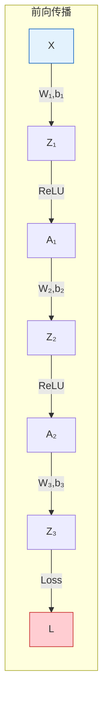
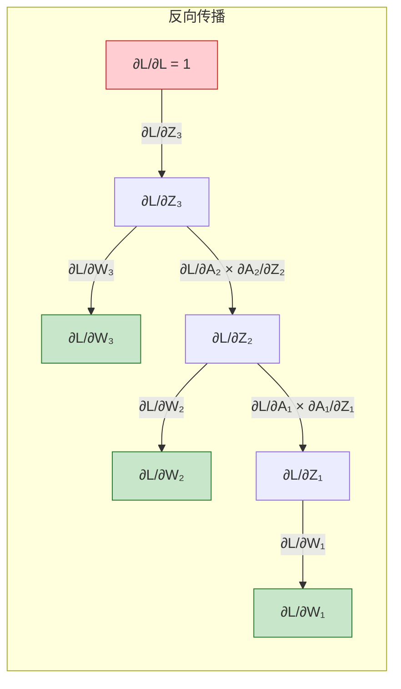
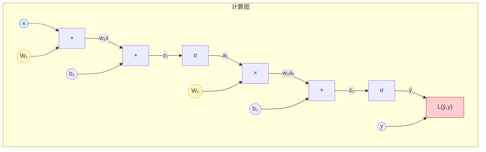
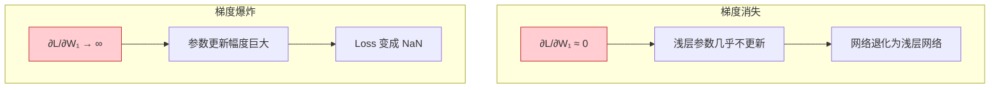
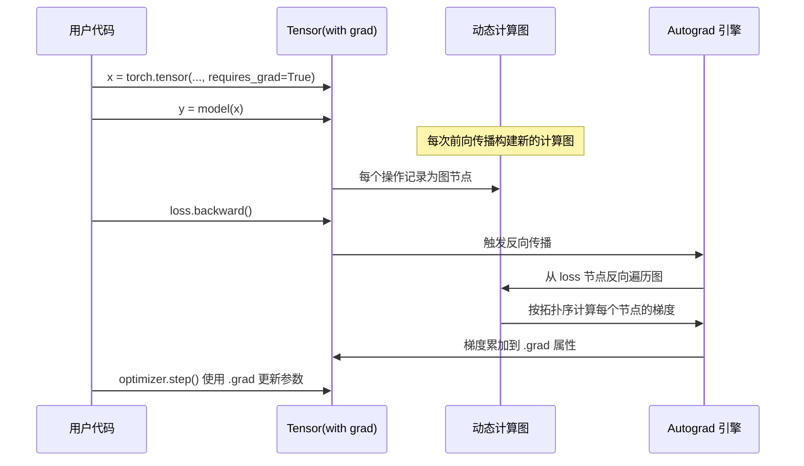

# 反向传播 (Backpropagation)
> 创建日期：2026-06-06
> 难度：⭐⭐⭐
> 前置知识：链式法则（微积分）、计算图、梯度下降、神经网络前向传播

## ⭐ 面试重点速览

- 反向传播 = 链式法则在计算图上的高效实现，时间复杂度与前向传播同阶
- 能手动推导一个简单 MLP 的反向传播过程（面试常考白板推导）
- 理解梯度消失/爆炸的数学原因：连乘导致指数级衰减/增长
- 掌握三大解决方案：ReLU（激活函数）、BatchNorm（归一化）、残差连接（结构设计）
- 知道 PyTorch autograd 的原理：动态计算图 + `backward()` 自动求导

---

## 一、应用场景 🎯

反向传播是深度学习训练的核心算法，没有它就没有现代神经网络：

| 场景 | 反向传播的作用 |
|------|-------------|
| 监督学习训练 | 计算损失对每个参数的梯度，驱动梯度下降更新 |
| 模型调试 | 检查梯度流是否正常（梯度是否消失/爆炸） |
| 迁移学习 | 冻结部分层，只反向传播到可训练层 |
| 对抗攻击 | 反向传播梯度到输入，生成对抗样本 |
| 特征可视化 | 反向传播梯度到输入，可视化模型关注区域 |
| 神经网络可解释性 | Grad-CAM、Integrated Gradients 等方法依赖反向传播 |

---

## 二、核心原理 🔬

### 2.1 链式法则回顾

反向传播的数学基础是链式法则（复合函数求导）：

$$\frac{dL}{dx} = \frac{dL}{dy} \cdot \frac{dy}{dx} \quad \text{（单变量）}$$
$$\frac{\partial L}{\partial x_i} = \sum_j \frac{\partial L}{\partial y_j} \cdot \frac{\partial y_j}{\partial x_i} \quad \text{（多变量）}$$

### 2.2 计算图与反向传播流程

考虑一个简单的三层网络：$L = \text{Loss}(W_3 \cdot \text{ReLU}(W_2 \cdot \text{ReLU}(W_1 \cdot X + b_1) + b_2) + b_3, Y)$





**反向传播的两个阶段**：
1. **前向传播**：从输入到输出，逐层计算中间值并缓存（用于后续求导）
2. **反向传播**：从损失反向到输入，逐层计算梯度，利用链式法则复用中间结果

### 2.3 链式法则推导详解

以一个简单的两层网络为例：

```
输入 x → [W₁] → z₁ = W₁x + b₁ → [Sigmoid] → a₁ = σ(z₁) → [W₂] → z₂ = W₂a₁ + b₂ → [Sigmoid] → ŷ = σ(z₂) → L = -(y·log(ŷ) + (1-y)·log(1-ŷ))
```

**推导过程**：

```
第1步: ∂L/∂ŷ = -(y/ŷ) + (1-y)/(1-ŷ)          # 交叉熵对输出的导数

第2步: ∂L/∂z₂ = ∂L/∂ŷ · ∂ŷ/∂z₂
              = ∂L/∂ŷ · σ(z₂)(1-σ(z₂))
              = ∂L/∂ŷ · ŷ(1-ŷ)
              = ŷ - y                              # 交叉熵+Sigmoid的神奇简化！

第3步: ∂L/∂W₂ = ∂L/∂z₂ · ∂z₂/∂W₂ = (ŷ-y) · a₁^T  # 矩阵形式

第4步: ∂L/∂b₂ = ∂L/∂z₂ = ŷ - y                    # 偏置梯度

第5步: ∂L/∂a₁ = ∂L/∂z₂ · ∂z₂/∂a₁ = W₂^T · (ŷ-y)  # 梯度传递到前一层

第6步: ∂L/∂z₁ = ∂L/∂a₁ · ∂a₁/∂z₁
              = W₂^T·(ŷ-y) ⊙ σ(z₁)(1-σ(z₁))       # ⊙ 表示逐元素乘法

第7步: ∂L/∂W₁ = ∂L/∂z₁ · x^T                     # 输入层权重梯度
```

> **面试金句**：交叉熵 + Sigmoid 的组合使得 $\partial L/\partial z = \hat{y} - y$，即"预测值 - 真实值"，形式上极简洁。这是为什么分类任务默认用交叉熵而不用 MSE 的原因之一。

### 2.4 计算图的可视化（Mermaid）



> 计算图中每个节点代表一个操作，边代表数据流。反向传播时沿着边反向流动梯度。

### 2.5 梯度消失与梯度爆炸

**问题本质**：深层网络中，梯度从输出层反向传播到输入层时，需要经过多层链式相乘：

$$\frac{\partial L}{\partial W_1} = \frac{\partial L}{\partial z_n} \cdot \prod_{k=2}^{n} \frac{\partial z_k}{\partial z_{k-1}} \cdot \frac{\partial z_1}{\partial W_1}$$

- 如果每层的导数 $|\partial z_k / \partial z_{k-1}| < 1$，连乘后指数级衰减 $\to$ **梯度消失**
- 如果每层的导数 $|\partial z_k / \partial z_{k-1}| > 1$，连乘后指数级增长 $\to$ **梯度爆炸**



**三大解决方案**：

| 方案 | 原理 | 解决哪个问题 |
|------|------|------------|
| **ReLU 激活** | 正区间导数为 1，不衰减 | 梯度消失 |
| **BatchNorm** | 将每层输出归一化到稳定分布 | 梯度消失 + 爆炸 |
| **残差连接** | 提供恒等映射路径，梯度可直接"跳过"多层 | 梯度消失 |
| **梯度裁剪** | 限制梯度的最大范数 | 梯度爆炸 |
| **Xavier/He 初始化** | 保持前向和反向传播的方差稳定 | 梯度消失 + 爆炸 |

### 2.6 PyTorch Autograd 原理

PyTorch 的自动求导基于**动态计算图**：



> **关键点**：PyTorch 是动态图（Define-by-Run），每次前向传播都会重新构建计算图，这比 TensorFlow 1.x 的静态图更灵活，便于调试和控制流。

---

## 三、趣味解说 🎭

### 考试后分析错题 -- 反向传播的直观类比

想象你参加了一场数学考试，最后得了 70 分（损失）。

**反向传播就像考试后的错题分析**：

1. **从总分开始**：你丢了 30 分（损失 = 30）。这是"输出层的梯度"。

2. **逐题归因**：这 30 分是怎么丢的？
   - 最后一道大题丢了 10 分，因为"积分公式记错了"（$\partial L/\partial W_3$）
   - 但积分公式记错是因为"上学期微积分基础没打好"（继续往前追溯）
   - 微积分没打好又是因为"大一没认真学极限"（$\partial L/\partial W_1$）

3. **调整学习重点**：根据分析结果，你决定：
   - 重点复习极限和微积分基础（浅层参数获得较大更新）
   - 积分公式只需要再记一遍即可（深层参数微调）

**梯度消失**就像：你丢了 30 分，但分析到最后，你认为是"小学乘法口诀没背熟"导致的。这显然不合理 -- 问题出在中间的"归因链"断了。

**梯度爆炸**就像：你丢了 30 分，但分析到某一步时，你突然认为是"幼儿园没学会数数"导致的，而且归因的程度被无限放大。

### 计算图就像多米诺骨牌

前向传播是一排多米诺骨牌从前往后倒。反向传播是你从最后一块倒下的骨牌反推："它是被哪块碰倒的？那块又是被谁碰倒的？" 一路追溯到第一块。每块骨牌倒下时你拍了一张照片（缓存中间值），反向追溯时你对照照片来还原过程。

---

## 四、代码实现 💻

### 4.1 从零实现反向传播（NumPy 版）

```python
import numpy as np


class BackpropDemo:
    """手动实现反向传播，演示链式法则"""

    def __init__(self):
        self.cache = {}  # 缓存前向传播的中间值

    def sigmoid(self, x):
        return 1 / (1 + np.exp(-x))

    def sigmoid_derivative(self, x):
        s = self.sigmoid(x)
        return s * (1 - s)

    def relu(self, x):
        return np.maximum(0, x)

    def relu_derivative(self, x):
        return (x > 0).astype(float)

    def forward(self, X, W1, b1, W2, b2):
        """前向传播：缓存中间值供反向传播使用"""
        # 第1层
        self.cache['X'] = X
        self.cache['Z1'] = np.dot(X, W1) + b1          # (N, H)
        self.cache['A1'] = self.relu(self.cache['Z1'])  # (N, H) 激活

        # 第2层
        self.cache['Z2'] = np.dot(self.cache['A1'], W2) + b2  # (N, C)
        self.cache['A2'] = self.sigmoid(self.cache['Z2'])      # (N, C) 输出

        return self.cache['A2']

    def backward(self, y_true):
        """反向传播：从损失开始，逐层计算梯度"""
        m = y_true.shape[0]  # 样本数
        A2 = self.cache['A2']
        A1 = self.cache['A1']
        Z1 = self.cache['Z1']
        X = self.cache['X']

        # --- 第1步：损失对输出层的梯度 ---
        # 交叉熵 + Sigmoid: dL/dZ2 = A2 - y
        dZ2 = A2 - y_true

        # --- 第2步：输出层参数梯度 ---
        dW2 = np.dot(A1.T, dZ2) / m
        db2 = np.sum(dZ2, axis=0, keepdims=True) / m

        # --- 第3步：梯度传递到隐藏层 ---
        dA1 = np.dot(dZ2, self.cache.get('W2_ref').T)  # 需要 W2 的引用
        dZ1 = dA1 * self.relu_derivative(Z1)

        # --- 第4步：隐藏层参数梯度 ---
        dW1 = np.dot(X.T, dZ1) / m
        db1 = np.sum(dZ1, axis=0, keepdims=True) / m

        return {'dW1': dW1, 'db1': db1, 'dW2': dW2, 'db2': db2}


# ====== 梯度检查：数值梯度 vs 解析梯度 ======
def numerical_gradient(f, x, eps=1e-5):
    """用有限差分法计算数值梯度，用于验证反向传播"""
    grad = np.zeros_like(x)
    it = np.nditer(x, flags=['multi_index'])
    while not it.finished:
        idx = it.multi_index
        old_val = x[idx]
        x[idx] = old_val + eps
        loss_plus = f(x)
        x[idx] = old_val - eps
        loss_minus = f(x)
        grad[idx] = (loss_plus - loss_minus) / (2 * eps)
        x[idx] = old_val
        it.iternext()
    return grad


print("反向传播推导关键公式：")
print("  交叉熵 + Sigmoid: ∂L/∂z = ŷ - y  （预测值减真实值，极其简洁）")
print("  ReLU 导数: ∂ReLU/∂z = 1 if z>0 else 0")
print("  梯度传递: ∂L/∂Aₗ₋₁ = Wₗ^T · ∂L/∂Zₗ")
```

### 4.2 PyTorch Autograd 实战

```python
import torch
import torch.nn as nn


# ====== 1. 基础用法：requires_grad ======
x = torch.tensor([2.0, 3.0], requires_grad=True)
y = x[0]**2 + 3 * x[1]**3  # y = x₀² + 3x₁³
y.backward()                # 自动计算 ∂y/∂x₀ 和 ∂y/∂x₁
print(f"∂y/∂x₀ = {x.grad[0]:.1f}")  # 2*2 = 4.0
print(f"∂y/∂x₁ = {x.grad[1]:.1f}")  # 9*3² = 27.0


# ====== 2. 梯度不自动清零 ======
w = torch.tensor([1.0], requires_grad=True)
for i in range(3):
    loss = w**2           # loss = w²
    loss.backward()       # 梯度会累加！
    print(f"Step {i}: w.grad = {w.grad.item()}")  # 2, 4, 6（累加）


# ====== 3. 正确做法：每次清零 ======
w = torch.tensor([1.0], requires_grad=True)
for i in range(3):
    if w.grad is not None:
        w.grad.zero_()    # 手动清零
    loss = w**2
    loss.backward()
    print(f"Step {i}: w.grad = {w.grad.item()}")  # 2, 2, 2（正确）


# ====== 4. 冻结部分参数（迁移学习） ======
model = nn.Sequential(
    nn.Linear(10, 20),
    nn.ReLU(),
    nn.Linear(20, 2)
)

# 冻结第一层
for param in model[0].parameters():
    param.requires_grad = False

# 检查哪些参数需要梯度
for name, param in model.named_parameters():
    print(f"{name}: requires_grad={param.requires_grad}")
# 输出: 0.weight: False, 0.bias: False, 2.weight: True, 2.bias: True


# ====== 5. detach() 阻断梯度 ======
x = torch.tensor([2.0], requires_grad=True)
y = x**2                # y = x²
z = y.detach() * 3      # detach 后 z 不再追踪梯度
z.backward()            # 不会传播到 x
print(f"x.grad = {x.grad}")  # None（梯度流被阻断）


# ====== 6. 梯度裁剪（防止梯度爆炸） ======
def train_with_grad_clip(model, dataloader, optimizer, max_norm=1.0):
    model.train()
    for batch_x, batch_y in dataloader:
        optimizer.zero_grad()
        loss = nn.functional.cross_entropy(model(batch_x), batch_y)
        loss.backward()
        # 梯度裁剪：将梯度范数限制在 max_norm 以内
        torch.nn.utils.clip_grad_norm_(model.parameters(), max_norm)
        optimizer.step()
```

---

## 五、优缺点 ⚖️

| 优点 | 缺点 |
|------|------|
| 高效：时间复杂度 O(N)，与前向传播同阶 | 需要缓存中间激活值，内存开销大 |
| 精确：解析梯度，无数值误差 | 对不可导操作（如 argmax）无法直接传播梯度 |
| 通用：适用于任何可导的计算图 | 梯度消失/爆炸问题在深层网络中天然存在 |
| 自动微分框架（PyTorch/TF）让实现极其简单 | 某些场景需要特殊处理（如 Gumbel-Softmax 处理离散变量） |
| 支持动态计算图（PyTorch），灵活处理控制流 | 二阶梯度（Hessian）计算和存储成本极高 |

---

## 六、面试高频题 📝

### Q1：手动推导 Softmax + CrossEntropy 的反向传播

**答案**：这是 AI 面试极高频率的白板题。

设 $z$ 为 logits，$p_i = \text{Softmax}(z_i) = e^{z_i} / \sum_j e^{z_j}$，$L = -\sum_i y_i \log(p_i)$。

推导结果：$\frac{\partial L}{\partial z_i} = p_i - y_i$

**推导过程**：
1. $\frac{\partial L}{\partial p_k} = -\frac{y_k}{p_k}$
2. $\frac{\partial p_k}{\partial z_i} = p_k(\delta_{ki} - p_i)$（其中 $\delta_{ki}$ 是 Kronecker delta）
3. $\frac{\partial L}{\partial z_i} = \sum_k \frac{\partial L}{\partial p_k} \cdot \frac{\partial p_k}{\partial z_i} = p_i - y_i$

### Q2：为什么 PyTorch 的 loss.backward() 后梯度是累加而不是覆盖？

**答案**：这是设计选择，有几个好处：
- 支持梯度累积：在显存不够时，可以分多个小 batch 计算梯度再一次性更新
- 支持多任务学习：不同 loss 的 backward 梯度自动累加
- 支持复杂计算图：一个参数可能被多次使用，梯度需要求和

对应地，需要`optimizer.zero_grad()` 或 `model.zero_grad()` 来手动清零。

### Q3：梯度消失和梯度爆炸的诊断方法？

| 诊断方法 | 具体操作 |
|---------|---------|
| 观察 Loss 曲线 | Loss 不下降且不震荡 = 可能梯度消失；Loss 变成 NaN = 梯度爆炸 |
| 打印梯度范数 | 在训练循环中打印各层梯度的 L2 范数，观察是否异常 |
| 使用梯度直方图 | TensorBoard 可视化各层梯度分布 |
| 检查激活值 | 激活值集中在饱和区（Sigmoid 接近 0/1）= 梯度消失 |

### Q4：BatchNorm 为什么能缓解梯度消失？

**答案**：BatchNorm 将每层输入归一化到均值为 0、方差为 1 的分布，使得：
- 激活值落在激活函数的非饱和区（对 Sigmoid 而言，落在导数最大的区域）
- 减少了内部协变量偏移（Internal Covariate Shift），让每层输入分布更稳定
- 允许使用更大的学习率，加速训练

---

## 七、常见误区 ❌

| 误区 | 真相 |
|------|------|
| "反向传播就是链式法则" | 链式法则是数学基础，反向传播是**高效实现**（利用计算图避免重复计算）。 |
| "梯度消失只在 Sigmoid 中发生" | ReLU 正区间导数为 1 不会消失，但负区间导数为 0（Dead ReLU），也是一种"消失"形式。 |
| "loss.backward() 之后梯度就自动清零了" | PyTorch 中梯度默认累加，必须手动 `zero_grad()`。 |
| "BatchNorm 只解决梯度消失" | 它还加速收敛、允许更大学习率、有轻微正则化效果。 |
| "所有操作都可导" | `argmax`、`sample`、`==` 等操作不可导，需要特殊技巧（如 Gumbel-Softmax、Straight-Through Estimator）。 |
| "梯度爆炸只靠梯度裁剪就能解决" | 梯度裁剪是治标，更好的初始化（Xavier/He）和 BatchNorm 才是治本。 |
| "detach() 和 no_grad() 是一样的" | `detach()` 从计算图中分离一个张量，`torch.no_grad()` 是上下文管理器，禁用其内部所有梯度计算。 |