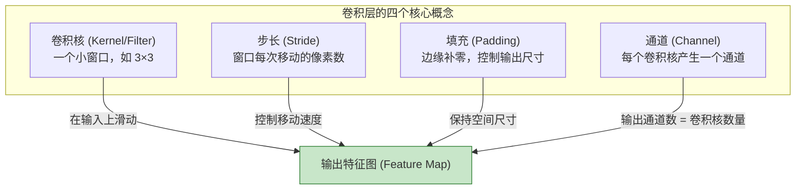
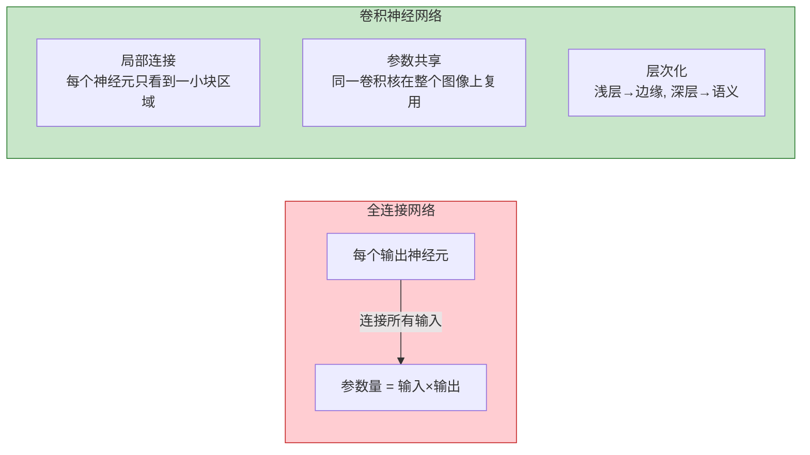
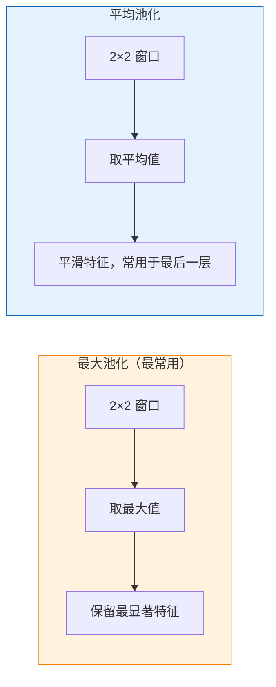
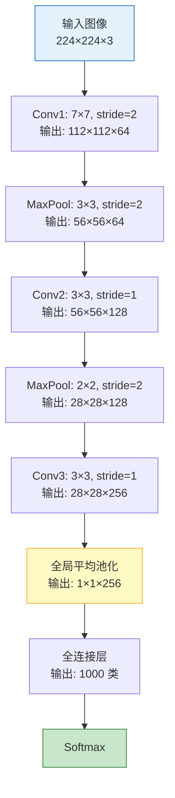
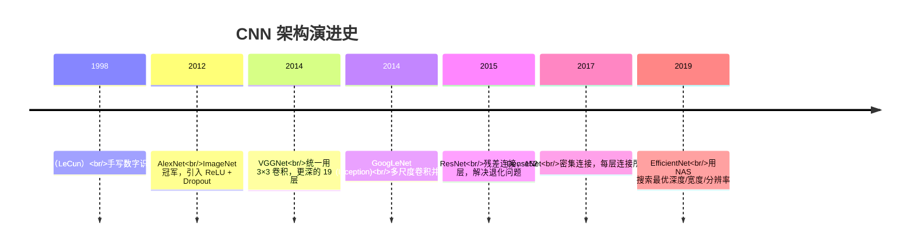
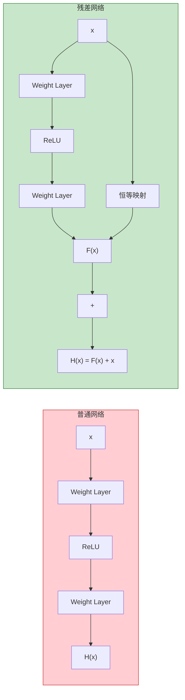

# 卷积神经网络 (CNN)
> 创建日期：2026-06-06
> 难度：⭐⭐⭐
> 前置知识：图像基础（像素/通道）、全连接网络、反向传播、矩阵运算

## ⭐ 面试重点速览

- 理解卷积的三大核心优势：**局部连接**（稀疏交互）、**参数共享**（平移等变性）、**层次化特征提取**
- 能计算卷积输出尺寸：$H_{out} = \lfloor(H_{in} + 2P - K) / S\rfloor + 1$
- 掌握 1x1 卷积的三个作用：降维/升维、跨通道信息融合、增加非线性
- 能说出 ResNet 的残差连接为什么有效：解决了深层网络的退化问题
- 理解为什么 CNN 适合图像：平移等变性 + 局部性假设 + 层次化特征

---

## 一、应用场景 🎯

CNN 是计算机视觉的基石，也是深度学习从实验室走向工业界的里程碑：

| 任务 | 典型模型 | 应用案例 |
|------|---------|---------|
| 图像分类 | ResNet、EfficientNet | 照片分类、医学影像诊断 |
| 目标检测 | YOLO、Faster R-CNN | 自动驾驶、安防监控 |
| 语义分割 | U-Net、DeepLab | 医学图像分割、自动驾驶 |
| 实例分割 | Mask R-CNN | 机器人抓取、视频编辑 |
| 人脸识别 | FaceNet、ArcFace | 手机解锁、门禁系统 |
| 姿态估计 | OpenPose、HRNet | 运动分析、AR/VR |
| 图像生成 | DCGAN、StyleGAN | AI 绘画、图像修复 |

> 虽然 Transformer（ViT）正在挑战 CNN 的地位，但在嵌入式设备、实时检测等场景中，CNN 仍是主流。

---

## 二、核心原理 🔬

### 2.1 为什么全连接网络不适合图像？

假设一张 224x224x3 的图片，全连接网络第一层就需要 $224 \times 224 \times 3 \times N = 150,528 \times N$ 个参数（N 为隐藏层神经元数）。这导致：
- **参数量爆炸**：无法训练
- **丢失空间结构**：把像素拉成一维向量，丢弃了相邻像素的关系
- **无平移不变性**：同一只猫在图片左侧和右侧被当作完全不同的输入

### 2.2 卷积操作详解



**输出尺寸计算公式**：

$$H_{out} = \left\lfloor\frac{H_{in} + 2 \times P - K}{S}\right\rfloor + 1$$

$$W_{out} = \left\lfloor\frac{W_{in} + 2 \times P - K}{S}\right\rfloor + 1$$

其中 $H_{in}, W_{in}$ 为输入尺寸，$K$ 为卷积核大小，$P$ 为填充，$S$ 为步长。

**参数量计算**：一个卷积层的参数量 = $K \times K \times C_{in} \times C_{out}$（不考虑偏置）。

### 2.3 CNN 的三大核心优势



| 特性 | 说明 | 带来的好处 |
|------|------|----------|
| **局部连接** | 每个神经元只连接到输入的一小块区域（感受野） | 参数量大幅减少 |
| **参数共享** | 同一个卷积核在整张图上滑动使用 | 平移等变性：猫在左边或右边，都能检测到 |
| **层次化特征** | 浅层学习边缘/纹理，深层学习语义/物体 | 逐层抽象，符合人类视觉机制 |

### 2.4 池化层 (Pooling)



池化的作用：
- **降维**：减小特征图尺寸，减少计算量
- **增大感受野**：池化后每个像素对应更大的输入区域
- **提供平移不变性**：局部平移后池化结果可能不变
- **防止过拟合**：减少参数，增加鲁棒性

### 2.5 CNN 典型架构流程



> **趋势**：现代 CNN 倾向于用全局平均池化（GAP）替代全连接层，减少参数量的同时保留空间信息。

### 2.6 经典 CNN 架构演进



| 架构 | 年份 | 核心创新 | 层数 | Top-5 错误率 |
|------|------|---------|------|------------|
| LeNet-5 | 1998 | 卷积+池化+全连接的标准范式 | 7 | - |
| AlexNet | 2012 | ReLU、Dropout、GPU 训练 | 8 | 15.3% |
| VGG-16 | 2014 | 全部用 3×3 小卷积核，更深的网络 | 16 | 7.3% |
| GoogLeNet | 2014 | Inception 模块（多尺度） | 22 | 6.7% |
| **ResNet-50** | 2015 | **残差连接**，让深层网络可训练 | 50 | 5.3% |
| ResNet-152 | 2015 | 更深 + 残差 | 152 | 4.5% |

### 2.7 ResNet 残差连接详解

**问题**：普通网络加深后，训练误差反而升高（不是过拟合，是退化问题）。

**解决方案**：残差连接（Skip Connection）



**核心公式**：$H(x) = F(x) + x$

- 如果 $F(x)$ 学不到有用的东西，网络可以退化到恒等映射（$H(x) \approx x$）
- 梯度可以通过恒等映射路径直接传播到浅层，缓解梯度消失
- 这使得训练 152 层甚至 1000+ 层的网络成为可能

### 2.8 1x1 卷积的作用

很多人会问："1x1 卷积不就是对每个像素做一次线性变换吗？有什么意义？"

**三个核心作用**：

| 作用 | 原理 | 实际案例 |
|------|------|---------|
| **降维/升维** | 改变通道数，$C_{in} \to C_{out}$ | ResNet 的 bottleneck：256→64→256 |
| **跨通道信息融合** | 每个 1x1 卷积核融合所有输入通道 | 增加网络的表达能力 |
| **增加非线性** | 1x1 Conv + ReLU 等价于给每个位置加一个微型 MLP | Network in Network |

> **面试金句**："1x1 卷积是最便宜的通道变换操作。它不改变空间尺寸，只改变通道数。在 ResNet bottleneck 中，1x1 卷积先将 256 通道降到 64 再升回 256，大幅减少了 3x3 卷积的计算量。"

---

## 三、趣味解说 🎭

### 用放大镜一块一块地观察图片 -- CNN 的直觉

想象你是一个侦探，面前有一张巨大的犯罪现场照片（比如 1000x1000 像素）。你不能一眼看完整张照片，而是：

1. **你拿着一个放大镜（卷积核 3x3）**，从左上角开始，一次只看一小块。
2. 你看完这块，把放大镜往右移一点（步长 stride），再看下一块，一格一格地扫完整张照片。

3. 你的"放大镜"不是普通的放大镜 -- 它只能检测一种特征：
   - 放大镜 A（卷积核 1）：专门找水平边缘
   - 放大镜 B（卷积核 2）：专门找垂直边缘
   - 放大镜 C（卷积核 3）：专门找颜色变化

4. 扫完一遍后，你得到一张"特征地图"（Feature Map），标记了整张照片中哪里有水平边缘、哪里颜色变化剧烈。

5. 然后你换一个更大的放大镜（池化），把刚才的特征图"缩小"（降采样），这样你就能看到更大范围的图案了。

6. 重复这个过程几十次后，最开始的"边缘"变成了"眼睛"、"鼻子"，最后变成了"这是一张人脸！"

**为什么卷积核要共享参数？** 因为"水平边缘"在照片左上角的样子和在右下角的样子是一样 -- 你不需要为每个位置都学一个不同的"找水平边缘"的放大镜。

---

## 四、代码实现 💻

### 4.1 从零实现卷积操作（NumPy 版，理解原理）

```python
import numpy as np


def conv2d_naive(input_tensor, kernel, stride=1, padding=0):
    """
    朴素卷积实现（不依赖深度学习框架）
    
    参数:
        input_tensor: (H, W) 输入特征图
        kernel: (K, K) 卷积核
        stride: 步长
        padding: 填充大小
    """
    H, W = input_tensor.shape
    K = kernel.shape[0]

    # 填充
    if padding > 0:
        input_padded = np.pad(input_tensor, padding, mode='constant')
    else:
        input_padded = input_tensor

    # 输出尺寸
    H_out = (H + 2 * padding - K) // stride + 1
    W_out = (W + 2 * padding - K) // stride + 1

    output = np.zeros((H_out, W_out))

    for i in range(H_out):
        for j in range(W_out):
            # 提取当前窗口: 输入[i*S : i*S+K, j*S : j*S+K]
            h_start = i * stride
            h_end = h_start + K
            w_start = j * stride
            w_end = w_start + K
            patch = input_padded[h_start:h_end, w_start:w_end]
            # 逐元素乘法求和（卷积操作）
            output[i, j] = np.sum(patch * kernel)

    return output


# 示例: 边缘检测
image = np.array([
    [0, 0, 0, 0, 0],
    [0, 1, 1, 1, 0],
    [0, 1, 1, 1, 0],
    [0, 1, 1, 1, 0],
    [0, 0, 0, 0, 0],
], dtype=float)

# Sobel 水平边缘检测算子
sobel_x = np.array([[-1, 0, 1], [-2, 0, 2], [-1, 0, 1]])
edges = conv2d_naive(image, sobel_x, stride=1, padding=1)
print("水平边缘检测结果:")
print(edges)
```

### 4.2 PyTorch 实现经典 CNN

```python
import torch
import torch.nn as nn
import torch.nn.functional as F


# ====== 1. 基础 CNN Block ======
class ConvBlock(nn.Module):
    """Conv -> BatchNorm -> ReLU 的标准组合"""

    def __init__(self, in_ch, out_ch, kernel=3, stride=1, padding=1):
        super().__init__()
        self.conv = nn.Conv2d(in_ch, out_ch, kernel, stride, padding, bias=False)
        self.bn = nn.BatchNorm2d(out_ch)
        self.relu = nn.ReLU(inplace=True)

    def forward(self, x):
        return self.relu(self.bn(self.conv(x)))


# ====== 2. ResNet 残差块 ======
class ResidualBlock(nn.Module):
    """ResNet 的基本残差块（Bottleneck 版本）"""

    expansion = 4  # 输出通道 = planes * expansion

    def __init__(self, in_ch, planes, stride=1, downsample=None):
        super().__init__()
        # 1x1 降维
        self.conv1 = nn.Conv2d(in_ch, planes, kernel_size=1, bias=False)
        self.bn1 = nn.BatchNorm2d(planes)
        # 3x3 卷积
        self.conv2 = nn.Conv2d(planes, planes, kernel_size=3, stride=stride,
                               padding=1, bias=False)
        self.bn2 = nn.BatchNorm2d(planes)
        # 1x1 升维
        self.conv3 = nn.Conv2d(planes, planes * self.expansion, kernel_size=1,
                               bias=False)
        self.bn3 = nn.BatchNorm2d(planes * self.expansion)
        self.relu = nn.ReLU(inplace=True)
        self.downsample = downsample  # 捷径可能需要 1x1 卷积调整维度

    def forward(self, x):
        identity = x  # 保存恒等映射

        out = self.relu(self.bn1(self.conv1(x)))
        out = self.relu(self.bn2(self.conv2(out)))
        out = self.bn3(self.conv3(out))

        if self.downsample is not None:
            identity = self.downsample(x)  # 调整 identity 的维度

        out += identity  # 残差连接: F(x) + x
        out = self.relu(out)
        return out


# ====== 3. 简化版 ResNet-18（用于理解） ======
class SimpleCNN(nn.Module):
    """一个简化的 CNN，用于图像分类"""

    def __init__(self, num_classes=10):
        super().__init__()
        # 特征提取器
        self.features = nn.Sequential(
            ConvBlock(3, 32, kernel=3, stride=1),   # 32×32×32
            nn.MaxPool2d(2, 2),                      # 16×16×32
            ConvBlock(32, 64, kernel=3, stride=1),   # 16×16×64
            nn.MaxPool2d(2, 2),                      # 8×8×64
            ConvBlock(64, 128, kernel=3, stride=1),  # 8×8×128
            nn.AdaptiveAvgPool2d((1, 1)),            # 1×1×128（全局平均池化）
        )
        # 分类器
        self.classifier = nn.Linear(128, num_classes)

    def forward(self, x):
        x = self.features(x)
        x = torch.flatten(x, 1)  # 展平为 (batch, 128)
        x = self.classifier(x)
        return x


# ====== 4. 1x1 卷积示例 ======
class ChannelTransform(nn.Module):
    """演示 1x1 卷积的通道变换能力"""

    def __init__(self):
        super().__init__()
        # 256 → 64 的降维（bottleneck 压缩）
        self.compress = nn.Conv2d(256, 64, kernel_size=1)
        # 64 → 256 的升维（bottleneck 扩展）
        self.expand = nn.Conv2d(64, 256, kernel_size=1)

    def forward(self, x):
        # x: (B, 256, H, W)
        compressed = self.compress(x)   # (B, 64, H, W)  空间尺寸不变！
        expanded = self.expand(compressed)  # (B, 256, H, W)
        return expanded


# ====== 5. 打印模型参数量 ======
def count_parameters(model):
    """统计模型的总参数量和可训练参数量"""
    total = sum(p.numel() for p in model.parameters())
    trainable = sum(p.numel() for p in model.parameters() if p.requires_grad)
    return total, trainable


if __name__ == "__main__":
    model = SimpleCNN(num_classes=10)
    total, trainable = count_parameters(model)
    print(f"总参数量: {total:,} | 可训练: {trainable:,}")

    # 测试前向传播
    dummy_input = torch.randn(1, 3, 32, 32)  # CIFAR-10 尺寸
    output = model(dummy_input)
    print(f"输入: {dummy_input.shape} -> 输出: {output.shape}")
```

---

## 五、优缺点 ⚖️

| 优点 | 缺点 |
|------|------|
| 参数共享大幅减少参数量 | 感受野有限，难以捕获全局依赖（CNN 的天然短板） |
| 平移等变性，适合图像处理 | 对旋转、缩放等变换不鲁棒（需数据增强补偿） |
| 层次化特征提取，符合视觉认知 | 深层网络仍然面临梯度消失（需残差连接） |
| 硬件加速友好（矩阵乘法高度并行） | 固定卷积核大小，不像 Transformer 可以动态调整 |
| 预训练模型迁移效果好 | 设计空间复杂（卷积核大小、通道数、层数等） |

### CNN vs ViT（Vision Transformer）

| 维度 | CNN | ViT |
|------|-----|-----|
| 归纳偏置 | 强（局部性、平移等变性） | 弱（全靠数据学习） |
| 数据需求 | 较少（10万级别即可） | 较多（百万级别） |
| 全局建模 | 弱（需多层堆叠增大感受野） | 强（Self-Attention 天然全局） |
| 推理速度 | 快 | 较慢（Attention 计算量大） |
| 小模型效果 | 好 | 较差 |

---

## 六、面试高频题 📝

### Q1：3x3 卷积 vs 5x5 卷积，为什么现在都用 3x3？

**答案**：
- 两个 3x3 卷积的感受野 = 一个 5x5 卷积的感受野（都是 5x5）
- 两个 3x3 的参数量 = $2 \times 3 \times 3 = 18$，一个 5x5 = $25$，节省约 28%
- 两个 3x3 之间多了一个非线性激活（ReLU），表达能力更强
- VGG 论文证明了"小卷积核 + 深网络"优于"大卷积核 + 浅网络"

### Q2：卷积输出尺寸怎么算？"SAME" 和 "VALID" 填充的区别？

**答案**：
- **VALID**：不填充，$H_{out} = \lfloor(H_{in} - K) / S\rfloor + 1$，输出尺寸变小
- **SAME**：填充使得输出尺寸与输入相同（当 stride=1 时），$P = (K-1)/2$（K 为奇数）
- 对于 stride=2 的 SAME 填充：$H_{out} = \lceil H_{in} / S\rceil$

### Q3：为什么 CNN 对图像平移具有等变性？

**答案**：因为卷积核在整个图像上滑动共享参数。如果输入图像向左平移 1 个像素，卷积输出的特征图也向左平移 1 个像素（等变），而不是输出完全不同的结果。但注意：池化层提供的是平移**不变性**（平移后输出可能完全相同），这两者有区别。

### Q4：ResNet 的残差连接解决了什么问题？为什么有效？

**答案**：
- **解决的问题**：深层网络的**退化问题**（Degradation Problem），即网络加深后训练误差反而升高，不是过拟合
- **为什么有效**：
  1. 恒等映射路径提供了梯度的"高速公路"，缓解梯度消失
  2. 网络只需要学习残差 $F(x) = H(x) - x$，当最优解接近恒等映射时，残差趋近于 0，比直接学习恒等映射更容易
  3. 打破了网络的不对称性，使得优化景观更平滑

### Q5：全局平均池化（GAP）替代全连接层有什么好处？

| 全连接层 | 全局平均池化 |
|---------|------------|
| 参数量大（如 7x7x512x4096 = 102M） | 参数量为 0 |
| 容易过拟合 | 天然正则化 |
| 破坏空间结构 | 保留空间信息（每通道对应一个类别） |
| 输入尺寸固定 | 输入尺寸灵活 |

---

## 七、常见误区 ❌

| 误区 | 真相 |
|------|------|
| "卷积核越大效果越好" | 两个 3x3 等价于 5x5 的感受野，还更省参数。现代 CNN 基本只用 3x3 和 1x1。 |
| "池化层必须用" | 现在很多架构用 stride=2 的卷积替代池化（如 ResNet 的 stem），效果相当。 |
| "CNN 只看局部信息" | 深层 CNN 的感受野很大（经过多层堆叠），浅层才是局部。 |
| "ResNet 就是加了跳跃连接而已" | 关键在于残差学习（Residual Learning）的思想，跳跃连接只是实现方式。 |
| "CNN 比 Transformer 差" | 在小数据、低算力场景下 CNN 仍然有优势。Swin Transformer 也借鉴了 CNN 的层级结构。 |
| "BatchNorm 在 CNN 中必须放在激活函数之后" | 原始论文放在激活前（Conv-BN-ReLU），但也有放在激活后的变体。主流是 Conv-BN-ReLU 顺序。 |