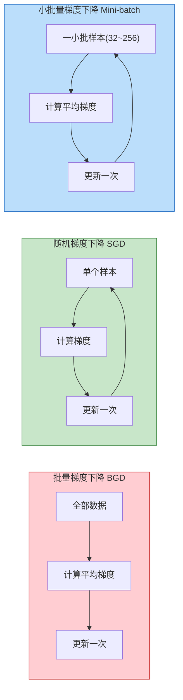
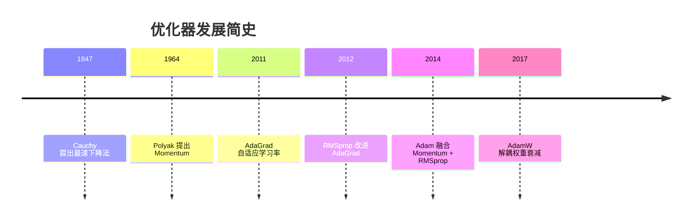
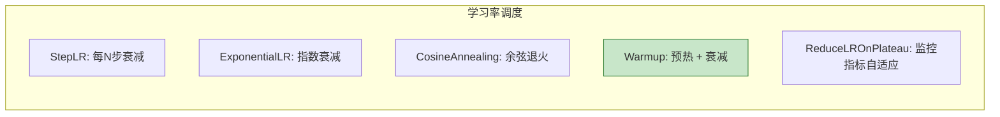

# 梯度下降与优化器
> 创建日期：2026-06-06
> 难度：⭐⭐⭐
> 前置知识：导数与偏导数、梯度概念、链式法则、神经网络基础

## ⭐ 面试重点速览

- 理解"梯度方向 = 函数值上升最快的方向，负梯度方向 = 下降最快的方向"
- 掌握 SGD、Momentum、Adam 的核心区别：一个"只看当前"、一个"带惯性"、一个"自适应步伐"
- 知道 Adam 为什么是默认首选：结合了 Momentum 和自适应学习率，且对超参数不敏感
- 理解学习率调度（Warmup + Cosine Decay）是 Transformer 训练的关键技巧
- 能说清"鞍点"和"局部最优"的区别，以及为什么 SGD 的噪声反而是好事

---

## 一、应用场景 🎯

梯度下降是深度学习的"引擎"，所有神经网络训练都依赖它来更新参数。不同优化器的选择直接影响：

| 场景 | 推荐优化器 | 原因 |
|------|----------|------|
| 图像分类（ResNet 等） | SGD + Momentum | 泛化能力更好，工业界常用 |
| Transformer / BERT / GPT | AdamW | 自适应学习率 + 权重衰减解耦 |
| GAN 训练 | Adam | 对超参数不敏感，训练稳定 |
| 强化学习（PPO 等） | Adam | 非平稳目标下稳定 |
| 快速原型 / 小数据集 | Adam | 收敛快，调参少 |
| 最终上线模型 | SGD + Momentum | 在某些任务上泛化更优 |

> **面试金句**："Adam 是 90% 场景的默认选择；当追求极致泛化时，换 SGD + Momentum 并仔细调学习率。"

---

## 二、核心原理 🔬

### 2.1 梯度下降的数学本质

优化目标：找到参数 $\theta$，使损失函数 $J(\theta)$ 最小。

$$\theta_{t+1} = \theta_t - \eta \cdot \nabla_\theta J(\theta_t)$$

其中 $\eta$ 是学习率，$\nabla_\theta J(\theta_t)$ 是损失函数关于参数的梯度。

**为什么是负梯度方向？** 梯度方向是函数值增长最快的方向（方向导数最大），所以负梯度方向就是下降最快的方向。

### 2.2 BGD / SGD / Mini-batch GD 对比



| 方法 | 每次更新用多少数据 | 优点 | 缺点 |
|------|-----------------|------|------|
| **BGD** | 全部 N 个样本 | 梯度准确，收敛稳定 | 每步都慢，不支持大数据集 |
| **SGD** | 1 个样本 | 极快，可在线学习 | 梯度噪声大，收敛震荡 |
| **Mini-batch** | m 个样本（32~256） | **折中方案，实际标配** | batch size 需要调 |

### 2.3 优化器演进路线



### 2.4 Momentum（动量 / 惯性）

**核心思想**：不仅看当前梯度，还保留之前梯度的方向，像小球滚下山坡一样积累动量。

$$v_t = \beta v_{t-1} + (1 - \beta) \nabla J(\theta_t)$$
$$\theta_{t+1} = \theta_t - \eta \cdot v_t$$

其中 $\beta \approx 0.9$ 是动量系数。**效果**：
- 加速收敛：在一致的方向上加速
- 抑制震荡：在震荡的方向上互相抵消
- 帮助越过局部极小值和鞍点

### 2.5 AdaGrad（自适应学习率）

**核心思想**：每个参数有自己的学习率，经常更新的参数学习率变小，不常更新的参数学习率变大。

$$G_t = G_{t-1} + (\nabla J(\theta_t))^2$$
$$\theta_{t+1} = \theta_t - \frac{\eta}{\sqrt{G_t + \epsilon}} \cdot \nabla J(\theta_t)$$

**致命缺陷**：$G_t$ 单调递增，分母越来越大，最终学习率趋近于 0，训练提前停止。因此有了 RMSprop 的改进。

### 2.6 Adam（Momentum + 自适应学习率）

**核心思想**：把 Momentum（一阶矩估计）和 RMSprop（二阶矩估计）结合起来，再加上偏差修正。

$$m_t = \beta_1 m_{t-1} + (1 - \beta_1) g_t \quad \text{（一阶矩 / 动量项）}$$
$$v_t = \beta_2 v_{t-1} + (1 - \beta_2) g_t^2 \quad \text{（二阶矩 / 自适应项）}$$
$$\hat{m}_t = \frac{m_t}{1 - \beta_1^t}, \quad \hat{v}_t = \frac{v_t}{1 - \beta_2^t} \quad \text{（偏差修正）}$$
$$\theta_{t+1} = \theta_t - \eta \cdot \frac{\hat{m}_t}{\sqrt{\hat{v}_t} + \epsilon}$$

**默认超参数**：$\beta_1 = 0.9$，$\beta_2 = 0.999$，$\epsilon = 10^{-8}$，$\eta = 0.001$。

### 2.7 优化器对比总结

| 优化器 | 核心机制 | 需要调学习率吗 | 适用场景 |
|--------|---------|-------------|---------|
| SGD | 纯梯度方向 | 必须精心调 | 追求极致泛化 |
| SGD + Momentum | 梯度 + 惯性 | 需要调 | 图像分类（ResNet） |
| AdaGrad | 自适应（累加） | 少 | 稀疏特征 |
| RMSprop | 自适应（指数移动平均） | 少 | RNN |
| Adam | 动量 + 自适应 | 几乎不用 | **默认首选** |
| AdamW | Adam + 解耦权重衰减 | 几乎不用 | Transformer |

### 2.8 学习率调度策略



| 策略 | 特点 | 适用场景 |
|------|------|---------|
| **StepLR** | 每固定步数乘以 gamma | 通用 |
| **CosineAnnealing** | 按照余弦曲线平滑衰减 | 图像分类、对比学习 |
| **Warmup + Cosine** | 先线性增加再余弦衰减 | **Transformer 标配** |
| **ReduceLROnPlateau** | 损失不降时自动降低 | 训练不稳定时 |
| **OneCycleLR** | 先升后降的单周期 | 快速训练 |

> **面试重点**：为什么 Transformer 需要 Warmup？训练初期，参数随机初始化，梯度方向不稳定，直接使用大学习率会导致训练发散。Warmup 从小学习率开始，让模型"找到方向"后再加速。

### 2.9 局部最优 vs 鞍点


**关键认知**：在高维空间中，鞍点比局部最优更常见（指数级增长）。好消息是 SGD 的噪声能帮助逃离鞍点，因为鞍点处梯度为 0，但噪声扰动会推着参数离开鞍点区域。

---

## 三、趣味解说 🎭

### 蒙着眼睛下山 -- 梯度下降的直观类比

想象你被蒙着眼睛放在一座山上，任务是走到山谷的最低点。你唯一能感知的是脚下的坡度（梯度）：

- **你往脚底最陡的方向走一步**（梯度下降）
- 如果步子太大，你会冲过头甚至滚下山（学习率太大导致发散）
- 如果步子太小，天黑都走不到（学习率太小收敛极慢）
- 如果每一步只根据当前坡度决定方向，你会走出一条锯齿状的路线（SGD 的震荡）

**Momentum 像什么？** 你不再只根据当前坡度走，而是"记住之前的运动方向"。就像从山坡上滚下来的球，速度越来越快，遇到小坑可以靠惯性冲过去，不会卡在局部最小值里。

**Adam 像什么？** 你不仅记住了方向（惯性），还给每个脚（每个参数）配了不同大小的鞋子。之前经常走大步的脚现在穿小鞋（学习率变小），几乎不动的脚现在穿大鞋（学习率变大）。这样在崎岖不平的地形上也能平稳前进。

**学习率调度像什么？** 刚开始下山时你小心试探（Warmup），看清地形后大步流星（高学习率），快到谷底时放慢脚步细细调整（衰减）。

---

## 四、代码实现 💻

### 4.1 从零实现各优化器（NumPy 版）

```python
import numpy as np


class Optimizer:
    """优化器基类"""

    def __init__(self, lr=0.01):
        self.lr = lr

    def step(self, params, grads):
        raise NotImplementedError


class SGD(Optimizer):
    """纯 SGD，无动量"""

    def step(self, params, grads):
        for p, g in zip(params, grads):
            p -= self.lr * g


class Momentum(Optimizer):
    """带动量的 SGD"""

    def __init__(self, lr=0.01, beta=0.9):
        super().__init__(lr)
        self.beta = beta
        self.velocity = None  # 惰性初始化

    def step(self, params, grads):
        if self.velocity is None:
            self.velocity = [np.zeros_like(p) for p in params]
        for i, (p, g) in enumerate(zip(params, grads)):
            # 速度更新: 保留历史动量 + 当前梯度
            self.velocity[i] = self.beta * self.velocity[i] + (1 - self.beta) * g
            p -= self.lr * self.velocity[i]


class Adam(Optimizer):
    """Adam 优化器"""

    def __init__(self, lr=0.001, beta1=0.9, beta2=0.999, eps=1e-8):
        super().__init__(lr)
        self.beta1 = beta1
        self.beta2 = beta2
        self.eps = eps
        self.m = None   # 一阶矩（动量）
        self.v = None   # 二阶矩（自适应）
        self.t = 0      # 时间步

    def step(self, params, grads):
        if self.m is None:
            self.m = [np.zeros_like(p) for p in params]
            self.v = [np.zeros_like(p) for p in params]
        self.t += 1
        for i, (p, g) in enumerate(zip(params, grads)):
            # 更新一阶矩和二阶矩的指数移动平均
            self.m[i] = self.beta1 * self.m[i] + (1 - self.beta1) * g
            self.v[i] = self.beta2 * self.v[i] + (1 - self.beta2) * (g ** 2)
            # 偏差修正: 抵消初始化偏差
            m_hat = self.m[i] / (1 - self.beta1 ** self.t)
            v_hat = self.v[i] / (1 - self.beta2 ** self.t)
            # 自适应更新
            p -= self.lr * m_hat / (np.sqrt(v_hat) + self.eps)


# ====== 演示: 不同优化器优化同一个二次函数 ======
def demo_optimizers():
    # 目标函数: f(x, y) = x² + 10y²（一个方向陡、一个方向缓）
    # 梯度: [2x, 20y]，初始点: [5, 5]
    init = [np.array([5.0]), np.array([5.0])]

    optimizers = {
        "SGD": SGD(lr=0.05),
        "Momentum": Momentum(lr=0.05, beta=0.9),
        "Adam": Adam(lr=0.1),
    }

    for name, opt in optimizers.items():
        params = [p.copy() for p in init]
        path = [(params[0][0], params[1][0])]
        for _ in range(100):
            grads = [2 * params[0], 20 * params[1]]  # 梯度
            opt.step(params, grads)
            path.append((params[0][0], params[1][0]))
        final_loss = params[0][0]**2 + 10 * params[1][0]**2
        print(f"{name:>10s}: 最终 loss={final_loss:.6f}, 位置=({params[0][0]:.4f}, {params[1][0]:.4f})")


if __name__ == "__main__":
    demo_optimizers()
```

### 4.2 PyTorch 中使用优化器

```python
import torch
import torch.nn as nn
import torch.optim as optim
from torch.optim.lr_scheduler import CosineAnnealingLR, LinearLR, SequentialLR


# 定义一个简单模型
model = nn.Sequential(
    nn.Linear(784, 256),
    nn.ReLU(),
    nn.Linear(256, 10)
)

# 不同优化器示例
optimizer_sgd = optim.SGD(model.parameters(), lr=0.01, momentum=0.9, weight_decay=1e-4)
optimizer_adam = optim.Adam(model.parameters(), lr=0.001, betas=(0.9, 0.999))
optimizer_adamw = optim.AdamW(model.parameters(), lr=0.001, weight_decay=0.01)

# --- 学习率调度示例 ---
# 1. 余弦退火（最常用）
scheduler_cosine = CosineAnnealingLR(optimizer_adam, T_max=100, eta_min=1e-6)

# 2. Warmup + 余弦衰减（Transformer 标配）
warmup = LinearLR(optimizer_adam, start_factor=0.01, total_iters=10)
cosine = CosineAnnealingLR(optimizer_adam, T_max=90, eta_min=1e-6)
scheduler_warmup_cosine = SequentialLR(
    optimizer_adam, schedulers=[warmup, cosine], milestones=[10]
)

# 3. 监控验证损失自适应降低
scheduler_plateau = optim.lr_scheduler.ReduceLROnPlateau(
    optimizer_adam, mode='min', factor=0.5, patience=5
)


# 训练循环模板
def train_one_epoch(model, dataloader, optimizer, criterion):
    model.train()
    total_loss = 0
    for batch_x, batch_y in dataloader:
        optimizer.zero_grad()           # 1. 清空梯度
        output = model(batch_x)         # 2. 前向传播
        loss = criterion(output, batch_y)  # 3. 计算损失
        loss.backward()                 # 4. 反向传播
        optimizer.step()                # 5. 优化器更新参数
        total_loss += loss.item()
    return total_loss / len(dataloader)
```

---

## 五、优缺点 ⚖️

### 各优化器对比

| 优化器 | 收敛速度 | 稳定性 | 泛化能力 | 调参难度 | 内存占用 |
|--------|---------|--------|---------|---------|---------|
| SGD | 慢 | 差（震荡） | 最好 | 高 | 最低 |
| SGD + Momentum | 中 | 中 | 很好 | 中 | 低 |
| AdaGrad | 中（前期快） | 中（后期停滞） | 中 | 低 | 中 |
| RMSprop | 快 | 好 | 中 | 低 | 中 |
| Adam | 最快 | 最好 | 中 | 最低 | 较高（2倍参数） |
| AdamW | 最快 | 最好 | 好 | 最低 | 较高 |

### 梯度下降通用优缺点

| 优点 | 缺点 |
|------|------|
| 简单直观，易于实现和调试 | 对学习率敏感，需要仔细调参 |
| 适用于任何可导的损失函数 | 可能陷入局部最优或鞍点 |
| 配合自动微分可处理任意复杂模型 | 非凸优化无法保证全局最优 |
| 小批量梯度下降支持 GPU 并行 | 梯度消失/爆炸影响深层网络训练 |
| 优化器变体丰富，覆盖各种场景 | 超参数组合空间大，调参成本高 |

---

## 六、面试高频题 📝

### Q1：SGD 为什么在最优解附近震荡？如何解决？

**答案**：SGD 每次只用一个或一小批样本计算梯度，梯度方向是真实梯度的有偏估计，存在噪声。接近最优解时，梯度本身很小，噪声占比变大，导致参数在最优解附近来回震荡。

**解决方案**：
- 减小学习率或使用学习率衰减
- 使用 Momentum 平滑梯度方向
- 使用 Adam 等自适应优化器

### Q2：Adam 的偏差修正是什么？为什么需要？

**答案**：Adam 初始时 $m_0=0$ 和 $v_0=0$，如果不做修正，前几步的估计会偏向 0。偏差修正除以 $(1-\beta^t)$ 来抵消这个偏差。随着 $t$ 增大，$\beta^t \to 0$，修正因子趋近于 1，修正自动失效。

```python
# 偏差修正示例
# t=1 时: m_hat = m / (1 - 0.9^1) = m / 0.1 = 10 * m
# 前几步的 m 被放大，补偿初始化偏差
# t=100 时: m_hat ≈ m（修正几乎无用）
```

### Q3：为什么 Adam 有时泛化不如 SGD？

**答案**：这是一个活跃的研究话题。主流解释是：
- Adam 的自适应机制使得参数更新路径更"激进"，容易收敛到尖锐的极小值（sharp minima），这类解泛化性差
- SGD 的噪声使得更新路径更"保守"，倾向于收敛到平坦的极小值（flat minima），泛化性更好
- **解决方案**：使用 AdamW + 合适的权重衰减，或训练后期切换到 SGD（SWATS 策略）

### Q4：学习率太大会怎样？太小会怎样？

| 学习率 | 现象 | 诊断方法 |
|--------|------|---------|
| 太大 | Loss 震荡甚至变成 NaN | 观察 Loss 曲线是否剧烈波动 |
| 适中 | Loss 平稳下降 | 理想状态 |
| 太小 | Loss 下降极慢，可能卡在局部最优 | Loss 几乎不变，但训练集准确率也不高 |

### Q5：Batch Size 和 Learning Rate 的关系？

**答案**：当 batch size 增大 k 倍时，梯度估计的方差减小 $\sqrt{k}$ 倍，梯度更稳定。因此可以相应增大学习率。**线性缩放法则**：batch size 翻倍，学习率也翻倍（在合理范围内）。这是大批量训练（如 32K batch size 的 BERT 预训练）的核心技巧。

---

## 七、常见误区 ❌

| 误区 | 真相 |
|------|------|
| "Adam 一定能收敛" | 不一定。Adam 在某些问题上可能不收敛，因为学习率可能震荡。AMSGrad 试图修复这个问题。 |
| "梯度为 0 就是最优解" | 可能是鞍点。高维空间中鞍点远比局部最优多。 |
| "优化器越新越好" | SGD + Momentum 在图像分类上泛化往往优于 Adam。选择合适的而非最新的。 |
| "学习率衰减不重要" | 对 Transformer 训练至关重要。Warmup + 衰减是标配。 |
| "所有参数用同一个学习率就行" | 不同层可能需要不同学习率。如微调时主干网络用更小的学习率。 |
| "Loss 一直下降就是正常训练" | Loss 下降但验证集指标不提升 = 过拟合的信号。需要早停或正则化。 |