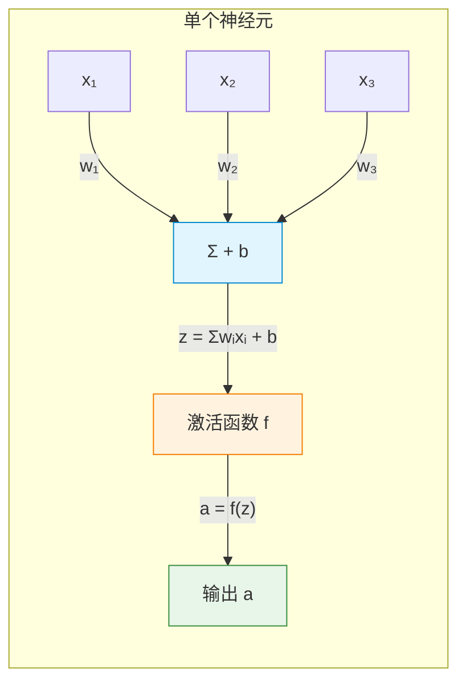
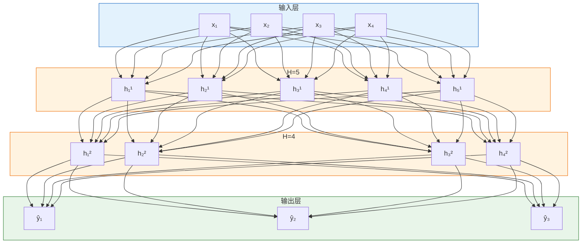
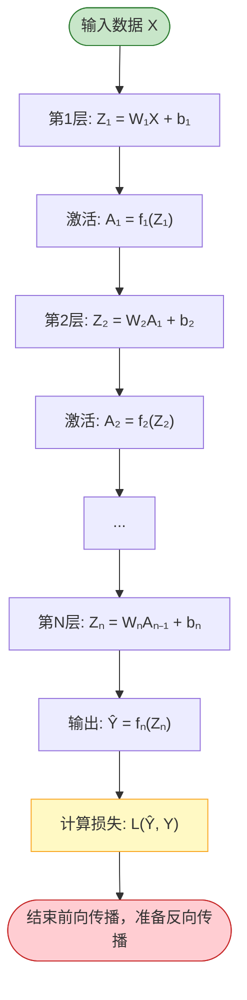

# DL 算法全景
> 创建日期：2026-06-06
> 难度：⭐⭐⭐
> 前置知识：线性代数（矩阵运算）、微积分（导数/偏导数）、概率论（条件概率/期望）、Python 编程基础

## ⭐ 面试重点速览

- 理解"前向传播 = 复合函数求值、反向传播 = 链式法则求导"的本质
- 掌握激活函数的选择逻辑：为什么隐藏层默认用 ReLU，输出层因任务而异
- 区分损失函数与评估指标：损失函数要可导，评估指标只需反映业务目标
- 能画出三层全连接网络的结构，并说出每一层的输入/输出维度
- 理解过拟合的成因及正则化手段（L1/L2/Dropout/Early Stopping）

---

## 一、应用场景 🎯

深度学习是当前 AI 落地的核心技术栈，覆盖几乎所有模态的数据处理：

| 应用领域 | 典型任务 | 核心算法 |
|---------|---------|---------|
| 计算机视觉(CV) | 图像分类 / 目标检测 / 语义分割 | CNN、ViT、YOLO |
| 自然语言处理(NLP) | 文本分类 / 机器翻译 / 问答系统 | RNN/LSTM、Transformer、BERT/GPT |
| 语音处理 | 语音识别 (ASR) / 语音合成 (TTS) | RNN/LSTM、Conformer、WaveNet |
| 推荐系统 | CTR 预估 / 召回 / 排序 | DeepFM、DIN、多任务学习 |
| 强化学习 | 游戏 AI / 机器人控制 | DQN、PPO、Actor-Critic |

**面试常见问法**："给你一个业务场景，你怎么选模型架构？" -- 回答的核心是：先看数据模态，再看任务类型，最后考虑资源约束。

---

## 二、核心原理 🔬

### 2.1 神经网络究竟是什么

从数学本质来看，神经网络是一系列矩阵乘法和非线性变换的复合：

$$Y = f_n(W_n \cdot f_{n-1}(W_{n-1} \cdot ... f_1(W_1 \cdot X + b_1) ... + b_{n-1}) + b_n)$$

其中 $W_i$ 是权重矩阵，$b_i$ 是偏置向量，$f_i$ 是激活函数。**深度学习 = 用大量数据自动学习这些矩阵的最佳取值。**

> 关键认知：如果没有激活函数（即 $f(x) = x$），多层网络等价于单层线性变换，因为矩阵乘法具有结合性：$W_2(W_1X) = (W_2W_1)X = W'X$。

### 2.2 神经元结构（Mermaid 图）



一个神经元完成三件事：
1. **加权求和**：$z = \sum_{i=1}^{n} w_i x_i + b$
2. **非线性激活**：$a = f(z)$
3. **传递给下一层**

### 2.3 多层神经网络结构



> 上图是全连接网络（FCN / MLP），相邻两层之间每个神经元都相连，参数量 = 输入维度 x 输出维度。

### 2.4 前向传播完整流程



---

### 2.5 激活函数对比

激活函数是神经网络的"灵魂"，决定了网络的表达能力。

| 激活函数 | 公式 | 输出范围 | 优点 | 缺点 | 适用场景 |
|---------|------|---------|------|------|---------|
| **Sigmoid** | $\sigma(x)=\frac{1}{1+e^{-x}}$ | (0, 1) | 平滑、可解释为概率 | 梯度消失、输出非零中心 | 二分类输出层 |
| **Tanh** | $\tanh(x)=\frac{e^x-e^{-x}}{e^x+e^{-x}}$ | (-1, 1) | 零中心，梯度更强 | 仍有梯度消失 | RNN 内部（已较少用） |
| **ReLU** | $f(x)=\max(0, x)$ | [0, +∞) | 计算快、缓解梯度消失 | 神经元"死亡"（Dead ReLU） | 隐藏层默认首选 |
| **Leaky ReLU** | $f(x)=\max(0.01x, x)$ | (-∞, +∞) | 解决 Dead ReLU | 负区间斜率需调参 | ReLU 的保守替代 |
| **GELU** | $x \cdot \Phi(x)$ | (-∞, +∞) | 平滑、概率性正则化 | 计算略复杂 | Transformer(BERT/GPT) |
| **Swish** | $x \cdot \sigma(\beta x)$ | (-∞, +∞) | 自门控、效果好 | 计算成本高于 ReLU | EfficientNet 等 |

**面试金句**：
- "隐藏层默认 ReLU，如果发现大量神经元死亡再换 Leaky ReLU 或 PReLU。"
- "输出层：二分类用 Sigmoid，多分类用 Softmax，回归用恒等函数（不加激活）。"

---

### 2.6 损失函数对比

| 损失函数 | 公式 | 适用任务 | 核心特点 |
|---------|------|---------|---------|
| **MSE（均方误差）** | $\frac{1}{n}\sum(y_i - \hat{y}_i)^2$ | 回归 | 对大误差敏感（平方惩罚） |
| **MAE（平均绝对误差）** | $\frac{1}{n}\sum|y_i - \hat{y}_i|$ | 回归（鲁棒） | 对异常值不敏感 |
| **交叉熵（CrossEntropy）** | $-\sum y_i \log(\hat{y}_i)$ | 分类 | 配合 Softmax，梯度漂亮 |
| **Hinge Loss** | $\max(0, 1 - y \cdot \hat{y})$ | SVM / 二分类 | 最大间隔分类 |
| **Focal Loss** | $-\alpha(1-p_t)^\gamma \log(p_t)$ | 类别不平衡分类 | 降低易分类样本权重 |

> **面试重点**：交叉熵 vs MSE 的区别。MSE + Sigmoid 会导致梯度消失（因为 Sigmoid 饱和区导数接近 0），而交叉熵 + Softmax 能抵消这个效应，梯度为 $\hat{y} - y$，非常简洁。

---

## 三、趣味解说 🎭

### 3.1 神经网络像什么？-- 工厂的流水线质检系统

想象你是一家玩具厂的老板，你需要判断流水线上的玩具是否合格：

- **输入层**：质检员的眼睛看到玩具的颜色、大小、重量、形状（原始特征）
- **隐藏层工人甲**：专门检查"颜色是否均匀""有没有裂缝"（低级特征）
- **隐藏层工人乙**：根据甲的判断，进一步分析"整体外观分""结构完整性"（中级特征）
- **隐藏层工人丙**：综合以上信息，判断"这个玩具能不能出厂"（高级特征）
- **输出层**：最终结论 -- 合格 ✓ 或不合格 ✗

每个工人（神经元）只会做一件简单的事：把前一个工人的结论加权汇总，然后决定自己"激活"到什么程度（比如"0=完全不信，1=完全确信"）。

**训练过程**就是：把一堆已知合格/不合格的玩具给工人们看，让他们不断调整自己给上个工人的"信任度"（权重），直到判断越来越准。

### 3.2 激活函数像什么？-- 神经元发放电信号的阈值

神经元不是"看到什么就说什么"，而是"只有足够强才说话"：
- **ReLU** 像一个倔老头："你说得不够大声我就不理你（输出0），一旦超过阈值我就原样传达。" 这就是"稀疏激活"——大部分神经元不工作，高效节能！
- **Sigmoid** 像一个谨慎的秘书："你说的我再有把握，也只敢传到 0~1 之间，绝不会走极端。"

---

## 四、代码实现 💻

### 4.1 从零实现一个三层神经网络（NumPy 版，帮助理解原理）

```python
import numpy as np


def sigmoid(x):
    """Sigmoid 激活函数"""
    return 1 / (1 + np.exp(-x))


def sigmoid_derivative(x):
    """Sigmoid 的导数: σ(x) * (1 - σ(x))"""
    s = sigmoid(x)
    return s * (1 - s)


def relu(x):
    """ReLU 激活函数"""
    return np.maximum(0, x)


def relu_derivative(x):
    """ReLU 导数: x>0 时为 1，否则为 0"""
    return (x > 0).astype(float)


class ThreeLayerNN:
    """三层神经网络: 输入层 → 隐藏层(ReLU) → 输出层(Sigmoid)"""

    def __init__(self, input_dim, hidden_dim, output_dim):
        # He 初始化: 适配 ReLU 激活
        self.W1 = np.random.randn(input_dim, hidden_dim) * np.sqrt(2.0 / input_dim)
        self.b1 = np.zeros((1, hidden_dim))
        # Xavier 初始化: 适配 Sigmoid 激活
        self.W2 = np.random.randn(hidden_dim, output_dim) * np.sqrt(1.0 / hidden_dim)
        self.b2 = np.zeros((1, output_dim))

    def forward(self, X):
        """前向传播"""
        # 隐藏层: 线性变换 + ReLU
        self.Z1 = np.dot(X, self.W1) + self.b1  # (N, H)
        self.A1 = relu(self.Z1)                  # (N, H) 激活

        # 输出层: 线性变换 + Sigmoid
        self.Z2 = np.dot(self.A1, self.W2) + self.b2  # (N, C)
        self.A2 = sigmoid(self.Z2)                     # (N, C) 输出概率

        return self.A2

    def backward(self, X, y, learning_rate=0.01):
        """反向传播"""
        m = X.shape[0]  # 样本数

        # --- 输出层梯度 ---
        # 交叉熵 + Sigmoid 的简洁梯度: dL/dZ2 = A2 - y
        dZ2 = self.A2 - y                                          # (N, C)
        dW2 = np.dot(self.A1.T, dZ2) / m                           # (H, C)
        db2 = np.sum(dZ2, axis=0, keepdims=True) / m               # (1, C)

        # --- 隐藏层梯度 ---
        dA1 = np.dot(dZ2, self.W2.T)                               # (N, H)
        dZ1 = dA1 * relu_derivative(self.Z1)                       # (N, H)
        dW1 = np.dot(X.T, dZ1) / m                                 # (D, H)
        db1 = np.sum(dZ1, axis=0, keepdims=True) / m               # (1, H)

        # --- 参数更新（梯度下降）---
        self.W2 -= learning_rate * dW2
        self.b2 -= learning_rate * db2
        self.W1 -= learning_rate * dW1
        self.b1 -= learning_rate * db1

    def compute_loss(self, y_true, y_pred):
        """二分类交叉熵损失"""
        eps = 1e-15  # 防止 log(0)
        y_pred = np.clip(y_pred, eps, 1 - eps)
        return -np.mean(y_true * np.log(y_pred) + (1 - y_true) * np.log(1 - y_pred))


# ====== 使用示例 ======
if __name__ == "__main__":
    # 模拟数据: 100个样本, 10维特征, 2分类
    X = np.random.randn(100, 10)
    y = np.random.randint(0, 2, (100, 1)).astype(float)

    model = ThreeLayerNN(input_dim=10, hidden_dim=20, output_dim=1)

    for epoch in range(1000):
        y_pred = model.forward(X)
        loss = model.compute_loss(y, y_pred)
        model.backward(X, y, learning_rate=0.01)
        if epoch % 200 == 0:
            print(f"Epoch {epoch}, Loss: {loss:.4f}")
```

### 4.2 PyTorch 等价实现（生产环境写法）

```python
import torch
import torch.nn as nn
import torch.optim as optim


class ThreeLayerNN(nn.Module):
    """PyTorch 版三层神经网络"""

    def __init__(self, input_dim, hidden_dim, output_dim):
        super().__init__()
        self.fc1 = nn.Linear(input_dim, hidden_dim)   # 输入 → 隐藏
        self.relu = nn.ReLU()
        self.fc2 = nn.Linear(hidden_dim, output_dim)   # 隐藏 → 输出
        self.sigmoid = nn.Sigmoid()

    def forward(self, x):
        x = self.relu(self.fc1(x))
        x = self.sigmoid(self.fc2(x))
        return x


# 训练示例
model = ThreeLayerNN(10, 20, 1)
criterion = nn.BCELoss()          # 二分类交叉熵
optimizer = optim.Adam(model.parameters(), lr=0.001)

X = torch.randn(100, 10)
y = torch.randint(0, 2, (100, 1)).float()

for epoch in range(1000):
    optimizer.zero_grad()         # 清空上一步梯度
    y_pred = model(X)             # 前向传播
    loss = criterion(y_pred, y)   # 计算损失
    loss.backward()               # 反向传播（自动求导！）
    optimizer.step()              # 参数更新
    if epoch % 200 == 0:
        print(f"Epoch {epoch}, Loss: {loss.item():.4f}")
```

---

## 五、优缺点 ⚖️

### 神经网络 vs 传统 ML

| 维度 | 神经网络（深度学习） | 传统机器学习（LR/SVM/树模型） |
|------|-------------------|---------------------------|
| **特征工程** | 自动学习特征（端到端） | 依赖人工特征设计 |
| **数据需求** | 大量（万级别起步） | 少量即可有效（百~千级） |
| **可解释性** | 较差（黑盒） | 较好（特征权重可解读） |
| **训练成本** | 高（需 GPU） | 低（CPU 即可） |
| **非线性建模** | 极强（万能逼近定理） | 有限（核方法或树深度限制） |
| **过拟合风险** | 高（参数巨大） | 相对可控 |
| **适用场景** | 图像/语音/文本等非结构化数据 | 表格数据/结构化数据 |

> **面试金句**："选模型不要迷信深度学习。如果数据量小且是表格数据，XGBoost 往往比神经网络更快更好；如果是图像/文本/语音，那基本就是深度学习的主场。"

---

## 六、面试高频题 📝

### Q1：为什么需要激活函数？如果没有会怎样？

**标准答案**：没有激活函数（或使用线性激活），多层网络等价于单层线性变换，因为 $W_2(W_1X) = (W_2W_1)X = W'X$，丧失了学习非线性边界的能力。激活函数引入非线性，是深度网络有"深度"意义的前提。

### Q2：Softmax 函数的作用是什么？为什么叫"Soft"max？

**标准答案**：Softmax 将任意实数向量映射为概率分布（所有元素非负且和为 1）。"Soft" 体现在它不是直接取最大（Hard max），而是让所有值都参与概率分配：$\text{Softmax}(z_i) = \frac{e^{z_i}}{\sum_j e^{z_j}}$。指数操作放大了差异，使得大的更突出、小的被抑制，但不会完全归零。

### Q3：Batch Size 大小对训练有什么影响？

| Batch Size | 优点 | 缺点 |
|-----------|------|------|
| 小（如 32） | 泛化好、内存省、梯度噪声有助于跳出局部最优 | 训练慢、梯度不稳定 |
| 大（如 512） | 训练快、梯度稳定 | 泛化差、内存大、易陷入尖锐极小值 |
| 全量（BGD） | 梯度最准确 | 不支持大数据集、无法在线学习 |

### Q4：如何判断模型是欠拟合还是过拟合？

| 现象 | 训练 Loss | 验证 Loss | 诊断 |
|------|----------|----------|------|
| 两者都高 | 高 | 高 | 欠拟合 -- 增加模型容量或训练时间 |
| 训练低、验证高 | 低 | 高/上升 | 过拟合 -- 加正则化/数据增强/Dropout |
| 两者都低 | 低 | 低 | 理想状态（也可能数据泄露，需排查） |

---

## 七、常见误区 ❌

| 误区 | 真相 |
|------|------|
| "层数越多效果越好" | 不一定。过深会导致梯度消失、优化困难。ResNet 之前超过 20 层就退化。深度要有配套技巧（残差连接、BN）。 |
| "ReLU 永远比 Sigmoid 好" | 分场景。输出层需要概率时 Sigmoid/Softmax 不可替代；某些门控机制也需要 Sigmoid 的 (0,1) 范围。 |
| "Loss 下降就是学到了" | Loss 下降但验证集指标不提升 = 过拟合（记住了训练数据而非学习规律）。 |
| "神经网络是完全的黑盒" | 不完全。有 Grad-CAM、SHAP、注意力可视化等可解释性工具。但相比决策树确实解释性差。 |
| "训练集准确率 99% 就是好模型" | 很可能过拟合。真实业务中，验证集/测试集上的表现才是模型能力的真实反映。 |
| "学习率越大训练越快" | 太大导致震荡甚至发散，太小收敛巨慢。学习率调度是训练的核心 trick。 |

---

## 附录：深度学习算法知识图谱

```mermaid
graph TD
    CENTER["深度学习算法体系"]
    
    CENTER --> FOUNDATION["基础组件"]
    CENTER --> CNN["CNN 卷积网络"]
    CENTER --> RNN["RNN/LSTM 序列模型"]
    CENTER --> TRANSFORMER["Transformer 架构"]
    
    FOUNDATION --> GD["梯度下降与优化器"]
    FOUNDATION --> BP["反向传播"]
    FOUNDATION --> ACT["激活函数"]
    FOUNDATION --> LOSS["损失函数"]
    FOUNDATION --> REG["正则化技术"]
    
    CNN --> CNN_ARCH["LeNet/AlexNet/VGG/ResNet"]
    CNN --> CNN_APP["图像分类/检测/分割"]
    
    RNN --> LSTM["LSTM 长短期记忆"]
    RNN --> GRU["GRU 门控循环单元"]
    RNN --> SEQ2SEQ["Seq2Seq + Attention"]
    
    TRANSFORMER --> SELF_ATTN["Self-Attention 机制"]
    TRANSFORMER --> BERT["BERT 预训练"]
    TRANSFORMER --> GPT["GPT 生成式"]
    TRANSFORMER --> VIT["ViT 视觉Transformer"]

    style CENTER fill:#ff6f00,stroke:#e65100,color:#fff
    style FOUNDATION fill:#1565c0,stroke:#0d47a1,color:#fff
    style CNN fill:#2e7d32,stroke:#1b5e20,color:#fff
    style RNN fill:#6a1b9a,stroke:#4a148c,color:#fff
    style TRANSFORMER fill:#c62828,stroke:#b71c1c,color:#fff
```



> **学习路线建议**：基础组件（梯度下降 + 反向传播）-> CNN -> RNN/LSTM -> Transformer。每个阶段的算法都是对前一个的改进和扩展，理解了"为什么需要改进"，才能真正掌握。