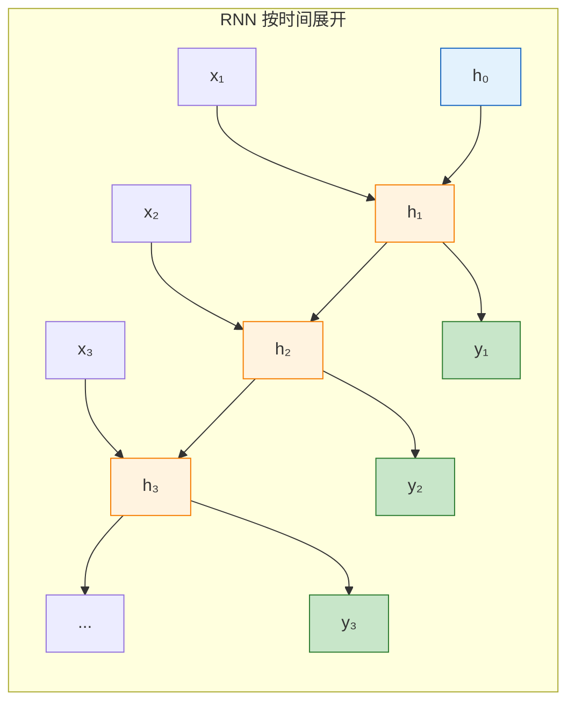
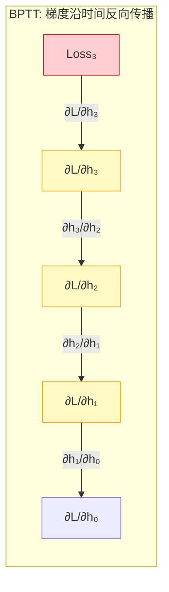
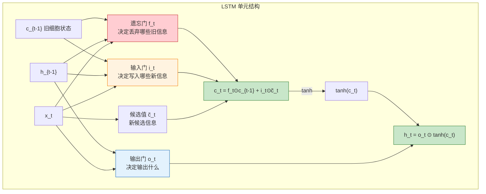
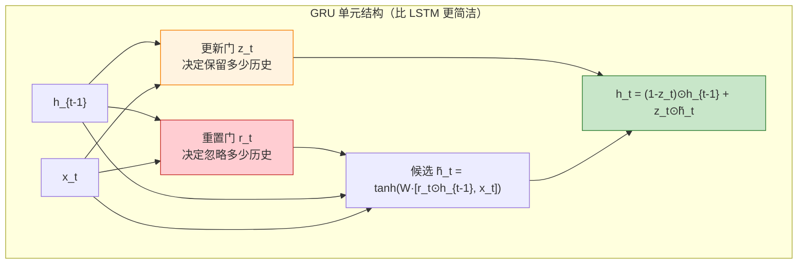
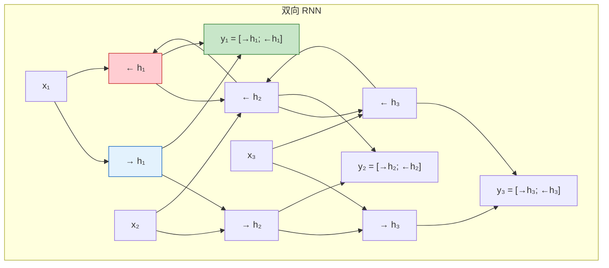
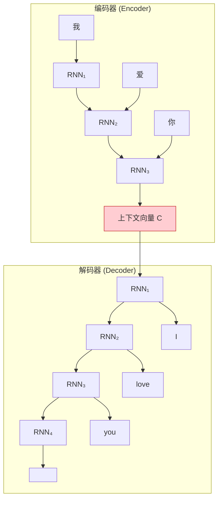

# RNN / LSTM / GRU
> 创建日期：2026-06-06
> 难度：⭐⭐⭐
> 前置知识：全连接网络、反向传播、链式法则、时间序列的基本概念

## ⭐ 面试重点速览

- 理解 RNN 的核心：**隐藏状态** 是"记忆"，在每个时间步被更新并传递
- 掌握 RNN 的致命缺陷：BPTT（时间反向传播）导致梯度消失/爆炸，无法处理长序列
- 熟记 LSTM 三个门的作用：遗忘门（丢什么）、输入门（记什么）、输出门（说什么）
- 能对比 LSTM 和 GRU：GRU 合并了遗忘门和输入门，参数更少，效果相当
- 知道 Seq2Seq + Attention 为什么必要：解决长序列的"信息瓶颈"问题

---

## 一、应用场景 🎯

RNN 家族是序列建模的经典方案，虽然 Transformer 在 NLP 领域占据主导，但 RNN/LSTM 在以下场景仍不可替代：

| 场景 | 为什么用 RNN/LSTM | 典型模型 |
|------|------------------|---------|
| 时间序列预测 | 天然适合序列数据，状态传递机制直观 | DeepAR、LSTM-Forecast |
| 语音识别 (ASR) | 流式处理延迟低 | DeepSpeech、Conformer |
| 手写识别 | 笔画序列天然是时序数据 | MDLSTM |
| 音乐生成 | 逐音符生成，依赖历史上下文 | MusicRNN |
| 传感器数据分析 | 嵌入式设备资源有限，LSTM 比 Transformer 轻量 | LSTM-Anomaly |
| 命名实体识别 (NER) | 双向 LSTM + CRF 曾是 SOTA | BiLSTM-CRF |
| 机器翻译（旧） | Seq2Seq + Attention 开启了 NLP 新时代 | GNMT |

---

## 二、核心原理 🔬

### 2.1 RNN 的基本思想

RNN 的核心是**隐藏状态 $h_t$**，它在每个时间步被更新，承载着"到目前为止读到的所有信息"：

$$h_t = \tanh(W_{xh} x_t + W_{hh} h_{t-1} + b_h)$$
$$y_t = W_{hy} h_t + b_y$$

### 2.2 RNN 展开图（Mermaid）



> RNN 的"循环"体现在：同一个权重矩阵 $W_{hh}$ 在每个时间步被重复使用。展开后，它等价于一个深度为序列长度的前馈网络。

### 2.3 BPTT（时间反向传播）

RNN 的反向传播沿着时间展开，称为 BPTT（Backpropagation Through Time）：



**梯度消失的本质**：$\frac{\partial L}{\partial h_0} = \frac{\partial L}{\partial h_T} \cdot \prod_{t=1}^{T} \frac{\partial h_t}{\partial h_{t-1}}$

当 $T$ 很大时，连乘项 $\prod \frac{\partial h_t}{\partial h_{t-1}}$ 中如果每项都小于 1（Tanh 的导数 $\le 1$），就会指数级衰减，导致早期时间步的梯度几乎为零。这意味着 RNN 无法学习长距离依赖。

### 2.4 LSTM（长短期记忆网络）

LSTM 通过**门控机制**和**细胞状态**来解决梯度消失问题：



**LSTM 的三个门控公式**：

| 门 | 公式 | 作用 |
|----|------|------|
| 遗忘门 | $f_t = \sigma(W_f \cdot [h_{t-1}, x_t] + b_f)$ | 决定丢弃细胞状态中的哪些信息（0=全丢，1=全保留） |
| 输入门 | $i_t = \sigma(W_i \cdot [h_{t-1}, x_t] + b_i)$ | 决定将哪些新信息写入细胞状态 |
| 候选值 | $\tilde{c}_t = \tanh(W_c \cdot [h_{t-1}, x_t] + b_c)$ | 创建新的候选信息 |
| 状态更新 | $c_t = f_t \odot c_{t-1} + i_t \odot \tilde{c}_t$ | 更新细胞状态（遗忘+写入） |
| 输出门 | $o_t = \sigma(W_o \cdot [h_{t-1}, x_t] + b_o)$ | 决定输出什么 |
| 隐藏状态 | $h_t = o_t \odot \tanh(c_t)$ | 更新隐藏状态 |

> **关键理解**：细胞状态 $c_t$ 是 LSTM 的"高速公路"。它通过逐元素加法（而不是矩阵乘法）更新，梯度可以沿着 $c_t$ 无衰减地传播，这就是 LSTM 能解决梯度消失的根本原因。

### 2.5 GRU（门控循环单元）

GRU 是 LSTM 的精简版，将遗忘门和输入门合并为"更新门"：



**LSTM vs GRU 对比**：

| 维度 | LSTM | GRU |
|------|------|-----|
| 门的数量 | 3 个（遗忘、输入、输出） | 2 个（重置、更新） |
| 状态数量 | 2 个（$c_t$ 和 $h_t$） | 1 个（$h_t$） |
| 参数量 | 较多 | 约为 LSTM 的 75% |
| 训练速度 | 较慢 | 较快 |
| 效果 | 在大多数任务上相当 | 在小数据集上可能更好 |
| 适用场景 | 需要精细控制记忆时 | 追求效率时 |

### 2.6 双向 RNN (BiRNN)



双向 RNN 在每个时间步结合了**前向隐状态**（读取上文）和**后向隐状态**（读取下文），因此适用于需要完整上下文的场景（如 NER、文本分类）。缺点是不能用于实时/流式处理。

### 2.7 Seq2Seq 架构与 Attention 的引入动机



**Seq2Seq 的信息瓶颈问题**：编码器将整个输入序列压缩为一个固定长度的上下文向量 $C$。当输入序列很长时，这个向量无法承载所有信息，导致翻译质量下降。

**Attention 的引入动机**：解码器的每一步不再只看一个固定的上下文向量，而是**动态地关注编码器的不同位置**：

$$\text{Attention}(Q, K, V) = \text{Softmax}\left(\frac{QK^T}{\sqrt{d_k}}\right)V$$

这为 Transformer 的诞生埋下了伏笔。

---

## 三、趣味解说 🎭

### 读书时你会记住前面的内容来理解后面的句子

想象你正在读一本小说，看到第 100 页：

> "他缓缓地推开门，走了进去。房间里，**她**正坐在窗边..."

你如何知道"她"是谁？因为你记得第 50 页提到"他的妻子玛丽"。你的大脑在阅读时，始终维持着一个**动态更新的记忆**（隐藏状态 $h_t$），读到新内容时，会结合当前记忆来理解。

**RNN 就像这样读书**：
- 每读一个字（$x_t$），更新一次记忆（$h_t$）
- 记忆随着阅读不断更新，旧信息逐渐被新信息覆盖
- 问题：读到第 500 页时，你已经完全忘了第 10 页的内容（梯度消失）

**LSTM 就像读书时做笔记**：
- 你有一个"笔记本"（细胞状态 $c_t$），把重要信息写下来
- 遗忘门：每读一段，你觉得哪些旧笔记不再重要了，就划掉
- 输入门：遇到重要信息，就记下来
- 输出门：回答问题（生成输出）时，从笔记本中提取相关信息

**GRU 就像简化版笔记**：
- 你直接在书上划重点，不另开笔记本
- 更新门：这部分内容，是用旧笔记还是新笔记来覆盖？
- 重置门：需要完全重新开始读这一部分吗？

### Attention 的引入就像"查字典"

当翻译"我爱吃苹果"中的"苹果"时，你不需要记住整句话，而是直接去查"苹果"对应的英文单词。这就是 Attention 的核心思想：**不需要记住所有信息，需要时直接去查**。

---

## 四、代码实现 💻

### 4.1 从零实现 RNN 单元（NumPy 版）

```python
import numpy as np


def sigmoid(x):
    return 1 / (1 + np.exp(-x))


def tanh(x):
    return np.tanh(x)


class SimpleRNN:
    """从零实现简单 RNN 单元"""

    def __init__(self, input_dim, hidden_dim):
        # 初始化权重（小随机数）
        self.W_xh = np.random.randn(input_dim, hidden_dim) * 0.01
        self.W_hh = np.random.randn(hidden_dim, hidden_dim) * 0.01
        self.b_h = np.zeros((1, hidden_dim))

    def forward(self, x, h_prev):
        """
        x: (batch, input_dim) 当前输入
        h_prev: (batch, hidden_dim) 上一时刻的隐藏状态
        """
        h_next = tanh(np.dot(x, self.W_xh) + np.dot(h_prev, self.W_hh) + self.b_h)
        return h_next


class LSTMCell:
    """从零实现 LSTM 单元"""

    def __init__(self, input_dim, hidden_dim):
        # 合并所有门的权重（便于计算）
        self.W = np.random.randn(input_dim + hidden_dim, 4 * hidden_dim) * 0.01
        self.b = np.zeros((1, 4 * hidden_dim))
        self.hidden_dim = hidden_dim

    def forward(self, x, h_prev, c_prev):
        """
        x: (batch, input_dim)
        h_prev: (batch, hidden_dim) 上一时刻隐藏状态
        c_prev: (batch, hidden_dim) 上一时刻细胞状态
        """
        # 拼接输入和上一个隐藏状态
        combined = np.hstack([x, h_prev])  # (batch, input_dim + hidden_dim)
        gates = np.dot(combined, self.W) + self.b  # (batch, 4*hidden_dim)

        # 分割四个门
        i = sigmoid(gates[:, 0:self.hidden_dim])                        # 输入门
        f = sigmoid(gates[:, self.hidden_dim:2*self.hidden_dim])        # 遗忘门
        o = sigmoid(gates[:, 2*self.hidden_dim:3*self.hidden_dim])      # 输出门
        g = tanh(gates[:, 3*self.hidden_dim:4*self.hidden_dim])         # 候选值

        # 细胞状态更新: c_t = f ⊙ c_{t-1} + i ⊙ g
        c_next = f * c_prev + i * g

        # 隐藏状态更新: h_t = o ⊙ tanh(c_t)
        h_next = o * tanh(c_next)

        return h_next, c_next


# 演示: RNN 处理序列
print("=== RNN 前向传播示例 ===")
rnn = SimpleRNN(input_dim=3, hidden_dim=5)
h = np.zeros((1, 5))  # 初始隐藏状态
sequence = np.random.randn(4, 1, 3)  # 4 个时间步的序列

for t, x_t in enumerate(sequence):
    h = rnn.forward(x_t, h)
    print(f"时间步 {t+1}: h_t = {h[0, :3]}...")  # 只打印前 3 个值
```

### 4.2 PyTorch 实现

```python
import torch
import torch.nn as nn


# ====== 1. PyTorch 内置 LSTM ======
class LSTMModel(nn.Module):
    """使用 PyTorch 内置 LSTM 进行序列分类"""

    def __init__(self, input_dim, hidden_dim, num_layers, num_classes):
        super().__init__()
        self.lstm = nn.LSTM(
            input_dim, hidden_dim, num_layers,
            batch_first=True,    # 输入格式: (batch, seq_len, feature)
            bidirectional=True,  # 双向 LSTM
            dropout=0.3          # 层间 dropout（仅 num_layers>1 时有效）
        )
        # 双向 LSTM 输出维度 = hidden_dim * 2
        self.fc = nn.Linear(hidden_dim * 2, num_classes)

    def forward(self, x):
        # x: (batch, seq_len, input_dim)
        lstm_out, (h_n, c_n) = self.lstm(x)
        # lstm_out: (batch, seq_len, hidden_dim*2)
        # 取最后一个时间步的输出（或使用最大池化）
        out = lstm_out[:, -1, :]  # (batch, hidden_dim*2)
        out = self.fc(out)        # (batch, num_classes)
        return out


# ====== 2. 手动实现 LSTM（理解原理） ======
class LSTMCellManual(nn.Module):
    """手动实现 LSTM 单元，与 PyTorch 内置的 nn.LSTMCell 等价"""

    def __init__(self, input_dim, hidden_dim):
        super().__init__()
        self.input_dim = input_dim
        self.hidden_dim = hidden_dim
        # 输入到隐藏的权重
        self.W_ih = nn.Linear(input_dim, 4 * hidden_dim, bias=True)
        # 隐藏到隐藏的权重
        self.W_hh = nn.Linear(hidden_dim, 4 * hidden_dim, bias=False)

    def forward(self, x, state):
        h_prev, c_prev = state
        gates = self.W_ih(x) + self.W_hh(h_prev)
        # 分割四个门: (input, forget, cell, output)
        i, f, g, o = gates.chunk(4, dim=-1)
        i, f, o = torch.sigmoid(i), torch.sigmoid(f), torch.sigmoid(o)
        g = torch.tanh(g)
        c_next = f * c_prev + i * g
        h_next = o * torch.tanh(c_next)
        return h_next, (h_next, c_next)


# ====== 3. 双向 LSTM + Linear 输出 ======
class BiLSTMClassifier(nn.Module):
    """双向 LSTM 文本分类器"""

    def __init__(self, vocab_size, embed_dim, hidden_dim, num_classes):
        super().__init__()
        self.embedding = nn.Embedding(vocab_size, embed_dim, padding_idx=0)
        self.lstm = nn.LSTM(embed_dim, hidden_dim, batch_first=True,
                            bidirectional=True, num_layers=2, dropout=0.3)
        self.fc = nn.Linear(hidden_dim * 2, num_classes)
        self.dropout = nn.Dropout(0.3)

    def forward(self, x):
        # x: (batch, seq_len) 词 ID 序列
        x = self.embedding(x)          # (batch, seq_len, embed_dim)
        lstm_out, _ = self.lstm(x)     # (batch, seq_len, hidden_dim*2)
        # 取最后一个时间步的输出
        out = lstm_out[:, -1, :]
        out = self.dropout(out)
        out = self.fc(out)
        return out


# ====== 4. 使用示例 ======
if __name__ == "__main__":
    # 模拟数据: batch=16, seq_len=20, vocab_size=1000
    dummy_input = torch.randint(0, 1000, (16, 20))
    model = BiLSTMClassifier(vocab_size=1000, embed_dim=128,
                             hidden_dim=256, num_classes=5)
    output = model(dummy_input)
    print(f"输入: {dummy_input.shape} -> 输出: {output.shape}")
    # 输入: (16, 20) -> 输出: (16, 5)
```

---

## 五、优缺点 ⚖️

### RNN 家族对比

| 模型 | 优点 | 缺点 | 适用场景 |
|------|------|------|---------|
| **Vanilla RNN** | 结构简单，参数量少 | 梯度消失，无法处理长序列 | 短序列，教学演示 |
| **LSTM** | 长距离依赖建模能力强 | 参数量大，训练慢 | 文本/语音/时间序列的默认选择 |
| **GRU** | 参数少，训练快，效果相当 | 在极端长序列上略逊于 LSTM | 资源受限场景 |
| **BiLSTM** | 捕捉双向上下文 | 不能流式处理，延迟高 | NER、文本分类 |
| **Seq2Seq** | 解决变长输入输出 | 信息瓶颈（固定长度上下文向量） | 机器翻译（已被 Transformer 取代） |

### RNN vs Transformer

| 维度 | RNN/LSTM | Transformer |
|------|---------|------------|
| 序列处理 | 顺序处理（无法并行） | 并行处理（Self-Attention） |
| 长距离依赖 | 中等（LSTM 可处理数百步） | 强（可直接关注任意位置） |
| 推理速度 | 流式推理快（逐 token） | 自回归解码也需要逐 token |
| 训练速度 | 慢（无法并行化时间步） | 快（GPU 友好） |
| 内存占用 | 低（O(序列长度)） | 高（O(序列长度^2)） |
| 归纳偏置 | 强（顺序性） | 弱（需位置编码） |

---

## 六、面试高频题 📝

### Q1：LSTM 如何解决 RNN 的梯度消失问题？

**答案**：LSTM 通过**细胞状态 $c_t$ 的加法更新**来解决。在 RNN 中，隐藏状态通过矩阵乘法更新 $h_t = \tanh(W h_{t-1} + ...)$，反向传播时梯度需要乘以权重矩阵，反复相乘导致梯度消失。而在 LSTM 中，$c_t = f_t \odot c_{t-1} + i_t \odot \tilde{c}_t$ 是逐元素加法操作，梯度可以沿着 $c_t$ 路径无损传播（梯度为 $f_t$，接近 1）。

### Q2：LSTM 中为什么要用 Sigmoid 和 Tanh 两种激活函数？

**答案**：分工不同：
- **Sigmoid**（输出 0~1）：用于门控，0 表示"完全关闭"，1 表示"完全打开"，天然适合做"门"
- **Tanh**（输出 -1~1）：用于生成候选值 $\tilde{c}_t$ 和输出 $h_t$，零中心特性有助于训练稳定

> 面试可以追问：如果门控也用 Tanh 会怎样？Tanh 输出范围 (-1, 1)，无法表达"完全关闭"（需要 0），门控效果会变差。

### Q3：为什么 Transformer 取代了 RNN/LSTM 在 NLP 中的地位？

**答案**：
1. **并行化**：Transformer 的 Self-Attention 可以同时处理整个序列，而 RNN 必须顺序处理，训练速度差距巨大
2. **长距离依赖**：Transformer 的 Attention 可以直接连接任意两个位置（路径长度 O(1)），而 RNN 需要 O(n) 步传递信息
3. **扩展性**：Transformer 在更多数据和更大模型上表现持续提升（Scaling Law），而 LSTM 的收益递减更快

### Q4：Bidirectional LSTM 为什么不能用于语言模型（LM）？

**答案**：语言模型的任务是根据上文预测下一个词（自回归），如果使用双向 LSTM，每个位置都能看到"未来"的信息，这相当于作弊。因此语言模型必须使用单向 LSTM（或因果 Attention）。

### Q5：Seq2Seq 中 Teacher Forcing 是什么？有什么优缺点？

**答案**：训练时，解码器的输入使用真实的上一个目标词（Ground Truth），而不是模型自己预测的词。

| 优点 | 缺点 |
|------|------|
| 加速收敛（避免错误累积） | 训练和推理不一致（Exposure Bias） |
| 训练稳定 | 可能导致模型过度依赖 Teacher Forcing |

**Scheduled Sampling**：训练时以一定概率使用模型自己的预测作为输入，弥合训练和推理的差距。

---

## 七、常见误区 ❌

| 误区 | 真相 |
|------|------|
| "LSTM 完全解决了梯度消失" | LSTM 缓解了梯度消失但没有完全解决。在极长序列（>1000 步）上仍然可能有问题。 |
| "GRU 总是比 LSTM 差" | GRU 在很多任务上与 LSTM 效果相当，且参数更少。没有绝对的好坏，需要实验对比。 |
| "RNN 已经没用了" | 在流式处理、低延迟、小模型场景中，LSTM 仍然有实际价值。 |
| "LSTM 的遗忘门默认应该全开（值=1）" | 遗忘门的偏置 $b_f$ 通常初始化为 1 或 2，促进训练初期的信息保留，这是一个常用 trick。 |
| "双向 LSTM 的输出就是拼接前向和后向的隐状态" | 正确。拼接后维度翻倍，这是标准做法。 |
| "Seq2Seq 必须用 Attention" | 不带 Attention 的 Seq2Seq 在短序列上还能工作，长序列上信息瓶颈严重。不过现代实现基本都带 Attention。 |