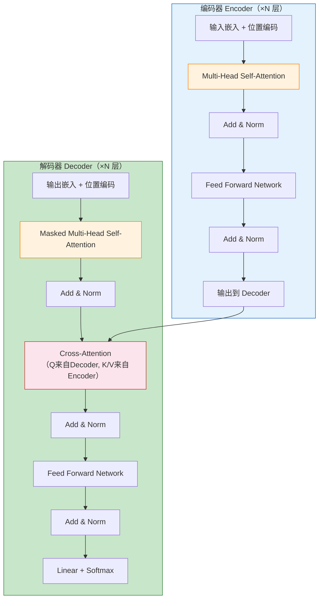
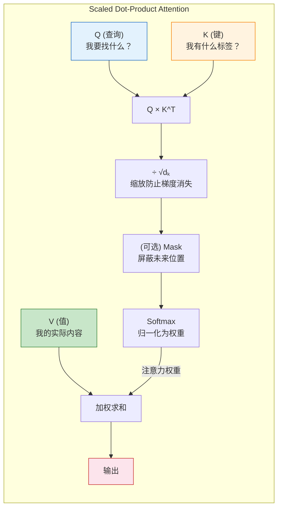
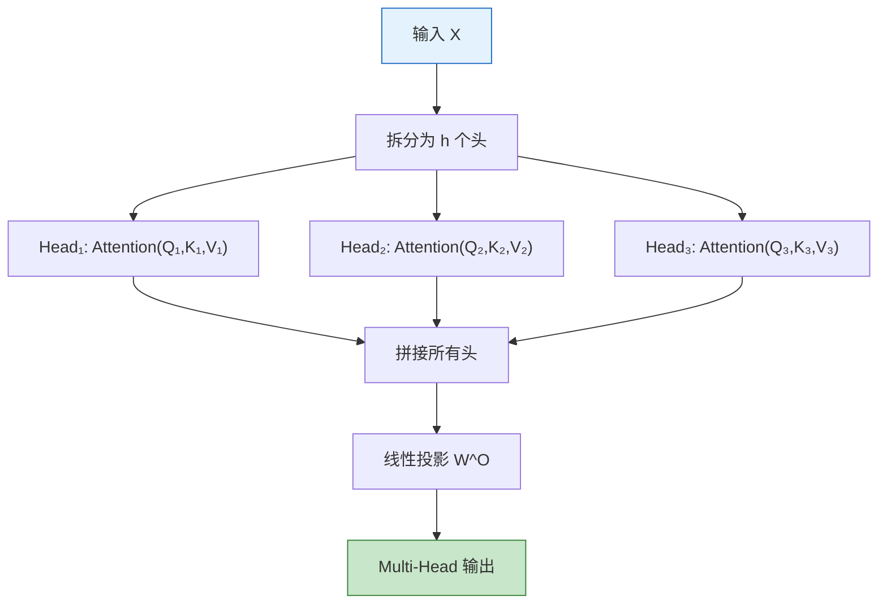
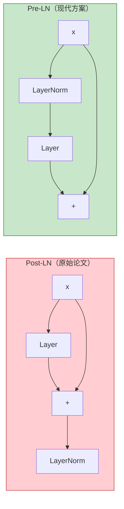
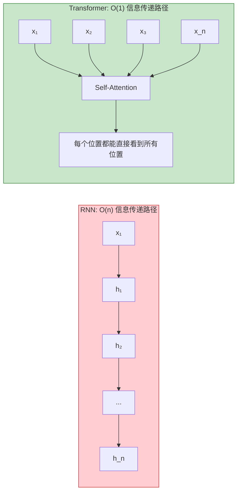

# Transformer 架构详解
> 创建日期：2026-06-06
> 难度：⭐⭐⭐
> 前置知识：Self-Attention 机制、LayerNorm、残差连接、Seq2Seq 架构、RNN/LSTM 基础

## ⭐ 面试重点速览

- 熟记 Self-Attention 公式：$\text{Attention}(Q,K,V) = \text{Softmax}(QK^T/\sqrt{d_k})V$
- 理解 Q/K/V 的物理含义：Q 是"我要查什么"，K 是"我有什么标签"，V 是"我的实际内容"
- 掌握 Multi-Head Attention 的设计动机：让不同头关注不同的子空间（语法/语义/位置等）
- 知道位置编码为什么必要：Attention 本身是置换不变的，需要注入位置信息
- 理解 LayerNorm 在 Transformer 中的位置：Post-LN（原始）vs Pre-LN（现在通用）
- 能对比 Transformer 和 RNN 的核心差异：并行 vs 串行、O(1)路径 vs O(n)路径

---

## 一、应用场景 🎯

Transformer 是当前 AI 领域最具统治力的架构，从 NLP 出发，正在全面渗透到 CV、语音、多模态等领域：

| 领域 | 代表模型 | 核心任务 |
|------|---------|---------|
| 自然语言理解 | **BERT**、RoBERTa、ALBERT | 文本分类、NER、问答、语义相似度 |
| 自然语言生成 | **GPT**（GPT-3/4）、LLaMA、Claude | 对话、写作、代码生成、翻译 |
| 机器翻译 | 原始 Transformer、mBART | 多语言翻译 |
| 计算机视觉 | **ViT**、Swin Transformer、DETR | 图像分类、目标检测、分割 |
| 语音处理 | Whisper、Conformer | 语音识别、语音合成 |
| 多模态 | CLIP、DALL-E、GPT-4V | 图文匹配、文生图、多模态理解 |
| 蛋白质结构预测 | AlphaFold2 | 生物信息学 |

> **面试金句**："Transformer 的成功在于它是一个通用序列建模框架，不依赖任何特定模态的归纳偏置，完全靠数据驱动。这使得它能够统一处理文本、图像、语音、蛋白质等各种模态。"

---

## 二、核心原理 🔬

### 2.1 Transformer 整体架构



**Encoder 和 Decoder 的区别**：
- Encoder 的 Self-Attention：可以看到所有位置（双向）
- Decoder 的 Self-Attention：只能看到当前位置及之前的位置（因果掩码 / Masked）
- Decoder 的 Cross-Attention：Q 来自 Decoder，K/V 来自 Encoder

### 2.2 Self-Attention 核心公式推导

**第一步：从输入生成 Q、K、V**

$$Q = X \cdot W^Q, \quad K = X \cdot W^K, \quad V = X \cdot W^V$$

其中 $X \in \mathbb{R}^{n \times d_{model}}$ 是输入序列，$W^Q, W^K \in \mathbb{R}^{d_{model} \times d_k}$，$W^V \in \mathbb{R}^{d_{model} \times d_v}$。

**第二步：计算注意力分数**

$$\text{Attention}(Q, K, V) = \text{Softmax}\left(\frac{QK^T}{\sqrt{d_k}}\right)V$$



**Q/K/V 的物理含义**（面试高频）：

| 矩阵 | 全称 | 物理含义 | 通俗类比 |
|------|------|---------|---------|
| **Q (Query)** | 查询 | "我当前这个位置，想找什么信息？" | 你去图书馆找书，心里想的关键词 |
| **K (Key)** | 键 | "我这个人（位置），有什么标签？" | 每本书封面上的标题和摘要 |
| **V (Value)** | 值 | "我这个人（位置），实际内容是什么？" | 书里的正文内容 |

### 2.3 为什么要除以 $\sqrt{d_k}$？

**原因**：当 $d_k$ 很大时，$QK^T$ 的点积值会很大，使得 Softmax 落入梯度极小的饱和区（分布接近 one-hot）：

$$\text{Softmax}([100, 1, 1]) \approx [1.0, 0.0, 0.0] \quad \text{（梯度几乎为 0）}$$
$$\text{Softmax}([1.0, 0.01, 0.01]) \approx [0.49, 0.26, 0.26] \quad \text{（梯度正常）}$$

除以 $\sqrt{d_k}$ 将点积的方差控制为 1，使 Softmax 保持在梯度正常的区域。

### 2.4 Multi-Head Attention



**为什么需要多个头？**

| 单头 | 多头 |
|------|------|
| 只有一个注意力分布 | 多个注意力分布，关注不同子空间 |
| 可能只关注一种模式 | 有的头关注语法，有的关注语义，有的关注位置 |
| 表达能力有限 | 每个头在不同的低维空间独立计算，再拼接 |

**公式**：
$$\text{MultiHead}(Q,K,V) = \text{Concat}(\text{head}_1, ..., \text{head}_h)W^O$$
$$\text{head}_i = \text{Attention}(QW_i^Q, KW_i^K, VW_i^V)$$

### 2.5 位置编码（Positional Encoding）

**为什么需要？** Self-Attention 是置换不变（Permutation Invariant）的：打乱输入顺序，输出只是同样打乱顺序，不会改变每个位置的值。这意味着模型不知道"第一个词"和"最后一个词"的区别。

**Sinusoidal 位置编码**（原始 Transformer）：

$$PE_{(pos, 2i)} = \sin\left(\frac{pos}{10000^{2i/d_{model}}}\right)$$
$$PE_{(pos, 2i+1)} = \cos\left(\frac{pos}{10000^{2i/d_{model}}}\right)$$

**特性**：
- 每个位置的编码是唯一的
- 不同位置之间的距离可以通过点积计算（$PE_{pos+k}$ 可以表示为 $PE_{pos}$ 的线性变换）
- 可外推（理论上可以处理比训练时更长的序列）

**其他位置编码方案**：

| 方案 | 特点 | 代表模型 |
|------|------|---------|
| Sinusoidal（固定） | 不需要学习，可外推 | 原始 Transformer |
| Learned（可学习） | 需要学习，长度固定 | BERT、GPT-2 |
| RoPE（旋转位置编码） | 相对位置编码，效果好 | LLaMA、GPT-NeoX |
| ALiBi | 加性偏置，极强外推能力 | BLOOM |

### 2.6 Feed-Forward Network (FFN)

$$\text{FFN}(x) = \text{ReLU}(xW_1 + b_1)W_2 + b_2$$

现代 Transformer 更多使用 GELU 或 SwiGLU 激活。FFN 的作用是**对每个位置独立地进行非线性变换**，增加模型的表达能力。

### 2.7 LayerNorm 与残差连接



**Pre-LN vs Post-LN**：

| 方案 | 训练稳定性 | 收敛速度 | 代表模型 |
|------|----------|---------|---------|
| Post-LN | 需要 Warmup | 较快 | 原始 Transformer |
| Pre-LN | 稳定，无需 Warmup | 略慢 | GPT-3、LLaMA |

> **面试金句**："Pre-LN 让梯度直接通过残差路径传播，比 Post-LN 更稳定，是现代大模型的标准做法。"

### 2.8 为什么 Transformer 比 RNN 好？



| 维度 | RNN/LSTM | Transformer |
|------|---------|------------|
| 信息传递路径长度 | O(n)（需要逐步传递） | O(1)（直接 Attention） |
| 并行化 | 无法并行（时间步依赖） | 完全并行（训练时） |
| 长距离依赖 | 困难（梯度消失） | 容易（直接连接） |
| 计算复杂度 | O(n·d²) | O(n²·d)（Self-Attention） |
| 输入长度限制 | 理论上无限制 | 受 O(n²) 内存限制 |

---

## 三、趣味解说 🎭

### 全班同学同时互相传纸条

想象你是一个 30 人的班级，老师布置了一个任务：每个人写一句话，然后全班一起把这句话翻译成英文。

**RNN 的做法**（一个个传）：
- 第 1 个人看完自己的词，把"理解"传给第 2 个人
- 第 2 个人结合自己的词和上一个人的"理解"，再传给第 3 个人
- ... 传到第 30 个人时，第 1 个人的信息已经模糊不清了

**Transformer 的做法**（同时传纸条）：
- 每个人同时给全班 30 个人写纸条，问："你需要我这句话里的什么信息？"（Q）
- 同时，每个人也给自己贴标签："我这句话的关键词是 XX，情绪是 YY"（K）
- 每个人还准备好自己的"干货"："我这句话的实际内容是 ZZ"（V）

然后，每个人根据别人纸条上的标签（K），决定要参考谁的干货（V），最终形成自己的理解。

**Multi-Head Attention 就像多个小组同时讨论**：
- 头 1：关注语法结构（主谓宾关系）
- 头 2：关注语义相关（哪些词意思相近）
- 头 3：关注位置远近（相邻的词更相关）
- 头 4：关注指代关系（"它"指的是"苹果"）

最后把各个小组的讨论结果汇总，形成一个更全面的理解。

### 位置编码就像给每个词加上"时间戳"

如果没有位置编码，"我爱你"和"你爱我"在 Attention 看来是完全一样的（因为计算的是相似度，与顺序无关）。位置编码就像给每个词加上一个独特的"时间戳" -- "我(t=1)"、"爱(t=2)"、"你(t=3)"，这样模型就能区分了。

---

## 四、代码实现 💻

### 4.1 从零实现 Self-Attention（NumPy 版，理解原理）

```python
import numpy as np


def scaled_dot_product_attention(Q, K, V, mask=None):
    """
    实现 Scaled Dot-Product Attention
    
    参数:
        Q: (batch, n_heads, seq_len, d_k) 查询
        K: (batch, n_heads, seq_len, d_k) 键
        V: (batch, n_heads, seq_len, d_v) 值
        mask: (batch, 1, seq_len, seq_len) 可选掩码
    """
    d_k = Q.shape[-1]

    # 1. 计算注意力分数: QK^T / sqrt(d_k)
    scores = np.matmul(Q, K.transpose(0, 1, 3, 2)) / np.sqrt(d_k)

    # 2. 应用掩码（Decoder 中屏蔽未来位置）
    if mask is not None:
        scores = scores + mask * -1e9  # 被屏蔽的位置设为负无穷

    # 3. Softmax 归一化
    attention_weights = np.exp(scores - np.max(scores, axis=-1, keepdims=True))
    attention_weights = attention_weights / np.sum(attention_weights, axis=-1, keepdims=True)

    # 4. 加权求和
    output = np.matmul(attention_weights, V)

    return output, attention_weights


def multi_head_attention(X, W_Q, W_K, W_V, W_O, n_heads):
    """
    简化版 Multi-Head Attention

    参数:
        X: (batch, seq_len, d_model) 输入
        W_Q, W_K, W_V: 投影矩阵
        W_O: 输出投影矩阵
        n_heads: 注意力头数
    """
    batch, seq_len, d_model = X.shape
    d_k = d_model // n_heads

    # 1. 线性投影
    Q = np.dot(X, W_Q).reshape(batch, seq_len, n_heads, d_k).transpose(0, 2, 1, 3)
    K = np.dot(X, W_K).reshape(batch, seq_len, n_heads, d_k).transpose(0, 2, 1, 3)
    V = np.dot(X, W_V).reshape(batch, seq_len, n_heads, d_k).transpose(0, 2, 1, 3)

    # 2. 缩放点积注意力
    attn_output, attn_weights = scaled_dot_product_attention(Q, K, V)

    # 3. 拼接多头并投影
    attn_output = attn_output.transpose(0, 2, 1, 3).reshape(batch, seq_len, d_model)
    output = np.dot(attn_output, W_O)

    return output, attn_weights


# 演示: 计算 Self-Attention
print("=== Self-Attention 演示 ===")
batch, seq_len, d_model = 1, 4, 6
n_heads = 2
d_k = d_model // n_heads

X = np.random.randn(batch, seq_len, d_model)
W_Q = np.random.randn(d_model, d_model)
W_K = np.random.randn(d_model, d_model)
W_V = np.random.randn(d_model, d_model)
W_O = np.random.randn(d_model, d_model)

output, weights = multi_head_attention(X, W_Q, W_K, W_V, W_O, n_heads)
print(f"输入: {X.shape} -> 输出: {output.shape}")
print(f"注意力权重形状: {weights.shape}")
print(f"第一个头对第一个位置的注意力分布: {weights[0, 0, 0, :]}")
```

### 4.2 PyTorch 实现完整 Transformer

```python
import torch
import torch.nn as nn
import torch.nn.functional as F
import math


class MultiHeadAttention(nn.Module):
    """Multi-Head Attention 的完整实现"""

    def __init__(self, d_model, n_heads, dropout=0.1):
        super().__init__()
        assert d_model % n_heads == 0, "d_model 必须能被 n_heads 整除"
        self.d_model = d_model
        self.n_heads = n_heads
        self.d_k = d_model // n_heads

        # Q、K、V 的联合投影（效率更高）
        self.W_qkv = nn.Linear(d_model, 3 * d_model, bias=False)
        # 输出投影
        self.W_o = nn.Linear(d_model, d_model, bias=False)
        self.dropout = nn.Dropout(dropout)

    def forward(self, x, mask=None):
        batch, seq_len, _ = x.shape

        # 1. 联合投影: (batch, seq_len, 3*d_model)
        qkv = self.W_qkv(x)
        # 拆分为 Q、K、V 并 reshape 为多头格式
        q, k, v = qkv.chunk(3, dim=-1)
        q = q.view(batch, seq_len, self.n_heads, self.d_k).transpose(1, 2)
        k = k.view(batch, seq_len, self.n_heads, self.d_k).transpose(1, 2)
        v = v.view(batch, seq_len, self.n_heads, self.d_k).transpose(1, 2)

        # 2. Scaled Dot-Product Attention
        # scores: (batch, n_heads, seq_len, seq_len)
        scores = torch.matmul(q, k.transpose(-2, -1)) / math.sqrt(self.d_k)

        if mask is not None:
            scores = scores.masked_fill(mask == 0, float('-inf'))

        attn_weights = F.softmax(scores, dim=-1)
        attn_weights = self.dropout(attn_weights)

        # 3. 加权求和
        # attn_output: (batch, n_heads, seq_len, d_k)
        attn_output = torch.matmul(attn_weights, v)

        # 4. 合并多头并投影
        attn_output = attn_output.transpose(1, 2).contiguous().view(
            batch, seq_len, self.d_model
        )
        output = self.W_o(attn_output)

        return output, attn_weights


class FeedForward(nn.Module):
    """Position-wise Feed-Forward Network"""

    def __init__(self, d_model, d_ff, dropout=0.1):
        super().__init__()
        self.linear1 = nn.Linear(d_model, d_ff)
        self.linear2 = nn.Linear(d_ff, d_model)
        self.dropout = nn.Dropout(dropout)

    def forward(self, x):
        # 使用 GELU 激活（现代 Transformer 标准）
        return self.linear2(self.dropout(F.gelu(self.linear1(x))))


class TransformerEncoderLayer(nn.Module):
    """Transformer Encoder 层（Pre-LN 风格）"""

    def __init__(self, d_model, n_heads, d_ff, dropout=0.1):
        super().__init__()
        self.norm1 = nn.LayerNorm(d_model)
        self.self_attn = MultiHeadAttention(d_model, n_heads, dropout)
        self.norm2 = nn.LayerNorm(d_model)
        self.ffn = FeedForward(d_model, d_ff, dropout)
        self.dropout = nn.Dropout(dropout)

    def forward(self, x, mask=None):
        # Pre-LN: 先归一化，再计算，最后残差连接
        # 1. Self-Attention
        attn_out, attn_weights = self.self_attn(self.norm1(x), mask)
        x = x + self.dropout(attn_out)  # 残差连接

        # 2. Feed-Forward
        ffn_out = self.ffn(self.norm2(x))
        x = x + self.dropout(ffn_out)   # 残差连接

        return x, attn_weights


class TransformerEncoder(nn.Module):
    """完整的 Transformer Encoder"""

    def __init__(self, vocab_size, d_model, n_heads, d_ff, n_layers, max_len, dropout=0.1):
        super().__init__()
        self.embedding = nn.Embedding(vocab_size, d_model, padding_idx=0)
        self.pos_encoding = PositionalEncoding(d_model, max_len, dropout)
        self.layers = nn.ModuleList([
            TransformerEncoderLayer(d_model, n_heads, d_ff, dropout)
            for _ in range(n_layers)
        ])
        self.norm = nn.LayerNorm(d_model)  # 最终 LayerNorm

    def forward(self, x, mask=None):
        x = self.embedding(x) * math.sqrt(self.embedding.embedding_dim)
        x = self.pos_encoding(x)
        attn_weights_list = []
        for layer in self.layers:
            x, attn_weights = layer(x, mask)
            attn_weights_list.append(attn_weights)
        x = self.norm(x)
        return x, attn_weights_list


class PositionalEncoding(nn.Module):
    """Sinusoidal 位置编码"""

    def __init__(self, d_model, max_len=5000, dropout=0.1):
        super().__init__()
        self.dropout = nn.Dropout(dropout)

        # 创建位置编码矩阵: (max_len, d_model)
        pe = torch.zeros(max_len, d_model)
        position = torch.arange(0, max_len, dtype=torch.float).unsqueeze(1)
        # 计算分母: 10000^(2i/d_model)
        div_term = torch.exp(
            torch.arange(0, d_model, 2).float() * (-math.log(10000.0) / d_model)
        )
        pe[:, 0::2] = torch.sin(position * div_term)  # 偶数位置用 sin
        pe[:, 1::2] = torch.cos(position * div_term)  # 奇数位置用 cos
        pe = pe.unsqueeze(0)  # (1, max_len, d_model)
        self.register_buffer('pe', pe)  # 不作为参数，但随模型保存

    def forward(self, x):
        # x: (batch, seq_len, d_model)
        x = x + self.pe[:, :x.size(1), :]
        return self.dropout(x)


# ====== 使用示例 ======
if __name__ == "__main__":
    # 配置
    config = {
        'vocab_size': 10000,
        'd_model': 512,
        'n_heads': 8,
        'd_ff': 2048,
        'n_layers': 6,
        'max_len': 512,
    }

    # 创建 Encoder
    encoder = TransformerEncoder(**config)

    # 模拟输入: (batch=2, seq_len=10)
    dummy_input = torch.randint(0, 10000, (2, 10))
    output, attn_weights = encoder(dummy_input)

    print(f"输入: {dummy_input.shape}")
    print(f"输出: {output.shape}")
    print(f"注意力权重层数: {len(attn_weights)}")
    print(f"每层注意力权重形状: {attn_weights[0].shape}")
    # 参数量
    total_params = sum(p.numel() for p in encoder.parameters())
    print(f"总参数量: {total_params:,}")
```

---

## 五、优缺点 ⚖️

### Transformer 整体评价

| 优点 | 缺点 |
|------|------|
| 并行计算，训练效率远高于 RNN | Self-Attention 的 O(n²) 复杂度，长序列处理困难 |
| 长距离依赖建模能力强（O(1) 路径） | 参数量大，需要大量训练数据 |
| 通用架构，适用于文本/图像/语音/多模态 | 推理时自回归解码仍需逐 token 生成 |
| 可扩展性强，遵循 Scaling Law | 位置编码方案选择影响外推能力 |
| 注意力权重可解释，可视化分析方便 | 对超参数敏感（学习率、Warmup、Dropout） |

### Encoder-Only vs Decoder-Only vs Encoder-Decoder

| 架构 | 代表模型 | 优点 | 缺点 | 适用场景 |
|------|---------|------|------|---------|
| **Encoder-Only** | BERT | 双向上下文理解强 | 不能生成文本 | 文本分类、NER、问答 |
| **Decoder-Only** | GPT | 生成能力强，统一范式 | 只能单向（因果） | 对话、写作、代码生成 |
| **Encoder-Decoder** | T5、BART | 输入输出长度可不同 | 架构复杂，两套参数 | 翻译、摘要 |

---

## 六、面试高频题 📝

### Q1：Self-Attention 中 Q、K、V 分别是什么？为什么需要三个不同的矩阵？

**标准答案**：Q、K、V 来自同一个输入 X，通过不同的权重矩阵投影得到。这并非冗余，而是为了：
- **Q（查询）**：表达"我当前关注什么"
- **K（键）**：表达"我有什么特征可以被关注"
- **V（值）**：表达"如果被关注了，我提供什么信息"

将 Q、K、V 分开，使得注意力机制可以学习**不对称**的关系。例如，在"我吃苹果"中，"吃"（Q）想知道"吃什么"（K），而"苹果"（V）提供语义信息。如果 Q=K=V，那么"吃"和"苹果"的相关性是对称的，无法表达方向性。

### Q2：Transformer 中为什么要用 LayerNorm 而不是 BatchNorm？

| 维度 | BatchNorm | LayerNorm |
|------|-----------|-----------|
| 归一化维度 | 对 batch 维度（同一特征在不同样本上） | 对 feature 维度（同一样本的不同特征） |
| 受 batch size 影响 | 大（小 batch 不稳定） | 无 |
| 序列长度敏感性 | 序列填充导致统计量不准 | 每个位置独立，不受影响 |
| 训练/推理一致性 | 不一致（推理用全局统计量） | 一致 |

> **面试金句**："LayerNorm 对 batch size 不敏感，且训练和推理行为一致，更适合 NLP 中变长序列的场景。"

### Q3：Transformer 的 Encoder 和 Decoder 有什么区别？

| 维度 | Encoder | Decoder |
|------|---------|---------|
| Self-Attention | 双向（看到所有位置） | 因果掩码（只看当前及之前） |
| Cross-Attention | 无 | 有（Q 来自 Decoder，K/V 来自 Encoder） |
| 输出 | 上下文表示 | 逐 token 生成 |
| 并行性 | 完全并行 | 训练时并行（Teacher Forcing），推理时串行 |

### Q4：为什么 Pre-LN 比 Post-LN 更稳定？

**答案**：在 Post-LN 中，残差路径的梯度需要经过 LayerNorm（位于残差之后），而 LayerNorm 会缩放梯度。在深层网络中，多层的缩放累积导致梯度不稳定。Pre-LN 将 LayerNorm 放在残差路径内部，梯度可以通过残差连接直接传播，不需要经过 LayerNorm，因此训练更稳定，甚至可以省去 Warmup。

### Q5：Transformer 的复杂度分析

| 组件 | 时间复杂度 | 空间复杂度 |
|------|----------|----------|
| Self-Attention | O(n²·d) | O(n²)（存储注意力矩阵） |
| FFN | O(n·d·d_ff) | O(n·d_ff) |
| 总复杂度 | O(n²·d + n·d²) | O(n²) |

当序列长度 n 很大时，Self-Attention 的 O(n²) 成为瓶颈。这也是为什么出现了 Longformer、BigBird 等稀疏注意力方案。

---

## 七、常见误区 ❌

| 误区 | 真相 |
|------|------|
| "Transformer 不需要位置编码" | 没有位置编码，Self-Attention 是置换不变的，模型无法区分词序。位置编码是必需的。 |
| "Multi-Head 就是多做几次 Attention 取平均" | 不是取平均，是在不同子空间计算，然后拼接后投影。每个头关注不同的模式。 |
| "Transformer 的 Attention 权重就是特征重要性" | 注意力权重只能反映"模型在关注什么"，不能直接等同于"特征重要性"。可解释性需要谨慎对待。 |
| "LayerNorm 和 BatchNorm 只是归一化维度不同" | 除此之外，推理时行为也不同。BN 推理时用训练集的全局统计量，LN 推理时行为与训练时完全一致。 |
| "Decoder 可以完全并行推理" | 训练时可以并行（Teacher Forcing），但推理时仍需自回归逐 token 生成，这是 Transformer 推理延迟的主要来源。 |
| "Transformer 的 O(n²) 复杂度意味着它无法处理长序列" | 虽然有 O(n²) 复杂度，但通过稀疏注意力、FlashAttention、KV Cache 等优化，现代 Transformer 可以处理数万 token。 |
| "位置编码只是简单的加法，不重要" | 位置编码方案直接影响模型的外推能力。RoPE 等现代方案是 Transformer 成功的关键组件之一。 |