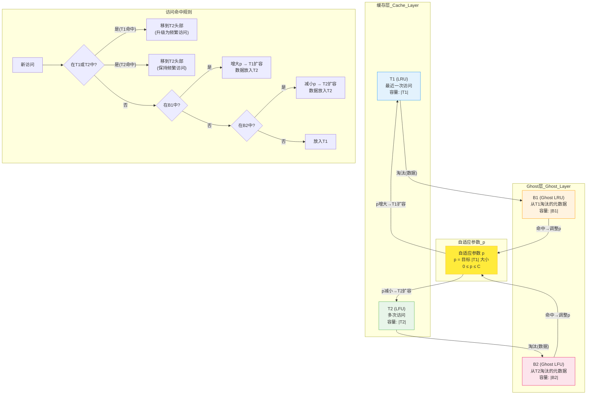

# ARC 自适应替换缓存 (Adaptive Replacement Cache)
> 创建日期：2026-06-08
> 难度：⭐⭐⭐
> 前置知识：LRU、LFU、缓存淘汰策略、时间复杂度分析
> 关联模块：存储系统、数据库缓冲池、文件系统缓存、ZFS ARC

## ⭐ 面试重点速览

| 考察点 | 重要程度 | 考察频率 | 掌握目标 |
|--------|---------|---------|---------|
| ARC 的四个链表结构（T1/T2/B1/B2） | 极高 | 高 | 能手动画出四链表结构图 |
| 自适应平衡机制（p值调节） | 极高 | 高 | 能解释p如何根据B1/B2命中动态调整 |
| Ghost 链表（B1/B2）的作用 | 高 | 高 | 能说明ghost链表如何记录历史信息 |
| ARC vs LRU vs LFU 对比 | 高 | 高 | 能说出各自适用场景和ARC的折中优势 |
| 扫描污染抵抗能力 | 中 | 中 | 能解释ARC为何能抵抗一次性的全表扫描 |
| ZFS 中 ARC 的应用 | 中 | 低 | 能说出ARC是ZFS默认缓存算法 |

---

## 一、应用场景 🎯

ARC 由 IBM 研究院的 Nimrod Megiddo 和 Dharmendra Modha 于 2003 年提出，是目前最先进的自适应缓存替换算法之一。

| 场景 | 说明 |
|------|------|
| **ZFS 文件系统** | ZFS 的默认缓存算法就是 ARC，用于管理文件系统元数据和数据缓存 |
| **数据库缓冲池** | PostgreSQL 的 `pg_prewarm` 和某些存储引擎使用 ARC 变体管理缓冲页 |
| **存储控制器** | IBM DS8000 等企业级存储系统使用 ARC 优化 I/O 缓存 |
| **CDN 边缘缓存** | 访问模式多变（热门资源 + 新内容），ARC 的自适应能力天然适合 |
| **Web 服务器缓存** | Nginx/Varnish 等反向代理可基于 ARC 变体管理缓存 |
| **操作系统页缓存** | Linux 的页缓存（page cache）虽然使用 LRU 变体，但 ARC 的思想影响了其改进 |

**核心价值**：ARC 解决了 LRU 和 LFU 的固有问题——LRU 被一次性扫描污染，LFU 无法淘汰历史热门数据。ARC 在两者之间**自动、自适应地**找到平衡，无需人工调参。

---

## 二、核心原理 🔬

### 2.1 设计哲学

ARC 的核心思想可以用一句话概括：**同时追踪"最近访问"和"频繁访问"两个维度，并根据历史命中情况动态调整两者的缓存容量分配**。

```
LRU 只看"最近" → 被一次性扫描欺骗
LFU 只看"频率" → 旧的热门数据永远赖着不走
ARC 两者都看，还记"被淘汰过哪些" → 自适应平衡
```

### 2.2 四个链表结构

ARC 维护四个链表，两两成对：

```
┌─────────────────────────────────────────────────────────────────────┐
│                      缓存空间 C（固定总容量）                          │
│  ┌───────────────────────────────┐ ┌───────────────────────────────┐ │
│  │         T1 (LRU)              │ │         T2 (LFU)              │ │
│  │   最近使用一次的数据            │ │   最近使用多次的数据            │ │
│  │   (recency, 类似LRU)           │ │   (frequency, 类似LFU)        │ │
│  │   容量动态变化: |T1|           │ │   容量动态变化: |T2|          │ │
│  └───────────────────────────────┘ └───────────────────────────────┘ │
│                          |T1| + |T2| <= C                           │
├─────────────────────────────────────────────────────────────────────┤
│                     Ghost 链表（只存元数据，不存数据）                  │
│  ┌───────────────────────────────┐ ┌───────────────────────────────┐ │
│  │         B1 (Ghost LRU)        │ │         B2 (Ghost LFU)        │ │
│  │   从T1淘汰的页的元数据         │ │   从T2淘汰的页的元数据          │ │
│  │   (记录"曾经最近用过")         │ │   (记录"曾经频繁用过")          │ │
│  └───────────────────────────────┘ └───────────────────────────────┘ │
│                          |B1| + |B2| <= C                           │
└─────────────────────────────────────────────────────────────────────┘
```

| 链表 | 全称 | 存储内容 | 作用 |
|------|------|---------|------|
| **T1** | LRU List (recently used once) | 只被访问过一次的数据 | 类似LRU，记录"最近一次" |
| **T2** | LFU List (recently used frequently) | 被访问过多次的数据 | 类似LFU，记录"频繁访问" |
| **B1** | Ghost LRU List | 从T1淘汰的页的元数据 | 记录"曾经最近用过"的历史 |
| **B2** | Ghost LFU List | 从T2淘汰的页的元数据 | 记录"曾经频繁用过"的历史 |

### 2.3 Mermaid 结构框图



### 2.4 自适应参数 p

p 是 ARC 最核心的机制，它动态决定 T1 和 T2 的容量比例：

```
|T1| 的目标大小 = p  (p 的范围是 0 到 C)
|T2| 的目标大小 = C - p
```

**p 的调整规则**：

| 事件 | p 的变化 | 含义 |
|------|---------|------|
| B1 命中（Ghost LRU命中） | p += max(1, |B2| / |B1|) | 说明 "最近" 重要 → 增大 T1 |
| B2 命中（Ghost LFU命中） | p -= max(1, |B1| / |B2|) | 说明 "频率" 重要 → 增大 T2 |

**直观理解**：
- B1 命中 = 从T1淘汰的数据又被访问了 → 说明T1淘汰得太快了，应该给T1更多空间（增大p）
- B2 命中 = 从T2淘汰的数据又被访问了 → 说明T2淘汰得太快了，应该给T2更多空间（减小p）

### 2.5 完整访问流程

```
访问页 X：

1. X 在 T1 或 T2 中？
   → 是：缓存命中！将 X 移到 T2 头部（无论原来在T1还是T2）
   
2. X 在 B1 中？
   → 是：Ghost命中！说明"最近"重要 → 增大 p
          将 X 放入 T2 头部（直接升级为频繁访问，跳过T1）
          
3. X 在 B2 中？
   → 是：Ghost命中！说明"频率"重要 → 减小 p
          将 X 放入 T2 头部
          
4. X 不在任何链表中？
   → 完全未命中。情况A：|T1| + |T2| < C → 直接放入 T1
   → 情况B：缓存已满。需要淘汰：
     - 如果 |T1| >= max(1, p)：淘汰 T1 尾部，放入 B1
     - 否则：淘汰 T2 尾部，放入 B2
     - 然后将 X 放入 T1 头部
```

### 2.6 ARC 如何抵抗扫描污染

**场景：一次全表扫描产生大量一次性访问**

```
LRU 的行为：
  扫描数据涌入 → 所有热点被挤出 → 缓存完全被污染

ARC 的行为：
  扫描数据进入 T1（只访问一次）
  → 如果后续不再访问，留在 T1 尾部
  → T1 满了，淘汰 → 进入 B1 (Ghost)
  → B1 命中？没有（这些数据不会再被访问）
  → p 不增大，T1 不扩容
  → 真正的热点数据留在 T2 中，不受影响
  
  结论：ARC 自动识别一次性访问模式，不会为它们分配更多空间
```

### 2.7 ARC vs LRU vs LFU 对比

| 对比维度 | LRU | LFU | ARC |
|---------|-----|-----|-----|
| 核心思想 | 淘汰最久未用 | 淘汰最少使用 | 自适应平衡两者 |
| 扫描污染 | 严重（一次扫描清空缓存） | 较好（低频数据权重低） | 优秀（Ghost链表自动识别） |
| 历史数据淘汰 | 容易 | 困难（旧热门数据赖着不走） | 自适应（p自动调整） |
| 参数调优 | 无需调参 | 需要衰减策略 | 无需调参（全自适应） |
| 空间开销 | 低（一个链表） | 中（需要频率计数） | 较高（四个链表+元数据） |
| 实现复杂度 | 低 | 中 | 高 |
| 适用场景 | 通用，时间局部性明显 | 访问频率稳定 | 访问模式动态变化 |

---

## 三、趣味解说 🎭

> **健身房衣柜——人多了就挤掉占地方不用的，灵活调整空间**

你经营一家健身房，有 100 个储物柜（缓存容量 C）。

你发现会员分两种：
- **"打卡型"会员**：今天第一次来，穿着运动服晃一圈就走了（只访问一次 → T1）
- **"铁杆型"会员**：每周来五次，每次练两小时（频繁访问 → T2）

你一开始不知道怎么分配柜子，于是决定：
- 给"打卡型"会员 50 个柜子（T1）
- 给"铁杆型"会员 50 个柜子（T2）

但你发现这不合理——有时候一批新会员涌入（一次全表扫描），把铁杆会员的柜子全占了。于是你做了个聪明的决定：

**在门口放一个登记本（Ghost 链表 B1/B2）**：
- 如果某个被赶走的打卡型会员又跑回来要柜子（B1命中），说明"最近来的"好像很重要 → 多给打卡型分配一些柜子
- 如果某个被赶走的铁杆型会员也跑回来（B2命中），说明"老客户"还是很重要 → 多给铁杆型分配一些柜子

而这个登记本的大小也有上限，不会无限记录。最终，你的健身房能在不人工干预的情况下，自动找到最优的柜子分配方案——这就是 ARC 的"自适应"。

**扫描污染**：某天突然来了 200 个"体验课"会员（全表扫描），他们只来这一天。ARC 把他们放进 T1（打卡型），等他们走了就不再回来。他们的信息被记录在 B1 登记本上，但 B1 永远不会再命中（他们真不来了）。所以 p 不会因为他们而增大，铁杆会员的柜子一个都不会少。

LS 对比：普通健身房（LRU）会把这 200 个体验课会员塞满柜子，把铁杆会员全赶出去，然后发现体验课会员都不来了，柜子全空着——灾难！

---

## 四、代码实现 💻

### 4.1 ARC 完整实现 (Java)

```java
import java.util.*;

/**
 * ARC (Adaptive Replacement Cache) 自适应替换缓存
 *
 * 四个链表：
 *   T1: 最近访问一次的数据（类似LRU，存储实际数据）
 *   T2: 最近访问多次的数据（类似LFU，存储实际数据）
 *   B1: 从T1淘汰的页的元数据（Ghost LRU，只存key）
 *   B2: 从T2淘汰的页的元数据（Ghost LFU，只存key）
 */
public class ARCCache<K, V> {
    private final int capacity;  // 缓存总容量 C
    private int p;               // 自适应参数：T1的目标大小

    // 实际缓存链表（存储 key → value）
    private final LinkedHashMap<K, V> t1;  // 最近一次访问
    private final LinkedHashMap<K, V> t2;  // 多次访问

    // Ghost链表（只存 key，不存数据）
    private final LinkedHashSet<K> b1;  // 从T1淘汰的key
    private final LinkedHashSet<K> b2;  // 从T2淘汰的key

    public ARCCache(int capacity) {
        this.capacity = capacity;
        this.p = 0;  // 初始偏向T2（频繁访问）

        // accessOrder=true 按访问顺序排列，实现LRU语义
        this.t1 = new LinkedHashMap<>(16, 0.75f, true);
        this.t2 = new LinkedHashMap<>(16, 0.75f, true);
        this.b1 = new LinkedHashSet<>();
        this.b2 = new LinkedHashSet<>();
    }

    /**
     * 访问缓存中的元素
     * @return 命中返回value，未命中返回null
     */
    public V get(K key) {
        // 情况1: 在T1中命中 → 移到T2（升级为频繁访问）
        if (t1.containsKey(key)) {
            V value = t1.remove(key);
            t2.put(key, value);
            return value;
        }

        // 情况2: 在T2中命中 → 移到T2头部（LRU顺序）
        if (t2.containsKey(key)) {
            return t2.get(key);  // LinkedHashMap accessOrder=true 自动移到尾部
        }

        return null;  // 缓存未命中
    }

    /**
     * 放入新数据
     */
    public void put(K key, V value) {
        // 情况1: 已经在缓存中（T1或T2）→ 更新值并移到T2
        if (t1.containsKey(key)) {
            t1.remove(key);
            t2.put(key, value);
            return;
        }
        if (t2.containsKey(key)) {
            t2.put(key, value);
            return;
        }

        // 情况2: 在B1中（Ghost LRU命中）→ 增大p，放入T2
        if (b1.contains(key)) {
            // B1命中 → "最近"重要 → 增大T1的配额
            int delta = Math.max(1, b2.size() / Math.max(1, b1.size()));
            p = Math.min(capacity, p + delta);
            b1.remove(key);
            replace(key);  // 可能需要淘汰
            t2.put(key, value);
            return;
        }

        // 情况3: 在B2中（Ghost LFU命中）→ 减小p，放入T2
        if (b2.contains(key)) {
            // B2命中 → "频率"重要 → 增大T2的配额（减小p）
            int delta = Math.max(1, b1.size() / Math.max(1, b2.size()));
            p = Math.max(0, p - delta);
            b2.remove(key);
            replace(key);  // 可能需要淘汰
            t2.put(key, value);
            return;
        }

        // 情况4: 完全未命中 → 放入T1
        if (t1.size() + t2.size() >= capacity) {
            // 缓存已满，需要淘汰
            if (t1.size() >= capacity) {
                // T1已经超过总容量 → 淘汰T1中最旧的
                K removed = removeT1Tail();
                b1.add(removed);
            } else if (t1.size() + t2.size() >= capacity) {
                replace(key);
            }
        }
        t1.put(key, value);
    }

    /**
     * 淘汰策略：决定从T1还是T2淘汰
     */
    private void replace(K newKey) {
        int t1Size = t1.size();
        int t2Size = t2.size();

        if (t1Size + t2Size < capacity) return;  // 还有空间

        if (t1Size > 0 && (t1Size > p || (b2.contains(newKey) && t1Size == p))) {
            // 淘汰T1尾部 → 放入B1
            K removed = removeT1Tail();
            b1.add(removed);
        } else if (t2Size > 0) {
            // 淘汰T2尾部 → 放入B2
            K removed = removeT2Tail();
            b2.add(removed);
        }

        // 维护Ghost链表大小不超过缓存容量
        trimGhostLists();
    }

    /** 移除T1链表尾部元素（最久未使用） */
    private K removeT1Tail() {
        Iterator<K> it = t1.keySet().iterator();
        K removed = it.next();
        it.remove();
        return removed;
    }

    /** 移除T2链表尾部元素（最久未使用） */
    private K removeT2Tail() {
        Iterator<K> it = t2.keySet().iterator();
        K removed = it.next();
        it.remove();
        return removed;
    }

    /** 限制Ghost链表大小 */
    private void trimGhostLists() {
        while (b1.size() > capacity) {
            Iterator<K> it = b1.iterator();
            it.next();
            it.remove();
        }
        while (b2.size() > capacity) {
            Iterator<K> it = b2.iterator();
            it.next();
            it.remove();
        }
    }

    /** 移除缓存中的元素 */
    public void remove(K key) {
        t1.remove(key);
        t2.remove(key);
        // Ghost链表中的记录保留（历史信息有价值）
    }

    public int size() { return t1.size() + t2.size(); }
    public int getP() { return p; }

    // ========== 测试 ==========
    public static void main(String[] args) {
        ARCCache<Integer, String> arc = new ARCCache<>(4);

        // 模拟访问序列
        arc.put(1, "A");  // T1: [1]
        arc.put(2, "B");  // T1: [2,1]
        arc.get(1);       // T1命中 → 移到T2, T2: [1]
        arc.put(3, "C");  // T1: [3,2], T2: [1]
        arc.get(1);       // T2命中: T2: [1]
        arc.put(4, "D");  // T1: [4,3,2], T2: [1]
        arc.get(1);       // T2命中
        arc.get(2);       // T1命中 → 移到T2, T2: [2,1]
        arc.put(5, "E");  // 触发淘汰...

        System.out.println("T1大小: " + arc.t1.size());
        System.out.println("T2大小: " + arc.t2.size());
        System.out.println("自适应参数p: " + arc.getP());
        System.out.println("B1大小: " + arc.b1.size());
        System.out.println("B2大小: " + arc.b2.size());
    }
}
```

### 4.2 ARC 简化版（仅核心逻辑）

```java
import java.util.*;

/**
 * ARC 简化版 —— 只保留核心的四链表逻辑
 * 适合面试场景下手写
 */
public class SimpleARC<K, V> {
    private final int capacity;
    private int p = 0;  // 自适应参数

    // 简化：用LinkedList + HashMap 模拟LRU链表
    private final LinkedList<K> t1List = new LinkedList<>();
    private final LinkedList<K> t2List = new LinkedList<>();
    private final LinkedList<K> b1List = new LinkedList<>();
    private final LinkedList<K> b2List = new LinkedList<>();

    private final Map<K, V> data = new HashMap<>();  // 实际数据存储
    private final Map<K, Integer> location = new HashMap<>();  // key → 所在链表(1=T1, 2=T2, 0=不在缓存)

    public SimpleARC(int capacity) {
        this.capacity = capacity;
    }

    public V get(K key) {
        int loc = location.getOrDefault(key, 0);
        if (loc == 1) {
            // T1命中 → 升级到T2
            t1List.remove(key);
            t2List.addFirst(key);
            location.put(key, 2);
            return data.get(key);
        }
        if (loc == 2) {
            // T2命中 → 移到T2头部
            t2List.remove(key);
            t2List.addFirst(key);
            return data.get(key);
        }
        return null;  // 未命中
    }

    public void put(K key, V value) {
        // 已在缓存中 → 更新
        if (location.containsKey(key) && location.get(key) != 0) {
            data.put(key, value);
            get(key);  // 触发位置更新
            return;
        }

        // Ghost命中处理
        if (b1List.contains(key)) {
            p = Math.min(capacity, p + Math.max(1, b2List.size() / Math.max(1, b1List.size())));
            b1List.remove(key);
            evictIfNeeded();
            t2List.addFirst(key);
            location.put(key, 2);
            data.put(key, value);
            return;
        }
        if (b2List.contains(key)) {
            p = Math.max(0, p - Math.max(1, b1List.size() / Math.max(1, b2List.size())));
            b2List.remove(key);
            evictIfNeeded();
            t2List.addFirst(key);
            location.put(key, 2);
            data.put(key, value);
            return;
        }

        // 完全未命中
        evictIfNeeded();
        t1List.addFirst(key);
        location.put(key, 1);
        data.put(key, value);
    }

    /** 淘汰逻辑 */
    private void evictIfNeeded() {
        if (t1List.size() + t2List.size() < capacity) return;

        if (t1List.size() >= Math.max(1, p)) {
            // 淘汰T1尾部
            K removed = t1List.removeLast();
            location.remove(removed);
            b1List.addFirst(removed);
            if (b1List.size() > capacity) b1List.removeLast();
        } else {
            // 淘汰T2尾部
            K removed = t2List.removeLast();
            location.remove(removed);
            b2List.addFirst(removed);
            if (b2List.size() > capacity) b2List.removeLast();
        }
    }
}
```

---

## 五、优缺点 ⚖️

### 优点

| 优点 | 说明 |
|------|------|
| **完全自适应** | 无需人工调参，p 值根据访问模式自动调整，在不同负载下都能保持良好性能 |
| **抵抗扫描污染** | Ghost链表记录了被淘汰数据的历史，能识别一次性访问模式，不被全表扫描欺骗 |
| **兼顾recency和frequency** | 同时追踪最近访问和频繁访问两个维度，覆盖了LRU和LFU各自的优势场景 |
| **低开销** | 时间复杂度 O(1)，空间开销仅为常数倍（4个链表），不需要频率计数器 |
| **理论保证** | 有严格的数学证明，ARC 的命中率接近离线最优算法（Belady's OPT） |

### 缺点

| 缺点 | 说明 |
|------|------|
| **实现复杂** | 四个链表 + 自适应参数 p 的调节逻辑比 LRU 复杂得多 |
| **空间开销** | Ghost链表虽只存元数据，但仍有额外内存开销（约为缓存容量的2倍） |
| **并发困难** | 链表操作需要全局锁，高并发下的锁竞争是瓶颈 |
| **专利限制** | ARC 曾是 IBM 专利（已过期），但影响了其早期推广 |
| **冷启动** | 初始阶段 p 值需要一段时间才能收敛到最优值 |

---

## 六、面试高频题 📝

**Q1：ARC 的四个链表分别是什么？各自的作用是什么？**

答：T1：存储只访问过一次的数据（类似LRU），跟踪"最近性"。T2：存储访问过多次的数据（类似LFU），跟踪"频率"。B1（Ghost LRU）：存储从T1淘汰的key元数据，记录"曾经最近"的历史。B2（Ghost LFU）：存储从T2淘汰的key元数据，记录"曾经频繁"的历史。B1和B2不存实际数据，只用来判断淘汰策略是否合理。

**Q2：ARC 的自适应参数 p 是如何工作的？**

答：p 表示 T1 的目标大小，决定了 recency 和 frequency 之间的资源分配。当 B1 命中时（被淘汰的"最近"数据被重新访问），说明 T1 淘汰太快了，增大 p 给 T1 更多空间。当 B2 命中时（被淘汰的"频繁"数据被重新访问），说明 T2 淘汰太快了，减小 p 给 T2 更多空间。调整量取决于 B1 和 B2 的大小比例。

**Q3：ARC 如何抵抗扫描污染（全表扫描）？**

答：扫描数据进入 T1，如果不再访问则很快被淘汰到 B1。B1 记录这些 key 但不会命中（因为扫描数据通常不再访问），因此 p 不会增大，T1 不会扩容。真正的热点数据留在 T2 中不受影响。而 LRU 会直接把所有热点数据挤出缓存。

**Q4：ARC 和 LRU/LFU 的本质区别是什么？**

答：LRU 只追踪"最近访问"一个维度，容易被一次性扫描欺骗。LFU 只追踪"访问频率"一个维度，旧的热门数据难以淘汰。ARC 同时追踪两个维度，并通过 Ghost 链表的历史信息自适应调整两者的权重比例，在不同访问模式下都能接近最优。

**Q5：为什么 Ghost 链表只存 key 而不存数据？**

答：Ghost 链表的目的只是记录"哪些数据被淘汰了"，用于判断 p 的调整方向。如果命中 Ghost 链表，说明淘汰策略有误，需要调整 p。实际数据不需要存储，因为命中 Ghost 时需要从外部存储（如磁盘）重新加载数据。这样可以用较小的内存代价获得历史信息。

---

## 七、常见误区 ❌

| 误区 | 纠正 |
|------|------|
| "ARC 就是同时运行 LRU 和 LFU" | ARC 不是简单地将 LRU 和 LFU 并行运行。T1 和 T2 的容量比例是**动态调整**的，且 Ghost 链表提供了历史反馈机制，这是 ARC 区别于简单组合的关键。 |
| "T1 就是 LRU，T2 就是 LFU" | T1 和 T2 内部都使用 LRU 淘汰策略，区别在于：T1 存的是"只访问过一次"的数据，T2 存的是"访问过多次"的数据。T2 不是按频率计数淘汰，而是按 LRU 顺序淘汰。 |
| "Ghost 链表可以无限增长" | Ghost 链表的大小受限于缓存容量 C。|B1| + |B2| <= C，当超过时会淘汰最旧的 Ghost 条目。 |
| "ARC 总是比 LRU 好" | 在纯粹的"时间局部性"场景（没有扫描污染），ARC 和 LRU 表现接近。ARC 的优势在于**访问模式变化**时能自适应，在模式稳定时优势不大。 |
| "p 值越大越好或越小越好" | p 值没有绝对的好坏，它反映了当前负载对"最近"和"频率"的偏好。p 大意味着 T1 空间大，适合"最近访问"更重要的场景；p 小意味着 T2 空间大，适合"频繁访问"更重要的场景。 |
| "ARC 实现 O(1) 很容易" | ARC 的 O(1) 基于四个链表的常数时间操作，但实际实现中 Ghost 链表的查找（`contains`）如果用 HashSet 配合 LinkedHashSet 则需要额外内存，纯链表则需要 O(n) 查找。生产级实现需要精心设计数据结构。 |