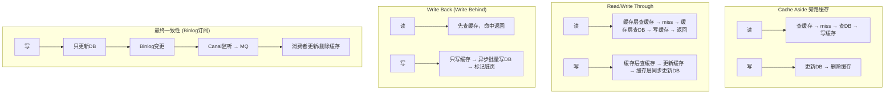
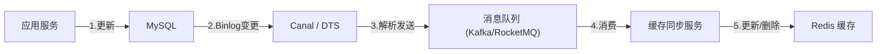

# 缓存一致性策略 (Cache Consistency Patterns)
> 创建日期：2026-06-08
> 难度：⭐⭐⭐
> 前置知识：Redis 基础、MySQL 基础、CAP 理论、最终一致性
> 关联模块：分布式缓存架构、数据库与缓存同步、消息队列 (Canal / Binlog)

## ⭐ 面试重点速览

| 考察点 | 重要程度 | 考察频率 | 掌握目标 |
|--------|---------|---------|---------|
| Cache Aside 旁路缓存模式 | 极高 | 极高 | 能画出读写流程图，说出先删缓存还是先更新DB |
| 延迟双删策略 | 高 | 高 | 能解释为什么需要两次删除及间隔时间 |
| Read/Write Through 模式 | 中 | 中 | 能对比与 Cache Aside 的区别 |
| Write Back (Write Behind) | 中 | 中 | 能说出利弊和丢数据风险 |
| 最终一致性方案 (订阅 Binlog) | 高 | 中 | 能描述 Canal + MQ 的异步同步架构 |
| 双写一致性问题 | 极高 | 极高 | 能列举至少3种不一致场景及解决方案 |

---

## 一、应用场景 🎯

| 场景 | 推荐模式 | 说明 |
|------|---------|------|
| **电商商品详情页** | Cache Aside | 读多写少，允许短暂不一致 |
| **用户账户余额** | Write Through + 分布式锁 | 一致性要求高，写入需同步持久化到DB |
| **秒杀库存扣减** | Write Back | 写密集，允许异步持久化，追求极致性能 |
| **社交Feed流** | 最终一致性 (Binlog) | 允许秒级延迟，通过MQ异步同步 |
| **配置中心** | Read Through | 配置变更频率极低，读取时自动加载 |
| **排行榜/计数** | Write Back | 计数类数据写入频繁，异步批量刷盘 |

---

## 二、核心原理 🔬

### 2.1 Cache Aside Pattern（旁路缓存）—— 最常用

这是最经典、最广泛使用的缓存模式。应用程序直接同时操作缓存和数据库，缓存层在"旁边"。

**读流程**：
```
1. 先查缓存，命中则直接返回
2. 缓存未命中，查数据库
3. 将数据库结果写入缓存
4. 返回结果
```

**写流程（先更新数据库，再删除缓存）**：

这是面试中的核心争议点。正确的顺序是：**先更新数据库，再删除缓存**。

为什么不是「先删缓存，再更新数据库」？

```
时序问题（先删缓存的风险）：
T1: 线程A删除缓存
T2: 线程B查询缓存miss → 查DB得到旧值 → 将旧值写入缓存
T3: 线程A更新数据库为新值
结果：缓存中是旧值，数据库中是旧值 → 脏数据直到缓存过期！
```

```
时序问题（先更新数据库再删缓存的风险）：
T1: 线程A查询缓存miss → 查DB得到旧值
T2: 线程B更新数据库为新值 → 删除缓存
T3: 线程A将旧值写入缓存
结果：缓存中是旧值，数据库中是旧值 → 脏数据！

但！这种情况发生概率极低：
- 线程A要在T1和T3之间卡住（读DB后到写缓存之间）
- 线程B要在T2完成写DB+删缓存
- 实际系统中读操作通常远快于写操作
```

**概率分析**：先删缓存再更新DB → 脏数据**大概率**出现；先更新DB再删缓存 → 脏数据**极小概率**出现（需要读线程在写线程更新DB和删缓存之间恰好读到了旧数据并还没写入缓存）。

### 2.2 Mermaid 流程图：四种缓存模式的读写对比



### 2.3 Read/Write Through 模式

**Read Through**：缓存层封装了数据加载逻辑，应用只和缓存交互。

```
应用 → 缓存层 → (miss时) → 数据库
              → 自动回写缓存
```

**Write Through**：写入时缓存层同步更新缓存和数据库。

```
应用 → 缓存层 → 更新缓存
              → 同步更新数据库
```

特点：应用代码不直接操作数据库，缓存层承担数据一致性责任。常见于 Guava Cache 的 LoadingCache、本地 ORM 框架。

### 2.4 Write Back (Write Behind)

写操作**只写缓存**，标记为"脏"，然后异步批量刷回数据库。

```
应用 → 只写缓存（标记脏） → 返回成功
                             ↓ (异步)
                            批量写数据库
```

**风险**：缓存宕机 → 脏数据丢失。需要缓存持久化（如 Redis AOF/RDB）来降低风险。

### 2.5 延迟双删策略

为了解决「先更新数据库再删缓存」的极小概率脏数据问题：

```
1. 先删除缓存
2. 更新数据库
3. 休眠 N 毫秒（如 500ms~1s）
4. 再次删除缓存
```

**原理**：第 1 次删除是为了清除旧缓存；休眠期间等待读线程可能写入的旧数据；第 2 次删除是为了清除休眠期间读线程写入的脏数据。

### 2.6 最终一致性方案：订阅 Binlog

利用 MySQL 的 Binlog（二进制日志）实现异步缓存同步，是生产环境中的主流方案。



**优点**：
- 业务代码无侵入，只需操作数据库
- 解耦：缓存更新逻辑独立于业务代码
- 可靠：Binlog 本身有顺序性和可靠性保证
- 支持增量同步

---

## 三、趣味解说 🎭

> **超市价格标签——货架标签（缓存）必须和收银系统（数据库）一致**

你去超市买东西，货架上贴着价格标签（缓存），收银台系统里有实际价格（数据库）。

**场景一（Cache Aside）：** 你要买牛奶，先看货架标签（查缓存）。标签上说 8 块，OK 你拿去结账。收银员扫码时如果价格变了（比如今天打折 6 块），收银系统（数据库）会自动更新并撕掉旧标签（删缓存），下次有人看标签时发现标签被撕了，就去收银系统重新查价并贴上新标签。

**关键问题：先撕标签还是先改收银系统？** 如果你先撕标签再改系统，在你撕掉标签到改系统之间，有顾客看到标签没了就去收银台问，收银员告诉他 8 块，顾客跑回去写了个"8 块"的标签贴上。然后你改了收银系统为 6 块——完蛋，标签上是 8 块，系统里是 6 块，不一致！

所以正确做法（Cache Aside）：先改收银系统（更新数据库），再撕标签（删缓存）。

**场景二（Write Back）：** 超市高峰期收银台排长队，经理说："结账时先在小本子上记账（写缓存），每小时汇总一次统一入系统（批量写DB）"。效率高，但万一小本子丢了就麻烦了。

**场景三（Binlog 订阅）：** 超市所有收银台的操作都会打出小票（Binlog），专门有个员工（Canal）蹲在打印机旁边收集这些小票，然后通过广播（MQ）通知所有货架的理货员（缓存同步服务）去更新标签。

---

## 四、代码实现 💻

### 4.1 Cache Aside 模式实现

```java
import redis.clients.jedis.Jedis;
import redis.clients.jedis.JedisPool;
import com.google.gson.Gson;

/**
 * Cache Aside（旁路缓存）模式实现
 * 读：先查缓存 → miss → 查DB → 写缓存
 * 写：先更新DB → 删除缓存
 */
public class CacheAsideService {
    private final JedisPool jedisPool;
    private final Gson gson = new Gson();

    public CacheAsideService() {
        this.jedisPool = new JedisPool("localhost", 6379);
    }

    /**
     * 读操作 —— Cache Aside 读取流程
     */
    public Product getProduct(long productId) {
        String cacheKey = "product:" + productId;
        try (Jedis jedis = jedisPool.getResource()) {
            // 1. 先查缓存
            String cachedJson = jedis.get(cacheKey);
            if (cachedJson != null) {
                return gson.fromJson(cachedJson, Product.class); // 缓存命中
            }

            // 2. 缓存未命中，查数据库
            Product product = queryFromDatabase(productId);
            if (product != null) {
                // 3. 将结果写入缓存（设置过期时间防止缓存常驻）
                jedis.setex(cacheKey, 3600, gson.toJson(product));
            }
            return product;
        }
    }

    /**
     * 写操作 —— 先更新数据库，再删除缓存
     */
    public void updateProduct(Product product) {
        // 1. 先更新数据库
        updateDatabase(product);

        // 2. 再删除缓存（不是更新缓存！）
        try (Jedis jedis = jedisPool.getResource()) {
            jedis.del("product:" + product.getId());
        }
    }

    // 模拟数据库操作
    private Product queryFromDatabase(long id) {
        // ... JDBC 查询逻辑
        return new Product();
    }

    private void updateDatabase(Product product) {
        // ... JDBC 更新逻辑
    }

    static class Product {
        private long id;
        private String name;
        private double price;
        public long getId() { return id; }
    }
}
```

### 4.2 延迟双删实现

```java
import java.util.concurrent.*;

/**
 * 延迟双删（Double Delete）策略
 * 用于降低 Cache Aside 的脏数据概率
 */
public class DelayedDoubleDeleteService {
    private final JedisPool jedisPool;
    private final ScheduledExecutorService scheduler = 
        Executors.newSingleThreadScheduledExecutor();

    public DelayedDoubleDeleteService() {
        this.jedisPool = new JedisPool("localhost", 6379);
    }

    /**
     * 写入流程：先删缓存 → 更新DB → 延迟再删缓存
     */
    public void updateWithDoubleDelete(Product product) {
        String cacheKey = "product:" + product.getId();
        try (Jedis jedis = jedisPool.getResource()) {
            // 第1次删除：清除旧缓存
            jedis.del(cacheKey);

            // 更新数据库
            updateDatabase(product);

            // 第2次删除：延迟 N 毫秒后再次删除（清除并发读写入的脏数据）
            // 延迟时间 ≈ 一次读操作(查询DB + 写缓存)的耗时
            scheduler.schedule(() -> {
                try (Jedis j = jedisPool.getResource()) {
                    j.del(cacheKey);
                }
            }, 500, TimeUnit.MILLISECONDS); // 延迟500ms
        }
    }

    private void updateDatabase(Product product) {
        // ... 更新数据库
    }
}
```

### 4.3 Binlog 订阅 + 缓存同步框架（Canal 模式模拟）

```java
import java.util.concurrent.BlockingQueue;
import java.util.concurrent.LinkedBlockingQueue;

/**
 * 模拟 Canal 监听 Binlog → 更新缓存的最终一致性方案
 * 
 * 真实生产环境：
 *   MySQL Binlog → Canal Server → Kafka/RocketMQ → 消费者更新Redis
 * 
 * 此处为简化模拟
 */
public class BinlogCacheSync {

    // 模拟 Canal 从 Binlog 解析出来的数据变更事件
    static class BinlogEvent {
        public enum OpType { INSERT, UPDATE, DELETE }
        OpType opType;
        String tableName;
        long rowId;  // 主键
        String beforeData; // UPDATE/DELETE 前镜像
        String afterData;  // INSERT/UPDATE 后镜像
    }

    // 模拟 Canal 解析 Binlog 后放入的消息队列
    private final BlockingQueue<BinlogEvent> eventQueue = new LinkedBlockingQueue<>();

    /**
     * Canal 客户端线程：持续监听 Binlog 事件
     */
    public void startCanalListener() {
        new Thread(() -> {
            while (true) {
                try {
                    // 模拟从 Canal 获取 Binlog 事件
                    BinlogEvent event = fetchNextBinlogEvent();
                    if (event != null) {
                        eventQueue.put(event); // 放入MQ（此处简化为内存队列）
                    }
                } catch (InterruptedException e) {
                    Thread.currentThread().interrupt();
                    break;
                }
            }
        }, "canal-listener").start();
    }

    /**
     * 缓存同步消费者：消费 Binlog 事件并更新 Redis
     */
    public void startCacheSyncConsumer() {
        new Thread(() -> {
            while (true) {
                try {
                    BinlogEvent event = eventQueue.take();
                    String cacheKey = event.tableName + ":" + event.rowId;

                    switch (event.opType) {
                        case INSERT:
                        case UPDATE:
                            // 更新缓存：写入最新数据
                            updateCache(cacheKey, event.afterData);
                            break;
                        case DELETE:
                            // 删除缓存
                            deleteCache(cacheKey);
                            break;
                    }
                } catch (InterruptedException e) {
                    Thread.currentThread().interrupt();
                    break;
                }
            }
        }, "cache-sync-consumer").start();
    }

    // 模拟方法
    private BinlogEvent fetchNextBinlogEvent() { return null; }
    private void updateCache(String key, String data) { /* jedis.set(key, data) */ }
    private void deleteCache(String key) { /* jedis.del(key) */ }
}
```

### 4.4 Write Through 模式实现

```java
/**
 * Write Through 模式：缓存层统一处理读写，应用只和缓存层交互
 */
public class WriteThroughCache<K, V> {
    private final Storage<K, V> database;
    private final Cache<K, V> cache;

    public WriteThroughCache(Storage<K, V> db, Cache<K, V> cache) {
        this.database = db;
        this.cache = cache;
    }

    /** Read Through：缓存miss时自动加载 */
    public V readThrough(K key) {
        V value = cache.get(key);
        if (value == null) {
            value = database.load(key);     // 从DB加载
            if (value != null) {
                cache.put(key, value);      // 自动回写缓存
            }
        }
        return value;
    }

    /** Write Through：同步写缓存和数据库 */
    public void writeThrough(K key, V value) {
        cache.put(key, value);       // 先写缓存
        database.save(key, value);   // 同步写数据库
    }
}
```

---

## 五、优缺点 ⚖️

### 各模式对比

| 模式 | 一致性 | 性能 | 复杂度 | 适用场景 |
|------|--------|------|--------|---------|
| **Cache Aside** | 最终一致 | 高 | 低 | 读多写少，容忍短暂不一致 |
| **Read/Write Through** | 强一致 | 中 | 中 | 缓存层封装，对应用透明 |
| **Write Back** | 弱一致 | 极高 | 中 | 写密集，允许丢失少量数据 |
| **延迟双删** | 较高 | 中 | 低 | Cache Aside 的增强版 |
| **Binlog 订阅** | 最终一致 | 高 | 高 | 大规模系统，多服务共享缓存 |

### Cache Aside 模式详析

| 优点 | 缺点 |
|------|------|
| 实现简单，应用代码直接控制缓存逻辑 | 代码侵入性高，每个查询都要写缓存逻辑 |
| 灵活性高，可按业务定制缓存策略 | 存在不一致窗口期 |
| 缓存只缓存热点数据，节省内存 | 首次访问必然 miss（冷启动） |
| 缓存层失效不影响系统可用性（降级到DB） | 缓存穿透/击穿/雪崩需额外处理 |

---

## 六、面试高频题 📝

**Q1：为什么是删除缓存而不是更新缓存？**

答：1) 写操作远少于读操作，删除缓存后等下次读再加载更高效；2) 如果更新缓存而非删除，多次写操作之间没有读的话，会做无效的缓存更新；3) 并发写操作下更新缓存可能产生时序问题，而删除缓存是幂等的。

**Q2：先删缓存再更新数据库有什么问题？**

答：会出现高概率的脏数据。并发场景下：A 删缓存 → B 查缓存 miss → B 查 DB 得旧值 → B 写旧值到缓存 → A 更新 DB 为新值。最终缓存是旧值而 DB 是新值，不一致。

**Q3：延迟双删的延迟时间怎么确定？**

答：需大于一次"读 DB + 写缓存"的耗时，通常取 500ms~1s。更精确的做法是结合业务统计读操作的平均耗时和 P99 耗时。

**Q4：删缓存失败了怎么办？**

答：引入重试机制。可以将删除操作放入消息队列，失败后重试。或使用 Binlog 订阅方案（Canal），由独立的缓存同步服务保证最终一致性。

**Q5：Cache Aside 和 Read/Write Through 的区别？**

答：Cache Aside 中**应用代码**负责读写缓存和数据库的协调，缓存是"旁路"的。Read/Write Through 中**缓存层**自身封装了数据加载和同步逻辑，应用只和缓存交互，对数据库无感知。

**Q6：如何保证缓存和数据库的强一致性？**

答：纯缓存+数据库架构做不到绝对强一致（受 CAP 约束）。实践中的方案：1) 分布式锁 + Write Through（读写串行化）；2) 先更新 DB → 删缓存 → 若删缓存失败则用 Binlog 异步补偿；3) 放弃缓存，直连数据库（牺牲性能换一致性）。

---

## 七、常见误区 ❌

| 误区 | 纠正 |
|------|------|
| "先删缓存再更新DB是最佳实践" | 恰恰相反，这是最常见的错误。正确顺序是先更新 DB 再删缓存。先删缓存会产生高概率脏数据。 |
| "只要用了缓存就有性能提升" | 不合理的缓存策略可能导致比不用缓存更差（如缓存命中率极低、缓存穿透打到 DB）。 |
| "删缓存失败了没关系，等缓存过期就行" | 如果缓存设置了很长的过期时间甚至永不过期，删缓存失败会导致长期不一致。必须有补偿机制。 |
| "Binlog 订阅可以做到实时一致" | Binlog 订阅是**最终一致性**方案，存在秒级延迟。Canal 到 MQ 再到消费者的链路含有多个异步环节。 |
| "缓存一致性 = 强一致性" | 缓存架构通常是 AP 系统的折中，追求的是最终一致性而非强一致性。需要强一致性的场景应放弃缓存或使用分布式锁。 |
| "Write Back 一定比 Write Through 快" | Write Back 写操作快，但读操作如果缓存 miss，仍需等脏数据回写 DB 后才能读取，读延迟可能更高。 |