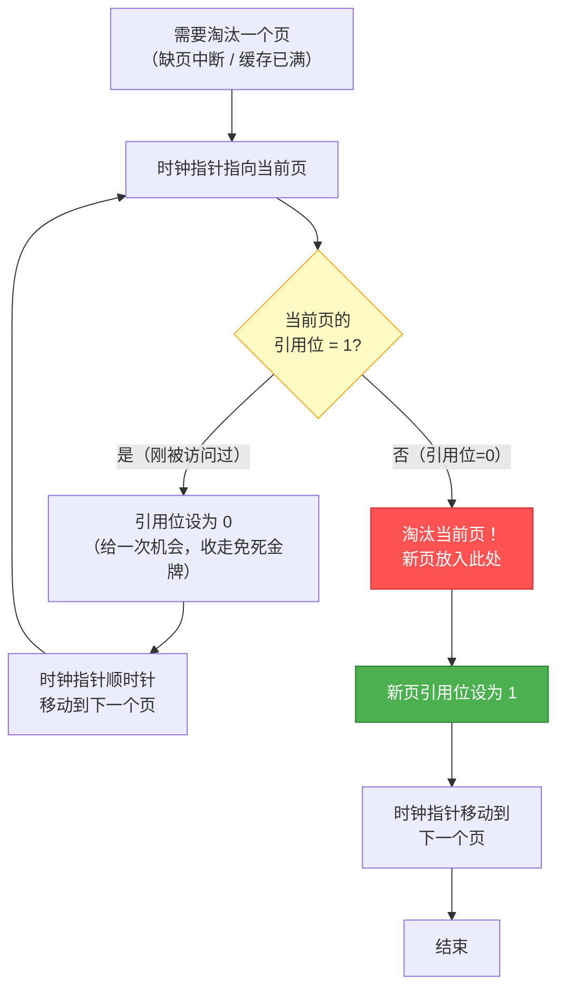

# Clock 时钟算法 (Clock Algorithm)
> 创建日期：2026-06-08
> 难度：⭐⭐
> 前置知识：LRU、页面置换、操作系统内存管理、环形缓冲区
> 关联模块：操作系统页置换、数据库缓冲池、缓存淘汰

## ⭐ 面试重点速览

| 考察点 | 重要程度 | 考察频率 | 掌握目标 |
|--------|---------|---------|---------|
| 引用位（reference bit）的设置与重置 | 极高 | 极高 | 能解释说清楚引用位为1变0的时机 |
| 时钟指针的循环遍历过程 | 极高 | 极高 | 能手动画出一轮指针移动过程 |
| "二次机会"（Second Chance）的含义 | 高 | 高 | 能说明给了一次机会后为什么还要淘汰 |
| Clock vs LRU 的效率和实现差异 | 高 | 高 | 能对比两者的时间空间复杂度 |
| 操作系统页置换中的应用 | 高 | 中 | 能说出Linux/BSD中Clock的变体 |
| 改进型Clock（增加修改位） | 中 | 中 | 能说出两轮扫描的四个优先级 |
| Clock-Pro（Clock的ARC变体） | 中 | 低 | 能说出与ARC的关系 |

---

## 一、应用场景 🎯

Clock 算法是 LRU 的一种高效近似实现，通过环形缓冲区和引用位替代了LRU的链表操作，在操作系统和数据库领域广泛应用。

| 场景 | 说明 |
|------|------|
| **操作系统页面置换** | Linux、BSD、Windows 等操作系统内核使用 Clock 变体管理物理内存页 |
| **数据库缓冲池** | PostgreSQL 的 Buffer Manager 使用 Clock-sweep 算法管理共享缓冲池 |
| **CPU 缓存** | 部分 CPU 缓存替换策略（如 Pseudo-LRU）借鉴了 Clock 思想 |
| **文件系统缓存** | 内核的 page cache 逐出机制使用 Clock 变体 |
| **Redis 淘汰策略** | Redis 的采样淘汰虽然最终用 LRU，但 Clock 的思想影响了其近似实现 |
| **嵌入式系统** | 内存受限的嵌入式设备中，Clock 的低开销特性使其成为首选 |

**核心价值**：Clock 用极小的内存开销（每个缓存条目只需1个引用位）实现了 LRU 的良好近似，避免了 LRU 每次访问都要移动链表节点的 O(1) 锁开销，是高并发场景下 LRU 的最佳替代方案。

---

## 二、核心原理 🔬

### 2.1 基本思想

Clock 算法用一个**环形缓冲区**（循环链表）组织所有缓存页，外加一个**时钟指针**（类似钟表的分针）和一个**引用位**（reference bit）。

```
每个缓存条目只有两个关键信息：
  1. 数据本身
  2. 引用位 (reference bit)：0 或 1
     - 1 表示最近被访问过（给一次"免死金牌"）
     - 0 表示最近没有被访问过（淘汰候选）
```

### 2.2 算法流程

```
访问页 P：
  1. 如果 P 在缓存中 → 将 P 的引用位设为 1（标记为最近使用）
  2. 如果 P 不在缓存中 → 需要淘汰一个页：
     a. 时钟指针顺时针移动
     b. 检查当前指针指向的页的引用位：
        - 引用位 = 1 → 改为 0，指针移到下一个（给"第二次机会"）
        - 引用位 = 0 → 淘汰该页，新页放入此处，引用位设为 1
     c. 重复直到找到引用位为 0 的页
```

### 2.3 Mermaid 时钟指针流程图



### 2.4 时钟指针遍历实例

假设缓存有 4 个槽位，初始状态：

```
  [A:1] → [B:1] → [C:0] → [D:1] → (回到A)
    ↑
   指针
```

**步骤1：访问页 E（缺页，需要淘汰）**

```
第1轮：指针指向 A，引用位=1 → 改为0，指针移动
  [A:0] → [B:1] → [C:0] → [D:1] → (回到A)
            ↑
           指针

第2轮：指针指向 B，引用位=1 → 改为0，指针移动
  [A:0] → [B:0] → [C:0] → [D:1] → (回到A)
                    ↑
                   指针

第3轮：指针指向 C，引用位=0 → 淘汰C！放入E，引用位=1
  [A:0] → [B:0] → [E:1] → [D:1] → (回到A)
                            ↑
                           指针
```

**步骤2：访问页 F（缺页，需要淘汰）**

```
第1轮：指针指向 D，引用位=1 → 改为0，指针移动
  [A:0] → [B:0] → [E:1] → [D:0] → (回到A)
    ↑
   指针

第2轮：指针指向 A，引用位=0 → 淘汰A！放入F，引用位=1
  [F:1] → [B:0] → [E:1] → [D:0] → (回到A)
            ↑
           指针
```

### 2.5 "二次机会"的含义

Clock 算法也叫 **Second Chance（二次机会）算法**。当一个页的引用位为 1 时：

```
第一次被指针扫描到：引用位=1 → "你最近被用过，再给你一次机会"
                     引用位改为0，指针跳过
第二次被指针扫描到：引用位=0 → "给你机会了但你一直没被用，淘汰！"
```

这相当于 LRU 的近似：**最近被访问过的页获得一次"免死金牌"，在下一轮扫描中不会被淘汰**。

### 2.6 改进型 Clock（Enhanced Clock）

改进型 Clock 增加了一个**修改位（dirty bit）**，形成四个优先级：

| 优先级 | 引用位 | 修改位 | 含义 | 淘汰代价 |
|--------|--------|--------|------|---------|
| 第1类（最佳淘汰） | 0 | 0 | 最近未访问、未修改 | 最低（直接丢弃） |
| 第2类 | 0 | 1 | 最近未访问、已修改 | 中（需写回磁盘） |
| 第3类 | 1 | 0 | 最近访问过、未修改 | 中（可能很快再用） |
| 第4类（最差淘汰） | 1 | 1 | 最近访问过、已修改 | 最高（可能再用 + 需写回） |

**改进型 Clock 的扫描策略**：

```
第一轮扫描：找 (0,0) → 不修改任何引用位
第二轮扫描：找 (0,1) → 将经过的引用位设为0
第三轮扫描：找 (0,0) → 此时第3类已被降为第1类
第四轮扫描：找 (0,1) → 此时第4类已被降为第2类
```

| 扫描轮次 | 寻找目标 | 本轮的副作用 |
|----------|---------|-------------|
| 第1轮 | (0,0) 未访问未修改 | 无 |
| 第2轮 | (0,1) 未访问已修改 | 将经过的引用位设为0 |
| 第3轮 | (0,0) | 经过第2轮降级后的页 |
| 第4轮 | (0,1) | 必定能找到 |

### 2.7 Clock 与 LRU 的对比

| 对比维度 | LRU | Clock |
|----------|-----|-------|
| 数据结构 | 哈希表 + 双向链表 | 环形数组 + 引用位 |
| 每次访问开销 | O(1) 但需移动链表节点 | O(1) 只需设置一个位 |
| 淘汰开销 | O(1) 直接取尾部 | 最坏 O(n) 扫描整圈 |
| 内存开销 | 每个条目需要两个指针 (prev/next) | 每个条目只需1个引用位 |
| 并发友好度 | 差（移动节点需要全局锁） | 好（设置引用位可用原子操作） |
| 精确度 | 精确的 LRU | 近似 LRU（二次机会） |
| 实现复杂度 | 中 | 低 |

### 2.8 操作系统中的实际应用

| 操作系统 | Clock 变体 | 特点 |
|----------|-----------|------|
| **Linux** | 改进型 Clock（两轮扫描） | 结合 active/inactive 链表，使用引用位作为升降级依据 |
| **FreeBSD** | Clock 变体 | 页守护进程（page daemon）使用 Clock 扫描 |
| **Windows** | 工作集修剪 + Clock | 结合工作集（working set）概念 |
| **PostgreSQL** | Clock-sweep | Buffer Manager 使用 Clock-sweep 管理共享缓冲池页 |

---

## 三、趣味解说 🎭

> **钟表分针走一圈——遇到引用位为 1 就给 0，遇到 0 就淘汰**

想象你是一个图书馆管理员，负责管理 10 个书架（缓存槽位）。书架上只能放 10 本书，新书来了必须淘汰一本。

你有一个特殊的钟表，分针每走一格指向一个书架。你还有一叠"已读"标签（引用位=1）。

**规则是这样的**：

- 当有人借阅一本书时，你就在那本书上贴一个"已读"标签（引用位=1）
- 当新书来了需要淘汰时，你启动分针：
  - 分针指向当前书架，看一眼上面的书
  - 如果有"已读"标签 → 撕掉标签（引用位=1 改为 0），分针走一格
  - 如果没有"已读"标签 → 把这本书扔了！新书放上去，贴个"已读"标签，分针走一格

**为什么叫"二次机会"？**

如果一本书有"已读"标签，说明它刚刚被人借过，你于心不忍地给它一次机会——撕掉标签但保留它。分针继续走。如果分针转了一圈又回到这本书，而标签已经被撕掉了（说明这一整圈都没人再借它），那你就毫不留情地把它扔了。

**形象比喻**：Clock 像是一个在圆形轨道上运行的火车，每个车厢（缓存页）上有一个小旗子。有人访问车厢就竖起旗子（引用位=1）。火车头（指针）边走边检查：遇到竖旗的就把旗子按下（设为0），遇到没旗的就把车厢扔掉换新的。

**和 LRU 的关系**：LRU 像是一个严格的考勤表，每次有人访问就要重新排队。Clock 宽松得多——只要你在这一轮扫描中被访问过，就能活到下一轮。但如果一整轮都没人理你，那就对不起了。

---

## 四、代码实现 💻

### 4.1 Clock 基础实现 (Java)

```java
/**
 * Clock 时钟算法 —— 页面置换 / 缓存淘汰
 *
 * 数据结构：环形数组 + 引用位
 * 每个槽位存储：数据 + 引用位(reference bit)
 * 一个时钟指针循环遍历
 */
public class ClockCache<K, V> {
    // 缓存槽位
    private static class Entry<K, V> {
        K key;
        V value;
        boolean referenceBit;  // 引用位：true=最近访问过，false=未访问

        Entry(K key, V value) {
            this.key = key;
            this.value = value;
            this.referenceBit = true;  // 新放入的页默认引用位为1
        }
    }

    private final Entry<K, V>[] buffer;  // 环形缓冲区
    private final int capacity;
    private int clockHand;  // 时钟指针位置（0 到 capacity-1）
    private int size;       // 当前缓存条目数

    @SuppressWarnings("unchecked")
    public ClockCache(int capacity) {
        this.capacity = capacity;
        this.buffer = new Entry[capacity];
        this.clockHand = 0;
        this.size = 0;
    }

    /**
     * 访问缓存
     * @return 命中返回value，未命中返回null
     */
    public V get(K key) {
        // 遍历环形缓冲区查找
        for (int i = 0; i < capacity; i++) {
            Entry<K, V> entry = buffer[i];
            if (entry != null && entry.key.equals(key)) {
                // 命中！设置引用位为1
                entry.referenceBit = true;
                return entry.value;
            }
        }
        return null;  // 未命中
    }

    /**
     * 放入新数据
     */
    public void put(K key, V value) {
        // 1. 检查是否已存在（更新场景）
        for (int i = 0; i < capacity; i++) {
            if (buffer[i] != null && buffer[i].key.equals(key)) {
                buffer[i].value = value;
                buffer[i].referenceBit = true;  // 更新引用位
                return;
            }
        }

        // 2. 如果还有空位，直接放入
        if (size < capacity) {
            for (int i = 0; i < capacity; i++) {
                if (buffer[i] == null) {
                    buffer[i] = new Entry<>(key, value);
                    size++;
                    return;
                }
            }
        }

        // 3. 缓存已满 → 时钟淘汰
        evictAndInsert(key, value);
    }

    /**
     * 时钟淘汰核心逻辑
     * 从 clockHand 开始顺时针扫描，找到引用位为 0 的槽位淘汰
     */
    private void evictAndInsert(K key, V value) {
        while (true) {
            Entry<K, V> current = buffer[clockHand];

            if (current.referenceBit) {
                // 引用位=1 → 给第二次机会：引用位改为0，指针移动
                current.referenceBit = false;
                clockHand = (clockHand + 1) % capacity;
            } else {
                // 引用位=0 → 淘汰！
                System.out.println("淘汰: " + current.key);
                // 新数据替换旧数据，引用位设为1
                buffer[clockHand] = new Entry<>(key, value);
                clockHand = (clockHand + 1) % capacity;  // 指针移到下一个
                return;
            }
        }
    }

    /** 显示当前缓存状态 */
    public void printStatus() {
        System.out.println("=== Clock Cache 状态 ===");
        for (int i = 0; i < capacity; i++) {
            if (buffer[i] != null) {
                String marker = (i == clockHand) ? " <-- 指针" : "";
                System.out.printf("[%d] key=%s, ref=%d%s\n",
                    i, buffer[i].key, buffer[i].referenceBit ? 1 : 0, marker);
            } else {
                String marker = (i == clockHand) ? " <-- 指针" : "";
                System.out.printf("[%d] (空)%s\n", i, marker);
            }
        }
    }

    // ========== 测试 ==========
    public static void main(String[] args) {
        ClockCache<String, String> clock = new ClockCache<>(4);

        clock.put("A", "数据A");
        clock.put("B", "数据B");
        clock.put("C", "数据C");
        clock.put("D", "数据D");
        clock.printStatus();

        // 访问A和B，设置引用位
        clock.get("A");
        clock.get("B");
        System.out.println("\n访问A和B后：");
        clock.printStatus();

        // 放入E，触发淘汰
        System.out.println("\n放入E：");
        clock.put("E", "数据E");
        clock.printStatus();
    }
}
```

### 4.2 改进型 Clock（增加修改位 dirty bit）

```java
/**
 * 改进型 Clock —— 增加修改位（dirty bit）
 * 用于操作系统页面置换，优先淘汰未修改的页（避免磁盘写回开销）
 */
public class EnhancedClockCache<K, V> {
    private static class Page<K, V> {
        K key;
        V value;
        boolean referenceBit;  // 引用位
        boolean dirtyBit;      // 修改位（脏页需写回磁盘）

        Page(K key, V value) {
            this.key = key;
            this.value = value;
            this.referenceBit = true;
            this.dirtyBit = false;
        }
    }

    private final Page<K, V>[] buffer;
    private final int capacity;
    private int clockHand;
    private int size;

    @SuppressWarnings("unchecked")
    public EnhancedClockCache(int capacity) {
        this.capacity = capacity;
        this.buffer = new Page[capacity];
        this.clockHand = 0;
        this.size = 0;
    }

    public V get(K key) {
        for (int i = 0; i < capacity; i++) {
            if (buffer[i] != null && buffer[i].key.equals(key)) {
                buffer[i].referenceBit = true;  // 读访问，设置引用位
                return buffer[i].value;
            }
        }
        return null;
    }

    /**
     * 写入数据（标记为脏页）
     */
    public void put(K key, V value) {
        // 检查是否已存在
        for (int i = 0; i < capacity; i++) {
            if (buffer[i] != null && buffer[i].key.equals(key)) {
                buffer[i].value = value;
                buffer[i].referenceBit = true;
                buffer[i].dirtyBit = true;  // 写操作 → 标记脏页
                return;
            }
        }
        // 新数据
        if (size < capacity) {
            for (int i = 0; i < capacity; i++) {
                if (buffer[i] == null) {
                    buffer[i] = new Page<>(key, value);
                    size++;
                    return;
                }
            }
        }
        evictEnhanced(key, value);
    }

    /**
     * 改进型 Clock 淘汰逻辑 —— 四轮扫描
     *
     * 第1轮：找 (ref=0, dirty=0) → 最佳淘汰，不需要写回
     * 第2轮：找 (ref=0, dirty=1) → 需要写回，但最近未访问
     * 第3轮：第1类已在第2轮被降级 → 再次找 (ref=0, dirty=0)
     * 第4轮：必定找到 (ref=0, dirty=1)
     */
    private void evictEnhanced(K key, V value) {
        // 第1轮扫描：找 (0,0) —— 不修改引用位
        for (int i = 0; i < capacity; i++) {
            Page<K, V> page = buffer[clockHand];
            if (!page.referenceBit && !page.dirtyBit) {
                // 最佳淘汰候选
                replacePage(key, value);
                return;
            }
            clockHand = (clockHand + 1) % capacity;
        }

        // 第2轮扫描：找 (0,1) —— 同时将经过的引用位设为0
        for (int i = 0; i < capacity; i++) {
            Page<K, V> page = buffer[clockHand];
            if (!page.referenceBit && page.dirtyBit) {
                // 需要写回磁盘，但可以淘汰
                writeBack(page);  // 模拟写回磁盘
                replacePage(key, value);
                return;
            }
            page.referenceBit = false;  // 经过的页引用位清零
            clockHand = (clockHand + 1) % capacity;
        }

        // 第3轮和第4轮：经过第2轮降级后，必定能找到
        // 简化处理：直接找第一个引用位为0的页
        while (true) {
            Page<K, V> page = buffer[clockHand];
            if (!page.referenceBit) {
                if (page.dirtyBit) writeBack(page);
                replacePage(key, value);
                return;
            }
            page.referenceBit = false;
            clockHand = (clockHand + 1) % capacity;
        }
    }

    private void replacePage(K key, V value) {
        System.out.println("淘汰页: " + buffer[clockHand].key
            + " (ref=" + (buffer[clockHand].referenceBit ? 1 : 0)
            + ", dirty=" + (buffer[clockHand].dirtyBit ? 1 : 0) + ")");
        buffer[clockHand] = new Page<>(key, value);
        clockHand = (clockHand + 1) % capacity;
    }

    /** 模拟脏页写回磁盘 */
    private void writeBack(Page<K, V> page) {
        System.out.println("脏页写回磁盘: " + page.key);
    }
}
```

### 4.3 PostgreSQL Clock-sweep 模拟

```java
/**
 * 模拟 PostgreSQL Buffer Manager 的 Clock-sweep 算法
 *
 * PG 使用一个全局的时钟指针（StrategyControl.nextVictimBuffer）
 * 在共享缓冲池中循环扫描，每次找引用位(pin_count)=0且usage_count=0的页
 */
public class PostgresClockSweep {
    private static class BufferPage {
        int bufferId;
        int usageCount;   // 使用计数（类似引用位，但可以有多个等级）
        int pinCount;     // 固定计数（>0表示正在被使用，不能淘汰）
        boolean isDirty;  // 脏页标记

        BufferPage(int id) {
            this.bufferId = id;
            this.usageCount = 0;
            this.pinCount = 0;
            this.isDirty = false;
        }
    }

    private final BufferPage[] bufferPool;
    private final int totalBuffers;
    private int clockHand;  // 全局时钟指针（StrategyControl.nextVictimBuffer）

    public PostgresClockSweep(int totalBuffers) {
        this.totalBuffers = totalBuffers;
        this.bufferPool = new BufferPage[totalBuffers];
        for (int i = 0; i < totalBuffers; i++) {
            bufferPool[i] = new BufferPage(i);
        }
        this.clockHand = 0;
    }

    /**
     * PostgreSQL 的 Clock-sweep 淘汰算法
     *
     * 规则：
     *  1. pin_count > 0 → 跳过（正在使用，不能淘汰）
     *  2. usage_count > 0 → usage_count--，指针移动（给机会）
     *  3. usage_count == 0 → 淘汰候选！
     */
    public int findVictim() {
        int scanned = 0;
        while (scanned < totalBuffers * 2) {  // 最多扫两圈，防止死循环
            BufferPage page = bufferPool[clockHand];

            if (page.pinCount == 0) {
                // 未被固定，可以淘汰
                if (page.usageCount > 0) {
                    // usage_count > 0 → 递减，给机会
                    page.usageCount--;
                } else {
                    // usage_count == 0 → 淘汰！
                    int victim = clockHand;
                    clockHand = (clockHand + 1) % totalBuffers;
                    return victim;
                }
            }
            // pin_count > 0 或 usage_count 刚被递减 → 指针移动
            clockHand = (clockHand + 1) % totalBuffers;
            scanned++;
        }
        return -1;  // 没有可淘汰的页（所有页都被固定）
    }

    /** 模拟访问一个缓冲页 */
    public void touch(int bufferId) {
        BufferPage page = bufferPool[bufferId];
        if (page.usageCount < 5) {  // PG 中 usage_count 上限为 5
            page.usageCount++;
        }
    }
}
```

---

## 五、优缺点 ⚖️

### 优点

| 优点 | 说明 |
|------|------|
| **内存开销极低** | 每个缓存条目只需 1 个引用位（1 bit），不需要链表指针 |
| **实现简单** | 环形数组 + 引用位的逻辑非常直观，代码量少 |
| **并发友好** | 引用位的设置和清除可以用原子操作实现，不需要全局锁来移动链表节点 |
| **近似 LRU 效果** | 在大多数工作负载下，命中率接近精确 LRU |
| **无额外内存分配** | 环形缓冲区是静态分配的，不涉及动态内存管理 |

### 缺点

| 缺点 | 说明 |
|------|------|
| **最坏情况 O(n)** | 当所有引用位都为 1 时，指针需要扫描一整圈才能找到淘汰目标 |
| **精度有限** | 只有 1 位引用信息，无法区分"访问了 2 次"和"访问了 100 次" |
| **可能饿死** | 理论上如果访问模式恰好让指针永远扫不到某个页，该页可能长期不被淘汰（但实际中很少发生） |
| **不适合纯 LRU 需求** | 对 LRU 精度要求极高的场景，Clock 的近似效果可能不够 |

---

## 六、面试高频题 📝

**Q1：Clock 算法为什么又叫"二次机会"算法？**

答：当指针扫描到一个页时，如果引用位为 1，说明该页最近被访问过。算法不立即淘汰它，而是将引用位清 0 后跳过——相当于给了这个页"第二次机会"。如果指针转了一圈再次回到这个页且引用位仍为 0（说明这一整圈都没人再访问它），则淘汰。这种"先给一次机会，再访问不到就淘汰"的机制就是"二次机会"的含义。

**Q2：Clock 算法和 LRU 是什么关系？**

答：Clock 是 LRU 的**近似实现**。LRU 精确记录了每个页的访问顺序（通过双向链表），而 Clock 只用一个引用位做近似。如果访问模式是"所有页等概率访问"，Clock 的效果接近 LRU。如果访问模式有很强的局部性，Clock 的近似效果也很好。关键在于 Clock 用极小的内存开销（1 bit/页 vs 2 指针/页）换取了接近 LRU 的命中率。

**Q3：改进型 Clock 为什么要增加修改位（dirty bit）？**

答：在操作系统中，淘汰一个页时如果该页被修改过（脏页），需要先将其内容写回磁盘，这会带来额外的 I/O 开销。改进型 Clock 通过引入修改位，优先淘汰"未修改"的页（(0,0)），避免不必要的磁盘写回。只有当找不到 (0,0) 时才淘汰脏页 (0,1)，那时再写回磁盘。

**Q4：Clock 算法的最坏时间复杂度是多少？**

答：最坏 O(n)，其中 n 是缓存容量。当所有页的引用位都为 1 时，指针需要扫描一整圈，将每个引用位从 1 改为 0，然后第二次扫描时才能找到淘汰目标。实际应用中这种情况很少发生，因为指针在扫描过程中，被访问的页会重新设置引用位为 1，形成动态平衡。

**Q5：PostgreSQL 的 Clock-sweep 和标准 Clock 有什么区别？**

答：PG 的 Clock-sweep 使用 `usage_count`（0-5 的整数）替代了标准的布尔引用位。每次访问时 `usage_count` 递增（上限 5），指针扫描时递减。这提供了更精细的访问频率信息——usage_count=5 的页比 usage_count=1 的页更难被淘汰，更接近 LFU 的思想。另外，`pin_count > 0` 的页直接被跳过，保证了正在使用的页不会被淘汰。

---

## 七、常见误区 ❌

| 误区 | 纠正 |
|------|------|
| "Clock 算法和 LRU 是一样的" | Clock 是 LRU 的近似，不是精确 LRU。Clock 的淘汰决策基于"上一轮扫描中是否被访问"，而 LRU 基于精确的访问时间顺序。 |
| "引用位为 1 的页永远不会被淘汰" | 引用位为 1 只是推迟淘汰，不是永久保护。当指针扫描到时，引用位会被清 0，下一轮扫描时如果该页仍未被访问，就会被淘汰。 |
| "时钟指针每次都是从 0 开始" | 时钟指针是**全局且持续**的，不会重置。每次淘汰后指针停在下一个位置，下次淘汰从那里继续。这保证了所有页被公平扫描。 |
| "改进型 Clock 的四个优先级是固定的" | 优先级是动态的。第 2 轮扫描会将经过的页的引用位清 0，从而将第 3 类 (1,0) 降为第 1 类 (0,0)，将第 4 类 (1,1) 降为第 2 类 (0,1)。 |
| "Clock 算法只用于操作系统" | Clock 在数据库缓冲池（PostgreSQL）、文件系统缓存、甚至某些用户态缓存库中都有应用。它是一种通用的缓存淘汰策略。 |
| "Clock 的引用位由软件设置" | 在现代操作系统中，引用位通常由 **MMU（内存管理单元）硬件**自动设置。当 CPU 访问一个页时，MMU 自动将该页的 PTE（页表项）中的 Accessed 位置为 1。操作系统只需在扫描时读取和清除。 |
| "Clock 可以完全替代 LRU" | 在需要精确 LRU 语义的场景（如某些缓存一致性协议），Clock 的近似效果不够。大多数场景下 Clock 足够好，但并非银弹。 |