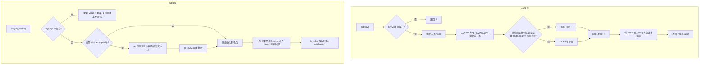

# LFU 最不经常使用 (Least Frequently Used)
> 创建日期：2026-06-08
> 难度：⭐⭐
> 前置知识：LRU 缓存淘汰、哈希表、最小堆、频率统计
> 关联模块：Redis LFU 模式、Web 缓存、内容分发网络 (CDN)

## ⭐ 面试重点速览

| 考察点 | 重要程度 | 考察频率 | 掌握目标 |
|--------|---------|---------|---------|
| 频率计数 + LRU 分层设计 | 高 | 高 | 能手动画出 freq map 到双向链表的映射关系 |
| 最小堆实现 LFU | 中 | 中 | 能说出堆版本和分层版本的复杂度差异 |
| Redis LFU 近似算法 | 高 | 高 | 能解释对数计数器的实现逻辑 |
| 与 LRU 的对比与取舍 | 极高 | 高 | 能说出各自适用场景和不足 |
| LFU 的"旧热点"问题 | 中 | 中 | 能解释并给出衰减方案 |

---

## 一、应用场景 🎯

| 场景 | 说明 |
|------|------|
| **Redis allkeys-lfu** | `maxmemory-policy allkeys-lfu`：基于访问频率淘汰缓存 |
| **CDN 内容缓存** | 高频访问的静态资源（图片、视频）应优先保留在边缘节点 |
| **Web 缓存代理** | 常用 API 响应结果缓存，低频接口优先淘汰 |
| **搜索引擎缓存** | 热门搜索词的查询结果缓存保留更久 |
| **数据库查询缓存** | 高频查询的结果集优先缓存 |
| **广告投放** | 高点击素材应优先加载和展示 |

---

## 二、核心原理 🔬

### 2.1 设计思路

LFU 的核心思想：**访问频率越高的数据，将来被访问的概率也越大**。淘汰时优先移除访问次数最少的数据。

与 LRU 的区别：

```
LRU: "你上次什么时候来的？" → 淘汰最久没来的
LFU: "你一共来过几次？"     → 淘汰来得最少的
```

### 2.2 频率计数 + LRU 分层（最优实现）

这是面试中最经典的 LFU 工程实现，**get 和 put 都是 O(1)**：

```
                    freqMap (频率 → 双向链表)
                       │
        ┌──────────────┼──────────────┐
        ▼              ▼              ▼
    freq=1链表     freq=2链表     freq=3链表
   ┌──┬──┬──┐    ┌──┬──┬──┐    ┌──┬──┬──┐
   │k1│k3│k4│    │k2│k5│  │    │k6│  │  │
   └──┴──┴──┘    └──┴──┴──┘    └──┴──┴──┘
```

- **keyMap**：key → Node（O(1) 查找节点）
- **freqMap**：频率 freq → 该频率对应的双向链表（头-尾方向：新-旧）
- **minFreq**：全局最小频率，淘汰时直接定位到对应链表

**操作逻辑**：
- get(key)：从 keyMap 查找，频率+1，把节点从旧频率链表摘下，放入 freq+1 的链表
- put(key,value)：若存在则更新值并频率+1；若不存在则新建节点 freq=1。若满，从 minFreq 对应链表的尾部淘汰
- 淘汰后用掉的节点更新 minFreq

### 2.3 Mermaid 流程图



### 2.4 Redis LFU 近似算法

Redis 4.0 引入了 LFU 淘汰策略，采用近似实现：

#### 对数计数器

传统 LFU 用整数记录频率会无限增长且占用空间大。Redis 使用**8位的对数计数器 + 概率递增**：

```
增长概率公式: P = 1 / (counter * lfu_log_factor + 1)
```

- `counter`：当前计数值（0-255）
- `lfu_log_factor`：对数增长因子（默认10）

| counter | 实际访问次数（log_factor=10） | 实际访问次数（log_factor=100） |
|---------|---------------------------|----------------------------|
| 1  | 1          | 1          |
| 10 | ~50        | ~500       |
| 50 | ~20K       | ~2M        |
| 100| ~10M       | ~1B        |
| 255| ~100M+     | ~10B+      |

这个方法用 8 位空间即可表达百万量级的访问频率，且防止高频数据轻易达到 255 天花板。

#### 频率衰减

为解决"旧热点"问题，Redis 引入**时间衰减**：

```
衰减公式: counter = counter - (idle_time_in_minutes / lfu_decay_time)
```

- `lfu_decay_time`：衰减周期（默认1分钟），每过这段时间 counter-1
- 如果 key 长时间不被访问，其计数值会自然下降
- 防止历史热点数据永久占据缓存

---

## 三、趣味解说 🎭

> **图书馆借阅排行——借阅次数最多的书留在显眼位置**

图书馆的"新书推荐"书架只能放 100 本书。管理员不是按"最近谁翻了"来决定，而是按"累计借阅次数"来排——借阅最多的在最显眼的位置。

但是你发现一个问题：《哈利波特》十年前是超级热门，累计借了5000次，可现在几乎没人借了。按照严格的 LFU，《哈利波特》应该永远留在书架上——因为它访问次数最高嘛！这就尴尬了。

Redis 的 LFU 设计非常聪明，它引入了两个机制：

1. **对数计数器**：不是记整数，而是用对数映射。借 10 次和借 11 次差别不大，但借 10 次和借 100 次差别明显。这样避免了高频数据轻松达到天花板。

2. **时间衰减**：《哈利波特》三个月没人借？不好意思，你的"借阅次数"会随着时间自然下降，慢慢滑出排行榜。这样新晋热门《三体》就能顶替上来了。

这个机制让 LFU 既能反映出"访问频率"的长期趋势，又不会被"远古热门"永久霸占榜单。

---

## 四、代码实现 💻

### 4.1 频率分层 + LRU 的 O(1) LFU 实现 (Java)

```java
import java.util.HashMap;
import java.util.Map;

/**
 * LFU 缓存 —— 频率分层 + LRU 链表，get 和 put 均 O(1)
 * 核心思想：每个频率对应一条双向链表，同频率内按 LRU 排序
 */
public class LFUCache<K, V> {
    // 节点定义：包含频率信息
    private static class Node<K, V> {
        K key;
        V value;
        int freq;          // 当前访问频率
        Node<K, V> prev;
        Node<K, V> next;

        Node(K key, V value) {
            this.key = key;
            this.value = value;
            this.freq = 1;  // 新节点初始频率为1
        }
    }

    // 频率对应的双向链表（每个频率一条链表）
    private static class DoublyLinkedList {
        Node<?, ?> head;   // 哑头
        Node<?, ?> tail;   // 哑尾
        int size;

        DoublyLinkedList() {
            head = new Node<>(null, null);
            tail = new Node<>(null, null);
            head.next = tail;
            tail.prev = head;
            size = 0;
        }

        void addToHead(Node<?, ?> node) {
            node.next = head.next;
            node.prev = head;
            head.next.prev = node;
            head.next = node;
            size++;
        }

        void remove(Node<?, ?> node) {
            node.prev.next = node.next;
            node.next.prev = node.prev;
            size--;
        }

        Node<?, ?> removeLast() {
            if (size == 0) return null;
            Node<?, ?> last = tail.prev;
            remove(last);
            return last;
        }
    }

    private final int capacity;
    private int minFreq;                           // 全局最小频率，用于 O(1) 淘汰
    private final Map<K, Node<K, V>> keyMap;       // key → 节点
    private final Map<Integer, DoublyLinkedList> freqMap; // 频率 → 链表

    public LFUCache(int capacity) {
        this.capacity = capacity;
        this.minFreq = 0;
        this.keyMap = new HashMap<>();
        this.freqMap = new HashMap<>();
    }

    public V get(K key) {
        Node<K, V> node = keyMap.get(key);
        if (node == null) return null;
        // 访问后频率+1，对应节点在链表中升级
        promote(node);
        return node.value;
    }

    public void put(K key, V value) {
        if (capacity <= 0) return;

        Node<K, V> node = keyMap.get(key);
        if (node != null) {
            // key 已存在：更新值并升级频率
            node.value = value;
            promote(node);
            return;
        }

        // key 不存在，需要新增
        if (keyMap.size() >= capacity) {
            // 淘汰：从 minFreq 对应链表的尾部移除最久未用的节点
            DoublyLinkedList minList = freqMap.get(minFreq);
            Node<?, ?> removed = minList.removeLast();
            if (removed != null) {
                keyMap.remove(removed.key);
            }
        }

        // 插入新节点
        Node<K, V> newNode = new Node<>(key, value);
        keyMap.put(key, newNode);
        freqMap.computeIfAbsent(1, f -> new DoublyLinkedList()).addToHead(newNode);
        minFreq = 1; // 新插入节点频率为1，最小频率重置
    }

    /** 节点频率升级：从旧频率链表摘下，放入 freq+1 链表 */
    @SuppressWarnings("unchecked")
    private void promote(Node<K, V> node) {
        int oldFreq = node.freq;
        DoublyLinkedList oldList = freqMap.get(oldFreq);
        oldList.remove(node);

        // 如果旧频率链表变空且 minFreq 指向它，则 minFreq++
        if (oldFreq == minFreq && oldList.size == 0) {
            minFreq++;
        }

        node.freq++;
        freqMap.computeIfAbsent(node.freq, f -> new DoublyLinkedList())
               .addToHead((Node<?, ?>) node);
    }

    public int size() {
        return keyMap.size();
    }
}
```

### 4.2 最小堆实现 LFU（简单但非 O(1)）

```java
import java.util.*;

/**
 * 基于最小堆的 LFU 实现
 * get: O(log n), put: O(log n)
 * 适合面试中作为引入，再优化为 O(1) 分层方案
 */
public class LFUCacheHeap<K, V> {
    private static class HeapNode<K, V> {
        K key;
        V value;
        int freq;
        long timestamp; // 同频率下，时间戳小的更早访问（LRU 辅助）

        HeapNode(K key, V value) {
            this.key = key;
            this.value = value;
            this.freq = 1;
            this.timestamp = System.nanoTime();
        }
    }

    private final int capacity;
    private final Map<K, HeapNode<K, V>> cache;
    // 最小堆：按 freq 升序，同 freq 按 timestamp 升序（LRU 淘汰辅助）
    private final PriorityQueue<HeapNode<K, V>> minHeap;

    public LFUCacheHeap(int capacity) {
        this.capacity = capacity;
        this.cache = new HashMap<>();
        this.minHeap = new PriorityQueue<>(Comparator
            .<HeapNode<K, V>>comparingInt(n -> n.freq)
            .thenComparingLong(n -> n.timestamp));
    }

    public V get(K key) {
        HeapNode<K, V> node = cache.get(key);
        if (node == null) return null;
        // 频率+1 后需要重建堆中位置
        minHeap.remove(node);          // O(n) — 堆实现的瓶颈！
        node.freq++;
        node.timestamp = System.nanoTime();
        minHeap.offer(node);           // O(log n)
        return node.value;
    }

    public void put(K key, V value) {
        if (capacity <= 0) return;

        if (cache.containsKey(key)) {
            HeapNode<K, V> node = cache.get(key);
            minHeap.remove(node);
            node.value = value;
            node.freq++;
            node.timestamp = System.nanoTime();
            minHeap.offer(node);
            return;
        }

        if (cache.size() >= capacity) {
            HeapNode<K, V> removed = minHeap.poll(); // 淘汰频率最小的
            if (removed != null) cache.remove(removed.key);
        }

        HeapNode<K, V> newNode = new HeapNode<>(key, value);
        cache.put(key, newNode);
        minHeap.offer(newNode);
    }
}
```

### 4.3 Redis LFU 对数计数器模拟

```java
/**
 * Redis LFU 对数计数器 Java 模拟
 * 用 8 位存储 + 概率递增实现百万级频率统计
 */
public class RedisLFUCounter {
    private final int lfuLogFactor;  // 对数增长因子（Redis默认10）
    private final int lfuDecayTime;  // 衰减周期（秒，Redis默认60）
    private final int[] counters;    // 8位计数器 (0-255)
    private final long[] lastAccessTime;

    public RedisLFUCounter(int capacity, int lfuLogFactor, int lfuDecayTime) {
        this.lfuLogFactor = lfuLogFactor;
        this.lfuDecayTime = lfuDecayTime;
        this.counters = new int[capacity];
        this.lastAccessTime = new long[capacity];
    }

    /** 记录一次访问（概率递增） */
    public void access(int index) {
        // 1. 衰减：先根据空闲时间降低计数值
        long now = System.currentTimeMillis() / 1000;
        long idleTime = (now - lastAccessTime[index]) / lfuDecayTime;
        counters[index] = Math.max(0, counters[index] - (int) idleTime);

        // 2. 概率递增：counter 越大，递增概率越小（对数效应）
        double p = 1.0 / (counters[index] * lfuLogFactor + 1);
        if (Math.random() < p) {
            counters[index] = Math.min(255, counters[index] + 1);
        }

        lastAccessTime[index] = now;
    }

    /** 获取某个 key 的近似频率（0-255） */
    public int getCounter(int index) {
        return counters[index];
    }
}
```

---

## 五、优缺点 ⚖️

### 优点

| 优点 | 说明 |
|------|------|
| **关注访问频次** | 保留高频访问的热点数据，对长时间运行的缓存效果更佳 |
| **避免缓存污染** | 一次性批量访问的冷数据因为频次低，不会被长时间保留 |
| **分层 O(1) 实现** | freqMap + keyMap 组合实现 get/put 的 O(1) 复杂度 |
| **Redis 对数计数器** | 8 位空间表达百万级频率，内存高效 |

### 缺点

| 缺点 | 说明 |
|------|------|
| **旧热点问题** | 历史高频数据即使已不再热门，其高计数仍会长期占据缓存（需引入衰减机制） |
| **新数据劣势** | 新加入的数据频率为 1，容易被淘汰，即使它是未来热点 |
| **实现复杂** | 比 LRU 多一层频率维度的维护，分层方案需管理 minFreq |
| **频率存储开销** | 需要为每个缓存项维护频率计数器和时间戳 |
| **参数敏感** | Redis LFU 的 lfu_log_factor 和 lfu_decay_time 需根据业务调优 |

---

## 六、面试高频题 📝

**Q1：LFU 和 LRU 各自适合什么场景？**

答：LRU 适合**时间局部性强**的场景（最近访问的很可能再次访问），如用户会话缓存、API 响应缓存。LFU 适合**频率局部性强**的场景（访问频率高的值得保留），如 CDN 静态资源、热门搜索词缓存。

**Q2：LFU 的"旧热点问题"怎么解决？**

答：引入**时间衰减机制**。Redis LFU 的处理方式：每经过 lfu_decay_time 秒，频率计数器减 1（或按比例衰减）。这样即使历史上百万次访问的 key，如果长时间不被访问，其计数值也会逐渐降低，最终被淘汰。

**Q3：LFU 分层层数如何设计？频次高到一定程度怎么办？**

答：用对数计数器而非整数。频次每增加一定量级，计数器才+1。Redis 的 8 位计数器（值域 0-255），配合对数增长，可表达超过 1 亿次的访问次数。计数器到达 255 后不再增长（饱和），但这已远超实际淘汰需求。

**Q4：分层 LFU 为什么能做到 O(1)？**

答：通过 keyMap 实现 O(1) 查找节点，通过 freqMap 实现 O(1) 定位频率链表，通过双向链表实现 O(1) 的节点摘除和插入。淘汰时通过 minFreq 直接定位到最小频率链表尾部 O(1) 移除。

---

## 七、常见误区 ❌

| 误区 | 纠正 |
|------|------|
| "LFU 完全优于 LRU" | 两者各有适用场景。对于具有明显热点数据的场景 LFU 更优，但对于访问模式快速变化的场景 LRU 更灵活。 |
| "LFU 的频率计数器是精确整数" | 生产系统中（如 Redis）使用的是**对数计数器 + 概率递增**，而非精确计数。8 位即可表达百万级访问。 |
| "LFU 无需考虑时间" | 纯 LFU 确实只看频率，但工程中的 LFU（Redis LFU、Window TinyLFU）都引入了时间衰减来避免旧热点问题。 |
| "最小堆实现 LFU 也是 O(1)" | 最小堆的 remove 操作本质上是 O(n)（需先找到节点），不能达到 O(1)。只有 freqMap 分层方案才能做到 O(1)。 |
| "LFU 和 LRU 不能结合使用" | 实际上 Redis 的 LFU 实现本身就内嵌了 LRU 思想：同频率的 key 之间按 LRU 排序淘汰。 |