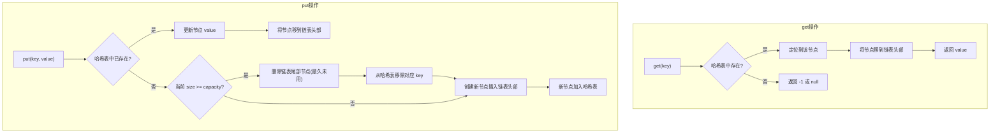

# LRU 最近最少使用 (Least Recently Used)
> 创建日期：2026-06-08
> 难度：⭐⭐
> 前置知识：哈希表、双向链表、时间复杂度分析
> 关联模块：Redis 缓存淘汰、操作系统页面置换、Guava Cache

## ⭐ 面试重点速览

| 考察点 | 重要程度 | 考察频率 | 掌握目标 |
|--------|---------|---------|---------|
| 哈希表+双向链表 O(1) 实现 | 极高 | 极高 | 能徒手写出完整代码 |
| 访问时移动到头部 | 高 | 高 | 能解释为什么移到头部而非尾部 |
| Java LinkedHashMap 实现 LRU | 高 | 高 | 能说出 removeEldestEntry 的用法 |
| Redis 近似 LRU（采样淘汰） | 中 | 高 | 能对比精确LRU和近似LRU的差异 |
| LRU 缓存污染问题 | 中 | 中 | 能说出污染场景及解决方案 |

---

## 一、应用场景 🎯

| 场景 | 说明 |
|------|------|
| **Redis 缓存淘汰** | `maxmemory-policy allkeys-lru`：内存满时淘汰最近最少使用的键 |
| **操作系统页面置换** | 物理内存不足时，优先换出最久未被访问的页面 |
| **浏览器缓存** | 缓存最近访问的网页资源，淘汰长时间未访问的缓存项 |
| **数据库缓冲池** | MySQL Buffer Pool、PostgreSQL Shared Buffers 使用 LRU 变体管理数据页 |
| **Guava Cache** | Google Guava 本地缓存库内置 LRU 策略 |
| **HTTP 反向代理** | Nginx 缓存过期策略可选 LRU |

---

## 二、核心原理 🔬

### 2.1 设计思路

LRU 的核心思想：**如果数据最近被访问过，那么将来被访问的概率也更高；反之，很久没被访问的数据，将来被访问的概率也低**。

采用 **哈希表（HashMap）+ 双向链表（Doubly Linked List）** 实现 O(1) 的 get 和 put 操作：

```
哈希表提供 O(1) 的查找能力 → 直接定位节点
双向链表提供 O(1) 的插入/删除能力 → 轻松调整节点位置
```

### 2.2 数据结构

```
┌───────────────────────────────────────────────┐
│                  哈希表 (HashMap)              │
│  key1 → Node1    key2 → Node2    key3 → Node3 │
└───────┬───────────────┬───────────────┬───────┘
        │               │               │
        ▼               ▼               ▼
┌─────────────┐  ┌─────────────┐  ┌─────────────┐
│ head (哑节点)│◄─┤   Node2     │◄─┤   Node3     │
│             │─►│  (最近使用)  │─►│  (最久未用)  │
└─────────────┘  └─────────────┘  └─────────────┘
                                          │
                                          ▼
                                  ┌─────────────┐
                                  │ tail (哑节点)│
                                  └─────────────┘
```

**关键操作**：
- **get(key)**：从哈希表查找节点，将其移到链表头部（标记为最近使用），返回 value
- **put(key, value)**：若 key 已存在，更新值并移到头部；若 key 不存在，在头部插入新节点。若容量已满，删除链表尾部节点（最久未使用），并从哈希表中移除

### 2.3 Mermaid 流程图



### 2.4 Redis 近似 LRU 实现

Redis 不使用精确的 LRU（维护全局双向链表成本太高），而是采用**采样淘汰（Sampling-based LRU）**：

```
Redis 近似 LRU 算法步骤：
1. 随机采样 N 个 key（默认 N=5，由 maxmemory-samples 配置）
2. 从这 N 个 key 中淘汰掉空闲时间（idle time）最长的那个
3. 如果仍超内存上限，继续执行步骤 1-2
```

**为什么用近似而非精确？**
- 精确 LRU 需要为每个 key 维护访问时间戳和全局有序数据结构，内存开销大
- 采样淘汰 O(N) 近似效果，N 越大越接近精确 LRU，Redis 默认 N=5
- 实际生产环境中近似 LRU 的效果与精确 LRU **非常接近**

---

## 三、趣味解说 🎭

> **冰箱整理——最久没吃的食物被扔掉，最近吃的留在冰箱**

你有一台迷你冰箱，只能放 5 样东西。

每次你拿东西吃（get），吃完就把它放回冰箱最顺手的位置（链表头部）。每次你买了新东西（put），也放在最顺手的位置。当冰箱满了又来新东西时，你把最里面角落里放了最久都没人碰的那个扔掉（链表尾部），再把新的放进来。

**场景模拟**：
- 第一天：你买了牛奶、鸡蛋、面包、火腿、酸奶（冰箱满了）
- 第二天：你喝了牛奶（牛奶被移到最前面），又买了可乐（把最久没碰的酸奶扔掉，可乐放进冰箱）
- 第三天：你吃了鸡蛋（鸡蛋移到最前面），又买了水果（火腿被淘汰）

这就是 LRU —— 永远淘汰最久没被"翻牌子"的那个。但 LRU 有个盲区：如果某天你妈突然给你寄了一大箱特产，你一次性塞进冰箱又都不吃，这些"一次性访问"的数据会把你经常吃的东西全挤出去 —— 这就是**缓存污染**。

---

## 四、代码实现 💻

```java
import java.util.HashMap;
import java.util.Map;

/**
 * LRU 缓存 —— 哈希表 + 双向链表 O(1) 实现
 */
public class LRUCache<K, V> {
    // 双向链表节点
    private static class Node<K, V> {
        K key;
        V value;
        Node<K, V> prev;
        Node<K, V> next;

        Node() {}  // 哑节点构造
        Node(K key, V value) {
            this.key = key;
            this.value = value;
        }
    }

    private final int capacity;
    private final Map<K, Node<K, V>> cache;  // key → 链表节点
    private final Node<K, V> head;           // 哑头节点（最近使用端）
    private final Node<K, V> tail;           // 哑尾节点（最久未使用端）

    public LRUCache(int capacity) {
        this.capacity = capacity;
        this.cache = new HashMap<>();
        this.head = new Node<>();
        this.tail = new Node<>();
        head.next = tail;
        tail.prev = head;
    }

    // ========== 核心方法 ==========

    public V get(K key) {
        Node<K, V> node = cache.get(key);
        if (node == null) {
            return null; // 缓存未命中
        }
        // 访问后移到头部，标记为最近使用
        moveToHead(node);
        return node.value;
    }

    public void put(K key, V value) {
        Node<K, V> node = cache.get(key);
        if (node != null) {
            // key已存在：更新值 + 移到头部
            node.value = value;
            moveToHead(node);
        } else {
            // key不存在：新增
            Node<K, V> newNode = new Node<>(key, value);
            cache.put(key, newNode);
            addToHead(newNode);

            if (cache.size() > capacity) {
                // 超容量 → 淘汰最久未使用的节点（尾部前一个）
                Node<K, V> removed = removeTail();
                cache.remove(removed.key);
            }
        }
    }

    // ========== 链表操作（O(1)） ==========

    /** 将节点移到头部（标记最近使用） */
    private void moveToHead(Node<K, V> node) {
        removeNode(node);
        addToHead(node);
    }

    /** 在头部插入新节点 */
    private void addToHead(Node<K, V> node) {
        node.prev = head;
        node.next = head.next;
        head.next.prev = node;
        head.next = node;
    }

    /** 从链表中摘除节点 */
    private void removeNode(Node<K, V> node) {
        node.prev.next = node.next;
        node.next.prev = node.prev;
    }

    /** 移除尾部节点（最久未使用）并返回 */
    private Node<K, V> removeTail() {
        Node<K, V> node = tail.prev;
        removeNode(node);
        return node;
    }

    public int size() {
        return cache.size();
    }

    // ========== 测试 ==========
    public static void main(String[] args) {
        LRUCache<Integer, String> lru = new LRUCache<>(3);

        lru.put(1, "A");
        lru.put(2, "B");
        lru.put(3, "C");
        System.out.println("get(1): " + lru.get(1)); // A → 1被移到头部
        lru.put(4, "D");       // 满，淘汰最久的(2→B)
        System.out.println("get(2): " + lru.get(2)); // null → 2已被淘汰
        System.out.println("get(3): " + lru.get(3)); // C → 3还在
        System.out.println("size: " + lru.size());   // 3
    }
}
```

### Java LinkedHashMap 简化实现

```java
import java.util.LinkedHashMap;
import java.util.Map;

/**
 * 利用 LinkedHashMap 的 accessOrder + removeEldestEntry 实现 LRU
 * 比手写链表更简洁，面试中可先提这个再展开讲手写版
 */
public class LRUCacheLinkedHashMap<K, V> extends LinkedHashMap<K, V> {
    private final int capacity;

    public LRUCacheLinkedHashMap(int capacity) {
        // accessOrder=true: 按访问顺序排序（get和put都会影响顺序）
        super(capacity, 0.75f, true);
        this.capacity = capacity;
    }

    /**
     * 当 size > capacity 时，自动删除最旧的条目（eldest）
     */
    @Override
    protected boolean removeEldestEntry(Map.Entry<K, V> eldest) {
        return size() > capacity;
    }
}
```

### Redis 近似 LRU 采样淘汰（Java 模拟）

```java
import java.util.*;

/**
 * 模拟 Redis 近似 LRU 采样淘汰逻辑
 */
public class ApproximateLRU {
    // 每个key关联的最后访问时间戳
    private final Map<String, Long> keyAccessTime = new HashMap<>();
    // 实际数据存储
    private final Map<String, String> data = new HashMap<>();
    private final int maxMemory;
    private final int sampleSize;  // maxmemory-samples 采样数（Redis默认5）

    public ApproximateLRU(int maxMemory, int sampleSize) {
        this.maxMemory = maxMemory;
        this.sampleSize = sampleSize;
    }

    public String get(String key) {
        if (!data.containsKey(key)) return null;
        keyAccessTime.put(key, System.nanoTime()); // 更新访问时间
        return data.get(key);
    }

    public void put(String key, String value) {
        if (data.size() >= maxMemory && !data.containsKey(key)) {
            evictBySampling(); // 采样淘汰
        }
        data.put(key, value);
        keyAccessTime.put(key, System.nanoTime());
    }

    /** 随机采样 + 淘汰最久未访问的key */
    private void evictBySampling() {
        List<String> keys = new ArrayList<>(data.keySet());
        Collections.shuffle(keys); // 随机打乱模拟采样

        // 在采样范围内找 idle time 最大的key
        String victim = null;
        long maxIdle = -1;
        int sampleCount = Math.min(keys.size(), sampleSize);
        for (int i = 0; i < sampleCount; i++) {
            String k = keys.get(i);
            long idle = System.nanoTime() - keyAccessTime.getOrDefault(k, 0L);
            if (idle > maxIdle) {
                maxIdle = idle;
                victim = k;
            }
        }

        if (victim != null) {
            data.remove(victim);
            keyAccessTime.remove(victim);
        }
    }
}
```

---

## 五、优缺点 ⚖️

### 优点

| 优点 | 说明 |
|------|------|
| **实现直观** | 基于"最近使用即重要"的朴素假设，逻辑简单 |
| **O(1) 时间复杂度** | 哈希表 + 双向链表的组合保证了 get 和 put 都是 O(1) |
| **自动适应热点** | 无需人工干预，自动根据访问模式调整缓存内容 |
| **通用性强** | 对大多数工作负载（符合时间局部性原理）效果良好 |

### 缺点

| 缺点 | 说明 |
|------|------|
| **缓存污染** | 一次性批量访问（如全表扫描）会将热点数据挤出，造成缓存污染 |
| **不感知访问频率** | 只关心"最近是否访问"，不关心"访问了多少次"。一个刚访问过一次的冷数据和访问了100次的热数据，LRU一视同仁 |
| **空间开销** | 需要维护双向链表指针（每个节点额外8/16字节），但对大多数场景可以接受 |
| **并发性能** | 每次访问都需要移动链表节点，高并发下锁竞争严重（Redis 因此使用近似方案） |

---

## 六、面试高频题 📝

**Q1：LRU 为什么用双向链表而不是单向链表？**

答：删除节点时需要知道前驱节点。如果是单向链表，删除一个节点需要 O(n) 遍历找到它的前驱。双向链表通过 `node.prev` 直接定位前驱，实现 O(1) 删除。此外，将最近访问节点移到头部时双向链表 O(1)，单向链表也需要重新遍历。

**Q2：LRU 缓存污染问题怎么解决？**

答：引入**访问频率**维度的改进方案，如 LFU、LRU-K。LRU-K 记录数据最近 K 次访问的时间间隔，只有访问次数达到 K 次才进入缓存，从而过滤掉一次性访问的"噪声"数据。MySQL Buffer Pool 使用 LRU 变体（midpoint insertion），新页面插入链表中间而非头部。

**Q3：LinkedHashMap 如何实现 LRU？**

答：构造时设置 `accessOrder=true`。此时 get 和 put 操作都会将条目移到链表末尾，使得链表头部是最近最少使用的条目。再重写 `removeEldestEntry` 方法，当 `size() > capacity` 时返回 true，LinkedHashMap 会自动移除链表头部的条目。

**Q4：Redis 为什么不使用精确 LRU？**

答：1) 内存开销：精确 LRU 需要为每个 key 维护双向链表节点指针；2) 性能开销：每次访问都需更新链表顺序；3) 近似 LRU 通过采样淘汰，在采样数达到一定值（如10）后效果非常接近精确 LRU，性能开销却低得多。

---

## 七、常见误区 ❌

| 误区 | 纠正 |
|------|------|
| "LRU 总是 O(1)" | 只有哈希表+双向链表的组合才能做到 O(1)。用数组或单链表实现的 LRU 时间复杂度为 O(n)。 |
| "LinkedHashMap 默认就是 LRU" | LinkedHashMap 默认 `accessOrder=false`（按插入顺序），需要显式设置 `accessOrder=true` 才是 LRU。 |
| "访问时移到尾部" | 不同实现习惯不同。移到头部或尾部只是方向问题，关键是**一端表示最近使用，另一端表示最久未使用**。本文实现移到头部，LinkedHashMap 则是移到尾部。 |
| "LRU 适合所有缓存场景" | LRU 假设"最近访问的将来更可能被访问"，但在周期性批量访问等场景下效果很差，需考虑 LFU 或其变体。 |
| "Redis 的 LRU 和标准 LRU 一样" | Redis 的 LRU 是**近似采样 LRU**，不是精确 LRU。默认采样5个 key，增加采样数可提高精度但增加 CPU 开销。 |