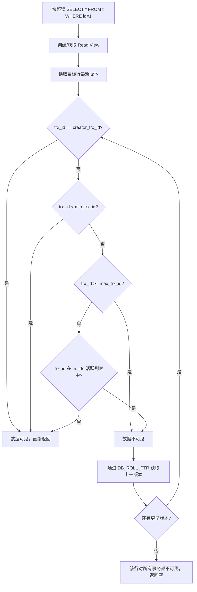

# MVCC 多版本并发控制 (Multi-Version Concurrency Control)
> 创建日期：2026-06-08
> 难度：⭐⭐⭐
> 前置知识：事务ACID、锁机制、Undo Log、隔离级别
> 关联模块：MySQL InnoDB 存储引擎、PostgreSQL

## ⭐ 面试重点速览

| 考察点 | 重要程度 | 考察频率 | 掌握目标 |
|--------|---------|---------|---------|
| Read View 生成规则 (trx_id + up_limit_id + low_limit_id) | 极高 | 极高 | 能画出可见性判断流程图 |
| Undo Log 版本链原理 | 极高 | 极高 | 能手动画出版本链回溯过程 |
| RC vs RR 隔离级别下 Read View 差异 | 高 | 高 | 能说出生成时机和快照数量差异 |
| 快照读 vs 当前读 | 高 | 高 | 能说出各自场景及对应SQL |
| 隐藏列 (DB_TRX_ID / DB_ROLL_PTR / DB_ROW_ID) | 中 | 中 | 能解释三个隐藏列的作用 |
| Purge 线程机制 | 中 | 低 | 能说明清理时机和条件 |

---

## 一、应用场景 🎯

MVCC 是现代关系型数据库实现高并发事务的核心技术，广泛应用于以下场景：

| 场景 | 说明 |
|------|------|
| **高并发读场景** | 读操作不阻塞写操作，写操作不阻塞读操作，读写互不干扰 |
| **电商秒杀** | 大量用户同时查询库存，通过 MVCC 快照读避免锁竞争 |
| **报表查询** | 长时间运行的统计查询不会被日常写入阻塞 |
| **在线 DDL** | 大表结构变更时，其他事务仍可正常读写 |
| **数据库备份** | mysqldump 使用 RR 级别 + MVCC 实现一致性备份 |

MySQL InnoDB、PostgreSQL、Oracle 等主流数据库均基于 MVCC 实现事务隔离，其中 InnoDB 的 MVCC 实现最为经典，是面试考察的重点。

---

## 二、核心原理 🔬

### 2.1 三大隐藏列

InnoDB 每行数据都隐藏了三个系统列：

```
┌─────────────────────────────────────────────────────┐
│  DB_ROW_ID (6B)   │  DB_TRX_ID (6B)  │ DB_ROLL_PTR (7B) │ 其他用户列 │
│  行ID(无主键时生成) │ 最近修改事务ID    │ 指向Undo Log的指针 │            │
└─────────────────────────────────────────────────────┘
```

| 隐藏列 | 大小 | 作用 |
|--------|------|------|
| `DB_TRX_ID` | 6字节 | 记录最后一次修改该行的事务ID |
| `DB_ROLL_PTR` | 7字节 | 回滚指针，指向 Undo Log 中的旧版本记录 |
| `DB_ROW_ID` | 6字节 | 行ID，当表没有显式主键时单调递增生成 |

### 2.2 Read View 可见性判断

Read View 是 MVCC 的核心数据结构，在快照读时创建，包含三个关键字段：

| 字段 | 含义 |
|------|------|
| `m_ids` | 生成 Read View 时，当前系统中**活跃的（未提交的）**读写事务ID列表 |
| `min_trx_id` (up_limit_id) | m_ids 中的最小值 |
| `max_trx_id` (low_limit_id) | 系统下一个即将分配的事务ID（即当前最大事务ID + 1） |
| `creator_trx_id` | 创建该 Read View 的事务ID |

**可见性判断规则**（针对某行记录的 `DB_TRX_ID`）：

```
if (trx_id == creator_trx_id)     → 可见（自己修改的）
else if (trx_id < min_trx_id)     → 可见（修改该行的事务在快照前已提交）
else if (trx_id >= max_trx_id)    → 不可见（修改该行的事务在快照后才开始）
else if (trx_id 在 m_ids 中)      → 不可见（修改该行的事务在快照时还未提交）
else                               → 可见（修改该行的事务在快照时已提交）
```

若当前版本不可见，则通过 `DB_ROLL_PTR` 沿着 Undo Log 版本链向前回溯，找到第一个可见版本。

### 2.3 RC vs RR 隔离级别的核心差异

| 对比维度 | READ COMMITTED (RC) | REPEATABLE READ (RR) |
|----------|---------------------|----------------------|
| Read View 生成时机 | **每次**快照读都生成新的 Read View | **仅第一次**快照读时生成 Read View |
| 效果 | 每次查询看到最新已提交数据 | 整个事务期间看到相同的数据快照 |
| 不可重复读 | 存在 | 不存在（已解决） |
| 幻读 | 存在 | 大部分解决（MVCC + 间隙锁完全解决） |

### 2.4 快照读 vs 当前读

| 类型 | 说明 | 典型SQL |
|------|------|---------|
| **快照读** | 读取 MVCC 历史版本，不加锁 | `SELECT * FROM t WHERE id=1` (普通SELECT) |
| **当前读** | 读取最新已提交版本，加锁 | `SELECT ... FOR UPDATE`、`SELECT ... LOCK IN SHARE MODE`、`UPDATE`、`DELETE`、`INSERT` |

当前读始终读取最新版本，如果发现该行有锁则等待；快照读则通过 MVCC 版本链获取可见版本，不被写锁阻塞。

### 2.5 Mermaid 流程图：版本链回溯



### 2.6 Undo Log 版本链实例

假设有行记录 X，初始值 val="A"，经历以下操作序列：

| 时间 | 事务 | 操作 | 版本链状态 |
|------|------|------|-----------|
| T1 | trx=100 | INSERT X val="A" | [v0: trx=100, val="A"] |
| T2 | trx=200 | UPDATE X set val="B" | [v1: trx=200, val="B"] -> [v0: trx=100, val="A"] |
| T3 | trx=300 | UPDATE X set val="C" | [v2: trx=300, val="C"] -> [v1: trx=200, val="B"] -> [v0: trx=100, val="A"] |

```
最新版本(数据页)             Undo Log链
┌──────────────┐      ┌──────────────┐      ┌──────────────┐
│ DB_TRX_ID=300│ ───> │ DB_TRX_ID=200│ ───> │ DB_TRX_ID=100│ ───> NULL
│ val = "C"    │      │ val = "B"    │      │ val = "A"    │
│ DB_ROLL_PTR  │      │ DB_ROLL_PTR  │      │ DB_ROLL_PTR  │
└──────────────┘      └──────────────┘      └──────────────┘
```

### 2.7 Purge 线程

Purge 线程负责清理不再被任何 Read View 需要的旧版本数据：

- **触发条件**：当 Undo Log 中的某个版本**对所有可能的事务都已不可见**时
- **工作方式**：后台线程定期扫描，删除过期的 Undo Log 记录
- **重要性**：如果不及时清理，Undo Log 会无限膨胀，导致磁盘空间耗尽和查询性能下降
- **风险场景**：存在长时间未提交的事务时，Purge 无法清理该事务启动之后产生的 Undo Log

---

## 三、趣味解说 🎭

> **时光机——每个人看到的是数据在某个时间点的快照**

想象你有一台时光机。每天早上9点你拍了一张街道的全景照片。然后你开始删除街道上的垃圾、修改建筑颜色、新增行人 —— 但你做的所有修改都只影响当前时间点，不会破坏那张9点拍的照片。

现在有三个同事：
- **小王**：在9:05查看街道 —— 他看到的是9:00的快照（因为9:05之前没人提交修改）
- **小李**：在9:30查看街道 —— 他看到9:00的快照还是修改后的版本？这取决于他的"隔离级别配置"。如果是 RR（可重复读），他整个上午都看9:00那张；如果是 RC（读已提交），他每次查看都能看到最新的已提交状态。
- **老赵**：在上午10:00想要修改建筑颜色 —— 他必须看**当前最新状态**（当前读），不能看历史快照，不然可能基于过时数据做修改。

MVCC 就是这台时光机：它保存了每个数据的所有历史版本，每个事务根据自己"穿越的时间点"（Read View）看到对应的版本。写操作创建新版本并把它挂到版本链头部，读操作顺着链条找到自己时间点可见的那个版本。当所有事务都不再需要某个旧版本时，Purge 线程就会像清洁工一样把它清理掉。

---

## 四、代码实现 💻

### 4.1 MVCC 核心数据结构 (Java 模拟)

```java
// InnoDB MVCC 核心数据结构的 Java 模拟实现

import java.util.*;
import java.util.concurrent.ConcurrentHashMap;
import java.util.concurrent.atomic.AtomicLong;
import java.util.concurrent.locks.ReentrantReadWriteLock;

/**
 * 模拟 InnoDB MVCC 的行记录
 */
class MVCCRow {
    // ===== InnoDB 三大隐藏列 =====
    private long dbRowId;       // DB_ROW_ID: 行唯一标识
    private long dbTrxId;       // DB_TRX_ID: 最后一次修改该行的事务ID
    private long dbRollPtr;     // DB_ROLL_PTR: 指向上一版本的指针(用记录ID模拟)

    // ===== 用户数据列 =====
    private Map<String, String> columns;  // 列名 -> 列值

    // ===== 锁信息 =====
    private Long exclusiveLockTrxId;  // 当前持有排他锁的事务ID

    public MVCCRow(long rowId, long trxId, long rollPtr, Map<String, String> cols) {
        this.dbRowId = rowId;
        this.dbTrxId = trxId;
        this.dbRollPtr = rollPtr;
        this.columns = new HashMap<>(cols);
    }

    // getters and setters...
    public long getDbTrxId() { return dbTrxId; }
    public long getDbRollPtr() { return dbRollPtr; }
    public long getDbRowId() { return dbRowId; }
    public Map<String, String> getColumns() { return columns; }
    public void setDbTrxId(long trxId) { this.dbTrxId = trxId; }
    public void setDbRollPtr(long rollPtr) { this.dbRollPtr = rollPtr; }
    public void setColumns(Map<String, String> cols) { this.columns = cols; }
    public Long getExclusiveLockTrxId() { return exclusiveLockTrxId; }
    public void setExclusiveLockTrxId(Long txId) { this.exclusiveLockTrxId = txId; }
    public MVCCRow deepCopy() {
        return new MVCCRow(dbRowId, dbTrxId, dbRollPtr, new HashMap<>(columns));
    }
}

/**
 * Read View —— 快照读的"时光机"
 */
class ReadView {
    private final long creatorTrxId;    // 创建此快照的事务ID
    private final Set<Long> mIds;       // 活跃事务ID集合
    private final long minTrxId;        // mIds中的最小值 (up_limit_id)
    private final long maxTrxId;        // 下一个分配的事务ID (low_limit_id)

    public ReadView(long creatorTrxId, Set<Long> activeTrxIds, long nextTrxId) {
        this.creatorTrxId = creatorTrxId;
        this.mIds = new HashSet<>(activeTrxIds);
        // activeTrxIds为空时，minTrxId取maxTrxId的值
        this.minTrxId = activeTrxIds.isEmpty() ? nextTrxId 
                        : activeTrxIds.stream().min(Long::compare).orElse(nextTrxId);
        this.maxTrxId = nextTrxId;
    }

    /**
     * 判断某行版本的 trx_id 是否对当前快照可见（核心算法！）
     * @param rowTrxId 行记录的 DB_TRX_ID
     * @return true=可见，false=需要回溯到上一版本
     */
    public boolean isVisible(long rowTrxId) {
        // 规则1: 自己修改的，可见
        if (rowTrxId == creatorTrxId) return true;
        // 规则2: 修改事务在快照前已提交，可见
        if (rowTrxId < minTrxId) return true;
        // 规则3: 修改事务在快照后才开始，不可见
        if (rowTrxId >= maxTrxId) return false;
        // 规则4: 修改事务在快照时还活跃(未提交)，不可见
        if (mIds.contains(rowTrxId)) return false;
        // 规则5: 修改事务在快照时已提交，可见
        return true;
    }

    public long getCreatorTrxId() { return creatorTrxId; }
}

/**
 * MVCC 引擎 —— 模拟 InnoDB 的 MVCC 实现
 */
class MVCCEngine {
    // 全局事务ID生成器
    private final AtomicLong trxIdGenerator = new AtomicLong(100);
    // Undo Log: recordId -> MVCCRow (历史版本链，通过 dbRollPtr 串联)
    private final Map<Long, MVCCRow> undoLogs = new ConcurrentHashMap<>();
    // 当前数据页（最新版本）
    private final Map<Long, MVCCRow> dataPage = new ConcurrentHashMap<>();
    // 活跃事务集合
    private final Set<Long> activeTrxIds = ConcurrentHashMap.newKeySet();
    // 行锁
    private final Map<Long, ReentrantReadWriteLock> rowLocks = new ConcurrentHashMap<>();
    // UndoLog计数器
    private final AtomicLong undoLogIdGen = new AtomicLong(1000);

    /**
     * 开启事务
     */
    public long beginTransaction() {
        long trxId = trxIdGenerator.incrementAndGet();
        activeTrxIds.add(trxId);
        return trxId;
    }

    /**
     * 提交事务
     */
    public void commitTransaction(long trxId) {
        activeTrxIds.remove(trxId);
    }

    /**
     * 快照读（普通SELECT） —— RC模式下每次生成新ReadView, RR模式下复用首次的
     */
    public MVCCRow snapshotRead(long rowId, long trxId, ReadView readView) {
        MVCCRow current = dataPage.get(rowId);
        if (current == null) return null;

        // 沿着版本链回溯，找到第一个可见版本
        MVCCRow cursor = current;
        while (cursor != null) {
            if (readView.isVisible(cursor.getDbTrxId())) {
                return cursor;
            }
            // 不可见 → 通过 DB_ROLL_PTR 回溯到上一版本
            long rollPtr = cursor.getDbRollPtr();
            cursor = rollPtr == 0 ? null : undoLogs.get(rollPtr);
        }
        return null; // 所有版本都不可见
    }

    /**
     * 创建 Read View (RR模式：首次快照读时创建，整个事务复用)
     */
    public ReadView createReadView(long trxId) {
        return new ReadView(trxId, new HashSet<>(activeTrxIds),
                            trxIdGenerator.get() + 1);
    }

    /**
     * 当前读（SELECT ... FOR UPDATE）—— 始终读最新已提交版本
     */
    public MVCCRow currentRead(long rowId, long trxId) {
        ReentrantReadWriteLock lock = rowLocks.computeIfAbsent(
            rowId, k -> new ReentrantReadWriteLock());
        lock.readLock().lock();
        try {
            return dataPage.get(rowId);
        } finally {
            lock.readLock().unlock();
        }
    }

    /**
     * 更新操作 —— 创建新版本，旧版本放入Undo Log
     */
    public boolean update(long rowId, long trxId, Map<String, String> newCols) {
        ReentrantReadWriteLock lock = rowLocks.computeIfAbsent(
            rowId, k -> new ReentrantReadWriteLock());
        lock.writeLock().lock();
        try {
            MVCCRow oldRow = dataPage.get(rowId);
            if (oldRow == null) return false;

            // 1. 旧版本存入 Undo Log（写时复制）
            long undoId = undoLogIdGen.incrementAndGet();
            MVCCRow undoEntry = oldRow.deepCopy();
            undoLogs.put(undoId, undoEntry);

            // 2. 更新数据页上的最新版本
            oldRow.setDbTrxId(trxId);
            oldRow.setDbRollPtr(undoId); // 回滚指针指向刚刚存入的Undo Log版本
            oldRow.setColumns(new HashMap<>(newCols));

            return true;
        } finally {
            lock.writeLock().unlock();
        }
    }

    /**
     * Purge 线程 —— 清理过期 Undo Log
     * 判断标准：从此 Undo Log 版本的 trx_id 开始，若对所有活跃 ReadView 都不可见，则可清理
     */
    public void purge(Set<ReadView> allActiveReadViews) {
        Iterator<Map.Entry<Long, MVCCRow>> iter = undoLogs.entrySet().iterator();
        while (iter.hasNext()) {
            Map.Entry<Long, MVCCRow> entry = iter.next();
            MVCCRow undoRow = entry.getValue();
            // 检查是否对所有活跃快照都不可见
            boolean allInvisible = allActiveReadViews.stream()
                .noneMatch(rv -> rv.isVisible(undoRow.getDbTrxId()));
            if (allInvisible) {
                iter.remove(); // 安全删除
            }
        }
    }
}
```

---

## 五、优缺点 ⚖️

### 优点

| 优点 | 说明 |
|------|------|
| **读写不互斥** | 读操作为快照读，无需加锁；写操作只阻塞写操作，不影响读 |
| **高并发吞吐** | 相比基于锁的并发控制，MVCC 极大提升了并发读性能 |
| **一致性快照** | RR 级别下整个事务看到一致的快照，无需担心数据中途变化 |
| **回滚高效** | 通过 Undo Log 版本链可快速回滚到任一历史版本 |
| **不依赖行锁实现读一致性** | 即使行被加了排他锁，快照读仍能从版本链中读取可见版本 |

### 缺点

| 缺点 | 说明 |
|------|------|
| **存储开销** | Undo Log 占用额外磁盘空间，长事务可能导致 Undo Log 膨胀 |
| **Purge 延迟** | 历史版本不能立即清理，需要等所有可能引用它的事务结束 |
| **版本链过长** | 频繁更新产生长版本链，快照读回溯成本增加 |
| **实现复杂** | 回滚段管理、Purge 机制、Read View 判断逻辑都比较复杂 |
| **并非替代锁** | MVCC 只解决读-写冲突，写-写冲突仍需通过行锁解决 |

---

## 六、面试高频题 📝

**Q1：RC 和 RR 在 MVCC 实现上的核心区别是什么？**

答：RC 级别下，**每次**执行快照读（普通 SELECT）都会生成一个新的 Read View，因此每次查询都能看到其他事务最新提交的结果，存在不可重复读问题。RR 级别下，**仅第一次**快照读生成 Read View，后续所有快照读复用同一个 Read View，因此整个事务期间看到的数据快照一致，避免了不可重复读。

**Q2：MVCC 能完全解决幻读吗？**

答：MVCC 的快照读可以解决 RR 级别下的幻读问题。但当前读（SELECT ... FOR UPDATE）仍然存在幻读风险。InnoDB 通过**间隙锁（Gap Lock）+ 临键锁（Next-Key Lock）**来彻底解决当前读的幻读问题。

**Q3：为什么长事务对 MVCC 有影响？**

答：长事务持有旧的 Read View 不放，导致：1) Purge 线程无法清理该 Read View 创建后产生的 Undo Log，版本链越来越长，查询性能下降；2) 磁盘空间持续增长。此外，长事务会阻止某些 DDL 操作。

**Q4：快照读一定不加锁吗？**

答：不一定。在**串行化（SERIALIZABLE）**隔离级别下，普通 SELECT 会被隐式转换为 `SELECT ... LOCK IN SHARE MODE`，即自动加共享锁，变为当前读。

**Q5：MVCC 和乐观锁/悲观锁是什么关系？**

答：它们解决不同层面的问题。MVCC 解决的是**读-写**并发冲突（读不阻塞写）；悲观锁（行锁、表锁）解决的是**写-写**并发冲突；乐观锁（版本号/CAS）是应用层面的并发控制策略。在实际系统中，MVCC 和行锁通常配合使用，例如 InnoDB 的写操作既要走 MVCC（生成新版本），也要获取行锁（防止并发写）。

---

## 七、常见误区 ❌

| 误区 | 纠正 |
|------|------|
| "MVCC 替代了所有锁" | MVCC 只替代了读操作的锁。写操作仍然需要获取行锁来防止并发的写-写冲突。 |
| "MVCC 下不需要关心事务隔离级别" | MVCC 是实现隔离级别的**工具**而非替代品。不同的 Read View 生成策略对应不同的隔离级别。 |
| "Undo Log 和 Redo Log 是同一回事" | Undo Log 用于事务回滚和 MVCC 版本回溯（逻辑日志）；Redo Log 用于崩溃恢复（物理日志），两者作用完全不同。 |
| "Read View 在事务开启时创建" | Read View 在**第一次快照读时**创建，而非事务 BEGIN 时。这意味着 BEGIN 之后、第一次 SELECT 之前提交的事务产生的修改，可能对当前事务可见（取决于隔离级别）。 |
| "当前读也走 MVCC 版本链" | 当前读始终读取数据页上的最新版本，不走版本链回溯。如果最新版本被其他事务锁定，则等待锁释放。 |
| "Purge 线程是实时的" | Purge 是**异步后台线程**，并非同步执行。MySQL 5.6 之后支持多 Purge 线程并行清理。 |
| "只要提交事务，Undo Log 就立即清除了" | 事务提交后，其产生的 Undo Log 可能仍被其他事务的 Read View 引用，需等所有引用结束才能被 Purge 清理。 |