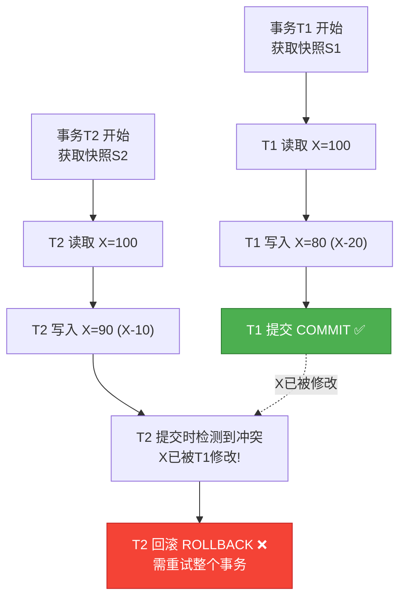
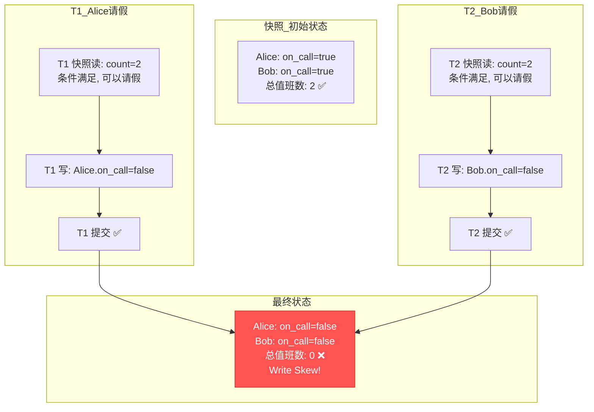

# 快照隔离 SI (Snapshot Isolation)
> 创建日期：2026-06-08
> 难度：⭐⭐⭐
> 前置知识：MVCC、事务隔离级别、2PL、可串行化理论
> 关联模块：PostgreSQL 可重复读隔离、Oracle Serializable、CockroachDB

## ⭐ 面试重点速览

| 考察点 | 重要程度 | 考察频率 | 掌握目标 |
|--------|---------|---------|---------|
| 快照隔离的定义（事务看到一致快照） | 极高 | 极高 | 能清晰描述快照的"时间点"语义 |
| First-Committer-Wins 规则 | 极高 | 极高 | 能解释为什么SI不保证串行化 |
| Write Skew（写偏斜）异常 | 极高 | 极高 | 能手动画出Write Skew场景并分析 |
| Read-only vs Read-write 事务处理差异 | 高 | 高 | 能说出两种事务的快照来源 |
| SSI（可串行化快照隔离）原理 | 中 | 高 | 能说明SIREAD锁和rw依赖检测 |
| PostgreSQL REPEATABLE READ 的 SI 实现 | 中 | 中 | 能说出与标准SI的差异 |
| SI vs 2PL 的隔离保证对比 | 中 | 中 | 能画出异常对比矩阵 |

---

## 一、应用场景 🎯

快照隔离是现代数据库实现高并发与强一致性的关键折中方案，在性能和隔离性之间取得了精妙的平衡。

| 场景 | 说明 |
|------|------|
| **PostgreSQL 默认隔离** | PG 的 REPEATABLE READ 级别实质上就是快照隔离（非标准SQL RR） |
| **Oracle SERIALIZABLE** | Oracle 的"串行化"实际实现的是快照隔离（存在Write Skew可能） |
| **CockroachDB 事务** | 分布式数据库 CockroachDB 的默认隔离级别也是 SI |
| **报表生成** | 需要读取一致性快照进行统计，不能被中途的写入干扰 |
| **数据迁移/校验** | 全表扫描时希望看到某个时间点的一致性数据 |
| **在线分析** | 分析型查询需要长时间读取，快照隔离避免被写锁阻塞 |

**与标准SQL隔离级别的映射**：

| 数据库 | 级别名称 | 实际实现 |
|--------|---------|---------|
| PostgreSQL | REPEATABLE READ | 快照隔离 (SI) |
| PostgreSQL | SERIALIZABLE | 可串行化快照隔离 (SSI) |
| Oracle | SERIALIZABLE | 快照隔离 (SI) |
| MySQL InnoDB | REPEATABLE READ | MVCC + 间隙锁 (比标准SI强) |
| SQL Server | SNAPSHOT | 快照隔离 (SI) |

---

## 二、核心原理 🔬

### 2.1 快照隔离的定义

快照隔离的核心思想：**每个事务在开始（或第一次读取）时获取数据库的一份一致性快照，整个事务期间基于这份快照进行读写操作**。

```
事务T1在时刻t1开始 → 获取t1时刻的快照S1
事务T2在时刻t2开始 → 获取t2时刻的快照S2 (t2 > t1)
```

- **读操作**：始终从自己的快照中读取，看不到其他事务在快照之后提交的修改
- **写操作**：基于快照中的值进行修改，在提交时进行检查

### 2.2 First-Committer-Wins 规则

快照隔离的核心冲突检测规则：

```
如果两个并发事务T1和T2修改了同一行数据：
  先提交的事务成功（First Committer Wins）
  后提交的事务被回滚（必须重试）
```



### 2.3 Write Skew（写偏斜）—— 快照隔离的致命弱点

Write Skew 是快照隔离下最经典的并发异常，也是面试高频考点。

**场景**：医院值班制度，要求**任何时候至少有一名医生值班**。

```
初始状态：Alice 和 Bob 都在值班（on_call = true）

事务T1 (Alice想请假):              事务T2 (Bob想请假):
1. SELECT COUNT(*) FROM doctors      1. SELECT COUNT(*) FROM doctors
   WHERE on_call = true;                 WHERE on_call = true;
   结果: 2 (Alice和Bob)                 结果: 2 (Alice和Bob)
   
2. if (count >= 2) {                  2. if (count >= 2) {
     UPDATE doctors                       UPDATE doctors
     SET on_call = false                  SET on_call = false
     WHERE name = 'Alice';                WHERE name = 'Bob';
   }                                   }

T1提交 → 成功！                       T2提交 → 成功！
```

**结果**：两个事务都提交成功，但最终 Alice 和 Bob 都被设为 off_call —— **没有人值班了！** 违反了业务规则。

**根因分析**：T1 和 T2 修改的是**不同的行**（不触发 First-Committer-Wins），但它们的 WHERE 条件检查的是**相同的行集合**。快照隔离无法检测到这种跨行的约束冲突。



### 2.4 Read-only vs Read-write 事务

在快照隔离中，事务分为两类：

| 事务类型 | 快照来源 | 提交行为 | 性能 |
|---------|---------|---------|------|
| **Read-only 事务** | 事务开始时的快照 | 直接提交，无需冲突检测 | 极高（无锁、无等待） |
| **Read-write 事务** | 事务开始时的快照 | 提交时检测写-写冲突 | 高（只有写冲突时才回滚） |

**关键优化**：只读事务永不阻塞、永不被回滚，这是快照隔离相比2PL的巨大优势。

### 2.5 SSI（可串行化快照隔离）

为了解决 Write Skew 问题，PostgreSQL 9.1+ 引入了 SSI，在快照隔离的基础上增加了**依赖跟踪**来检测串行化冲突。

**SSI 核心机制 —— SIREAD 锁**：

```
在快照隔离基础上，额外记录：
  - 事务T读取了哪些数据（SIREAD锁）
  - 是否有其他事务修改了T读取过的数据（rw依赖）
  
如果检测到rw依赖形成环 → 回滚其中一个事务
```

| 依赖类型 | 检测方式 | 处理策略 |
|---------|---------|---------|
| **wr依赖** (写-读) | T1写, T2读T1的写入 | 快照隔离天然处理（MVCC） |
| **ww依赖** (写-写) | T1写, T2写同一行 | First-Committer-Wins |
| **rw依赖** (读-写) | T1读, T2写T1读取过的行 | **SSI新增**：检测rw反依赖环 |

**SSI 检测 Write Skew**：

```
T1: 读取了 Alice 和 Bob 的行 → SIREAD锁: {Alice, Bob}
T2: 读取了 Alice 和 Bob 的行 → SIREAD锁: {Alice, Bob}
T1: 修改了 Alice → T2的SIREAD 被破坏 → rw依赖: T1→T2
T2: 修改了 Bob → T1的SIREAD 被破坏 → rw依赖: T2→T1
检测到环 T1→T2→T1 → 回滚其中一个！
```

### 2.6 PostgreSQL 快照隔离实现

PostgreSQL 的快照隔离基于 MVCC + 事务快照（xmin/xmax/xip_list）：

```sql
-- 每个事务的快照由三个值定义
xmin  = 最早仍然活跃的事务ID（小于此ID的事务都已提交）
xmax  = 下一个未分配的事务ID（大于等于此ID的事务尚未开始）
xip_list = 当前活跃事务ID列表（这些事务的修改不可见）
```

**可见性判断**：

```
某行版本的创建事务ID为 xid：
  if (xid < xmin)           → 可见（在快照之前已提交）
  else if (xid >= xmax)     → 不可见（在快照之后才开始）
  else if (xid in xip_list) → 不可见（在快照时尚未提交）
  else                      → 可见（在快照时已提交）
```

**PostgreSQL 的独特之处**：
- 使用**事务ID回卷**机制（32位事务ID，约40亿后回卷）
- 没有 undo log，旧版本直接存储在堆表中（膨胀时需要 VACUUM 清理）
- SSI 通过 `predicate` 锁实现，而非传统的锁表

---

## 三、趣味解说 🎭

> **拍照留念——拍照那一刻所有人看到的场景都定格了**

你去参加一个大型聚会，人很多，热闹非凡。你拿出相机拍了一张全景照片（获取快照）。从这一刻起：

- 你看到的所有人、所有场景都定格在**按下快门的那一刻**
- 即使后来有人换了衣服、有人离场、有人加入——你在照片里看到的永远是那个瞬间
- 你可以在照片上标记某个人（修改数据），但你改的是**你自己的副本**

现在如果两个人同时想给同一个人换衣服：
- 你先保存了你的修改（提交），成功
- 他后来也想保存，但系统告诉他："你要改的那个人已经换了衣服，你必须重新拍照（重试事务）" —— **First-Committer-Wins**

但问题来了（Write Skew）：

张三和李四各拍了一张照片。照片里都显示"健身房有两个人"。张三说："人够了，我可以走了"，于是他在自己的照片里把自己标记为"已离开"。李四也看到照片里有两个人，也把自己标记为"已离开"。两个人都保存了——结果健身房**没人了**！

这就是 Write Skew：两个人各自修改了不同的人，但他们的判断都基于同一个已经过时的"有两个人"的假设。SSI 就像一个聪明的管家，他注意到"张三离开前看了李四的状态，李四离开前也看了张三的状态，这两个人互相依赖对方的旧状态做决定"——于是他阻止了其中一个人的修改。

---

## 四、代码实现 💻

### 4.1 快照隔离核心引擎 (Java 模拟)

```java
import java.util.*;
import java.util.concurrent.ConcurrentHashMap;
import java.util.concurrent.atomic.AtomicLong;

/**
 * 快照隔离 (Snapshot Isolation) 核心引擎的 Java 模拟实现
 * 支持：MVCC快照、First-Committer-Wins、Read-only事务优化
 */
public class SnapshotIsolationEngine {
    // 事务ID生成器
    private final AtomicLong trxIdGen = new AtomicLong(100);
    // 活跃事务集合
    private final Set<Long> activeTrxIds = ConcurrentHashMap.newKeySet();
    // 数据版本链: 行ID → 版本列表（按时间从新到旧）
    private final Map<String, List<RowVersion>> versions = new ConcurrentHashMap<>();
    // 事务快照缓存: 事务ID → 快照对象
    private final Map<Long, Snapshot> snapshots = new ConcurrentHashMap<>();

    /**
     * 数据行版本（对应 MVCC 中 Undo Log 的一个版本）
     */
    static class RowVersion {
        final long trxId;          // 创建该版本的事务ID
        final Map<String, String> data;  // 列数据
        final long commitTime;     // 提交时间戳

        RowVersion(long trxId, Map<String, String> data, long commitTime) {
            this.trxId = trxId;
            this.data = new HashMap<>(data);
            this.commitTime = commitTime;
        }
    }

    /**
     * 事务快照 —— 定义了该事务"看到的世界"
     */
    static class Snapshot {
        final long minTrxId;        // 快照时已提交的最大事务ID
        final Set<Long> activeTrxIds; // 快照时活跃的事务ID集合
        final long snapshotTime;    // 快照生成时间

        Snapshot(long minTrxId, Set<Long> activeTrxIds, long snapshotTime) {
            this.minTrxId = minTrxId;
            this.activeTrxIds = new HashSet<>(activeTrxIds);
            this.snapshotTime = snapshotTime;
        }

        /**
         * 判断某个版本是否对当前快照可见
         */
        boolean isVisible(long versionTrxId) {
            // 规则1：版本在快照生成前已提交 → 可见
            if (versionTrxId <= minTrxId && !activeTrxIds.contains(versionTrxId)) {
                return true;
            }
            // 规则2：版本在快照生成时还未提交 → 不可见
            return false;
        }
    }

    /**
     * 事务的写集合（提交时用于冲突检测）
     */
    static class WriteSet {
        final Map<String, Map<String, String>> writes = new HashMap<>();  // 行ID → 新数据
        final Set<String> readSet = new HashSet<>();  // 读取过的行ID（用于SSI）
    }

    // 每个事务的写集合
    private final Map<Long, WriteSet> writeSets = new ConcurrentHashMap<>();

    // ========== 事务生命周期 ==========

    /** 开始事务，生成快照 */
    public long beginTransaction() {
        long trxId = trxIdGen.incrementAndGet();
        activeTrxIds.add(trxId);

        // 创建快照：记录当前时刻的数据库状态
        Snapshot snap = new Snapshot(
            trxIdGen.get() - 1,          // minTrxId
            new HashSet<>(activeTrxIds), // 当前活跃事务
            System.nanoTime()
        );
        snapshots.put(trxId, snap);
        writeSets.put(trxId, new WriteSet());
        return trxId;
    }

    /** 标记事务为只读（优化：跳过冲突检测） */
    public void markReadOnly(long trxId) {
        // 只读事务的快照已足够，无需写集合
        writeSets.remove(trxId);
    }

    // ========== 读取操作（快照读） ==========

    /**
     * 基于事务快照读取数据
     * @param trxId 事务ID
     * @param rowId 行ID
     * @return 该行在快照中的可见版本数据
     */
    public Map<String, String> read(long trxId, String rowId) {
        Snapshot snap = snapshots.get(trxId);
        List<RowVersion> versionList = versions.get(rowId);

        if (versionList == null) return null;

        // 沿着版本链找到第一个在快照中可见的版本
        for (RowVersion ver : versionList) {
            if (snap.isVisible(ver.trxId)) {
                // 记录读取（用于SSI的rw依赖检测）
                WriteSet ws = writeSets.get(trxId);
                if (ws != null) {
                    ws.readSet.add(rowId);
                }
                return new HashMap<>(ver.data);
            }
        }
        return null; // 所有版本都不可见 → 该行在快照时不存在
    }

    // ========== 写入操作 ==========

    /**
     * 写入数据（暂存到写集合，提交时才真正写入）
     */
    public void write(long trxId, String rowId, Map<String, String> newData) {
        WriteSet ws = writeSets.get(trxId);
        if (ws == null) {
            throw new IllegalStateException("只读事务不能写入");
        }
        ws.writes.put(rowId, new HashMap<>(newData));
    }

    // ========== 提交（First-Committer-Wins） ==========

    /**
     * 提交事务 —— First-Committer-Wins 冲突检测
     * @return true=提交成功, false=冲突导致回滚
     */
    public synchronized boolean commit(long trxId) {
        WriteSet ws = writeSets.get(trxId);
        if (ws == null || ws.writes.isEmpty()) {
            // 只读事务或无写入：直接提交
            cleanup(trxId);
            return true;
        }

        // First-Committer-Wins：检查每个要修改的行，是否有并发事务先提交了
        for (String rowId : ws.writes.keySet()) {
            List<RowVersion> versionList = versions.get(rowId);
            if (versionList != null && !versionList.isEmpty()) {
                RowVersion latest = versionList.get(0);  // 最新版本
                Snapshot snap = snapshots.get(trxId);

                // 检查：最新版本是否在快照之后被其他事务提交的
                if (!snap.isVisible(latest.trxId) && latest.trxId != trxId) {
                    // 冲突！有并发事务在我们快照后修改了这行
                    rollback(trxId);
                    return false;
                }
            }
        }

        // 无冲突 → 应用所有写入
        long commitTime = System.nanoTime();
        for (Map.Entry<String, Map<String, String>> entry : ws.writes.entrySet()) {
            String rowId = entry.getKey();
            RowVersion newVersion = new RowVersion(trxId, entry.getValue(), commitTime);

            // 将新版本插入版本链头部
            versions.computeIfAbsent(rowId, k -> new ArrayList<>()).add(0, newVersion);
        }

        cleanup(trxId);
        return true;
    }

    /** 回滚事务 */
    public void rollback(long trxId) {
        cleanup(trxId);
    }

    private void cleanup(long trxId) {
        activeTrxIds.remove(trxId);
        snapshots.remove(trxId);
        writeSets.remove(trxId);
    }
}
```

### 4.2 SSI 扩展 —— rw依赖检测

```java
import java.util.*;

/**
 * 可串行化快照隔离 (SSI) 扩展
 * 在SI基础上增加SIREAD锁和rw依赖环检测
 */
public class SSIEngine extends SnapshotIsolationEngine {
    // SIREAD锁: 记录每个事务读取了哪些行
    // 结构: 行ID → {读取该行的事务ID集合}
    private final Map<String, Set<Long>> siReadLocks = new HashMap<>();
    // rw依赖图: 事务T1读取了行R，事务T2修改了行R → 依赖边: T1→T2
    private final Map<Long, Set<Long>> rwDependencyGraph = new HashMap<>();

    @Override
    public Map<String, String> read(long trxId, String rowId) {
        // 记录SIREAD锁（该事务读取了这行）
        siReadLocks.computeIfAbsent(rowId, k -> new HashSet<>()).add(trxId);
        return super.read(trxId, rowId);
    }

    /**
     * SSI提交：在First-Committer-Wins基础上增加rw依赖环检测
     */
    @Override
    public synchronized boolean commit(long trxId) {
        // 先执行标准SI的冲突检测
        WriteSet ws = writeSets.get(trxId);
        if (ws == null || ws.writes.isEmpty()) {
            cleanup(trxId);
            return true;
        }

        // 检测rw依赖：本事务修改了哪些行，这些行被哪些并发事务读取过
        for (String rowId : ws.writes.keySet()) {
            Set<Long> readers = siReadLocks.getOrDefault(rowId, Collections.emptySet());
            for (Long reader : readers) {
                if (reader != trxId && activeTrxIds.contains(reader)) {
                    // 并发事务reader读取了rowId，本事务修改了rowId → rw依赖
                    addRwEdge(trxId, reader);
                }
            }
        }

        // 检测rw依赖环
        if (detectRwCycle()) {
            rollback(trxId);
            return false;
        }

        // 执行标准SI提交
        boolean result = super.commit(trxId);
        // 清理本事务的SIREAD锁
        for (Set<Long> readers : siReadLocks.values()) {
            readers.remove(trxId);
        }
        rwDependencyGraph.remove(trxId);
        return result;
    }

    /** 添加rw依赖边 */
    private void addRwEdge(long from, long to) {
        rwDependencyGraph.computeIfAbsent(from, k -> new HashSet<>()).add(to);
    }

    /** 检测rw依赖图中是否存在环 */
    private boolean detectRwCycle() {
        Map<Long, Integer> color = new HashMap<>();
        for (Long node : rwDependencyGraph.keySet()) {
            color.put(node, 0);  // 0=白色（未访问）
        }
        for (Long node : rwDependencyGraph.keySet()) {
            if (color.get(node) == 0 && hasCycle(node, color)) {
                return true;
            }
        }
        return false;
    }

    private boolean hasCycle(Long node, Map<Long, Integer> color) {
        color.put(node, 1);  // 灰色（正在访问）
        for (Long neighbor : rwDependencyGraph.getOrDefault(node, Collections.emptySet())) {
            int c = color.getOrDefault(neighbor, 0);
            if (c == 1) return true;  // 发现环
            if (c == 0 && hasCycle(neighbor, color)) return true;
        }
        color.put(node, 2);  // 黑色（已完成）
        return false;
    }
}
```

### 4.3 Write Skew 场景模拟

```java
/**
 * 模拟 Write Skew 场景：医院值班约束
 * 展示SI无法检测Write Skew，SSI可以检测
 */
public class WriteSkewDemo {
    public static void main(String[] args) {
        System.out.println("=== 快照隔离 (SI) 下的 Write Skew ===");
        demonstrateWriteSkew(false);

        System.out.println("\n=== 可串行化快照隔离 (SSI) 下的 Write Skew ===");
        demonstrateWriteSkew(true);
    }

    static void demonstrateWriteSkew(boolean useSSI) {
        // 初始化数据：Alice和Bob都在值班
        Map<String, String> aliceInit = new HashMap<>();
        aliceInit.put("name", "Alice");
        aliceInit.put("on_call", "true");

        Map<String, String> bobInit = new HashMap<>();
        bobInit.put("name", "Bob");
        bobInit.put("on_call", "true");

        SnapshotIsolationEngine engine = useSSI ? new SSIEngine() : new SnapshotIsolationEngine();

        // 模拟初始化（直接写入版本链）
        // 此处简化：引擎内部已通过commit写入

        long t1 = engine.beginTransaction();  // Alice想请假
        long t2 = engine.beginTransaction();  // Bob想请假

        // 两人都先查询值班人数
        Map<String, String> aliceView = engine.read(t1, "Alice");
        Map<String, String> bobView = engine.read(t2, "Bob");

        // 两人都看到值班人数满足条件，各自请假
        Map<String, String> aliceUpdate = new HashMap<>();
        aliceUpdate.put("name", "Alice");
        aliceUpdate.put("on_call", "false");
        engine.write(t1, "Alice", aliceUpdate);

        Map<String, String> bobUpdate = new HashMap<>();
        bobUpdate.put("name", "Bob");
        bobUpdate.put("on_call", "false");
        engine.write(t2, "Bob", bobUpdate);

        boolean t1Result = engine.commit(t1);
        boolean t2Result = engine.commit(t2);

        System.out.println("T1 (Alice请假) 提交: " + (t1Result ? "成功" : "回滚"));
        System.out.println("T2 (Bob请假) 提交: " + (t2Result ? "成功" : "回滚"));

        if (t1Result && t2Result) {
            System.out.println("警告: 两个事务都成功了 → Write Skew 发生！");
        } else {
            System.out.println("检测到Write Skew，其中一个事务被回滚 → 安全！");
        }
    }
}
```

---

## 五、优缺点 ⚖️

### 优点

| 优点 | 说明 |
|------|------|
| **读写不互斥** | 读操作基于快照，从不阻塞写操作；写操作也不阻塞读（除非写同一行） |
| **只读事务零开销** | 只读事务不需要锁、不需要冲突检测，性能极高 |
| **无死锁（读操作）** | 读操作不获取锁，从根本上避免了读-写死锁 |
| **实现相对简单** | 基于MVCC的快照语义直观，相比2PL的状态管理更简单 |
| **高并发吞吐** | 适合读多写少的场景，并发度远超2PL |

### 缺点

| 缺点 | 说明 |
|------|------|
| **Write Skew** | 无法检测跨行的约束冲突，可能导致数据不一致 |
| **写冲突导致回滚** | 并发写同一行时，First-Committer-Wins让后提交的事务回滚，需重试 |
| **快照空间开销** | 需要维护多版本数据，旧版本清理不及时会导致存储膨胀 |
| **长事务问题** | 长事务持有的旧快照阻止版本清理（类似MVCC的Purge问题） |
| **不保证串行化** | 基础SI的隔离级别弱于SERIALIZABLE，需要SSI才能达到 |

---

## 六、面试高频题 📝

**Q1：快照隔离和可重复读（RR）有什么区别？**

答：标准的SQL RR 只保证同一事务中多次读取同一行结果相同，但不阻止其他事务插入新行（幻读）。快照隔离则更强：整个事务看到的是**数据库在某个时间点的完整快照**，不仅可重复读同一行，还能防止大部分幻读（因为快照包含了所有行的状态）。但SI仍存在 Write Skew 异常，而 PostgreSQL 的 RR 实质上就是 SI。

**Q2：什么是 Write Skew？请举例说明。**

答：Write Skew 是快照隔离下的一种并发异常。当两个并发事务各自读取了重叠的数据集，基于读取结果做出决策后修改了**不同的行**，导致最终状态违反业务约束。典型例子：医院值班制度要求至少有一人值班，两人同时查询发现有人在值班后各自请假，结果两人都请假成功，无人值班。根因是约束条件涉及多行，而 SI 的冲突检测只关注单行。

**Q3：First-Committer-Wins 规则是什么？**

答：在快照隔离中，当两个并发事务修改同一行数据时，先提交的事务成功，后提交的事务被回滚。这确保了写-写冲突不会导致丢失更新。检测方式是：提交时检查要修改的行是否在快照生成后被其他事务修改过，如果是则回滚。

**Q4：SSI 如何解决 Write Skew 问题？**

答：SSI（可串行化快照隔离）在快照隔离的基础上增加了**SIREAD 锁**和**rw依赖检测**。当一个事务读取了某些行，系统记录这些行的读取锁；当另一个事务修改了这些行时，系统检测到rw依赖关系。如果依赖关系形成环路，说明存在串行化冲突，系统回滚其中一个事务。在 Write Skew 场景中，两个事务互相依赖对方读取过的行，形成 rw 依赖环，SSI 检测到后回滚其中一个。

**Q5：PostgreSQL 的 REPEATABLE READ 和 SERIALIZABLE 的实现有何不同？**

答：PG 的 REPEATABLE READ 实现的是快照隔离（SI），使用 MVCC 快照 + First-Committer-Wins，不检测 Write Skew。PG 的 SERIALIZABLE 实现的是 SSI，在 SI 基础上增加了 predicate 锁（SIREAD 锁），通过检测 rw 依赖环来保证真正的可串行化。PG 9.1 之前的 SERIALIZABLE 实际上就是 SI。

---

## 七、常见误区 ❌

| 误区 | 纠正 |
|------|------|
| "快照隔离就是 SERIALIZABLE" | 快照隔离（SI）弱于 SERIALIZABLE。SI 存在 Write Skew 和 Read-only Transaction Anomaly 等异常。只有 SSI 才真正达到可串行化。 |
| "PostgreSQL 的 REPEATABLE READ 就是标准的 RR" | 不是。标准 SQL RR 允许幻读，但 PG 的 RR 基于快照隔离，能防止幻读。PG 的 RR 实际上是 SI。 |
| "First-Committer-Wins 能解决所有并发冲突" | 只能解决单行的写-写冲突。跨行的 Write Skew 和只读事务参与的反常依赖都无法检测。 |
| "快照隔离下读操作完全不需要锁" | 在基础 SI 中确实不需要锁。但在 SSI 中，读操作需要设置 SIREAD 锁（轻量级谓词锁），用于后续的 rw 依赖检测。 |
| "Oracle 的 SERIALIZABLE 是真正的可串行化" | Oracle 的 SERIALIZABLE 实际上实现的是快照隔离，存在 Write Skew 的可能。Oracle 没有提供真正的可串行化级别。 |
| "快照隔离的写冲突只会发生在修改同一行时" | 正是这一点导致了 Write Skew。两个事务修改不同行也可能产生逻辑冲突，但 SI 检测不到。 |
| "SSI 会像2PL一样严重降低并发" | SSI 的并发度远高于2PL。SSI 只在检测到 rw 依赖环时才回滚事务，多数情况下没有额外开销。而2PL 每次读都要加S锁，读写互斥严重。 |