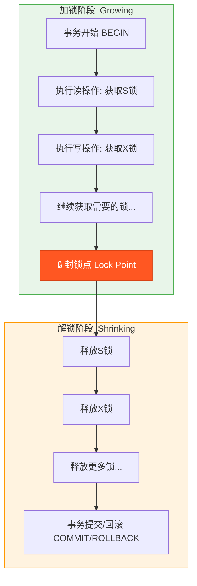
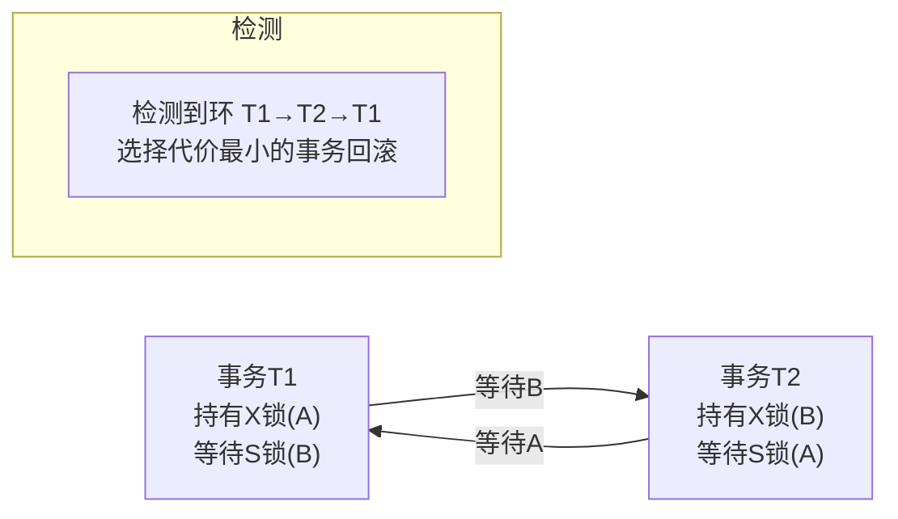

# 两阶段锁 2PL (Two-Phase Locking)
> 创建日期：2026-06-08
> 难度：⭐⭐⭐
> 前置知识：事务ACID、锁机制、死锁、可串行化调度
> 关联模块：MySQL InnoDB 锁系统、PostgreSQL 锁管理、分布式事务

## ⭐ 面试重点速览

| 考察点 | 重要程度 | 考察频率 | 掌握目标 |
|--------|---------|---------|---------|
| 两阶段的定义（加锁阶段 + 解锁阶段） | 极高 | 极高 | 能手动画出两阶段示意图并解释规则 |
| 严格2PL (Strict 2PL) 与基本2PL的区别 | 极高 | 极高 | 能说出严格2PL解决级联回滚的原理 |
| 2PL 如何保证冲突可串行化 | 高 | 高 | 能画出依赖图并证明无环 |
| 死锁的四种条件 + 检测方法（等待图） | 高 | 高 | 能手动画出等待图并判断死锁 |
| 死锁预防策略（Wait-Die / Wound-Wait） | 中 | 中 | 能对比两种策略的取舍 |
| 2PL vs MVCC 的并发性能对比 | 中 | 中 | 能说出各自的适用场景和瓶颈 |
| 锁升级（Lock Escalation）原理 | 中 | 低 | 能说明行锁转表锁的触发条件 |

---

## 一、应用场景 🎯

2PL 是数据库并发控制中最经典的协议之一，通过锁机制保证事务调度的冲突可串行化。

| 场景 | 说明 |
|------|------|
| **ACID 事务隔离** | 在 SERIALIZABLE 隔离级别下，2PL 确保事务调度的可串行化 |
| **金融转账** | 银行扣款和入账必须串行化执行，不能出现金额错误 |
| **库存扣减** | 秒杀场景下的库存操作必须防止超卖，2PL 通过排他锁保证互斥 |
| **订单生成** | 订单号自增、库存校验和订单写入必须原子化 |
| **分布式事务** | 跨数据库节点的操作需要全局锁协调（与2PC配合） |
| **在线DDL** | 表结构变更时的元数据锁（MDL）遵循2PL思想：DDL执行期间持有锁，提交后释放 |

**核心价值**：2PL 是数据库理论的基石，几乎所有关系型数据库在实现 SERIALIZABLE 隔离级别时都依赖 2PL 或其变体（如 SS2PL）。

---

## 二、核心原理 🔬

### 2.1 两阶段的定义

2PL 的核心规则非常简单——一个事务在执行过程中分为两个阶段：

```
【加锁阶段 (Growing Phase)】→ 只能获取锁，不能释放锁
        ↓  获取最后一个锁的时刻称为"封锁点"（Lock Point）
【解锁阶段 (Shrinking Phase)】 → 只能释放锁，不能获取新锁
```

| 阶段 | 允许操作 | 禁止操作 |
|------|---------|---------|
| 加锁阶段 (Growing) | 获取S锁/获取X锁 | 释放任何锁 |
| 解锁阶段 (Shrinking) | 释放S锁/释放X锁 | 获取任何新锁 |

**关键点**：一旦事务释放了第一个锁，就进入了不可逆的解锁阶段，此后不能再获取任何锁。

### 2.2 2PL 变体

| 变体 | 解锁时间 | 级联回滚风险 | 实现复杂度 |
|------|---------|-------------|-----------|
| **基本2PL** | 操作完成后立即释放不需要的锁 | 存在（严重） | 低 |
| **严格2PL (Strict 2PL)** | 所有排他锁在事务提交/回滚后才释放 | 不存在 | 中 |
| **强严格2PL (Rigorous 2PL)** | 所有锁（含共享锁）在事务提交/回滚后才释放 | 不存在 | 中 |
| **SS2PL (Strong Strict 2PL)** | 同严格2PL，但要求遵循2PL且锁持有到提交 | 不存在 | 中 |

MySQL InnoDB 的 SERIALIZABLE 隔离级别实质上实现的就是 SS2PL：所有 S 锁和 X 锁都持有到事务提交才释放。

### 2.3 Mermaid 流程图：2PL 两阶段图



### 2.4 严格2PL 解决级联回滚

**级联回滚问题**：基本2PL下，事务T1修改数据后释放X锁，事务T2读取了T1的未提交数据（脏读）。若T1回滚，T2也必须跟着回滚，进而可能引发T3、T4...连锁回滚。

```
基本2PL：               严格2PL：
T1: W(A) 释放X锁        T1: W(A) 持有X锁直到提交
T2:      读A（脏读！）    T2:      获取S锁失败 → 等待
T1:      回滚            T1:      提交，释放X锁
T2:      被迫回滚 ← 级联   T2:      获取S锁成功，读到干净数据
```

严格2PL 通过将锁持有到提交/回滚，从根本上杜绝了脏读和级联回滚。

### 2.5 死锁检测与预防

2PL 天然容易引发死锁。两个事务各持有一部分资源并互相等待对方释放资源时，死锁发生。

**死锁检测 —— 等待图 (Wait-for Graph)**：



**InnoDB 死锁检测机制**：
- InnoDB 内部维护一个等待图（wait-for graph）
- 当事务等待锁时，检测等待图中是否形成环路
- 如果检测到环路，选择一个"代价最小"的事务回滚（undo 量最小的事务）
- 通过 `innodb_deadlock_detect=ON` 控制（默认开启），可通过 `SHOW ENGINE INNODB STATUS` 查看最近死锁信息

**死锁预防策略**：

| 策略 | 规则 | 优点 | 缺点 |
|------|------|------|------|
| **Wait-Die** | 老事务等新事务：等待；新事务等老事务：直接回滚 | 避免饥饿（老事务不会被回滚） | 新事务可能重复回滚 |
| **Wound-Wait** | 老事务等新事务：抢占（新事务回滚）；新事务等老事务：等待 | 减少不必要回滚 | 老事务可能过度抢占 |
| **超时机制** | 等待超过 `innodb_lock_wait_timeout`（默认50s）则回滚 | 实现简单 | 时间阈值难以选择 |
| **顺序加锁** | 所有事务按相同顺序获取锁（如先A后B） | 从根源预防死锁 | 难以全局强制 |

### 2.6 锁升级 (Lock Escalation)

当大量行锁累积时，数据库可能将多个行锁升级为单个表锁以减少内存开销：

```
1000个行锁 → 1个表锁
```

| 数据库 | 锁升级行为 |
|--------|-----------|
| SQL Server | 默认开启，行锁数超过阈值（约5000）自动升级为表锁 |
| DB2 | 支持锁升级，可配置阈值 |
| MySQL InnoDB | **不支持锁升级**（使用位图管理行锁，内存效率高） |
| PostgreSQL | 不支持锁升级（行锁存储在元组头中，不占用额外共享内存） |

### 2.7 2PL vs MVCC 对比

| 对比维度 | 2PL (SERIALIZABLE) | MVCC (RR/RC) |
|----------|-------------------|--------------|
| 读操作 | 加S锁，阻塞写 | 快照读，不加锁，不阻塞 |
| 写操作 | 加X锁，阻塞读和写 | 当前读 + X锁，阻塞写但不阻塞快照读 |
| 并发度 | 低（读写互斥） | 高（读写不互斥） |
| 死锁风险 | 高 | 较低（读不加锁） |
| 存储开销 | 锁表（内存开销） | Undo Log（磁盘开销） |
| 串行化保证 | 天然保证 | 需额外机制（如间隙锁） |
| 典型场景 | 强一致性需求（金融） | 高并发读多写少（互联网） |

---

## 三、趣味解说 🎭

> **吃饭点菜——所有菜点完（加锁）才能下单提交，吃完结账（解锁）**

你和三个朋友去饭店吃饭，但这家店有个奇怪的规矩：

**加锁阶段（点菜）**：你们拿着菜单，每点一个菜就在上面做标记（加锁）。在这期间，**不能撤掉已经点的菜（不能解锁）**。你们只能不停地翻菜单、加菜，直到把所有想吃的都点完。

**封锁点**：当你们说"老板，就这些了"——这就是封锁点。此时所有菜都锁定了。

**解锁阶段（上菜+结账）**：服务员拿走菜单开始上菜。上完一道菜，菜单上那道菜的标记就去掉了（解锁）。但是从这一刻起，你们**不能再加新菜（不能再加锁）**。

现在的问题是——如果你们的点菜和隔壁桌的点菜产生了冲突：

- 你们点了最后一份红烧肉（X锁）
- 隔壁桌也想要红烧肉，但看到被你们预定了，只能等待
- 同时你们又在等隔壁桌预定的最后一份糖醋鱼
- 隔壁桌在等你们的红烧肉...

**死锁了！**

餐厅经（数）理（据）看（库）到后，挑了一个看起来吃得最少（undo量最小）的桌，说："你们这桌全给我吐出来，重新点！" —— 这就是 InnoDB 的死锁检测回滚。

而**严格2PL** 就是：菜做好了你也不能当场就吃，必须等所有菜都上齐了（事务提交）才统一开吃。这样如果中途发现某个菜有问题（回滚），也不会有桌人已经吃下肚（级联回滚）。

---

## 四、代码实现 💻

### 4.1 锁管理系统 (Java 模拟)

```java
import java.util.*;
import java.util.concurrent.ConcurrentHashMap;

/**
 * 两阶段锁 (2PL) 锁管理器的 Java 模拟实现
 * 支持 S锁(共享锁)、X锁(排他锁)，以及死锁检测
 */
public class TwoPhaseLockManager {
    // 锁的类型
    public enum LockType { SHARED, EXCLUSIVE }  // S锁(读) / X锁(写)

    // 每个数据项的锁信息
    private static class LockEntry {
        final Set<Long> sharedHolders = new HashSet<>();  // 持有S锁的事务ID集合
        Long exclusiveHolder = null;  // 持有X锁的事务ID（X锁同一时间只能一个事务持有）

        boolean canGrantSLock() {
            return exclusiveHolder == null;  // 无X锁即可授予S锁
        }

        boolean canGrantXLock(long trxId) {
            return (exclusiveHolder == null && sharedHolders.isEmpty())
                || (exclusiveHolder != null && exclusiveHolder == trxId);  // 无任何锁 或 自己已有X锁
        }
    }

    // 锁表: 数据项ID → 锁条目
    private final Map<String, LockEntry> lockTable = new ConcurrentHashMap<>();
    // 每个事务持有的锁: 事务ID → {数据项ID → 锁类型}
    private final Map<Long, Map<String, LockType>> trxLocks = new ConcurrentHashMap<>();
    // 等待图: 等待事务ID → 被等待的事务ID列表
    private final Map<Long, Set<Long>> waitForGraph = new ConcurrentHashMap<>();

    // ========== 加锁（加锁阶段） ==========

    /**
     * 申请共享锁 (S锁)，用于读操作
     *
     * @param trxId 事务ID
     * @param itemId 数据项ID
     * @param strictMode 是否严格2PL模式（严格模式下锁持有到事务结束）
     * @return true=获取成功, false=需要等待
     */
    public synchronized boolean acquireSLock(long trxId, String itemId, boolean strictMode) {
        LockEntry entry = lockTable.computeIfAbsent(itemId, k -> new LockEntry());

        if (entry.canGrantSLock()) {
            // 授予S锁：共享锁可以有多个持有者
            entry.sharedHolders.add(trxId);
            recordLock(trxId, itemId, LockType.SHARED);
            return true;
        }
        // 有X锁占用 → 加入等待（记录等待关系用于死锁检测）
        if (entry.exclusiveHolder != null) {
            addWaitEdge(trxId, entry.exclusiveHolder);
        }
        return false;
    }

    /**
     * 申请排他锁 (X锁)，用于写操作
     */
    public synchronized boolean acquireXLock(long trxId, String itemId, boolean strictMode) {
        LockEntry entry = lockTable.computeIfAbsent(itemId, k -> new LockEntry());

        if (entry.canGrantXLock(trxId)) {
            // 授予X锁：独占所有锁
            entry.exclusiveHolder = trxId;
            recordLock(trxId, itemId, LockType.EXCLUSIVE);
            return true;
        }
        // 有其他事务持有锁 → 加入等待
        if (entry.exclusiveHolder != null && entry.exclusiveHolder != trxId) {
            addWaitEdge(trxId, entry.exclusiveHolder);
        }
        for (Long holder : entry.sharedHolders) {
            if (holder != trxId) {
                addWaitEdge(trxId, holder);  // 等待所有S锁持有者释放
            }
        }
        return false;
    }

    // ========== 解锁（解锁阶段） ==========

    /**
     * 释放事务持有的所有锁（事务提交/回滚时调用）
     */
    public synchronized void releaseAllLocks(long trxId) {
        Map<String, LockType> held = trxLocks.remove(trxId);
        if (held == null) return;

        for (Map.Entry<String, LockType> e : held.entrySet()) {
            String itemId = e.getKey();
            LockEntry entry = lockTable.get(itemId);
            if (entry == null) continue;

            if (e.getValue() == LockType.EXCLUSIVE) {
                entry.exclusiveHolder = null;  // 释放X锁
            } else {
                entry.sharedHolders.remove(trxId);  // 释放S锁
            }
            // 如果该数据项上没有锁了，移除锁条目
            if (entry.sharedHolders.isEmpty() && entry.exclusiveHolder == null) {
                lockTable.remove(itemId);
            }
        }
        // 清理等待图中的边
        waitForGraph.remove(trxId);
    }

    // ========== 死锁检测 —— 等待图环路检测 ==========

    /**
     * 检测等待图中是否存在环路（死锁）
     *
     * @return 参与死锁的事务ID列表；若不存在死锁则返回空列表
     */
    public synchronized List<Long> detectDeadlock() {
        Map<Long, Integer> color = new HashMap<>();  // 0=白, 1=灰, 2=黑
        Map<Long, Long> parent = new HashMap<>();    // 用于回溯环路路径

        for (Long trxId : waitForGraph.keySet()) {
            color.put(trxId, 0);  // 初始化为白色（未访问）
        }

        for (Long trxId : waitForGraph.keySet()) {
            if (color.get(trxId) == 0) {
                List<Long> cycle = dfsCycle(trxId, color, parent);
                if (!cycle.isEmpty()) return cycle;  // 找到死锁环路
            }
        }
        return Collections.emptyList();  // 无死锁
    }

    /**
     * DFS深度优先搜索检测环（灰色节点再被访问即为环）
     */
    private List<Long> dfsCycle(Long node, Map<Long, Integer> color, Map<Long, Long> parent) {
        color.put(node, 1);  // 标记为灰色（正在访问）
        Set<Long> neighbors = waitForGraph.getOrDefault(node, Collections.emptySet());

        for (Long neighbor : neighbors) {
            Integer neighborColor = color.getOrDefault(neighbor, 0);
            if (neighborColor == 1) {
                // 发现环！回溯构建环路路径
                List<Long> cycle = new ArrayList<>();
                Long cur = node;
                while (cur != null && !cur.equals(neighbor)) {
                    cycle.add(cur);
                    cur = parent.get(cur);
                }
                cycle.add(neighbor);
                cycle.add(node);
                return cycle;  // 返回环路中的事务ID
            }
            if (neighborColor == 0) {
                parent.put(neighbor, node);
                List<Long> result = dfsCycle(neighbor, color, parent);
                if (!result.isEmpty()) return result;
            }
        }
        color.put(node, 2);  // 标记为黑色（已完成）
        return Collections.emptyList();
    }

    // ========== 辅助方法 ==========

    /** 记录事务获取的锁 */
    private void recordLock(long trxId, String itemId, LockType type) {
        trxLocks.computeIfAbsent(trxId, k -> new HashMap<>()).put(itemId, type);
    }

    /** 在等待图中添加边: 等待者 → 持有者 */
    private void addWaitEdge(long waiter, long holder) {
        waitForGraph.computeIfAbsent(waiter, k -> new HashSet<>()).add(holder);
    }

    /** 锁兼容矩阵 */
    public static boolean isCompatible(LockType held, LockType requested) {
        if (held == LockType.SHARED && requested == LockType.SHARED) return true;  // S + S 兼容
        return false;  // S + X 不兼容, X + 任何 不兼容
    }

    public Map<Long, Map<String, LockType>> getTrxLocks() { return trxLocks; }
    public Map<Long, Set<Long>> getWaitForGraph() { return waitForGraph; }
}
```

### 4.2 死锁预防 —— Wait-Die 策略

```java
import java.util.*;

/**
 * Wait-Die 死锁预防策略
 * 规则：每个事务分配一个时间戳(trxId可作时间戳)。
 *   - 老事务等新事务 → 等待
 *   - 新事务等老事务 → 直接回滚(Die)，稍后重试
 * 原理：只允许从老到新的等待方向，破坏死锁的环路条件
 */
public class WaitDieLockManager extends TwoPhaseLockManager {
    // 事务开始时间戳（用纳秒做近似时间戳）
    private final Map<Long, Long> trxStartTime = new HashMap<>();

    public void beginTransaction(long trxId) {
        trxStartTime.put(trxId, System.nanoTime());
    }

    /**
     * Wait-Die 加锁逻辑
     */
    public boolean acquireLockWaitDie(long trxId, String itemId, LockType type) {
        while (true) {
            // 先尝试获取锁
            if (type == LockType.SHARED) {
                if (acquireSLock(trxId, itemId, true)) return true;
            } else {
                if (acquireXLock(trxId, itemId, true)) return true;
            }

            // 未获取到 → 等待图中存在边 → 判断 Wait-Die
            Set<Long> waited = getWaitForGraph().getOrDefault(trxId, Collections.emptySet());
            for (Long holder : waited) {
                if (trxStartTime.get(trxId) > trxStartTime.getOrDefault(holder, 0L)) {
                    // 我是新事务，对方是老事务 → Die！直接回滚
                    releaseAllLocks(trxId);
                    return false;  // 调用方收到false后应重新开始事务
                }
                // 我是老事务，对方是新事务 → Wait，循环重试
            }

            try { Thread.sleep(10); } catch (InterruptedException e) { break; }
        }
        return false;
    }
}
```

### 4.3 2PL 事务执行示例

```java
/**
 * 模拟两个并发事务通过2PL执行转账操作
 */
public class TwoPhaseLockingDemo {
    public static void main(String[] args) {
        WaitDieLockManager lockMgr = new WaitDieLockManager();

        long t1 = 1001;  // 事务T1（老事务）
        long t2 = 1002;  // 事务T2（新事务）

        lockMgr.beginTransaction(t1);
        lockMgr.beginTransaction(t2);

        // T1: 从账户A扣款100 → 需要A的X锁
        if (lockMgr.acquireLockWaitDie(t1, "account_A", TwoPhaseLockManager.LockType.EXCLUSIVE)) {
            // T2: 从账户B扣款100 → 需要B的X锁
            if (lockMgr.acquireLockWaitDie(t2, "account_B", TwoPhaseLockManager.LockType.EXCLUSIVE)) {
                // T1: 还要操作账户B → 需要B的X锁(但已被T2持有，T1等待)
                boolean t1GotB = lockMgr.acquireLockWaitDie(t1, "account_B",
                    TwoPhaseLockManager.LockType.EXCLUSIVE);
                // T2: 还要操作账户A → 需要A的X锁(但已被T1持有，T2等待)
                boolean t2GotA = lockMgr.acquireLockWaitDie(t2, "account_A",
                    TwoPhaseLockManager.LockType.EXCLUSIVE);

                // 死锁检测
                List<Long> deadlockCycle = lockMgr.detectDeadlock();
                if (!deadlockCycle.isEmpty()) {
                    System.out.println("检测到死锁环路: " + deadlockCycle);
                    // InnoDB做法：选择回滚代价最小的事务
                    lockMgr.releaseAllLocks(t2);  // 回滚T2
                    System.out.println("回滚事务 T2，T1 继续执行");
                }
            }
        }
        // 提交：释放所有锁
        lockMgr.releaseAllLocks(t1);
        lockMgr.releaseAllLocks(t2);
    }
}
```

---

## 五、优缺点 ⚖️

### 优点

| 优点 | 说明 |
|------|------|
| **理论完备** | 2PL 是冲突可串行化的充分条件，有严格的数学证明 |
| **实现直观** | "先加锁再解锁"的规则简单，易于理解和实现 |
| **强一致性** | 严格2PL 杜绝脏读、不可重复读、幻读，天然保证 SERIALIZABLE |
| **无级联回滚** | 严格2PL 版本将锁持有到提交，避免了级联回滚问题 |
| **与2PC自然结合** | 在分布式事务中，2PL 的锁持有到提交的特性与2PC协议天然适配 |

### 缺点

| 缺点 | 说明 |
|------|------|
| **并发度低** | 读操作也要加S锁，会阻塞写操作；写操作加X锁会阻塞所有操作。读写互斥严重制约并发 |
| **死锁风险高** | 锁的持有和等待天然容易形成等待环路，需要额外的死锁检测/预防机制 |
| **锁膨胀开销** | 大量行锁消耗内存，频繁的锁获取/释放带来CPU开销 |
| **长事务影响大** | 长事务持有锁不放，导致大量其他事务排队等待 |
| **不能解决所有异常** | 基本2PL 不能防止脏读和级联回滚，需要严格2PL才能解决 |

---

## 六、面试高频题 📝

**Q1：什么是两阶段锁？为什么要分为两个阶段？**

答：2PL 要求事务分为两个阶段：**加锁阶段（Growing）**只能获取锁不能释放锁，**解锁阶段（Shrinking）**只能释放锁不能获取锁。分为两个阶段的目的是保证**冲突可串行化**：如果事务随意加锁解锁，可能出现不可串行化的调度；而一旦事务释放了任何锁，就不应该再获取新锁——否则可能与其他事务形成不可串行化的依赖关系。

**Q2：严格2PL (Strict 2PL) 与基本2PL 的区别是什么？**

答：基本2PL 只要求遵循两阶段规则，事务可以在提交前释放锁。严格2PL 要求**所有排他锁在事务提交/回滚后才释放**。区别在于：基本2PL 存在脏读和级联回滚问题（释放X锁后其他事务可读到未提交数据）；严格2PL 将X锁持有到提交，彻底杜绝了这些问题。

**Q3：2PL 如何检测死锁？**

答：通过**等待图（Wait-for Graph）**检测死锁。每个事务是图中的节点，如果事务T1等待T2持有的锁，则有一条T1到T2的有向边。如果图中形成环路，则发生了死锁。InnoDB 实时维护等待图，当检测到环路时，选择 undo 量最小的事务进行回滚。

**Q4：2PL 和 MVCC 在并发控制中各有什么优势？**

答：2PL 适合**写密集型**和对一致性要求极高的场景（如金融交易），通过锁机制严格保证串行化。MVCC 适合**读密集型**的高并发场景（如互联网应用），读操作不加锁不阻塞写操作。现代数据库通常同时实现二者：MVCC 用于较低隔离级别（RC/RR），2PL 用于 SERIALIZABLE 级别。

**Q5：Wait-Die 和 Wound-Wait 的区别？**

答：两者都基于事务时间戳预防死锁。Wait-Die：老事务等新事务时**等待**，新事务等老事务时**自己回滚（Die）**。Wound-Wait：老事务等新事务时**抢先（Wound，让新事务回滚）**，新事务等老事务时**等待**。Wait-Die 偏向保护老事务（不会被回滚），Wound-Wait 偏向减少回滚次数（老事务优先）。

---

## 七、常见误区 ❌

| 误区 | 纠正 |
|------|------|
| "2PL 就是两阶段提交（2PC）" | 2PL 是**并发控制协议**（管理锁），2PC 是**分布式提交协议**（协调多节点提交）。虽然名字相似且常同时使用，但解决的问题完全不同。 |
| "加锁阶段和解锁阶段的时间各占一半" | "两阶段"指的是**操作类型的阶段划分**，而非时间。加锁阶段可能非常短（只加几个锁），解锁阶段也可能在事务结束后一次性完成。 |
| "释放S锁不算进入解锁阶段" | 2PL 规则是**释放任何一个锁**即进入解锁阶段。无论是S锁还是X锁，一旦释放就不可逆。但在严格2PL中通常所有锁统一在提交时释放。 |
| "有了MVCC就不需要2PL了" | MVCC 解决的是读-写冲突，写-写冲突仍需锁机制。SERIALIZABLE 隔离级别的快照隔离（SSI）也需要额外检测机制，并非完全替代2PL。 |
| "死锁检测会消耗大量性能" | InnoDB 的死锁检测确实有开销（`innodb_deadlock_detect=ON`），在高并发场景下可能成为瓶颈（等待图遍历 O(V+E)），MySQL 8.0 对此做了优化。 |
| "只要按相同顺序加锁就能完全避免死锁" | 理论上可行，但在实际系统中很难对所有事务强制执行统一的加锁顺序（特别是涉及多表 Join 的复杂查询），且顺序加锁可能降低并发度。 |
| "2PL 下读操作永远不阻塞写操作" | 这恰恰是2PL的弱点。2PL下读操作加S锁，S锁和X锁互斥，所以读操作会阻塞写操作，写操作也会阻塞读操作。MVCC 才实现了读写不互斥。 |